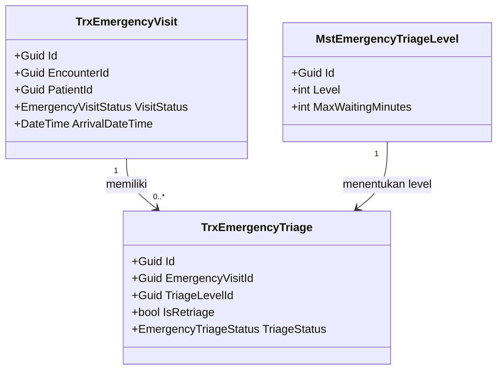
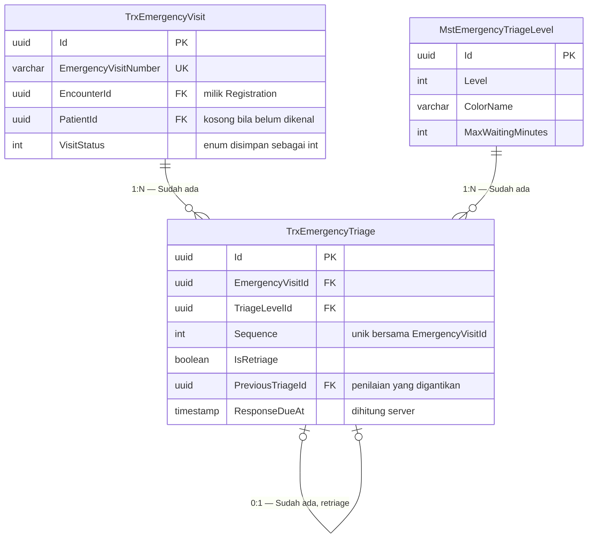

# Template Class Diagram, ERD, dan Kamus Data

Semua diagram memakai Mermaid sebagai blok kode di dalam markdown. Alasannya: tampil sebagai
gambar di GitHub dan VS Code, tetap terbaca sebagai teks, dan perubahannya dapat ditelusuri
git baris per baris.

Aturan yang berlaku untuk seluruh diagram: **satu diagram MUST muat dibaca dalam satu layar.**
Pecah per bounded context atau per kelompok proses. Modul dengan 15 model **MUST NOT**
digambar dalam satu diagram.

---

## 1. Class diagram

Ditempatkan di `02-backend-architecture.md`.

### 1.1 Bentuk diagram

````markdown

````

Tampilkan hanya field yang penting bagi pembaca diagram: kunci, status, dan field yang dipakai
aturan bisnis. Field lengkap ada di kamus data, bukan di diagram.

### 1.2 Tabel penjelasan setiap class

Setiap class yang muncul di diagram **MUST** punya tabel berikut. Dua baris pertama adalah
yang paling sering terlupa dan paling dibutuhkan implementer.

| Aspek | Penjelasan |
| --- | --- |
| **Status** | `Baru` / `Diperbarui` / `Sudah ada` |
| **Lokasi file** | Path lengkap, mengikuti [backend-structure-rules.md](backend-structure-rules.md) |
| Kategori | Master / Transaksi / Service / Controller / Configuration |
| Tanggung jawab utama | Satu paragraf, bahasa yang dipahami orang umum |
| Field penting | Daftar field beserta tipe |
| Navigation property dan relasi | Hubungan ke class lain |
| Pemakaian dalam alur bisnis | Kapan class ini aktif, dari sudut pandang petugas |
| Catatan desain | Larangan dan jebakan yang perlu dihindari |
| Ekuivalen model lama | Diisi bila menggantikan class lama; tulis `—` bila tidak ada |

Contoh terisi:

| Aspek | Penjelasan |
| --- | --- |
| **Status** | `Diperbarui` |
| **Lokasi file** | `Areas/HealthServices/EmergencyInstallationManagement/Models/TrxEmergencyTriage.cs` |
| Kategori | Transaksi IGD |
| Tanggung jawab utama | Menyimpan satu episode penilaian triage. Penilaian ulang membuat baris baru, tidak menimpa baris lama, agar perubahan kondisi pasien dapat ditelusuri |
| Field penting | `EmergencyVisitId`, `TriageLevelId`, `IsRetriage`, `PreviousTriageId`, `TriageStatus`, `ResponseDueAt` |
| Navigation property dan relasi | Milik `TrxEmergencyVisit`; menunjuk `MstEmergencyTriageLevel`; punya banyak `TrxEmergencyTriageDetail` |
| Pemakaian dalam alur bisnis | Dibuat perawat saat pasien dinilai pertama kali, dan setiap kali dinilai ulang |
| Catatan desain | Jangan menimpa baris lama saat retriage. Target waktu respons diambil dari master, jangan di-hardcode |
| Ekuivalen model lama | `IGDTriage` |

### 1.3 Service dan controller juga dijelaskan

Class diagram dan tabel penjelasan **MUST** mencakup service dan controller, bukan hanya
model. Untuk keduanya, tambahkan:

| Aspek tambahan | Untuk |
| --- | --- |
| Service yang dipakai | Controller |
| Dipanggil oleh | Service |
| Membuka transaksi database | Service |
| Endpoint yang diurus | Controller |

Controller yang tidak memakai service **MUST** dinyatakan alasannya, misalnya *"CRUD sederhana,
memakai `ApplicationDbContext` langsung"*.

---

## 2. ERD

Ditempatkan di `erd/`.

| File | Isi |
| --- | --- |
| `00-context-erd.md` | Peta antar bounded context beserta arah ketergantungannya |
| `<bounded-context>.md` | ERD detail satu konteks, misalnya `emergency-episode.md` |
| `data-dictionary.md` | Kamus data per kolom |

### 2.1 Bentuk diagram

ERD **MUST** menampilkan kolom di dalam kotak entity, bukan hanya garis relasi. Diagram yang
hanya memuat nama tabel tidak memenuhi kontrak ini — pembaca tidak dapat melihat parameter
tanpa membuka dokumen lain.

Status entity ditulis pada label relasi agar terbaca tanpa legenda terpisah.

````markdown

````

Aturan isi kotak entity:

| Aturan | Alasan |
| --- | --- |
| Tampilkan PK, seluruh FK, kolom status, dan kolom yang dipakai aturan bisnis | Itu yang dicari pembaca saat membaca ERD |
| Tandai `PK`, `FK`, dan `UK` | Menunjukkan kunci tanpa perlu legenda |
| Pakai tipe basis data, bukan tipe bahasa | `uuid`, bukan `Guid`; `timestamp`, bukan `DateTime` |
| Enum ditulis `int` disertai keterangan | Mengikuti `HasConversion<int>` pada EF Core |
| Kolom audit `IdentityModel` **MUST NOT** digambar | Sepuluh kolom yang sama di setiap tabel membuat diagram tidak terbaca |
| Kolom sensitif boleh diringkas | Delapan kolom ringkasan klinis cukup diwakili satu baris berketerangan |

Notasi kardinalitas Mermaid yang dipakai:

| Notasi | Arti |
| --- | --- |
| `||--||` | Satu ke satu, keduanya wajib |
| `||--o{` | Satu ke banyak, sisi banyak boleh kosong |
| `|o--o|` | Nol atau satu ke nol atau satu |

### 2.2 Tabel status entity

Mendampingi setiap ERD:

| Entity | Status | Owner | Catatan |
| --- | --- | --- | --- |
| `TrxPatientEncounter` | Sudah ada | Registration Management | Direferensikan, **MUST NOT** disalin |
| `TrxEmergencyVisit` | Sudah ada | Emergency Installation | — |
| `TrxEmergencyTriage` | Diperbarui | Emergency Installation | Tambah kolom penilaian pengganti |
| `TrxEmergencyWaitingAlert` | Baru | Emergency Installation | Tabel baru |

---

## 3. Kamus data

Ditempatkan di `erd/data-dictionary.md`.

### 3.1 Kedalaman mengikuti status tabel

Ini menghindari menyalin ratusan kolom yang tidak berubah.

| Status tabel | Yang wajib didokumentasikan |
| --- | --- |
| **Baru** | Seluruh kolom |
| **Diperbarui** | Seluruh kolom |
| **Sudah ada** | Kolom kunci saja: PK, FK, kolom status, dan kolom yang dipakai aturan bisnis modul ini. Ditambah rujukan ke file model sebagai sumber lengkap |

Bila modul menambah kolom pada tabel yang tadinya `Sudah ada`, statusnya berubah menjadi
`Diperbarui` dan seluruh kolomnya wajib ditulis.

Sepuluh kolom warisan `IdentityModel` **MUST NOT** diulang. Tulis satu kali di kepala dokumen.

### 3.2 Bentuk tabel

| Kolom | Tipe | Wajib | Bawaan | Index | Relasi | Perilaku hapus | Sensitif | Keterangan |
| --- | --- | :---: | --- | --- | --- | --- | :---: | --- |
| `Id` | `Guid` | Ya | `Guid.NewGuid()` | PK | — | — | Tidak | Kunci utama |
| `EmergencyVisitId` | `Guid` | Ya | — | Index | FK ke `TrxEmergencyVisit` | `Restrict` | Tidak | Induk kunjungan IGD |
| `TriageLevelId` | `Guid` | Ya | — | Index | FK ke `MstEmergencyTriageLevel` | `Restrict` | Tidak | Level triage yang ditetapkan |
| `IsRetriage` | `bool` | Ya | `false` | — | — | — | Tidak | Menandai penilaian ulang |
| `ResponseDueAt` | `DateTime?` | Tidak | — | Index | — | — | Tidak | Batas waktu respons, dihitung dari master |
| `ChiefComplaint` | `string(1000)` | Tidak | — | — | — | — | **Ya** | Keluhan utama pasien |

### 3.3 Kolom Sensitif

Kolom bertanda **Ya** pada kolom Sensitif:

- **MUST NOT** masuk ke custom logger;
- **MUST NOT** dipakai sebagai contoh berisi data asli di dokumentasi;
- **SHOULD** ditinjau kebutuhan maskingnya pada response DTO.

Penandaan ini bukan hiasan. Ia menjadi masukan langsung bagi aturan logging dan bagi
`permission-audit-matrix.md`.

### 3.4 Contoh kepala dokumen

```markdown
# Kamus Data — Modul IGD

Seluruh tabel mewarisi `IdentityModel`, sehingga memiliki kolom audit `CreateDateTime`,
`CreateBy`, `UpdateDateTime`, `UpdateBy`, `DeleteDateTime`, `DeleteBy`, `CancelDateTime`,
`CancelBy`, `IsCancel`, dan `IsDelete`. Kolom-kolom itu tidak diulang pada tabel di bawah.

Penghapusan bersifat penandaan melalui `IsDelete`, bukan penghapusan baris.
```

---

## 4. Skema tabel dalam bentuk DDL

Kamus data **MUST** disertai bentuk DDL untuk tabel berstatus `Baru` dan `Diperbarui`. Tabel
`Sudah ada` yang tidak berubah cukup dirujuk file configuration-nya.

### 4.1 Peringatan wajib di kepala bagian

Basis data project ini dibentuk EF Core Migrations, bukan skrip SQL manual. DDL pada blueprint
adalah **dokumentasi bentuk tabel**, bukan skrip yang dijalankan. Bagian DDL **MUST** dibuka
dengan peringatan ini agar tidak ada yang menjalankannya dan berbenturan dengan migration.

### 4.2 Sumber kebenaran DDL

Ambil dari file configuration, bukan dari tebakan:

| Yang diambil | Dari |
| --- | --- |
| Nama tabel dan schema | `builder.ToTable("Nama", "public")` |
| Primary key | `builder.HasKey(...)` |
| Panjang string | `builder.Property(x => x.Kolom).HasMaxLength(n)` |
| Enum sebagai integer | `builder.Property(...).HasConversion<int>()` |
| Index dan unique | `builder.HasIndex(...)` dan `.IsUnique()` |
| Foreign key dan perilaku hapus | `builder.HasOne(...).OnDelete(...)` |

### 4.3 Bentuk yang dipakai

PostgreSQL dengan identifier dikutip, karena EF Core memakai penamaan PascalCase.

````markdown
```sql
-- Bentuk tabel sebagaimana dihasilkan EF Core. Bukan skrip untuk dijalankan.
CREATE TABLE public."TrxEmergencyTriage" (
    "Id"                 uuid         NOT NULL,
    "EmergencyVisitId"   uuid         NOT NULL,
    "TriageStatus"       integer      NOT NULL,  -- enum, HasConversion<int>
    "TriageReason"       varchar(1000),          -- SENSITIF
    "ResponseDueAt"      timestamp,
    -- kolom audit IdentityModel tidak ditulis ulang di sini

    CONSTRAINT "PK_TrxEmergencyTriage" PRIMARY KEY ("Id"),
    CONSTRAINT "FK_TrxEmergencyTriage_TrxEmergencyVisit_EmergencyVisitId"
        FOREIGN KEY ("EmergencyVisitId")
        REFERENCES public."TrxEmergencyVisit" ("Id") ON DELETE RESTRICT
);

CREATE UNIQUE INDEX "IX_TrxEmergencyTriage_EmergencyVisitId_Sequence"
    ON public."TrxEmergencyTriage" ("EmergencyVisitId", "Sequence");
```
````

Kolom sensitif **MUST** diberi komentar `-- SENSITIF` agar terbaca langsung oleh implementer
yang menyalin DDL.

Kolom audit `IdentityModel` **MUST NOT** ditulis ulang pada setiap DDL; cukup dinyatakan sekali
di kepala bagian.

