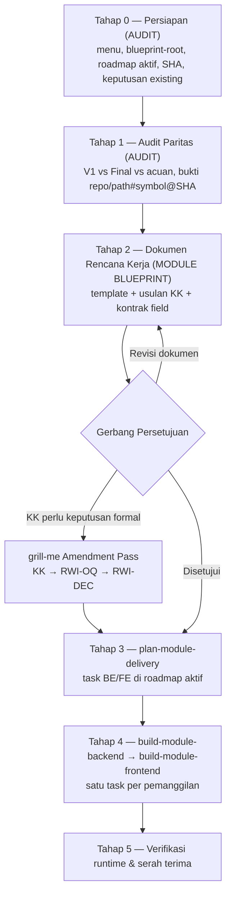

# Skill Pribadi: Modernisasi Menu V1 → QuilvianFinal (v2.1)

Skill ini milik pribadi dan tinggal di `Source Code/.agents/skills/` (workspace Antigravity). Ia
**bukan** bagian dari suite `QuilvianEngineeringSkills`.

Tugasnya adalah menjadi **lensa paritas V1** di atas chain resmi Quilvian, bukan jalan pintas di
luarnya. Untuk satu menu per putaran, skill ini membuktikan apa yang dimiliki V1 dan apa yang sudah
ada di Final. Lalu ia menunjukkan apa yang harus diputuskan manusia. Setelah itu hasilnya diantar
lewat skill resmi sampai terimplementasi dan terverifikasi.

Riwayat versi ada di bagian 8. Versi awal diarsipkan di
[archive/SKILL-v1.0.md](archive/SKILL-v1.0.md).

---

## 0. Kedudukan terhadap Aturan yang Berlaku

### 0.1 Presedensi

Skill pribadi ini **selalu kalah** dari aturan canonical. Urutannya mengikuti
`rules/GLOBAL_RULES.md` bagian 3:

```text
1. Wewenang task/tulis eksplisit dan aturan keselamatan repository
2. AGENTS.md repository target (backend / frontend)
3. rules/backend/engineering/ dan docs/engineering/ (kontrak QBE)
4. rules/backend/ dan rules/frontend/
5. Invariant keamanan dan privasi pada SKILL.md resmi
6. rules/rule-output/
7. Skill pribadi ini, lalu pola source existing
```

Bila skill ini bertentangan dengan salah satu di atas, yang di atas berlaku. Selisihnya dilaporkan
ke user supaya skill ini diperbarui.

### 0.2 Di mana aturan dibaca

Jalur `../../rules/` dari folder skill ini menunjuk ke `Source Code/.agents/rules/`, yang **tidak
ada**. Karena itu aturan dibaca dari lokasi terpasang:

| Runtime | Akar `rules/` |
| --- | --- |
| Antigravity (global, terpasang) | `~/.gemini/config/rules/` |
| Claude Code | `${CLAUDE_PLUGIN_ROOT}/.claude/rules/` |
| Rujukan baca saja bila keduanya tidak terjangkau | `QuilvianFinal/QuilvianEngineeringSkills/agents/rules/` |

Kontrak QBE backend dibaca dari `QuilvianFinal/NewQuilvianSystemBackend/docs/engineering/`.

Bila `AGENTS.md` target atau akar `rules/` tidak terbaca, berhenti dan kembalikan
`BLOCKED — canonical governance unavailable` beserta nama berkasnya.

### 0.3 Batas yang tidak boleh dilanggar

- **Tidak pernah menyunting** `QuilvianEngineeringSkills/**`, `~/.gemini/config/**`, maupun
  `QuilvianV1/**`. Ketiganya hanya dibaca.
- **Tidak menyalin isi aturan** ke skill ini. Berkas di `references/` hanya memuat hal khusus
  modernisasi menu dan menunjuk ke `rules/` untuk sisanya.
- **Source aplikasi hanya diubah lewat runtime skill resmi**:
  `quilvian-engineering-skills:build-module-backend` dan
  `quilvian-engineering-skills:build-module-frontend`, satu task ID per pemanggilan. Bila skill
  resmi tidak tersedia di runtime, kembalikan `BLOCKED — Quilvian runtime skill unavailable`.
  Jangan membaca `SKILL.md` resmi secara manual sebagai pengganti.
- **Tidak pernah otomatis**: `git commit/push/pull/merge/rebase/checkout`, deploy, pembuatan atau
  eksekusi migration, eksekusi SQL/DB, maupun perubahan `appsettings`. Semua itu termasuk mengubah
  `VersionStatus` instrumen dan `AllowDraftVersionsForTesting`, dan masing-masing butuh instruksi
  eksplisit terpisah.

---

## 1. Mode Kerja per Tahap

Mode mengikuti `rules/backend/CROSS_REPO_RULES.md`. Bila target tulis tidak disebut eksplisit, mode
otomatis `AUDIT`.

| Tahap | Mode | Boleh menulis | Dijalankan oleh |
| --- | --- | --- | --- |
| 0 Persiapan, 1 Audit | `AUDIT` | Tidak ada | Skill ini |
| 2 Dokumen rencana kerja | `MODULE BLUEPRINT` | Hanya `<blueprint-root>/roadmap/rencana-kerja/<kategori>/<menu>/<menu>.md` di repo backend | Skill ini |
| Registrasi keputusan | `MODULE BLUEPRINT` | `00-interview-decisions.md` modul | `grill-me` (Amendment Pass) |
| 3 Roadmap | `MODULE BLUEPRINT` | Roadmap aktif dan `requirement-traceability` | `plan-module-delivery` |
| 4 Eksekusi | `BACKEND` / `FRONTEND` | Source repo target, `task/report/<lapisan>/`, baris status roadmap | `build-module-backend` / `build-module-frontend` |
| 5 Verifikasi | `AUDIT`, ditambah `MODULE BLUEPRINT` sempit | Hanya bagian 1 dan 13 dokumen rencana kerja | Skill ini (opsional `verify-module-readiness`) |

Skill ini **tidak pernah** menulis ke `task/report/**`, kartu task roadmap, kontrak, kamus data,
flowchart, atau arsitektur blueprint. Semua itu milik skill resmi pemiliknya
(`rules/rule-output/lokasi-laporan-task.md` bagian 3).

---

## 2. Enam Prinsip

1. **V1 adalah bukti operasional, bukan kebenaran klinis.** V1 menunjukkan apa yang dipakai
   perawat, termasuk bug-nya. Contoh nyata ada di
   `QuilvianSystemFrontendDev/src/components/view/Rawat-Inap/perawat/perawatan-pasien/pengkajian-pasien/resiko-jatuh/Anak-Anak/form-resiko-jatuh-anak.jsx#getRiskCategory@86408f245`
   (repo V1). Form Humpty Dumpty anak di sana memakai ambang Morse ≥45 / 25–44 / 0–24, padahal
   skor Humpty Dumpty maksimal 23. Akibatnya tidak ada anak yang bisa tergolong risiko tinggi.
2. **Satu sumber kebenaran untuk logika klinis.** Untuk rawat inap, hal ini sudah diputuskan
   `RWI-DEC-124` (konfigurasi klinis berversi) dan `RWI-DEC-136`. `RWI-DEC-136` memisahkan hak ubah
   dari hak sahkan, melarang pengubah terakhir mengesahkan, dan melarang batas kategori ditanam di
   source code. Butir, opsi, skor, band, rentang usia, dan daftar intervensi hidup di definisi
   instrumen berversi di server. Frontend hanya menampilkan hasil server. Untuk modul lain, cari
   dulu keputusan setara di register modulnya.
3. **Keputusan hanya lewat register resmi modul.** Skill ini hanya **mengusulkan** keputusan
   (`KK-n`). Keputusan menjadi sah setelah didaftarkan `grill-me` sebagai `<PREFIX>-OQ-###` dan
   diputus sebagai `<PREFIX>-DEC-###` di `00-interview-decisions.md`, misalnya `RWI-OQ-###` →
   `RWI-DEC-###`. Skill ini tidak membuat sistem keputusan tandingan.
4. **Kontrak field dikunci sebelum kode.** Nama properti JSON, tipe, serialisasi enum, nullability,
   bentuk paginasi, aksi yang boleh (`AvailableActions`), dan hak akses (`[AccessPermission]`)
   ditulis per field. Delapan blocker `keperawatan/testing/issues/ISSUE-KEP-001..008` lolos build
   tetapi gagal di runtime karena hal-hal ini.
5. **Inovasi adalah usulan, bukan kewajiban.** Setiap inovasi diberi ID `INV-n`, nilai, risiko, dan
   fase usulan (MVP/Nanti). Hanya yang disetujui yang masuk task.
6. **Build lulus bukan selesai.** `✅` hanya sah bila ketiga syarat
   `rules/rule-output/status-task-roadmap.md` bagian 2.1 terpenuhi: acceptance criteria terpetakan
   ke source, validasi benar-benar dijalankan, dan laporan tracked ada. Status dokumen rencana kerja
   diturunkan dari roadmap, tidak ditulis bebas.

---

## 3. Alur Kerja



### Tahap 0 — Persiapan (`AUDIT`)

1. **Tetapkan menu, kategori, dan `<blueprint-root>`** sesuai `rules/rule-output/bentuk-blueprint.md`.
   Pada bentuk `COMPOSITE`, `<blueprint-root>` adalah folder sub-modul, misalnya
   `docs/module-blueprints/rawat-inap/keperawatan`.
2. **Tetapkan roadmap aktif dari `blueprint-manifest.md`**, yaitu yang bertanda ★ atau berstatus
   `APPROVED`. Contohnya `roadmap/backend-roadmap-v2.md` untuk keperawatan. Jangan menebak dari
   nama berkas.
3. **Cari dokumen existing untuk menu ini** (glob `**/rencana-kerja/**/*<menu>*.md`). Bila sudah
   ada, dokumen itu yang direvisi. Bila ada duplikat, laporkan dan minta user memilih satu yang
   kanonik sebelum lanjut.
4. **Catat SHA keempat repo** dengan perintah read-only `git -C <repo> rev-parse --short HEAD`.
   Bukti ditulis dengan format `repository/path#symbol@SHA`, atau `repository/path:baris@SHA` bila
   tidak ada simbol yang jelas.
5. **Baca keputusan yang sudah ada**, yaitu `DEC`, `OQ`, `CON`, dan `UI-GAP` modul di
   `00-interview-decisions.md` dan `evidence/`, serta `<blueprint-root>/testing/issues/`. Keputusan
   yang sudah ada tidak dibuka ulang sebagai KK baru.
6. **Periksa kebasian.** Dokumen lama yang mengutip SHA berbeda dari `HEAD` saat ini perlu impact
   review pada berkas yang dikutip sebelum isinya dipakai ulang.

Titik bukti yang lazim:

| Sumber | Lokasi |
| --- | --- |
| V1 frontend | `QuilvianV1/QuilvianSystemFrontendDev/src/components/view/<Modul>/...` (keperawatan: `view/Rawat-Inap/perawat/perawatan-pasien/`) |
| V1 capture | `QuilvianV1/QuilvianSystemFrontendDev/captures/<modul>/` |
| V1 backend | `QuilvianV1/QuilvianSystemBackendDev/Areas/`, `Controllers/`, `Models/` |
| Final backend | `QuilvianFinal/NewQuilvianSystemBackend/Areas/HealthServices/...`, seeder instrumen di `ClinicalManagement/Seeders/` |
| Final frontend | `QuilvianFinal/QuilvianSystemFrontendDev/src/components/view/health-services/...`, `src/lib/hooks/health-services/...`, `src/style/health-services/...` |
| Blueprint | `<blueprint-root>/contracts/*.md`, `data/data-dictionary.md`, roadmap aktif, `testing/` |

### Tahap 1 — Audit Paritas (`AUDIT`)

Pola kerjanya mengikuti `trace-existing-capabilities`. Semuanya read-only.

**A. Matriks paritas fitur dan perilaku**

| No | Butir | Bukti V1 | Bukti Final | Status | Catatan |
| --- | --- | --- | --- | --- | --- |

- Setiap sel bukti diisi `repository/path#symbol@SHA` atau nama berkas capture. Tanpa bukti,
  status = `UNKNOWN`.
- Status hanya memakai label canonical: `READY TO REUSE`, `REUSE WITH ADAPTER`, `EXTEND`, `REPAIR`,
  `MISSING`, `CONFLICT`, dan `UNKNOWN`. Dilarang membuat label baru.
- Beda makna antara V1 dan Final → `CONFLICT`. Periksa dulu apakah sudah ada `DEC` yang menjawab.
  Bila belum ada, buka usulan `KK-n`.

**B. Inventaris konten klinis** (wajib bila menu memakai instrumen atau skor)

Buat satu baris per butir: kode, teks, opsi, skor per opsi, band, rentang usia, dan intervensi.
Kolomnya *V1*, *Final (seeder + versi aktif)*, dan *Acuan umum*. Acuan umum diambil dari
`indonesia-hospital-domain-reference` dan selalu bertanda `REFERENCE_ONLY`. Setiap selisih
dicatat sebagai `KK-n`.

**C. Status versi instrumen**

`ClinicalInstrumentDraftSeeder` hanya memperbarui versi yang masih `Draft`
(`NewQuilvianSystemBackend/Areas/HealthServices/ClinicalManagement/Seeders/ClinicalInstrumentDraftSeeder.cs#SeedAsync`).
Versi yang sudah `Approved` tidak tersentuh seeder. Tanyakan status versi di lingkungan target
kepada user; membaca DB butuh izin eksplisit. Status ini menentukan apakah perubahan konten cukup
lewat seeder atau harus lewat versi baru.

### Tahap 2 — Dokumen Rencana Kerja (`MODULE BLUEPRINT`)

Tulis dokumen ke `<blueprint-root>/roadmap/rencana-kerja/<kategori>/<menu>/<menu>.md` memakai
[references/template-rencana-kerja.md](references/template-rencana-kerja.md).

Dokumen ini tunduk penuh pada `rules/rule-output/aturan-output-dokumentasi.md`:

- Bahasa Indonesia yang mudah dipahami perawat, komite, dan manajemen.
- Setiap aturan atau rumus skor punya contoh berangka.
- Proses bisnis memuat sembilan unsur ditambah tabel perubahan status. Flowchart hanya pelengkap.
- Endpoint dikelompokkan per judul `[Tags(...)]`.
- Endpoint yang belum ada ditandai `Rencana (belum tersedia)`.
- Hanya data samaran yang boleh dipakai.
- Jalankan checklist 8 butir aturan itu sebelum dokumen diserahkan.

Tutup Tahap 2 dengan menyajikan tiga hal kepada user:

1. Setiap `KK-n` sebagai pilihan bernomor dengan tepat satu rekomendasi beserta konsekuensinya.
   Gaya penyajiannya sama dengan `rules/frontend/base-component-decision-gate.md` langkah 6.
2. Daftar `INV-n`.
3. Pertanyaan persetujuan untuk nomor revisi dokumen.

### Gerbang Persetujuan

- **Persetujuan dokumen** menempel pada nomor revisi dan dicatat di bagian 12: siapa, kapan (tanggal
  absolut), dan cakupannya. Kalimat umum seperti "oke lanjut" hanya menyetujui bagian non-klinis.
- **Keputusan klinis tidak diputus di dokumen ini.** Setiap `KK-n` yang menahan task didaftarkan
  lewat `grill-me` (Amendment Pass) menjadi `RWI-OQ-###`. Bila user memutuskannya, `grill-me`
  mencatatnya sebagai `RWI-DEC-###` beserta siapa yang memutus dan atas nama siapa. Bila isinya
  menunggu pemilik klinis yang belum ditunjuk, seperti pada `RWI-OQ-056` dan `RWI-OQ-057`,
  butirnya dibiarkan terbuka.
- **KK terbuka tidak menghentikan semuanya.** Task yang bergantung padanya ditulis
  `⛔ menunggu keputusan RWI-OQ-### — <pemilik>` di roadmap. Task lain tetap jalan.
- **`INV-n` yang tidak disetujui** dipindah ke status `DITUNDA` dan tidak masuk task.

### Tahap 3 — Roadmap (`plan-module-delivery`)

Skill ini **tidak menulis roadmap**. Draf task pada bagian 11 dokumen diserahkan ke
`quilvian-engineering-skills:plan-module-delivery` beserta bahan berikut:

- nomor revisi dokumen;
- `DEC` dan `OQ` terkait;
- SHA backend/frontend;
- kontrak field.

Hal yang perlu dipastikan pada hasilnya:

- Task ID melanjutkan deret bersama yang ada, misalnya `BE-RWI-###` dan `FE-RWI-###`. Jangan
  mengarang prefix baru.
- Acceptance criteria memuat skenario runtime dari
  [references/checklist-verifikasi.md](references/checklist-verifikasi.md) bagian D. Dengan begitu
  `✅` tidak bisa diberikan hanya karena build lulus. Pengecualian butir DoD hanya sah sebagai
  keputusan user yang bertanggal (`status-task-roadmap.md` bagian 2.2).
- **Task backend punya preflight QBE**: Area/Module pemilik, entri registry, dan prefix. Master
  data baru, misalnya master intervensi, wajib terdaftar di `MODULE_OWNERSHIP_PREFIX_REGISTRY.md`
  sebelum model pertama dibuat (`QBE-MOD-002`/`003`, `QBE-NAM-002`/`004`). Model baru tidak boleh
  berawalan `Trx*` (`QBE-NAM-001`) dan tidak boleh menyimpan field yang murni kebutuhan tampilan
  (`QBE-ENT-003`). Migration adalah wewenang terpisah.
- Grafik urutan dependency ditulis sebagai pohon teks sesuai
  `rules/rule-output/grafik-dependency-roadmap.md`. Ini tugas skill perencanaan.

### Tahap 4 — Eksekusi per Task (`BACKEND` / `FRONTEND`)

"Tuntas" berarti seluruh task menu ini dikerjakan berurutan dalam satu sesi tanpa persetujuan ulang
per task, **bila** user memberi wewenang batch. Meski begitu, setiap task tetap satu pemanggilan
build skill resmi. Build skill itu yang menulis laporan di
`<blueprint-root>/task/report/<lapisan>/<TASK-ID>.md` dan menandai `✅`/`🟡`/`⛔` di seluruh titik
roadmap.

Urutannya:

1. task backend pemilik kontrak;
2. task frontend konsumen;
3. penyempurnaan UI.

Aturan khusus instrumen klinis:

- Konten versi yang sudah `Approved` atau sudah punya respons pasien **tidak diubah**. Perubahan
  konten berarti versi baru lewat alur versioning instrumen. Versi baru itu disahkan pemegang hak
  sahkan yang bukan pengubah terakhirnya (`RWI-DEC-136`). Agent tidak pernah mengesahkan.
- Mengubah seeder untuk versi yang sudah `Approved` tidak berefek ke database. Laporkan sebagai
  blocker, jangan dianggap selesai.
- `AllowDraftVersionsForTesting` hanya untuk lingkungan dev. Mengubahnya butuh instruksi eksplisit.

Bila eksekusi terputus, lanjutkan dari kondisi terakhir yang terverifikasi sesuai
`rules/backend/TASK_RULES.md` bagian *Pemulihan setelah interupsi*.

### Tahap 5 — Verifikasi Runtime & Serah Terima

Jalankan [references/checklist-verifikasi.md](references/checklist-verifikasi.md) bagian A sampai E.
Hasilnya dilaporkan apa adanya:

```text
AUTOMATED TEST: <command> — PASS | FAIL (<ringkasan>) | SKIPPED (opsional) — <alasan> | BLOCKED — <alasan>
MANUAL TEST: <skenario> — PASS | FAIL | NOT FEASIBLE — <alasan konkret>
```

Setiap pemeriksaan diklasifikasikan menurut `rules/backend/REVIEW_RULES.md`: `PASS`, `NEW ERROR`,
`EXISTING / ENVIRONMENT ISSUE`, atau `NOT RUN`.

Pada tahap ini skill hanya memperbarui **bagian 1 (status) dan bagian 13 (tautan laporan)** dokumen
rencana kerja. Status dokumen diturunkan dari roadmap:

| Status dokumen | Kondisi |
| --- | --- |
| `DRAF` | Masih disusun |
| `MENUNGGU PERSETUJUAN` | Sudah diserahkan ke user |
| `DISETUJUI (rev N)` | Disetujui, task belum dikerjakan |
| `DALAM IMPLEMENTASI` | Sebagian task sedang dikerjakan |
| `SELESAI` | Seluruh task menu ini `✅` |
| `SELESAI SEBAGIAN` | Ada task `🟡` atau `⛔`; sebutkan task-nya |

Serah terima ke user memuat:

- daftar task beserta tandanya;
- berkas yang berubah per repo;
- `OQ` yang masih terbuka;
- fallback yang masih aktif;
- risiko tersisa;
- keluaran `git status --short` per repo;
- usulan perintah git untuk **disalin user**. Perintah itu tidak dijalankan.

---

## 4. Aturan Data Klinis, Master, Hak Akses, TTD, dan Privasi

1. **Larangan hardcode tersembunyi.** Data operasional, daftar tindakan keperawatan, pilihan
   master, akun pegawai, dan TTD berasal dari API/tabel master data yang sah. Array master di
   komponen atau controller dilarang tanpa memberi tahu user.
2. **Logika klinis tidak diduplikasi di frontend.** Pola seperti `if (s >= 45)` atau array
   `{ code: "INT_...", label: ... }` di komponen view adalah temuan, bukan solusi (`RWI-DEC-136`).
3. **Data inisial ditempatkan di seeder atau master data** yang dapat dikelola administrator,
   dengan menghormati registry prefix (Tahap 3).
4. **Fallback yang bisa tersimpan ke rekam medis dilarang.** Bila definisi instrumen belum memuat
   butir atau intervensi, tampilkan keadaan "instrumen belum lengkap" dan laporkan. Fallback yang
   murni tampilan boleh, asalkan dideklarasikan di bagian 9 dokumen dan diberitahukan ke user
   beserta tawaran membuat master data.
5. **Kewenangan tidak di-hardcode.** Nama peran, departemen, atau `UserType` tidak dipakai sebagai
   penentu akses. Kewenangan baru dideklarasikan sebagai `[AccessAction]` dan ditegakkan lewat
   `[AccessPermission]` (`rules/backend/role-access-rules.md` bagian 5). Aksi yang boleh dijalankan
   pada dokumen klinis dikirim backend lewat `AvailableActions`. Frontend tidak menebaknya dari
   status (`rules/backend/transaction-endpoint-standard.md` bagian 5).
6. **Tanda tangan digital otentik.** TTD ditelusuri dari master profil pengguna/pegawai
   (`UserActive` / `Employee` / `Hrd_MstTTD` / `ttdPath`). Tampilkan berkas TTD bila ada, atau
   stempel verifikasi digital berbasis akun login + timestamp. Berkas atau nama statis palsu
   dilarang.
7. **Privasi.** Dokumen, skenario, dan laporan memakai data samaran. Jangan menyalin nama, nomor RM,
   NIK, email akun, atau kredensial nyata dari V1, database, capture, atau dokumen testing.

---

## 5. Output per Tahap

| Tahap | Artefak | Lokasi | Penulis |
| --- | --- | --- | --- |
| 1 | Matriks paritas + inventaris konten klinis | ditampilkan ke user, lalu masuk dokumen | skill ini |
| 2 | Dokumen rencana kerja | `<blueprint-root>/roadmap/rencana-kerja/<kategori>/<menu>/<menu>.md` | skill ini |
| Gerbang | `OQ`/`DEC` | `00-interview-decisions.md` modul | `grill-me` |
| 3 | Kartu task + traceability | roadmap aktif + `requirement-traceability` | `plan-module-delivery` |
| 4 | Source + laporan task + tanda roadmap | repo target, `task/report/<lapisan>/` | `build-module-*` |
| 5 | Status dan tautan dokumen, ringkasan serah terima | bagian 1 dan 13 dokumen, balasan ke user | skill ini |

---

## 6. Anti-Pola yang Sudah Pernah Terjadi

| Anti-pola | Bukti | Pencegahan |
| --- | --- | --- |
| Dokumen ganda untuk menu yang sama | `resiko-jatuh` ada di `asuhan-keperawatan/resiko-jatuh/` dan `pengkajian-umum/rencana-kerja-resiko-jatuh.md` | Tahap 0 langkah 3 |
| Label status karangan | "SUDAH TERHUBUNG (BACKEND & HOOKS)" di matriks resiko-jatuh | Label canonical saja |
| Dokumen rencana ditandai "APPROVED & IMPLEMENTED" tanpa task ID, laporan, atau tanda roadmap | `resiko-jatuh.md` bagian 7 | Tahap 3–5; status diturunkan dari roadmap |
| Ambang dan intervensi klinis di-hardcode di FE | `fall-risk-assessment-table.jsx`: ambang `s >= 45` dan 32 intervensi fallback | Prinsip 2, aturan 4.2 & 4.4 |
| Warna literal, bukan design token | kelas `.fallRisk*` di `nursing-workspace.module.css`: 83 baris warna literal, 0 `var(--...)` | Checklist B, eksekusi lewat `build-module-frontend` |
| Bug klinis V1 berisiko ikut diadopsi | Humpty Dumpty V1 memakai ambang Morse | Prinsip 1 dan 3 |
| Build 0 error tetapi runtime 400/403/409 | `ISSUE-KEP-001..008` | Checklist A dan D |
| Perubahan seeder dianggap sampai ke DB | seeder hanya memperbarui versi `Draft`; versi keperawatan sudah di-Approve di ISSUE-KEP-003 | Tahap 1C, aturan instrumen di Tahap 4 |
| Keputusan klinis dicatat hanya di dokumen menu | ambang Humpty Dumpty di `resiko-jatuh.md` baris matriks 4, tanpa `RWI-DEC` | Prinsip 3, Gerbang Persetujuan |
| Rencana bertentangan dengan dirinya sendiri | `resiko-jatuh.md`: matriks baris 8 mengganti toggle Form/Hasil, bagian 6.2 butir 4 menambahkannya | Draf task bagian 11 wajib konsisten dengan matriks |
| Kredensial/identitas uji tercatat di dokumen | email akun perawat uji di `testing/issues/` | Aturan 4.7 |

---

## 7. Kapan Berhenti dan Bertanya

- Governance atau runtime skill resmi tidak tersedia (bagian 0).
- Ada dokumen ganda untuk menu yang sama.
- Bukti V1 tidak ditemukan untuk butir yang menjadi dasar task.
- Kontrak API tidak cukup untuk mengisi field yang diminta.
- Task membutuhkan entity baru tanpa entri registry prefix.
- Task membutuhkan migration, eksekusi DB, perubahan konfigurasi, atau tindakan git.
- Keputusan klinis dibutuhkan tetapi belum ada `DEC`.

---

## 8. Riwayat Versi

| Versi | Tanggal | Perubahan |
| --- | --- | --- |
| 1.0 | — | Versi awal (arsip di `archive/SKILL-v1.0.md`) |
| 2.0 | 2026-09-30 | Implementasi lewat build skill resmi; label canonical; register keputusan klinis; kontrak field; inovasi jadi usulan; smoke test runtime; jalur relatif |
| 2.1 | 2026-09-30 | Diselaraskan dengan aturan berlaku: presedensi dan lokasi `rules/` Antigravity; mode kerja per tahap (`CROSS_REPO_RULES`); KK dipetakan ke `RWI-OQ`/`RWI-DEC` lewat `grill-me`; bukti `repo/path#symbol@SHA`; roadmap aktif dari manifest; roadmap hanya ditulis skill resmi; preflight QBE; kebijakan test BE/FE canonical; format dokumen `aturan-output-dokumentasi`; hak akses dan `AvailableActions`; klasifikasi `REVIEW_RULES` |
