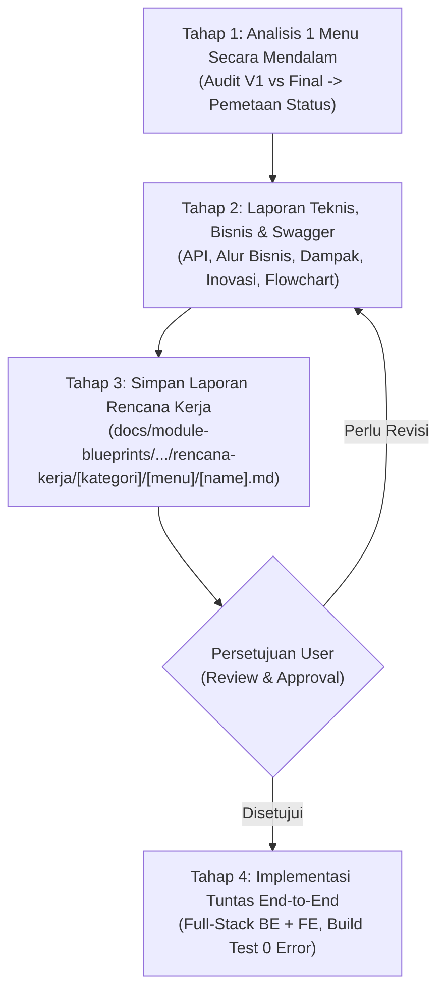

# Skill: Modernisasi Menu Keperawatan (V1 ke QuilvianFinal)

Skill ini bertugas memandu proses audit mendalam, perancangan rencana kerja modernisasi, dokumentasi teknis & bisnis proses, serta eksekusi implementasi penuh per menu keperawatan rawat inap.

---

## 1. Tujuan Pokok Setiap Pembahasan Menu

Setiap menu atau sub-menu yang dibahas memiliki 3 fokus utama:
1. **Memperbaiki & Mempercantik Tampilan UI/UX**:
   - Mengubah form input yang monoton menjadi antarmuka modern berbasis kartu interaktif, chip pilihan, dan penataan kolom responsif.
   - Menyediakan visualisasi dinamis: auto-scoring live, indikator tingkat risiko berwarna (Hijau/Kuning/Merah), dan daftar intervensi interaktif dengan counter pilihan.
2. **Menyesuaikan dengan Logika Bisnis Operasional V1**:
   - Menjadikan `QuilvianV1` sebagai bukti acuan operasional lapangan yang valid.
   - Memastikan tidak ada parameter klinis, butir instrumen, pembagian kelompok usia, atau daftar intervensi pencegahan dari V1 yang hilang di `QuilvianFinal`.
3. **Menciptakan Inovasi Bisnis & Sistem Pelengkap V1**:
   - Menghadirkan kapabilitas pintar yang belum ada di V1, seperti:
     - Otomatisasi pemilihan instrumen berdasarkan tanggal lahir/usia pasien.
     - Peringatan keselamatan klinis proaktif (*Clinical Safety Alerts*) sesuai standar SKP 6.
     - Mode perbandingan histori pengkajian antar-shift perawat.
     - Verifikasi kelengkapan pengkajian sebelum disimpan permanen ke rekam medis elektronik.

---

## 2. Alur Kerja 4 Tahap Wajib

Agen yang menjalankan skill ini wajib mematuhi 4 tahap berikut secara urut:



---

### Tahap 1: Analisis 1 Menu Secara Mendalam

Lakukan investigasi teliti pada menu yang sedang dibahas:
1. **Audit Bukti Operasional V1**:
   - Buka screenshot capture form operasional atau periksa source code frontend/backend di `QuilvianV1`.
   - Catat seluruh butir penilaian, parameter, opsi nilai, formula skoring, dan checklist intervensi yang digunakan perawat.
2. **Audit Source Code QuilvianFinal**:
   - Backend: Cek model entity, DTO, seeder instrumen klinis, dan controller.
   - Frontend: Cek komponen tampilan, form handler, validasi, dan integrasi API.
3. **Sajikan Tabel Matriks Kesenjangan (Gap Analysis)**:
   Setiap butir atau fitur wajib diklasifikasikan dengan status:
   - **`SUDAH DITERAPKAN`**: Sudah ada di Final dan bekerja penuh sesuai standar.
   - **`SEBAGIAN DITERAPKAN`**: Kerangka dasar ada, namun butir parameter, skoring otomatis, atau validasi belum lengkap.
   - **`BELUM DITERAPKAN`**: Sama sekali belum tersedia di Final.

---

### Tahap 2: Laporan Endpoint Swagger, Bisnis Proses & Inovasi

Susun laporan komprehensif yang memuat:
1. **Spesifikasi Endpoint Swagger API**:
   - Kelompok Tag Swagger (`[Tags("...")]`).
   - Tabel Endpoint lengkap: HTTP Method, Route Path, Deskripsi Fungsi, Hak Akses / Role Otorisasi, Skema Request Body (DTO), Skema Response, dan HTTP Status Code.
2. **Alur Bisnis Proses Rumah Sakit (Business Process Workflow)**:
   - Jelaskan langkah demi langkah dari pemicu awal (misal: admisi pasien rawat inap) hingga hasil akhir (pengkajian terkunci di EMR).
   - Sertakan contoh skenario nyata rumah sakit (skenario pasien anak, dewasa, dan lansia).
3. **Analisis Pengaruh Perubahan Bisnis**:
   - Dampak terhadap efisiensi waktu dokumentasi perawat bangsal.
   - Pengaruh langsung terhadap Keselamatan Pasien (Sasaran Keselamatan Pasien / SKP).
   - Pengaruh terhadap kepatuhan akreditasi rumah sakit (KARS / STARKES).
4. **Diagram Alur Visual (Mermaid Flowchart)**:
   - Buat flowchart Mermaid yang menggambarkan keputusan logika sistem, pemilihan instrumen, penentuan rentang risiko, hingga pemilihan intervensi.
5. **Skema Tampilan UI/UX Modern & Wireframe Inovasi (Wajib Ada)**:
   - **Wireframe / Layout Mockup Lengkap**: Menyajikan skema visual tata letak antarmuka (header, tab navigasi, tabel skrining, kolom nilai, badge live score, banner status risiko, dan panel intervensi).
   - **Visual Hierarchy & Design Tokens**: Menjelaskan kode warna status risiko (Hijau = Rendah, Kuning = Sedang, Merah = Tinggi/Safety Alert), tipografi, kartu bergaris halus (*soft zebra*), dan interaktivitas chip/radio button.
   - **Inovasi Sistem & Interaktivitas UI**: Menjelaskan peningkatan fitur dibanding V1 (seperti auto-resolusi cerdas berbasis tanggal lahir pasien, rekomendasi intervensi otomatis, counter pilihan `[X Dipilih]`, dan toggle cepat `[Form]` / `[Hasil]`).

---

### Tahap 3: Penyimpanan Laporan Rencana Kerja

Simpan dokumen laporan lengkap pada direktori resmi:
```
C:\Users\Admin\Documents\Quilvian\Source Code\QuilvianFinal\NewQuilvianSystemBackend\docs\module-blueprints\rawat-inap\keperawatan\roadmap\rencana-kerja\[kategori]/[menu]/[name].md
```
Struktur folder menu:
- `asuhan-keperawatan/soap/soap.md`
- `asuhan-keperawatan/resiko-jatuh/resiko-jatuh.md`
- `pengkajian-umum/[menu]/[name].md`

**Format dan Gaya Penulisan**:
- Wajib menggunakan **Bahasa Indonesia** yang baku, lugas, dan rapi.
- Istilah teknis kode (seperti nama DTO, endpoint, method) tetap dipertahankan.
- Disusun agar mudah dipahami oleh perawat, komite medik, manajemen rumah sakit, dan tim pengembang.

---

### Tahap 4: Implementasi Tuntas Tanpa Bertahap (Pasca-Persetujuan)

Setelah user mereview dokumen laporan dan memberikan instruksi persetujuan:
1. **Eksekusi Full-Stack Tanpa Dipecah-Pecah**:
   - **Backend**:
     - Lengkapi seeder data / instrumen penilaian / master intervensi.
     - Pastikan DTO, entity, validation, dan endpoint controller siap melayani form secara utuh.
   - **Frontend**:
     - Bangun/perbarui komponen UI modern (kartu interaktif, auto-scoring real-time, status alert dinamis, checklist intervensi terpadu).
     - Sambungkan form ke API dan state management secara lengkap.
2. **Verifikasi Bebas Error (Definition of Done)**:
   - Backend rebuild lolos kompilasi (`dotnet build QuilvianSystemBackend.csproj --no-incremental`).
   - Frontend lolos typecheck / build (`npm run build` atau tes komponen).
   - Lakukan pengujian form: pengisian butir, kalkulasi skor otomatis, pergantian status risiko, dan penyimpanan data.
3. **Serah Terima ke Pengguna**:
   - Sajikan rangkuman file yang diubah dan bukti hasil verifikasi.
   - Sediakan instruksi git commit/push yang rapi untuk disalin pengguna (jangan jalankan git push otomatis).

---

## 3. Aturan Wajib Anti-Hardcode & Transparansi Data Klinis/Master

1. **Larangan Keras Hardcoding Tersembunyi**:
   - Seluruh data operasional, daftar tindakan keperawatan, pilihan master, akun pegawai, dan tanda tangan digital (TTD) wajib berasal dari API/tabel database Master Data yang sah.
   - Dilarang keras meng-hardcode array data master di dalam komponen antarmuka atau controller tanpa memberitahu pengguna.
2. **Kewajiban Deklarasi & Informasi Fallback / Seed Data**:
   - Apabila sistem memerlukan data inisial (seperti 19 butir tindakan standar RS), data tersebut wajib ditempatkan pada **Database Seeder / Master Data Entity** yang dapat dikelola (CRUD) oleh administrator, BUKAN di-hardcode mati di frontend.
   - Jika ada bagian yang terpaksa memakai nilai fallback sementara, AI **WAJIB secara transparan menginformasikan kepada pengguna** bahwa data tersebut adalah fallback dan menanyakan apakah perlu dibuatkan tabel Master Data mandiri.
3. **Tanda Tangan Digital (TTD) Otentik**:
   - Informasi tanda tangan wajib ditelusuri dari master profil pengguna/pegawai (`UserActive` / `Employee` / `Hrd_MstTTD` / `ttdPath`).
   - Tampilkan berkas tanda tangan dinamis jika tersedia, atau stempel verifikasi digital berbasis akun login & timestamp resmi, dilarang menggunakan berkas/nama statis palsu.

