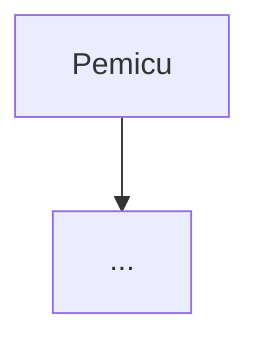

# Template Dokumen Rencana Kerja Modernisasi Menu

Template ini khusus skill pribadi `modernisasi-menu-v1`. Bentuk dan gaya dokumen tunduk pada
`rules/rule-output/aturan-output-dokumentasi.md`. Bila template ini berbeda dari aturan itu, aturan
yang berlaku.

Cara pakai:

- Salin struktur di bawah apa adanya. Urutan dan nomor bagian tidak diubah, supaya semua dokumen
  menu bisa dibandingkan.
- Hapus teks panduan dalam `<...>`.
- Bagian yang tidak berlaku tetap ditulis, dengan isi "Tidak berlaku — <alasan>".

Format bukti di seluruh dokumen: `repository/path#symbol@SHA`, atau `repository/path:baris@SHA`
bila tidak ada simbol yang jelas.

---

~~~~markdown
# Rencana Kerja Modernisasi Menu: <Nama Menu>

## 1. Identitas & Status Dokumen

| Atribut | Isi |
| --- | --- |
| Modul / Sub-modul | <Health Services — Rawat Inap — Keperawatan> |
| Menu | <Kategori> → <Menu> |
| Jalur dokumen | `<blueprint-root>/roadmap/rencana-kerja/<kategori>/<menu>/<menu>.md` |
| Revisi | rev <N> — <tanggal absolut, mis. 30 September 2026> |
| Status | DRAF / MENUNGGU PERSETUJUAN / DISETUJUI (rev N) / DALAM IMPLEMENTASI / SELESAI / SELESAI SEBAGIAN |
| Roadmap aktif | <mis. `roadmap/backend-roadmap-v2.md` dan `roadmap/frontend-roadmap-v2.md`, sesuai `blueprint-manifest.md`> |
| SHA sumber bukti | V1 FE `<sha>`, V1 BE `<sha>`, Final BE `<sha>`, Final FE `<sha>` |
| Keputusan terkait | <mis. `RWI-DEC-124`, `RWI-DEC-136`> |
| Usulan keputusan terbuka | <jumlah> — <KK-1 → `RWI-OQ-###`, KK-2 belum didaftarkan> |

## 2. Ringkasan Eksekutif

<Maksimal 10 baris kalimat pendek. Jawab empat hal:
- Apa yang dipakai perawat di V1.
- Bagaimana kondisi Final saat ini.
- Apa yang diusulkan.
- Keputusan apa yang dibutuhkan, dari siapa.>

## 3. Audit Paritas

### 3.1 Matriks Paritas Fitur dan Perilaku

| No | Butir | Bukti V1 | Bukti Final | Status | Catatan |
| --- | --- | --- | --- | --- | --- |
| 1 | <Resolusi instrumen berdasarkan usia> | `<repo/path#symbol@sha>` | `<repo/path#symbol@sha>` | READY TO REUSE | <...> |
| 2 | <Ambang risiko anak> | `<repo/path#symbol@sha>` | `<repo/path#symbol@sha>` | CONFLICT | Lihat KK-1 |

Status hanya memakai label ini: `READY TO REUSE`, `REUSE WITH ADAPTER`, `EXTEND`, `REPAIR`,
`MISSING`, `CONFLICT`, `UNKNOWN`. Butir tanpa bukti berstatus `UNKNOWN`.

### 3.2 Inventaris Konten Klinis

| Kode butir | Teks / opsi | Skor per opsi | V1 | Final (seeder + versi aktif) | Acuan umum (`REFERENCE_ONLY`) | Selisih |
| --- | --- | --- | --- | --- | --- | --- |

| Instrumen | Rentang usia | Band V1 | Band Final | Status versi aktif | Selisih |
| --- | --- | --- | --- | --- | --- |

<Setiap aturan skor diberi contoh berangka. Contoh:
"Pasien anak usia 8 tahun (skor umur 2), laki-laki (2), diagnosis neurologis (4), orientasi baik
terhadap kemampuannya (1), ditempatkan di tempat tidur (2), tanpa pembedahan/sedasi (1), tanpa obat
berisiko (1). Total = 13. Dengan band Final ≥12 = Tinggi, pasien tergolong **risiko tinggi**.
Dengan band V1 ≥45, pasien yang sama tergolong **risiko rendah**. Inilah alasan KK-1.">

## 4. Usulan Keputusan Klinis

| KK | Pertanyaan | Opsi | Rekomendasi | Pemilik keputusan | ID register | Status |
| --- | --- | --- | --- | --- | --- | --- |
| KK-1 | <Ambang risiko tinggi Humpty Dumpty?> | A) Ikuti V1 (≥45) · B) Ikuti acuan (≥12) · C) Konfigurasi per SOP RS | B — <alasan + risiko opsi lain> | <Komite Keperawatan / pemilik klinis> | <`RWI-OQ-###` / belum didaftarkan> | <USULAN / TERDAFTAR / DIPUTUS `RWI-DEC-###`> |

Bagian ini hanya **usulan**. Keputusan sah hanya yang tercatat di `00-interview-decisions.md`
modul lewat `grill-me`. Task yang bergantung pada KK terbuka ditandai
`⛔ menunggu keputusan RWI-OQ-### — <pemilik>` di roadmap.

## 5. Kontrak API & Field

### <Nilai `[Tags(...)]` controller, apa adanya>

Base URL: `<api/v1/...>` — diambil dari atribut `[Route]` controller, bukan dari URL frontend.

| Method | Path | Kegunaan | Hak akses | Request | Response | Status |
| --- | --- | --- | --- | --- | --- | --- |
| `GET` | `/{id}` | <satu kalimat untuk pengguna> | `<Nilai [AccessPermission]>` | - | `<ResponseDto>` | ADA |
| `POST` | `/{id}/complete` | <...> | `<...>` | `<RequestDto>` | `<ResponseDto>` | Rencana (belum tersedia) |

Arti kode status bagi pengguna:

| Kode | Kapan muncul | Pesan yang dilihat pengguna |
| --- | --- | --- |
| 400 | <aksi tidak sah untuk status saat ini> | <"Dokumen sudah dikunci, jadi tidak bisa diubah."> |
| 403 | <aktor tidak berwenang> | <...> |
| 409 | <versi instrumen berubah / diubah petugas lain> | <...> |
| 422 | <instrumen belum disahkan> | <...> |

<Ulangi judul `###` untuk setiap grup `[Tags(...)]` yang dipakai menu ini.>

### Tabel Field

| Field JSON | Tipe C# | Nullable | Enum → nilai di kabel | Sumber nilai di UI | Validasi server | Bukti DTO |
| --- | --- | --- | --- | --- | --- | --- |
| `consciousnessStatus` | `ConsciousnessStatus` | tidak | angka (0..n) | pilihan wajib | `[Required]` | `<repo/path#symbol@sha>` |

### Aksi dan Transisi

| Aksi | Endpoint | Muncul di `AvailableActions` bila | Idempotency | Jejak status |
| --- | --- | --- | --- | --- |

### Contoh Payload

<Request dan response JSON representatif, memakai data samaran.>

## 6. Proses Bisnis

1. **Tujuan** — <hasil bisnis yang ingin dicapai>
2. **Pelaku** —

   | Pelaku | Mengerjakan | Berwenang menyetujui |
   | --- | --- | --- |

3. **Pemicu** — <mis. pasien masuk bangsal>
4. **Prasyarat** — <data atau kondisi yang harus ada lebih dulu>
5. **Langkah utama** — <bernomor, satu langkah satu tindakan>
6. **Aturan bisnis** — <larangan, batas, perhitungan; masing-masing dengan contoh berangka>
7. **Perubahan status** —

   | Dari status | Tindakan | Ke status | Siapa yang boleh | Syarat |
   | --- | --- | --- | --- | --- |

8. **Jalur tidak normal** — <koreksi/addendum, pembatalan, instrumen belum disahkan, sistem gagal, pasien pindah ruang>
9. **Hasil akhir** — <kondisi data sesudahnya dan siapa yang menerima dampaknya>

Flowchart berikut hanya pelengkap, bukan pengganti langkah dan tabel di atas:

### 6.1 Skenario (data samaran)

- Anak: <...>
- Dewasa: <...>
- Lansia: <...>

## 7. Desain UI/UX

### 7.1 Wireframe

<Wireframe teks untuk dua mode:
- Draf (pengisian);
- Selesai (terkunci).>

### 7.2 Keputusan Elemen UI

Format tabel ini mengikuti `rules/frontend/base-component-decision-gate.md`. Keputusan finalnya
tetap dijalankan ulang oleh `build-module-frontend`.

| Kebutuhan UI | Kandidat base | Bukti | Status | Rekomendasi |
| --- | --- | --- | --- | --- |
| Badge kategori risiko | `StatusBadge` | `src/components/features/base-features/...` | REUSE | <...> |
| Konfirmasi "Selesaikan & Kunci" | `ConfirmModal` | `...` | REUSE | <...> |

Elemen `NEW`, atau `EXTEND` yang mengubah perilaku default, menunggu keputusan user.

### 7.3 Token dan Aksesibilitas

| Makna | Token | Penanda non-warna |
| --- | --- | --- |
| Risiko rendah | `--color-success` | teks "Risiko Rendah" + ikon |
| Risiko sedang | `--color-warning` | teks "Risiko Sedang" + ikon |
| Risiko tinggi / peringatan keselamatan | `--color-danger` | teks "Risiko Tinggi" + ikon + posisi tetap |

Tabel yang ditulis manual wajib membawa `data-flat-table="true"`. Tidak ada warna literal baru.
Tidak ada blok dark mode.

## 8. Usulan Inovasi

| ID | Inovasi | Nilai bagi pengguna | Risiko / biaya | Fase usulan | Status |
| --- | --- | --- | --- | --- | --- |
| INV-1 | <...> | <...> | <...> | MVP / Nanti | USULAN / DISETUJUI / DITUNDA |

## 9. Master Data & Fallback

| Daftar / opsi | Sumber (tabel/endpoint) | Dikelola lewat | Fallback? | Catatan |
| --- | --- | --- | --- | --- |

Fallback yang jawabannya bisa tersimpan ke rekam medis tidak diizinkan. Tabel master baru wajib
punya entri registry prefix lebih dulu.

## 10. Dampak

- Efisiensi dokumentasi: <dengan angka perkiraan, mis. jumlah klik atau menit per pengkajian>
- Keselamatan pasien: <...>
- Akreditasi / regulasi: <...> — tandai `REFERENCE_ONLY — perlu verifikasi` bila tidak ada dokumen
  rumah sakit.

## 11. Draf Task untuk `plan-module-delivery`

| Draf | Repo | Judul | Bergantung pada | KK / INV / DEC | Acceptance criteria (termasuk skenario runtime) |
| --- | --- | --- | --- | --- | --- |

Draf ini bukan task resmi. Task ID resmi diberikan `plan-module-delivery` di roadmap aktif. Setiap
draf wajib konsisten dengan status di matriks bagian 3.

## 12. Persetujuan & Riwayat Revisi

| Rev | Tanggal | Perubahan | Disetujui oleh | Cakupan persetujuan |
| --- | --- | --- | --- | --- |

## 13. Status Implementasi

| Task ID | Tanda roadmap | Laporan |
| --- | --- | --- |
| `BE-RWI-###` | ✅ / 🟡 / ⛔ / belum | [BE-RWI-###](../../../../task/report/backend/BE-RWI-###.md) |

Bagian ini hanya berisi tautan dan tanda yang disalin dari roadmap. Bukti validasi tinggal di
laporan task.
~~~~
