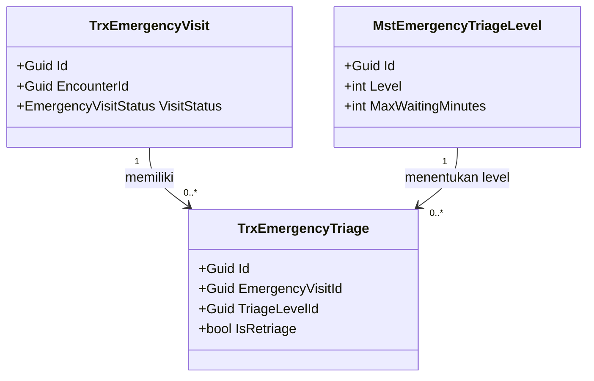

# Contoh Output Setiap Skill — Studi Kasus IGD

Dokumen ini memperlihatkan **bentuk keluaran** setiap skill memakai modul IGD (Instalasi Gawat
Darurat). Semua contoh sengaja dipendekkan agar mudah dibaca; dokumen sungguhan akan lebih
panjang.

Contoh ini memakai kode IGD yang memang sudah ada di backend, yaitu
`Areas/HealthServices/EmergencyInstallationManagement/`. Nilai-nilai seperti commit SHA dan
nama approver ditulis sebagai `<...>` karena harus diisi dengan data sebenarnya.

Urutan pemanggilan skill:

```text
/grill-me → /trace-existing-capabilities → /grill-me (closure)
  → /design-business-module → [approval owner] → /plan-module-delivery
  → /build-module-backend + /build-module-frontend → /verify-module-readiness
```

---

## 1. `/grill-me` → `00-interview-decisions.md`

Skill ini mewawancarai Anda, lalu menyimpan jawabannya sebagai keputusan yang bisa diuji.

### Yang tampil di layar saat wawancara

Setiap pertanyaan wajib punya pilihan, satu rekomendasi, dan opsi `Other`:

```text
Pasien IGD datang lagi dengan keluhan yang sama 3 jam setelah dipulangkan.
Ini dihitung kunjungan baru atau lanjutan dari kunjungan sebelumnya?

A. Kunjungan baru, tetapi ditandai sebagai kunjungan ulang dan ditautkan ke kunjungan
   sebelumnya (Direkomendasikan) — statistik kunjungan tetap akurat, dan dokter tetap bisa
   melihat riwayat 3 jam lalu. Konsekuensinya perlu kolom penghubung antar kunjungan.
B. Kunjungan lanjutan, kunjungan lama dibuka kembali — riwayat menyatu, tetapi laporan
   jumlah kunjungan jadi lebih kecil dari kenyataan dan penutupan kunjungan jadi kabur.
C. Kunjungan baru tanpa penanda apa pun — paling sederhana, tetapi pola pasien kembali
   tidak terdeteksi, padahal itu indikator mutu IGD.
D. Other — tuliskan pilihan atau batasan lain.
```

### Yang tersimpan di dokumen

```markdown
## Batas scope modul IGD

**Di dalam scope:** pendaftaran darurat, triage dan retriage, observasi, tindakan,
disposition (pulang/rawat inap/rujuk), transfer, penutupan kunjungan.

**Di luar scope:** perhitungan tarif dan klaim asuransi (modul Billing), stok dan resep obat
(modul Farmasi), penjadwalan operasi.

**Di luar scope — untuk modul lain:** aturan tarif tindakan IGD. Muncul saat wawancara,
dicatat, tidak dikejar di sesi ini.

## Keputusan

### DEC-IGD-001 — Sistem triage yang dipakai

| Field | Nilai |
| --- | --- |
| Status | approved |
| Owner | Kepala Instalasi Gawat Darurat |
| Keputusan | Memakai ESI 5 level (1 Resusitasi sampai 5 Non-urgent) |
| Alasan | Sudah dipakai SOP manual sejak 2023, perawat tidak perlu dilatih ulang |
| Bukti | Notulen rapat mutu <tanggal> |
| approved_by / approved_at | <nama> / <tanggal> |

### DEC-IGD-002 — Retriage wajib bila pasien menunggu lebih dari 30 menit

| Field | Nilai |
| --- | --- |
| Status | approved |
| Owner | Kepala Instalasi Gawat Darurat |
| Keputusan | Sistem menandai pasien yang belum ditangani lewat 30 menit untuk dinilai ulang |
| Contoh | Pasien triage level 4 datang 08.00, belum ditangani sampai 08.30, muncul penanda "perlu retriage" di layar perawat |
| approved_by / approved_at | <nama> / <tanggal> |

### DEC-IGD-003 — Siapa yang berwenang menentukan menu dan route IGD

| Field | Nilai |
| --- | --- |
| Status | approved |
| Keputusan | Struktur menu diputuskan Manajer Sistem Informasi; tata letak detail layar didelegasikan ke developer |
| Ruang DEV_DISCRETION | Urutan kolom tabel, penempatan tombol, pilihan komponen dari design system |

## Pertanyaan terbuka

| ID | Pertanyaan | Owner | Memblokir |
| --- | --- | --- | --- |
| OQ-IGD-001 | Apakah kunjungan IGD boleh ditutup bila hasil laboratorium belum keluar? | Kepala IGD | Ya, memblokir desain penutupan kunjungan |
```

---

## 2. `/trace-existing-capabilities` → `01-existing-capability-map.md`

Skill ini menyisir kode di **dua** repo dan menyatakan apa yang sudah ada. Untuk IGD, hasilnya
menunjukkan modul ini bukan lahan kosong.

```markdown
## Peta kemampuan existing — IGD

Commit yang diaudit: backend `<sha>`, frontend `<sha>`.

| Kemampuan | Status | Repo | Lokasi | Catatan |
| --- | --- | --- | --- | --- |
| Data pasien | Ready to reuse | backend | `Areas/HealthServices/PatientManagement/` | Jangan buat tabel pasien khusus IGD |
| Kunjungan IGD | Ready to reuse | backend | `.../EmergencyInstallationManagement/Controller/EmergencyVisitController.cs` | Endpoint dan DTO sudah tersedia |
| Triage | Extend | backend | `.../Controller/EmergencyTriageController.cs` | Sudah mendukung sistem ATS dan ESI; penanda retriage 30 menit belum ada |
| Status triage | Ready to reuse | backend | `.../Enums/EmergencyTriageStatus.cs` | Draft, InProgress, Completed, Superseded, Cancelled |
| Observasi | Ready to reuse | backend | `.../Controller/EmergencyObservationController.cs` | — |
| Disposition | Ready to reuse | backend | `.../Controller/EmergencyDispositionController.cs` | — |
| Transfer antar unit | Ready to reuse | backend | `.../Controller/EmergencyTransferController.cs` | — |
| Layar triage perawat | Missing | frontend | — | Belum ada route yang memakai endpoint triage |
| Penanda pasien menunggu terlalu lama | Missing | backend | — | Diperlukan DEC-IGD-002 |

## Kontrak as-is yang ditemukan

### Health Services / Emergency Installation Management / Emergency Triage

Base URL: `api/v1/health-services/emergency-installation-management/emergency-triages`

Grup ini sudah ada di Swagger. Perbedaannya dari kebutuhan target dicatat di bagian conflict.

## Conflict dan unknown

| ID | Temuan | Dampak |
| --- | --- | --- |
| CF-IGD-001 | Enum status triage sudah punya `Superseded`, tetapi belum ada aturan bisnis kapan status itu dipakai | Perlu ditutup lewat `/grill-me` Closure Pass |
| UK-IGD-001 | Belum jelas apakah frontend lama pernah memakai endpoint triage | Perlu penelusuran tambahan |
```

---

## 3. `/design-business-module` → `02-backend-architecture.md`, `erd/`, `contracts/`

Skill ini mengubah keputusan dan peta kemampuan menjadi rancangan target.

````markdown
## Kepemilikan data

| Kelompok data | Modul pemilik | Dipakai IGD | Dibuat ulang di IGD |
| --- | --- | :---: | --- |
| Pasien | Patient Management | Ya | Tidak |
| Triage dan observasi | Emergency Installation | Ya | Ya, karena khusus IGD |
| Resep | Pharmacy Management | Ya | Tidak |

## Class diagram — konteks triage



### TrxEmergencyTriage

| Aspek | Penjelasan |
| --- | --- |
| **Status** | `Diperbarui` |
| **Lokasi file** | `Areas/HealthServices/EmergencyInstallationManagement/Models/TrxEmergencyTriage.cs` |
| Kategori | Transaksi IGD |
| Tanggung jawab utama | Menyimpan satu episode penilaian triage. Penilaian ulang membuat baris baru, tidak menimpa baris lama |
| Catatan desain | Target waktu respons diambil dari master, jangan di-hardcode |
| Ekuivalen model lama | `IGDTriage` |

## Arsitektur folder

```text
Areas/HealthServices/EmergencyInstallationManagement/
├── Controllers/   # saat ini bernama Controller — utang teknis, jangan ditiru
│   └── EmergencyTriageController.cs     # Diperbarui — tambah aksi retriage
├── DTOs/
│   └── EmergencyTriageDtos.cs           # Diperbarui — tambah RetriageRequest
└── Models/
    └── TrxEmergencyTriage.cs            # Diperbarui — tambah SupersededByTriageId

Repositories/Configurations/HealthService/EmergencyInstallationManagement/
└── TrxEmergencyTriageConfiguration.cs   # Diperbarui — index baru

Migrations/
└── <timestamp>_AddTriageSupersededLink.cs   # Baru
```

## Status model

| Model | Status | Perubahan | Dampak migration |
| --- | --- | --- | --- |
| `TrxEmergencyVisit` | Sudah ada | Tidak ada | Tidak ada |
| `TrxEmergencyTriage` | **Diperbarui** | Tambah `SupersededByTriageId` (`Guid?`), index `(EmergencyVisitId, StartedAt)` | Tambah kolom dan index, tanpa mematikan layanan |
| `TrxEmergencyWaitingAlert` | **Baru** | Tabel baru, enam kolom | Membuat tabel |

## Rencana migration

| Urutan | Migration | Tanpa downtime | Cara mundur |
| ---: | --- | :---: | --- |
| 1 | `AddTriageSupersededLink` | Ya | Hapus kolom dan index; belum ada data yang bergantung |
| 2 | `CreateEmergencyWaitingAlert` | Ya | Hapus tabel |

## Rencana data master awal

| Master | Isi minimum | Sumber nilai |
| --- | --- | --- |
| `MstEmergencyTriageLevel` | Lima level ESI beserta warna dan target waktu respons | SOP triage rumah sakit |

## Yang sengaja tidak dibuat

| Yang ditolak | Alasan |
| --- | --- |
| `PatientIGD` | Pasien dimiliki Patient Management, dipakai lewat `EncounterId` |
| SOAP versi IGD | Sudah ada di Clinical Management dan dipakai lintas pelayanan |

## Perubahan status triage

| Dari | Tindakan | Ke | Siapa yang boleh | Syarat |
| --- | --- | --- | --- | --- |
| `Draft` | Simpan penilaian | `InProgress` | Perawat IGD | Tanda vital wajib terisi |
| `InProgress` | Selesaikan | `Completed` | Perawat IGD | Level triage sudah ditentukan |
| `Completed` | Retriage | `Superseded` | Perawat IGD | Ada penilaian baru yang menggantikan |
| `Draft` / `InProgress` | Batalkan | `Cancelled` | Kepala jaga | Wajib mengisi alasan |

Menutup CF-IGD-001: `Superseded` dipakai **hanya** ketika penilaian digantikan retriage, bukan
saat dibatalkan.

## Kontrak target

### Health Services / Emergency Installation Management / Emergency Triage

Base URL: `api/v1/health-services/emergency-installation-management/emergency-triages`
Contract version: `v2` — status `draft`, menunggu approval API owner.

| Method | Path | Kegunaan | Hak akses | Status |
| --- | --- | --- | --- | --- |
| `GET` | `/` | Daftar triage dengan penyaringan | `EmergencyTriage : Read` | Sudah ada |
| `POST` | `/` | Membuat penilaian triage | `EmergencyTriage : Create` | Sudah ada |
| `POST` | `/{id}/retriage` | Menilai ulang pasien dan menandai penilaian lama `Superseded` | `EmergencyTriage : Update` | **Rencana (belum tersedia)** |
| `GET` | `/waiting-alerts` | Daftar pasien yang melewati batas waktu tunggu | `EmergencyTriage : Read` | **Rencana (belum tersedia)** |
````

---

## 4. `/plan-module-delivery` → `roadmap/backend-roadmap.md`

Skill ini memecah rancangan menjadi task kecil yang bisa diuji.

```markdown
## Slice 1 — Retriage dan penanda waktu tunggu

| Task | Outcome | Requirement | Contract | Dependency | Acceptance |
| --- | --- | --- | --- | --- | --- |
| `BE-IGD-001` | Perawat dapat menilai ulang pasien, penilaian lama otomatis `Superseded` | DEC-IGD-002 | v2 | — | Retriage membuat baris baru dan mengubah status lama; percobaan retriage pada triage `Cancelled` ditolak |
| `BE-IGD-002` | Sistem menandai pasien menunggu lebih dari 30 menit | DEC-IGD-002 | v2 | `BE-IGD-001` | Pasien 31 menit muncul di daftar penanda; pasien 29 menit tidak muncul |
| `FE-IGD-001` | Perawat melihat daftar antrean triage beserta penanda menunggu | DEC-IGD-002, DEC-IGD-003 | v2 | `BE-IGD-002` approved | Seluruh state tampil: loading, kosong, error, retry, tanpa hak akses |

## Definition of Done `BE-IGD-001`

1. Endpoint `POST /{id}/retriage` tersedia sesuai kontrak v2.
2. Penilaian lama berubah menjadi `Superseded`, bukan terhapus.
3. Ada test untuk jalur berhasil, tanpa hak akses, dan triage yang sudah `Cancelled`.
4. Laporan perubahan dan traceability diperbarui.

## Traceability

| Requirement | Keputusan | Task | Test |
| --- | --- | --- | --- |
| Retriage wajib setelah 30 menit | DEC-IGD-002 | `BE-IGD-001`, `BE-IGD-002`, `FE-IGD-001` | `EmergencyTriageRetriageTests`, E2E antrean triage |
```

---

## 5. `/build-module-backend` → laporan perubahan

Skill ini mengerjakan **satu** task, lalu melaporkan hasilnya.

```markdown
## Laporan perubahan backend — `BE-IGD-001`

**Outcome:** perawat dapat menilai ulang pasien; penilaian lama otomatis menjadi `Superseded`.
**Contract version:** v2 (approved)

### File utama

| File | Perubahan |
| --- | --- |
| `.../Controller/EmergencyTriageController.cs` | Tambah `POST /{id}/retriage` |
| `.../DTOs/EmergencyTriageDtos.cs` | Tambah `RetriageEmergencyTriageRequest` |
| `.../Models/MstEmergencyTriage.cs` | Tambah kolom penghubung ke penilaian pengganti |
| `Migrations/<timestamp>_AddTriageSupersededLink.cs` | Migration baru |

### Verifikasi

| Skenario | Hasil |
| --- | --- |
| Retriage pada triage `Completed` | Lulus — baris baru dibuat, status lama `Superseded` |
| Retriage tanpa hak akses | Lulus — ditolak dengan kode 403 |
| Retriage pada triage `Cancelled` | Lulus — ditolak dengan kode 400 dan pesan yang dapat dibaca perawat |
| Build project | Lulus |

**Tidak dijalankan:** migration belum diterapkan ke database mana pun selain lokal.

### Dokumentasi endpoint

#### Health Services / Emergency Installation Management / Emergency Triage

| Method | Path | Kegunaan | Hak akses |
| --- | --- | --- | --- |
| `POST` | `/{id}/retriage` | Menilai ulang pasien dan menandai penilaian lama sebagai digantikan | `EmergencyTriage : Update` |

**Risiko tersisa:** `BE-IGD-002` belum dikerjakan, sehingga penanda 30 menit belum aktif.
```

---

## 6. `/build-module-frontend` → laporan perubahan frontend

```markdown
## Laporan perubahan frontend — `FE-IGD-001`

**Outcome:** perawat melihat antrean triage IGD beserta penanda pasien menunggu terlalu lama.
**Contract version:** v2 (approved, hash terkunci)

### File utama

| File | Perubahan |
| --- | --- |
| `src/app/igd/triage/page.jsx` | Route baru daftar antrean triage |
| `src/features/igd/TriageQueueTable.jsx` | Tabel antrean memakai komponen tabel existing |
| `src/services/igd/triageApi.js` | Konsumen endpoint triage v2 |

### State yang ditangani

| State | Yang dilihat perawat |
| --- | --- |
| Memuat | Kerangka tabel, bukan layar kosong |
| Kosong | "Belum ada pasien menunggu triage." |
| Gagal | "Gagal memuat antrean." beserta tombol Coba lagi |
| Tanpa hak akses | "Anda tidak memiliki hak akses untuk melihat antrean triage." |
| Menunggu terlalu lama | Baris ditandai beserta keterangan "menunggu 31 menit" |

Nama pasien ditampilkan sebagai nama, bukan UUID.

### Verifikasi

| Skenario | Hasil |
| --- | --- |
| Lint dan test komponen | Lulus |
| Uji tanpa hak akses | Lulus |
| Uji tampilan pada layar kecil | Lulus |

**Dependency backend:** `BE-IGD-002` belum selesai, sehingga daftar penanda masih kosong di
lingkungan uji.
```

---

## 7. `/verify-module-readiness` → `testing/readiness-report.md`

```markdown
## Laporan kesiapan modul IGD

Diaudit pada commit backend `<sha>` dan frontend `<sha>`.

### Ringkasan

| Aspek | Kesiapan | Dasar perhitungan |
| --- | --- | --- |
| Fondasi (entity, migration) | 9 dari 10 terbukti | Migration retriage belum diterapkan di lingkungan uji |
| Backend | 7 dari 9 terbukti | `BE-IGD-002` belum dikerjakan |
| Frontend | 4 dari 6 terbukti | Layar penanda menunggu belum dapat diuji |
| Integrasi dan runtime | 3 dari 6 terbukti | Alur retriage belum diuji ujung ke ujung |
| Cakupan pengujian | 12 test, 0 gagal | Belum ada E2E untuk retriage |

### Blocker, diurutkan dari yang paling berdampak

| No | Blocker | Dampak nyata bila dipakai sekarang |
| ---: | --- | --- |
| 1 | `BE-IGD-002` belum ada | Pasien yang menunggu lebih dari 30 menit tidak tertandai, sehingga DEC-IGD-002 tidak berjalan sama sekali |
| 2 | Migration retriage belum diterapkan di lingkungan uji | Endpoint retriage akan gagal saat dicoba di luar komputer developer |
| 3 | Belum ada E2E antrean triage | Tidak ada bukti perawat benar-benar dapat menyelesaikan alur dari awal sampai akhir |

### Verdict

`NOT_READY`

Fungsi retriage sudah terbukti pada tingkat backend, tetapi tujuan bisnis DEC-IGD-002 belum
tercapai karena penanda waktu tunggu belum ada. Modul belum layak dipakai perawat.

### Langkah berikutnya yang ditawarkan

1. `/build-module-backend` untuk `BE-IGD-002` — menutup blocker nomor 1.
2. Terapkan migration di lingkungan uji — menutup blocker nomor 2.
3. `/build-module-frontend` untuk melanjutkan `FE-IGD-001` setelah penanda tersedia.
4. `/verify-module-readiness` ulang setelah ketiganya selesai.
```

---

## Cara membaca contoh ini

| Skill | Bentuk keluaran | Menulis ke |
| --- | --- | --- |
| `/grill-me` | Keputusan bernomor beserta owner dan bukti | `00-interview-decisions.md` |
| `/trace-existing-capabilities` | Tabel kemampuan beserta status dan lokasi kode | `01-existing-capability-map.md` |
| `/design-business-module` | Tabel entity, perubahan status, kontrak target | `02-backend-architecture.md`, `erd/`, `contracts/` |
| `/plan-module-delivery` | Tabel task beserta acceptance dan traceability | `roadmap/` |
| `/build-module-backend` | Laporan file, verifikasi, dan dampak | Laporan + traceability |
| `/build-module-frontend` | Laporan file, state UI, dan verifikasi | Laporan + traceability |
| `/verify-module-readiness` | Angka kesiapan, blocker berurutan, verdict | `testing/readiness-report.md` |

Perhatikan pola yang berulang di semua contoh: setiap klaim punya lokasi buktinya, setiap
aturan punya contoh berangka, dan setiap endpoint memakai judul grup `[Tags(...)]` diikuti
tabel. Itulah lima aturan pada
[aturan-output-dokumentasi.md](aturan-output-dokumentasi.md) yang sedang diterapkan.
