# PRD PHASE 2 — HEMODIALISA
## Longitudinal Care, Pelaporan & Interoperabilitas

---

# 1. Identitas Dokumen

| Field | Nilai |
|---|---|
| Produk | Quilvian V2 |
| Modul | Hemodialisa |
| Release | Phase 2 / Release 2 |
| Fokus | Longitudinal Care, Reporting & Interoperability |
| Status | **DRAFT — GRILL READY / FUTURE RELEASE** |
| Ketergantungan | PRD Phase 1 — Core Hemodialisa |
| Backend | `DevBenari/NewQuilvianSystemBackend` |
| Backend Branch | `MHamzah` |
| Baseline commit | `69b256ca3cdc86113b65777c856d5938c59a1145` |
| Frontend | `DevBenari/QuilvianSystemFrontendDev` |
| Frontend Branch | `HamzahV2` |
| Baseline commit | `8143874d8373b534b7f3f535f9454ed8ec68a604` |
| Tanggal PRD | 18 September 2026 |
| Sumber requirement | `hemodialisa-deep-analysis(1).md` |
| Grill strategy | Digabung dengan Grill Phase 1 & Phase 3 |
| Implementation lock | Belum; dilakukan setelah kontrak inti Phase 1 stabil |

Dokumen analisis asli memang menempatkan FEAT-020 sampai FEAT-025 sebagai manajemen longitudinal, serta FEAT-031, FEAT-032 dan FEAT-034 sebagai pelaporan, interoperabilitas dan keselamatan.

---

# 2. Ringkasan Eksekutif

Phase 1 membuat Quilvian mampu menjalankan **satu sesi Hemodialisa secara lengkap**.

Phase 2 membuat Quilvian mampu memahami bahwa:

> pasien Hemodialisa bukan hanya mempunyai satu sesi, tetapi mempunyai perjalanan terapi longitudinal yang terdiri dari banyak sesi, pemeriksaan berkala, perubahan akses, perubahan target klinis, risiko infeksi, pelaporan dan interoperabilitas.

Phase 2 terdiri dari sembilan feature:

| Feature | Nama |
|---|---|
| FEAT-020 | Perhitungan dan tren adekuasi HD |
| FEAT-021 | Rencana dan hasil pemeriksaan berkala |
| FEAT-022 | Tren berat kering dan status cairan |
| FEAT-023 | Surveilans akses vaskular |
| FEAT-024 | Komplikasi akses dan rujukan |
| FEAT-025 | Pemantauan serologi dan vaksinasi Hepatitis B |
| FEAT-031 | Dataset registrasi dan laporan tahunan dialisis |
| FEAT-032 | Integrasi Uronefrologi SATUSEHAT |
| FEAT-034 | Handoff insiden keselamatan pasien |

**FEAT-009 Scheduling** dan **FEAT-033 Billing handoff** berasal dari Phase 2 pada analisis awal tetapi sudah ditarik masuk ke Phase 1 agar MVP pertama benar-benar end-to-end.

---

# 3. Masalah Produk

Setelah Phase 1 selesai, sistem sudah mengetahui:

```text
HmdEpisode
    ↓
HmdPrescription
    ↓
HmdSession
    ↓
Pra-HD
    ↓
Intra-HD
    ↓
Pasca-HD
    ↓
Finalized
```

Tetapi tanpa Phase 2 sistem belum mempunyai kemampuan yang kuat untuk menjawab:

```text
Bagaimana kondisi pasien selama 3 bulan terakhir?

Apakah adekuasi terapi membaik atau menurun?

Kapan pemeriksaan berkala berikutnya?

Bagaimana perubahan berat kering?

Apakah akses vaskular memburuk?

Apakah ada hasil serologi baru?

Apakah pasien memerlukan tindak lanjut PPI?

Data apa yang harus dilaporkan?

Data apa yang belum dikirim ke SATUSEHAT?

Apakah ada komplikasi yang harus diteruskan ke sistem insiden?
```

Phase 2 menutup gap tersebut.

---

# 4. Visi Produk Phase 2

Phase 2 mengubah Hemodialisa dari:

```text
SESSION-CENTRIC
```

menjadi:

```text
EPISODE-CENTRIC
+
LONGITUDINAL-CARE-CENTRIC
```

Target:

```text
HmdEpisode
│
├── Prescription History
├── Session History
├── Adequacy History
├── Periodic Monitoring
├── Dry Weight History
├── Vascular Access History
├── Infection Control Review
│
├── Regulatory Dataset
├── SATUSEHAT
└── Safety Handoff
```

Setiap hasil longitudinal harus tetap dapat ditelusuri ke sumber klinis awal.

---

# 5. Batas Phase 2

## In Scope

Phase 2 mencakup:

- evaluasi adekuasi;
- hubungan hasil laboratorium pra/pasca dengan sesi;
- pemeriksaan berkala;
- monitoring due/overdue;
- tren berat kering;
- longitudinal vascular access;
- komplikasi akses;
- rujukan akses;
- monitoring serologi;
- monitoring vaksinasi Hepatitis B;
- dataset pelaporan HD;
- validasi dataset;
- tracking submission;
- SATUSEHAT Uronefrologi;
- retry/reconciliation;
- handoff insiden keselamatan.

## Tidak termasuk

Phase 2 tidak membangun:

- Laboratory Information System;
- sistem vaksinasi rumah sakit secara umum;
- bedah vaskular;
- incident management system penuh;
- BPJS/VClaim;
- KPI mutu;
- tarif;
- claim adjudication;
- device integration otomatis;
- dialyzer reuse;
- AI clinical recommendation.

---

# 6. Aktor Sasaran

| Aktor | Peran |
|---|---|
| DPJP | Review longitudinal dan keputusan terapi |
| Dokter Dialisis | Review adekuasi, akses, monitoring |
| Perawat Dialisis | Pengumpulan data longitudinal |
| Koordinator HD | Monitoring due list dan pelaporan |
| Laboratorium | Sumber authoritative hasil pemeriksaan |
| PPI | Review serologi, vaksinasi dan infeksi |
| Bedah Vaskular / IR | Tujuan rujukan masalah akses |
| Petugas Rekam Medis | Rekonsiliasi data pelaporan |
| Petugas Integrasi | SATUSEHAT dan retry |
| Petugas Pelaporan | Dataset regulator |
| Komite Mutu | Menerima handoff insiden |

---

# 7. Pemilihan Kemampuan Phase 2

Dokumen analisis menyatakan FEAT-020 sebagai perhitungan/tren adekuasi dengan sumber data ureum pra/pasca serta keputusan klinis; hasil di bawah target harus masuk tinjauan dokter tanpa mengubah prescription secara otomatis.

Untuk akses vaskular, requirement sumber menuntut surveillance longitudinal, temuan yang dapat ditelusuri dan rencana evaluasi/rujukan bila abnormal.

Untuk pelaporan, requirement sumber mewajibkan dataset awal/follow-up, validasi, status submission serta koreksi yang tetap dapat ditelusuri.

Seluruh sembilan Feature tersebut menjadi **MUST HAVE Phase 2**.

---

# 8. Kemampuan yang Tetap Ditunda

Berikut tidak masuk Phase 2:

| Kemampuan | Status |
|---|---|
| Direct machine telemetry | Future extension |
| Predictive analytics | Future extension |
| Automated clinical diagnosis | Tidak termasuk |
| Dialyzer reuse lifecycle | Separate scope |
| JKN optimization | Phase 3 |
| KPI quality engine | Phase 3 |
| Financial claim adjudication | Modul Billing/Klaim |
| Full incident lifecycle | Modul Mutu/Incident apabila tersedia |

---

# 9. Alur Bisnis Target

## FLOW-HD-P2-001 — Monitoring Longitudinal

```text
Episode HD aktif
    ↓
Session final bertambah
    ↓
Data klinis longitudinal diperbarui
    ↓
Sistem mengevaluasi monitoring yang jatuh tempo
    ↓
Lab / assessment / access surveillance tersedia
    ↓
Dokter melakukan review
    ↓
Keputusan:
- lanjut prescription
- revisi prescription
- pemeriksaan tambahan
- rujukan
- tindak lanjut lain
```

## FLOW-HD-P2-002 — Reporting & SATUSEHAT

```text
Clinical Data Final
    ↓
Canonical Dataset
    ↓
Validation
    ↓
┌────────────────────┬─────────────────────┐
│ Regulatory Report  │ SATUSEHAT           │
│                    │ Uronefrologi         │
└────────────────────┴─────────────────────┘
    ↓
Response / Validation Result
    ↓
Accepted / Rejected
    ↓
Reconciliation
```

## FLOW-HD-P2-003 — Safety Handoff

```text
HmdSessionComplication
    ↓
Dinilai memenuhi kriteria insiden
    ↓
Handoff package
    ↓
Sistem/Tim Mutu
    ↓
External Incident Reference
    ↓
Reference kembali ke HD
```

Catatan klinis tidak boleh diubah oleh hasil analisis mutu.

---

# 10. Epic dan Functional Requirements

# EPIC HD-P2-01 — Adekuasi dan Monitoring Berkala

## FR-HD-P2-001 — Evaluasi Adekuasi HD
**Source:** FEAT-020

### Tujuan

Memberikan satu evaluation record yang dapat menjawab:

- sesi yang dievaluasi;
- hasil laboratorium yang dipakai;
- metode perhitungan;
- hasil;
- target;
- status terhadap target;
- dokter reviewer;
- keputusan klinis.

### Proposed record

```text
HmdAdequacyEvaluation
```

Status nama entity masih **TARGET PROPOSAL**.

### Source data

Nilai laboratorium tetap authoritative di Laboratory.

HMD hanya menyimpan reference:

```text
PreDialysisLabResultId
PostDialysisLabResultId
SessionId
```

serta calculated/reviewed output.

### Rule

Tidak boleh mengambil dua hasil ureum dari sesi berbeda tanpa explicit correction.

### Outcome

```text
PendingData
Calculated
Reviewed
Invalidated
```

`Invalidated` digunakan bila source laboratory result dikoreksi sehingga calculation lama tidak lagi valid.

### Safety

Hasil adekuasi di bawah target:

**tidak boleh otomatis mengubah prescription.**

Sistem hanya menandai:

```text
RequiresClinicalReview = true
```

---

## FR-HD-P2-002 — Monitoring Pemeriksaan Berkala
**Source:** FEAT-021

Sistem mempunyai longitudinal monitoring plan.

Konsep:

```text
Monitoring Item
├── Jenis pemeriksaan
├── LastCompletedAt
├── NextDueAt
├── Status
├── Source
└── Review Status
```

Status:

```text
NotDue
Due
Overdue
ResultAvailable
Reviewed
Deferred
```

### Important ownership rule

HMD **tidak membuat Lab result**.

Order dan hasil tetap berada di Laboratory.

HMD hanya mengetahui:

```text
"pemeriksaan ini diperlukan / sudah tersedia / sudah ditinjau"
```

---

## FR-HD-P2-003 — Dry Weight & Fluid Trend
**Source:** FEAT-022

Sistem menampilkan longitudinal trend:

- pre-HD weight;
- post-HD weight;
- dry-weight target;
- ultrafiltration target;
- actual UF;
- tekanan darah;
- tanggal session.

### UI rule

Grafik hanyalah clinical review aid.

Grafik **tidak menghasilkan recommendation otomatis**.

### Proposed clinical record

```text
HmdDryWeightReview
```

Minimum:

```text
EpisodeId
EffectiveDate
DryWeightTarget
ReviewedBy
Reason
SourceSessionId?
```

Perubahan target menghasilkan record baru, bukan overwrite histori.

---

# EPIC HD-P2-02 — Akses Vaskular dan Pengendalian Infeksi

## FR-HD-P2-004 — Surveillance Akses Vaskular
**Source:** FEAT-023

Phase 1 sudah mempunyai konsep `HmdVascularAccess`.

Phase 2 menambahkan histori surveillance.

Target:

```text
HmdVascularAccess
    ↓
HmdVascularAccessSurveillance
```

Minimum:

- tanggal assessment;
- jenis/lokasi akses;
- kondisi;
- thrill;
- bruit;
- local findings;
- concern;
- assessor;
- follow-up.

Status akses tidak berubah otomatis hanya karena surveillance menemukan abnormality.

---

## FR-HD-P2-005 — Komplikasi Akses dan Rujukan
**Source:** FEAT-024

Jika surveillance menemukan masalah:

```text
Normal
    ↓
Concern
    ↓
NeedsEvaluation
    ↓
Referred
    ↓
FollowUp
    ↓
Resolved / AccessChanged
```

HMD menyimpan:

- masalah;
- detected date;
- severity/context;
- clinical instruction;
- tujuan rujukan;
- referral reference;
- follow-up result.

HMD **tidak menjadi sistem Bedah Vaskular**.

---

## FR-HD-P2-006 — Serologi dan Vaksinasi Hepatitis B
**Source:** FEAT-025

Sistem menampilkan longitudinal review:

```text
HBsAg
anti-HBs
anti-HCV
anti-HIV
Hepatitis B vaccination status
```

### Ownership

Laboratory results:

**Laboratory authoritative.**

HMD menyimpan:

- references;
- date;
- review status;
- operational decision.

### Data privacy

Serology hanya tampil kepada actor dengan clinical need dan permission sesuai role.

### Isolation connection

Jika hasil baru berdampak pada kebutuhan isolasi:

```text
New Lab Result
    ↓
Infection Control Review
    ↓
HmdIsolationDecision review
    ↓
Future Session Allocation review
```

Sistem tidak mengubah isolation policy berdasarkan HCV/HIV menggunakan aturan Hepatitis B secara otomatis.

---

# EPIC HD-P2-03 — Pelaporan, SATUSEHAT & Safety Handoff

## FR-HD-P2-007 — Dataset Registrasi dan Pelaporan
**Source:** FEAT-031

Sistem membentuk dataset dari source yang final.

Dataset tidak boleh menggunakan nilai manual bila data authoritative sudah tersedia.

Setiap field harus dapat menjawab:

```text
Source Entity
Source Record
Source Version
ExtractedAt
Validation Status
```

### Submission lifecycle

```text
Draft
    ↓
Validated
   ↙   ↘
Invalid  Ready
          ↓
      Exported / Submitted
          ↓
Accepted / CorrectionRequired
          ↓
Corrected
```

Permenkes 11 Tahun 2025 masih berstatus **Berlaku** pada JDIH Kemenkes.

Requirement sumber juga secara eksplisit menempatkan minimal dataset awal/follow-up dan pelaporan setidaknya tahunan pada capability ini.

### Boundary

Transport eksternal spesifik tidak boleh di-hardcode sebelum kanal resmi yang berlaku dikonfirmasi pada implementation sync.

Phase 2 harus minimal mempunyai:

- canonical dataset;
- validation;
- export;
- submission status;
- correction history.

---

## FR-HD-P2-008 — SATUSEHAT Uronefrologi
**Source:** FEAT-032

SATUSEHAT Uronefrologi saat ini mendokumentasikan alur dari Encounter dan EpisodeOfCare sampai Procedure, Observation, medication dan Composition; haemodialisis tercantum sebagai salah satu tindakan pada terapi CKD end-stage.

### Principle

HMD tidak membuat duplicate FHIR patient database.

Mapping:

```text
MstPatient
→ Patient

RegPatientEncounter
→ Encounter

HmdEpisode
→ EpisodeOfCare

Diagnosis
→ Condition

Vital / longitudinal observation
→ Observation

TrxPatientProcedure HD
→ Procedure

Medication
→ MedicationRequest / related resource

Final longitudinal package
→ Composition
```

Mapping final mengikuti playbook SATUSEHAT yang aktif pada saat implementation contract dibekukan.

### Integration lifecycle

```text
Pending
Validated
Queued
Sent
Accepted
Rejected
Retrying
Reconciled
```

### Hard rule

SATUSEHAT failure **tidak membuka kembali clinical record yang sudah Finalized.**

Contoh:

```text
HmdSession = Finalized
SATUSEHAT = Rejected

→ Clinical record tetap Finalized.
→ Integration masuk reconciliation worklist.
```

### Idempotency

Setiap resource mapping wajib menyimpan correlation/key sehingga retry tidak membuat resource duplikat.

---

## FR-HD-P2-009 — Handoff Insiden Keselamatan
**Source:** FEAT-034

Tidak dibuat:

```text
HmdIncidentManagement
```

Karena insiden keselamatan merupakan domain lebih luas dari HD.

Phase 2 hanya menambahkan handoff dari:

```text
HmdSessionComplication
```

ke mekanisme incident management rumah sakit.

Minimum:

```text
ComplicationId
RequiresIncidentReview
HandoffAt
HandoffBy
ExternalIncidentReference?
HandoffStatus
```

Status:

```text
NotRequired
Required
Prepared
HandedOff
Referenced
```

Data analisis mutu yang confidential tidak dikembalikan menjadi bagian clinical note kecuali memang merupakan informasi klinis sah.

---

# 11. Proposed Status Model

## Adequacy

```text
PendingData
→ Calculated
→ Reviewed

Calculated / Reviewed
→ Invalidated
```

## Monitoring Item

```text
NotDue
→ Due
→ Overdue

Due/Overdue
→ ResultAvailable
→ Reviewed
```

Alternative:

```text
Due
→ Deferred
```

dengan alasan dan author.

## Access surveillance

```text
Stable
→ Concern
→ NeedsEvaluation
→ Referred
→ FollowUp
→ Resolved / AccessChanged
```

## Reporting

```text
Draft
→ Validated
→ Submitted
→ Accepted
```

atau:

```text
Submitted
→ CorrectionRequired
→ Corrected
→ Resubmitted
```

## SATUSEHAT

```text
Pending
→ Validated
→ Queued
→ Sent
→ Accepted
```

atau:

```text
Sent
→ Rejected
→ Retrying
→ Reconciled
```

---

# 12. Architecture Targets

## 12.1 Inheritance from Phase 1

Phase 2 tidak boleh mengubah arti:

```text
HmdEpisode
HmdPrescription
HmdSession
HmdVascularAccess
HmdIsolationDecision
```

tanpa explicit breaking-contract review.

---

## 12.2 Proposed Additional Records

Semua nama berikut **TARGET PROPOSAL**, bukan claim implementasi:

```text
HmdAdequacyEvaluation
HmdMonitoringPlan
HmdMonitoringItem
HmdDryWeightReview
HmdVascularAccessSurveillance
HmdAccessFollowUp
HmdInfectionControlReview
HmdRegulatorySubmission
```

SATUSEHAT integration transaction sebaiknya menggunakan shared integration infrastructure bila tersedia pada saat implementasi.

Tidak otomatis dibuat `HmdSatusehatTransaction` bila platform sudah mempunyai canonical integration transaction.

---

# 12.3 ERD Konseptual

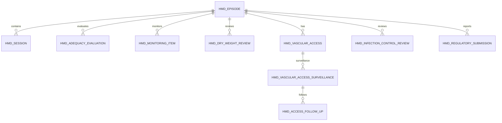

---

# 12.4 Frontend Menu Target

Phase 2 mempertahankan menu Phase 1 dan menambahkan:

```text
Pelayanan Kesehatan
└── Hemodialisa
    ├── Beranda Hemodialisa
    ├── Daftar Pasien Hemodialisa
    ├── Jadwal & Daftar Kerja
    ├── Kesiapan Unit
    │
    ├── Monitoring Longitudinal        ← PHASE 2
    └── Pelaporan & Integrasi          ← PHASE 2
```

### Child additions pada Episode Workspace

```text
Episode Workspace
├── Ringkasan
├── Kelayakan
├── Akses Vaskular
├── Consent
├── Prescription
├── Riwayat Sesi
│
├── Adekuasi                       ← P2
├── Monitoring Berkala             ← P2
├── Berat Kering & Cairan          ← P2
└── Akses & Pengendalian Infeksi   ← P2
```

---

# 12.5 Skema Tampilan — Monitoring Longitudinal

```text
+----------------------------------------------------------------+
| MONITORING LONGITUDINAL HEMODIALISA                            |
+----------------------------------------------------------------+
| Cari pasien | Status [Due/Overdue] | Jenis Monitoring          |
+----------------------------------------------------------------+

| Pasien | Monitoring | Terakhir | Berikutnya | Status | Aksi     |
|--------|------------|----------|------------|--------|----------|
| A      | Adekuasi   | 01/08    | 01/09      | Due    | Review   |
| B      | Serologi   | ...      | ...        |Overdue | Review   |
| C      | Akses      | ...      | ...        | Due    | Review   |

+----------------------------------------------------------------+
```

---

# 12.6 Skema Tampilan — Adekuasi

```text
PATIENT + EPISODE HEADER

ADEKUASI TERBARU
------------------------------------------------------
Session          : ...
Pre Result       : ...
Post Result      : ...
Method           : ...
Kt/V             : ...
URR              : ...
Target           : ...
Status           : REVIEW REQUIRED / REVIEWED
------------------------------------------------------

TREND
[ Grafik berdasarkan periode ]

HISTORI REVIEW
Tanggal | Nilai | Metode | Reviewer | Keputusan

[Review]
```

---

# 12.7 Skema Tampilan — Akses & Infeksi

```text
AKSES VASKULAR
------------------------------------------------------
Current Access
Type
Location
Status
Last Surveillance

[Catat Surveillance] [Catat Follow-up]

SEROLOGI
------------------------------------------------------
HBsAg        | hasil | tanggal | source Lab
anti-HBs     | hasil | tanggal | source Lab
anti-HCV     | hasil | tanggal | source Lab
anti-HIV     | hasil | tanggal | source Lab

INFECTION CONTROL
------------------------------------------------------
Isolation Decision
Vaccination Review
Next Monitoring
```

---

# 12.8 Skema Tampilan — Pelaporan & Integrasi

```text
+----------------------------------------------------------------+
| PELAPORAN & INTEGRASI                                          |
+----------------------------------------------------------------+

[Registrasi/Laporan] [SATUSEHAT] [Rekonsiliasi]

REGULATORY
Period | Total | Valid | Invalid | Submitted | Correction

SATUSEHAT
Resource | Patient | Status | Last Attempt | Error | Retry

RECONCILIATION
Source | Reference | Error | Owner | Action
```

---

# 13. API Capability Targets

Semua endpoint berikut **TARGET**, belum claim existing.

Base:

```text
/api/v1/health-services/hemodialysis-management
```

## Longitudinal

```text
GET  /episodes/{episodeId}/longitudinal-summary

GET  /episodes/{episodeId}/adequacy
POST /episodes/{episodeId}/adequacy/evaluate
POST /adequacy/{id}/review

GET  /episodes/{episodeId}/monitoring
POST /episodes/{episodeId}/monitoring
POST /monitoring/{id}/defer
POST /monitoring/{id}/review

GET  /episodes/{episodeId}/dry-weight-history
POST /episodes/{episodeId}/dry-weight-reviews

GET  /vascular-access/{accessId}/surveillance
POST /vascular-access/{accessId}/surveillance
POST /vascular-surveillance/{id}/follow-up

GET  /episodes/{episodeId}/infection-control
POST /episodes/{episodeId}/infection-control/review
```

## Reporting

```text
POST /reporting/datasets/generate
GET  /reporting/datasets/{id}
POST /reporting/datasets/{id}/validate
POST /reporting/datasets/{id}/export
POST /reporting/datasets/{id}/mark-submitted
POST /reporting/datasets/{id}/correction
```

## SATUSEHAT

Endpoint module-facing target:

```text
POST /integrations/satusehat/episodes/{episodeId}/prepare
POST /integrations/satusehat/submissions/{id}/send
POST /integrations/satusehat/submissions/{id}/retry
GET  /integrations/satusehat/reconciliation
```

Actual outbound contract harus melewati integration adapter yang disetujui.

---

# 14. Permission Matrix

| Resource | Read | Write | Special |
|---|---|---|---|
| Adequacy | Clinical HD | Sistem + clinician | Review |
| Monitoring Plan | Clinical HD | Authorized clinician | Defer |
| Dry Weight | Clinical HD | Dokter berwenang | Activate target |
| Access Surveillance | Clinical HD | Dokter/perawat sesuai role | Follow-up |
| Infection Control | Clinical HD/PPI | Authorized role | Isolation review |
| Regulatory Dataset | Reporting/RM | Reporting | Validate/Submit |
| SATUSEHAT | Integration/RM | Integration service | Retry/Reconcile |
| Incident Handoff | Clinical/quality authorized | Clinical authorized | Handoff |

Server-side authorization wajib.

---

# 15. Integration & Billing Boundary

## Laboratory

Authoritative owner:

**Laboratory.**

HMD tidak menyalin result.

## Pharmacy

Phase 2 tidak menambah stok/farmasi baru.

## Billing

FEAT-033 sudah selesai pada scope Phase 1.

Phase 2 hanya membaca bila data billing diperlukan untuk reconciliation/reporting.

## SATUSEHAT

Phase 2 adalah producer mapping dari clinical record final.

## Incident Management

HMD adalah source/handoff, bukan owner lifecycle incident.

## Bedah Vaskular

HMD mereferensikan referral/follow-up, bukan melakukan management prosedur vaskular.

---

# 16. Regulatory Guardrails

PNPK Tata Laksana Penyakit Ginjal Kronik HK.01.07/MENKES/1634/2023 masih tersedia pada portal produk hukum resmi Kemenkes dan menjadi basis clinical requirement sumber.

Permenkes 24/2022 tentang Rekam Medis juga masih ditandai **Berlaku**, sehingga longitudinal correction, access dan interoperability harus tetap mempertahankan integritas record.

SATUSEHAT menyatakan dokumentasi interoperabilitas dapat berkembang mengikuti rilis ekosistem; karena itu versi playbook harus dicatat ketika kontrak integrasi dibekukan.

---

# 17. Non-Functional Requirements

### NFR-HD-P2-001 — Source Traceability
Setiap derived value wajib dapat kembali ke source record.

### NFR-HD-P2-002 — Formula Versioning
Perhitungan adekuasi menyimpan method/version.

### NFR-HD-P2-003 — No Silent Recalculation
Perubahan formula tidak menulis ulang historical evaluation.

### NFR-HD-P2-004 — Integration Idempotency
Retry SATUSEHAT tidak menghasilkan duplicate resource.

### NFR-HD-P2-005 — Resilient Integration
External outage tidak memblokir clinical workflow.

### NFR-HD-P2-006 — Source Correction Awareness
Correction Lab dapat menandai evaluation terkait sebagai perlu ditinjau ulang.

### NFR-HD-P2-007 — Privacy
Serology dan incident reference mengikuti least privilege.

### NFR-HD-P2-008 — Versioned Reporting
Correction setelah submission menghasilkan revisi/version baru.

---

# 18. UAT Phase 2

| ID | Skenario | Expected |
|---|---|---|
| HD-P2-UAT-001 | Adequacy menggunakan Lab dari sesi benar | Calculation berhasil |
| HD-P2-UAT-002 | Pre/post Lab dari sesi berbeda | Ditolak |
| HD-P2-UAT-003 | Nilai di bawah target | Flag review; prescription tidak berubah |
| HD-P2-UAT-004 | Monitoring due | Muncul di worklist |
| HD-P2-UAT-005 | Monitoring deferred | Reason + author wajib |
| HD-P2-UAT-006 | Dry-weight target berubah | Histori lama tetap ada |
| HD-P2-UAT-007 | Abnormal access finding | Follow-up dapat dibuat |
| HD-P2-UAT-008 | New serology result | Review isolation dipicu |
| HD-P2-UAT-009 | Dataset incomplete | Tidak dapat dinyatakan valid |
| HD-P2-UAT-010 | Dataset dikoreksi setelah submit | Revision tetap traceable |
| HD-P2-UAT-011 | SATUSEHAT accepted | External ID/correlation tersimpan |
| HD-P2-UAT-012 | SATUSEHAT rejected | Clinical record tetap final |
| HD-P2-UAT-013 | SATUSEHAT retry | Tidak membuat duplicate |
| HD-P2-UAT-014 | Komplikasi perlu incident handoff | Reference dapat dilacak |
| HD-P2-UAT-015 | Unauthorized user membuka serology | Ditolak |

---

# 19. Definition of Done

Phase 2 selesai bila:

- longitudinal summary berfungsi;
- adequacy source traceable;
- monitoring worklist berfungsi;
- dry-weight history versioned;
- surveillance akses dapat ditelusur;
- serology tidak diduplikasi dari Lab;
- isolation review terhubung ke longitudinal data;
- regulatory dataset tervalidasi;
- correction dataset versioned;
- SATUSEHAT menggunakan correlation/idempotency;
- external failure memiliki reconciliation worklist;
- incident handoff tidak menduplikasi incident management;
- permission tests PASS;
- BE build/test PASS;
- FE lint/build/test PASS;
- seluruh UAT Phase 2 PASS.

---

# 20. Delivery Waves & Open Decisions

## Wave P2-A — Longitudinal Core

```text
FEAT-020
FEAT-021
FEAT-022
```

## Wave P2-B — Vascular & Infection Control

```text
FEAT-023
FEAT-024
FEAT-025
```

## Wave P2-C — Reporting

```text
FEAT-031
```

## Wave P2-D — SATUSEHAT

```text
FEAT-032
```

## Wave P2-E — Safety Handoff

```text
FEAT-034
```

### GRILL-HD-005 — Adequacy Policy

Harus ditutup sekali pada combined Grill:

> Metode adekuasi apa yang diaktifkan sebagai production calculation dan bagaimana target ditentukan untuk kelompok/frekuensi pasien?

Sistem tetap dibuat versionable agar metode dapat berubah tanpa merusak histori.

### GRILL-HD-006 — Longitudinal Monitoring Policy

Satu policy pack menetapkan:

- cadence periodic laboratory;
- cadence vascular surveillance;
- cadence serology;
- vaccination review;
- trigger review dry weight.

Nilainya tidak boleh diarang oleh development team.

---

# 21. Mandatory Diagram Pack

## FEAT-020


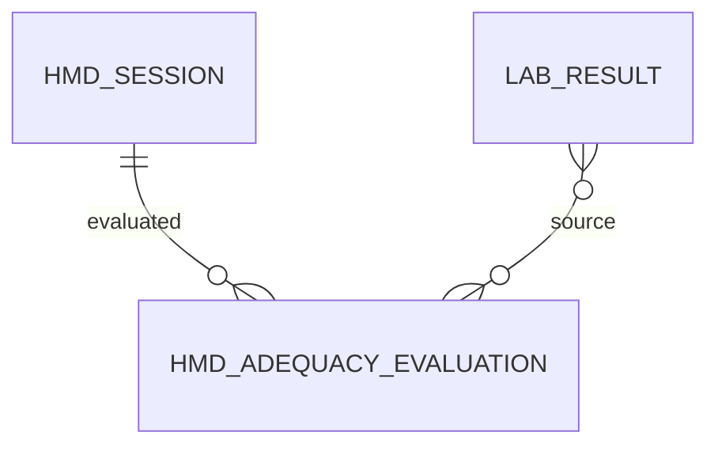

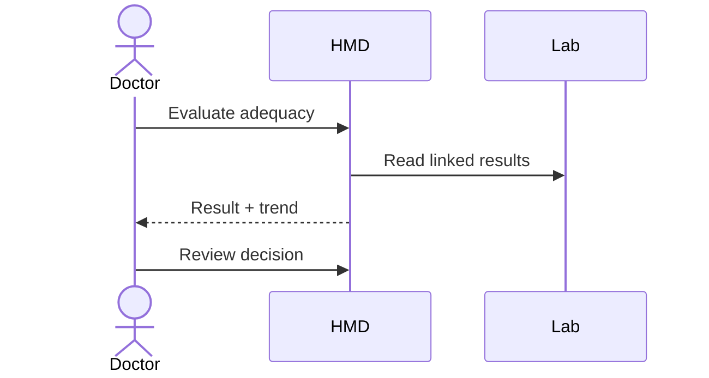

## FEAT-021


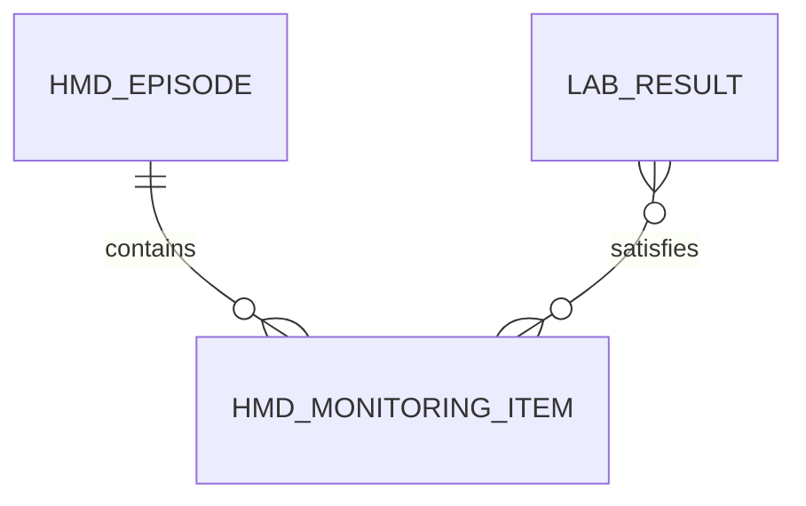

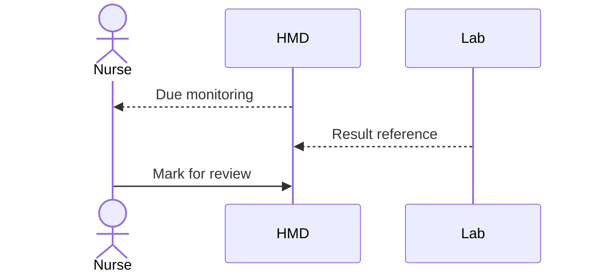

## FEAT-022

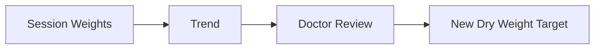

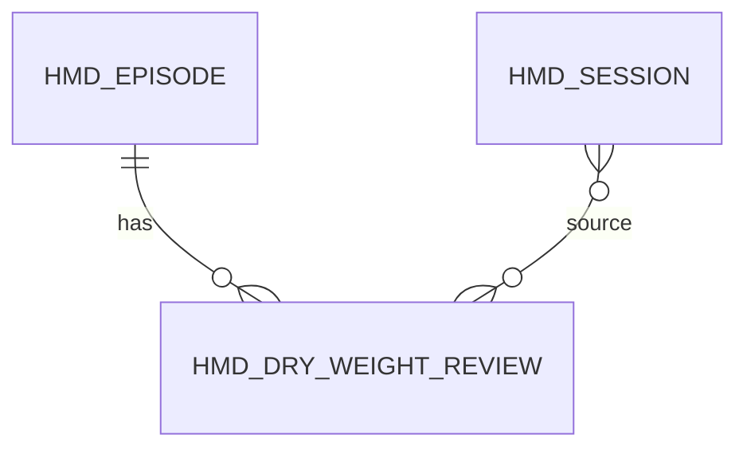

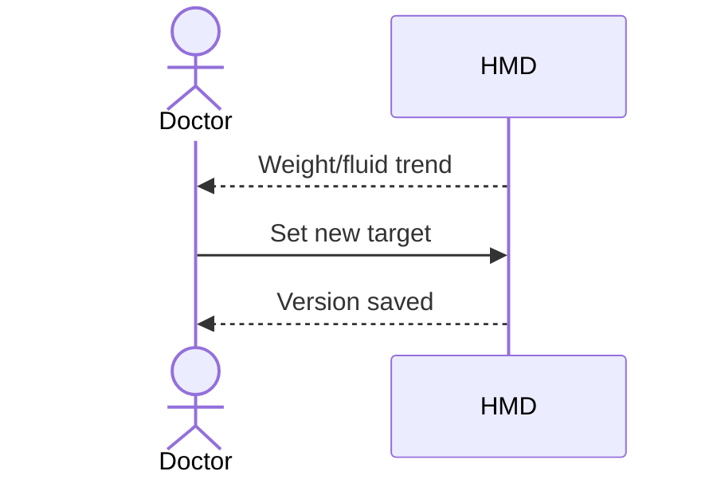

## FEAT-023

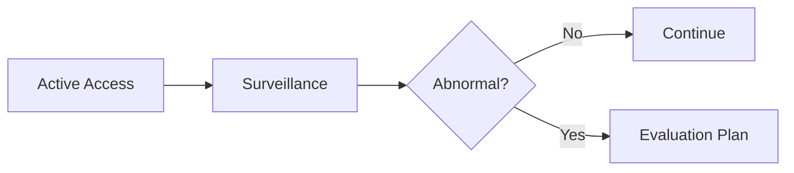

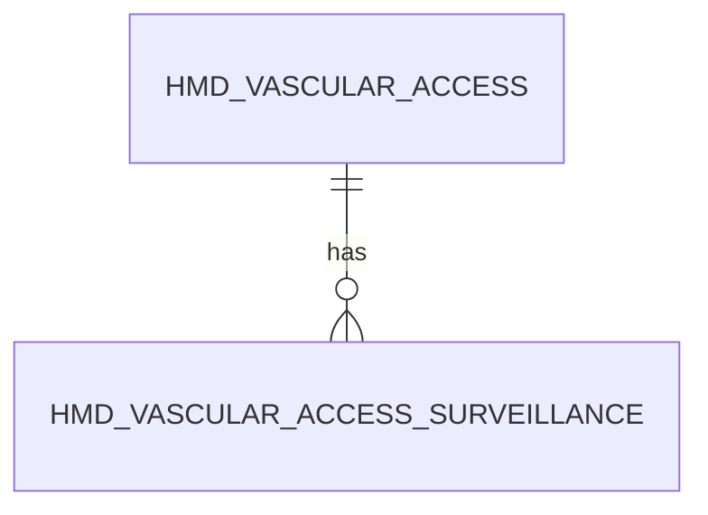

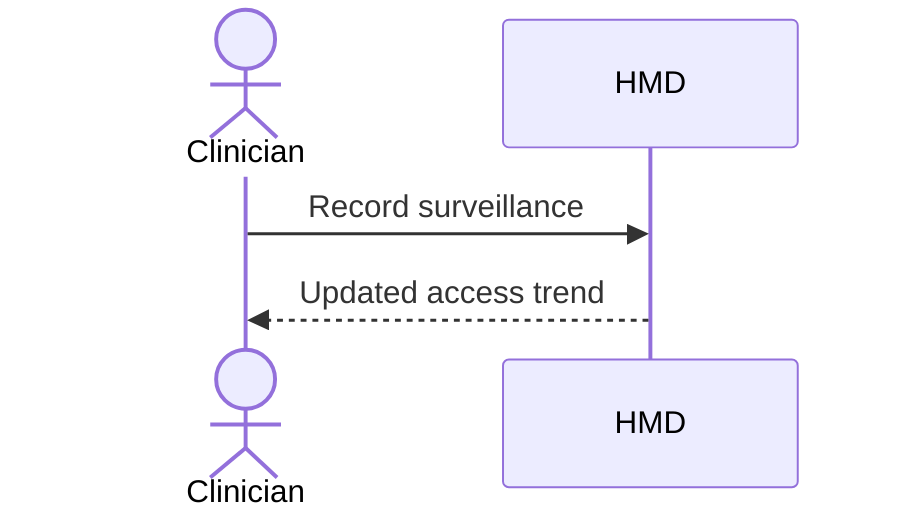

## FEAT-024


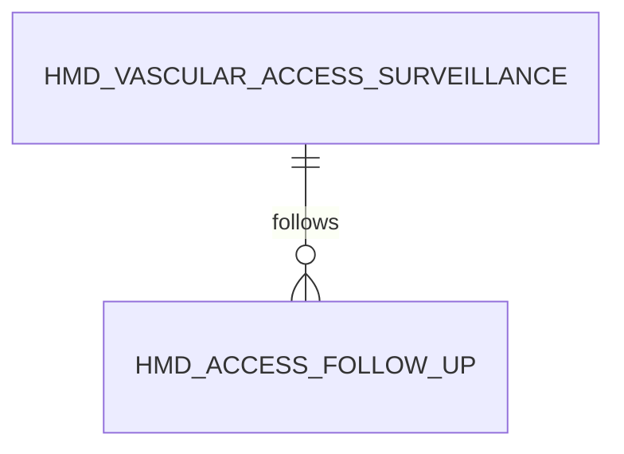

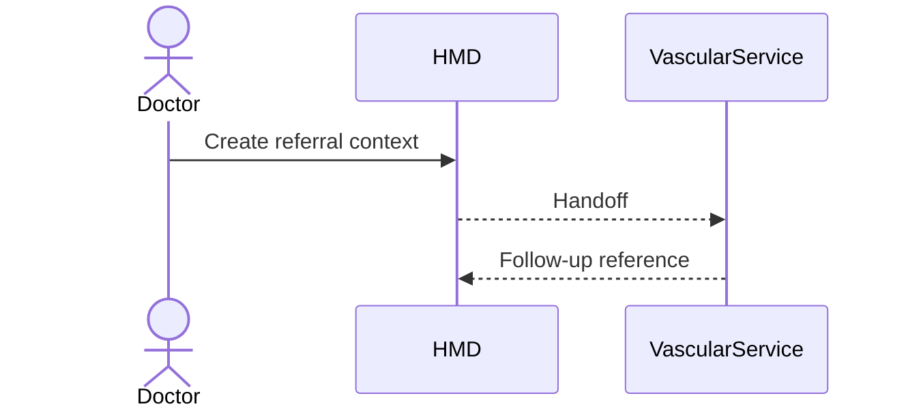

## FEAT-025


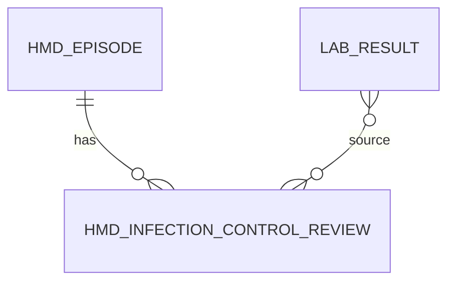

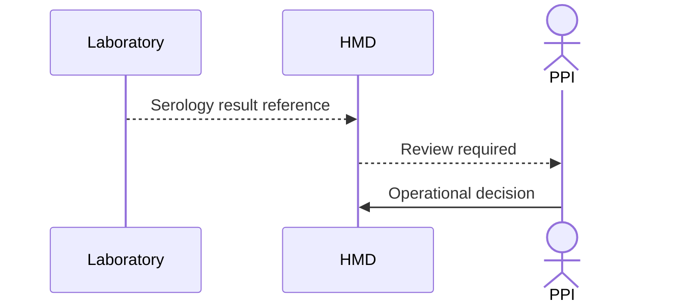

## FEAT-031


```mermaid
erDiagram
HMD_EPISODE ||--o{ HMD_REGULATORY_SUBMISSION : reported
```

```mermaid
sequenceDiagram
actor R as ReportingOfficer
participant H as HMD
R->>H: Generate dataset
H-->>R: Validation
R->>H: Mark submit/export
```

## FEAT-032

```mermaid
flowchart LR
A[Final Data] --> B[FHIR Mapping]
B --> C[Send]
C --> D{Accepted?}
D -->|Yes| E[Reconciled]
D -->|No| F[Retry Queue]
```

```mermaid
erDiagram
HMD_EPISODE ||--o{ INTEGRATION_TRANSACTION : maps
HMD_SESSION ||--o{ INTEGRATION_TRANSACTION : maps
```

```mermaid
sequenceDiagram
participant H as HMD
participant I as Integration
participant S as SATUSEHAT
H->>I: Final clinical facts
I->>S: FHIR request
S-->>I: Response
I-->>H: Integration status
```

## FEAT-034

```mermaid
flowchart LR
A[Complication] --> B[Incident Review Needed]
B --> C[Handoff]
C --> D[Incident Reference]
```

```mermaid
erDiagram
HMD_SESSION_COMPLICATION ||--o| INCIDENT_REFERENCE : hands_off
```

```mermaid
sequenceDiagram
actor C as Clinician
participant H as HMD
participant Q as QualitySystem
C->>H: Flag for incident review
H->>Q: Handoff
Q-->>H: Incident reference
```

---

# Relationship Matrix

| Feature | Source utama | New/Extend | External owner |
|---|---|---|---|
| FEAT-020 | Session + Lab | New longitudinal | Laboratory |
| FEAT-021 | Episode + Lab | New orchestration | Laboratory |
| FEAT-022 | Session | New longitudinal | — |
| FEAT-023 | HmdVascularAccess | Extend | — |
| FEAT-024 | Access surveillance | New handoff | Vascular/IR |
| FEAT-025 | Lab + Isolation | Extend | Lab/PPI |
| FEAT-031 | Final clinical data | New reporting | Regulator |
| FEAT-032 | Final clinical data | New adapter | SATUSEHAT |
| FEAT-034 | Complication | Extend handoff | Quality |

---

# Status Phase 2

**DRAFT — GRILL READY**

Setelah combined Grill selesai:

```text
DRAFT — GRILL READY
→ BUSINESS APPROVED
→ WAITING PHASE-1 CONTRACT SYNC
→ IMPLEMENTATION READY
```

Tidak perlu Grill ulang setelah Phase 1 selesai.

Yang dilakukan hanya **Implementation Impact Sync** untuk mengganti reference entity/API sesuai kontrak Phase 1 yang benar-benar sudah terbentuk.