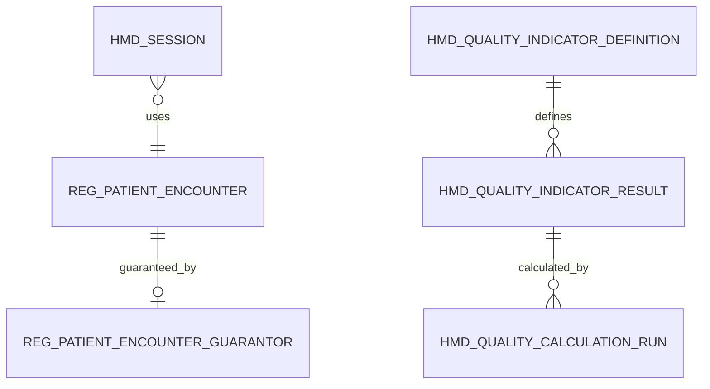
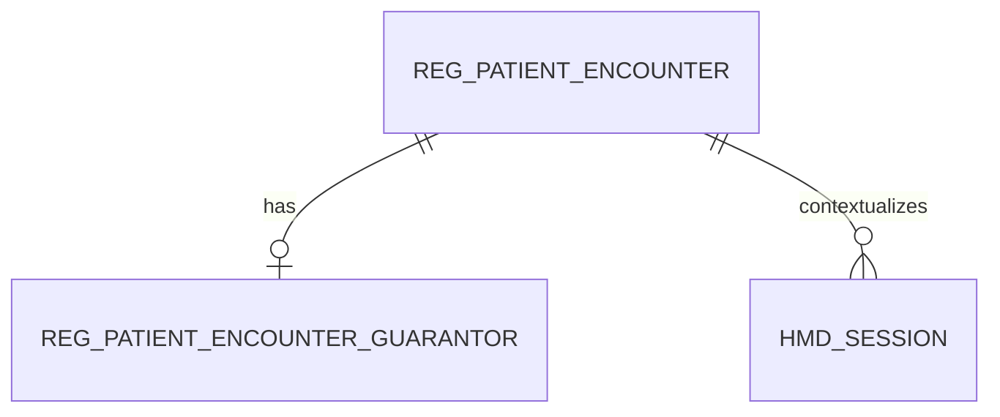
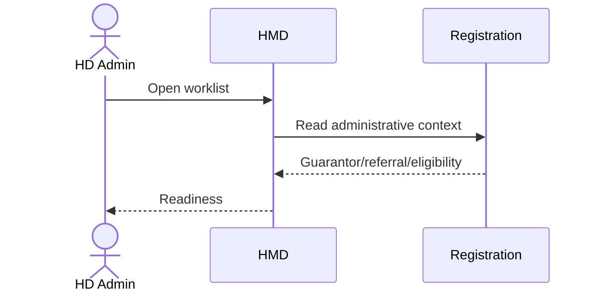
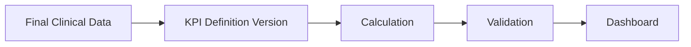
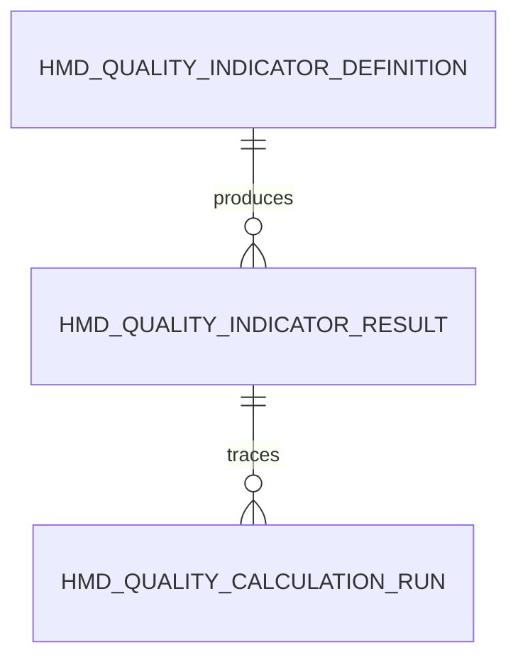
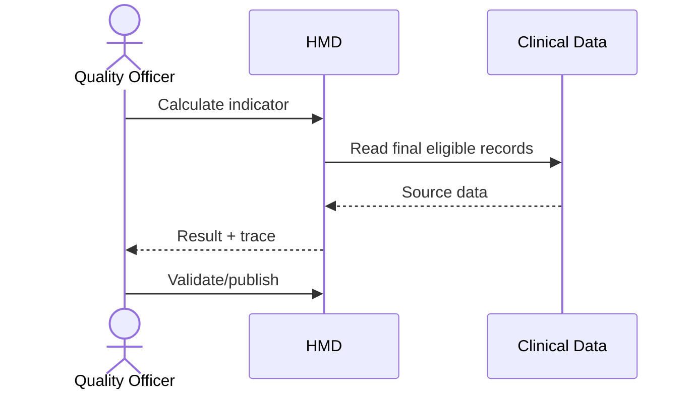

# PRD PHASE 3 — HEMODIALISA
## Administrative Optimization & Quality Management

---

# 1. Identitas Dokumen

| Field | Nilai |
|---|---|
| Produk | Quilvian V2 |
| Modul | Hemodialisa |
| Release | Phase 3 / Release 3 |
| Fokus | JKN Administrative Optimization & Quality |
| Status | **DRAFT — GRILL READY / FUTURE OPTIMIZATION** |
| Depends On | Phase 1 + Phase 2 |
| Backend | `DevBenari/NewQuilvianSystemBackend` |
| Backend branch | `MHamzah` |
| Baseline | `69b256ca3cdc86113b65777c856d5938c59a1145` |
| Frontend | `DevBenari/QuilvianSystemFrontendDev` |
| Frontend branch | `HamzahV2` |
| Baseline | `8143874d8373b534b7f3f535f9454ed8ec68a604` |
| Tanggal | 18 September 2026 |
| Grill strategy | Satu combined Grill Phase 1–3 |

Phase 3 mengikuti dua capability dari analisis sumber:

- FEAT-002 — Verifikasi administrasi JKN dan rujukan;
- FEAT-035 — Indikator mutu dan audit layanan HD. 
---

# 2. Ringkasan Eksekutif

Phase 3 tidak menambah proses klinis utama.

Phase 3 menggunakan data matang dari Phase 1 dan Phase 2 untuk:

```text
1. mengurangi pekerjaan administratif pasien JKN;

2. memperjelas kesiapan administratif tanpa mencampurnya
   dengan keputusan klinis;

3. mengubah data HD menjadi indikator mutu yang reproducible;

4. menyediakan dashboard dan audit yang dapat dilacak
   sampai definisi serta sumber datanya.
```

Phase 3 adalah **optimization release**, bukan syarat agar pasien dapat menjalani HD.

---

# 3. Masalah Produk

Tanpa Phase 3, petugas masih dapat melakukan HD.

Tetapi akan ada dua masalah.

## Problem A — Administrasi JKN terpisah dari workflow HD

Petugas HD harus membuka beberapa konteks untuk mengetahui:

```text
Penjamin pasien?
Eligible?
Rujukan tersedia?
SEP tersedia?
Surat kontrol?
Ada masalah administratif?
```

Requirement sumber menegaskan bahwa status administratif harus tetap terpisah dari status kelayakan klinis.

## Problem B — Data banyak, tetapi mutu belum terukur secara formal

Phase 1 + Phase 2 menghasilkan:

- session;
- adequacy;
- complication;
- access;
- infection;
- resource;
- staffing;
- reporting.

Tanpa quality layer, data tersebut belum otomatis menjadi indikator yang:

- mempunyai numerator;
- denominator;
- population;
- period;
- version;
- target;
- approval.

---

# 4. Visi Produk Phase 3

```text
Clinical Operations
        │
        ├── Phase 1 — Session
        │
        ├── Phase 2 — Longitudinal
        │
        └── Phase 3
             ├── Administrative Readiness
             └── Quality Intelligence
```

Phase 3 tidak boleh menjadi source of truth baru untuk data clinical ataupun insurance.

---

# 5. Batas Phase 3

## In Scope

### Administrative Optimization

- administrative readiness;
- payment/guarantor context;
- JKN indicator;
- referral status;
- SEP status;
- control-letter status bila tersedia;
- administrative issue worklist;
- traceability status change.

### Quality

- versioned KPI definition;
- numerator;
- denominator;
- population;
- period;
- target;
- quality result;
- trend;
- data-quality status;
- drill-down terkontrol;
- audit/reproducibility.

## Out of Scope

- membangun BPJS eligibility rules sendiri;
- claim adjudication;
- INA-CBG grouping;
- coding engine;
- fraud detection;
- automatic clinical recommendations;
- changing clinical records from dashboard;
- executive BI lintas seluruh RS.

---

# 6. Aktor Sasaran

| Aktor | Peran |
|---|---|
| Petugas Pendaftaran | Registration data |
| Petugas Penjaminan | JKN/guarantor readiness |
| Petugas Administrasi HD | Memantau readiness |
| Koordinator HD | Operational oversight |
| Rekam Medis | Data quality |
| Komite Mutu | KPI approval/review |
| Manajemen RS | Aggregated quality view |
| Auditor authorized | Audit |
| Dokter/perawat | Clinical drill-down terbatas sesuai permission |

---

# 7. Pemilihan Kemampuan Phase 3

## FEAT-002 — Verifikasi Administrasi JKN & Rujukan

Sumber menyatakan:

- actor: pendaftaran dan penjaminan;
- outcome: SEP/rujukan/surat kontrol tercatat;
- status administratif terpisah dari status kelayakan HD;
- kegagalan administratif tidak otomatis membatalkan emergency care.

## FEAT-035 — Indikator Mutu & Audit

Sumber menuntut:

- data agregat;
- evaluasi keselamatan, adekuasi, infeksi, akses dan utilisasi;
- indicator reproducible;
- numerator;
- denominator;
- period;
- population;
- version;
- identity restriction pada dashboard agregat.

Kedua feature menjadi MUST HAVE Phase 3.

---

# 8. Kemampuan Ditunda

Tetap tidak termasuk:

```text
AI quality prediction
automated clinical recommendation
national benchmarking tanpa authoritative source
fraud analytics
claim scoring
hospital-wide enterprise BI
```

---

# 9. Alur Bisnis Target

## FLOW-HD-P3-001 — Administrative Readiness

```text
Encounter dibuat
    ↓
Guarantor/Insurance context tersedia
    ↓
HMD membaca administrative context
    ↓
Status kesiapan:
- Ready
- Attention Required
- Pending
    ↓
Petugas Penjaminan menyelesaikan masalah
    ↓
Status diperbarui dari source owner
```

Clinical eligibility tetap mempunyai lifecycle sendiri.

```text
Administrative Status ≠ Clinical Eligibility
```

---

## FLOW-HD-P3-002 — Quality Evaluation

```text
Final Clinical Data
    ↓
Versioned KPI Definition
    ↓
Population Selection
    ↓
Numerator / Denominator Calculation
    ↓
Quality Result
    ↓
Review
    ↓
Published / Closed Period
```

Historical KPI tidak dihitung ulang menggunakan definisi versi baru tanpa explicit recomputation record.

---

# 10. Epic dan Functional Requirements

# EPIC HD-P3-01 — Administrative & JKN Optimization

## FR-HD-P3-001 — Administrative Readiness

HMD menampilkan consolidated status.

Contoh:

```text
ADMINISTRATIVE READINESS
--------------------------------
Payment Source    : BPJS/JKN
Eligibility       : Valid
Referral          : Valid
SEP               : Available
Control Letter    : Available / N/A
Billing Context   : Ready
--------------------------------
Status            : READY
```

Jika ada masalah:

```text
Status: ATTENTION REQUIRED

Issue:
SEP belum tersedia
```

### Critical rule

`ATTENTION REQUIRED`:

**tidak sama dengan `Clinical Hold`.**

Hanya clinical/business rule yang secara eksplisit disahkan yang dapat menghentikan treatment.

Emergency clinical decision tetap berada pada tenaga berwenang.

---

## FR-HD-P3-002 — Source Ownership

Current backend mempunyai encounter-owned payment/guarantor structure.

HMD harus membaca source tersebut.

Tidak membuat:

```text
HmdBPJSMember
HmdInsurance
HmdSEP
HmdReferral
```

### Target relationship

```text
HmdSession
→ RegPatientEncounter
→ RegPatientEncounterGuarantor
→ Insurance / BPJS related source
```

Repo sekarang juga sudah mengenal nilai `BPJS` pada `PatientEncounterGuarantorType`.

Namun branch yang dianalisis belum menunjukkan implementasi dedicated `VClaim`/SEP integration dalam pencarian repository.

Karena itu direct BPJS integration **tidak boleh diasumsikan existing**.

---

## FR-HD-P3-003 — Administrative Worklist

Frontend menyediakan filter:

```text
Ready
Pending
Attention Required
```

Tabel:

```text
Patient
MRN
Schedule
Guarantor
Referral
SEP
Issue
Owner
Action
```

Tujuannya bukan membuat proses BPJS baru, tetapi membuat masalah administrasi terlihat sebelum hari/saat session.

---

## FR-HD-P3-004 — Administrative Audit

Perubahan status yang dikonsumsi HMD harus tetap dapat menunjukkan:

- source;
- retrieved at;
- current status;
- changed at bila diketahui.

HMD tidak boleh mencatat seolah-olah dirinya issuer SEP.

---

# EPIC HD-P3-02 — Quality Indicator & Audit

## FR-HD-P3-005 — Versioned KPI Definition
**Source:** FEAT-035

Proposed entity:

```text
HmdQualityIndicatorDefinition
```

Minimum:

```text
Code
Name
Description
NumeratorDefinition
DenominatorDefinition
PopulationDefinition
PeriodType
Unit
Target?
EffectiveFrom
EffectiveTo?
Version
ApprovalStatus
ApprovedBy
ApprovedAt
```

Target dapat kosong bila belum disahkan.

Sistem tidak boleh mengarang target nasional.

---

## FR-HD-P3-006 — KPI Calculation

Calculation hanya menggunakan data clinical/reporting final yang memenuhi definition version.

Proposed result:

```text
HmdQualityIndicatorResult
```

Minimum:

```text
IndicatorDefinitionId
DefinitionVersion
PeriodStart
PeriodEnd
Numerator
Denominator
Result
TargetSnapshot?
Status
CalculatedAt
```

### Rule

Jika denominator = 0:

```text
ResultStatus = NotApplicable
```

bukan division error atau `0%`.

---

## FR-HD-P3-007 — Reproducibility

Setiap KPI result harus dapat menjawab:

```text
Definition version apa?
Periode apa?
Populasi apa?
Data source apa?
Kapan dihitung?
```

Quality analyst harus dapat mereproduksi hasil menggunakan definition version yang sama.

---

## FR-HD-P3-008 — Quality Dashboard

Kategori high-level sesuai requirement sumber dapat meliputi:

```text
Adequasi
Infeksi
Akses vaskular
Komplikasi
Utilisasi
Keselamatan
```

Daftar tersebut adalah kategori, bukan target atau standard nasional.

### Display

```text
+-----------------------------------------------------------+
| MUTU LAYANAN HEMODIALISA                                 |
+-----------------------------------------------------------+
| Period [2026-09]                                         |
+-----------------------------------------------------------+

| Indicator       | Result | Target | Trend | Data Quality |
|-----------------|--------|--------|-------|--------------|
| ...             | ...    | ...    | ...   | Valid        |

[Detail]
```

---

## FR-HD-P3-009 — Drill-Down

Authorized quality role dapat melihat alasan sebuah result.

Contoh:

```text
Indicator
    ↓
Period Result
    ↓
Population
    ↓
Eligible source records
```

Patient identity tidak ditampilkan kepada role yang hanya memiliki aggregated quality permission.

---

## FR-HD-P3-010 — Definition Versioning

Jika definisi KPI berubah:

```text
KPI Version 1
Jan-Jun

KPI Version 2
Jul-Dec
```

Historical result Jan-Jun tetap menggunakan V1.

Tidak melakukan silent recomputation.

---

# 11. Proposed Status Model

## Administrative readiness

```text
Unknown
→ Pending
→ Ready
```

atau:

```text
Pending
→ AttentionRequired
→ Ready
```

`Clinical Emergency` tidak dimodelkan sebagai administrative status.

## KPI definition

```text
Draft
→ Review
→ Approved
→ Retired
```

## KPI result

```text
Draft
→ Calculated
→ Validated
→ Published
```

Jika source issue:

```text
Calculated
→ DataIssue
```

---

# 12. Architecture Targets

## Existing / Reuse

```text
RegPatientEncounter
RegPatientEncounterGuarantor
MstPatientInsurance / Insurance source
HmdEpisode
HmdSession
HmdAdequacyEvaluation
HmdVascularAccess
HmdSessionComplication
```

## Proposed Phase 3

```text
HmdQualityIndicatorDefinition
HmdQualityIndicatorResult
HmdQualityCalculationRun
```

Untuk administrative status, usahakan **derived view/query** terlebih dahulu.

Tidak membuat `HmdAdministrativeReadiness` persisted jika status dapat dihitung secara deterministik dari source owner.

---

# 12.1 ERD Konseptual



---

# 12.2 Menu Target

Phase 3 tidak perlu membuat sidebar JKN terpisah.

Administrative readiness muncul pada:

```text
Daftar Pasien Hemodialisa
Jadwal & Daftar Kerja
Episode Workspace
Session Workspace
```

Phase 3 menambahkan satu menu:

```text
Pelayanan Kesehatan
└── Hemodialisa
    ├── ...
    ├── Monitoring Longitudinal
    ├── Pelaporan & Integrasi
    │
    └── Mutu Layanan             ← PHASE 3
```

---

# 12.3 Skema Tampilan — Administrative Readiness

Pada row worklist:

```text
Pasien A
07:00
Machine HD-01

Clinical      READY
Administrative ATTENTION

BPJS
✓ Membership
✓ Referral
! SEP Pending

[Lihat Administrasi]
```

Petugas klinis tidak harus membuka layar Billing hanya untuk mengetahui ada administrative issue.

---

# 12.4 Skema Tampilan — Mutu Layanan

```text
+================================================================+
| MUTU LAYANAN HEMODIALISA                                      |
+================================================================+
| Period [Bulanan v]       Status Data [Validated]                |
+================================================================+

RINGKASAN

| Indicator | Result | Target | Trend | Status |

---------------------------------------------------------------

[ Adekuasi ]
[ Infeksi ]
[ Akses ]
[ Komplikasi ]
[ Utilisasi ]

---------------------------------------------------------------

[Definisi Indikator] hanya untuk authorized role
```

---

# 12.5 Skema Definisi KPI

```text
Kode
Nama

Deskripsi

Numerator Definition
Denominator Definition
Population

Periode

Satuan

Target (optional)

Effective Date

Version

[Save Draft] [Submit Review]
```

Approval dilakukan role yang ditetapkan rumah sakit.

---

# 13. API Capability Targets

## Administrative

Sebisa mungkin read-only composition:

```text
GET /episodes/{episodeId}/administrative-readiness

GET /worklist?administrativeStatus=
```

Jika BPJS adapter kelak disetujui:

```text
POST /integrations/jkn/eligibility/refresh
POST /integrations/jkn/sep/refresh
```

Endpoint tersebut hanya dibuat jika GRILL-HD-007 menetapkan direct integration sebagai scope.

---

## Quality

```text
GET  /quality/indicators
POST /quality/indicators
PUT  /quality/indicators/{id}
POST /quality/indicators/{id}/submit-review
POST /quality/indicators/{id}/approve
POST /quality/indicators/{id}/retire

POST /quality/calculations
GET  /quality/results
GET  /quality/results/{id}
GET  /quality/results/{id}/drilldown
```

---

# 14. Permission Matrix

| Resource | Read | Write | Approve |
|---|---|---|---|
| Administrative Readiness | HD/admin authorized | Source module owner | — |
| JKN Detail | Penjaminan authorized | Registration/Insurance owner | — |
| KPI Dashboard | Quality/management | — | — |
| KPI Definition | Quality analyst | Quality analyst | Quality approver |
| KPI Result | Quality authorized | Calculation service | Validator |
| KPI Drilldown PHI | Explicit clinical/quality permission | — | — |

---

# 15. Integration & Billing Boundary

## BPJS/JKN

Official BPJS guidance available from BPJS states that for advanced referral care, participants present relevant identity/referral documentation and the hospital issues SEP; emergency service follows its own exception path.

Namun direct technical VClaim contract dapat berubah.

Karena itu:

```text
Business requirement
≠
hardcoded external API contract
```

External API contract harus divalidasi lagi pada implementation sync.

## Billing

Phase 3 tidak mengubah Billing ownership.

## Quality

Quality hanya membaca final/source-approved data.

Tidak mengubah HmdSession atau clinical records.

---

# 16. Regulatory Guardrails

Permenkes 11/2025 tetap ditandai berlaku oleh JDIH Kemenkes.

Permenkes 24/2022 tentang Rekam Medis juga masih berlaku dan menjadi guardrail untuk confidentiality, integrity dan traceability.

Requirement sumber sendiri melarang target indikator lokal diperlakukan sebagai standard nasional tanpa source yang mendukung.

---

# 17. Non-Functional Requirements

### NFR-HD-P3-001 — KPI Reproducibility
Hasil dapat dihitung ulang menggunakan definition version yang sama.

### NFR-HD-P3-002 — No Historical Rewrite
KPI definition baru tidak mengubah result lama.

### NFR-HD-P3-003 — PHI Protection
Aggregated dashboard tidak otomatis membuka patient identities.

### NFR-HD-P3-004 — Source Ownership
Administrative status berasal dari Registration/Insurance.

### NFR-HD-P3-005 — Separation of Concern
Administrative issue tidak mengubah clinical eligibility.

### NFR-HD-P3-006 — Query Performance
Dashboard agregat tidak melakukan full raw clinical scan setiap page load; implementation harus menggunakan query/read-model strategy sesuai volume aktual.

### NFR-HD-P3-007 — Audit
Approval KPI definition dan publication result harus terlacak.

---

# 18. UAT Phase 3

| ID | Skenario | Expected |
|---|---|---|
| HD-P3-UAT-001 | Pasien BPJS dengan admin lengkap | Administrative Ready |
| HD-P3-UAT-002 | SEP belum tersedia | Attention Required |
| HD-P3-UAT-003 | Admin bermasalah tetapi emergency clinical care | Tidak auto-cancel |
| HD-P3-UAT-004 | Source guarantor berubah | Readiness ikut source terbaru |
| HD-P3-UAT-005 | KPI dengan denominator normal | Result benar |
| HD-P3-UAT-006 | Denominator 0 | NotApplicable |
| HD-P3-UAT-007 | KPI definition V2 dibuat | Result V1 lama tidak berubah |
| HD-P3-UAT-008 | KPI source data tidak lengkap | DataIssue |
| HD-P3-UAT-009 | User agregat tanpa PHI permission | Identitas pasien tidak tampil |
| HD-P3-UAT-010 | Auditor authorized drill-down | Source dapat ditelusuri |
| HD-P3-UAT-011 | KPI belum approved | Tidak dipublikasikan sebagai KPI resmi |
| HD-P3-UAT-012 | Target tidak disahkan | Sistem tidak mengarang target |

---

# 19. Definition of Done

Phase 3 selesai bila:

- administrative readiness membaca source Registration/Insurance;
- JKN status tidak diduplikasi;
- administrative status terpisah dari clinical state;
- quality definitions versioned;
- calculation reproducible;
- denominator-zero aman;
- historical result immutable;
- KPI target hanya berasal dari approved policy;
- data-quality issue terlihat;
- PHI drill-down dilindungi permission;
- BE tests PASS;
- FE tests/lint/build PASS;
- seluruh UAT Phase 3 PASS.

---

# 20. Delivery Waves & Open Decisions

## Wave P3-A — Administrative Readiness

```text
FEAT-002
```

## Wave P3-B — Quality Foundation

```text
FEAT-035
- Definition registry
- Calculation engine
- Result
```

## Wave P3-C — Quality Dashboard & Audit

```text
FEAT-035
- Dashboard
- Trend
- Drill-down
- Data quality
```

---

# GRILL-HD-007 — JKN Integration Boundary

Satu keputusan:

> Apakah Phase 3 hanya menampilkan dan mengonsolidasikan status JKN/SEP dari Registration/Insurance, atau Quilvian juga harus melakukan integrasi langsung ke BPJS/VClaim untuk validasi/refresh?

### Opsi

**A. Consume existing Registration/Insurance only**  
HMD tidak menghubungi BPJS secara langsung.

**B. Direct BPJS/VClaim integration**  
Memerlukan external contract, credential, error/retry dan audit integration.

**C. Hybrid**  
Registration/Insurance menjadi satu-satunya adapter BPJS; HMD hanya memanggil Registration.

### Target architecture recommendation

Jika direct integration memang dibutuhkan, **adapter BPJS tetap sebaiknya dimiliki Registration/Insurance**, bukan Hemodialisa.

HMD hanya consumer status.

---

# GRILL-HD-008 — KPI Policy

Satu keputusan paket:

> KPI HD apa yang menjadi KPI resmi rumah sakit, siapa approver-nya, dan apakah masing-masing mempunyai target lokal?

Sistem tidak memerlukan target untuk semua indicator.

Indicator tanpa target masih dapat dihitung sebagai monitoring metric.

---

# 21. Mandatory Diagram Pack

## FEAT-002 — JKN / Administrative Readiness






## FEAT-035 — Quality & Audit







---

# Relationship Matrix

| Feature | Source | Owner | Phase 3 use |
|---|---|---|---|
| FEAT-002 | Encounter/Guarantor | Registration/Insurance | Derived readiness |
| FEAT-035 | Final HD clinical data | HMD + Quality governance | Indicator calculation |

---

# 22. MASTER ONE-TIME GRILL CONTRACT — PHASE 1 + 2 + 3

Seluruh tiga PRD Hemodialisa harus diberikan **bersamaan** kepada Grill-Me.

Agent melakukan satu Closure Pass.

## Pertanyaan yang boleh muncul

### Dari Phase 1

**GRILL-HD-001**  
Approve registry:

```text
HemodialysisManagement / Hmd
```

**GRILL-HD-002**  
Clinical hard-stop dan override authority.

**GRILL-HD-003**  
Siapa yang mempunyai authority Finalize HmdSession.

**GRILL-HD-004**  
Doctor mapping untuk `TrxPatientProcedure.DoctorId`.

### Dari Phase 2

**GRILL-HD-005**  
Adequacy calculation policy.

**GRILL-HD-006**  
Longitudinal monitoring cadence policy.

### Dari Phase 3

**GRILL-HD-007**  
JKN integration boundary.

**GRILL-HD-008**  
Official KPI policy & approver.

---

## Grill-Me MUST NOT ASK

Agent tidak perlu lagi bertanya:

- apakah HD mempunyai Encounter sendiri;
- apakah HmdEpisode sama dengan InpEpisode;
- apakah HD memiliki Lab result;
- apakah HD memiliki Pharmacy stock;
- bagaimana Billing dibuat;
- apakah Billing SourceDomain menjadi HEMODIALYSIS;
- dimana menu Hemodialisa;
- apakah SATUSEHAT masuk Phase 2;
- apakah KPI masuk Phase 1;
- apakah JKN memblokir emergency treatment;
- apakah historical KPI boleh berubah;
- apakah data SATUSEHAT gagal membuat clinical session non-final;
- apakah HMD mempunyai incident management sendiri;
- apakah Phase 2/3 perlu menunggu Phase 1 selesai untuk di-grill.

Semua sudah ditetapkan oleh PRD.

---

# 23. Approval & Implementation Rule

Tiga PRD dapat di-Grill **sekarang**.

Setelah delapan keputusan ditutup:

```text
Phase 1
→ BUSINESS APPROVED
→ IMPLEMENTATION READY

Phase 2
→ BUSINESS APPROVED
→ IMPLEMENTATION DEFERRED

Phase 3
→ BUSINESS APPROVED
→ IMPLEMENTATION DEFERRED
```

Saat Phase 1 benar-benar selesai, Phase 2 **tidak di-Grill ulang**.

Hanya dilakukan:

```text
PHASE 2 IMPLEMENTATION SYNC
```

untuk memetakan target PRD ke entity/API Phase 1 aktual.

Hal sama berlaku Phase 3 setelah Phase 2.

Grill baru hanya boleh dibuka kembali bila terjadi perubahan material seperti:

- regulasi baru;
- official external contract berubah;
- rumah sakit mengubah business policy;
- hasil implementasi menemukan konflik bisnis yang tidak mungkin diselesaikan secara teknis.

Perubahan nama DTO, route, index, table relation atau struktur code **bukan alasan untuk Grill ulang**.

---

# Status Akhir Phase 3

**DRAFT — GRILL READY / FUTURE OPTIMIZATION**

Setelah Combined Grill:

```text
BUSINESS APPROVED
↓
WAITING PHASE-1/2 IMPLEMENTATION SYNC
↓
IMPLEMENTATION READY
```