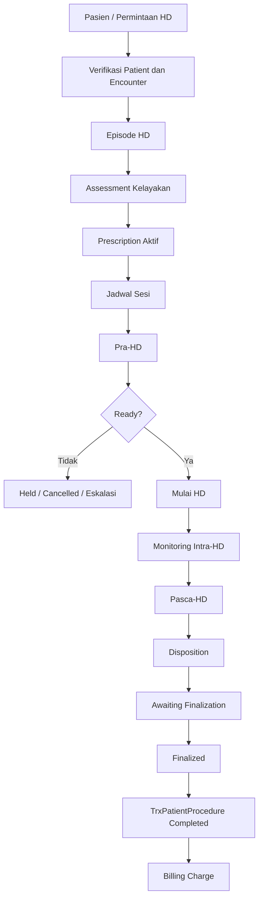
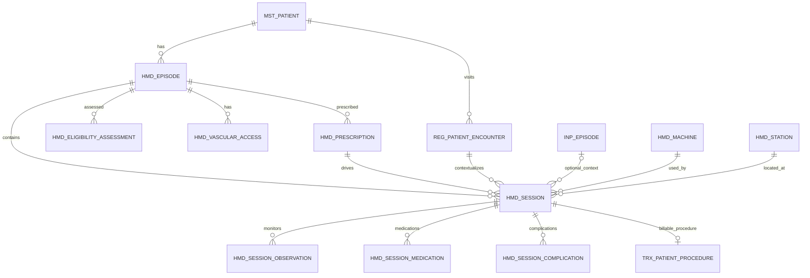
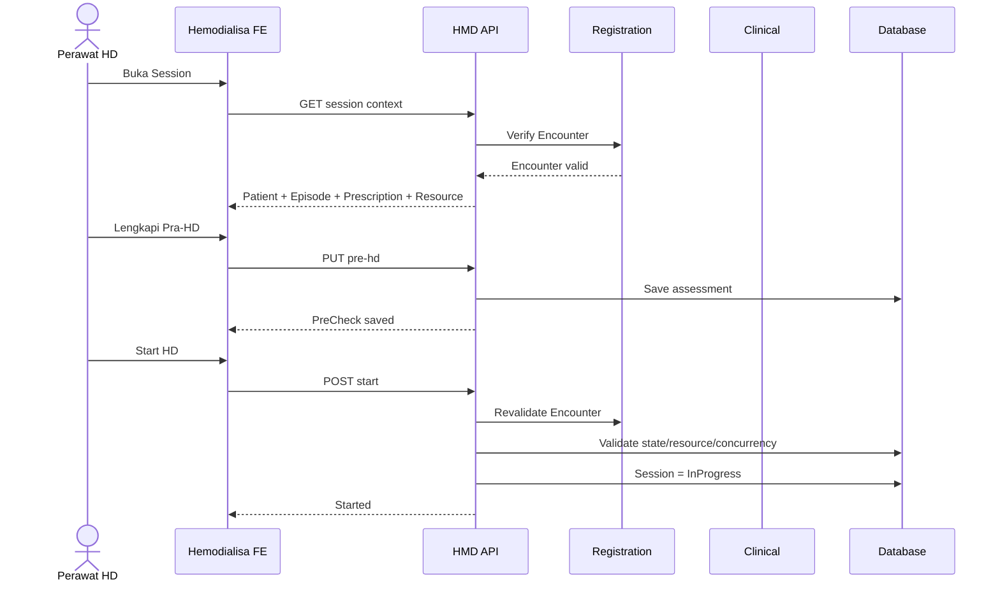
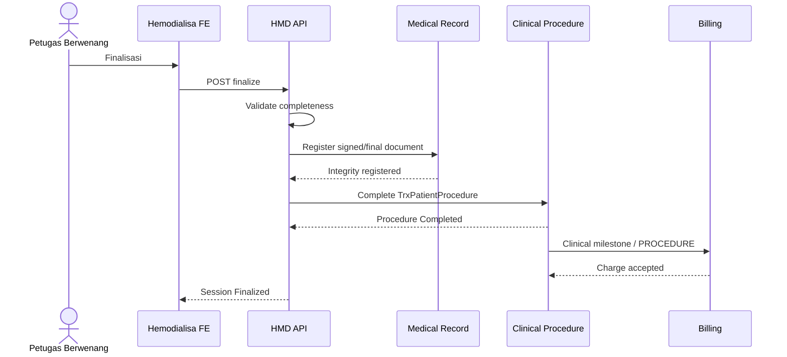

# PRD TO MVP — HEMODIALISA QUILVIAN V2

## 1. Identitas Dokumen

| Field | Nilai |
|---|---|
| Produk | Quilvian V2 |
| Modul | Hemodialisa |
| Nama technical domain yang diusulkan | `HemodialysisManagement` |
| Prefix entity yang diusulkan | `Hmd` — **belum approved registry** |
| Status dokumen | **DRAFT — GRILL READY** |
| Tanggal | 18 September 2026 |
| Backend target | `DevBenari/NewQuilvianSystemBackend` |
| Backend branch | `MHamzah` |
| Backend commit | `896014ec31b236f868655e55919d21642940aa56` |
| Frontend target | `DevBenari/QuilvianSystemFrontendDev` |
| Frontend branch | `HamzahV2` |
| Frontend commit | `c42d6ab2f9881235d8eec27ed456ef352d0b515b` |
| Engineering rules | `DevBenari/QuilvianEngineeringSkills` `main` |
| Engineering rules commit | `6ac8997e03931cda216f86e2a7e3cf03438ce612` |
| Sumber requirement | `hemodialisa-deep-analysis(1).md`, analisis 16 September 2026 |
| Sasaran | MVP Hemodialisa end-to-end dari episode pasien sampai sesi final, handoff Billing, dan audit RME |

Dokumen analisis asal mendefinisikan blueprint Hemodialisa sebagai 4 kelompok Menu, 11 Submenu, 36 Feature, dan 8 unresolved decision.

PRD ini **tidak mengganti evidence tersebut**. PRD ini menerjemahkan requirement tersebut ke struktur V2 Quilvian dan mempersempitnya menjadi MVP yang bisa dipakai dari awal sampai akhir.

---

# 2. Ringkasan Eksekutif

MVP Hemodialisa harus memungkinkan rumah sakit menjalankan satu siklus nyata:

**pasien diterima → episode HD aktif → kelayakan dinilai → resep HD aktif → sesi dijadwalkan → pra-HD → pelaksanaan HD → monitoring → pasca-HD → finalisasi → tindakan menjadi fakta klinis final → Billing menerima charge → catatan dapat diaudit.**

MVP tidak dibuat sebagai CRUD tabel Hemodialisa.

Hemodialisa adalah **clinical operational workspace** yang bergantung pada beberapa domain existing:

- Patient Management sebagai sumber pasien;
- Registration Management sebagai sumber Encounter;
- Inpatient Management bila pasien sedang rawat inap;
- Clinical Management untuk vital sign, assessment, consent dan procedure;
- Laboratory untuk hasil pemeriksaan;
- Pharmacy untuk penggunaan obat dan stok;
- Billing untuk invoice/charge;
- Medical Record untuk integritas dan koreksi catatan;
- Human Resource / Workforce untuk dokter, perawat, kompetensi dan kredensial.

Dokumen analisis memang mencakup penerimaan, kelayakan, resep, jadwal, sesi, monitoring, komplikasi, kesiapan unit, longitudinal monitoring, SATUSEHAT, Billing dan audit.

### Sasaran MVP

MVP dianggap berhasil ketika:

> Satu pasien dapat menjalani satu sesi Hemodialisa secara lengkap dan aman, catatan sesi dapat difinalisasi, tindakan masuk ke jalur Billing yang sudah ada, dan seluruh perubahan klinis penting dapat ditelusuri.

---

# 3. Masalah Produk dan Keadaan V2 Saat Ini

## 3.1 Tidak ada bounded context Hemodialisa existing

Pada snapshot Backend `MHamzah` dan Frontend `HamzahV2` yang dianalisis, tidak ditemukan implementasi domain dedicated Hemodialisa.

Karena itu klasifikasi modul adalah:

**`MISSING / NEW` untuk bounded context Hemodialisa**, tetapi sejumlah capability lintas domain sudah tersedia dan harus dipakai ulang.

---

## 3.2 Encounter sudah tersedia

Backend mempunyai:

`Areas/HealthServices/RegistrationManagement/Models/RegPatientEncounter.cs`

`RegPatientEncounter` sudah menyimpan antara lain:

- `PatientId`
- `ServiceUnitId`
- `ClinicId`
- `RoomId`
- `DoctorId`
- `PatientClassId`
- `EncounterDate`
- `EncounterType`
- `VisitType`
- `EncounterStatus`
- payment context
- referral context
- timeline
- idempotency.

Karena itu Hemodialisa **MUST NOT** membuat `HmdEncounter`.

---

## 3.3 EncounterType tidak perlu dibuat khusus HD

Enum existing:

```text
Unknown       = 0
Outpatient    = 1
Emergency     = 2
Inpatient     = 3
MedicalCheckup= 4
Telemedicine  = 5
```

Hemodialisa bukan jenis encounter baru.

Pasien HD tetap masuk berdasarkan konteks pelayanannya:

```text
HD Rawat Jalan
→ EncounterType.Outpatient

HD saat Rawat Inap
→ EncounterType.Inpatient

HD emergensi dari IGD
→ EncounterType.Emergency
```

### PRD LOCK

**Tidak membuat `EncounterType.Hemodialysis`.**

---

# 4. Visi Produk

Struktur konseptual target:

```text
MstPatient
    │
    ├── RegPatientEncounter
    │
    └── HmdEpisode
          │
          ├── HmdEligibilityAssessment
          ├── HmdVascularAccess
          ├── HmdPrescription
          │
          └── HmdSession
                │
                ├── EncounterId
                ├── InpEpisodeId?       bila pasien rawat inap
                ├── ProcedureId
                ├── Pra-HD
                ├── Monitoring Intra-HD
                ├── Medication
                ├── Complication
                └── Pasca-HD
                      │
                      └── Finalisasi
                            │
                            └── TrxPatientProcedure
                                  │
                                  └── Billing
```

### Empat konsep yang tidak boleh dicampur

**`RegPatientEncounter`**  
Kunjungan pasien pada rumah sakit.

**`InpEpisode`**  
Lifecycle rawat inap pasien.

**`HmdEpisode`**  
Program atau episode longitudinal Hemodialisa.

**`HmdSession`**  
Satu pelaksanaan Hemodialisa.

Contoh:

```text
Pasien A
HmdEpisode HD-2026-001
│
├── Session 1 → Encounter RJ 001
├── Session 2 → Encounter RJ 002
├── Session 3 → Encounter RJ 003
│
└── Session 4
      ├── Encounter INP 010
      └── InpEpisode INP-2026-009
```

Satu `HmdEpisode` dapat mencakup banyak kunjungan.

---

# 5. Batas MVP

## 5.1 Titik mulai MVP

MVP dimulai ketika:

1. pasien sudah ada pada Master Patient;
2. ada indikasi/permintaan HD;
3. konteks encounter dapat ditentukan;
4. petugas membuka pasien pada modul Hemodialisa.

## 5.2 Titik akhir MVP

MVP selesai ketika:

1. sesi HD berakhir;
2. asesmen pasca-HD selesai;
3. disposition tercatat;
4. session difinalisasi;
5. dokumen final dikunci;
6. tindakan `TrxPatientProcedure` mencapai status final yang sesuai;
7. Billing menerima fakta charge melalui mekanisme existing;
8. histori koreksi/audit tetap dapat ditelusuri.

---

## 5.3 Tidak termasuk MVP

Requirement sumber memang mencakup lebih luas dari MVP.

Yang **tidak dikerjakan dalam MVP pertama**:

- CAPD / dialisis peritoneal;
- transplantasi ginjal;
- operasi pembuatan akses vaskular;
- advanced adequacy/Kt/V dashboard;
- monitoring longitudinal lengkap;
- automatic device integration mesin HD;
- advanced clinical alarm engine;
- AI recommendation;
- KPI unit HD lengkap;
- SATUSEHAT Uronefrologi;
- laporan regulator tahunan;
- patient portal;
- INA-CBG grouping;
- adjudikasi klaim;
- maintenance teknis mesin;
- inventori/pengadaan farmasi.

---

# 6. Pelaku Sasaran

| Aktor | Tanggung jawab dalam MVP |
|---|---|
| Petugas Pendaftaran | Menyediakan patient dan encounter |
| Petugas Administrasi HD | Membuka episode/jadwal administratif |
| DPJP | Keputusan klinis utama |
| Dokter Dialisis | Menetapkan kelayakan, prescription dan instruksi klinis |
| Perawat Dialisis | Pra-HD, monitoring, obat, komplikasi dan pasca-HD |
| Koordinator Unit | Jadwal, mesin, station, kesiapan dan kapasitas |
| PPI | Kebijakan isolasi dan risiko infeksi |
| Laboratorium | Menjadi sumber authoritative hasil pemeriksaan |
| Farmasi | Menjadi sumber authoritative stok/pemakaian obat |
| Workforce/HR | Sumber kompetensi dan kredensial |
| Rekam Medis | Integritas, akses dan koreksi catatan final |
| Billing/Kasir | Charge, invoice dan pembayaran |
| Auditor berwenang | Melihat jejak perubahan dan akses |

---

# 7. Pemilihan Kemampuan MVP

Dokumen sumber mempunyai 36 Feature.

MVP Quilvian memakai **25 Feature**.

## 7.1 MUST HAVE

| Feature | Requirement | Disposisi |
|---|---|---|
| FEAT-001 | Verifikasi identitas dan konteks kunjungan | `EXISTING / REUSE` |
| FEAT-003 | Registrasi episode dialisis | `MISSING / NEW` |
| FEAT-004 | Kelayakan klinis HD | `MISSING / NEW` |
| FEAT-005 | Akses vaskular & status serologi | `MISSING / NEW + REUSE LAB` |
| FEAT-006 | Persetujuan tindakan | `EXISTING / REUSE + EXTEND` |
| FEAT-007 | Prescription/program HD | `MISSING / NEW` |
| FEAT-008 | Revisi prescription/deviasi | `MISSING / NEW` |
| FEAT-009 | Penjadwalan sesi | `MISSING / NEW` |
| FEAT-010 | Checklist Pra-HD | `MISSING / NEW` |
| FEAT-011 | Assessment Pra-HD | `EXTEND / REUSE CLINICAL` |
| FEAT-012 | Verifikasi mesin/air/bahan | `MISSING / NEW` |
| FEAT-013 | Mulai sesi HD | `MISSING / NEW + REUSE PROCEDURE` |
| FEAT-014 | Serial monitoring | `MISSING / NEW + REUSE VITAL` |
| FEAT-015 | Obat/antikoagulasi | `MISSING / NEW + REUSE PHARMACY` |
| FEAT-016 | Komplikasi dan eskalasi | `MISSING / NEW` |
| FEAT-017 | Assessment Pasca-HD | `MISSING / NEW + REUSE VITAL` |
| FEAT-018 | Disposisi dan tindak lanjut | `MISSING / NEW` |
| FEAT-019 | Finalisasi sesi | `EXTEND MEDICAL RECORD` |
| FEAT-026 | Isolasi Hepatitis B | `MISSING / NEW` |
| FEAT-027 | Status laik mesin | `MISSING / NEW` |
| FEAT-028 | Status water treatment | `MISSING / NEW` |
| FEAT-029 | Kesiapan obat/BMHP | `MISSING / NEW + REUSE PHARMACY` |
| FEAT-030 | Kapasitas & kompetensi staf | `EXTEND / REUSE HR` |
| FEAT-033 | Handoff Billing | `EXISTING / REUSE PROCEDURE → BILLING` |
| FEAT-036 | Audit/koreksi RME | `EXTEND / REUSE MEDICAL RECORD` |

Source awal menaruh FEAT-009 dan FEAT-033 di Phase 2.

### TARGET PRD CHANGE

PRD ini **menaikkan FEAT-009 dan FEAT-033 ke MVP**.

Alasannya:

- tanpa scheduling, unit HD tidak mempunyai worklist yang realistis;
- tanpa Billing handoff, vertical slice berhenti sebelum layanan masuk invoice;
- V2 sudah memiliki domain Registration dan Billing yang bisa dipakai ulang sehingga kedua capability tidak perlu membangun modul finansial baru.

---

# 8. Kemampuan yang Ditunda

| Feature | Ditunda karena | Pengganti pada MVP |
|---|---|---|
| FEAT-002 Administrasi JKN khusus HD | Registration/guarantor sudah memiliki konteks pembayaran | Tampilkan payment/guarantor dari Encounter |
| FEAT-020 Adekuasi HD | Longitudinal analytics | Data dasar sesi tetap tersedia |
| FEAT-021 Monitoring lab berkala | Memerlukan orchestration longitudinal | Hasil dibaca dari Lab |
| FEAT-022 Tren berat kering | Analytics longitudinal | Pre/post weight tetap dicatat |
| FEAT-023 Surveilans akses | Longitudinal workflow | Status akses dasar tersedia |
| FEAT-024 Rujukan komplikasi akses | Workflow lintas spesialis | Catat komplikasi dan instruksi rujukan |
| FEAT-025 Serologi/vaksin longitudinal | Workflow PPI longitudinal | Hasil serologi relevan tetap ditampilkan |
| FEAT-031 Pelaporan tahunan | Tidak dibutuhkan untuk vertical slice klinis pertama | Data disimpan agar siap dipetakan |
| FEAT-032 SATUSEHAT | Integrasi eksternal tidak boleh memblokir pelayanan | Data canonical disiapkan |
| FEAT-034 Incident handoff | Sistem insiden authoritative belum terbukti tersedia | Komplikasi klinis tetap dicatat |
| FEAT-035 KPI mutu | Definisi KPI internal belum final | Data sumber disimpan |

SATUSEHAT Uronefrologi sendiri sudah mengenali proses EpisodeOfCare, Encounter, Observation, Procedure dan secara eksplisit memasukkan **Haemodialisis** sebagai tindakan/prosedur medis.

Karena itu desain MVP harus **integration-ready**, tetapi integrasi SATUSEHAT tidak menjadi syarat menyelesaikan sesi pasien.

---

# 9. Alur Bisnis Target

Blueprint sumber juga menempatkan alur dari penerimaan sampai finalisasi serta handoff eksternal sebagai satu siklus.

## FLOW-HD-MVP-001 — End-to-End

1. Pasien datang / permintaan HD diterima.
2. Sistem memuat `MstPatient`.
3. Sistem memverifikasi `RegPatientEncounter`.
4. Sistem memuat atau membuat `HmdEpisode`.
5. Dokter melakukan kelayakan HD.
6. Akses vaskular dan data serologi ditinjau.
7. Consent diverifikasi.
8. Dokter membuat `HmdPrescription`.
9. Koordinator membuat jadwal sesi.
10. Sistem menentukan station, mesin dan staf.
11. Pasien check-in.
12. Pra-HD assessment dilakukan.
13. Kesiapan unit diverifikasi.
14. Sesi dinyatakan `Ready`.
15. Perawat memulai HD.
16. Sistem mengubah session menjadi `InProgress`.
17. Observasi pasien dicatat serial.
18. Parameter mesin dicatat.
19. Obat/antikoagulan dicatat.
20. Komplikasi, alarm dan deviasi dicatat bila terjadi.
21. HD selesai atau dihentikan.
22. Pasca-HD assessment dilakukan.
23. Disposition ditetapkan.
24. Session masuk `AwaitingFinalization`.
25. Petugas berwenang melakukan finalisasi.
26. Catatan menjadi immutable.
27. `TrxPatientProcedure` diselesaikan.
28. Clinical milestone menghasilkan fakta charge.
29. Billing menerima charge.
30. Koreksi setelah final menggunakan addendum.



---

# 10. Epic dan Functional Requirement

# EPIC HD-01 — Penerimaan dan Episode HD

### FR-HD-001 — Verifikasi Patient dan Encounter
**Feature:** FEAT-001  
**Disposition:** `EXISTING / REUSE`

Sistem wajib menggunakan patient dan encounter yang sudah authoritative.

### Perilaku

- HD tidak membuat pasien baru sendiri.
- HD tidak membuat tabel encounter baru.
- Session yang belum check-in boleh belum memiliki Encounter bila baru berupa jadwal.
- Encounter **wajib ada sebelum sesi dimulai**.
- Finalisasi mustahil tanpa Encounter.

### Failure

Jika patient/encounter context gagal diverifikasi:

```text
Tidak boleh:
- menampilkan data pasien lama dari cache;
- memulai sesi;
- mencatat tindakan klinis baru.

Tampilkan:
"Konteks pasien tidak dapat diverifikasi."
[Coba Lagi]
```

---

### FR-HD-002 — Episode Hemodialisa
**Feature:** FEAT-003  
**Disposition:** `MISSING / NEW`

Bentuk longitudinal episode:

```text
Draft
→ Active
↔ Suspended
→ Closed
```

Closure reason dapat mencatat:

- selesai program;
- transfer;
- berhenti;
- meninggal;
- alasan lain yang sah.

### Invariant

- satu pasien boleh memiliki histori banyak episode;
- hanya satu episode efektif aktif untuk program HD yang sama;
- `InpEpisode` tidak boleh dijadikan episode HD.

---

# EPIC HD-02 — Kelayakan, Akses dan Consent

### FR-HD-003 — Assessment Kelayakan
**Feature:** FEAT-004  
**Disposition:** `MISSING / NEW`

Outcome:

```text
Eligible
Deferred
Modified
Referred
```

Assessment harus merekam:

- assessor;
- waktu;
- kondisi/indikasi relevan;
- keputusan;
- alasan keputusan;
- tindak lanjut bila bukan `Eligible`.

Sistem **tidak menentukan kelayakan klinis otomatis**.

---

### FR-HD-004 — Akses Vaskular dan Serologi
**Feature:** FEAT-005

HD mencatat status akses yang digunakan untuk operasional sesi.

Contoh konsep:

```text
AV Fistula
AV Graft
Catheter
Other
```

Hasil pemeriksaan serologi tetap authoritative di Laboratorium.

HD hanya menyimpan:

- referensi hasil;
- tanggal hasil;
- status review;
- keputusan operasional yang diturunkan oleh petugas berwenang.

Sistem tidak boleh menyalin hasil Lab menjadi source of truth baru.

---

### FR-HD-005 — Consent
**Feature:** FEAT-006  
**Disposition:** `EXISTING / REUSE`

Reuse:

`TrxPatientConsent`

Consent existing sudah mendukung:

- patient/encounter;
- tindakan;
- penjelasan diagnosis;
- tindakan;
- manfaat;
- risiko;
- alternatif;
- penanda persetujuan;
- signer;
- witness;
- tanda tangan;
- file.

MVP tidak membuat `HmdConsent`.

### Safe baseline

Sistem hanya menanyakan:

```text
Apakah tersedia consent yang sah untuk konteks sesi ini?
```

MVP **tidak menetapkan expiration otomatis** sebelum kebijakan RS tersedia.

---

# EPIC HD-03 — Prescription dan Jadwal

### FR-HD-006 — Prescription HD
**Feature:** FEAT-007  
**Disposition:** `MISSING / NEW`

Prescription merupakan instruksi klinis authoritative.

Minimum konsep:

- dokter pemberi instruksi;
- effective date;
- frekuensi;
- target durasi;
- target UF / parameter yang memang diinstruksikan;
- akses vaskular;
- anticoagulation plan;
- catatan klinis;
- status.

Lifecycle:

```text
Draft
→ Active
→ Superseded

Draft/Active
→ Cancelled
```

Tidak boleh mengedit versi `Active` secara diam-diam.

Perubahan menghasilkan prescription baru atau revision yang dapat dilacak.

---

### FR-HD-007 — Revisi Prescription dan Deviasi
**Feature:** FEAT-008

Jika kondisi sesi berbeda dari prescription:

```text
Prescription tetap utuh
+
Actual Session Parameter dicatat
+
Reason for Deviation
+
Authorizing Clinician bila diperlukan
```

Perawat tidak mengubah prescription dokter hanya agar sesuai dengan tindakan aktual.

---

### FR-HD-008 — Jadwal Sesi
**Feature:** FEAT-009

Minimum schedule:

- tanggal;
- shift;
- patient;
- HmdEpisode;
- prescription;
- station;
- machine;
- assigned nurse;
- status.

### Hard technical validation

Tidak boleh:

- patient double booking;
- station double booking;
- machine double booking;
- menggunakan machine `Blocked`;
- menggunakan machine `Maintenance`;
- menggunakan machine yang tidak memenuhi isolation allocation;
- menugaskan resource yang sudah memiliki sesi overlap.

### Kebijakan prioritas

MVP **tidak membuat automatic priority engine**.

Koordinator menentukan jadwal secara manual.

Dengan demikian UNR-004 tidak memblokir development MVP.

---

# EPIC HD-04 — Kesiapan Unit dan Isolasi

### FR-HD-009 — Isolasi Hepatitis B
**Feature:** FEAT-026

Requirement sumber secara eksplisit memasukkan kebutuhan isolasi dan mesin khusus Hepatitis B.

Sistem menyimpan **keputusan operasional isolasi**, bukan melakukan diagnosis.

Jika pasien membutuhkan resource khusus:

- scheduler menampilkan kebutuhan tersebut;
- machine/station umum tidak boleh dipilih bila melanggar aturan yang aktif;
- perubahan status harus memicu review terhadap future schedule.

Aturan HCV/HIV **tidak otomatis disamakan** dengan Hepatitis B.

---

### FR-HD-010 — Status Mesin
**Feature:** FEAT-027

Status MVP:

```text
Ready
Blocked
Maintenance
NotEligible
```

`Blocked`, `Maintenance`, dan `NotEligible` tidak boleh dipakai untuk memulai sesi.

Riwayat status harus disimpan.

---

### FR-HD-011 — Water Treatment Readiness
**Feature:** FEAT-028

HD tidak menjadi laboratory/environmental testing system.

HD menyimpan:

- referensi pemeriksaan;
- tanggal;
- status verifikasi;
- status operasional `Ready/NotReady`;
- petugas yang menyatakan status.

Jika `NotReady`, kesiapan unit menjadi `NotReady`.

---

### FR-HD-012 — Obat dan BMHP Readiness
**Feature:** FEAT-029

Sistem menampilkan readiness:

```text
Available
Low
Expired
Quarantined
Unavailable
```

Tetapi saldo stok authoritative tetap milik Farmasi/Logistik.

---

### FR-HD-013 — Kompetensi dan Kapasitas Staf
**Feature:** FEAT-030

Data staf tidak dibuat ulang di HMD.

Reuse:

- `MstDoctor`
- `MstEmployee`
- `MstWorkforceProfile`
- credentials;
- clinical privilege;
- certification.

Permenkes 11/2025 saat ini berstatus berlaku. JDIH juga memuat ketentuan layanan dialisis bahwa tenaga keperawatan dengan kompetensi dialisis dibutuhkan dan satu perawat dapat menangani tiga pasien per sesi.

Karena itu MVP harus bisa memvalidasi kapasitas terhadap staf kompeten.

---

# EPIC HD-05 — Pra-HD dan Mulai Sesi

### FR-HD-014 — Checklist Pra-HD
**Feature:** FEAT-010

Minimum kelompok checklist:

1. patient identity;
2. Encounter;
3. Episode HD;
4. prescription;
5. allergy;
6. vascular access;
7. infection/isolation;
8. machine;
9. station;
10. water readiness;
11. BMHP/readiness;
12. staff availability.

Setiap item menyimpan:

- status;
- waktu;
- verifier;
- note bila diperlukan.

---

### FR-HD-015 — Assessment Pra-HD
**Feature:** FEAT-011

Reuse generic vital sign jika field cocok.

Minimum konteks:

- berat badan pra-HD;
- tekanan darah;
- pulse;
- respiratory rate;
- temperature;
- SpO2;
- symptom/complaint;
- vascular access condition.

`TrxPatientVitalSign` existing dapat dipakai untuk vital klinis.

Parameter khusus mesin **tidak dimasukkan secara paksa ke VitalSign**.

---

### FR-HD-016 — Verifikasi Resource
**Feature:** FEAT-012

Pra-HD menampilkan satu summary:

```text
Patient        VERIFIED
Prescription   ACTIVE
Access         READY
Isolation      VERIFIED
Machine        READY
Water          READY
BMHP           READY
Staff          READY
```

Jika resource berubah setelah verifikasi tetapi sebelum Start, backend wajib melakukan **revalidation**.

FE tidak boleh menjadi authority terakhir.

---

### FR-HD-017 — Start Sesi
**Feature:** FEAT-013

Kondisi minimum:

```text
Session status = Ready
Encounter valid
Episode Active
Prescription Active
Machine Ready
Station available
Pre-HD complete
```

Saat start berhasil:

```text
Status       → InProgress
StartedAt    → waktu server
StartedBy    → user login
```

Start harus idempotent.

Klik tombol dua kali tidak membuat session kedua ataupun procedure kedua.

---

# EPIC HD-06 — Monitoring, Medication dan Komplikasi

### FR-HD-018 — Monitoring Serial
**Feature:** FEAT-014

Setiap observation memiliki:

- SessionId;
- ObservedAt;
- Recorder;
- vital;
- parameter mesin relevan;
- note.

Data tidak boleh hanya menyimpan "latest value".

Histori serial wajib dipertahankan.

### Keputusan MVP atas UNR-001

Tidak ada automatic overdue timer berdasarkan interval klinis pada MVP.

Petugas dapat membuat observation kapan pun sesuai SOP.

Dengan demikian interval klinis **tidak perlu di-grill sekarang**.

---

### FR-HD-019 — Obat dan Antikoagulasi
**Feature:** FEAT-015

HMD membutuhkan catatan klinis:

`HmdSessionMedication` **(provisional name)**

Data minimum:

- drug;
- dose;
- unit;
- route;
- instructed by;
- administered by;
- administered at;
- note;
- source order bila ada.

Setelah medication administration terjadi, pemakaian stok diteruskan ke:

`PhmDrugUsage`

`PhmDrugUsage` existing memang dirancang sebagai authoritative patient drug usage dan keputusan penagihan tetap milik Billing.

HMD tidak mengurangi stok sendiri.

---

### FR-HD-020 — Komplikasi
**Feature:** FEAT-016

Minimum:

- jenis kejadian;
- detected at;
- signs/symptoms;
- tindakan;
- clinician instruction;
- outcome;
- apakah session dilanjutkan/modifikasi/dihentikan;
- transfer bila diperlukan.

MVP tidak memiliki clinical decision engine yang menyatakan diagnosis dari nilai vital.

---

# EPIC HD-07 — Pasca-HD, Disposisi dan Finalisasi

### FR-HD-021 — Pasca-HD
**Feature:** FEAT-017

Minimum:

- end time;
- duration actual;
- actual UF;
- berat badan pasca-HD;
- vital akhir;
- kondisi akses;
- kondisi pasien;
- complications summary;
- target achievement;
- note.

Nilai pasca-HD tidak boleh otomatis disalin dari pra-HD.

---

### FR-HD-022 — Disposition
**Feature:** FEAT-018

Outcome dapat berupa konsep:

```text
Return Home
Return To Inpatient Unit
Transfer Emergency
Transfer ICU
Referral
Other
```

Disposition harus memiliki:

- actor;
- timestamp;
- note/instruction;
- destination jika transfer.

Pasien tidak stabil tidak boleh dinyatakan pulang hanya oleh FE validation.

---

### FR-HD-023 — Finalisasi Sesi
**Feature:** FEAT-019

Perbedaan wajib:

```text
HD selesai secara fisik
≠
Catatan HD final
```

State:

```text
Completed / Stopped
        ↓
AwaitingFinalization
        ↓
Finalized
```

Setelah `Finalized`:

- core clinical record read-only;
- edit langsung ditolak;
- correction melalui addendum.

---

# EPIC HD-08 — Billing dan Audit RME

### FR-HD-024 — Billing Handoff
**Feature:** FEAT-033

Dokumen analisis menempatkan handoff pembiayaan sebagai feature tersendiri.

Backend V2 Billing sekarang sudah menerima:

```text
PROCEDURE
LABORATORY
RADIOLOGY
PHARMACY
CONSUMABLE
ADHOC
ADHOC_CATALOG
```

### PRD LOCK

**Tidak membuat `SourceDomain = HEMODIALYSIS`.**

Alur:

```text
HmdSession
   ↓
TrxPatientProcedure
   ↓
Procedure Completed
   ↓
Clinical Milestone
   ↓
SourceDomain = PROCEDURE
   ↓
Billing
```

HMD tidak menentukan:

- harga;
- diskon;
- coverage akhir;
- invoice final;
- payment;
- klaim final.

---

### FR-HD-025 — Audit dan Koreksi
**Feature:** FEAT-036

Tambahkan target:

```text
ClinicalDocumentKind.HemodialysisSession = 14
```

dan masukkan dokumen session ke mekanisme integrity yang berlaku.

Jika session telah final:

```text
Original record
    │
    └── immutable

Correction
    │
    └── Addendum
          ├── reason
          ├── author
          ├── timestamp
          └── corrected information
```

Tidak melakukan overwrite terhadap informasi klinis final.

---

# 11. Model Status

## 11.1 HmdEpisode

```text
Draft
  ↓
Active
  ↕
Suspended
  ↓
Closed
```

Transferred/Deceased dicatat sebagai closure context bila diperlukan.

---

## 11.2 HmdPrescription

```text
Draft
  ↓
Active
  ↓
Superseded

Draft/Active
  ↓
Cancelled
```

---

## 11.3 HmdSession

```text
Planned
   ↓
Scheduled
   ↓
CheckedIn
   ↓
PreCheck
  ↙     ↘
Held    Ready
          ↓
      InProgress
       ↙      ↘
   Stopped  Completed
       \      /
    AwaitingFinalization
          ↓
      Finalized
```

`Cancelled` dapat terjadi sebelum `InProgress`.

---

## 11.4 Machine

```text
Ready
Blocked
Maintenance
NotEligible
```

---

## 11.5 Unit Readiness

MVP hanya menggunakan:

```text
Draft
Ready
NotReady
```

Tidak menggunakan `ConditionallyReady` agar tidak melahirkan policy override yang belum disahkan.

---

# 12. Sasaran Arsitektur

# 12.1 Backend Bounded Context

Target:

```text
Areas/
└── HealthServices/
    └── HemodialysisManagement/
        ├── Controllers/
        ├── DTOs/
        ├── Enums/
        ├── Models/
        └── Services/
```

Configuration:

```text
Repositories/
└── Configurations/
    └── HealthServices/
        └── HemodialysisManagement/
```

Base URL target:

```text
/api/v1/health-services/hemodialysis-management
```

Semua path tersebut adalah:

**Rencana — belum tersedia.**

---

# 12.2 QBE Prefix Gate

Engineering registry pada commit:

`6ac8997e03931cda216f86e2a7e3cf03438ce612`

belum mempunyai `HemodialysisManagement`.

QBE-MOD-002 menyatakan entity persisted pertama tidak boleh dibuat sebelum module/prefix terdaftar.

### TARGET PROPOSAL

```text
Area       : HealthServices
Module     : HemodialysisManagement / Hemodialysis
Category   : BUSINESS DOMAIN / MODULE
Prefix     : Hmd
Lifecycle  : ACTIVE
```

### BLOCKER

Sebelum membuat:

```text
HmdEpisode
HmdPrescription
HmdSession
...
```

registry harus disetujui.

---

# 12.3 Entity & Contract Registry

## Existing / Reuse

| Entity | Owner | Penggunaan HMD |
|---|---|---|
| `MstPatient` | Patient | Patient identity |
| `RegPatientEncounter` | Registration | Visit context |
| `InpEpisode` | Inpatient | Optional inpatient context |
| `MstServiceUnit` | Master Data | Unit HD |
| `MstRoom` | Master Data | Ruang |
| `MstDoctor` | Workforce | Dokter |
| `MstWorkforceProfile` | Workforce | Petugas |
| `TrxPatientVitalSign` | Clinical | Vital klinis |
| `TrxPatientAssessment` | Clinical | Assessment generic bila cocok |
| `TrxPatientConsent` | Clinical | Consent |
| `MstProcedure` | Master Data | Master tindakan HD |
| `TrxPatientProcedure` | Clinical | Tindakan billable |
| `LabOrder`/hasil Lab | Laboratory | Hasil penunjang |
| `PhmDrugUsage` | Pharmacy | Pemakaian obat |
| Billing | Billing | Charge/invoice |
| Medical Record Integrity | Medical Record | Final record |
| Addendum | Medical Record | Correction |

---

## New — provisional name pending registry

| Entity | Purpose |
|---|---|
| `HmdEpisode` | Program/episode HD |
| `HmdEligibilityAssessment` | Kelayakan klinis |
| `HmdVascularAccess` | Status akses operasional |
| `HmdIsolationDecision` | Keputusan isolasi |
| `HmdPrescription` | Prescription HD |
| `HmdSession` | Satu sesi HD |
| `HmdSessionAssessment` | Pre/post session-specific data |
| `HmdSessionObservation` | Observation serial & machine parameter |
| `HmdSessionMedication` | Clinical administration record |
| `HmdSessionComplication` | Komplikasi |
| `HmdStation` | Station chair/bed |
| `HmdMachine` | Mesin HD minimal operational registry |
| `HmdUnitReadiness` | Readiness per shift/date |
| `HmdUnitReadinessItem` | Detail readiness |
| `HmdSessionStaffAssignment` | Staffing session |

---

## Extend existing

### `ServiceUnitType`

Tambahkan target:

```csharp
Hemodialysis = 10
```

Existing value 1–9 tidak diubah.

### EncounterType

**Tidak diubah.**

### `ClinicalDocumentKind`

Target:

```csharp
HemodialysisSession = 14
```

---

# 12.4 ERD Konseptual MVP



Cardinality di atas adalah **target PRD**, bukan claim schema existing.

---

# 12.5 Frontend Architecture

Target folder:

```text
src/
├── app/
│   └── health-services/
│       └── hemodialysis-management/
│
├── components/
│   └── view/
│       └── health-services/
│           └── hemodialysis-management/
│
└── lib/
    ├── services/
    │   └── health-services/
    │       └── hemodialysis-management/
    ├── hooks/
    │   └── health-services/
    │       └── hemodialysis-management/
    └── constants/
        └── health-services/
            └── hemodialysis-management/
```

Frontend harus mengikuti pattern clinical workspace yang sudah dipakai V2:

```text
ClinicalPageHeader
ClinicalStateBoundary
ClinicalWorkspaceShell
ClinicalSectionNav
```

Prinsipnya:

> satu workspace = satu patient clinical context yang terverifikasi.

---

# 12.6 Posisi Menu Hemodialisa

Frontend existing sudah memiliki label:

```text
Pelayanan Kesehatan
```

Target navigation:

```text
Pelayanan Kesehatan
│
├── Master Data
├── Farmasi
├── Manajemen Pasien
├── Rekam Medis
├── Dokter
├── Instalasi Gawat Darurat
├── Rawat Inap
├── Gizi
├── Laboratorium
│
├── Hemodialisa          ← BARU
│   ├── Beranda Hemodialisa
│   ├── Daftar Pasien Hemodialisa
│   ├── Jadwal & Daftar Kerja
│   └── Kesiapan Unit
│
├── Operasi
├── Rawat Jalan
└── Billing dan Kasir
```

**Hemodialisa tidak ditempatkan di Rawat Inap.**

Hemodialisa adalah service domain tersendiri yang dapat menerima pasien rawat jalan, rawat inap maupun emergency.

---

# 12.7 Peta Butir Menu

| Menu | Tingkat | Parent | Pathname | Status |
|---|---:|---|---|---|
| Hemodialisa | 0 | Pelayanan Kesehatan | — | Baru |
| Beranda Hemodialisa | 1 | Hemodialisa | `/health-services/hemodialysis-management` | Baru |
| Daftar Pasien Hemodialisa | 1 | Hemodialisa | `/health-services/hemodialysis-management/patients` | Baru |
| Jadwal & Daftar Kerja | 1 | Hemodialisa | `/health-services/hemodialysis-management/worklist` | Baru |
| Kesiapan Unit | 1 | Hemodialisa | `/health-services/hemodialysis-management/unit-readiness` | Baru |
| Episode Workspace | Child | Daftar Pasien | `/.../patients/{patientId}/episodes/{episodeId}` | Child screen |
| Session Workspace | Child | Worklist | `/.../sessions/{sessionId}` | Child screen |

Supporting master screens:

```text
Pelayanan Kesehatan
└── Master Data
    ├── Mesin Hemodialisa
    └── Station Hemodialisa
```

Target route:

```text
/health-services/master-data/hemodialysis-machines
/health-services/master-data/hemodialysis-stations
```

Kedua route merupakan **Rencana — belum tersedia**.

---

# 12.8 Skema Tampilan — Beranda Hemodialisa

```text
+-------------------------------------------------------------------+
| HEMODIALISA                                                       |
| Ringkasan kegiatan unit hari ini                                  |
+-------------------------------------------------------------------+

| Sesi Hari Ini | Menunggu | Sedang HD | Selesai | Tertahan         |

+---------------------------------+---------------------------------+
| JADWAL BERIKUTNYA               | KESIAPAN UNIT                  |
|                                 |                                 |
| 07:00 Pasien A      HD-01       | Mesin Ready        8/10        |
| 07:00 Pasien B      HD-02       | Mesin Blocked      1           |
| 08:00 Pasien C      HD-03       | Station Ready      10          |
|                                 | Water             READY        |
+---------------------------------+---------------------------------+

+-------------------------------------------------------------------+
| PERLU PERHATIAN                                                   |
| Pasien membutuhkan isolasi                                       |
| Sesi tertahan                                                     |
| Session menunggu finalisasi                                       |
| Resource tidak siap                                               |
+-------------------------------------------------------------------+
```

Dashboard **tidak menjadi source of truth baru**.

Semua angka berasal dari episode/session/readiness.

---

# 12.9 Skema Tampilan — Daftar Pasien

```text
+-------------------------------------------------------------------+
| DAFTAR PASIEN HEMODIALISA                                        |
+-------------------------------------------------------------------+
| Cari MRN / Nama                                                   |
| [Status Episode v] [Dokter v] [Filter]                            |
+-------------------------------------------------------------------+
| MRN | Pasien | Episode | Prescription | Akses | Status | Aksi     |
|-----|--------|---------|--------------|-------|--------|----------|
| ... | ...    | Active  | Active       | AVF   | Active | Detail   |
+-------------------------------------------------------------------+
```

Empty state:

```text
"Belum ada pasien Hemodialisa pada filter ini."
```

Failure:

```text
"Daftar pasien Hemodialisa gagal dimuat."
[Coba Lagi]
```

---

# 12.10 Skema Tampilan — Episode Workspace

```text
+===================================================================+
| PASIEN                                                            |
| MRN | Nama | DOB/Umur | Alergi | Penjamin                         |
+===================================================================+
| EPISODE HD                                                        |
| HD-2026-0001 | ACTIVE | Dokter Penanggung Jawab                  |
+===================================================================+

+----------------------+--------------------------------------------+
| Ringkasan Episode    |                                            |
| Kelayakan            |                                            |
| Akses Vaskular       |              AREA KERJA                    |
| Consent              |                                            |
| Prescription         |                                            |
| Riwayat Sesi         |                                            |
+----------------------+--------------------------------------------+
```

Header harus tetap terlihat selama berpindah section.

---

# 12.11 Skema Tampilan — Jadwal & Daftar Kerja

```text
+-------------------------------------------------------------------+
| JADWAL & DAFTAR KERJA HEMODIALISA                                |
+-------------------------------------------------------------------+
| Tanggal [18-09-2026]  Shift [Semua] Status [Semua]                |
+-------------------------------------------------------------------+
| Jam | Pasien | Station | Mesin | Isolation | Status | Aksi        |
|-----|--------|---------|-------|-----------|--------|-------------|
|0700 | A      | HD-01   | M-01  | Tidak     | Ready  | Buka        |
|0800 | B      | HD-02   | M-03  | HBV       | Plan   | Buka        |
+-------------------------------------------------------------------+
```

Worklist tidak menjadi patient chart.

`Buka` membawa pengguna ke Session Workspace.

---

# 12.12 Skema Tampilan — Session Workspace

```text
+===================================================================+
| HEMODIALISA — SESSION WORKSPACE                                   |
+===================================================================+
| Pasien       : <Nama>                                             |
| MRN          : <MRN>                                              |
| Encounter    : <Encounter>                                        |
| Episode HD   : HD-2026-0001                                       |
| Session      : SES-2026-001                                       |
| Prescription : Active                                             |
| Alergi       : ...                                                |
| Akses        : AV Fistula                                         |
| Isolasi      : ...                                                |
| Mesin        : HD-MACHINE-03                                      |
| Station      : HD-03                                              |
+===================================================================+

+---------------------+---------------------------------------------+
| Pra-HD              |                                             |
| Intra-HD            |                                             |
| Pasca-HD            |               AREA KERJA                    |
| Ringkasan           |                                             |
| Finalisasi          |                                             |
+---------------------+---------------------------------------------+
```

Jika patient/session context gagal:

```text
Tidak menampilkan patient clinical data.
Tidak ada action write.
Tidak memakai stale data.

"Konteks sesi Hemodialisa tidak dapat diverifikasi."
[Coba Lagi]
```

---

# 12.13 Skema Pra-HD

```text
IDENTITAS
[✓] Pasien
[✓] Encounter

KONTEKS KLINIS
[✓] Prescription
[✓] Allergy
[✓] Akses vaskular
[✓] Isolation

ASSESSMENT
Berat badan
TD
Nadi
RR
Suhu
SpO2
Keluhan

RESOURCE
[✓] Machine
[✓] Station
[✓] Water
[✓] BMHP
[✓] Staff

-------------------------------------
Status: PRE-CHECK

[Tahan Sesi] [Nyatakan Ready]
```

---

# 12.14 Skema Intra-HD

```text
+-------------------------------------------------------------------+
| INTRA-HD                                                          |
+-------------------------------------------------------------------+
| Mulai 07:12     Durasi 02:16       Target Durasi ...              |
| Target UF ...                       Aktual UF ...                  |
+-------------------------------------------------------------------+

MONITORING PASIEN

| Waktu | TD | Pulse | RR | SpO2 | BB/Other | Petugas |
|-------|----|-------|----|------|----------|---------|

PARAMETER MESIN

| Waktu | QB | QD | TMP | UF | VP | AP | Catatan |

OBAT / ANTIKOAGULAN
[Catat Pemberian]

KOMPLIKASI
[Catat Komplikasi]

------------------------------------------------
[Stop Sesi]                   [Selesaikan HD]
```

---

# 12.15 Skema Pasca-HD

```text
Waktu selesai
Durasi aktual

Target UF
Actual UF

Berat badan pasca-HD

Vital pasca-HD

Kondisi akses vaskular

Komplikasi / deviasi

Kondisi pasien

Disposition

Instruksi tindak lanjut

-------------------------------------------
[Simpan] [Selesai Dokumentasi]
```

Selesai dokumentasi membawa sesi ke:

`AwaitingFinalization`

bukan langsung mengunci data.

---

# 12.16 Skema Kesiapan Unit

```text
+-------------------------------------------------------------------+
| KESIAPAN UNIT HEMODIALISA                                        |
+-------------------------------------------------------------------+
| Tanggal | Shift | Status Unit                                    |
+-------------------------------------------------------------------+

MESIN
Machine | Status | Dedicated | Note

STATION
Station | Status

WATER TREATMENT
Tanggal Hasil | Status Verifikasi | Status Operasional

OBAT & BMHP
Item | Status

STAFF
Petugas | Kompetensi | Assignment

--------------------------------------------------------------------
[Simpan Pemeriksaan]              [Nyatakan Unit Ready]
```

---

# 13. Sasaran Kemampuan API

Seluruh endpoint berikut **Rencana — belum tersedia**, kecuali disebut sebagai reuse.

## `[Tags(Health Services / Hemodialysis Management / Episode)]`

Base:

`/api/v1/health-services/hemodialysis-management`

| Method | Path | Kegunaan |
|---|---|---|
| GET | `/patients` | Daftar pasien/episode |
| GET | `/episodes/{id}` | Detail episode |
| POST | `/episodes` | Membuat episode |
| PATCH | `/episodes/{id}/status` | Ubah lifecycle |
| POST | `/episodes/{id}/eligibility-assessments` | Assessment kelayakan |
| POST | `/episodes/{id}/vascular-accesses` | Update status akses |

---

## `[Tags(... / Prescription)]`

| Method | Path | Kegunaan |
|---|---|---|
| GET | `/episodes/{id}/prescriptions` | Histori prescription |
| POST | `/episodes/{id}/prescriptions` | Draft prescription |
| POST | `/prescriptions/{id}/activate` | Mengaktifkan |
| POST | `/prescriptions/{id}/supersede` | Membuat pengganti |
| POST | `/prescriptions/{id}/cancel` | Membatalkan |

---

## `[Tags(... / Schedule)]`

| Method | Path | Kegunaan |
|---|---|---|
| GET | `/worklist` | Worklist |
| POST | `/sessions` | Membentuk planned session |
| PATCH | `/sessions/{id}/schedule` | Schedule/resource |
| POST | `/sessions/{id}/cancel` | Cancel sebelum sesi |

---

## `[Tags(... / Session)]`

| Method | Path | Kegunaan |
|---|---|---|
| GET | `/sessions/{id}` | Session context |
| PUT | `/sessions/{id}/pre-hd` | Pra-HD |
| POST | `/sessions/{id}/ready` | Ready transition |
| POST | `/sessions/{id}/hold` | Hold |
| POST | `/sessions/{id}/start` | Mulai |
| POST | `/sessions/{id}/observations` | Serial monitoring |
| POST | `/sessions/{id}/medications` | Medication |
| POST | `/sessions/{id}/complications` | Komplikasi |
| PUT | `/sessions/{id}/post-hd` | Pasca-HD |
| POST | `/sessions/{id}/complete` | Treatment completed |
| POST | `/sessions/{id}/finalize` | Finalisasi |

Semua transition endpoint wajib melakukan server-side state validation.

---

## `[Tags(... / Unit Readiness)]`

| Method | Path | Kegunaan |
|---|---|---|
| GET | `/unit-readiness` | Status per tanggal/shift |
| POST | `/unit-readiness` | Membentuk checklist |
| PUT | `/unit-readiness/{id}` | Update |
| POST | `/unit-readiness/{id}/ready` | Nyatakan ready |
| POST | `/unit-readiness/{id}/not-ready` | Blok unit |

---

# 14. Matriks Kewenangan

Nama Resource masih **TARGET PROPOSAL** sampai permission contract dibuat.

| Resource | Read | Create/Update | Action khusus |
|---|---|---|---|
| `HemodialysisEpisode` | Tim HD berhak | Petugas HD berhak | Close |
| `HemodialysisEligibility` | Tim klinis | Dokter berwenang | Decide |
| `HemodialysisPrescription` | Tim klinis | Dokter | Activate/Supersede |
| `HemodialysisSchedule` | Tim HD | Koordinator/admin | Cancel/Reschedule |
| `HemodialysisSession` | Tim HD | Perawat/dokter sesuai kewenangan | Start/Complete |
| `HemodialysisObservation` | Tim klinis | Perawat/dokter | — |
| `HemodialysisMedication` | Tim klinis | Petugas berwenang | Administer |
| `HemodialysisComplication` | Tim klinis | Petugas klinis | Escalate |
| `HemodialysisUnitReadiness` | Unit HD | Koordinator/petugas | DeclareReady |
| `HemodialysisMachine` | Unit HD | Admin/koordinator | Block/Unblock |
| `HemodialysisRecord` | Klinis/RM | — | Finalize/Addendum |
| `HemodialysisAudit` | Auditor authorized | — | Export sesuai izin |

Frontend tidak boleh hanya menonaktifkan tombol.

Backend tetap melakukan authorization.

---

# 15. Batas Integrasi dan Billing

## Registration

HMD menggunakan:

`RegPatientEncounter`

Tidak membuat registration engine sendiri.

---

## Inpatient

Jika pasien adalah pasien rawat inap:

```text
HmdSession.InpEpisodeId
```

boleh terisi.

Tetapi lifecycle HD tidak mengikuti lifecycle `InpEpisode`.

---

## Laboratory

HMD:

- membaca hasil;
- menunjukkan tanggal/status;
- dapat mereferensikan hasil.

HMD tidak:

- memvalidasi hasil Lab;
- menyimpan result clone;
- mengubah Lab status.

---

## Pharmacy

HMD menyimpan fakta klinis pemberian pada session.

Farmasi tetap memiliki:

- stok;
- batch;
- inventory;
- drug usage;
- dispensing.

---

## Billing

HMD tidak membuat:

```text
HmdInvoice
HmdPayment
HmdTariff
HmdClaim
```

Billing menerima completed clinical procedure.

---

## Medical Record

Session final wajib mengikuti integrity rule.

Koreksi:

`Addendum`

bukan UPDATE langsung.

---

## Human Resource

HMD tidak menyimpan salinan:

```text
Nama perawat
STR
SIP
sertifikat
kompetensi
```

cukup reference ke Workforce authoritative.

---

# 16. Guardrail Regulasi dan Interoperabilitas

Dokumen sumber menggunakan antara lain Permenkes 11/2025, PNPK PGK 2023, Permenkes 24/2022 dan playbook SATUSEHAT.

Verifikasi terkini menunjukkan:

- JDIH Kemenkes menandai **Permenkes 11 Tahun 2025** berstatus `Berlaku`;
- portal resmi Keslan masih mencantumkan **KMK HK.01.07/MENKES/1634/2023 — PNPK Tata Laksana Penyakit Ginjal Kronik**;
- JDIH menandai **Permenkes 24 Tahun 2022 tentang Rekam Medis** berstatus `Berlaku`;
- Playbook SATUSEHAT Uronefrologi menggunakan `Encounter`, `EpisodeOfCare`, `Observation`, `Procedure`, `ServiceRequest`, dan resource lain, serta secara eksplisit memasukkan haemodialisis sebagai prosedur.

### Implikasi sistem

MVP wajib menjaga:

- patient identification;
- auditability;
- confidentiality;
- integrity;
- authorization;
- clinical documentation;
- machine/resource readiness;
- staff competence;
- traceable correction.

PRD ini **tidak mengklaim kepatuhan hukum final**. SOP klinis dan legal rumah sakit tetap harus disahkan owner terkait.

---

# 17. Kebutuhan Non-Fungsional

### NFR-001 — Idempotency

Wajib pada:

- create episode;
- create session;
- start session;
- complete procedure;
- Billing handoff.

Retry tidak boleh menghasilkan duplikasi.

---

### NFR-002 — Concurrency

Database/service wajib mencegah:

- satu machine → dua active session;
- satu station → dua active session;
- patient double booking;
- overlapping resource assignment.

---

### NFR-003 — Server Time

Timestamp kritis menggunakan waktu authoritative server:

- Start;
- Complete;
- Finalize;
- medication administration;
- observation recorded;
- state transition.

---

### NFR-004 — Audit

Log minimal:

- actor;
- time;
- object;
- old state;
- new state;
- reason;
- correlation/idempotency key bila relevan.

---

### NFR-005 — Privacy

Custom logger tidak boleh mencatat payload clinical detail penuh.

---

### NFR-006 — Fail Closed

Jika patient/session context tidak bisa diverifikasi:

**no clinical write.**

---

### NFR-007 — Immutable Final Record

Finalized session tidak bisa diperbarui langsung.

---

### NFR-008 — Reliable Billing Handoff

Kegagalan Billing tidak mengubah clinical record dari `Finalized` menjadi non-final.

Sebaliknya:

```text
Clinical session = Finalized
Billing handoff  = Failed / Retry
```

---

### NFR-009 — Loading / Empty / Error

Setiap daftar wajib mempunyai:

```text
Loading
Empty
Error
Loaded
```

---

### NFR-010 — No Stale Clinical Context

Jika route berubah dari Patient A ke Patient B, data A tidak boleh tetap tampil selama loading B.

---

# 18. Skenario UAT MVP

## UAT-01 — Episode HD Normal

**Kondisi awal:** pasien dan Encounter valid.

**Langkah:** buat episode HD.

**Expected:** satu episode berstatus Active dapat terbentuk.

---

## UAT-02 — Episode Ganda

**Kondisi:** pasien sudah mempunyai episode Active.

**Langkah:** buat episode Active lain untuk program yang sama.

**Expected:** ditolak; tidak ada duplicate active episode.

---

## UAT-03 — Kelayakan Normal

Dokter menentukan `Eligible`.

**Expected:** decision, waktu, dokter dan alasan/assessment tersimpan.

---

## UAT-04 — Akses Tidak Layak

Akses ditandai tidak layak.

**Expected:** session tidak dapat dinyatakan Ready tanpa keputusan klinis/alternatif yang sah.

---

## UAT-05 — Schedule Normal

Machine dan station tersedia.

**Expected:** session dapat dijadwalkan.

---

## UAT-06 — Double Booking

Dua pasien dijadwalkan menggunakan machine sama pada waktu overlap.

**Expected:** hanya satu yang berhasil.

---

## UAT-07 — Unit Ready

Mesin, water, bahan dan staf valid.

**Expected:** unit dapat menjadi `Ready`.

---

## UAT-08 — Machine Blocked

Machine `Blocked`.

**Expected:** tidak dapat digunakan pada schedule/start.

---

## UAT-09 — Start HD

Semua pra-HD lengkap.

**Expected:** session `Ready → InProgress`, `StartedAt` terisi server.

---

## UAT-10 — Double Start

User menekan Start dua kali.

**Expected:** satu session, satu procedure, tanpa duplicate.

---

## UAT-11 — Serial Monitoring

Perawat memasukkan beberapa observation.

**Expected:** seluruh histori muncul berdasarkan waktu, tidak saling overwrite.

---

## UAT-12 — Komplikasi

Komplikasi terjadi di tengah sesi.

**Expected:** kejadian, respons, outcome dan perubahan sesi tercatat.

---

## UAT-13 — Pasca-HD Normal

Treatment selesai dan post-HD lengkap.

**Expected:** `Completed → AwaitingFinalization`.

---

## UAT-14 — Finalisasi Tidak Lengkap

Field minimum final belum lengkap.

**Expected:** finalisasi ditolak dengan validation message yang jelas.

---

## UAT-15 — Billing Handoff

Session final dan procedure selesai.

**Expected:** Billing menerima tepat satu charge `PROCEDURE`.

---

## UAT-16 — Koreksi Setelah Final

Petugas menemukan kesalahan pada catatan final.

**Expected:** edit langsung ditolak; koreksi lewat addendum.

---

# 19. Definition of Done MVP

MVP dianggap selesai jika seluruh jawaban berikut **YA**:

| Butir | Bukti |
|---|---|
| Patient dan Encounter existing dipakai ulang | UAT-01 |
| Episode HD terpisah dari Inpatient episode | Schema + UAT-01 |
| Duplicate active episode dicegah | UAT-02 |
| Kelayakan tercatat | UAT-03 |
| Resource tidak layak memblokir sesi | UAT-04, UAT-08 |
| Schedule mencegah collision | UAT-05, UAT-06 |
| Pra-HD tervalidasi backend | UAT-09 |
| Start idempotent | UAT-10 |
| Serial monitoring tidak overwrite | UAT-11 |
| Medication dapat ditelusur | Integration test Pharmacy |
| Komplikasi terdokumentasi | UAT-12 |
| Post-HD tersedia | UAT-13 |
| Incomplete record tidak bisa final | UAT-14 |
| Final record immutable | UAT-16 |
| Billing menggunakan PROCEDURE | UAT-15 |
| Duplicate Billing tidak terjadi | UAT-15 |
| Permission diterapkan server-side | Authorization test |
| Clinical context failure memblokir write | FE/BE context test |
| Semua menu MVP dapat dijangkau dari sidebar/parent screen | Navigation test |
| Build Backend PASS | CI evidence |
| Build Frontend PASS | CI evidence |
| Acceptance UAT MVP PASS | UAT report |

---

# 20. Urutan Pengiriman dan Open Decision

## 20.1 MVP-0 — Fondasi Domain

Isi:

- registry approval;
- `ServiceUnitType.Hemodialysis`;
- core entity;
- configuration;
- permission;
- migration;
- master Machine/Station;
- Procedure master HD.

Epic:

`HD-01`, fondasi `HD-03`, `HD-04`.

---

## MVP-1 — Episode dan Clinical Preparation

Isi:

- patient/encounter;
- episode;
- eligibility;
- vascular access;
- consent;
- prescription.

Epic:

`HD-01`, `HD-02`, sebagian `HD-03`.

---

## MVP-2 — Schedule & Unit Readiness

Isi:

- schedule;
- worklist;
- machine/station;
- isolation;
- water;
- BMHP;
- staffing.

Epic:

`HD-03`, `HD-04`.

---

## MVP-3 — Session Execution

Isi:

- Pra-HD;
- Ready/Hold;
- Start;
- monitoring;
- medication;
- complication.

Epic:

`HD-05`, `HD-06`.

---

## MVP-4 — Closure & Billing

Isi:

- post-HD;
- disposition;
- finalization;
- Procedure completion;
- Billing;
- Medical Record integrity/addendum.

Epic:

`HD-07`, `HD-08`.

---

## POST-MVP

- longitudinal adequacy;
- dry weight trend;
- periodic lab orchestration;
- vascular surveillance;
- vaccination monitoring;
- regulator reporting;
- SATUSEHAT;
- incident management;
- KPI dashboard;
- device integration.

---

# 20.2 Disposisi 8 Unresolved Decision dari Analisis Asal

Dokumen sumber memang meninggalkan delapan keputusan unresolved.

Untuk mencegah Grill-Me menjadi terlalu panjang, PRD menetapkan disposition berikut.

| Original | PRD MVP decision | Grill sekarang? |
|---|---|:---:|
| UNR-001 Interval monitoring | MVP mencatat serial manual; tidak membuat auto interval enforcement | Tidak |
| UNR-002 Hard-stop & override | Masih perlu clinical governance | **Ya** |
| UNR-003 Dialyzer reuse | Tidak dibuat pada MVP; jika RS menggunakan reuse → separate extension | Tidak |
| UNR-004 Slot priority | Manual coordinator, tanpa algorithm | Tidak |
| UNR-005 Alarm threshold | Tidak ada auto clinical alarm engine pada MVP | Tidak |
| UNR-006 KPI | POST-MVP | Tidak |
| UNR-007 Device integration | MVP manual structured entry | Tidak |
| UNR-008 SLA/finalization/integration | Tidak ada hardcoded SLA; unfinished work tetap visible | Tidak |

Artinya delapan unresolved asal **tidak berubah menjadi delapan pertanyaan Grill**.

---

# 20.3 Pertanyaan yang BENAR-BENAR Masih Memblokir

## GRILL-HD-001 — Module Prefix Registry

Proposal:

```text
HealthServices
HemodialysisManagement
Hmd
ACTIVE
```

Pertanyaan:

**Apakah registry tersebut disetujui?**

Ini memblokir persisted entity pertama.

---

## GRILL-HD-002 — Hard-Stop Klinis dan Override

Beberapa hard-stop sudah ditentukan teknis:

**tidak boleh override:**

- patient context mismatch;
- Encounter tidak valid saat Start;
- machine `Blocked`;
- machine `Maintenance`;
- station collision;
- machine collision;
- session sudah Finalized.

Yang masih memerlukan keputusan owner klinis adalah:

> Untuk kekurangan klinis pada Pra-HD, item apa yang benar-benar tidak boleh di-override dan item mana yang boleh di-override dokter dengan alasan?

Ini satu pertanyaan, bukan Grill tiap checklist item.

---

## GRILL-HD-003 — Authority Finalisasi

Siapa yang membuat `HmdSession` menjadi `Finalized`?

Pilihan yang perlu diputuskan owner:

```text
A. Perawat HD yang melakukan session
B. Dokter dialisis
C. Perawat menyelesaikan dokumentasi lalu dokter melakukan final authorization
```

Keputusan ini memengaruhi:

- authorization;
- legal attestation;
- locking;
- addendum;
- UAT.

---

## GRILL-HD-004 — Responsible Doctor untuk Procedure/Billing

`TrxPatientProcedure` existing membutuhkan `DoctorId`.

Perlu satu keputusan:

```text
DoctorId =
A. Dokter pembuat prescription
B. Dokter penanggung jawab sesi
C. DPJP
```

Setelah ini diputuskan, Billing mapping tidak perlu ditanyakan lagi.

---

# 20.4 Grill-Me Handoff Contract

Saat dokumen ini diberikan ke agent **Grill-Me**, agent:

## MUST NOT ASK

- apakah HMD memakai patient existing;
- apakah membuat Encounter baru;
- apakah HMD memakai InpEpisode sebagai episode;
- lokasi menu Hemodialisa;
- jumlah submenu MVP;
- route utama;
- apakah Lab result diduplikasi;
- apakah Pharmacy stock dimiliki HMD;
- apakah Billing baru dibuat;
- SourceDomain Billing baru;
- apakah session punya Pra/Intra/Pasca;
- lifecycle session yang sudah ditulis;
- cara correction setelah final;
- automatic device integration untuk MVP;
- KPI POST-MVP;
- SATUSEHAT sebagai blocker MVP;
- interval monitoring sebagai mandatory timer;
- automatic priority scheduling;
- automatic clinical alarm threshold.

Semua sudah dijelaskan oleh PRD.

## MAY ASK HANYA

1. `GRILL-HD-001`
2. `GRILL-HD-002`
3. `GRILL-HD-003`
4. `GRILL-HD-004`

Pertanyaan tambahan hanya boleh dibuat bila ditemukan **conflict baru yang material** pada source/evidence.

Agent tidak boleh mengubah pertanyaan implementasi kecil menjadi Grill owner.

---

# Appendix A — Relationship Matrix

| Source | Target | Cardinality | Makna |
|---|---|---:|---|
| Patient | HmdEpisode | 1:N | Riwayat program HD |
| HmdEpisode | Prescription | 1:N | Prescription version |
| HmdEpisode | Session | 1:N | Sesi sepanjang episode |
| Encounter | Session | 1:N | Context kunjungan |
| InpEpisode | Session | 0..1:N | Hanya pasien rawat inap |
| Prescription | Session | 1:N | Session mengikuti prescription |
| Machine | Session | 1:N historically | Satu machine per session |
| Station | Session | 1:N historically | Satu station per session |
| Session | Observation | 1:N | Monitoring serial |
| Session | Medication | 1:N | Administration |
| Session | Complication | 1:N | Komplikasi |
| Session | PatientProcedure | 1:0..1 | Billing clinical procedure |

---

# Appendix B — Sequence Sesi HD



---

# Appendix C — Sequence Finalisasi dan Billing



Jika Billing gagal:

```text
Session tetap Finalized
Billing handoff = Retry/Failed
```

Catatan klinis tidak dibuka kembali hanya karena Billing sedang gagal.

---

# Appendix D — Keputusan Desain yang Dikunci PRD

| Decision | Keputusan |
|---|---|
| HD-DEC-001 | Hemodialisa berada di `Pelayanan Kesehatan → Hemodialisa` |
| HD-DEC-002 | HmdEpisode terpisah dari InpEpisode |
| HD-DEC-003 | Tidak ada EncounterType Hemodialysis |
| HD-DEC-004 | Target `ServiceUnitType.Hemodialysis = 10` |
| HD-DEC-005 | Scheduling minimal masuk MVP |
| HD-DEC-006 | Session menggunakan TrxPatientProcedure untuk Billing |
| HD-DEC-007 | Billing SourceDomain tetap `PROCEDURE` |
| HD-DEC-008 | HMD tidak memiliki Lab result |
| HD-DEC-009 | HMD tidak memiliki Pharmacy stock |
| HD-DEC-010 | Medication klinis HMD → handoff PhmDrugUsage |
| HD-DEC-011 | Final record immutable |
| HD-DEC-012 | Correction melalui Addendum |
| HD-DEC-013 | `ClinicalDocumentKind.HemodialysisSession` ditambahkan |
| HD-DEC-014 | SATUSEHAT POST-MVP |
| HD-DEC-015 | Device integration POST-MVP |
| HD-DEC-016 | Tidak ada automatic clinical alarm engine di MVP |
| HD-DEC-017 | Tidak ada automatic priority scheduling di MVP |

---

# Status Akhir PRD

**PRD Status:** `DRAFT — GRILL READY`

**Jumlah Feature sumber:** 36  
**Jumlah Feature MUST HAVE MVP:** 25  
**Jumlah Epic MVP:** 8  
**Jumlah primary operational menu:** 4  
**Jumlah blocking Grill question:** **4**

PRD ini **belum boleh masuk `plan-module-delivery`** sebelum empat blocker pada `GRILL-HD-001` sampai `GRILL-HD-004` ditutup.

Setelah empat keputusan tersebut selesai, tidak diperlukan Scope Grill baru. Agent cukup melakukan **Closure Pass**, memperbarui decision log, lalu PRD dapat dikunci untuk pembuatan Rules Task Roadmap Backend dan Frontend.