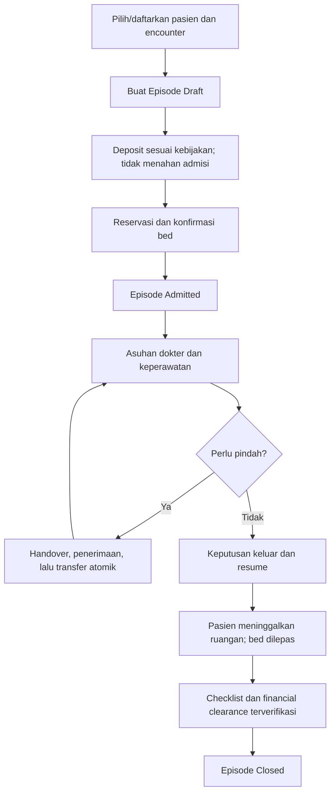
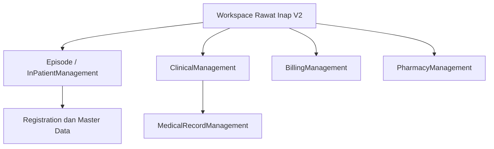

# PRD to MVP — Penyempurnaan Modul Rawat Inap V2

## 1. Status dokumen

| Atribut | Nilai |
|---|---|
| Status | **PRD LENGKAP — siap dinilai sebelum implementation lock** |
| Versi | `1.0.0` |
| Tanggal | 11 September 2026 |
| Produk | Quilvian System — Rawat Inap V2 |
| Bentuk modul | Komposit: `episode`, `keperawatan`, `dokter` |
| Tujuan | Melengkapi MVP V2, mempertahankan desain yang lebih baik dari V1, dan memperbaiki proses yang menyimpang |
| Pemilik keputusan produk yang tercatat | Muhammad Hamzah |
| Dasar rancangan | `Rancangan-Rencana-PRD-to-MVP-Rawat-Inap-V2.md` versi `1.0-approved` |
| Persetujuan penyusunan PRD | Diberikan pengguna pada 11 September 2026: “Setuju, buatkan docs PRD TO MVP” |
| Izin implementasi source code | **Belum diberikan** |
| Persetujuan yang dibutuhkan | Product/Domain Owner, Clinical Governance, Security/Privacy, Billing, dan pemilik integrasi terkait |

Dokumen ini adalah PRD produk dan rencana delivery. Dokumen ini tidak mengubah source code, database, migration, permission, maupun deployment.

## Cara membaca dokumen ini

Dokumen dibagi agar dapat digunakan oleh pembaca umum maupun tim teknis:

- Bagian 3–10 menjelaskan masalah, tujuan, kondisi V2, ruang lingkup, pelaku, alur, dan keputusan utama dengan bahasa bisnis.
- Bagian 11–14 berisi kebutuhan yang harus diwujudkan oleh tim Episode, Keperawatan, dan Dokter.
- Bagian 15–19 menjelaskan kepemilikan data, kontrak antarmodul, tampilan, hak akses, keamanan, dan kualitas sistem.
- Bagian 20 berisi skenario penerimaan yang dapat diperiksa tanpa menebak maksud requirement.
- Bagian 21–29 menjelaskan urutan delivery, verifikasi, migrasi, risiko, keputusan terbuka, dan persetujuan lanjutan.

Prioritas yang digunakan:

| Prioritas | Arti |
|---|---|
| `P0` | Wajib dibereskan sebelum UAT/produksi karena menyangkut keselamatan, integritas data, atau kontrol utama |
| `P1` | Wajib agar MVP operasional dianggap lengkap |
| `P2` | Boleh dikerjakan setelah MVP stabil dan tidak menjadi penghalang rilis awal |

## Istilah penting

| Istilah | Arti sederhana |
|---|---|
| Episode | Satu rangkaian rawat inap pasien sejak diterima sampai administrasinya ditutup |
| Encounter / kunjungan | Catatan kedatangan pasien yang menjadi penghubung pelayanan |
| Placement | Catatan pasien menempati bed tertentu pada waktu tertentu |
| Census | Daftar pasien yang secara fisik masih dirawat di ruangan |
| DPJP | Dokter Penanggung Jawab Pelayanan |
| CPPT | Catatan perkembangan pasien yang digunakan bersama oleh tenaga kesehatan |
| MAR | Catatan setiap dosis obat yang benar-benar diberikan, ditahan, ditolak, atau terlewat |
| Financial clearance | Kepastian berdasarkan Billing bahwa tagihan, pembayaran, deposit, settlement, dan refund telah selesai |
| Addendum | Catatan koreksi tambahan yang tidak menghapus isi asli |
| Idempotency | Perlindungan agar pengiriman request yang sama tidak membuat transaksi ganda |
| UAT | Pengujian bersama pengguna operasional sebelum sistem dipakai |

## 2. Sumber dan batas audit

PRD ini disusun dari pembacaan statis terhadap empat snapshot berikut:

| Komponen | Repository / branch | Commit audit |
|---|---|---|
| Frontend V1 | `DevBenari/QuilvianSystemFrontendDev` / `MHamzah` | `86408f245ab9e3d77fd5cdc3e3fc6fd676fc7483` |
| Frontend V2 | `DevBenari/QuilvianSystemFrontendDev` / `HamzahV2` | `7f6b9356f6349d516570d6d603ca026f2c7f4ec2` |
| Backend V1 | `DevBenari/QuilvianSystemBackendDev` / `QuilvianSta` | `4be1499cc861f062398bf7f79229f5f1f7cd6ba3` |
| Backend V2 | `DevBenari/NewQuilvianSystemBackend` / `MHamzah` | `201de7535d4ca00fa9ede2395d4fb769f023b9e6` |

Status “sudah diterapkan” pada dokumen ini berarti ditemukan pada source snapshot di atas. Audit ini tidak menyatakan migration telah terpasang di suatu environment atau seluruh test lulus. CLI `.NET` tidak tersedia pada workspace audit, sehingga test backend tidak dijalankan ulang.

## 3. Ringkasan eksekutif

V2 sudah mempunyai fondasi yang lebih tepat daripada V1: episode rawat inap eksplisit, status perawatan yang terkontrol, reservation dan placement terpisah, riwayat lokasi, penugasan dokter/perawat berperiode, pemisahan keputusan pulang dari kepergian fisik serta penutupan administrasi, versioning, addendum, idempotency, dan monitoring.

Namun V2 belum siap dianggap sebagai MVP operasional penuh. Ada empat penyimpangan P0 yang harus diperbaiki lebih dahulu:

1. Kelayakan bed secara keliru mengikuti jenis kelamin penghuni pertama dalam satu kamar.
2. Status financial clearance dapat ditandai manual tanpa membuktikan saldo, settlement, atau refund dari Billing.
3. CPPT dan tanda vital masih mempunyai jalur `DELETE` yang dapat menyembunyikan rekam klinis.
4. Pembuatan catatan dokter belum selalu menegakkan identitas penulis dan penugasan dokter dari pengguna yang login.

Selain itu, sejumlah proses penting V1 belum mempunyai padanan aman di V2: serah terima klinis transfer, bukti consent tersimpan, lima cara keluar, medication administration record, handover per shift, fluid balance/WSD, sliding scale, observasi transfusi, instrumen pengkajian sesuai kelompok pasien, serta pengelolaan diagnosis/problem list dari frontend dokter.

MVP yang diusulkan bukan menyalin semua layar V1. MVP menyamakan hasil bisnis yang penting, memperbaiki kontrol keselamatan, dan tetap menjaga kepemilikan data V2 agar tidak membuat tabel tandingan.

## 4. Sasaran produk

MVP dinyatakan berhasil bila:

- Pasien dapat masuk, ditempatkan, dirawat, dipindahkan, dipulangkan, dan ditutup dalam satu episode yang dapat diaudit.
- Bed netral dapat ditempati pasien laki-laki atau perempuan tanpa dipengaruhi jenis kelamin penghuni bed lain dalam kamar yang sama.
- Setiap catatan klinis mempunyai episode, pasien, penulis, waktu klinis, status, dan jejak koreksi yang sah.
- Catatan final atau terverifikasi tidak dapat dihapus atau ditimpa.
- Transfer antarunit mempunyai serah terima klinis dan penerimaan tujuan, sedangkan perpindahan bed tetap atomik.
- Consent mempunyai bukti tersimpan dan dapat ditelusuri per episode.
- Financial clearance berasal dari fakta Billing, bukan sekadar pilihan manual.
- Keperawatan mempunyai minimum workflow keselamatan: pengkajian, rencana asuhan, tindakan, MAR, handover, I/O, sliding scale, dan transfusi.
- Dokter dapat mengelola kajian, perkembangan, CPPT, visite, diagnosis/problem list, order/resep, tindakan, dan resume dengan kewenangan per pasien.
- Seluruh P0 dan P1 memiliki test unit/integrasi/E2E dan lulus pada pipeline resmi.

### 4.1 Indikator keberhasilan rilis

| Indikator | Target MVP |
|---|---:|
| Penolakan karena `ROOM_GENDER_MIXED` | `0`; kode dan aturan dihapus |
| Penempatan ganda pada satu bed | `0` |
| Episode aktif ganda untuk pasien yang sama | `0` |
| Catatan klinis final yang dapat dihapus | `0` |
| Catatan dokter tanpa penulis terautentikasi dan penugasan aktif | `0` |
| Transfer antarunit tanpa handover atau emergency override | `0` |
| Penutupan normal dengan outstanding/refund pending | `0` |
| Penutupan memakai override | `100%` beralasan, berpelaku, bertimestamp, dan masuk laporan |
| Pemberian obat tanpa order atau alasan pengecualian | `0` |
| Ketidaksesuaian placement dan salinan status bed | `0` pada gate rilis |

## 5. Prinsip produk yang mengikat

1. **Episode adalah konteks utama perawatan.** Semua aktivitas rawat inap harus dapat ditelusuri ke satu `EpisodeId` dan satu encounter.
2. **Satu sumber kebenaran.** Rawat Inap tidak membuat tabel tandingan untuk pasien, encounter, resep, diagnosis, clinical note, billing ledger, maupun consent.
3. **Identitas tidak dipercaya dari payload.** Server mengambil pelaku dari authenticated user dan memvalidasi hubungan pelaku dengan pasien.
4. **Final berarti immutable.** Koreksi dokumen final dilakukan dengan addendum; isi asli tetap utuh.
5. **Keselamatan tidak boleh bergantung pada frontend.** Tombol boleh disembunyikan untuk UX, tetapi backend tetap menjadi penjaga otoritatif.
6. **Perpindahan bed harus atomik.** Kegagalan tidak boleh membuat pasien tanpa bed atau menempati dua bed.
7. **Admisi klinis tidak ditahan karena uang atau consent dalam keadaan darurat.** Kekurangan harus terlihat dan ditindaklanjuti, bukan menghambat pertolongan.
8. **Audit append-only untuk peristiwa penting.** Status, assignment, transfer, consent, clearance, finalisasi, koreksi, dan override tidak boleh hilang.
9. **Konfigurasi klinis harus berversi.** Instrumen penilaian, ambang waktu, dan protokol tidak ditanam sebagai angka tetap bila bergantung SOP rumah sakit.
10. **Paritas dinilai dari outcome, bukan jumlah menu.** Form V1 boleh digabung menjadi workflow terstruktur selama datanya lengkap, aman, dan dapat dilaporkan.

## 6. Peta kondisi V2 saat audit

### 6.1 Episode

| Kemampuan | Kondisi V2 | Keputusan MVP |
|---|---|---|
| Episode dan lifecycle | Sudah diterapkan dan lebih baik dari V1 | Pertahankan |
| Reservation, placement, concurrency | Sudah diterapkan | Pertahankan dan tambah regresi |
| Validasi gender bed | Diterapkan, tetapi ada aturan dinamis per kamar yang salah | **Perbaiki P0** |
| Isolasi | Sudah diterapkan sebagai atribut episode dan kelayakan bed | Pertahankan; validasi klinis |
| Census, bed board, monitoring | Sudah diterapkan | Pertahankan |
| DPJP dan perawat berperiode | Sudah diterapkan | Pertahankan; gunakan untuk otorisasi klinis |
| Transfer bed | Sudah atomik, tetapi hanya memindahkan lokasi | Lengkapi handover dan penerimaan tujuan |
| Kepergian fisik terpisah dari closure | Sudah diterapkan; perbaikan yang baik dibanding V1 | Pertahankan |
| Consent | Baru cetak/manual; bukti tanda tangan tidak tersimpan | **Lengkapi P0** |
| Hubungan ibu–bayi | Backend ada; pilihan ibu di frontend belum operasional | Lengkapi P1 |
| Cara keluar | Dokter, APS, rujuk ada; meninggal/kabur belum aktif | Lengkapi P1 setelah sign-off klinis |
| Financial clearance | Ada status manual, belum menjadi bukti Billing | **Perbaiki P0** |
| Deposit dan shortfall | Sebagian fondasi Billing ada; ringkasan dan monitoring belum utuh | Lengkapi P1 |
| IGD ke Rawat Inap | Desain ada, integrasi pemilik lain belum tuntas | Integration gate |
| Koreksi episode/resume | Sudah mempunyai mekanisme koreksi/versi | Pertahankan |

### 6.2 Keperawatan

| Kemampuan | Kondisi V2 | Keputusan MVP |
|---|---|---|
| Pengkajian awal dan ulang | Sudah diterapkan | Pertahankan dan perluas |
| Pain, nutrisi, jatuh, fungsi, psikososial, edukasi | Ada dalam bentuk inti | Pertahankan; jangan klaim setara seluruh form V1 |
| Skor risiko jatuh | Terlalu sederhana dan hard-coded | Perbaiki dengan instrumen berversi sesuai umur/SOP |
| Rencana asuhan dan evaluasi | Sudah diterapkan, berversi | Pertahankan |
| Tindakan keperawatan | Sudah diterapkan dengan finalisasi/addendum | Pertahankan; tutup jalur delete |
| Medication Administration Record | Belum ada; tindakan generik “pemberian obat” bukan MAR | **Lengkapi P0/P1** |
| Handover antar shift | Belum ada | Lengkapi P1 |
| Intake/output, drain, WSD | Belum setara V1 | Lengkapi P1 |
| Sliding scale | Belum ada | Lengkapi P1 |
| Transfusi dan reaksi | Belum ada | Lengkapi P1 |
| Pengkajian respirasi, kulit, eliminasi, dependency | Belum lengkap | Lengkapi lewat template terstruktur |
| Asuhan gizi penuh | Bukan milik Rawat Inap | Integrasikan skrining/rujukan/status; jangan duplikasi domain Gizi |
| Pemakaian alat | Belum ada pemilik master aset | Tunda terkontrol sampai modul aset tersedia |

### 6.3 Dokter

| Kemampuan | Kondisi V2 | Keputusan MVP |
|---|---|---|
| Kajian medis awal/ulang | Sudah diterapkan | Pertahankan |
| SOAP/konsultasi berulang | Sudah diterapkan | Pertahankan |
| CPPT dan verifikasi | Sudah diterapkan | Pertahankan; hapus jalur delete |
| Physician Visit eksplisit | Sudah diterapkan | Pertahankan |
| Resep, obat pulang, tindakan | Sudah terhubung ke modul bersama | Pertahankan; uji regresi |
| Lab dan radiologi | Konteks/hasil sudah dapat dibaca | Pertahankan; jangan duplikasi hasil |
| Diagnosis/problem list | Backend sebagian tersedia; frontend belum menyelesaikan workflow | Lengkapi P1 |
| Otorisasi penulis | Resolver mampu memeriksa assignment, tetapi create path tidak selalu mengirim dokter pelaku | **Perbaiki P0** |
| Finalisasi/addendum | Desain baik, tetapi jalur delete bersama merusak invariant | Perbaiki P0 |
| Warning visite berdekatan | Ada di frontend dengan ambang lokal | Jadikan setting/server policy atau tandai hanya sebagai UX warning |

## 7. Batas MVP

### 7.1 Termasuk dalam MVP

- Seluruh fondasi episode V2 yang sudah baik.
- Empat koreksi P0: gender kamar, kebenaran financial clearance, penghapusan rekam klinis, dan otorisasi penulis dokter.
- Consent tersimpan per episode.
- Hubungan ibu–bayi yang operasional dari frontend sampai backend.
- Lima cara keluar: izin dokter, APS, rujuk, meninggal, dan kabur/absconded.
- Transfer antarunit dengan clinical handover dan receiving acceptance atau emergency override.
- Deposit episode, shortfall, settlement, dan refund status dari Billing.
- Pengkajian keperawatan terstruktur dan instrumen risiko jatuh berversi.
- Rencana asuhan, tindakan, MAR, handover shift, fluid balance/WSD, sliding scale, dan observasi transfusi.
- Kajian dokter, SOAP/CPPT, visite, diagnosis/problem list, resep/order, tindakan, hasil penunjang, resume, finalisasi, dan addendum.
- Permission-aware UI, audit, monitoring, migrasi, observability, dan regression suite.

### 7.2 Tidak termasuk dalam MVP

| Item | Alasan | Pemicu masuk |
|---|---|---|
| Mesin inventaris/pemakaian alat penuh | Belum ada master aset dan pemilik data yang sah | Modul aset/inventory aktif dan ownership disetujui |
| Asuhan gizi end-to-end | Milik Nutrition Management | Kontrak Nutrition tersedia; Rawat Inap hanya menjadi workspace/referral |
| Klaim asuransi penuh | Milik Insurance/Billing | Roadmap domain terkait |
| Detail running bill selain ringkasan yang dibutuhkan clearance | Milik Billing | Billing menyediakannya |
| Booking operasi dan formulir operasi khusus | Milik Operating Room | Integrasi owner terkait |
| Waitlist bed kompleks dan optimasi kapasitas | Bukan release blocker | Setelah data operasional MVP stabil |
| Cetak gelang/label lengkap | Tidak memengaruhi keselamatan proses inti bila prosedur manual tersedia | Setelah template/printing owner disepakati |

Penundaan tidak boleh diganti dengan tabel sementara pada `InPatientManagement`.

## 8. Pelaku dan tanggung jawab

| Pelaku | Tanggung jawab utama |
|---|---|
| Petugas admisi | Membuka episode, memilih encounter/penjamin, reservasi, konfirmasi kedatangan, checklist, dan closure administratif |
| Perawat pelaksana | Pengkajian, tindakan, MAR, monitoring, handover, transfer operasional, dan kepergian fisik |
| Kepala ruangan | Assignment perawat, penerimaan transfer, monitoring kepatuhan, dan escalation |
| DPJP | Keputusan klinis utama, diagnosis, order, resume, discharge decision, dan perubahan kebutuhan isolasi |
| Konsulen / dokter on-call | Mencatat dalam batas assignment yang aktif dan eksplisit |
| Kasir / Billing | Deposit, settlement, refund, outstanding, dan sumber financial clearance |
| Supervisor | Override terbatas, koreksi episode, emergency transfer override, dan laporan pengecualian |
| Medical Record | Audit kelengkapan, integritas dokumen, dan tindak lanjut koreksi |
| Admin Master Data | Bed eligibility, unit, kelas, instrumen, checklist, parameter, dan protokol yang telah disetujui |
| Security/Privacy Owner | Least privilege, akses rekam medis, consent, retensi, dan audit review |

## 9. Alur bisnis target

Aturan penting: `DischargePending` boleh tetap terbuka setelah pasien meninggalkan ruangan, tetapi pasien tidak lagi muncul pada census dan bed sudah dapat dipakai. Episode tetap wajib diselesaikan dan dipantau.

## 10. Peta keputusan desain

| ID | Keputusan | Status |
|---|---|---|
| `MVP-RWI-D-001` | Episode tetap menjadi aggregate utama dan tiga submodul tetap dipertahankan | Disetujui sebagai baseline PRD |
| `MVP-RWI-D-002` | `RWI-DEC-066` dan seluruh perilaku room-level dynamic gender dinyatakan **superseded** | **Berasal dari koreksi eksplisit pengguna** |
| `MVP-RWI-D-003` | Gender divalidasi hanya terhadap eligibility bed yang dikonfigurasi; penghuni kamar lain tidak memengaruhi keputusan | Disetujui sebagai baseline PRD |
| `MVP-RWI-D-004` | Final/verified clinical records tidak mempunyai operasi delete; koreksi selalu addendum | Disetujui masuk PRD sebagai P0 |
| `MVP-RWI-D-005` | Penulis klinis berasal dari authenticated identity dan assignment aktif, bukan `DoctorId`/`NurseId` bebas dari request | Disetujui masuk PRD sebagai P0 |
| `MVP-RWI-D-006` | Billing adalah source of truth financial clearance; status manual hanya override terotorisasi | Disetujui masuk PRD sebagai P0; kontrak menunggu Billing Owner |
| `MVP-RWI-D-007` | Transfer lokasi dan clinical handover adalah dua artefak, tetapi commit perpindahan bed tetap atomik | Disetujui masuk PRD sebagai P1; detail klinis menunggu governance |
| `MVP-RWI-D-008` | Consent menggunakan domain consent yang ada dan menyimpan evidence per episode; tidak dibuat tabel bayangan Rawat Inap | Disetujui masuk PRD sebagai P0; format legal menunggu owner |
| `MVP-RWI-D-009` | Form keperawatan V1 dimodelkan sebagai instrumen/template berversi, bukan satu tabel baru per formulir | Disetujui masuk PRD sebagai P1 |
| `MVP-RWI-D-010` | Pemberian obat merupakan MAR yang terhubung order/resep; tidak boleh disamakan dengan tindakan generik | Disetujui masuk PRD sebagai P0/P1 |
| `MVP-RWI-D-011` | Meninggal dan kabur merupakan cara keluar berbeda dengan field, permission, audit, dan reporting berbeda | Menunggu sign-off klinis |
| `MVP-RWI-D-012` | Fitur tanpa domain owner, seperti inventory alat penuh, ditunda dan tidak dibuatkan data sementara | Disetujui sebagai batas MVP |

## 11. Functional requirements lintas submodul

| ID | Prioritas | Requirement |
|---|---|---|
| `FR-MVP-G-001` | P0 | Setiap write rawat inap wajib menyertakan konteks episode yang cocok dengan encounter dan pasien. |
| `FR-MVP-G-002` | P0 | Server wajib mengambil `ActorUserId` dari authentication context; ID pelaku dari payload tidak menjadi sumber otoritas. |
| `FR-MVP-G-003` | P0 | Create/update/cancel/finalize/addendum wajib diperiksa permission dan relationship-to-patient di backend. |
| `FR-MVP-G-004` | P0 | Tidak ada hard delete maupun soft delete yang menyembunyikan catatan klinis final/verified dari rekam medis normal. |
| `FR-MVP-G-005` | P0 | Draft boleh dibatalkan dengan alasan dan audit; setelah final hanya addendum bernomor urut yang diperbolehkan. |
| `FR-MVP-G-006` | P0 | Semua command yang berpotensi dikirim ulang wajib mendukung idempotency dan menolak reuse key dengan payload berbeda. |
| `FR-MVP-G-007` | P0 | Waktu disimpan dalam UTC, ditampilkan sesuai timezone fasilitas, dan waktu klinis dibedakan dari waktu input. |
| `FR-MVP-G-008` | P1 | Frontend menyembunyikan atau menonaktifkan aksi yang tidak diizinkan, dengan alasan yang jelas; backend tetap otoritatif. |
| `FR-MVP-G-009` | P1 | Semua perubahan status dan pengecualian menghasilkan audit append-only yang dapat difilter per episode. |
| `FR-MVP-G-010` | P1 | Data historis V1/V2 tidak boleh ditebak, ditimpa, atau dihapus saat migrasi; nilai yang tidak dapat dipetakan diberi status legacy/unresolved. |

## 12. Functional requirements — Episode

### 12.1 Lifecycle, bed, dan census

| ID | Prioritas | Requirement |
|---|---|---|
| `FR-MVP-EP-001` | P0 | Lifecycle tetap `Draft → Admitted → DischargePending → Closed`, dengan `Cancelled` dan sesi koreksi yang tidak mengubah status klinis episode. |
| `FR-MVP-EP-002` | P0 | Satu pasien hanya boleh memiliki satu episode benar-benar aktif; percobaan admisi kedua ditolak dengan episode/lokasi yang sudah ada. |
| `FR-MVP-EP-003` | P0 | Reservation, placement, transfer, release, dan salinan `BedStatus` ditulis atomik dengan concurrency guard. |
| `FR-MVP-EP-004` | P0 | Source of truth penghunian adalah placement aktif; `MstBed.BedStatus` hanya salinan yang direkonsiliasi. |
| `FR-MVP-EP-005` | P0 | Tidak ada validasi berdasarkan gender penghuni kamar. Service tidak memuat, membandingkan, atau menyimpulkan kebijakan gender dari occupant lain. |
| `FR-MVP-EP-006` | P0 | Bed dengan `IsForMale=true` dan `IsForFemale=true` menerima pasien laki-laki, perempuan, atau gender belum tercatat, terlepas dari penghuni lain di kamar. |
| `FR-MVP-EP-007` | P0 | Bed yang eksplisit male-only/female-only tetap menolak gender yang tidak sesuai dengan kode `BED_GENDER_MISMATCH`; konfigurasi tidak berubah otomatis setelah ada penghuni. |
| `FR-MVP-EP-008` | P0 | Kebutuhan isolasi dan eligibility newborn tetap diperiksa terpisah dari gender. Perubahan kebutuhan isolasi dapat memunculkan placement drift tanpa memblokir pencatatan klinis. |
| `FR-MVP-EP-009` | P1 | Census menampilkan episode yang secara fisik masih berada di ruangan, lokasi, DPJP, perawat, hari rawat, risiko utama, dan tugas jatuh tempo. |
| `FR-MVP-EP-010` | P1 | Episode `DischargePending` yang telah dicatat meninggalkan ruangan tidak tampil di census, tetapi tetap tampil di monitoring closure tertunda. |

### 12.2 Consent, ibu–bayi, transfer, dan cara keluar

| ID | Prioritas | Requirement |
|---|---|---|
| `FR-MVP-EP-011` | P0 | Satu general consent aktif tersimpan per episode melalui domain `PatientConsent`, lengkap dengan versi template, penandatangan, hubungan dengan pasien, waktu, metode tanda tangan, dan evidence/hash dokumen. |
| `FR-MVP-EP-012` | P0 | Pasien gawat dapat diadmisi tanpa consent; status exception dan alasan dicatat. Closure normal memerlukan evidence atau override legal yang diaudit sesuai kebijakan yang disetujui. |
| `FR-MVP-EP-013` | P1 | Selector ibu menampilkan episode ibu yang aktif dan dapat dicari berdasarkan identitas, nomor episode, unit, dan lokasi. |
| `FR-MVP-EP-014` | P1 | Link ibu–bayi menolak self-link, pasien yang sama, episode ibu tertutup, atau kombinasi tidak valid; header dan census menampilkan hubungan dua arah. |
| `FR-MVP-EP-015` | P1 | Transfer dalam unit dapat langsung menjalankan transfer atomik dengan alasan dan audit sesuai permission. |
| `FR-MVP-EP-016` | P1 | Transfer antarunit memerlukan clinical handover terfinalisasi dan acceptance unit tujuan sebelum commit transfer. Emergency override hanya untuk peran khusus, alasan wajib, dan masuk monitoring. |
| `FR-MVP-EP-017` | P1 | Handover menyimpan pengirim, penerima, kondisi terkini, alergi, terapi/obat/infus aktif, devices/drain, pending order/hasil, risiko/escalation, waktu, dan acknowledgment. |
| `FR-MVP-EP-018` | P1 | Lima cara keluar didukung sebagai nilai terstruktur: `DoctorApproved`, `AgainstMedicalAdvice`, `Referred`, `Death`, `Absconded`. |
| `FR-MVP-EP-019` | P1 | `Death` mewajibkan waktu, dokter yang menyatakan, sebab/kondisi sesuai kebijakan, waktu jenazah keluar, dan dokumen/pelaporan yang ditetapkan clinical governance. |
| `FR-MVP-EP-020` | P1 | `Absconded` mewajibkan waktu terakhir terlihat, waktu dipastikan, pelapor, langkah pencarian/notifikasi, kondisi terakhir, dan supervisor review. |
| `FR-MVP-EP-021` | P1 | Kepergian fisik melepas bed tanpa menutup episode; pencatatan hanya valid dari `DischargePending` atau jalur Death/Absconded yang disetujui. |
| `FR-MVP-EP-022` | P1 | Reopen/koreksi episode tertutup tidak mengembalikan bed, tidak mengubah lama rawat, dan tidak menerima clinical note baru; addendum dokumen lama tetap dapat dilakukan oleh pihak berwenang. |

### 12.3 Billing, deposit, dan closure

| ID | Prioritas | Requirement |
|---|---|---|
| `FR-MVP-EP-023` | P0 | Billing menyediakan ringkasan finansial episode: total charge final, pembayaran, deposit diterima, deposit terpakai, outstanding, refund due, refund completed, settlement status, dan waktu kalkulasi. |
| `FR-MVP-EP-024` | P0 | `Cleared` hanya dapat terbentuk bila Billing menyatakan outstanding `0`, settlement selesai, dan tidak ada refund/reversal pending. |
| `FR-MVP-EP-025` | P0 | Field manual `InpFinancialClearance` tidak boleh menjadi bukti tunggal. Jika tetap dipertahankan untuk kompatibilitas, nilainya berstatus snapshot/override dan tidak mengalahkan Billing. |
| `FR-MVP-EP-026` | P0 | Supervisor dapat melakukan financial override tanpa mengubah fakta Billing; alasan, bukti, status finansial saat itu, actor, dan timestamp wajib disimpan serta dilaporkan. |
| `FR-MVP-EP-027` | P1 | Minimum deposit dibaca dari kebijakan penjamin dan kelas. Kekurangan deposit menghasilkan peringatan dan monitoring, bukan penolakan admisi/perawatan. |
| `FR-MVP-EP-028` | P1 | Transaksi deposit tetap menjadi ledger Billing dan ditelusuri ke episode melalui encounter yang unik; retry tidak membuat transaksi/kwitansi ganda. |
| `FR-MVP-EP-029` | P1 | Monitoring membedakan kekurangan terhadap minimum deposit dari kekurangan terhadap final bill. Kedua angka tidak boleh diberi label yang sama. |
| `FR-MVP-EP-030` | P0 | Closure normal memeriksa keputusan keluar, resume sesuai tipe keluar, checklist administrasi, bukti consent sesuai policy, financial clearance terverifikasi, dan keadaan placement. |
| `FR-MVP-EP-031` | P1 | Semua blocker closure dikembalikan sekaligus dengan kode dan tindakan perbaikan, bukan satu error generik. |
| `FR-MVP-EP-032` | P1 | IGD handover menutup encounter IGD dan membuat encounter rawat inap dalam satu transaksi hanya setelah event tiba dan syarat integrasi terpenuhi; kegagalan meninggalkan pasien tetap di IGD. |

## 13. Functional requirements — Keperawatan

### 13.1 Pengkajian dan rencana asuhan

| ID | Prioritas | Requirement |
|---|---|---|
| `FR-MVP-KEP-001` | P0 | Pengkajian hanya dapat dibuat pada episode yang sesuai dengan pasien/encounter dan oleh perawat terautentikasi. |
| `FR-MVP-KEP-002` | P1 | Pengkajian awal dan reassessment mempunyai waktu klinis, penulis, status draft/final, dan tautan ke instrumen/versi yang digunakan. |
| `FR-MVP-KEP-003` | P1 | Instrumen mendukung bagian respirasi, sirkulasi, neurologi, nyeri, kulit/integritas, nutrisi, eliminasi, mobilitas/dependency, psikososial, edukasi, dan risiko khusus tanpa membuat tabel baru per formulir. |
| `FR-MVP-KEP-004` | P1 | Penilaian risiko jatuh dipilih berdasarkan usia/unit/SOP dan memakai rule version yang disetujui; skor tidak boleh dihitung hanya dari dua boolean. |
| `FR-MVP-KEP-005` | P1 | Perubahan definisi instrumen tidak mengubah hasil lama. Hasil menyimpan version/hash definisi yang dipakai saat finalisasi. |
| `FR-MVP-KEP-006` | P1 | Rencana asuhan menyimpan masalah, outcome/target, intervensi, penanggung jawab, waktu target, status, evaluasi, dan riwayat versi. |
| `FR-MVP-KEP-007` | P1 | Perubahan care plan karena perkembangan membuat versi baru; pembetulan kesalahan pengkajian/tindakan final memakai addendum. |

### 13.2 Tindakan dan MAR

| ID | Prioritas | Requirement |
|---|---|---|
| `FR-MVP-KEP-008` | P0 | Tindakan keperawatan final tidak dapat dihapus; draft dapat dibatalkan dengan alasan. |
| `FR-MVP-KEP-009` | P0 | MAR terhubung ke medication order/resep dan menampilkan pasien, obat, dosis, rute, jadwal, alergi, instruksi, serta status dispense yang relevan. |
| `FR-MVP-KEP-010` | P0 | Setiap scheduled dose mempunyai status `Due`, `Administered`, `Held`, `Refused`, `Missed`, atau `Cancelled`; semua selain administered mewajibkan alasan yang sesuai. |
| `FR-MVP-KEP-011` | P0 | Pencatatan pemberian menyimpan waktu rencana, waktu aktual, pelaksana, dosis/rute aktual, dan deviasi; retry idempotent tidak membuat pemberian ganda. |
| `FR-MVP-KEP-012` | P0 | Obat high-alert yang dikonfigurasi mewajibkan independent double-check oleh pengguna kedua; pengguna yang sama tidak dapat menjadi pemeriksa kedua. |
| `FR-MVP-KEP-013` | P1 | PRN mewajibkan indikasi saat pemberian dan hasil evaluasi setelah interval yang ditetapkan. |
| `FR-MVP-KEP-014` | P0 | Suspected adverse drug reaction dapat dicatat dari MAR, mengirim notifikasi klinis, dan tertaut ke episode serta dosis terkait tanpa mengubah catatan pemberian asli. |

### 13.3 Handover, cairan, sliding scale, dan transfusi

| ID | Prioritas | Requirement |
|---|---|---|
| `FR-MVP-KEP-015` | P1 | Handover shift menghasilkan snapshot masalah aktif, risiko, order/obat, devices, hasil tertunda, dan tugas outstanding; pemberi serta penerima melakukan acknowledgment terpisah. |
| `FR-MVP-KEP-016` | P1 | Snapshot handover yang sudah ditandatangani immutable; perubahan setelahnya muncul pada handover berikutnya atau addendum, bukan menimpa snapshot lama. |
| `FR-MVP-KEP-017` | P1 | Intake/output mencatat sumber, volume, unit, waktu, actor, drain/WSD, serta total per shift dan rolling 24 jam; koreksi mempertahankan nilai lama. |
| `FR-MVP-KEP-018` | P1 | Sliding scale hanya dapat dijalankan dari order/protocol dokter yang aktif dan berversi; sistem menyimpan glucose result, rule yang cocok, dosis yang diberikan, dan exception. |
| `FR-MVP-KEP-019` | P1 | Workflow transfusi mencatat order, produk/identifier yang tersedia, pre-check, baseline vital, start/stop, observasi berkala, pelaksana/pemeriksa, dan reaction/escalation. |
| `FR-MVP-KEP-020` | P1 | Skrining nutrisi dapat membuat referral ke Nutrition Management dan membaca statusnya; rencana gizi penuh tetap milik Nutrition. |

## 14. Functional requirements — Dokter

| ID | Prioritas | Requirement |
|---|---|---|
| `FR-MVP-DOK-001` | P0 | Sistem memetakan authenticated user ke dokter. Bila tidak ada mapping aktif, clinical authoring ditolak. |
| `FR-MVP-DOK-002` | P0 | Penulis harus mempunyai assignment aktif untuk episode dan waktu klinis tersebut sebagai DPJP, konsulen, atau on-call sesuai policy. |
| `FR-MVP-DOK-003` | P0 | `DoctorId` pada request tidak boleh mengganti identitas penulis. Mismatch ditolak; delegated recording memakai kontrak khusus yang membedakan author, recorder, signer, alasan, dan dasar delegasi. |
| `FR-MVP-DOK-004` | P1 | Kajian medis awal dan reassessment mendukung draft, finalisasi/tanda tangan, dan addendum setelah final. |
| `FR-MVP-DOK-005` | P1 | Banyak SOAP/konsultasi dapat dibuat dalam satu episode tanpa antrean poliklinik semu dan tanpa mengubah perilaku Rawat Jalan. |
| `FR-MVP-DOK-006` | P0 | CPPT/tanda vital/catatan dokter final atau verified tidak mempunyai jalur delete. Cancel hanya untuk draft dengan alasan; addendum untuk final. |
| `FR-MVP-DOK-007` | P1 | Verifikasi CPPT menyimpan verifier, waktu, hasil, dan hubungan assignment; verifikasi tidak mengubah penulis asli. |
| `FR-MVP-DOK-008` | P1 | Physician Visit adalah event eksplisit, idempotent, dan dapat ditautkan opsional ke catatan/tindakan; dua kunjungan nyata pada hari yang sama tetap dua event. |
| `FR-MVP-DOK-009` | P1 | Diagnosis/problem list dapat dibuat, diperbarui sebagai perkembangan, dipilih sebagai primary, dinonaktifkan dengan alasan, dan ditautkan ke kode diagnosis terstruktur dari frontend. |
| `FR-MVP-DOK-010` | P1 | Tepat satu primary diagnosis berlaku saat discharge summary difinalisasi; diagnosis lama dan perubahan primary tetap dapat diaudit. |
| `FR-MVP-DOK-011` | P1 | Resep/order, tindakan, laboratorium, dan radiologi menggunakan source of truth modul pemilik dan tampil dalam timeline episode tanpa disalin ke tabel Rawat Inap. |
| `FR-MVP-DOK-012` | P1 | Resume menyesuaikan cara keluar, mengambil periode DPJP dan diagnosis terstruktur, ditandatangani pihak berwenang, serta hanya dikoreksi melalui mekanisme versi/addendum. |
| `FR-MVP-DOK-013` | P2 | Warning visite berdekatan memakai parameter server/admin bila dimaksudkan sebagai aturan operasional; bila tetap lokal, label harus jelas sebagai warning UX dan tidak memblokir. |

## 15. Kepemilikan data dan arsitektur target

| Data / fungsi | Source of truth | Aturan |
|---|---|---|
| Episode, reservation, placement, status, departure | `InPatientManagement` | Tidak diduplikasi |
| Assignment dokter/perawat per episode | `InPatientManagement` | Berperiode dan append-only |
| Transfer workflow/location | `InPatientManagement` | Commit bed atomik |
| Isi clinical handover | `ClinicalManagement` | Tertaut transfer/episode; immutable setelah sign |
| Assessment, care plan, intervention, MAR, vital, CPPT, SOAP, diagnosis | `ClinicalManagement` | Episode sebagai context, bukan owner data |
| Document integrity dan addendum | `MedicalRecordManagement` | Satu mesin koreksi untuk dokumen klinis |
| Prescription/dispense | `PharmacyManagement` | MAR mereferensikan order/resep, tidak menyalin ledger obat |
| Deposit, pembayaran, final bill, refund, settlement | `BillingManagement` | Episode hanya membaca ringkasan |
| General consent/evidence | Domain `PatientConsent` yang sudah ada | Extend bila field evidence/version belum tersedia; jangan membuat shadow consent |
| Pasien dan encounter | Registration | Episode menyimpan referensi |
| Bed eligibility, room, class, unit | Master Data | Tidak berubah berdasarkan occupant |
| Instrumen klinis/protokol | Clinical master/configuration | Berversi dan disetujui governance |

### 15.1 Perubahan model data yang diusulkan

Nama final mengikuti konvensi repository saat desain teknis. Kebutuhan logisnya:

- Tambah/extend evidence consent: episode/encounter, template version/hash, signer, relationship, signed time, method, document reference, revocation/amendment history.
- Tambah transfer request/acceptance pada Episode dan clinical handover document pada Clinical Management.
- Aktifkan enum `Death` dan `Absconded` beserta detail keluar yang terstruktur.
- Sediakan financial summary/read model dari Billing; jangan menyimpan ulang saldo sebagai ledger Episode.
- Tambah medication administration dan dose-event history di Clinical Management, mereferensikan order/resep Pharmacy.
- Tambah handover shift, fluid balance events, transfusion observation/reaction, dan protocol execution.
- Tambah versioned assessment instrument definition/result bila struktur existing belum cukup.
- Pastikan seluruh dokumen final terdaftar pada document-integrity engine.
- Hapus ketergantungan business rule terhadap room occupants untuk gender; tidak diperlukan kolom baru pada room.

## 16. Kontrak layanan minimum

Endpoint final harus mengikuti naming convention project. Tabel berikut menetapkan perilaku, bukan memaksa nama route.

| Kontrak | Owner | Perilaku minimum |
|---|---|---|
| Placement eligibility + existing place/transfer commands | Episode | Bed-level gender, isolation/newborn, concurrency, actionable codes; tanpa `ROOM_GENDER_MIXED` |
| Consent read/sign/amend/revoke | Consent domain | Evidence per episode, template version, signer, audit |
| Active mother episode search | Episode | Pencarian terfilter dan validation link |
| Create/finalize/accept transfer handover | Episode + Clinical | Sender/receiver, readiness, emergency override, commit linkage |
| Discharge decision/detail | Episode | Lima type dengan conditional validation |
| Episode financial summary | Billing | Authoritative outstanding/deposit/refund/settlement facts |
| Request closure | Episode | Membaca Billing real-time/snapshot terukur dan mengembalikan semua blocker |
| Medication schedule/administration | Clinical + Pharmacy | Order-linked, idempotent, statuses, double-check, ADR |
| Nursing handover and I/O | Clinical | Snapshot signed, event history, totals |
| Sliding scale execution | Clinical | Active versioned protocol/order required |
| Transfusion observation/reaction | Clinical | Checks, observations, escalation, audit |
| Episode diagnosis/problem list | Clinical | Create/update/set-primary/deactivate, ICD/reference lookup |
| Finalize/cancel/addendum | Clinical + Medical Record | State guard dan document integrity konsisten |

Semua write command wajib menerima correlation/request ID. Command uang dan pemberian obat wajib idempotent. Error minimum: `400` bentuk input, `401/403` identity/permission, `404` resource, `409` concurrency/idempotency/state conflict, dan `422` business rule.

## 17. Kebutuhan frontend

### 17.1 Episode workspace

- Admission wizard menampilkan langkah berdasarkan pasien baru/lama dan kebijakan deposit tanpa hard-coded nominal.
- Bed selector menampilkan eligibility bed. Ia tidak mengubah atau menyimpulkan gender kamar setelah bed ditempati.
- Hapus pesan/handling `ROOM_GENDER_MIXED`; tampilkan `BED_GENDER_MISMATCH` hanya untuk restriction eksplisit pada bed.
- Mother episode selector berfungsi dengan search, loading, empty, error, pagination, dan validation state.
- Consent panel menunjukkan `Belum ada`, `Exception`, `Sudah ditandatangani`, `Diamendemen`, atau `Dicabut`, dengan tautan evidence bagi peran berwenang.
- Transfer antarunit memakai alur `buat handover → terima tujuan → commit transfer`; transfer dalam unit boleh lebih ringkas.
- Discharge form menampilkan field kondisional untuk lima cara keluar.
- Financial panel memisahkan minimum-deposit shortfall, final-bill outstanding, refund pending, dan status settlement.
- Closure dialog menampilkan seluruh blocker sekaligus dan tidak menawarkan override kepada pengguna tanpa permission.

### 17.2 Keperawatan workspace

- Tab utama minimum: Ringkasan, Pengkajian, Rencana Asuhan, Tindakan, MAR, Monitoring/I&O, Handover, Transfusi, dan Timeline.
- MAR mengutamakan daftar dosis jatuh tempo dan peringatan alergi/high-alert; dispense tidak ditampilkan seolah sama dengan administer.
- Handover menunjukkan outstanding task dan acknowledgment kedua pihak.
- Form terstruktur dapat berubah sesuai instrumen/usia tanpa kehilangan hasil versi lama.
- Semua dokumen menampilkan status draft/final/verified/addendum dan identitas penulis yang tidak ambigu.

### 17.3 Dokter workspace

- Header selalu menampilkan pasien, nomor episode, lokasi, DPJP aktif, assignment pengguna, alergi, isolasi, dan status episode.
- Problem list dapat diedit sesuai permission; bukan read-only placeholder.
- Timeline menyatukan kajian, SOAP/CPPT, visite, diagnosis, tindakan, resep/order, dan hasil penunjang tanpa menyalin data.
- Tombol authoring hilang/disabled bila pengguna tidak mempunyai assignment; alasan tetap tersedia.
- Finalisasi memberi konfirmasi bahwa dokumen akan terkunci dan hanya dapat dikoreksi lewat addendum.

## 18. Matriks permission minimum

| Aksi | Admisi | Perawat | Kepala Ruangan | DPJP | Konsulen/On-call | Billing | Supervisor |
|---|:---:|:---:|:---:|:---:|:---:|:---:|:---:|
| Buat episode/reservasi | ✓ | — | — | — | — | — | ✓ |
| Konfirmasi pasien masuk | ✓ | Sesuai policy | Sesuai policy | — | — | — | ✓ |
| Pengkajian/tindakan/MAR | — | Assignment aktif | Unit aktif | — | — | — | Override terbatas |
| Handover shift | — | Assignment aktif | ✓ | — | — | — | Read/audit |
| Terima transfer tujuan | — | Sesuai unit | ✓ | — | — | — | Override emergency |
| Catatan dokter/diagnosis/order | — | — | — | ✓ | Assignment aktif | — | — |
| Keputusan pulang klinis | — | — | — | ✓ | Hanya bila policy memberi kewenangan | — | — |
| Tandai settlement/clearance | — | — | — | — | — | ✓ | Override tanpa mengubah ledger |
| Closure administratif | ✓ | — | — | — | — | — | ✓ |
| Koreksi episode tertutup | — | — | — | — | — | — | ✓ |

Setiap tanda “sesuai policy” harus menjadi permission eksplisit, bukan pemeriksaan nama role di frontend. SuperAdmin tidak boleh menjadi satu-satunya role yang dipakai dalam test permission.

## 19. Non-functional requirements

| ID | Requirement |
|---|---|
| `NFR-MVP-001` | Semua command placement, transfer, closure, MAR, consent, dan finalisasi menggunakan transaksi yang menjaga invariant. |
| `NFR-MVP-002` | Concurrency conflict menghasilkan `409` yang aman; tidak ada partial commit. |
| `NFR-MVP-003` | PII/rekam medis dienkripsi in transit dan mengikuti kontrol akses/audit platform. Evidence consent tidak dapat diakses lewat URL publik. |
| `NFR-MVP-004` | Log aplikasi tidak memuat isi SOAP, diagnosis detail, nomor identitas penuh, signature image, atau data klinis sensitif. |
| `NFR-MVP-005` | Audit menyimpan actor, effective subject, action, resource, episode, before/after yang relevan, reason, timestamp, correlation ID, dan source. |
| `NFR-MVP-006` | Target awal: p95 read workspace ≤ 2 detik dan p95 command non-report ≤ 3 detik pada beban UAT; target dikalibrasi ulang setelah baseline. |
| `NFR-MVP-007` | Daftar panjang memakai pagination/server filtering; tidak memuat seluruh census/MAR ke browser sekaligus. |
| `NFR-MVP-008` | Accessibility minimum: keyboard usable, label form jelas, error terhubung ke field, dan warna bukan satu-satunya penanda status. |
| `NFR-MVP-009` | Retensi tidak menjalankan auto-delete sebelum legal/privacy owner menetapkan kebijakan. |
| `NFR-MVP-010` | Semua timestamp kritis memakai database/server time; client time hanya usulan untuk waktu klinis dan divalidasi. |

## 20. Acceptance criteria MVP

| ID | Skenario dan hasil yang wajib |
|---|---|
| `AC-MVP-001` | Kamar berisi pasien laki-laki pada bed A; pasien perempuan ditempatkan pada bed B yang neutral. Penempatan **berhasil**. |
| `AC-MVP-002` | Pasien laki-laki mencoba bed female-only. Penempatan ditolak `422 BED_GENDER_MISMATCH`; penghuni kamar tidak ikut diperiksa. |
| `AC-MVP-003` | Gender pasien belum tercatat dan bed menerima male+female. Penempatan berhasil walaupun kamar sudah berpenghuni. |
| `AC-MVP-004` | Search, reserve, place, dan transfer memberikan keputusan gender yang konsisten. Tidak ada response `ROOM_GENDER_MIXED`. |
| `AC-MVP-005` | Aturan isolasi dan newborn tetap lulus regression setelah room-gender rule dihapus. |
| `AC-MVP-006` | Dua transaksi mencoba bed sama bersamaan; tepat satu berhasil, satu `409`, dan tidak ada placement ganda. |
| `AC-MVP-007` | Delete CPPT/tanda vital final ditolak atau route tidak tersedia; catatan tetap muncul pada rekam medis. |
| `AC-MVP-008` | Draft clinical record dibatalkan dengan alasan dan tetap terlihat pada audit sebagai cancelled. |
| `AC-MVP-009` | Dokumen final salah dikoreksi dengan addendum; isi asli, penulis asli, korektor, alasan, dan urutan tetap terbaca. |
| `AC-MVP-010` | User dokter mengirim `DoctorId` milik dokter lain. Server menolak dan tidak membuat catatan atas nama pihak lain. |
| `AC-MVP-011` | DPJP/consultant dengan assignment aktif dapat menulis; dokter tanpa assignment menerima `403`. |
| `AC-MVP-012` | Assignment dinilai pada waktu klinis yang sah; backdating tidak boleh menjadi cara melewati periode assignment. |
| `AC-MVP-013` | Transfer dalam unit gagal pada commit kedua; placement lama tetap aktif dan tujuan tetap kosong. |
| `AC-MVP-014` | Transfer antarunit tanpa handover final/acceptance ditolak. Setelah diterima, transfer atomik berhasil dan kedua artefak tertaut. |
| `AC-MVP-015` | Emergency override transfer hanya berhasil bagi permission khusus, dengan alasan; muncul pada monitoring pengecualian. |
| `AC-MVP-016` | Consent tersimpan menunjukkan template version/hash, signer, relationship, signedAt, method, dan evidence yang dapat dibaca peran berwenang. |
| `AC-MVP-017` | Pasien gawat masuk tanpa consent. Admisi berhasil, exception terlihat, dan closure normal mengikuti policy consent yang disetujui. |
| `AC-MVP-018` | Selector ibu menemukan episode aktif; self-link, same-patient, atau episode tertutup ditolak. Header ibu dan bayi saling menunjuk. |
| `AC-MVP-019` | Discharge `Death` tanpa data wajib ditolak; dengan data dan permission sah, bed dilepas pada waktu jenazah meninggalkan ruangan. |
| `AC-MVP-020` | Discharge `Absconded` tanpa waktu terakhir terlihat/pelapor ditolak; episode baru dibuat bila pasien kembali. |
| `AC-MVP-021` | Billing menyatakan outstanding > 0. Permintaan `Cleared` dan closure normal ditolak dengan nominal/alasan yang dapat ditindaklanjuti. |
| `AC-MVP-022` | Deposit lebih besar dari final bill tetapi refund pending. `Cleared` tetap ditolak sampai refund/settlement selesai. |
| `AC-MVP-023` | Supervisor override menutup episode tanpa mengubah outstanding pada Billing dan menghasilkan audit serta report exception. |
| `AC-MVP-024` | Kekurangan minimum deposit memberi warning dan monitoring tetapi tidak memblokir placement atau clinical care. |
| `AC-MVP-025` | MAR menampilkan scheduled dose dari order aktif; pemberian menyimpan waktu aktual, actor, dosis, dan rute. |
| `AC-MVP-026` | Retry MAR dengan idempotency key sama menghasilkan satu administration event; payload berbeda dengan key sama ditolak. |
| `AC-MVP-027` | `Held`, `Refused`, dan `Missed` tanpa alasan ditolak. |
| `AC-MVP-028` | Obat high-alert tidak dapat difinalkan tanpa pemeriksa kedua yang berbeda. |
| `AC-MVP-029` | ADR yang dibuat dari dosis tertentu tertaut ke dosis dan episode, memberi notifikasi, dan tidak menimpa event pemberian. |
| `AC-MVP-030` | Handover shift menyimpan snapshot dan dua acknowledgment; perubahan pasien setelah sign tidak mengubah snapshot lama. |
| `AC-MVP-031` | Intake/output menghitung total shift dan rolling 24 jam dari events aktif; koreksi menghasilkan audit tanpa menghapus nilai lama. |
| `AC-MVP-032` | Sliding scale tanpa order/protocol aktif ditolak; versi protocol yang dipakai tersimpan pada execution. |
| `AC-MVP-033` | Reaction transfusi menghentikan/menandai workflow sesuai policy, mencatat vital dan escalation, serta tidak menghapus observasi awal. |
| `AC-MVP-034` | Pasien anak/dewasa/lansia memakai instrumen jatuh yang dikonfigurasi; hasil lama tidak berubah ketika versi rule baru diterbitkan. |
| `AC-MVP-035` | Dokter membuat diagnosis dari frontend, menetapkan satu primary, mengubah status masalah dengan alasan, dan melihat riwayatnya. |
| `AC-MVP-036` | Dua Physician Visit aktual pada hari yang sama tetap dua; retry key sama tetap satu. |
| `AC-MVP-037` | Frontend menyembunyikan aksi tanpa permission dan direct API call tetap menerima `403`. |
| `AC-MVP-038` | Regression Rawat Jalan membuktikan aturan antrean/single consultation yang khusus rawat jalan tidak ikut berubah. |
| `AC-MVP-039` | Migration pada salinan produksi mempertahankan jumlah dan referensi data lama; data ambigu masuk laporan unresolved, bukan dipetakan secara tebakan. |
| `AC-MVP-040` | Monitoring mendeteksi placement drift, overdue assessment/verification, deposit shortfall, delayed closure, emergency transfer, consent exception, dan financial override. |

## 21. Rencana delivery ke MVP

### Gelombang 0 — Development lock dan governance

1. Setujui dokumen ini dan catat keputusan yang menggantikan `RWI-DEC-066`.
2. Tetapkan owner klinis, security/privacy, consent/legal, dan Billing.
3. Bekukan data dictionary, state matrix, validation matrix, permission matrix, dan error codes.
4. Buat baseline test pada perilaku V2 yang dipertahankan.

**Exit:** tidak ada keputusan P0 yang ambigu; seluruh requirement mempunyai owner dan acceptance criterion.

### Gelombang 1 — Safety correction P0

1. Hapus room-level dynamic gender rule dari service, test, frontend error mapping, dan dokumentasi.
2. Tutup delete path CPPT/tanda vital/dokumen final; seragamkan cancel/addendum.
3. Tegakkan actor-derived doctor/nurse identity dan assignment per episode.
4. Jadikan Billing sumber financial clearance dan bangun exception audit.
5. Tambah contract/security/regression tests untuk keempat perubahan.

**Exit:** `AC-MVP-001`–`012`, `021`–`023`, `037`–`038` lulus.

### Gelombang 2 — Episode completeness

1. Consent evidence per episode.
2. Mother episode search/link frontend.
3. Transfer request, clinical handover, receiving acceptance, emergency override.
4. Death/Absconded setelah clinical sign-off.
5. Deposit summary, shortfall monitor, dan closure blockers.
6. Integrasi IGD setelah owner menerima kontrak.

**Exit:** `AC-MVP-013`–`024` lulus dan tidak ada episode/bed inconsistency.

### Gelombang 3 — Nursing safety parity

1. Versioned assessment instruments dan age/SOP-specific fall risk.
2. MAR + high-alert double-check + ADR.
3. Shift handover.
4. Fluid balance/WSD.
5. Sliding scale.
6. Transfusion monitoring/reaction.
7. Nutrition referral contract.

**Exit:** `AC-MVP-025`–`034` lulus dengan UAT perawat dan kepala ruangan.

### Gelombang 4 — Doctor completeness

1. Authorship/assignment pada seluruh authoring endpoint.
2. Diagnosis/problem list frontend dan contract completion.
3. Finalisasi/document-integrity coverage pada semua jenis dokumen.
4. Visit warning policy dan regression dokter/Rawat Jalan.

**Exit:** `AC-MVP-035`–`038` lulus dengan UAT DPJP, konsulen, dan on-call.

### Gelombang 5 — Migration, UAT, dan rollout

1. Rehearsal migration pada data anonim/salinan produksi.
2. UAT lintas peran dan shift, termasuk failure/concurrency paths.
3. Security/privacy review, audit review, performance baseline, dan disaster recovery check.
4. Pilot pada satu unit, pantau exception, lalu perluas bertahap.
5. Dokumentasi SOP, training, support runbook, dan rollback plan.

**Exit:** seluruh Definition of Done terpenuhi dan sign-off produksi tercatat.

## 22. Strategi verifikasi

### 22.1 Automated tests

- Unit test seluruh state transition dan conditional validation.
- Integration test transaksi atomik untuk reserve/place/transfer/release/close.
- Concurrency test bed dan episode aktif.
- Contract test Episode ↔ Clinical ↔ Pharmacy ↔ Billing ↔ Consent ↔ IGD.
- Permission test dengan role nyata non-SuperAdmin dan user tanpa assignment.
- Document-integrity test untuk draft, finalize, verify, cancel, addendum, dan closed episode.
- E2E untuk happy path dan failure path setiap gelombang.
- Regression Rawat Jalan, IGD, Pharmacy, Billing, dan master bed setiap kali shared service berubah.

### 22.2 UAT minimum

UAT wajib melibatkan petugas admisi, perawat dua shift, kepala ruangan, DPJP, konsulen/on-call, kasir/Billing, supervisor, dan Medical Record. Dataset harus mencakup:

- kamar multi-bed dengan gender campur dan bed netral;
- bed gender-restricted, isolation bed, dan newborn box;
- pasien tanpa gender tercatat;
- ibu dan bayi dengan episode terpisah;
- transfer dalam unit, antarunit, penolakan tujuan, dan emergency override;
- discharge normal, APS, rujuk, meninggal, dan kabur;
- final bill kurang/lebih dari deposit, refund pending, dan override;
- obat rutin, PRN, held/refused/missed, high-alert, serta ADR;
- semua kelompok usia/instrumen jatuh;
- dokter assigned, unassigned, delegated recorder, dan assignment yang berganti periode.

### 22.3 Bukti yang harus disimpan

- Hasil pipeline per commit/tag rilis.
- Migration report dan reconciliation report.
- Permission/security test report.
- UAT evidence per acceptance criterion.
- Daftar exception dan keputusan disposition-nya.
- Sign-off owner produk, klinis, privacy/security, Billing, dan unit pilot.

## 23. Migrasi, kompatibilitas, dan rollback

- Migration bersifat additive terlebih dahulu. Jangan menghapus kolom/tabel legacy pada gelombang yang sama dengan pengenalan workflow baru.
- Data V1 hanya dimigrasikan setelah mapping sumber–target dan aturan deduplikasi disetujui. Keberadaan model V1 tidak membuktikan tabel masih menjadi source of truth runtime.
- Catatan lama tanpa episode harus direkonsiliasi melalui encounter/patient/time dengan laporan; mapping ambigu tidak boleh dipaksakan.
- Catatan final lama tidak boleh menjadi editable setelah migrasi. Bila status lama tidak jelas, tandai `LegacyFinalityUnknown` dan batasi koreksi melalui proses Medical Record.
- Untuk financial data, jangan menyalin saldo sebagai angka baru di episode. Reconcile melalui encounter/account Billing.
- Rollback aplikasi tidak boleh menghapus data yang sudah ditulis schema baru. Gunakan backward-compatible deployment dan feature exposure bertahap.
- Safety controls—no-delete, actor-derived authorship, dan bed-level gender—tidak boleh dimatikan sebagai cara rollback setelah data produksi dibuat.

## 24. Observability dan laporan operasional

Dashboard minimum:

- placement vs `BedStatus` mismatch;
- episode aktif tanpa placement yang tidak memenuhi pengecualian departure;
- episode tanpa DPJP/perawat aktif;
- overdue assessment dan CPPT verification;
- transfer menunggu acceptance dan emergency override;
- consent exception;
- deposit shortfall dan final-bill outstanding;
- delayed closure dan closure dengan financial override;
- overdue MAR, missed dose, high-alert pending double-check, dan ADR;
- handover shift belum diterima;
- death/absconded review pending.

Alert harus dapat ditindaklanjuti, memuat episode/unit/umur exception, dan tidak berisi detail klinis sensitif pada channel umum.

## 25. Risiko dan mitigasi

| Risiko | Dampak | Mitigasi |
|---|---|---|
| Perubahan shared Clinical merusak Rawat Jalan | Tinggi | Regression suite wajib sebelum merge dan rilis |
| Billing summary belum authoritative | Tinggi | Jangan aktifkan closure normal berbasis status manual; selesaikan contract Billing lebih dulu |
| Legal format consent belum disepakati | Tinggi | Owner privacy/legal menetapkan evidence minimum dan exception policy sebelum produksi |
| Death/Absconded salah secara klinis/regulasi | Tinggi | Feature tidak aktif sampai clinical governance sign-off |
| Assignment dokter tidak lengkap pada data lama | Tinggi | Reconciliation report, workflow perbaikan terbatas, dan jangan menebak author |
| Handover memperlambat transfer darurat | Sedang–tinggi | Emergency override terbatas dan selalu direview |
| MAR tidak sinkron dengan perubahan order | Tinggi | Event/version contract dan integration test Pharmacy/Clinical |
| Form V1 diterjemahkan terlalu harfiah | Sedang | Gunakan outcome + data dictionary + UAT klinis, bukan jumlah menu |
| Permission hanya diuji sebagai SuperAdmin | Tinggi | Test matrix role nyata dan negative cases |
| Dokumentasi kembali drift dari source | Sedang | Satu traceability matrix per release dan CI check untuk contract/version |

## 26. Keputusan terbuka sebelum implementation lock

| ID | Keputusan yang dibutuhkan | Rekomendasi awal | Owner |
|---|---|---|---|
| `OPEN-MVP-001` | Bentuk legal evidence consent dan kebijakan pasien tanpa penandatangan | Template version + signer + timestamp + document hash/scan; emergency exception diaudit | Privacy/Legal |
| `OPEN-MVP-002` | Field wajib dan pelaporan Death/Absconded | Ikuti komite medis, rekam medis, dan regulasi fasilitas; jangan aktifkan hanya dari asumsi developer | Clinical Governance |
| `OPEN-MVP-003` | Instrumen risiko jatuh per usia/unit | Konfigurasi instrumen yang disahkan rumah sakit dan simpan versinya | Nursing Governance |
| `OPEN-MVP-004` | Siapa yang boleh menulis sebagai konsulen/on-call | Harus ada assignment eksplisit dan periode; self-author default | Medical Committee |
| `OPEN-MVP-005` | SLA acceptance transfer dan kondisi emergency override | SLA per unit; override kepala ruangan/supervisor dengan review | Clinical Operations |
| `OPEN-MVP-006` | Sumber final dan SLA Billing summary | Billing API/read model authoritative; snapshot menyimpan `calculatedAt` | Billing Owner |
| `OPEN-MVP-007` | Penerbit kwitansi deposit pada admission wizard | Kasir/Billing tetap issuer; admisi hanya menginisiasi bila permission finansial terpisah diberikan | Finance Owner |
| `OPEN-MVP-008` | Integrasi IGD | Terima kontrak atomic handover dan `OriginEncounterId` dari owner IGD | IGD Owner |
| `OPEN-MVP-009` | Retensi rekam medis dan audit | Tidak ada auto-delete sampai kebijakan hukum disetujui | Privacy/Legal |
| `OPEN-MVP-010` | Sumber data dan cakupan migrasi V1 | Reconcile per environment; dry-run dan exception report sebelum keputusan cutover | Product + Data Owner |

## 27. Definition of Done MVP

MVP Rawat Inap V2 hanya boleh disebut selesai bila seluruh kondisi berikut terpenuhi:

- Semua requirement P0 dan P1 yang tidak eksplisit berstatus integration-gated telah diimplementasikan.
- `RWI-DEC-066` ditandai superseded pada sumber keputusan resmi dan seluruh code/test/UI/doc lama yang menguncinya diperbarui.
- Tidak ada endpoint yang dapat menghapus atau menyembunyikan clinical record final/verified.
- Author dan relationship-to-patient ditegakkan pada semua endpoint dokter dan keperawatan.
- Billing menjadi sumber financial clearance dan reconciliation test lulus.
- Consent, transfer handover, lima cara keluar, mother–child UI, MAR, handover shift, I/O, sliding scale, transfusi, dan problem list lulus UAT.
- Seluruh test unit, integration, contract, permission, concurrency, E2E, dan regression lulus pada pipeline resmi.
- Migration rehearsal dan data reconciliation tidak mempunyai exception P0 yang belum ditutup.
- Dashboard/alert/runbook tersedia dan diuji oleh unit pilot.
- Tidak ada stale requirement/decision yang masih dianggap current pada dokumentasi rilis.
- Product Owner, Clinical Governance, Security/Privacy, Billing Owner, dan unit pilot memberi sign-off tertulis.

## 28. Traceability bukti utama

| Temuan | Bukti source V2 saat audit |
|---|---|
| Room-level gender rejection | `Areas/HealthServices/InPatientManagement/Services/InpBedOccupancyService.cs`, termasuk kode `ROOM_GENDER_MIXED` |
| Test mengunci aturan gender yang salah | `Tests/QuilvianSystemBackend.UnitTests.InMemory/InPatientManagement/InpPlacementGenderRuleTests.cs` |
| Soft delete tanda vital | `Areas/HealthServices/ClinicalManagement/Controllers/PatientVitalSignController.cs` |
| Soft delete CPPT | `Areas/HealthServices/ClinicalManagement/Controllers/PatientIntegratedProgressNoteController.cs` |
| Resolver mampu memeriksa doctor assignment bila `doctorId` diberikan | `Areas/HealthServices/ClinicalManagement/Services/InpatientClinicalContextService.cs` |
| Create consultation tidak selalu meneruskan actor doctor ke resolver dan kemudian memakai doctor dari request/encounter | `Areas/HealthServices/ClinicalManagement/Controllers/DoctorConsultationController.cs` |
| Keputusan lama gender kamar | `docs/module-blueprints/rawat-inap/00-interview-decisions.md`, `RWI-DEC-066` / `RWI-RULE-012` |
| PRD episode, nursing, dan doctor yang menjadi baseline | `docs/module-blueprints/rawat-inap/*/04-prd-to-mvp.md` |

## 29. Review dan persetujuan PRD

Rancangan awal telah disetujui dan PRD lengkap ini sudah dibuat. Tahap berikutnya tetap memerlukan jawaban eksplisit setelah isi PRD ini dinilai:

- [ ] **Setuju PRD, lanjutkan ke pemecahan task** — kunci dokumen ini dan buat backlog backend, frontend, database, dan QA; belum mengubah source code.
- [ ] **Revisi PRD:** tuliskan bagian atau requirement yang perlu diubah.
- [ ] **Tunda** — simpan PRD tanpa pekerjaan lanjutan.

Implementasi source code memerlukan instruksi terpisah setelah task dan seluruh gate terkait disetujui. Persetujuan produk tidak menggantikan sign-off klinis, legal/privacy, Billing, dan integrasi yang ditandai pada dokumen ini.
