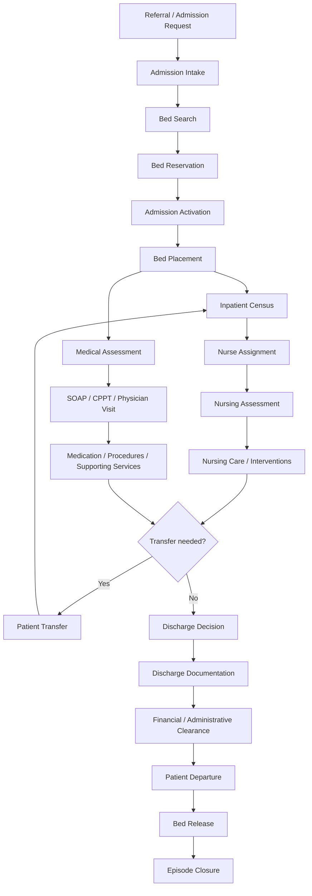

# PRD FINAL — Rawat Inap

**Quilvian Hospital Information System**  
**Module:** Rawat Inap (`InPatientManagement`)  
**Document ID:** `PRD-RWI-FINAL-001`  
**Version:** `1.0.0`  
**Date:** 2026-09-01  
**Status:** `FINAL_REQUIREMENTS_BASELINE`  
**Requirement Coverage:** **28/28 capabilities = 100%**  
**Implementation completion:** Tidak dinyatakan oleh status PRD ini. Status implementasi harus dinilai terpisah terhadap source code aktif.  

---

## 1. Executive Summary

PRD ini mendefinisikan target akhir Module **Rawat Inap** ketika seluruh capability pada `PETA MODUL RAWAT INAP` telah tercakup secara end-to-end. Scope dimulai sejak terdapat keputusan pasien membutuhkan perawatan inap dan berakhir ketika episode ditutup, pasien tidak lagi menempati tempat tidur, serta seluruh histori klinis, operasional, dan administratif tetap dapat ditelusuri.

Target journey adalah:

`Referral → Admission → Bed Placement → Inpatient Census → Nurse Assignment → Nursing Assessment → Nursing Care → Physician Clinical Care → Medication / Supporting Services → Patient Transfer bila diperlukan → Discharge Decision → Discharge Documentation → Financial Clearance → Patient Departure → Bed Release → Episode Closure`

PRD ini menggunakan **canonical English process terminology** dari module analysis apabila istilah Inggris tersedia. Nama menu/surface existing aplikasi tetap ditulis **verbatim** hanya ketika merujuk navigation atau evidence existing. Contoh: capability disebut **Nursing Assessment**, sedangkan existing surface tetap ditulis `Rawat Inap > Pengkajian Pasien`.

PRD ini mencakup seluruh `CAP-001` sampai `CAP-028`. Capability yang engine utamanya dimiliki module lain tetap berada di scope sebagai **cross-module contract**, sehingga Rawat Inap tidak menduplikasi Pharmacy, Billing, Laboratory, Radiology, Operating Room, Nutrition, atau Registration.

---

## 2. Document Authority, Evidence, and Interpretation

### 2.1 Primary evidence

Dokumen ini disusun dari:

1. `PETA MODUL RAWAT INAP` — capability registry `CAP-001` s.d. `CAP-028`, module decomposition, dependency map, dan analysis units.
2. `Rawat Inap — Interview Decisions` — keputusan lifecycle episode, bed reservation, transfer, cancellation, financial clearance, discharge modes, newborn, dan production gates.
3. Current code audit terhadap Backend `NewQuilvianSystemBackend` branch `MHamzah` dan Frontend `QuilvianSystemFrontendDev` branch `HamzahV2` yang dilakukan sebelum PRD ini.
4. Screenshot existing workflow yang diberikan pengguna:
   - `Surat Pengantar Rawat Inap` pada area `Admisi`;
   - `Pengkajian Pasien` pada workspace perawat;
   - `Dokter > Rawat Inap` dengan SOAP, CPPT, KAJIAN PASIEN, RESEP, TINDAKAN, RESUME MEDIS, VISIT, dan PENUNJANG MEDIS.

### 2.2 Priority of interpretation

Jika terjadi perbedaan antar-evidence, urutan interpretasi adalah:

1. keputusan pengguna terbaru;
2. keputusan product/interview yang telah dikunci;
3. module mapping/capability registry;
4. current implementation;
5. legacy implementation/reference UI.

Current code **tidak membatasi target PRD**. Jika target requirement belum ada di source, requirement tetap berlaku dan menjadi implementation gap.

### 2.3 Meaning of “FINAL 100%”

`FINAL 100%` pada dokumen ini berarti:

- 28/28 capability mempunyai target outcome;
- 28/28 capability mempunyai business rule dan acceptance outcome;
- ownership dan integration boundary ditentukan;
- state machine utama ditentukan;
- role/authority utama ditentukan;
- exception path utama ditentukan;
- UAT dan Definition of Done ditentukan.

Status tersebut **bukan** pernyataan bahwa code saat ini sudah 100% dan **bukan** izin produksi untuk policy klinis/privacy yang masih membutuhkan owner governance.

---

## 3. Canonical Terminology

### 3.1 Naming rule

| Layer | Rule | Example |
|---|---|---|
| Module | Gunakan nama module proyek | `Rawat Inap` |
| Canonical process | Gunakan English term dari analysis | `Nursing Assessment` |
| Existing navigation | Pertahankan verbatim | `Pengkajian Pasien` |
| Functional object | Gunakan English | `Inpatient Episode`, `Bed Reservation` |
| Explanatory prose | Bahasa Indonesia diperbolehkan | Penjelasan requirement |

### 3.2 Canonical process names

- Referral & Waiting List
- Admission Intake
- Bed Management
- Admission Activation
- Admission Documents
- Inpatient Census
- Patient Documents
- Financial Preparation
- Nurse Assignment
- Nursing Assessment
- Nursing Care
- Nursing Interventions
- Supporting Services
- Equipment Usage
- Patient Transfer
- Surgical Handoff
- Charge Review
- Clinical Documentation — SOAP
- Clinical Documentation — CPPT
- Medical Assessment
- Medication Management
- Physician Procedures
- Physician Visit
- Discharge Documentation
- Nutrition Care
- Episode Closure

Istilah canonical di atas harus digunakan pada product requirement, API contract, acceptance criteria, backlog, dan dokumentasi target. Label existing UI dapat tetap berbahasa Indonesia sampai ada keputusan eksplisit untuk rename.

---

## 4. Product Vision

Menyediakan satu journey Rawat Inap yang aman, auditable, dan konsisten sehingga pasien dapat bergerak dari keputusan masuk rawat inap sampai episode selesai tanpa petugas mengubah database secara manual dan tanpa masing-masing profesi membentuk konteks pasien sendiri.

Semua transaksi harus bertemu pada anchor yang sama:

`Patient → Encounter → Inpatient Episode`

Kemudian seluruh lokasi, clinical record, medication order, supporting order, financial state, discharge record, dan closure harus dapat ditelusuri kembali ke anchor tersebut.

---

## 5. Goals

1. Menjamin satu episode mempunyai identitas, lifecycle, lokasi, dan ownership yang jelas.
2. Mencegah double booking/double occupancy bed melalui reservation dan transactional placement.
3. Memberikan census pasien aktif yang dapat dipercaya seluruh unit.
4. Menyediakan Nursing Assessment dan Nursing Care yang terhubung dengan episode aktif.
5. Menyediakan Physician Clinical Care tanpa ketergantungan pada queue Rawat Jalan atau active IGD visit.
6. Menghubungkan Prescription, Supporting Services, Surgery, Nutrition, dan Billing melalui contract yang jelas tanpa duplicate engine.
7. Menyediakan Patient Transfer yang atomik dan auditable.
8. Memisahkan Discharge Decision, Patient Departure, Bed Release, dan Episode Closure.
9. Menyediakan audit trail untuk clinical, operational, financial exception, cancellation, transfer, dan correction.
10. Menutup 28/28 capability module mapping.

---

## 6. Non-Goals / Ownership Boundary

Rawat Inap **tidak** mengambil alih internal engine module berikut:

- Pharmacy dispensing, stock movement, medication review, compounding;
- Laboratory specimen lifecycle dan result validation;
- Radiology acquisition/reporting workflow;
- Operating Room scheduling/internal surgery workflow;
- Nutrition production/distribution workflow;
- Billing ledger, invoice, payment, insurance claim engine;
- Master Patient, Master Bed/Room/Service Unit, atau identity/authentication engine.

Rawat Inap tetap wajib menyediakan konteks, handoff, status visibility, dan integration contract untuk capability terkait.

---

## 7. Actors and Responsibility

| Actor | Primary responsibility |
|---|---|
| Admission Officer | Referral processing, Admission Intake, episode preparation, closure execution sesuai authority |
| Bed Management Officer | Bed search, reservation, placement coordination |
| Nurse | Nursing Assessment, Nursing Interventions, monitoring, transfer sesuai authority |
| Head Nurse / Nurse Supervisor | Nurse Assignment, supervision, selected transfer/cancellation authority |
| Physician | Medical Assessment, SOAP/CPPT, prescription, procedures, visit |
| DPJP | Clinical responsibility, Discharge Decision, clinical transfer authority untuk pasiennya |
| Consulting Physician | Clinical contribution sesuai assignment/authorization |
| Pharmacist | Pharmacy review, dispensing, fulfillment status |
| Supporting Service Staff | Processing of Laboratory/Radiology/other supporting orders |
| Nutritionist | Nutrition Care setelah referral/order |
| Billing Officer | Financial Preparation, Charge Review source, Financial Clearance |
| Inpatient Supervisor | Override/correction/exception sesuai policy |
| System Administrator | Configuration non-clinical, tidak boleh membuat occupancy pasien secara manual melalui master data |

### 7.1 Authorization principles

1. Read access tidak otomatis memberikan write access.
2. Cross-workspace access tidak boleh menjadi role bypass.
3. Clinical record hanya dapat dibuat/diubah oleh profession/role yang mempunyai authority.
4. Finalized clinical record tidak boleh dihapus; koreksi memakai amendment/correction trail.
5. Sensitive override wajib menyimpan actor, time, reason, dan before/after state.

---

## 8. Existing Navigation and Target Workspace Mapping

Nama existing berikut dipertahankan verbatim sebagai evidence/navigation reference.

| Existing menu/surface | Canonical target responsibility |
|---|---|
| `Admisi > Daftar Tunggu Pasien Ranap` | Referral & Waiting List |
| `Admisi > Pendaftaran Pasien Ranap` | Admission Intake, Bed Management, Admission Activation |
| `Admisi > Daftar Pasien Ranap` | Inpatient Census, Patient Documents, Financial Preparation |
| `Rawat Inap > Kepala Perawat` | Nurse Assignment |
| `Rawat Inap > Pengkajian Pasien` | Nursing Assessment, Nursing Care, Nursing Interventions, Supporting Services, Equipment Usage, Patient Transfer, Surgical Handoff, Charge Review |
| `Dokter > Rawat Inap` | Medical Assessment, SOAP, CPPT, Medication Management, Physician Procedures, Physician Visit, Supporting Services, Discharge Documentation |
| `Farmasi > Resep > Rawat Inap` | Pharmacy handoff/fulfillment for Medication Management |

### 8.1 Nursing Workspace target

Existing tabs/surfaces yang terlihat pada screenshot dipetakan sebagai berikut:

| Existing label | Canonical target |
|---|---|
| `KAJIAN UMUM` | General Assessment |
| `RESIKO JATUH` | Fall Risk Assessment |
| `MONITORING NYERI` | Pain Assessment & Reassessment |
| `ASSESMENT EDUKASI` | Education Assessment |
| `PENGAWASAN HARIAN PASIEN` | Daily Reassessment |
| `EVALUASI AWAL` | Initial Evaluation |
| `PERENCANAAN PULANG` | Discharge Planning |
| `ASUHAN KEPERAWATAN` | Nursing Care |
| `TINDAKAN` | Nursing Interventions |
| `PENUNJANG MEDIS` | Supporting Services |
| `PEMAKAIAN ALAT` | Equipment Usage |
| `TRANSFER PASIEN` | Patient Transfer |
| `PEMESANAN RUANGAN BEDAH` | Surgical Handoff |
| `TAGIHAN PASIEN` | Charge Review |

### 8.2 Physician Workspace target

| Existing label | Canonical target |
|---|---|
| `KAJIAN PASIEN` | Medical Assessment |
| `SOAP` | Clinical Documentation — SOAP |
| `CPPT` | Clinical Documentation — CPPT |
| `RESEP` | Medication Management |
| `TINDAKAN` | Physician Procedures |
| `VISIT` | Physician Visit |
| `PENUNJANG MEDIS` | Supporting Services |
| `RESUME MEDIS` | Discharge Documentation |

---

## 9. End-to-End Inpatient Journey



### 9.1 Invariants

- Satu episode terhubung ke tepat satu encounter.
- Satu encounter tidak boleh mempunyai dua episode Rawat Inap aktif yang sama.
- Satu bed tidak boleh mempunyai lebih dari satu active reservation dan tidak boleh mempunyai lebih dari satu active placement.
- Episode `Admitted` harus mempunyai active placement.
- Transfer tidak boleh menghasilkan state sementara “pasien tanpa bed”.
- Clinical documentation tidak boleh bergantung pada queue Rawat Jalan atau active IGD visit jika Inpatient Episode valid.
- `Closed` bersifat terminal secara operasional; correction tidak mengaktifkan occupancy kembali.

---

## 10. Capability Registry — 100% Scope

| CAP | Canonical Process | Target capability | Target ownership |
|---|---|---|---|
| CAP-001 | Referral & Waiting List | Admission referral/surat pengantar dan calon pasien | Rawat Inap / Admisi |
| CAP-002 | Admission Intake | Patient selection/creation | Rawat Inap + Registration |
| CAP-003 | Admission Intake | Guarantor/payment context | Rawat Inap + Insurance/Billing |
| CAP-004 | Admission Intake | DPJP assignment | Rawat Inap |
| CAP-005 | Bed Management | Search availability and select bed | Rawat Inap + Master Data |
| CAP-006 | Admission Activation | Reserve/confirm/place/activate episode | Rawat Inap |
| CAP-007 | Admission Documents | Consent/card/wristband/label output | Rawat Inap / Patient Documents |
| CAP-008 | Inpatient Census | Active patient census | Rawat Inap |
| CAP-009 | Patient Documents | Consent/handover/education/privacy documents | Rawat Inap + Clinical/Document |
| CAP-010 | Financial Preparation | Deposit/estimate/benefit context | Billing-owned integration |
| CAP-011 | Nurse Assignment | Nurse ownership/delegation | Rawat Inap |
| CAP-012 | Nursing Assessment | Initial/reassessment clinical nursing assessment | Clinical + Rawat Inap workspace |
| CAP-013 | Nursing Care | Nursing diagnosis/care plan/evaluation | Clinical + Rawat Inap workspace |
| CAP-014 | Nursing Interventions | Nursing actions and notes | Clinical + Rawat Inap workspace |
| CAP-015 | Supporting Services | Order/status/result access | Lab/Radiology-owned integration |
| CAP-016 | Equipment Usage | Patient equipment usage | Rawat Inap + Inventory/Billing integration |
| CAP-017 | Patient Transfer | Room/bed/class transfer | Rawat Inap |
| CAP-018 | Surgical Handoff | Operating room request/handoff | OperatingRoomManagement integration |
| CAP-019 | Charge Review | Running charge visibility | Billing-owned integration |
| CAP-020 | Clinical Documentation — SOAP | SOAP documentation | Clinical + Physician workspace |
| CAP-021 | Clinical Documentation — CPPT | Integrated progress notes | Clinical + Physician/Nursing workspace |
| CAP-022 | Medical Assessment | Initial medical assessment | Clinical + Physician workspace |
| CAP-023 | Medication Management | Prescription/handoff/status | Pharmacy-owned fulfillment integration |
| CAP-024 | Physician Procedures | Physician procedure documentation | Clinical + Billing integration |
| CAP-025 | Physician Visit | Explicit physician visit event | Clinical + Physician workspace |
| CAP-026 | Discharge Documentation | Medical/discharge summary | Clinical + Rawat Inap |
| CAP-027 | Nutrition Care | Nutrition referral/assessment status | Nutrition-owned integration |
| CAP-028 | Episode Closure | departure, bed release, closure | Rawat Inap + Billing |

---

# PART II — FUNCTIONAL REQUIREMENTS

## 11. Domain 01 — Referral & Waiting List

### CAP-001 — Referral & Waiting List

**Purpose**  
Merekam keputusan bahwa pasien membutuhkan Rawat Inap sebelum Admission Activation dan menjaga traceability dari source visit/referral sampai episode yang akhirnya terbentuk.

**Primary actors:** Physician, Admission Officer.  
**Existing surface:** `Admisi > Daftar Tunggu Pasien Ranap`, `Surat Pengantar Rawat Inap`.

### Requirements

1. Sistem harus dapat membuat Admission Referral dari Rawat Jalan, IGD, external referral, atau direct admission workflow yang authorized.
2. Referral harus mereferensikan Patient dan source Encounter bila tersedia.
3. Referral minimal menyimpan referring physician/source unit, indication, working diagnosis bila tersedia, target service/unit, requested class/bed requirements bila ada, priority, created time, validity, dan status.
4. Referral tidak membuat Inpatient Episode secara otomatis sampai Admission Intake/Activation dilakukan.
5. Waiting List hanya merepresentasikan calon admission yang belum dapat/ belum siap diaktivasi; data pasien tidak boleh diduplikasi.
6. Referral yang dikonsumsi oleh admission harus menyimpan link ke encounter/episode target.
7. Expired atau Cancelled referral tidak dihapus dari histori.
8. `Completed/Consumed` harus berasal dari keberhasilan admission, bukan sekadar tombol manual tanpa episode target.

### State

`Draft → Active → Waiting / Ready → Consumed`

Alternate terminal state: `Cancelled`, `Expired`.

### Acceptance Criteria

- **AC-CAP001-01:** Given Active referral, when admission berhasil dibuat, then referral menjadi `Consumed` dan menyimpan referensi episode.
- **AC-CAP001-02:** Given referral melewati validity period tanpa admission, when daftar dibaca, then referral terbaca `Expired` dan tidak dapat dikonsumsi tanpa workflow baru/revalidation.
- **AC-CAP001-03:** Cancelling referral wajib menyimpan actor, timestamp, dan reason.

---

## 12. Domain 02 — Admission Intake

### CAP-002 — Admission Intake: Patient Identification

1. Admission Officer dapat mencari pasien existing berdasarkan identifier yang tersedia.
2. Sistem harus mencegah pembuatan patient duplikat menggunakan mekanisme deduplication Registration/Patient Management.
3. Jika direct admission tidak mempunyai encounter sebelumnya, admission flow membuat encounter tipe Rawat Inap secara otomatis.
4. Setiap Inpatient Episode harus menempel pada tepat satu Encounter.
5. Newborn rooming-in mempunyai Patient, Encounter, dan Inpatient Episode sendiri; relasi ibu-bayi disimpan terpisah.

**Acceptance Criteria**

- **AC-CAP002-01:** Episode tidak dapat disimpan tanpa Encounter.
- **AC-CAP002-02:** Direct admission menghasilkan Encounter dan Episode dalam satu user journey tanpa form registrasi kedua.
- **AC-CAP002-03:** Newborn tidak memakai episode ibu.

### CAP-003 — Admission Intake: Guarantor & Payment Context

1. Admission harus menyimpan snapshot/reference guarantor/payment context yang berlaku saat masuk.
2. Perubahan guarantor setelah admission harus auditable dan tidak menghapus histori sebelumnya.
3. Eligibility engine tetap dimiliki Insurance/Billing; Rawat Inap membaca hasilnya.
4. Clinical documentation tidak boleh ditahan hanya karena Financial Preparation belum selesai, kecuali tindakan spesifik memang mempunyai policy terpisah.

**Acceptance Criteria**

- **AC-CAP003-01:** Admission tidak dapat diaktivasi bila mandatory guarantor/payment context menurut konfigurasi belum tersedia.
- **AC-CAP003-02:** Perubahan guarantor menghasilkan history actor/time/old/new value.

### CAP-004 — Admission Intake: DPJP Assignment

1. Admission harus menetapkan DPJP atau jalur assignment yang disetujui sebelum episode masuk operational census.
2. DPJP assignment mempunyai start time, end time, actor, dan reason untuk setiap perubahan.
3. Physician workspace harus membedakan DPJP, consulting physician, dan physician lain sesuai authority.
4. Penggantian DPJP tidak mengubah histori clinical documentation sebelumnya.

**Acceptance Criteria**

- **AC-CAP004-01:** Census menampilkan current DPJP yang sama dengan active assignment.
- **AC-CAP004-02:** Setelah DPJP diganti, entry lama tetap menunjuk physician author aslinya.

---

## 13. Domain 03 — Bed Management & Admission Activation

### CAP-005 — Bed Management

**Target state:** `Available → Reserved → Occupied → Available`, dengan non-patient states seperti `Maintenance/Inactive` tetap dikelola Master Data.

1. Search bed harus mendukung room, service unit, class, availability, active state, isolation/gender/newborn attribute yang tersedia pada master.
2. Satu bed hanya boleh mempunyai satu active reservation.
3. Reservation mengunci bed terhadap admission lain.
4. Reservation default berlaku **120 menit** sesuai keputusan existing, dan nilainya harus configurable.
5. Expiration dihitung saat read/validation; tidak wajib background scheduler.
6. Saat activation dilakukan, bed availability harus diperiksa ulang.
7. Jika reservation telah expired tetapi bed tetap Available, activation boleh melanjutkan sesuai validation terbaru.
8. Jika bed sudah diambil episode lain, activation ditolak tanpa menghilangkan isian admission.
9. Occupancy status pasien tidak boleh diedit langsung melalui Master Bed screen.
10. Isolation/gender policy harus didukung sebagai configurable placement policy. Sampai Clinical Governance dan Privacy Owner menyetujui rule final, sistem tidak boleh mengklaim policy tersebut production-approved.

**Acceptance Criteria**

- **AC-CAP005-01:** Dua admission mencoba reserve bed yang sama; hanya satu berhasil.
- **AC-CAP005-02:** Bed `Reserved` tidak muncul sebagai available untuk admission lain.
- **AC-CAP005-03:** Expired reservation kembali terbaca available jika tidak ada active placement/reservation lain.
- **AC-CAP005-04:** Admin tidak dapat mengubah master bed langsung menjadi `Occupied` untuk merepresentasikan pasien.

### CAP-006 — Admission Activation

1. Episode status canonical: `Draft`, `Admitted`, `DischargePending`, `Closed`, `Cancelled`.
2. `InCare` tidak digunakan sebagai state.
3. `Draft` merepresentasikan admission preparation dan dapat memiliki active Bed Reservation.
4. Activation harus mengubah reservation/placement dan episode secara transactional.
5. Setelah `Admitted`, episode muncul di Inpatient Census.
6. Clinical record dapat dibuat pada active inpatient context tanpa menunggu synthetic `InCare` state.
7. Cancellation:
   - `Draft`: creator Admission Officer dapat cancel dengan reason;
   - `Admitted` tanpa clinical record: Head Nurse/Supervisor dapat cancel dengan reason;
   - `Admitted` dengan clinical record: cancel ditolak dan episode harus diselesaikan melalui closure flow;
   - `DischargePending`/`Closed`: cancel ditolak.
8. Cancellation dan bed release harus satu transaksi.
9. Clinical record yang memblokir cancellation minimal mencakup Nursing Assessment, Nursing Interventions/notes, CPPT, Prescription, Physician Procedures, dan Vital Sign.
10. Newborn rooming-in mendapat episode dan bed/bassinet sendiri serta optional relation ke maternal episode.

**Acceptance Criteria**

- **AC-CAP006-01:** Activation sukses menghasilkan `Admitted` + exactly one active placement.
- **AC-CAP006-02:** Cancellation setelah ada satu clinical record ditolak.
- **AC-CAP006-03:** Cancel `Draft` mengembalikan Reserved bed ke Available dalam transaksi yang sama.
- **AC-CAP006-04:** Episode `Admitted` tidak pernah terbaca tanpa active placement kecuali setelah explicit Patient Departure rule yang memang mengakhiri occupancy.

---

## 14. Domain 04 — Admission Documents, Census, and Financial Preparation

### CAP-007 — Admission Documents

1. Sistem harus mendukung generation/printing untuk document/identity output yang dipilih rumah sakit, termasuk consent output, patient card, wristband, dan label sesuai konfigurasi.
2. Printed/generated artifact harus mempunyai patient/encounter/episode context.
3. Reprint harus auditable dan tidak membuat episode baru.
4. Barcode/identifier pada wristband/label harus resolve ke patient/encounter yang benar.

**Acceptance Criteria**

- **AC-CAP007-01:** Wristband/label yang dicetak untuk episode A tidak dapat resolve ke patient B.
- **AC-CAP007-02:** Reprint meninggalkan audit actor/time/reason bila policy mewajibkan.

### CAP-008 — Inpatient Census

1. Census menampilkan episode `Admitted` dan `DischargePending` yang masih relevan secara operational.
2. Minimal menampilkan Patient, MR number, service unit, room, bed, class, admission time, current DPJP, current nurse assignment, guarantor, isolation indicator, assessment status, discharge status.
3. Filter minimal: unit, room, class, DPJP, nurse, admission date, assessment completion, discharge pending, isolation.
4. Census harus dihitung dari source-of-truth episode/placement/assignment, bukan duplicated “InCare” flag.
5. Clinical LOS dan Billing Day Count dipisahkan:
   - **Clinical LOS:** elapsed time dari admission/arrival sampai departure/now;
   - **Billing Day Count:** ditentukan Billing dan hanya ditampilkan bila tersedia.

**Acceptance Criteria**

- **AC-CAP008-01:** Pasien yang activation selesai langsung muncul pada census tanpa manual refresh database.
- **AC-CAP008-02:** Transfer sukses mengubah current room/bed tetapi histori lokasi tetap ada.
- **AC-CAP008-03:** Filter “Nursing Assessment incomplete” berasal dari record assessment, bukan episode status baru.

### CAP-009 — Patient Documents

1. Patient Documents dapat mencakup General Consent, handover, education, privacy, IPD, belief/value documentation, sesuai document type yang diaktifkan.
2. Setiap document mempunyai signer/author, timestamp, status, dan episode context.
3. Handover harus dapat mereferensikan source/target unit atau responsible professional bila digunakan pada transfer.
4. Document final tidak boleh dihapus; koreksi melalui amendment/versioning.
5. Generic Patient Consent boleh direuse jika semantic document type, signer, attachment, status, dan audit memenuhi kebutuhan.

**Acceptance Criteria**

- **AC-CAP009-01:** Consent dari episode lama tidak dianggap consent episode baru kecuali policy eksplisit memperbolehkan reuse.
- **AC-CAP009-02:** Final document mempunyai immutable author/signing audit.

### CAP-010 — Financial Preparation

1. Rawat Inap dapat meminta/menampilkan deposit, estimate, guarantor benefit, dan cost difference dari Billing/Insurance.
2. Nilai finansial tidak dihitung ulang oleh Rawat Inap jika Billing menjadi system of record.
3. Financial Preparation status dapat ditampilkan sejak pre-admission/admission.
4. Failure Billing tidak boleh menghilangkan clinical/operational episode data.

**Acceptance Criteria**

- **AC-CAP010-01:** Estimate berubah di Billing dan nilai terbaru dapat dibaca Rawat Inap tanpa membuat duplicate ledger.
- **AC-CAP010-02:** Billing unavailable menghasilkan integration error/status, bukan penghapusan admission.

---

## 15. Domain 05 — Nurse Assignment

### CAP-011 — Nurse Assignment

1. Episode aktif dapat mempunyai current responsible nurse sesuai unit/shift policy.
2. Assignment menyimpan start/end time, assigner, nurse, role, unit, reason bila reassignment.
3. Reassignment menutup assignment lama, tidak overwrite.
4. Head Nurse dapat melihat unassigned episode dan current workload.
5. Delegation hanya memberi scope yang diperlukan dan mempunyai waktu berlaku.
6. Nursing Workspace write access harus memvalidasi user authority terhadap episode.

**Acceptance Criteria**

- **AC-CAP011-01:** Episode tanpa nurse muncul pada monitoring/census filter.
- **AC-CAP011-02:** Reassignment mempertahankan history lama.
- **AC-CAP011-03:** User tanpa clinical authority tidak dapat menulis Nursing Assessment hanya karena dapat membuka patient detail.

---## 16. Domain 06 — Nursing Assessment

### CAP-012 — Nursing Assessment

**Existing surface:** `Rawat Inap > Pengkajian Pasien`.  
**Canonical term:** **Nursing Assessment**.

Nursing Assessment adalah clinical record awal dan longitudinal perawat terhadap pasien selama Inpatient Episode. Ia **bukan** sekadar status atau satu textarea dan tidak boleh disamakan dengan Nursing Interventions.

### 16.1 Target structure

Nursing Assessment minimal mendukung section/capability berikut:

- General Assessment;
- Fall Risk Assessment;
- Pain Assessment;
- Pain Reassessment / Monitoring;
- Nutrition Screening;
- Dependency Assessment;
- Education Assessment;
- Daily Reassessment;
- Initial Evaluation;
- Discharge Planning Assessment;
- Assessment Status;
- Finalization/Sign-off;
- Amendment History.

Existing labels seperti `KAJIAN UMUM`, `RESIKO JATUH`, `MONITORING NYERI`, `ASSESMENT EDUKASI`, `PENGAWASAN HARIAN PASIEN`, `EVALUASI AWAL`, dan `PERENCANAAN PULANG` boleh tetap dipertahankan pada UI existing, tetapi requirement/business object menggunakan canonical English terms di atas.

### 16.2 Requirements

1. Nursing Assessment harus terikat ke Patient + Encounter + Inpatient Episode.
2. Nursing Assessment **tidak boleh membutuhkan QueueId Rawat Jalan atau active IGD visit** jika Inpatient Episode valid.
3. Initial Nursing Assessment dan Reassessment harus menjadi record terpisah; reassessment tidak overwrite initial assessment.
4. General Assessment minimal mampu menyimpan source of information, chief/current complaint context, health history, general condition, consciousness, vital context/reference, functional/dependency findings, nutrition, education need, dan clinical conclusion sesuai form rumah sakit.
5. Fall Risk harus menyimpan score/result, category, assessment time, assessor, dan intervention trigger/reference bila applicable.
6. Pain record harus longitudinal sehingga trend dapat dibaca; nilai lama tidak boleh ditimpa.
7. Nutrition Screening harus dapat menghasilkan referral trigger ke Nutrition Care tanpa menjadikan nurse sebagai owner professional nutrition assessment.
8. Education Assessment harus membedakan need identification dengan education delivery record bila keduanya digunakan.
9. Discharge Planning dapat dimulai sejak admission dan tidak menunggu Discharge Decision.
10. Assessment status harus diturunkan dari record aktual, misalnya `NotStarted`, `Draft`, `Completed`, `Amended`; bukan dari episode state `InCare`.
11. Clinical SLA harus configurable oleh Clinical Governance. PRD tidak hard-code angka yang belum disetujui; sistem wajib dapat memonitor `DueAt`, `CompletedAt`, dan overdue state berdasarkan konfigurasi aktif.
12. Finalized assessment tidak boleh hard-delete atau silent overwrite.
13. Amendment wajib menyimpan actor, time, reason, dan perubahan.

### 16.3 Main flow

`Admitted → Nurse Assignment/Authority → Initial Nursing Assessment → Risk/Need Identification → Nursing Care / Intervention → Daily Reassessment → Evaluation → Discharge Planning`

Dokter tidak perlu menunggu Initial Nursing Assessment selesai untuk menulis instruksi/resep pada episode yang valid.

### 16.4 Acceptance Criteria

- **AC-CAP012-01:** Given valid `Admitted` episode, nurse authorized dapat membuat Nursing Assessment tanpa QueueId/active IGD visit.
- **AC-CAP012-02:** Pain reassessment kedua tidak mengubah nilai pain assessment pertama dan timeline menampilkan keduanya.
- **AC-CAP012-03:** Completed assessment menghasilkan status `Completed` pada census/workspace tanpa menambah episode state baru.
- **AC-CAP012-04:** Overdue monitoring mengikuti policy configuration yang aktif.
- **AC-CAP012-05:** Amendment terhadap finalized assessment mempertahankan original record/version.

---

## 17. Domain 07 — Nursing Care, Nursing Interventions, and Equipment Usage

### CAP-013 — Nursing Care

1. Nursing Care harus dapat diturunkan dari finding/problem pada Nursing Assessment.
2. Sistem harus mendukung nursing problem/diagnosis, goal/outcome, planned intervention, evaluation, dan status lifecycle.
3. Jika terminology SDKI/SLKI/SIKI digunakan rumah sakit, catalog/reference harus dikelola sebagai clinical terminology/master yang versioned, bukan free text tunggal.
4. Nurse dapat menambahkan individualized note tanpa menghapus structured plan.
5. Nursing Care Plan harus dapat diperbarui berdasarkan Reassessment dengan history.
6. Closing Nursing Care item tidak boleh menghapus action/evaluation sebelumnya.

**Acceptance Criteria**

- **AC-CAP013-01:** Problem dari Nursing Assessment dapat dikaitkan ke Nursing Care Plan.
- **AC-CAP013-02:** Perubahan plan menghasilkan history dan tidak mengubah author/timestamp versi sebelumnya.
- **AC-CAP013-03:** Episode closure mempertahankan seluruh Nursing Care history read-only.

### CAP-014 — Nursing Interventions

1. Nursing Interventions mencatat tindakan/aktivitas perawat yang benar-benar dilakukan.
2. Record minimal menyimpan action, performed time, performer, result/note, dan episode context.
3. Planned intervention dari Nursing Care dapat menjadi referensi tetapi bukan syarat untuk setiap ad-hoc clinically necessary intervention.
4. Nursing note dan intervention dapat tampil di clinical timeline/CPPT sesuai policy.
5. Billable intervention mengirim charge trigger/idempotency key ke Billing; kegagalan billing tidak boleh menghilangkan clinical record.

**Acceptance Criteria**

- **AC-CAP014-01:** Satu intervention tersimpan sekali walaupun request retry dengan idempotency key yang sama.
- **AC-CAP014-02:** Nursing record tetap committed ketika downstream Billing gagal, dengan integration retry/error state terpisah.
- **AC-CAP014-03:** User yang bukan author/supervisor tidak dapat silent-edit finalized nursing note.

### CAP-016 — Equipment Usage

1. Sistem dapat mencatat equipment/device yang digunakan pasien, start time, end time, quantity/unit bila relevan, responsible staff, dan episode.
2. Equipment Usage harus dapat berintegrasi dengan inventory/asset/billing tanpa menduplikasi master equipment.
3. Active equipment usage dapat dibawa saat Patient Transfer atau ditutup/handed over sesuai jenis alat.
4. Billable usage harus memiliki correlation/idempotency key.

**Acceptance Criteria**

- **AC-CAP016-01:** Usage history tetap menunjukkan durasi/actor setelah episode closed.
- **AC-CAP016-02:** Transfer tidak menghilangkan active equipment record.

---

## 18. Domain 08 — Supporting Services, Patient Transfer, Surgical Handoff, Charge Review

### CAP-015 — Supporting Services

**Target:** Rawat Inap menyediakan clinical context untuk order dan result access; Laboratory/Radiology/Supporting module tetap owner processing internal.

1. Physician/authorized professional dapat membuat order dari active inpatient context.
2. Order harus membawa PatientId, EncounterId, InpatientEpisodeId/correlation context, ordering professional, order time, service items, priority, dan clinical indication jika required.
3. Rawat Inap dapat membaca status order dan verified result sesuai permission.
4. Result final berasal dari owning module dan tidak diedit ulang di Rawat Inap.
5. Cancellation order mengikuti contract owning module dan meninggalkan audit.
6. Charge generation berasal dari owning module/Billing contract, bukan UI Rawat Inap menghitung sendiri.

**Acceptance Criteria**

- **AC-CAP015-01:** Order yang dibuat dari episode A tidak dapat diproses sebagai milik episode B.
- **AC-CAP015-02:** Verified Laboratory/Radiology result dapat dibaca dari Physician Workspace tanpa duplicate result row yang menjadi source of truth baru.

### CAP-017 — Patient Transfer

1. Transfer memindahkan patient location dalam episode yang sama; tidak membuat episode baru.
2. Source placement dan destination placement berubah sebagai **satu transaksi atomik**.
3. Kegagalan di tengah transfer harus meninggalkan patient di source bed dan destination bed tetap available, tanpa transfer history palsu.
4. Transfer dapat mengubah room, bed, service unit, dan class sesuai destination.
5. Billing class/time segment mengikuti actual occupied room/class sejak effective transfer time; historical class tetap ada.
6. Transfer history minimal menyimpan source, destination, old/new class, requested/effective time, actor, reason, dan authority context.
7. Head Nurse, authorized Nurse, Supervisor dapat melakukan transfer sesuai policy existing. DPJP dapat menginisiasi/menyetujui transfer dalam tanggung jawab klinisnya.
8. Destination readiness boleh direkam sebagai advisory/clinical consideration tetapi **tidak membuat acceptance workflow wajib** sampai ada keputusan berbeda; hal ini mempertahankan one-step transfer sambil memberi ruang DPJP mencatat readiness consideration.
9. Handover document/reference dapat menjadi bagian transfer sesuai Patient Documents policy.
10. Transfer ke bed yang sudah occupied/reserved oleh episode lain harus ditolak secara concurrency-safe.

**Acceptance Criteria**

- **AC-CAP017-01:** Transfer sukses meninggalkan exactly one active placement pada destination dan menutup source placement.
- **AC-CAP017-02:** Transfer failure tidak menghasilkan episode tanpa bed.
- **AC-CAP017-03:** Pindah kelas menyimpan old/new class dan Billing menerima effective time.
- **AC-CAP017-04:** Admission Officer tanpa transfer authority ditolak.

### CAP-018 — Surgical Handoff

1. Inpatient clinical workspace dapat membuat Operating Room request/handoff untuk episode aktif.
2. Request membawa patient/encounter/episode context, procedure intent, responsible physician, priority, dan required clinical information.
3. OperatingRoomManagement menjadi owner schedule, room allocation, surgery lifecycle, dan surgery result.
4. Rawat Inap dapat melihat status booking/surgery yang relevan.
5. Transfer fisik pasien ke OR/recovery tetap harus dapat ditelusuri tanpa menutup Inpatient Episode kecuali business flow memang menghasilkan episode lain.

**Acceptance Criteria**

- **AC-CAP018-01:** OR request mempunyai correlation ke Inpatient Episode.
- **AC-CAP018-02:** Perubahan schedule di Operating Room terlihat di Rawat Inap tanpa duplicate schedule engine.

### CAP-019 — Charge Review

1. Rawat Inap menampilkan running charge/financial summary dari Billing sebagai read model.
2. Charge source dapat mencakup room, physician procedure, nursing intervention, medication, supporting services, surgery, equipment, nutrition, dan administration.
3. Rawat Inap tidak menjadi general ledger atau invoice engine.
4. Charge correction dilakukan pada owning source/Billing sesuai authority dan audit.
5. Clinical user tidak boleh mengubah charge hanya karena dapat membuka patient workspace.

**Acceptance Criteria**

- **AC-CAP019-01:** Charge baru di Billing tercermin di Charge Review tanpa duplicate source-of-truth.
- **AC-CAP019-02:** User klinis read-only terhadap financial charge kecuali mempunyai role finansial terpisah.

---

## 19. Domain 09 — Physician Clinical Care

### 19.1 Shared Physician Workspace Contract

Seluruh capability dokter menggunakan context yang sama:

`PatientId + EncounterId + InpatientEpisodeId + Physician/Assignment Authority`

Clinical controller/service **tidak boleh** menolak inpatient documentation hanya karena `QueueId` null atau active IGD visit tidak ada.

Workspace target:

`Medical Assessment | SOAP | CPPT | Medication Management | Physician Procedures | Physician Visit | Supporting Services | Discharge Documentation`

Patient Context Header minimal membaca source-of-truth untuk MR Number, Name, Age/Sex, Admission Time, LOS, Unit/Room/Bed, DPJP, Guarantor, Allergy, Diagnosis/Problem summary, Isolation flag, dan episode status.

### CAP-022 — Medical Assessment

Medical Assessment berbeda dari SOAP dan merepresentasikan initial/structured physician assessment.

1. Medical Assessment terikat ke active inpatient context.
2. Minimal mendukung chief complaint, history of present illness, relevant history, medication/allergy history, general/physical examination, assessment, Diagnosis/Problem List, dan Plan.
3. Finalized Medical Assessment tidak di-overwrite oleh daily SOAP.
4. Reassessment/correction mengikuti version/amendment mechanism.
5. Diagnosis/Problem List sebaiknya menjadi structured clinical object/reference, bukan hanya teks tersembunyi di SOAP.

**Acceptance Criteria**

- **AC-CAP022-01:** Physician dapat membuat Medical Assessment pada inpatient episode tanpa QueueId/active IGD visit.
- **AC-CAP022-02:** Medical Assessment dan SOAP mempunyai record/lifecycle berbeda.
- **AC-CAP022-03:** Amendment menjaga original version.

### CAP-020 — Clinical Documentation — SOAP

1. Physician dapat membuat multiple SOAP entries sepanjang episode.
2. Setiap entry menyimpan author, role, authored time, clinical time, S/O/A/P content, episode context, dan finalization status.
3. SOAP tidak boleh overwrite Medical Assessment.
4. SOAP dapat mereferensikan Diagnosis/Problem, Prescription, Procedure, atau Supporting order bila diperlukan.
5. Finalized SOAP tidak hard-delete/silent edit.

**Acceptance Criteria**

- **AC-CAP020-01:** Dua SOAP di hari berbeda tersimpan sebagai dua record timeline.
- **AC-CAP020-02:** SOAP dapat dibuat pada `Admitted` episode walaupun Initial Nursing Assessment belum selesai.
- **AC-CAP020-03:** Closed episode menolak new SOAP kecuali melalui approved correction mechanism yang tidak mengaktifkan episode kembali.

### CAP-021 — Clinical Documentation — CPPT

1. CPPT adalah integrated progress record dan tidak dianggap alias SOAP.
2. Author professional, profession/role, timestamp, content, verification/signature status, dan episode context wajib dapat ditelusuri.
3. CPPT dapat diisi profession yang diizinkan sesuai scope masing-masing.
4. Bila DPJP verification diwajibkan, system harus mendukung configurable verification SLA dan monitoring; angka policy final harus berasal dari Clinical Governance.
5. Verification tidak mengubah original author.
6. Correction setelah final/verified memakai amendment.

**Acceptance Criteria**

- **AC-CAP021-01:** CPPT physician dan nurse tampil sebagai entry terpisah dengan author/profession masing-masing.
- **AC-CAP021-02:** Verification overdue dapat dimonitor berdasarkan policy aktif.
- **AC-CAP021-03:** Verifier tidak menjadi author entry original.

### CAP-023 — Medication Management

1. Physician dapat membuat Prescription dari active inpatient context.
2. Prescription tidak boleh bergantung pada outpatient/IGD-only consultation rule; jika consultation object digunakan, consultation tersebut harus valid untuk inpatient context.
3. Prescription membawa Patient, Encounter, Inpatient Episode, prescriber, order time, medication item, dose/quantity, signa/instruction, route/frequency/duration bila applicable, dan indication/note bila required.
4. Target UI dapat mendukung existing concepts: standard prescription, compounded medication, template, history, daily prescription, medication reconciliation.
5. Pharmacy owns review, compounding, stock, dispensing, and fulfillment status.
6. Rawat Inap membaca status Pharmacy dan tidak menandai obat “dispensed” sendiri.
7. **Discharge Medication** harus menjadi order/prescription type yang eksplisit dan dapat dikaitkan dengan Discharge Documentation/clearance.
8. Retry/order submission harus idempotent.

**Acceptance Criteria**

- **AC-CAP023-01:** Valid inpatient physician dapat membuat Prescription tanpa active IGD visit.
- **AC-CAP023-02:** Pharmacy fulfillment status dapat dibaca kembali dengan prescription identifier yang sama.
- **AC-CAP023-03:** Discharge Medication dapat dibedakan dari daily inpatient medication order.

### CAP-024 — Physician Procedures

1. Physician Procedure terikat ke patient/encounter/episode dan performer.
2. Procedure dapat direferensikan ke consultation/visit jika model memerlukan, tetapi consultation tersebut harus mendukung inpatient context.
3. Procedure record harus membedakan ordered/planned dengan performed jika keduanya diperlukan.
4. Performed procedure menyimpan performed time, performer, item/procedure code, result/note, dan status.
5. Billable procedure menghasilkan charge trigger yang idempotent; clinical commit tidak boleh hilang karena billing failure.

**Acceptance Criteria**

- **AC-CAP024-01:** Procedure tidak dapat disimpan untuk patient/encounter mismatch.
- **AC-CAP024-02:** Retry tidak menghasilkan duplicate performed procedure/charge.
- **AC-CAP024-03:** Inpatient procedure tidak memerlukan IGD-only context.

### CAP-025 — Physician Visit

Physician Visit adalah explicit clinical event bahwa physician melakukan visit pada pasien; visit tidak disimpulkan hanya dari timestamp SOAP.

1. Visit minimal menyimpan VisitDateTime, Physician, role/context (DPJP/consulting/on-call bila applicable), episode, dan optional link ke SOAP/CPPT/Procedure.
2. Satu visit dapat mempunyai clinical documentation terkait tetapi tidak wajib dianggap identik dengan satu SOAP.
3. Visit harus dapat ditampilkan sebagai timeline/history.
4. Visit tidak boleh dicatat oleh user yang tidak mempunyai physician authority, kecuali explicit administrative attestation policy tersedia.
5. Duplicate visit submission harus dapat dicegah melalui request id/idempotency atau uniqueness rule yang sesuai.

**Acceptance Criteria**

- **AC-CAP025-01:** Physician Visit muncul di visit history walaupun SOAP dibuat beberapa menit kemudian.
- **AC-CAP025-02:** SOAP tanpa explicit Visit tidak otomatis menambah Visit count.
- **AC-CAP025-03:** Visit author/time/role dapat diaudit.

### CAP-026 — Discharge Documentation

1. Discharge Documentation adalah clinical summary untuk akhir episode dan berbeda dari Episode Closure.
2. Minimal dapat memuat admission reason/diagnosis, final diagnosis, significant findings, treatment/procedures, supporting results summary, condition at discharge, Discharge Medication, follow-up/control plan, education/instruction, dan responsible physician/signature sesuai policy.
3. DPJP mempunyai authority atas Discharge Decision untuk normal clinical discharge.
4. Document harus versioned; finalized version tidak silent overwrite.
5. Correction setelah closure membuat version/amendment baru tanpa mengubah operational episode state.
6. Resume history/version sebelumnya harus tetap dapat ditelusuri.
7. Discharge modes dengan exception dapat menggunakan document requirement berbeda, tetapi episode closure tetap auditable.

**Acceptance Criteria**

- **AC-CAP026-01:** Finalized Discharge Documentation menyimpan author/finalized time/version.
- **AC-CAP026-02:** Correction setelah closure tidak membuka bed atau mengubah LOS.
- **AC-CAP026-03:** Discharge Medication dan follow-up dapat ditautkan ke final discharge document.

---

## 20. Domain 10 — Nutrition Care

### CAP-027 — Nutrition Care

1. Nursing Assessment dapat menghasilkan Nutrition Screening result dan referral trigger.
2. Physician/authorized professional dapat membuat Nutrition referral/order sesuai policy.
3. Nutrition module/professional owns Nutrition Assessment dan Nutrition Care Plan.
4. Rawat Inap dapat membaca status referral, assessment summary yang boleh dibaca, dan diet/care instruction yang relevan untuk pelayanan.
5. Nutrition charge bila ada berasal dari owning module/Billing contract.

**Acceptance Criteria**

- **AC-CAP027-01:** Positive/high-risk Nutrition Screening dapat menghasilkan/referefer ke Nutrition Care tanpa duplicate patient context.
- **AC-CAP027-02:** Nutrition professional assessment tidak diedit oleh nurse/physician workspace tanpa authority.

---

## 21. Domain 11 — Discharge, Patient Departure, and Episode Closure

### 21.1 Discharge Decision

Discharge Decision adalah keputusan klinis/terminal care direction dan **bukan** Episode Closure.

Supported discharge modes minimal:

1. `Normal/Approved Discharge`;
2. `Against Medical Advice / Atas Permintaan Sendiri`;
3. `Transfer/Referral to Other Facility`;
4. `Deceased`;
5. `Left Without Notice / Kabur`.

Requirement dokumen/actor dapat berbeda per mode, tetapi seluruh mode harus menghasilkan terminal journey yang dapat melepas occupancy dan menutup episode secara terkontrol.

### CAP-028 — Episode Closure

1. Episode state utama: `Draft → Admitted → DischargePending → Closed`, dengan `Cancelled` sebagai terminal cancellation path.
2. Normal Discharge Decision mengubah episode menjadi `DischargePending`; bed masih occupied sampai Patient Departure dicatat.
3. **Patient Departure** harus dicatat sebagai event/waktu terpisah dari Episode Closure.
4. Pada Patient Departure yang valid, active bed placement berakhir dan bed dapat kembali Available meskipun administrative closure dilakukan setelahnya, sesuai target operational model terbaru.
5. Episode Closure dilakukan Admission Officer atau Supervisor sesuai authority.
6. Financial Clearance values: `Pending`, `Cleared`, `Blocked`.
7. Normal closure hanya lolos jika Financial Clearance = `Cleared` dan required administrative/clinical prerequisites terpenuhi.
8. Supervisor dapat override financial block/pending hanya dengan reason wajib; override ditandai dan masuk exception report.
9. Closure harus idempotent dan transactional terhadap terminal state/history.
10. Closed episode tidak boleh mempunyai active bed placement.
11. Closed episode tidak boleh menerima clinical/operational transaksi baru normal.
12. Correction terhadap Closed episode menggunakan Correction Session/Amendment tanpa mengubah occupancy, LOS, atau status `Closed`.
13. Cancellation tidak digunakan untuk episode yang sudah mempunyai clinical record.
14. Bed release/departure/closure event harus tetap konsisten saat discharge mode adalah deceased, transfer facility, AMA, atau left without notice.

### 21.2 Minimum closure prerequisites

Untuk normal closure, sistem minimal memeriksa:

- valid Discharge Decision;
- required Discharge Documentation/final version sesuai mode;
- required administrative checklist;
- Financial Clearance = `Cleared` atau documented Supervisor override;
- Patient Departure recorded;
- tidak ada active bed placement setelah departure;
- mandatory exception-specific data lengkap.

Policy checklist item harus configurable agar rumah sakit dapat menambah/mengubah requirement tanpa hard-code seluruh flow.

### Acceptance Criteria

- **AC-CAP028-01:** `Pending`, `Blocked`, atau absent Financial Clearance menolak normal closure.
- **AC-CAP028-02:** Supervisor override tanpa reason ditolak.
- **AC-CAP028-03:** Patient Departure mengakhiri active placement dan bed kembali available; episode dapat tetap `DischargePending` sampai administrative closure.
- **AC-CAP028-04:** Closing episode tidak menghapus history placement, transfer, assignment, clinical records, charge references, atau documents.
- **AC-CAP028-05:** Correction session pada Closed episode tidak mengubah bed availability atau LOS.
- **AC-CAP028-06:** Setiap supported discharge mode berakhir dengan no active placement dan auditable closure/terminal state.

---# PART III — SYSTEM BEHAVIOR, DATA, INTEGRATION, AND QUALITY

## 22. State Machines

### 22.1 Inpatient Episode

```text
Draft -> Admitted -> DischargePending -> Closed
  |          |
  |          +-> Cancelled  (only when no clinical record, authorized)
  +-> Cancelled
```

| State | Meaning | Bed/placement | Census |
|---|---|---|---|
| `Draft` | Admission sedang disiapkan | Reservation dapat aktif; belum occupied | Tidak |
| `Admitted` | Pasien aktif dirawat | Exactly one active placement | Ya |
| `DischargePending` | Discharge Decision sudah ada, closure belum selesai | Active placement sampai Patient Departure | Ya sampai departure/operational policy |
| `Closed` | Episode selesai | Tidak ada active placement | Tidak |
| `Cancelled` | Admission tidak jadi berjalan | Tidak ada active placement/reservation aktif | Tidak |

### 22.2 Bed Reservation

`Active → Consumed / Expired / Cancelled`

- default expiry 120 minutes;
- duration configurable;
- availability revalidated at activation;
- one bed maximum one active reservation.

### 22.3 Bed Placement

`Active → Ended`

Ended reason minimal: `Transfer`, `Departure`, `Cancellation`, `Correction/SystemRepair` sesuai controlled workflow.

### 22.4 Clinical Document

Generic target lifecycle:

`Draft → Final → Verified(optional by type) → Amended`

Document-specific policy dapat meniadakan `Verified`; original final version tetap immutable.

### 22.5 Financial Clearance

`Pending | Cleared | Blocked`

Rawat Inap membaca status dari Billing. Override closure tidak mengubah source Billing menjadi `Cleared`; override disimpan sebagai inpatient closure exception.

---

## 23. Conceptual Data Model and Source of Truth

### 23.1 Source-of-truth matrix

| Data/Object | Source of Truth |
|---|---|
| Patient | Patient/Registration Management |
| Encounter | Registration Management |
| Inpatient Episode | InPatientManagement |
| Admission Referral | InPatientManagement/Admission boundary |
| Bed/Room/Service Unit Master | Master Data |
| Bed Reservation | InPatientManagement |
| Bed Placement | InPatientManagement |
| DPJP Assignment | InPatientManagement/clinical assignment contract |
| Nurse Assignment | InPatientManagement |
| Nursing Assessment | Clinical Management, surfaced in Rawat Inap |
| Nursing Care | Clinical Management, surfaced in Rawat Inap |
| Nursing Interventions | Clinical Management, surfaced in Rawat Inap |
| Medical Assessment | Clinical Management |
| SOAP | Clinical Management |
| CPPT | Clinical Management |
| Prescription | Clinical/Pharmacy order boundary; fulfillment in Pharmacy |
| Physician Procedures | Clinical Management |
| Physician Visit | Clinical Management |
| Supporting Order | Ordering boundary; processing in owning module |
| Laboratory Result | Laboratory |
| Radiology Result | Radiology |
| Nutrition Assessment/Care | Nutrition/Gizi |
| Charge / Running Bill | Billing Management |
| Financial Clearance | Billing Management |
| Discharge Documentation | Clinical Management / Rawat Inap discharge context |
| Patient Departure | InPatientManagement |
| Episode Closure | InPatientManagement |
| Audit/Correction | Owning module + centralized audit pattern if available |

### 23.2 Required identifiers

Semua cross-module message/record yang relevan harus membawa identifier yang cukup untuk traceability, minimal kombinasi sesuai kebutuhan:

- `PatientId`
- `EncounterId`
- `InpatientEpisodeId`
- `BedReservationId`
- `BedPlacementId`
- `AssignmentId`
- `ClinicalDocumentId`
- `PrescriptionId`
- `OrderId`
- `ChargeReferenceId`
- `CorrelationId` / `IdempotencyKey`

### 23.3 Governance naming

Untuk entity operasional baru yang benar-benar dimiliki `InPatientManagement`, governance backend mengharuskan prefix **`Inp`**. PRD tidak memaksakan nama physical table tertentu; final entity/table mapping harus mengikuti existing implementation dan backend governance agar tidak membuat duplicate persistence.

---

## 24. Integration Contracts

### 24.1 Registration Management

**Input to Rawat Inap:** Patient + Encounter.  
**Contract:** setiap episode tepat satu encounter; direct admission dapat meminta Registration membuat inpatient encounter secara atomik/terkoordinasi.

Failure principle: episode tidak boleh tersimpan orphan tanpa Encounter.

### 24.2 EmergencyInstallationManagement

IGD disposition `Rawat Inap` harus menghasilkan handoff/admission context yang dapat dikonsumsi Rawat Inap tanpa menduplikasi patient/encounter.

Minimum handoff:

- patient/encounter;
- disposition decision;
- referring physician;
- source unit;
- clinical summary/priority bila tersedia;
- isolation/special requirement bila tersedia.

### 24.3 Clinical Management

Rawat Inap menggunakan Clinical Management untuk Nursing Assessment, Vital Sign, Diagnosis/Problem, Nursing/Physician Procedures, SOAP/CPPT, Patient Documents/Consent, dan clinical timeline.

**Critical contract:** valid Inpatient Episode harus menjadi accepted clinical context. Queue-based validation khusus Rawat Jalan/IGD tidak boleh memblokir inpatient flow.

### 24.4 Pharmacy Management

Request/response minimum:

- prescription/order identifiers;
- patient/encounter/episode context;
- prescriber;
- items/instructions;
- order type (`Inpatient`, `Discharge Medication`, dll.);
- Pharmacy review/fulfillment status;
- cancellation/rejection reason;
- billing/correlation reference bila applicable.

Rawat Inap tidak mengubah fulfillment status milik Pharmacy.

### 24.5 Billing Management

Rawat Inap membutuhkan dua contract utama:

1. **Charge Review** — read-only current financial summary/charge references.
2. **Financial Clearance** — `Pending`, `Cleared`, `Blocked` + time/actor/source/reference.

Billing calculation, invoice, payment, claim, ledger, dan adjustment internal bukan ownership Rawat Inap.

### 24.6 Laboratory / Radiology / Supporting Services

Contract minimum:

`Order → Accepted/Rejected → In Process → Result Available → Verified/Final`

Rawat Inap dapat menampilkan status/result yang diizinkan, tetapi result final tidak diedit ulang di Rawat Inap.

### 24.7 OperatingRoomManagement

Contract minimum:

`Surgical Request → Scheduling Status → Procedure/Surgery Status → Completion/Result Reference`

Inpatient Episode tetap hidup sepanjang handoff kecuali ada business contract eksplisit yang mengubah encounter ownership.

### 24.8 Nutrition/Gizi

Contract minimum:

`Nutrition Screening/Referral → Accepted → Nutrition Assessment → Care/Diet Instruction → Completion/Follow-up`

### 24.9 Integration reliability

Semua integration yang menghasilkan transaksi harus:

- mempunyai correlation id;
- mendukung idempotent retry;
- tidak membuat duplicate charge/order/clinical event;
- menyimpan failure state yang dapat diretry;
- tidak rollback clinical safety record hanya karena downstream financial/inventory system gagal, kecuali transaction memang harus atomic secara domain.

---

## 25. Monitoring and Operational Control

Monitoring bukan sekadar dashboard tambahan. Sistem harus menyediakan daftar pantau yang dapat ditindaklanjuti.

### 25.1 Required monitoring

1. Unassigned Nurse episode.
2. Nursing Assessment not started/incomplete/overdue berdasarkan configured SLA.
3. CPPT verification overdue jika policy aktif.
4. Isolation/placement policy mismatch berdasarkan policy yang sudah approved.
5. Pending/expired Bed Reservation.
6. Bed drift: master/derived availability tidak cocok dengan active reservation/placement.
7. Patient Transfer failure/exception.
8. `DischargePending` episode belum departure/closure melewati configured threshold.
9. Closure attempt blocked by Financial Clearance.
10. Supervisor financial override report.
11. Missing/incomplete Discharge Documentation sesuai discharge mode.
12. Prolonged stay berdasarkan configured threshold.
13. Prescription/Supporting order integration failures yang perlu retry.
14. Closed episode anomaly: masih mempunyai active placement/reservation.
15. Duplicate/overlapping assignment/location anomaly.

### 25.2 Monitoring behavior

- Monitoring warning tidak boleh diam-diam mengubah source record.
- Setiap row harus dapat membuka episode/context yang menyebabkan warning.
- Threshold numerik harus configurable bila bukan invariant.
- Operational alert dan hard validation harus dibedakan jelas.

---

## 26. RBAC and Action Authority Matrix

Legend: `R` read, `C` create, `U` update draft/authorized, `F` finalize, `O` override/correction.

| Capability | Admission | Nurse | Head Nurse | Physician | DPJP | Billing | Supervisor |
|---|---:|---:|---:|---:|---:|---:|---:|
| Referral & Waiting List | R/C/U | R | R | C/R | C/R | R | R/O |
| Admission Intake | C/U | R | R | R | R | R | O |
| Bed Reservation/Activation | C/U | R | R | R | R | R | O |
| Inpatient Census | R | R | R | R | R | R | R |
| Nurse Assignment | R | R | C/U | R | R | - | O |
| Nursing Assessment | R | C/U/F | R/O* | R | R | - | O* |
| Nursing Care/Interventions | R | C/U/F | R/O* | R | R | - | O* |
| Medical Assessment | R | R | R | C/U/F | C/U/F | - | O* |
| SOAP | R | R | R | C/U/F | C/U/F | - | O* |
| CPPT | R | C/U/F sesuai profession | R | C/U/F | C/U/F/Verify policy | - | O* |
| Prescription | R | R | R | C/U/F | C/U/F | R charge | O* |
| Physician Procedures | R | R | R | C/U/F | C/U/F | R charge | O* |
| Physician Visit | R | R | R | C | C | - | O* |
| Patient Transfer | - | C/U sesuai policy | C/U | R/initiate sesuai policy | C/U untuk tanggung jawab klinis | R | O |
| Discharge Decision | R | R | R | R | C/F | R | O sesuai exception |
| Discharge Documentation | R | R | R | C/U sesuai assignment | C/U/F | R | O* |
| Financial Clearance | R | R | R | R | R | C/U | O closure override |
| Episode Closure | C sesuai prerequisites | R | R | R | R | R | C/O |
| Closed Episode Correction | R | R | R | R | R | R | O only |

`O*` berarti correction/amendment hanya melalui controlled workflow, bukan direct overwrite.

Backend harus enforce authority; frontend hiding button bukan security boundary.

---

## 27. Audit, Amendment, and Correction

### 27.1 Mandatory audit events

Audit wajib minimal untuk:

- episode create/status transition/cancel/close;
- reservation create/cancel/expire/consume;
- placement/transfer/departure;
- DPJP/nurse assignment changes;
- clinical document finalize/verify/amend;
- prescription/procedure/order submit/cancel;
- consent/document sign/reprint jika applicable;
- financial clearance read/override relevant event;
- supervisor override;
- correction session.

### 27.2 Audit content

Minimal:

- actor/user;
- timestamp;
- action;
- object id;
- patient/encounter/episode context;
- reason untuk sensitive action;
- before/after value untuk mutable business state bila applicable;
- source application/service.

### 27.3 Closed Episode Correction

1. Correction tidak mengubah episode kembali menjadi `Admitted`.
2. Correction tidak mengubah current bed availability/placement.
3. Correction tidak menambah LOS.
4. Hanya authorized Supervisor/correction role.
5. Reason wajib.
6. Session close wajib menyimpan summary perubahan.
7. Clinical document correction tetap mengikuti clinical amendment/version rule masing-masing.

---

## 28. Non-Functional Requirements

### 28.1 Security and Privacy

- Least privilege.
- Server-side authorization.
- No cross-patient IDOR: setiap referenced object harus divalidasi terhadap patient/encounter/episode.
- Sensitive clinical/financial information hanya ditampilkan sesuai role.
- Audit record tidak boleh dapat dihapus oleh user operasional biasa.
- Signature/finalization identity tidak boleh dipalsukan dengan field user-supplied tanpa server validation.

### 28.2 Concurrency

- Bed reservation/placement/transfer wajib concurrency-safe.
- Duplicate episode per encounter/patient rules harus ditangani dengan database/domain constraint yang sesuai.
- Double submit Prescription/Procedure/Supporting order harus idempotent.

### 28.3 Reliability

- Partial downstream failure tidak boleh meninggalkan bed/episode dalam state setengah jadi.
- Transfer dan cancellation + release harus atomic.
- Integration error harus observable dan retryable.

### 28.4 Performance

Target operasional harus diuji pada volume RS besar. Minimal:

- Census/filter umum terasa interaktif dan menggunakan pagination/filter server-side bila volume besar.
- Bed Board tidak melakukan N+1 request per bed.
- Clinical timeline menggunakan pagination/lazy load untuk episode panjang.
- Search Patient/Bed tidak memuat seluruh master ke browser.

Angka SLA teknis final ditetapkan bersama SRE/infrastructure berdasarkan environment UAT/production.

### 28.5 Data Integrity

- Semua timestamp disimpan konsisten dan ditampilkan dalam timezone rumah sakit.
- Historical assignment/location/document tidak hard-delete.
- Derived status tidak diduplikasi bila dapat dihitung dari source record.
- Billing amount tidak menjadi source-of-truth kedua di Rawat Inap.

### 28.6 Usability

- Patient Context Header konsisten antar-tab.
- User tidak perlu memilih ulang patient ketika berpindah tab dalam workspace episode.
- Draft protection/autosave dapat digunakan untuk form panjang, tetapi finalization harus eksplisit dan auditable.
- Validation error menjelaskan field/business rule yang gagal tanpa menghapus isian lain.

### 28.7 Accessibility and Responsiveness

- Form dapat dipakai pada workstation rumah sakit standar.
- Keyboard navigation dan label form harus memadai untuk workflow data-entry intensif.
- Critical status tidak hanya dibedakan dengan warna; gunakan text/icon/status label.

---

## 29. Exception and Edge Case Matrix

| Scenario | Expected behavior |
|---|---|
| Bed reserved oleh admission lain | Second reservation ditolak |
| Reservation expired, bed masih kosong | Activation revalidate; dapat dilanjutkan sesuai current availability |
| Reservation expired, bed sudah diambil | Activation ditolak; admission draft tetap utuh |
| Wrong patient, `Admitted`, no clinical record | Authorized Head Nurse/Supervisor dapat cancel dengan reason |
| Wrong patient, clinical record sudah ada | Cancel ditolak; use closure/correction path |
| Transfer destination taken concurrently | Transfer ditolak; source placement tetap active |
| Transfer changes class | Effective class history tersimpan; Billing diberi effective time |
| Billing unavailable | Clinical/operational record tetap aman; integration status error/retry |
| Financial Clearance Pending/Blocked | Normal closure ditolak |
| Emergency need to close despite financial issue | Supervisor override dengan mandatory reason dan exception report |
| Normal discharge | DPJP decision + document + clearance + departure + closure |
| AMA | Required declaration/reason/document sesuai policy; departure/closure auditable |
| Transfer facility | Receiving/referral context dicatat; local bed released on departure; episode closed per rule |
| Deceased | Death-specific documentation/actor/time required; bed released and episode terminal |
| Left without notice | Last seen time/reporter/reason data required; closure auditable |
| Newborn rooming-in | Baby has own Patient/Encounter/Episode and bassinet placement; maternal episode independent |
| Patient moved to ICU | Tetap episode yang sama bila organizational design tidak memerlukan episode baru; location/transfer history berubah |
| Multiple physicians | Authority derived from DPJP/consulting/assignment roles; authorship preserved |
| Closed episode needs correction | Correction Session/Amendment; no occupancy/state reopen |
| Duplicate API retry | Idempotent result; no duplicate order/procedure/charge/transition |

---

## 30. Current Implementation Baseline and Gap to Target

Bagian ini informatif untuk delivery planning, bukan mengubah target requirement.

### 30.1 Current branch evidence used

- Backend target audit: `NewQuilvianSystemBackend` branch `MHamzah` (current audit performed 2026-09-01).
- Frontend target audit: `QuilvianSystemFrontendDev` branch `HamzahV2` (current audit performed 2026-09-01).
- Legacy mapping menunjukkan V1 mempunyai surface/controller/model evidence untuk keseluruhan lifecycle, tetapi PRD target tidak mewajibkan menyalin legacy implementation 1:1.

### 30.2 Current 18-core capability audit

| CAP | Target process | Current V2 assessment | Main observation |
|---|---|---|---|
| CAP-002 | Admission Intake | FULL | Patient admission path tersedia |
| CAP-003 | Admission Intake | FULL | Guarantor/payment context tersedia |
| CAP-004 | Admission Intake | FULL | DPJP assignment tersedia |
| CAP-005 | Bed Management | FULL | Bed availability/board/reservation foundation tersedia |
| CAP-006 | Admission Activation | FULL | Reservation/placement/episode activation tersedia |
| CAP-008 | Inpatient Census | FULL | Census tersedia |
| CAP-011 | Nurse Assignment | FULL | Assignment tersedia |
| CAP-012 | Nursing Assessment | BLOCKED | Current clinical assessment queue-less validation masih IGD-specific; inpatient-native context belum end-to-end |
| CAP-014 | Nursing Interventions | PARTIAL | Clinical/nursing slice belum lengkap pada workspace Rawat Inap |
| CAP-017 | Patient Transfer | FULL | Transfer/bed movement tersedia |
| CAP-020 | SOAP | BLOCKED | Current Doctor Consultation context masih membatasi queue-less flow ke active IGD |
| CAP-021 | CPPT | PARTIAL | Generic CPPT lebih reusable, tetapi inpatient clinical workspace/verification monitoring belum lengkap |
| CAP-022 | Medical Assessment | BLOCKED | Inpatient-native physician consultation/assessment context belum lengkap |
| CAP-023 | Medication Management | PARTIAL | Prescription bergantung pada valid Doctor Consultation; inpatient consultation masih blocker |
| CAP-024 | Physician Procedures | BLOCKED | Procedure bergantung pada consultation yang belum inpatient-native |
| CAP-025 | Physician Visit | BLOCKED | Dedicated inpatient visit flow belum lengkap |
| CAP-026 | Discharge Documentation | FULL | Resume/discharge workflow tersedia |
| CAP-028 | Episode Closure | FULL | Clearance/closure/bed release core tersedia |

Current weighted effective coverage pada 18 core capability dari audit sebelumnya: **63.9%**; strict fully end-to-end **55.6%**. Nilai ini tidak mengurangi PRD target 28/28.

### 30.3 Critical technical gap

Target fix paling penting adalah **shared inpatient clinical context resolver/contract** sehingga `PatientAssessment`, `DoctorConsultation`, Prescription, Procedure, SOAP/Medical Assessment, dan related clinical flows menerima active Inpatient Encounter/Episode tanpa requirement queue Rawat Jalan atau active IGD visit.

Frontend juga memerlukan **Clinical Workspace** per episode yang menyatukan Nursing dan Physician surfaces dengan patient/episode context yang sama.

---

## 31. Delivery Sequence to Reach 100%

Urutan ini adalah dependency-based delivery, bukan pengurangan scope.

### Wave 1 — Foundation and Admission Integrity

- Encounter/Episode invariant;
- Referral & Waiting List;
- Admission Intake;
- Bed Reservation/Placement;
- cancellation;
- Census;
- Patient Documents baseline;
- audit/status history.

### Wave 2 — Clinical Context and Nursing

- shared inpatient clinical context;
- Nurse Assignment hardening;
- Nursing Assessment;
- Nursing Care;
- Nursing Interventions;
- Equipment Usage;
- assessment monitoring.

### Wave 3 — Physician Clinical Care

- Medical Assessment;
- SOAP;
- CPPT;
- Physician Visit;
- Physician Procedures;
- Medication Management;
- physician patient list/workspace.

### Wave 4 — Cross-Module Care Integration

- Supporting Services;
- Surgical Handoff;
- Nutrition Care;
- Charge Review;
- resilient integration/idempotency.

### Wave 5 — Transition, Discharge, and Closure Hardening

- Patient Transfer and class history;
- Discharge Decision modes;
- Discharge Medication;
- versioned Discharge Documentation;
- Patient Departure;
- Financial Clearance/override;
- Episode Closure;
- correction session;
- operational monitoring.

### Wave 6 — 100% Production Hardening

- full RBAC matrix tests;
- clinical governance policy values;
- privacy review;
- concurrency/load tests;
- UAT all paths;
- data migration/backfill strategy if replacing legacy;
- rollback/recovery runbook;
- production monitoring.

---

## 32. UAT Scenarios

### UAT-01 — Planned Admission

1. Physician creates Referral.
2. Admission Officer selects existing patient.
3. Guarantor and DPJP selected.
4. Bed reserved.
5. Patient arrives; activation revalidates bed.
6. Episode becomes `Admitted`; bed `Occupied`.
7. Patient appears in Census.

**Expected:** one encounter, one episode, one active placement, full audit.

### UAT-02 — Concurrent Bed Reservation

Two Admission Officers reserve same bed simultaneously.

**Expected:** one succeeds, one gets conflict; no double reservation.

### UAT-03 — Nursing Assessment

Nurse opens patient from Census, completes General Assessment, Fall Risk, Pain, Education, Nutrition Screening, Daily Reassessment.

**Expected:** all records attach to same Patient/Encounter/Episode; no outpatient queue/IGD requirement; history preserved.

### UAT-04 — Physician Workspace

DPJP opens patient, completes Medical Assessment, SOAP, CPPT, Prescription, Procedure, Visit.

**Expected:** all accepted on inpatient context; author/timestamp preserved; Pharmacy receives prescription.

### UAT-05 — Supporting Service

Physician orders Laboratory/Radiology service and later opens verified result.

**Expected:** Rawat Inap stores/uses order context and reads result from owning module; no duplicate result source.

### UAT-06 — Patient Transfer

Nurse/authorized actor transfers patient to another room/class.

**Expected:** transfer atomic, old bed released, new bed occupied, class history preserved, Billing effective time sent.

### UAT-07 — Cancellation Before Clinical Record

Wrong patient admitted; no clinical record exists; Head Nurse cancels with reason.

**Expected:** episode `Cancelled`, bed available, audit complete.

### UAT-08 — Cancellation Rejected After Clinical Record

Initial Nursing Assessment already finalized, then cancellation requested.

**Expected:** cancellation rejected; record and bed unchanged.

### UAT-09 — Normal Discharge

DPJP records Discharge Decision, Discharge Documentation and Discharge Medication prepared, Billing returns `Cleared`, Patient Departure recorded, episode closed.

**Expected:** bed available after departure, episode closed after prerequisites, history preserved.

### UAT-10 — Financial Block Override

Billing returns `Blocked`, Supervisor attempts closure without reason then with reason.

**Expected:** first rejected, second allowed only by authorized override and appears in exception report.

### UAT-11 — Deceased

Authorized staff records death-specific terminal information and closes journey.

**Expected:** required data validated, bed released, episode terminal, clinical history retained.

### UAT-12 — Left Without Notice

Patient cannot be located; authorized staff records last seen/reporter and terminal mode.

**Expected:** cannot close without required exception data; after valid data, placement ends and episode closes per policy.

### UAT-13 — Newborn Rooming-In

Baby created with own Patient/Encounter/Episode and assigned bassinet related to maternal episode.

**Expected:** two census rows; closing maternal episode does not close baby episode.

### UAT-14 — Closed Episode Correction

Supervisor corrects discharge metadata after closure.

**Expected:** episode remains Closed, bed remains with current occupant/available state, LOS unchanged, correction trail/version retained.

### UAT-15 — Integration Retry

Prescription/order/charge call times out after downstream commit and client retries.

**Expected:** correlation/idempotency prevents duplicate transaction.

---

## 33. Definition of Done — Rawat Inap 100%

Module Rawat Inap hanya boleh dinyatakan **100% implemented** jika seluruh gate berikut lulus.

### 33.1 Capability Coverage

- [ ] CAP-001 sampai CAP-028 seluruhnya implemented sebagai owned capability atau verified cross-module contract.
- [ ] Tidak ada capability yang hilang karena “dimiliki module lain”; integration contract tetap diuji.

### 33.2 Admission and Bed Integrity

- [ ] Referral/Admission dapat berjalan tanpa manual DB edit.
- [ ] Reservation concurrency test lulus.
- [ ] Activation/cancellation atomic.
- [ ] Census konsisten dengan placement.
- [ ] Transfer tidak pernah menghasilkan double occupancy atau no-bed transient state yang observable.

### 33.3 Nursing Clinical Care

- [ ] Nursing Assessment end-to-end pada inpatient context.
- [ ] Initial vs reassessment history terpisah.
- [ ] Fall risk, pain, nutrition screening, dependency, education, daily reassessment, evaluation, discharge planning tersedia sesuai configured form/policy.
- [ ] Nursing Care dan Nursing Interventions auditable.

### 33.4 Physician Clinical Care

- [ ] Medical Assessment, SOAP, CPPT, Medication Management, Physician Procedures, Physician Visit bekerja tanpa outpatient/IGD-only context requirement.
- [ ] Finalized records immutable/versioned.
- [ ] Physician authority diuji.

### 33.5 Cross-Module Integration

- [ ] Pharmacy contract verified.
- [ ] Laboratory/Radiology result contract verified.
- [ ] Operating Room handoff verified.
- [ ] Nutrition Care handoff verified.
- [ ] Billing Charge Review dan Financial Clearance verified.
- [ ] Retry/idempotency test lulus.

### 33.6 Discharge and Closure

- [ ] Semua supported discharge modes diuji.
- [ ] Discharge Documentation versioning lulus.
- [ ] Patient Departure dan bed release konsisten.
- [ ] Financial Clearance block dan Supervisor override diuji.
- [ ] Closed correction tidak mengubah occupancy/LOS.

### 33.7 Security and Audit

- [ ] RBAC negative test lulus untuk setiap high-risk action.
- [ ] No cross-patient access/IDOR.
- [ ] Audit trail lengkap untuk status, location, assignment, clinical finalization, override, correction.
- [ ] Clinical/privacy production policies mendapat owner approval.

### 33.8 Quality

- [ ] Unit/integration tests critical business rules.
- [ ] E2E journey tests.
- [ ] Concurrency tests.
- [ ] UAT signed off.
- [ ] Performance/load test pada target volume rumah sakit.
- [ ] Migration/backfill dan rollback plan diuji bila data legacy dipindahkan.
- [ ] Production monitoring/runbook siap.

**Final condition:**

`28/28 Capability + All Required Integrations + State Integrity + RBAC + Audit + UAT = RAWAT INAP 100%`

---

## 34. Traceability Matrix

| CAP | Process | Primary workspace/surface | Main UAT/DoD evidence |
|---|---|---|---|
| CAP-001 | Referral & Waiting List | Admisi / Surat Pengantar | UAT-01 |
| CAP-002 | Admission Intake | Pendaftaran Pasien Ranap | UAT-01, UAT-13 |
| CAP-003 | Admission Intake | Pendaftaran Pasien Ranap | UAT-01 |
| CAP-004 | Admission Intake | Pendaftaran Pasien Ranap | UAT-01 |
| CAP-005 | Bed Management | Admission/Bed Board | UAT-02 |
| CAP-006 | Admission Activation | Admission | UAT-01, UAT-07, UAT-08 |
| CAP-007 | Admission Documents | Admisi/Patient Documents | DoD 33.1/33.7 |
| CAP-008 | Inpatient Census | Census | UAT-01, UAT-13 |
| CAP-009 | Patient Documents | Admisi/Rawat Inap | DoD 33.7 |
| CAP-010 | Financial Preparation | Admisi/Billing integration | UAT-09/10 |
| CAP-011 | Nurse Assignment | Kepala Perawat | UAT-03 |
| CAP-012 | Nursing Assessment | Pengkajian Pasien | UAT-03 |
| CAP-013 | Nursing Care | Pengkajian Pasien | UAT-03 |
| CAP-014 | Nursing Interventions | Pengkajian Pasien | UAT-03 |
| CAP-015 | Supporting Services | Nurse/Physician workspace | UAT-05 |
| CAP-016 | Equipment Usage | Nursing workspace | DoD 33.3/33.5 |
| CAP-017 | Patient Transfer | Nursing/Operational workspace | UAT-06 |
| CAP-018 | Surgical Handoff | Rawat Inap / OR integration | DoD 33.5 |
| CAP-019 | Charge Review | Rawat Inap / Billing view | UAT-09/10 |
| CAP-020 | Clinical Documentation — SOAP | Dokter > Rawat Inap | UAT-04 |
| CAP-021 | Clinical Documentation — CPPT | Clinical workspace | UAT-04 |
| CAP-022 | Medical Assessment | Dokter > Rawat Inap | UAT-04 |
| CAP-023 | Medication Management | Dokter/Farmasi | UAT-04, UAT-09, UAT-15 |
| CAP-024 | Physician Procedures | Dokter > Rawat Inap | UAT-04 |
| CAP-025 | Physician Visit | Dokter > Rawat Inap | UAT-04 |
| CAP-026 | Discharge Documentation | Dokter > Rawat Inap | UAT-09, UAT-14 |
| CAP-027 | Nutrition Care | Nutrition integration | DoD 33.5 |
| CAP-028 | Episode Closure | Admisi/Rawat Inap | UAT-09, UAT-10, UAT-11, UAT-12, UAT-14 |

Coverage: **28/28 = 100%**.

---

## 35. Production Gates and Policy Decisions

PRD requirement coverage sudah 100%, tetapi beberapa policy value tidak boleh dipalsukan sebagai keputusan klinis/legal. Sebelum production, wajib ada owner/sign-off untuk:

1. **Clinical Governance Owner** — terutama Nursing Assessment SLA, CPPT verification policy, isolation placement policy, death/clinical discharge requirements, dan mandatory clinical checklist.
2. **Security/Privacy Owner** — cross-profession access, privacy documents, isolation/gender-sensitive placement policy.
3. **Billing Owner** — final interpretation of clearance/charge interfaces dan exception reporting.
4. **Pharmacy Owner** — Discharge Medication and fulfillment status contract.
5. **Laboratory/Radiology/OR/Nutrition Owners** — final API/status contracts.

Policy yang belum diberi angka/owner final harus diimplementasikan sebagai **configurable controlled policy**, bukan hard-coded assumption tersembunyi.

---

## 36. Final Product Decisions Consolidated in This PRD

1. `InCare` tidak digunakan; status episode utama adalah `Draft`, `Admitted`, `DischargePending`, `Closed`, `Cancelled`.
2. Bed harus mempunyai reservation layer sebelum normal occupancy; default reservation 120 menit dan configurable.
3. Activation selalu revalidate bed.
4. Episode selalu terkait tepat satu Encounter; direct admission dapat membuat inpatient Encounter otomatis.
5. Cancellation setelah clinical record muncul ditolak.
6. Transfer harus atomic.
7. Patient Transfer tetap satu episode dan dapat mengubah class/location history.
8. Financial Clearance memblokir normal closure kecuali authorized Supervisor override dengan reason/audit.
9. Discharge Decision dan Episode Closure adalah event berbeda.
10. Patient Departure dan Bed Release dipisahkan dari administrative closure sehingga physical bed dapat kembali tersedia saat pasien benar-benar pergi, dengan episode tetap dapat menunggu closure.
11. Nursing Assessment dan Medical Assessment adalah capability berbeda.
12. Medical Assessment berbeda dari SOAP; SOAP berbeda dari CPPT; Physician Visit adalah explicit event tersendiri.
13. Nursing Assessment initial record tidak ditimpa oleh reassessment.
14. Rawat Inap clinical context tidak boleh membutuhkan outpatient queue atau active IGD visit.
15. Cross-module capability tetap termasuk 100% scope sebagai integration contract, bukan duplicate engine.
16. Newborn rooming-in mempunyai episode/encounter/bed sendiri dan optional maternal episode relation.
17. Closed correction tidak membuka kembali occupancy atau mengubah LOS.
18. Existing Indonesian navigation names tetap preserved ketika merujuk current UI; canonical product terminology menggunakan English process name dari analysis.

---

## 37. Glossary

| Term | Definition |
|---|---|
| Inpatient Episode | Satu rangkaian perawatan menginap yang terikat ke satu Encounter dari admission sampai closure |
| Admission Referral | Keputusan/request sebelum episode Rawat Inap diaktivasi |
| Admission Intake | Proses identifikasi patient, guarantor, DPJP, dan admission context |
| Bed Reservation | Temporary exclusive lock terhadap bed untuk calon admission |
| Bed Placement | Record actual occupancy patient pada bed selama interval waktu tertentu |
| Inpatient Census | Daftar operational patient yang sedang dirawat beserta current location/responsibility |
| Nurse Assignment | Current/historical responsibility nurse terhadap episode |
| Nursing Assessment | Structured nursing assessment awal dan longitudinal, termasuk risk/need assessments |
| Nursing Care | Nursing problem/diagnosis, care plan, outcome, evaluation lifecycle |
| Nursing Interventions | Tindakan/catatan perawat yang dilakukan selama episode |
| Medical Assessment | Initial/structured physician assessment; bukan SOAP |
| SOAP | Physician progress documentation using Subjective/Objective/Assessment/Plan structure |
| CPPT | Integrated progress note across authorized professions |
| Physician Visit | Explicit physician visit event; tidak otomatis sama dengan SOAP |
| Medication Management | Physician prescription handoff + Pharmacy status visibility |
| Supporting Services | Order/status/result integration dengan Lab/Radiology/penunjang |
| Patient Transfer | Atomic change of location/bed/class within same episode |
| Discharge Decision | Clinical/terminal decision bahwa patient menuju akhir inpatient care |
| Discharge Documentation | Final/versioned medical discharge summary/documentation |
| Patient Departure | Waktu patient secara fisik meninggalkan inpatient bed/unit |
| Financial Clearance | Billing-owned `Pending/Cleared/Blocked` status used by closure gate |
| Episode Closure | Administrative terminal transition that closes Inpatient Episode |
| Correction Session | Controlled post-closure correction without reopening occupancy/state |

---

## 38. Final Statement

Dokumen ini menetapkan **target lengkap Rawat Inap 28/28 capability**. Implementasi dinyatakan selesai hanya ketika journey berikut dapat berjalan tanpa manipulasi database manual dan tanpa context bypass:

`Referral → Admission Intake → Bed Reservation → Admission Activation → Census → Nurse Assignment → Nursing Assessment → Nursing Care → Medical Assessment → SOAP/CPPT/Physician Visit → Medication/Procedures/Supporting Services → Transfer bila perlu → Discharge Decision → Discharge Documentation → Financial Clearance → Patient Departure → Bed Release → Episode Closure`

**PRD requirement coverage: 100%.**  
**Current code implementation: harus mengejar gap sampai seluruh Definition of Done pada Bagian 33 terpenuhi.**