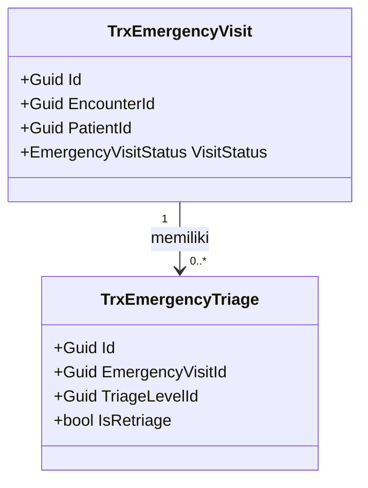
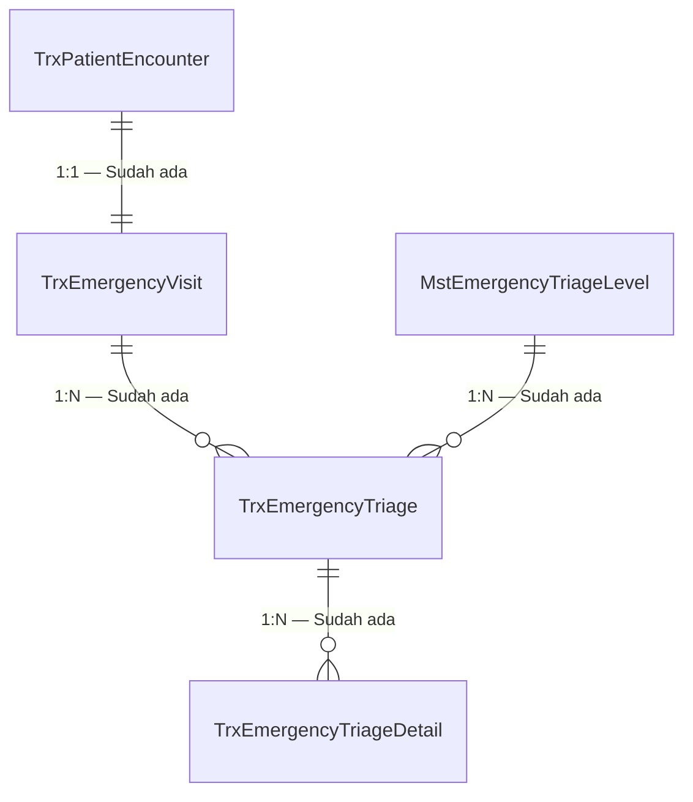

# Revisi `design-business-module` — Class Diagram, ERD, Arsitektur Folder, dan Status Model

|  |  |
| --- | --- |
| Tanggal | 2026-08-13 |
| Status | **Diimplementasikan** pada 2026-08-13. Skill sudah diperbarui; penulisan ulang blueprint IGD menjadi task lanjutan sesuai DEC-RSK-008. |
| Dokumen induk | [README.md](README.md) |
| Skill terdampak | `design-business-module` beserta file reference-nya |
| Fokus revisi | Backend |
| Pemicu | Keluaran desain saat ini belum mewajibkan class diagram, kamus data per kolom, arsitektur folder, dan status model baru/ubah/sudah ada |
| Acuan bentuk | `Penjelasan_Fungsi_Class_Modul_IGD_NewQuilvian.md` |

## 1. Yang diminta

Skill `design-business-module` diminta menghasilkan empat hal tambahan:

| No | Tambahan | Keadaan sekarang |
| ---: | --- | --- |
| 1 | Class diagram beserta penjelasan fungsi setiap class | Belum ada. Skill hanya mewajibkan ERD dan kontrak |
| 2 | ERD dengan parameter yang jelas dan tampilan yang rapi | Ada, tetapi belum mewajibkan kamus data per kolom |
| 3 | Arsitektur folder yang akan diterapkan di backend | Belum ada sama sekali |
| 4 | Status model: baru, diperbarui, atau sudah ada | Ada sebagian (`Existing/Extend/New/Adapter`), tetapi belum merinci kolom yang berubah |

Ditambah dua aturan wajib:

1. Setiap perubahan atau penambahan **wajib** disertai informasi parameter, tabel, endpoint,
   controller, dan komponen terkait lainnya.
2. Struktur folder backend **wajib** mengikuti aturan yang sudah berlaku di project ini,
   bukan pola karangan baru.

## 2. Hasil penelusuran aturan yang berlaku di project ini

Aturan folder tidak boleh dikarang. Berikut hasil penelusuran langsung ke source code, yang
akan menjadi dasar kontrak arsitektur folder.

### 2.1 Struktur folder yang terbukti dipakai

| Jenis file | Lokasi | Contoh nyata |
| --- | --- | --- |
| Model transaksi | `Areas/<Domain>/<SubDomain>/Models/` | `Areas/HealthServices/EmergencyInstallationManagement/Models/TrxEmergencyTriage.cs` |
| Model master | `Areas/<Domain>/MasterData/Models/` | `Areas/HealthServices/MasterData/Models/MstEmergencyTriageLevel.cs` |
| Controller | `Areas/<Domain>/<SubDomain>/Controllers/` | `Areas/HealthServices/ClinicalManagement/Controllers/` |
| DTO | `Areas/<Domain>/<SubDomain>/DTOs/` | `.../EmergencyInstallationManagement/DTOs/EmergencyTriageDtos.cs` |
| Enum | `Areas/<Domain>/<SubDomain>/Enums/` | `.../EmergencyInstallationManagement/Enums/EmergencyTriageStatus.cs` |
| Service | `Areas/<Domain>/<SubDomain>/Services/` | `.../EmergencyInstallationManagement/Services/` |
| **EF Core Configuration** | **`Repositories/Configurations/<Domain>/<SubDomain>/`** | `Repositories/Configurations/HealthService/EmergencyInstallationManagement/TrxEmergencyTriageConfiguration.cs` |

Poin paling mudah terlewat: **EF Core Configuration tidak berada di dalam `Areas/`.** Ia
tinggal terpisah di bawah `Repositories/Configurations/`. Dokumen acuan
`Penjelasan_Fungsi_Class_Modul_IGD_NewQuilvian.md` menyebut adanya class configuration,
tetapi tidak menyebutkan lokasinya. Blueprint yang tidak mencantumkan ini akan membuat
implementer menaruh file di tempat yang salah.

### 2.2 Konvensi penamaan yang terbukti dipakai

| Awalan | Arti | Contoh |
| --- | --- | --- |
| `Mst` | Data induk yang relatif stabil | `MstEmergencyTriageLevel`, `MstAllowanceType` |
| `Trx` | Data transaksi yang terbentuk dari aktivitas | `TrxEmergencyVisit`, `TrxAttendance` |
| `Wfp` | Transaksi payroll tenaga kerja | `WfpTransportAllowance` |

### 2.3 Base class audit — `IdentityModel`

Seluruh model mewarisi `IdentityModel` yang menyediakan sepuluh kolom berikut:

```csharp
CreateDateTime, CreateBy, UpdateDateTime, UpdateBy,
DeleteDateTime, DeleteBy, CancelDateTime, CancelBy,
IsCancel, IsDelete
```

Artinya penghapusan bersifat penandaan, bukan penghapusan sungguhan. Ini penting untuk
kamus data: kesepuluh kolom itu **tidak perlu** diulang pada setiap tabel di dokumen ERD;
cukup dinyatakan sekali bahwa tabel mewarisi `IdentityModel`.

### 2.4 Konvensi lain

| Hal | Konvensi |
| --- | --- |
| Tabel dan schema | `[Table("TrxEmergencyTriage", Schema = "public")]` |
| Pembungkus respons | `ApiResponse<T>.Ok(data, pesan)` dan `ApiResponse<T>.Fail(kode, pesan)` |
| Grup Swagger | `[Tags("Health Services / Emergency Installation Management / Emergency Triage")]` |
| Hak akses | `[AccessController]`, `[AccessAction]`, `[AccessPermission("Resource", "Action")]` |
| Service | Tanpa interface, didaftarkan dengan `AddScoped<TService>()` |
| Penghapusan relasi | `DeleteBehavior.Restrict` untuk relasi klinis |

Untuk kata-kata normatif, revisi ini memakai kosakata yang sudah dipakai
[q-care-project-rules.md](../q-care-project-rules.md): **MUST**, **MUST NOT**, **SHOULD**,
**CONFIG**, dan **DECISION REQUIRED**.

## 3. Tiga inkonsistensi yang ditemukan

Penelusuran menemukan tiga ketidakseragaman nyata. Ketiganya perlu keputusan sebelum kontrak
arsitektur folder dikunci, karena skill akan memaksa implementer mengikuti salah satu pola.

### Inkonsistensi 1 — `Controller` versus `Controllers`

| Pola | Jumlah folder | Contoh |
| --- | ---: | --- |
| `Controllers/` (jamak) | 25 | `Areas/HealthServices/ClinicalManagement/Controllers/` |
| `Controller/` (tunggal) | 1 | `Areas/HealthServices/EmergencyInstallationManagement/Controller/` |

Hanya modul IGD yang memakai bentuk tunggal. Karena revisi ini justru dipakai untuk IGD,
perbedaan tersebut akan langsung terasa.

### Inkonsistensi 2 — `HealthService` versus `HealthServices`

| Lokasi | Bentuk |
| --- | --- |
| `Areas/HealthServices/...` | Jamak |
| `Repositories/Configurations/HealthService/...` | **Tunggal** |

Nama domain yang sama ditulis berbeda di dua tempat.

### Inkonsistensi 3 — Namespace master tidak sama dengan folder

File `Areas/HealthServices/MasterData/Models/MstEmergencyTriageLevel.cs` mendeklarasikan:

```csharp
namespace QuilvianSystemBackend.Areas.HealthServices.MasterData.EmergencyInstallationManagement.Models
```

Ada satu ruas tambahan, `EmergencyInstallationManagement`, yang tidak punya folder padanan.
Folder sebenarnya hanya `Areas/HealthServices/MasterData/Models/`.

### Usulan penanganan

Ketiganya **tidak** diperbaiki oleh revisi ini. Mengubah nama folder dan namespace berarti
menyentuh source aplikasi, sedangkan skill desain tidak boleh melakukan itu.

Yang diusulkan: kontrak arsitektur folder **MUST** menyatakan pola yang dianggap benar,
menandai penyimpangan yang sudah ada sebagai utang teknis, dan **MUST NOT** menyuruh
implementer merapikannya diam-diam di tengah task lain. Perapian menjadi task tersendiri di
roadmap.

## 4. Struktur keluaran yang disepakati

Skill akan menghasilkan struktur berikut:

```text
docs/module-blueprints/<module>/
├── blueprint-manifest.md
├── 00-interview-decisions.md
├── 01-existing-capability-map.md
├── 02-backend-architecture.md
├── 03-frontend-architecture.md
├── erd/
│   ├── 00-context-erd.md
│   ├── <bounded-context>.md
│   └── data-dictionary.md
├── contracts/
│   ├── api-contract.md
│   ├── state-transition-matrix.md
│   ├── validation-matrix.md
│   ├── integration-contract.md
│   └── permission-audit-matrix.md
└── testing/
    └── acceptance-test-matrix.md
```

Perubahan dari struktur lama: folder `erd/` dan `contracts/` kini punya daftar file yang
pasti, tidak lagi bebas. `roadmap/` tidak muncul di sini karena itu keluaran
`plan-module-delivery`, bukan skill desain.

Karena revisi difokuskan ke backend, `03-frontend-architecture.md` tetap dihasilkan tetapi
cukup memuat kontrak fungsional: kebutuhan layar, aksi per peran, data dan status yang
dikonsumsi, serta kewenangan UI. Kedalaman detail diarahkan ke `02-backend-architecture.md`.

## 5. Isi wajib setiap artefak baru

### 5.1 Class diagram dan penjelasan fungsi class

Ditempatkan di `02-backend-architecture.md`.

**Bentuk gambar.** Memakai Mermaid `classDiagram` agar tampil sebagai diagram, bukan hanya
tabel. Satu diagram per bounded context, bukan satu diagram raksasa. Sebagai gambaran, modul
IGD punya 15 class model dan 8 service; menggabungkan semuanya dalam satu diagram membuatnya
tidak terbaca.



**Penjelasan setiap class.** Memakai bentuk tabel seperti dokumen acuan, dengan tambahan dua
baris yang selama ini belum ada:

| Aspek | Penjelasan |
| --- | --- |
| Kategori | Master IGD / Transaksi IGD / Service / Configuration |
| **Status** | **Baru / Diperbarui / Sudah ada** |
| **Lokasi file** | **Path lengkap tempat class akan tinggal** |
| Tanggung jawab utama | Satu paragraf, bahasa yang dipahami orang umum |
| Field penting | Daftar field beserta tipe |
| Navigation property dan relasi | Hubungan ke class lain |
| Pemakaian dalam alur bisnis | Kapan class ini aktif, dilihat dari sudut pandang petugas |
| Catatan desain | Larangan dan jebakan yang perlu dihindari |
| Ekuivalen model lama | Bila menggantikan class lama |

Dua baris bertanda tebal itulah tambahannya. Tanpa **Status**, pembaca tidak tahu mana yang
harus dibuat. Tanpa **Lokasi file**, implementer menebak folder.

**Service dan Controller juga wajib dijelaskan**, bukan hanya model. Termasuk service mana
yang dipanggil controller mana, dan mana yang cukup memakai `ApplicationDbContext` langsung.

### 5.2 ERD dan kamus data

Ditempatkan di `erd/`.

| File | Isi |
| --- | --- |
| `00-context-erd.md` | Peta antar bounded context. Hubungan modul IGD dengan Clinical Management, Registration, Pharmacy, dan lainnya |
| `<bounded-context>.md` | ERD detail satu konteks, misalnya `emergency-installation.md` |
| `data-dictionary.md` | Kamus data per kolom |

**Bentuk gambar.** Memakai Mermaid `erDiagram`, dengan penanda status pada label:



**Kamus data.** Inilah yang menjawab permintaan "parameter harus jelas". Setiap tabel memakai
kolom berikut:

| Kolom | Tipe | Wajib | Bawaan | Index | Relasi | Perilaku hapus | Sensitif | Keterangan |
| --- | --- | :---: | --- | --- | --- | --- | :---: | --- |
| `Id` | `Guid` | Ya | `Guid.NewGuid()` | PK | — | — | Tidak | Kunci utama |
| `EmergencyVisitId` | `Guid` | Ya | — | Index | FK ke `TrxEmergencyVisit` | `Restrict` | Tidak | Induk kunjungan IGD |
| `TriageLevelId` | `Guid` | Ya | — | Index | FK ke `MstEmergencyTriageLevel` | `Restrict` | Tidak | Level triage yang ditetapkan |
| `IsRetriage` | `bool` | Ya | `false` | — | — | — | Tidak | Menandai penilaian ulang |
| `ChiefComplaint` | `string(1000)` | Tidak | — | — | — | — | **Ya** | Keluhan utama pasien |

Kolom **Sensitif** menandai data yang tidak boleh masuk log dan tidak boleh tampil di contoh
dokumentasi. Ini menegakkan aturan yang sudah ada pada dokumen acuan: log hanya berisi
metadata, bukan diagnosis atau keluhan.

Sepuluh kolom warisan `IdentityModel` **MUST NOT** diulang pada setiap tabel. Cukup ditulis
satu kali: *"Seluruh tabel mewarisi `IdentityModel`."*

### 5.3 Arsitektur folder backend

Ditempatkan di `02-backend-architecture.md`, memuat pohon folder lengkap beserta status
setiap file:

```text
Areas/HealthServices/
├── EmergencyInstallationManagement/
│   ├── Controllers/          # Sudah ada, saat ini bernama Controller (utang teknis)
│   │   └── EmergencyTriageController.cs        # Diperbarui — tambah aksi retriage
│   ├── DTOs/
│   │   └── EmergencyTriageDtos.cs              # Diperbarui — tambah RetriageRequest
│   ├── Enums/
│   │   └── EmergencyTriageStatus.cs            # Sudah ada
│   ├── Models/
│   │   └── TrxEmergencyTriage.cs               # Diperbarui — tambah kolom penghubung
│   └── Services/
│       └── EmergencyTriageService.cs           # Diperbarui
└── MasterData/Models/
    └── MstEmergencyTriageLevel.cs              # Sudah ada

Repositories/Configurations/HealthService/EmergencyInstallationManagement/
└── TrxEmergencyTriageConfiguration.cs          # Diperbarui — index baru

Migrations/
└── <timestamp>_AddTriageSupersededLink.cs      # Baru
```

Aturan yang berlaku:

- Setiap file **MUST** diberi status: Baru, Diperbarui, atau Sudah ada.
- Penyimpangan dari pola standar **MUST** ditandai sebagai utang teknis, bukan diikuti diam-diam
  dan bukan pula dirapikan sendiri di tengah task lain.
- File EF Core Configuration **MUST** ditulis di bawah `Repositories/Configurations/`, tidak di
  dalam `Areas/`.

### 5.4 Informasi status model

Ditempatkan di `02-backend-architecture.md` sebagai tabel ringkas, lalu dirinci pada
kamus data.

| Model | Status | Perubahan | Dampak migration |
| --- | --- | --- | --- |
| `TrxEmergencyVisit` | Sudah ada | Tidak ada | Tidak ada |
| `TrxEmergencyTriage` | **Diperbarui** | Tambah `SupersededByTriageId` (`Guid?`), tambah index pada `(EmergencyVisitId, StartedAt)` | Migration menambah kolom dan index, dapat dijalankan tanpa mematikan layanan |
| `TrxEmergencyWaitingAlert` | **Baru** | Tabel baru beserta enam kolom | Migration membuat tabel |
| `MstEmergencyTriageLevel` | Sudah ada | Tidak ada | Tidak ada |

Untuk status **Diperbarui**, kolom yang berubah **MUST** disebutkan satu per satu. Menulis
"diperbarui" tanpa merinci kolomnya membuat migration tidak dapat direncanakan.

## 6. Aturan wajib informasi perubahan

Aturan pertama dari permintaan Anda diterjemahkan menjadi kontrak berikut. Setiap kali desain
menambah atau mengubah sesuatu, seluruh baris yang relevan **MUST** terisi:

| Yang berubah | Informasi yang wajib disertakan |
| --- | --- |
| Tabel | Nama tabel, schema, status, kolom yang berubah, index, unique constraint, perilaku hapus |
| Kolom atau parameter | Nama, tipe, wajib atau tidak, nilai bawaan, batas panjang, aturan validasi, penanda sensitif |
| Endpoint | Grup `[Tags(...)]`, base URL, method, path, kegunaan, hak akses, request, response, kode status |
| Controller | Nama file, lokasi folder, status, service yang dipakai, atribut akses |
| Service | Nama, fungsi utama, dipanggil siapa, apakah membuka transaksi database |
| DTO | Nama class, jenis (Create/Update/Status/Response/PagedQuery/Option), field |
| Enum | Nama, daftar nilai, nilai bawaan |
| Configuration | Nama file, lokasi, relasi yang diatur, index, `DeleteBehavior` |
| Migration | Nama, urutan, dapat dijalankan tanpa mematikan layanan atau tidak, cara mundur |
| Permission | String `[AccessPermission("Resource", "Action")]` yang persis |

Endpoint **MUST** ditulis memakai bentuk yang sama dengan halaman Swagger, sesuai
[aturan output dokumentasi](../../../.claude/rules/rule-output/aturan-output-dokumentasi.md):
judul grup persis nilai `[Tags(...)]`, lalu tabel API.

Endpoint yang belum ada di kode **MUST** diberi label `Rencana (belum tersedia)`.

## 7. Rekomendasi tambahan

Bagian ini adalah usulan saya di luar empat permintaan Anda. Semuanya berangkat dari hal yang
terlihat pada dokumen acuan dan pada source code IGD.

### 7.1 Rencana migration dan cara mundur — **Sangat disarankan**

Struktur keluaran belum punya tempat untuk rencana migration. Desain yang mengubah tabel
tetapi tidak menyatakan urutan migration, pengisian data lama, dan cara mundur akan menjadi
masalah saat penerapan.

Usulan: tambahkan bagian **Rencana migration** di dalam `02-backend-architecture.md`, memuat
urutan, apakah bisa dijalankan tanpa mematikan layanan, pengisian data lama, dan langkah
mundur bila gagal.

### 7.2 Rencana data master awal — **Sangat disarankan**

Modul IGD punya enam tabel master. Tanpa isi awal, modul tidak bisa dipakai sama sekali:
tidak ada level triage, tidak ada cara kedatangan, tidak ada jenis disposition.

Usulan: tambahkan bagian **Data master awal** yang mendaftar isi minimum setiap master.
Contohnya lima level triage ATS/ESI beserta warna dan target waktu responsnya. Ini juga
menegakkan catatan desain pada dokumen acuan: warna dan target waktu tunggu **MUST NOT**
di-hardcode di frontend maupun controller.

### 7.3 Daftar permission yang persis — **Disarankan**

`permission-audit-matrix.md` sebaiknya memuat string `[AccessPermission(...)]` apa adanya,
bukan deskripsi bebas. Dengan begitu implementer menyalin, bukan menerjemahkan.

| Endpoint | Resource | Action | String yang dipakai |
| --- | --- | --- | --- |
| `POST /{id}/retriage` | `EmergencyTriage` | `Update` | `[AccessPermission("EmergencyTriage", "Update")]` |

### 7.4 Diagram dipecah per konteks — **Disarankan**

Sudah disebut di atas, tetapi perlu ditegaskan sebagai aturan: satu diagram **MUST** muat
dibaca dalam satu layar. Modul IGD dipecah menjadi setidaknya empat diagram — master,
kunjungan dan triage, resusitasi dan observasi, disposition dan transfer.

### 7.5 Penanda data sensitif — **Disarankan**

Kolom `Sensitif` pada kamus data bukan hiasan. Ia menjadi masukan langsung untuk aturan
logging: kolom bertanda sensitif **MUST NOT** masuk ke custom logger, dan **MUST NOT** dipakai
sebagai contoh di dokumentasi.

### 7.6 Bagian "yang sengaja tidak dibuat" — **Disarankan**

Dokumen acuan punya bagian bagus berjudul aturan implementasi, yang melarang membuat versi IGD
dari SOAP, assessment, diagnosis, tindakan, resep, lab, dan radiologi.

Usulan: jadikan bagian tetap bernama **Yang sengaja tidak dibuat**, berisi daftar class yang
sempat dipertimbangkan lalu ditolak beserta alasannya. Ini mencegah orang berikutnya
mengusulkan ulang hal yang sama enam bulan kemudian.

### 7.7 Tabel kepemilikan data — **Disarankan**

Dokumen acuan memuat matriks kepemilikan class yang sangat berguna: kelompok data, modul
pemilik, dipakai IGD atau tidak, dibuat ulang di IGD atau tidak. Bentuk ini sebaiknya menjadi
bagian wajib, karena ia adalah pertahanan paling langsung terhadap duplikasi entity.

## 8. Dampak terhadap file skill

| File | Perubahan |
| --- | --- |
| `.claude/skills/design-business-module/SKILL.md` | Tambah kewajiban class diagram, kamus data, arsitektur folder, status model, dan aturan informasi perubahan |
| `.claude/skills/design-business-module/references/blueprint-output-contract.md` | Ditulis ulang: struktur folder keluaran yang pasti dan kontrak isi setiap file |
| `.claude/skills/design-business-module/references/backend-structure-rules.md` | **File baru** — aturan folder, penamaan, base class, dan lokasi configuration hasil penelusuran di bagian 2 |
| `.claude/skills/design-business-module/references/class-and-erd-template.md` | **File baru** — template class diagram, tabel penjelasan class, ERD, dan kamus data |
| `.claude/rules/rule-output/contoh-output-per-skill.md` | Contoh bagian `design-business-module` disesuaikan dengan bentuk baru |
| Adapter frontend `design-business-module` | Sidik jari dihitung ulang, kecuali adapter sudah dihapus lebih dulu |

Skill lain tidak diubah. `build-module-backend` otomatis ikut terbantu karena blueprint yang
dibacanya kini menyebutkan lokasi file dan status setiap model.

## 9. Keputusan yang diminta

### Keputusan 4 — Penanganan tiga inkonsistensi struktur

| Field | Isi |
| --- | --- |
| Owner | Pemilik arsitektur backend |
| Pilihan A **(Direkomendasikan)** | Kontrak menyatakan pola standar (`Controllers/` jamak, `HealthServices` jamak, namespace mengikuti folder), penyimpangan yang ada ditandai utang teknis dan tidak diperbaiki diam-diam |
| Pilihan B | Kontrak mengikuti apa pun yang sudah ada per modul. Tidak ada utang teknis tercatat, tetapi ketidakseragaman menetap dan menyebar ke modul baru |
| Pilihan C | Rapikan sekarang: ubah nama folder dan namespace. Paling bersih, tetapi menyentuh source aplikasi dan berisiko memecah build; **MUST** menjadi task tersendiri, bukan bagian revisi skill |

### Keputusan 5 — Cakupan rekomendasi tambahan

| Field | Isi |
| --- | --- |
| Owner | Pemilik suite skill |
| Pilihan A **(Direkomendasikan)** | Terapkan seluruh tujuh rekomendasi bagian 7. Dua yang bertanda sangat disarankan menutup lubang nyata pada penerapan |
| Pilihan B | Terapkan hanya dua yang bertanda sangat disarankan, yaitu rencana migration dan data master awal |
| Pilihan C | Tidak menerapkan satu pun; kerjakan hanya empat permintaan awal |

### Keputusan 6 — Format diagram

| Field | Isi |
| --- | --- |
| Owner | Pemilik suite skill |
| Pilihan A **(Direkomendasikan)** | Mermaid `classDiagram` dan `erDiagram`. Tampil sebagai gambar di banyak penampil markdown, tetap terbaca sebagai teks, dan dapat ditelusuri perubahannya oleh git |
| Pilihan B | Tabel saja tanpa diagram. Paling sederhana, tetapi tidak menjawab permintaan tampilan yang rapi |
| Pilihan C | Gambar hasil ekspor. Paling rapi dipandang, tetapi tidak dapat ditelusuri perubahannya dan mudah tertinggal versi |

## 10. Checklist eksekusi

Dijalankan setelah keputusan 4, 5, dan 6 disetujui.

| No | Langkah | Selesai |
| ---: | --- | :---: |
Seluruh keputusan sudah tertutup, sehingga checklist ini siap dijalankan.

| No | Langkah | Selesai |
| ---: | --- | :---: |
| 1 | Tulis `references/backend-structure-rules.md` dari hasil penelusuran bagian 2, termasuk penandaan utang teknis sesuai DEC-RSK-003 | ☑ |
| 2 | Tulis `references/class-and-erd-template.md` beserta contoh Mermaid sesuai DEC-RSK-005 | ☑ |
| 3 | Tulis ulang `references/blueprint-output-contract.md` mengikuti struktur bagian 4 dan aturan satu baris alasan sesuai DEC-RSK-007 | ☑ |
| 4 | Perbarui `SKILL.md`: kewajiban artefak baru, aturan informasi perubahan, dan kamus data bertingkat sesuai DEC-RSK-002 | ☑ |
| 5 | Terapkan seluruh tujuh rekomendasi bagian 7 sesuai DEC-RSK-004 | ☑ |
| 6 | **Selaraskan PANDUAN baris 99 dan SKILL.md baris 99** dengan DEC-RSK-007 agar pertentangan CF-RSK-001 benar-benar hilang | ☑ |
| 7 | Sesuaikan contoh `design-business-module` pada `contoh-output-per-skill.md` | ☑ |
| 8 | Hitung ulang sidik jari adapter, bila adapter masih ada | ☑ |
| 9 | Perbarui status dokumen ini menjadi **Diimplementasikan** | ☑ |

Bukti verifikasi: tidak ada sisa kalimat aturan lama di seluruh `.claude/`, ketiga link
reference pada `SKILL.md` resolve, dan kedelapan sidik jari adapter cocok.

### Task lanjutan, dikerjakan setelah checklist di atas selesai

Sesuai DEC-RSK-008, penulisan ulang blueprint IGD adalah pekerjaan terpisah.

| No | Langkah | Selesai |
| ---: | --- | :---: |
| 1 | Jalankan `/design-business-module` untuk modul IGD memakai skill yang sudah diperbarui | ☐ |
| 2 | Periksa keluarannya terhadap kontrak baru; kekurangan yang muncul diperbaiki di skill, bukan ditambal manual pada dokumen | ☐ |
| 3 | Naikkan `blueprint-manifest.md` IGD menjadi revision 4 | ☐ |

## 11. Decision log wawancara

Bagian ini diisi selama wawancara penutupan dokumen. Keputusan di sini mengikat isi revisi.

### Fakta yang ditemukan dari source, bukan dari wawancara

| ID | Fakta | Bukti |
| --- | --- | --- |
| F-01 | Blueprint IGD sudah ada dengan revision 3 dan status `draft` | `docs/module-blueprints/igd/blueprint-manifest.md` |
| F-02 | Struktur folder keluaran yang diminta sudah dipakai blueprint IGD, bukan usulan baru | `docs/module-blueprints/igd/` berisi 14 file |
| F-03 | `02-backend-architecture.md` hanya 115 baris untuk 15 model, 9 controller, dan 8 service | Penghitungan baris pada file tersebut |
| F-04 | `erd/data-dictionary.md` hanya 23 baris, sedangkan 15 model IGD memiliki 293 kolom | Penghitungan properti pada `Areas/HealthServices/EmergencyInstallationManagement/Models/` dan `Areas/HealthServices/MasterData/Models/Mst Emergency*` |

### Keputusan

#### DEC-RSK-001 — Keberlakuan kontrak keluaran baru terhadap blueprint yang sudah ada

| Field | Nilai |
| --- | --- |
| Status | `approved` |
| Keputusan | Kontrak berlaku surut. Blueprint IGD ditulis ulang menjadi revision 4 sebelum implementasi dilanjutkan |
| Alasan | IGD adalah modul pertama yang akan diimplementasi. Membiarkannya pada revision 3 membuat `build-module-backend` tetap menebak lokasi file dan status model, yaitu masalah yang justru ingin ditutup revisi ini |
| Konsekuensi | Ada satu pekerjaan penulisan ulang di muka sebelum task implementasi IGD berikutnya dijalankan |
| Dampak ke checklist | Menambah satu langkah: tulis ulang blueprint IGD ke revision 4 setelah skill diperbarui |

#### DEC-RSK-002 — Kedalaman kamus data

| Field | Nilai |
| --- | --- |
| Status | `approved` |
| Keputusan | Kedalaman bertingkat mengikuti status tabel |
| Aturan | Tabel **Baru** dan **Diperbarui**: seluruh kolom didokumentasikan. Tabel **Sudah ada**: cukup kolom kunci, yaitu PK, FK, kolom status, dan kolom yang dipakai aturan bisnis modul ini, ditambah rujukan ke file model sebagai sumber lengkap |
| Alasan | Kolom yang tidak berubah hanyalah salinan kode yang cepat basi. Implementer tetap mendapat seluruh informasi yang ia butuhkan tanpa memelihara ratusan baris duplikat |
| Contoh | Untuk IGD, `TrxEmergencyVisit` berstatus Sudah ada sehingga cukup `Id`, `EncounterId`, `PatientId`, `ServiceUnitId`, `RegistrationStatus`, `VisitStatus`, ditambah rujukan `Areas/HealthServices/EmergencyInstallationManagement/Models/TrxEmergencyVisit.cs`. Bila kemudian modul menambah kolom pada tabel ini, statusnya berubah menjadi Diperbarui dan seluruh kolom wajib ditulis |
| Konsekuensi | Kamus data IGD diperkirakan kira-kira sepertiga dari 293 baris, bukan seluruhnya |

#### DEC-RSK-003 — Penanganan tiga inkonsistensi struktur (menutup Keputusan 4)

| Field | Nilai |
| --- | --- |
| Status | `approved` |
| Keputusan | Kontrak menyatakan pola standar: `Controllers` jamak, `HealthServices` jamak, namespace mengikuti folder. Penyimpangan yang sudah ada ditandai sebagai utang teknis |
| Larangan | Modul baru **MUST NOT** meniru penyimpangan yang ada. Implementer **MUST NOT** merapikan penyimpangan diam-diam di tengah task lain |
| Tindak lanjut | Perapian menjadi task tersendiri pada roadmap, bukan bagian revisi skill ini |
| Contoh penerapan | Folder IGD saat ini bernama `Controller/`. Blueprint menuliskannya sebagai `Controllers/ # saat ini bernama Controller — utang teknis`, sehingga pembaca tahu keadaan nyata sekaligus target |

#### DEC-RSK-004 — Cakupan rekomendasi tambahan (menutup Keputusan 5)

| Field | Nilai |
| --- | --- |
| Status | `approved` |
| Keputusan | Seluruh tujuh rekomendasi pada bagian 7 diterapkan |
| Cakupan | Rencana migration dan cara mundur; rencana data master awal; daftar permission yang persis; diagram dipecah per konteks; penanda kolom sensitif; bagian "yang sengaja tidak dibuat"; tabel kepemilikan data |
| Alasan | Ketujuhnya berangkat dari hal yang sudah terlihat pada dokumen acuan dan source IGD, bukan tambahan spekulatif |

#### DEC-RSK-005 — Format diagram (menutup Keputusan 6)

| Field | Nilai |
| --- | --- |
| Status | `approved` |
| Keputusan | Mermaid `classDiagram` dan `erDiagram` sebagai blok kode di dalam markdown |
| Alasan | Tampil sebagai gambar di GitHub dan VS Code, tetap terbaca sebagai teks, dan perubahannya dapat ditelusuri git baris per baris |
| Konsekuensi | Diagram **MUST** dipecah agar satu diagram muat dibaca dalam satu layar, sesuai DEC-RSK-004 |

#### DEC-RSK-006 — Kewenangan persetujuan

| Field | Nilai |
| --- | --- |
| Status | `approved` |
| Keputusan | Pemilik suite skill dan pemilik arsitektur backend dipegang orang yang sama. Kelima keputusan DEC-RSK-001 sampai 005 berstatus `approved` |
| `approved_by` | Pemilik suite skill merangkap pemilik arsitektur backend — *nama perlu diisi sebelum dokumen dipakai sebagai bukti approval* |
| `approved_at` | 2026-08-13 |
| Catatan | Bila kemudian ada arsitek backend lain yang ditunjuk, DEC-RSK-003 **MUST** dibuka ulang karena keputusan itu mengikat pola folder seluruh modul berikutnya |

### Conflict yang ditemukan

#### CF-RSK-001 — Daftar file keluaran: pasti atau bebas

| Field | Nilai |
| --- | --- |
| Status | `resolved` oleh DEC-RSK-007 |
| Pertentangan | `PANDUAN-PENGGUNAAN-SKILLS.md` baris 99 menyatakan "Tidak semua file wajib dibuat bila tidak relevan. Jangan membuat dokumen kosong hanya untuk memenuhi struktur". `design-business-module/SKILL.md` baris 99 menyatakan "Buat hanya artefak yang relevan di struktur canonical". Bagian 4 dokumen ini justru menetapkan daftar file yang pasti |
| Dampak bila dibiarkan | Skill menerima dua perintah yang bertentangan. Hasilnya bergantung pada bagian mana yang dibaca lebih dulu, sehingga keluaran tidak dapat diandalkan |
| Tindak lanjut | Setelah diputuskan, PANDUAN baris 99 dan SKILL.md baris 99 **MUST** diselaraskan dalam perubahan yang sama, bukan hanya dokumen ini |

#### DEC-RSK-007 — Daftar file keluaran bersifat pasti, isi boleh satu baris

| Field | Nilai |
| --- | --- |
| Status | `approved` |
| Keputusan | Kedua belas file pada struktur bagian 4 **MUST** ada. File yang tidak relevan bagi modul tertentu cukup berisi satu baris alasan |
| Bentuk yang benar | `contracts/integration-contract.md` untuk modul tanpa sistem luar berisi satu baris: *"Tidak berlaku untuk modul ini karena IGD tidak memanggil sistem luar. Ditinjau ulang bila kebutuhan integrasi muncul."* |
| Bentuk yang salah | File dihapus tanpa jejak, atau file berisi judul dan tabel kosong tanpa keterangan |
| Alasan | Menutup pertentangan tanpa memihak. Tidak ada dokumen seremonial, dan pembaca selalu dapat membedakan "memang tidak perlu" dari "terlupa ditulis" |
| Penyelarasan wajib | `PANDUAN-PENGGUNAAN-SKILLS.md` baris 99 dan `design-business-module/SKILL.md` baris 99 **MUST** diubah agar berbunyi sama dengan keputusan ini |

#### DEC-RSK-008 — Urutan pengerjaan penulisan ulang blueprint IGD

| Field | Nilai |
| --- | --- |
| Status | `approved` |
| Keputusan | Penulisan ulang blueprint IGD menjadi task terpisah, dikerjakan **oleh** `/design-business-module` yang sudah diperbarui, bukan ditulis tangan |
| Urutan | 1) Perbarui skill sampai selesai. 2) Jalankan `/design-business-module` untuk modul IGD. 3) Keluarannya menjadi revision 4 |
| Alasan | Menjadikan penulisan ulang sebagai pengujian skill sekaligus. Bila ditulis tangan, tidak ada yang membuktikan skill menghasilkan kontrak yang diminta, dan hasil tangan berisiko berbeda dari keluaran skill |
| Konsekuensi | Revisi skill dan penulisan ulang IGD adalah dua pekerjaan berurutan, bukan satu |

### Ringkasan status wawancara

| ID | Pokok | Status |
| --- | --- | --- |
| DEC-RSK-001 | Kontrak berlaku surut, IGD ditulis ulang ke revision 4 | `approved` |
| DEC-RSK-002 | Kamus data bertingkat mengikuti status tabel | `approved` |
| DEC-RSK-003 | Pola folder standar, penyimpangan ditandai utang teknis | `approved` |
| DEC-RSK-004 | Seluruh tujuh rekomendasi tambahan diterapkan | `approved` |
| DEC-RSK-005 | Diagram memakai Mermaid | `approved` |
| DEC-RSK-006 | Pemilik suite skill dan arsitektur backend orang yang sama | `approved` |
| DEC-RSK-007 | Daftar file pasti, isi boleh satu baris alasan | `approved` |
| DEC-RSK-008 | Penulisan ulang IGD menjadi task terpisah oleh skill | `approved` |
| CF-RSK-001 | Pertentangan daftar file pasti versus bebas | `resolved` |

Tidak ada pertanyaan terbuka yang memblokir eksekusi revisi skill.

Satu hal yang masih perlu diisi manusia: nama pada `approved_by` DEC-RSK-006, sebelum dokumen
ini dipakai sebagai bukti approval.
