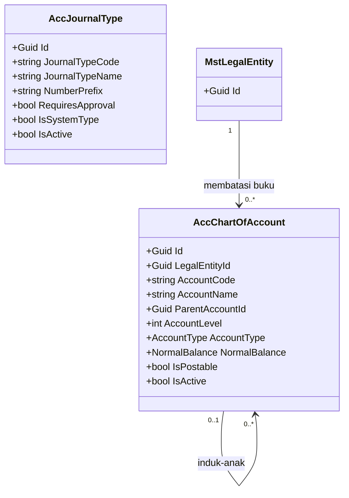
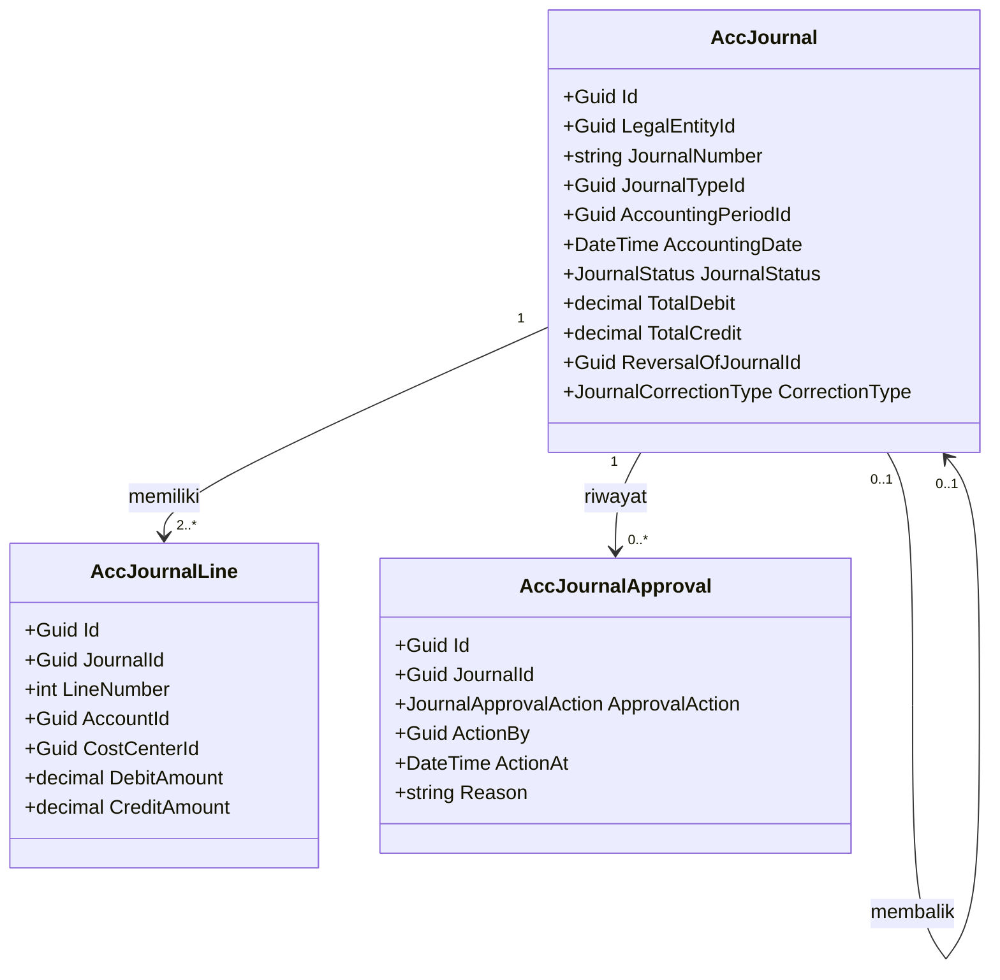
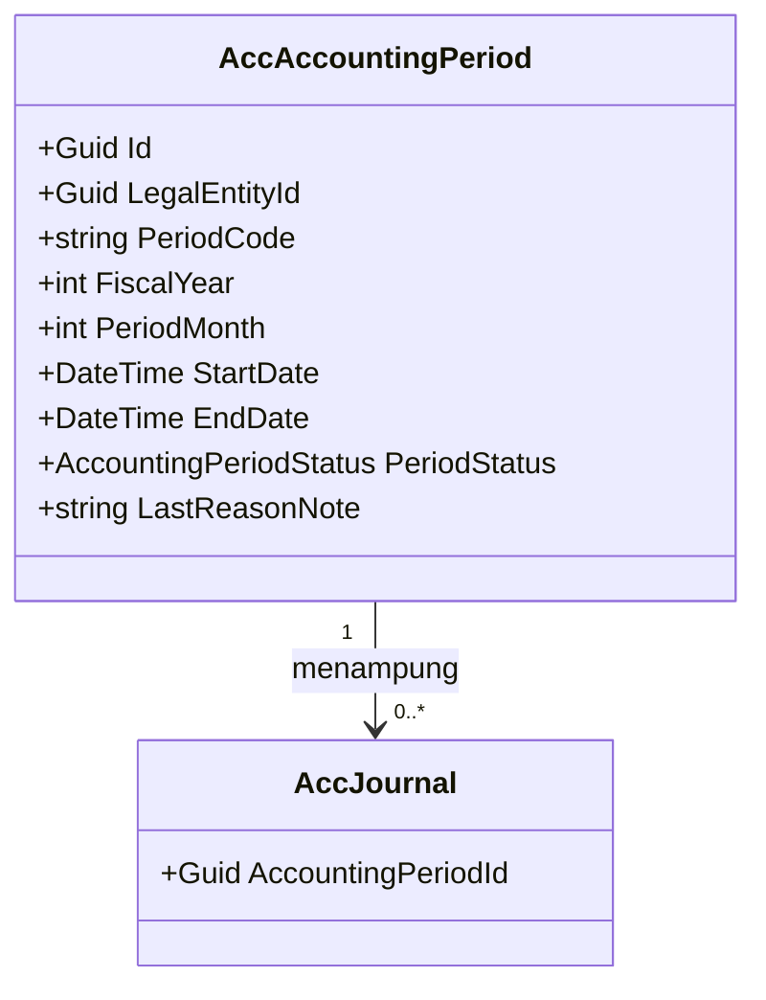
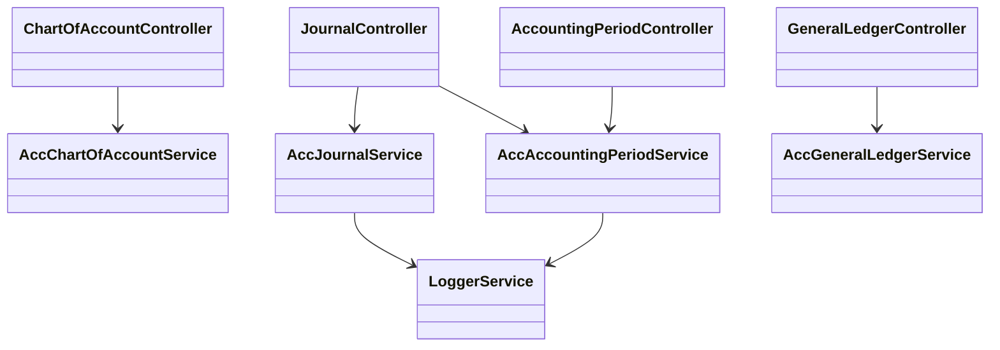
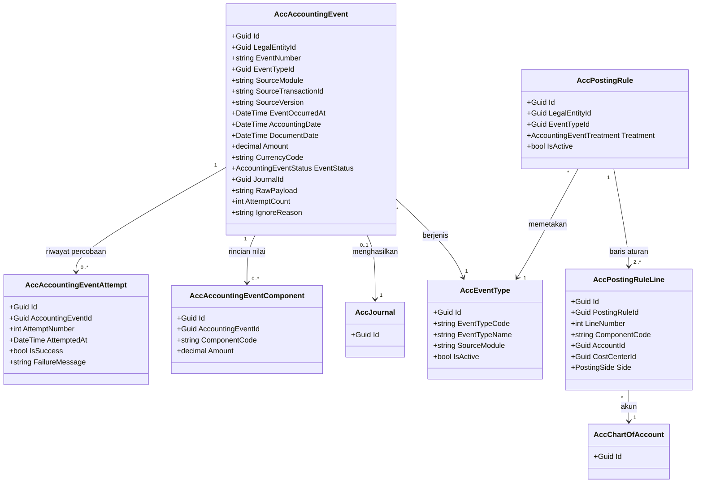
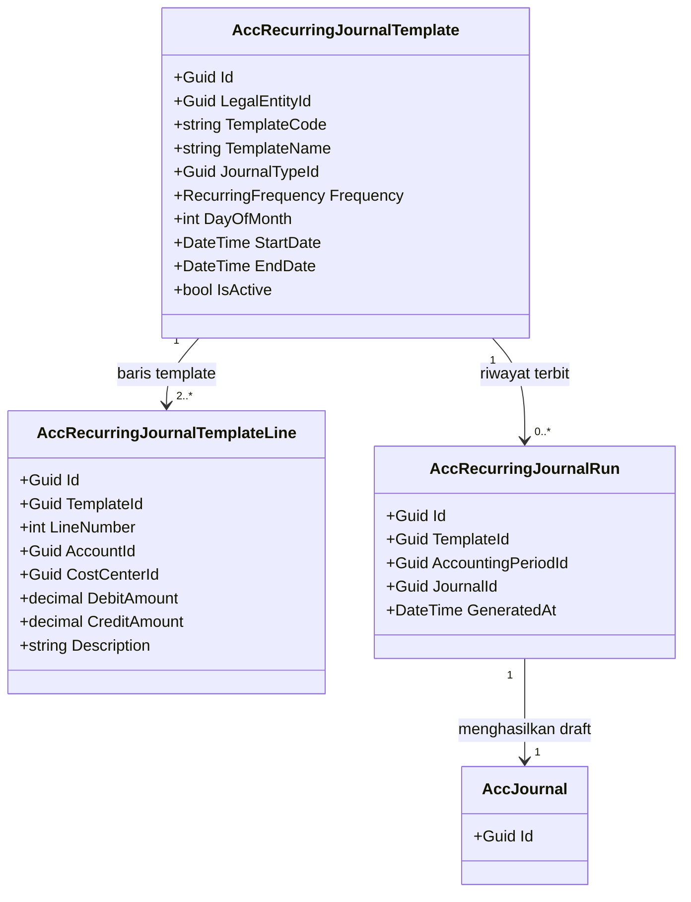
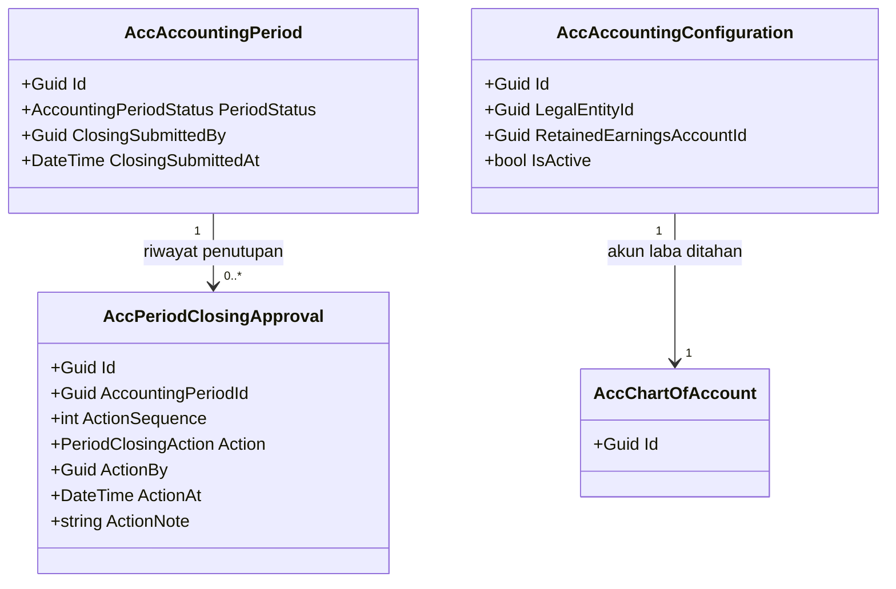

# Accounting — Backend Architecture

| Field | Value |
|---|---|
| Blueprint ID | `ACC-BP-001` |
| Revision | `4` — dinaikkan 8 September 2026, bagian 14 sampai 21 (Phase 2) ditambahkan |
| Status | Bagian 1–13 (MVP): mengikuti approval `ACC-BP-001` revisi 5, 1 September 2026. Bagian 14–21 (Phase 2): **`approved`** — Rizki, 8 September 2026 |
| Cakupan | MVP tulang punggung akuntansi (`ACC-DEC-009`) **dan** Phase 2 (`ACC-PH-006`, bagian 14–21) |
| Bentuk blueprint | `SINGLE` — melanjutkan bentuk yang sudah melekat sejak approval, tidak dinilai ulang |
| `domain_architecture_readiness` | `DOMAIN_ARCHITECTURE_READY` — `ACC-DOMAIN-P2-0.1`, [evidence/09](evidence/09-phase2-hospital-domain-architecture.md) |
| Backend SHA | `aa837d784ff51cb2b889cf975ada3a204018f1f5` (branch `rizkiG`) |
| Frontend SHA | `fc49cc7714baa9a2c37ed6519fbaba5dffcbda99` (branch `RizkiV2`) — baseline **saat dokumen ini disusun**. Baseline blueprint kini `31a82c8` (`QuilvianIntegrationFrontend`); kutipan di bawah tetap berlaku, lihat `evidence/02-frontend-rebaseline-impact-scan.md` |
| Masukan | `00-interview-decisions.md@3`, `01-existing-capability-map.md@2` |
| Decision revision | `1.1` — `ACC-DEC-001` sampai `ACC-DEC-037` |
| Sumber konvensi | `AGENTS.md@aa837d7`, `backend-structure-rules.md` |

## Peringatan sebelum membaca

Dokumen ini **tidak memberi wewenang menulis kode**. Ia menetapkan bentuk target. Pembuatan
entity dan migration masih terblokir oleh `ACC-DEP-001` dan `ACC-DEP-002`; lihat
[05-prerequisite-readiness.md](05-prerequisite-readiness.md).

Seluruh nama kelas berawalan `Acc` di dokumen ini adalah **nama sementara**. Prefix penamaan
resmi belum terdaftar di registry kepemilikan modul. Yang sudah pasti adalah **bentuknya** —
kolom, kunci, relasi, dan aturannya. Bila lead mendaftarkan prefix lain, hanya namanya yang
berubah.

---

## 1. Keputusan gerbang: Accounting MVP diperlakukan sebagai kemampuan non-rumah-sakit

Skill penyusun blueprint mewajibkan bukti `requirement-completeness-gate` dan handoff
`hospital-domain-architect` **untuk kemampuan bisnis rumah sakit**. Keduanya belum dijalankan.
Karena itu klasifikasinya dinyatakan terbuka di sini, bukan dilewati diam-diam.

**Penilaian:** Accounting MVP diperlakukan sebagai kemampuan **korporat/keuangan umum**, bukan
kemampuan bisnis rumah sakit. Dasarnya:

| Uji | Hasil pada MVP |
|---|---|
| Memuat data pasien? | Tidak ada satu pun kolom pasien |
| Memuat isi klinis atau menyentuh keselamatan pasien? | Tidak |
| Melintasi bounded context lain? | Tidak — seluruh integrasi ditunda ke Phase 2 oleh `ACC-DEC-009` |
| Berdampak pada billing? | Tidak pada MVP; jalur Billing ada di Phase 2 |
| Apakah aturannya khas rumah sakit? | Tidak. Pembukuan berpasangan berlaku sama di industri mana pun |

Karena itu bounded context, batas aggregate, dan ownership pada dokumen ini ditetapkan di sini
dari bukti yang sudah disetujui — 37 keputusan `ACC-DEC-*` — sebagaimana diizinkan untuk
kemampuan non-rumah-sakit.

**Syarat yang mengikat penilaian ini:**

> Phase 2 Accounting **bukan** kemampuan non-rumah-sakit. Begitu modul ini menerima kejadian
> keuangan yang berasal dari tagihan pasien, ia melintasi bounded context Billing dan menyentuh
> data yang terikat pada kunjungan pasien. Sebelum Phase 2 dirancang,
> `requirement-completeness-gate` dan `hospital-domain-architect` **wajib** dijalankan lebih
> dahulu.

Satu hal lagi yang perlu dicatat jujur: folder tata kelola `docs/engineering/` dan `.codex/`
tidak ada di repository ini. `AGENTS.md`, yang menyatakan dirinya otoritatif untuk governance
level-repository, dapat dibaca dan diikuti. Yang tidak dapat dibaca hanyalah kontrak penamaan
QBE, dan konsekuensinya sudah ditangani sebagai `ACC-DEP-002` — penamaan memang sengaja tidak
dikunci di sini.

---

## 2. Bounded context dan ownership

Accounting adalah satu bounded context dengan tiga area di dalamnya. Pembagian mengikuti batas
aggregate, bukan sekadar pengelompokan menu.

| Area | Aggregate root | Invariant yang dijaga |
|---|---|---|
| Master Data Akuntansi | `AccChartOfAccount`, `AccJournalType` | Akun induk tidak menerima transaksi; kode akun unik per badan hukum; kode tidak berubah setelah dipakai |
| Journal Management | `AccJournal` | Total debit sama dengan total kredit; jurnal yang sudah disahkan tidak dapat diubah; pembuat bukan penyetuju |
| Accounting Period | `AccAccountingPeriod` | Pencatatan hanya masuk periode yang menerimanya; penutupan dan pembukaan kembali tercatat alasannya |

`AccJournal` adalah aggregate root yang membawahi `AccJournalLine` dan `AccJournalApproval`.
Barisnya **tidak** boleh diubah lewat endpoint tersendiri — selalu melalui jurnalnya, agar
keseimbangan tidak pernah dinilai setengah jalan.

### Batas transaksi database

| Operasi | Cakupan transaksi | Bila gagal di tengah |
|---|---|---|
| Simpan jurnal beserta barisnya | Satu transaksi mencakup header dan seluruh baris | Seluruhnya dibatalkan; tidak ada jurnal tanpa baris |
| Sahkan jurnal | Satu transaksi: ubah status, isi `PostedBy`/`PostedAt`, tulis riwayat persetujuan | Status tidak berubah sama sekali |
| Balik jurnal | Satu transaksi: buat jurnal pembalik beserta barisnya, tautkan ke jurnal asal | Tidak ada jurnal pembalik separuh jadi |
| Tutup periode | Satu transaksi: ubah status periode, catat alasan | Periode tetap pada status semula |

### Buku besar tidak disimpan sebagai tabel

Buku besar **dihitung** dari baris jurnal berstatus `Posted`, bukan disimpan sebagai tabel
tersendiri. Alasannya:

1. Tidak mungkin ada selisih antara jurnal dan buku besar, karena keduanya satu sumber.
2. `ACC-DEC-018` memulai sistem dari saldo awal saja, tanpa memindahkan riwayat lama, sehingga
   jumlah baris pada tahun pertama kecil.

**Contoh perhitungannya.** Saldo akhir akun `5-1001 Beban Obat` untuk badan hukum A pada periode
`2026-09` adalah jumlah seluruh `DebitAmount` dikurangi jumlah seluruh `CreditAmount` pada baris
jurnal berstatus `Posted` yang tanggal akuntansinya sampai 30 September 2026. Bila ada tiga
jurnal yang masing-masing mendebit Rp 3.000.000, mendebit Rp 1.500.000, dan mengkredit
Rp 500.000, maka saldonya Rp 4.000.000.

Bila kelak pengukuran nyata menunjukkan laporan melambat, tabel ringkasan saldo per akun per
periode ditambahkan sebagai optimasi — dan itu keputusan teknis, bukan keputusan bisnis.

### Saldo awal adalah jurnal, bukan tabel tersendiri

`ACC-DEC-018` menetapkan sistem dimulai dari saldo awal. Saldo awal diwujudkan sebagai **satu
jurnal biasa** berjenis `SA` (Saldo Awal), bukan tabel terpisah. Keuntungannya: saldo awal
otomatis tunduk pada aturan keseimbangan, otomatis masuk jejak audit, dan otomatis tampil di
buku besar tanpa kode khusus.

`ACC-DEC-033` menuntut pengesahan oleh Accounting Manager dengan persetujuan pimpinan keuangan.
Itu diwujudkan lewat `AccJournalType.RequiresApproval` bernilai benar pada jenis `SA`, ditambah
hak akses `Journal : Post` yang memang hanya dimiliki Manager.

---

## 3. Tabel kepemilikan data

Ini pertahanan paling langsung terhadap duplikasi entity.

| Kelompok data | Modul pemilik | Dipakai modul ini | Dibuat ulang di modul ini |
|---|---|:---:|---|
| Daftar akun (COA) | **Accounting** | Ya | Ya — memang milik modul ini (`ACC-DEC-002`) |
| Jurnal dan baris jurnal | **Accounting** | Ya | Ya — memang milik modul ini |
| Riwayat persetujuan jurnal | **Accounting** | Ya | Ya — data bisnis, bukan sekadar log |
| Periode akuntansi | **Accounting** | Ya | Ya — memang milik modul ini |
| Jenis jurnal | **Accounting** | Ya | Ya — master khusus akuntansi |
| Buku besar | **Accounting** | Ya | **Tidak** — dihitung dari baris jurnal |
| Cost Center | Corporate / Human Resource / Master Data / Organization | Ya | **Tidak** — dirujuk lewat `CostCenterId` |
| Badan hukum (`MstLegalEntity`) | Corporate / Master Data | Ya | **Tidak** — dirujuk lewat `LegalEntityId` |
| Lokasi rumah sakit (`MstHospitalSite`) | Corporate / Master Data | Tidak pada MVP | **Tidak** |
| Departemen dan unit organisasi | Corporate / Human Resource | Tidak langsung | **Tidak** — dicapai lewat `MstCostCenter` |
| Pengguna dan hak akses | Platform | Ya | **Tidak** — memakai mekanisme yang ada |
| Jejak audit teknis | Platform (`LoggerService`) | Ya | **Tidak** — memakai layanan yang ada |
| Faktur, item tagihan, pembayaran pasien | Billing dan Kasir | Tidak pada MVP | **Tidak** — dilarang `ACC-DEC-004` |
| Piutang dan utang operasional | Finance | Tidak pada MVP | **Tidak** — dilarang `ACC-DEC-003` |

---

## 4. Class diagram

Dipecah per area agar satu diagram muat dibaca dalam satu layar.

### 4.1 Master Data Akuntansi



### 4.2 Journal Management



### 4.3 Accounting Period



### 4.4 Layanan dan controller



---

## 5. Penjelasan setiap class

### 5.1 `AccChartOfAccount`

| Aspek | Penjelasan |
|---|---|
| **Status** | `Baru` |
| **Lokasi file** | `Areas/Corporate/AccountingManagement/MasterData/ChartOfAccount/Models/AccChartOfAccount.cs` |
| Kategori | Master akuntansi |
| Tanggung jawab utama | Menyimpan satu akun pada daftar akun. Setiap akun adalah "laci" tempat rupiah digolongkan. Akun tersusun bertingkat: akun induk hanya menjumlahkan, akun paling bawah yang menerima transaksi |
| Field penting | `LegalEntityId`, `AccountCode`, `AccountName`, `ParentAccountId`, `AccountLevel`, `AccountType`, `NormalBalance`, `IsPostable`, `IsActive` |
| Navigation property dan relasi | Menunjuk `MstLegalEntity`; menunjuk dirinya sendiri lewat `ParentAccountId`; dirujuk banyak `AccJournalLine` |
| Pemakaian dalam alur bisnis | Dipakai saat petugas memilih akun pada baris jurnal, dan saat buku besar dikelompokkan |
| Catatan desain | `IsPostable` **tidak** boleh bernilai benar bila akun punya anak (`ACC-DEC-022`). `AccountCode` tidak boleh diubah setelah akun punya baris jurnal berstatus `Posted` (`ACC-DEC-023`). Akun tidak boleh dinonaktifkan bila saldonya belum nol (`ACC-DEC-024`). Kewajiban Cost Center **diturunkan** dari `AccountType == Expense`, tidak disimpan sebagai kolom tersendiri, agar tidak ada dua sumber kebenaran |
| Ekuivalen model lama | — |

### 5.2 `AccJournalType`

| Aspek | Penjelasan |
|---|---|
| **Status** | `Baru` |
| **Lokasi file** | `Areas/Corporate/AccountingManagement/MasterData/JournalType/Models/AccJournalType.cs` |
| Kategori | Master akuntansi |
| Tanggung jawab utama | Menyimpan jenis jurnal beserta aturan alurnya. Inilah yang mewujudkan `ACC-DEC-010`, yaitu alur berbeda menurut jenis jurnal |
| Field penting | `JournalTypeCode`, `JournalTypeName`, `NumberPrefix`, `RequiresApproval`, `IsSystemType`, `IsActive` |
| Navigation property dan relasi | Dirujuk banyak `AccJournal` |
| Pemakaian dalam alur bisnis | Dipilih petugas saat membuat jurnal; menentukan awalan nomor dan apakah jurnal perlu disetujui |
| Catatan desain | Berlaku lintas badan hukum, jadi **tidak** punya `LegalEntityId` — jenis jurnal bersifat struktural. `IsSystemType` menandai jenis yang tidak boleh dihapus pengguna, yaitu Jurnal Pembalik dan Saldo Awal |
| Ekuivalen model lama | — |

### 5.3 `AccAccountingPeriod`

| Aspek | Penjelasan |
|---|---|
| **Status** | `Baru` |
| **Lokasi file** | `Areas/Corporate/AccountingManagement/AccountingPeriod/Models/AccAccountingPeriod.cs` |
| Kategori | Transaksi akuntansi |
| Tanggung jawab utama | Menyimpan satu periode akuntansi beserta statusnya. Periode inilah yang mengunci pembukuan agar angka yang sudah dilaporkan tidak berubah diam-diam |
| Field penting | `LegalEntityId`, `PeriodCode`, `FiscalYear`, `PeriodMonth`, `StartDate`, `EndDate`, `PeriodStatus`, `ClosedBy`, `ClosedAt`, `ReopenedBy`, `ReopenedAt`, `LastReasonNote` |
| Navigation property dan relasi | Menunjuk `MstLegalEntity`; menampung banyak `AccJournal` |
| Pemakaian dalam alur bisnis | Diperiksa setiap kali jurnal disahkan; diubah statusnya saat tutup buku |
| Catatan desain | Periode bulanan mengikuti tahun kalender (`ACC-DEC-013`), sehingga `PeriodCode` berbentuk `2026-09`. Tiga status sesuai `ACC-DEC-012`. Riwayat penuh penutupan dan pembukaan kembali disimpan `LoggerService`; kolom pada tabel ini hanya menyimpan keadaan terakhir, agar tidak menduplikasi jejak audit |
| Ekuivalen model lama | — |

### 5.4 `AccJournal`

| Aspek | Penjelasan |
|---|---|
| **Status** | `Baru` |
| **Lokasi file** | `Areas/Corporate/AccountingManagement/JournalManagement/Models/AccJournal.cs` |
| Kategori | Transaksi akuntansi — aggregate root |
| Tanggung jawab utama | Menyimpan kepala satu catatan transaksi akuntansi: nomor, tanggal, jenis, status, dan siapa yang mengerjakan setiap tahapnya |
| Field penting | `LegalEntityId`, `JournalNumber`, `JournalTypeId`, `AccountingPeriodId`, `DocumentNumber`, `DocumentDate`, `AccountingDate`, `Description`, `JournalStatus`, `TotalDebit`, `TotalCredit`, `SubmittedBy`, `SubmittedAt`, `ApprovedBy`, `ApprovedAt`, `PostedBy`, `PostedAt`, `RejectionReason`, `ReversalOfJournalId`, `CorrectionType` |
| Navigation property dan relasi | Menunjuk `MstLegalEntity`, `AccJournalType`, `AccAccountingPeriod`; memiliki banyak `AccJournalLine` dan `AccJournalApproval`; menunjuk dirinya sendiri lewat `ReversalOfJournalId` |
| Pemakaian dalam alur bisnis | Dibuat petugas akuntansi, diajukan, disetujui, lalu disahkan. Setelah disahkan tidak dapat diubah |
| Catatan desain | `TotalDebit` dan `TotalCredit` adalah **salinan untuk mempercepat tampilan daftar**, bukan sumber kebenaran. Keduanya dihitung ulang dari baris setiap kali baris berubah, dan dihitung ulang **sekali lagi saat pengesahan**. Nilai yang dipakai memutuskan boleh atau tidaknya pengesahan selalu hasil hitungan dari baris, bukan isi kolom ini. Satu jurnal **tidak boleh** mencampur dua badan hukum (`ACC-DEC-037`): seluruh barisnya harus menunjuk akun milik `LegalEntityId` yang sama dengan jurnalnya |
| Ekuivalen model lama | — |

### 5.5 `AccJournalLine`

| Aspek | Penjelasan |
|---|---|
| **Status** | `Baru` |
| **Lokasi file** | `Areas/Corporate/AccountingManagement/JournalManagement/Models/AccJournalLine.cs` |
| Kategori | Transaksi akuntansi |
| Tanggung jawab utama | Menyimpan satu baris jurnal: akun mana, sisi debit atau kredit, berapa nilainya, dan unit biaya mana yang menanggung |
| Field penting | `JournalId`, `LineNumber`, `AccountId`, `CostCenterId`, `Description`, `DebitAmount`, `CreditAmount` |
| Navigation property dan relasi | Milik `AccJournal`; menunjuk `AccChartOfAccount`; menunjuk `MstCostCenter` |
| Pemakaian dalam alur bisnis | Diisi petugas saat menyusun jurnal; dijumlahkan untuk memeriksa keseimbangan; menjadi sumber tunggal buku besar |
| Catatan desain | Tepat satu dari `DebitAmount` atau `CreditAmount` harus lebih besar dari nol dan yang lain nol — satu baris tidak boleh mengisi keduanya. `CostCenterId` wajib bila akunnya berjenis beban (`ACC-DEC-019`), dan **tidak boleh** dibuatkan master sendiri karena `MstCostCenter` sudah ada. Tidak ada kolom mata uang maupun kurs (`ACC-DEC-020`) |
| Ekuivalen model lama | — |

### 5.6 `AccJournalApproval`

| Aspek | Penjelasan |
|---|---|
| **Status** | `Baru` |
| **Lokasi file** | `Areas/Corporate/AccountingManagement/JournalManagement/Models/AccJournalApproval.cs` |
| Kategori | Transaksi akuntansi |
| Tanggung jawab utama | Menyimpan riwayat setiap tindakan pada sebuah jurnal: diajukan, disetujui, ditolak, disahkan, dibalik. Berbeda dari log teknis, riwayat ini ditampilkan kepada pengguna di layar rincian jurnal |
| Field penting | `JournalId`, `ApprovalAction`, `ActionBy`, `ActionAt`, `Reason` |
| Navigation property dan relasi | Milik `AccJournal` |
| Pemakaian dalam alur bisnis | Ditulis otomatis setiap kali status jurnal berubah; dibaca auditor dan penyetuju |
| Catatan desain | Baris pada tabel ini **tidak pernah** diubah atau dihapus. `Reason` wajib diisi untuk tindakan penolakan dan pembalikan. Tabel ini menjawab pertanyaan audit "siapa menyetujui apa" tanpa harus membaca log teknis |
| Ekuivalen model lama | — |

### 5.7 `AccChartOfAccountService`

| Aspek | Penjelasan |
|---|---|
| **Status** | `Baru` |
| **Lokasi file** | `Areas/Corporate/AccountingManagement/MasterData/ChartOfAccount/Services/AccChartOfAccountService.cs` |
| Kategori | Service |
| Tanggung jawab utama | Menjaga aturan daftar akun: akun induk tidak menerima transaksi, kode tidak berubah setelah dipakai, akun bersaldo tidak boleh dinonaktifkan |
| Dipanggil oleh | `ChartOfAccountController` |
| Membuka transaksi database | Ya, saat menambah atau mengubah akun yang mengubah susunan induk-anak |
| Catatan desain | Tanpa interface, didaftarkan `AddScoped<AccChartOfAccountService>()`, di-inject langsung ke constructor controller — mengikuti pola yang berlaku di repository |

### 5.8 `AccJournalService`

| Aspek | Penjelasan |
|---|---|
| **Status** | `Baru` |
| **Lokasi file** | `Areas/Corporate/AccountingManagement/JournalManagement/Services/AccJournalService.cs` |
| Kategori | Service |
| Tanggung jawab utama | Mengurus seluruh daur hidup jurnal: menyimpan beserta barisnya, memeriksa keseimbangan, mengajukan, menyetujui, menolak, mengesahkan, membalik, dan membangkitkan nomor jurnal |
| Dipanggil oleh | `JournalController` |
| Membuka transaksi database | Ya, pada setiap perubahan status dan pada penyimpanan jurnal beserta barisnya |
| Catatan desain | Inilah tempat `ACC-DEC-016` ditegakkan: persetujuan ditolak bila `ActionBy` sama dengan `CreateBy` jurnal. Nomor jurnal dibangkitkan **saat penyimpanan**, bukan saat layar dibuka, dan tanpa penguncian antrean nomor sesuai `ACC-DEC-014`. Larangan menghapus jurnal yang sudah disahkan — termasuk lewat penandaan `IsDelete` — ditegakkan di sini, bukan diserahkan pada kebiasaan pemanggil |

### 5.9 `AccAccountingPeriodService`

| Aspek | Penjelasan |
|---|---|
| **Status** | `Baru` |
| **Lokasi file** | `Areas/Corporate/AccountingManagement/AccountingPeriod/Services/AccAccountingPeriodService.cs` |
| Kategori | Service |
| Tanggung jawab utama | Membangkitkan periode satu tahun buku, menutup, dan membuka kembali periode. Menyediakan pemeriksaan "apakah periode ini masih menerima pencatatan" yang dipakai `AccJournalService` |
| Dipanggil oleh | `AccountingPeriodController`, dan `AccJournalService` saat mengesahkan jurnal |
| Membuka transaksi database | Ya, saat menutup dan membuka kembali periode |
| Catatan desain | Pemeriksaan penerimaan pencatatan dibuat `public static` dengan `ApplicationDbContext` sebagai parameter, agar dapat dipakai controller maupun service lain **tanpa menambah baris registrasi baru** — mengikuti pola `EmergencyVisitService.PeriksaJenisEncounter` yang sudah ada di repository |

### 5.10 `AccGeneralLedgerService`

| Aspek | Penjelasan |
|---|---|
| **Status** | `Baru` |
| **Lokasi file** | `Areas/Corporate/AccountingManagement/GeneralLedger/Services/AccGeneralLedgerService.cs` |
| Kategori | Service |
| Tanggung jawab utama | Menghitung mutasi buku besar, saldo berjalan, dan neraca saldo dari baris jurnal berstatus `Posted` |
| Dipanggil oleh | `GeneralLedgerController` |
| Membuka transaksi database | Tidak — hanya membaca, memakai `AsNoTracking` |
| Catatan desain | Seluruh perhitungan menyaring `JournalStatus == Posted` dan `LegalEntityId`. Laporan **tidak boleh** mencampur jurnal yang sudah dan belum disahkan |

### 5.11 Controller

| Controller | Status | Lokasi file | Service yang dipakai | Endpoint yang diurus |
|---|---|---|---|---|
| `ChartOfAccountController` | `Baru` | `Areas/Corporate/AccountingManagement/MasterData/ChartOfAccount/Controllers/ChartOfAccountController.cs` | `AccChartOfAccountService` | Daftar, rincian, susunan pohon, opsi, tambah, ubah, nonaktifkan akun |
| `JournalTypeController` | `Baru` | `Areas/Corporate/AccountingManagement/MasterData/JournalType/Controllers/JournalTypeController.cs` | — | CRUD sederhana, memakai `ApplicationDbContext` langsung sesuai konvensi |
| `JournalController` | `Baru` | `Areas/Corporate/AccountingManagement/JournalManagement/Controllers/JournalController.cs` | `AccJournalService`, `AccAccountingPeriodService` | Daftar, rincian, buat, ubah, hapus draft, ajukan, setujui, tolak, sahkan, balik |
| `AccountingPeriodController` | `Baru` | `Areas/Corporate/AccountingManagement/AccountingPeriod/Controllers/AccountingPeriodController.cs` | `AccAccountingPeriodService` | Daftar periode, periode berjalan, bangkitkan setahun, tutup, buka kembali |
| `GeneralLedgerController` | `Baru` | `Areas/Corporate/AccountingManagement/GeneralLedger/Controllers/GeneralLedgerController.cs` | `AccGeneralLedgerService` | Mutasi buku besar, neraca saldo, saldo per akun |

`JournalTypeController` sengaja tidak memakai service, karena isinya CRUD sederhana tanpa aturan
bisnis lintas tabel. Ini sesuai konvensi yang berlaku di repository.

---

## 5b. Di mana proses bisnis dan aturannya ditulis

Dokumen ini sengaja **tidak** mengulang alur proses, transisi status, maupun aturan validasi.
Ketiganya punya berkas sendiri, supaya tidak ada dua salinan yang lama-lama berbeda.

| Yang dicari | Berkasnya |
|---|---|
| Alur bisnis dari kejadian sampai laporan, langkah demi langkah | [04-prd-to-mvp.md](04-prd-to-mvp.md) bagian 9 |
| Perpindahan status jurnal dan periode, termasuk yang **tidak** sah | [contracts/state-transition-matrix.md](contracts/state-transition-matrix.md) |
| Aturan validasi beserta pesan untuk pengguna | [contracts/validation-matrix.md](contracts/validation-matrix.md) |
| Daftar endpoint bergaya Swagger | [contracts/api-contract.md](contracts/api-contract.md) |
| Hak akses dan apa yang dicatat logger | [contracts/permission-audit-matrix.md](contracts/permission-audit-matrix.md) |
| Kolom, tipe, index, dan bentuk DDL | [erd/data-dictionary.md](erd/data-dictionary.md) |
| Skenario pengujian, termasuk jalur gagal | [testing/acceptance-test-matrix.md](testing/acceptance-test-matrix.md) |

---

## 6. Arsitektur folder

```text
Areas/Corporate/AccountingManagement/                    # Baru — seluruh isi
├── MasterData/
│   ├── ChartOfAccount/
│   │   ├── Controllers/ChartOfAccountController.cs      # Baru
│   │   ├── DTOs/ChartOfAccountDtos.cs                   # Baru
│   │   ├── Enums/AccountType.cs                         # Baru
│   │   ├── Enums/NormalBalance.cs                       # Baru
│   │   ├── Models/AccChartOfAccount.cs                  # Baru
│   │   └── Services/AccChartOfAccountService.cs         # Baru
│   └── JournalType/
│       ├── Controllers/JournalTypeController.cs         # Baru
│       ├── DTOs/JournalTypeDtos.cs                      # Baru
│       └── Models/AccJournalType.cs                     # Baru
├── JournalManagement/
│   ├── Controllers/JournalController.cs                 # Baru
│   ├── DTOs/JournalDtos.cs                              # Baru
│   ├── Enums/JournalStatus.cs                           # Baru
│   ├── Enums/JournalApprovalAction.cs                   # Baru
│   ├── Enums/JournalCorrectionType.cs                   # Baru
│   ├── Models/AccJournal.cs                             # Baru
│   ├── Models/AccJournalLine.cs                         # Baru
│   ├── Models/AccJournalApproval.cs                     # Baru
│   └── Services/AccJournalService.cs                    # Baru
├── AccountingPeriod/
│   ├── Controllers/AccountingPeriodController.cs        # Baru
│   ├── DTOs/AccountingPeriodDtos.cs                     # Baru
│   ├── Enums/AccountingPeriodStatus.cs                  # Baru
│   ├── Models/AccAccountingPeriod.cs                    # Baru
│   └── Services/AccAccountingPeriodService.cs           # Baru
└── GeneralLedger/
    ├── Controllers/GeneralLedgerController.cs           # Baru
    ├── DTOs/GeneralLedgerDtos.cs                        # Baru
    └── Services/AccGeneralLedgerService.cs              # Baru

Repositories/Configurations/Corporate/AccountingManagement/   # Baru
├── MasterData/AccChartOfAccountConfiguration.cs         # Baru
├── MasterData/AccJournalTypeConfiguration.cs            # Baru
├── JournalManagement/AccJournalConfiguration.cs         # Baru
├── JournalManagement/AccJournalLineConfiguration.cs     # Baru
├── JournalManagement/AccJournalApprovalConfiguration.cs # Baru
└── AccountingPeriod/AccAccountingPeriodConfiguration.cs # Baru

Repositories/ApplicationDbContext.cs                     # Diperbarui — 6 baris DbSet
Program.cs                                               # Diperbarui — 4 baris AddScoped
Migrations/                                              # Baru — satu migration, TERBLOKIR
```

Tiga hal yang mudah salah dan sengaja ditegaskan:

1. **Berkas configuration tidak berada di dalam `Areas/`.** Ia terpisah di
   `Repositories/Configurations/Corporate/AccountingManagement/`. Pola ini diambil apa adanya
   dari `Repositories/Configurations/Corporate/HumanResource/MasterData/Organization/MstCostCenterConfiguration.cs@aa837d7`.
2. **Nama domain di folder configuration adalah `Corporate`**, sama seperti di `Areas/`. Ini
   berbeda dari `HealthService` (tunggal) yang merupakan utang teknis modul lain — **jangan
   ditiru**.
3. **Folder controller memakai bentuk jamak `Controllers/`.** Bentuk tunggal `Controller/` yang
   ada di modul IGD adalah utang teknis dan tidak boleh ditiru.

### Tentang menyentuh `Program.cs`

Modul ini menambahkan **empat baris** `AddScoped<TService>()` ke `Program.cs`. Ini memang
diperlukan dan sesuai konvensi — sudah ada 164 baris sejenis di sana.

Yang **tidak** boleh ditambahkan ke `Program.cs`: pemanggilan seeder, logika startup, atau
konfigurasi khusus Accounting. Kebutuhan semacam itu diselesaikan di dalam
`Areas/Corporate/AccountingManagement/`. Bila sebuah logika perlu dipakai controller dan service
sekaligus tanpa menambah registrasi baru, pakai `public static` pada service yang sudah
terdaftar dan oper `ApplicationDbContext` sebagai parameter.

---

## 7. Status model dan dampak migration

| Model | Status | Kolom yang berubah | Dampak migration |
|---|---|---|---|
| `AccChartOfAccount` | `Baru` | Seluruh kolom baru | `CreateTable` + 2 index |
| `AccJournalType` | `Baru` | Seluruh kolom baru | `CreateTable` + 1 unique index |
| `AccAccountingPeriod` | `Baru` | Seluruh kolom baru | `CreateTable` + 1 unique index |
| `AccJournal` | `Baru` | Seluruh kolom baru | `CreateTable` + 4 index |
| `AccJournalLine` | `Baru` | Seluruh kolom baru | `CreateTable` + 3 index |
| `AccJournalApproval` | `Baru` | Seluruh kolom baru | `CreateTable` + 1 index |
| `MstCostCenter` | `Sudah ada` | **Tidak ada perubahan** | Hanya menjadi tujuan foreign key baru |
| `MstLegalEntity` | `Sudah ada` | **Tidak ada perubahan** | Hanya menjadi tujuan foreign key baru |
| `ApplicationDbContext` | `Diperbarui` | Menambah 6 properti `DbSet` | Tidak menghasilkan operasi tabel tersendiri |

Tidak ada satu pun tabel milik modul lain yang diubah. Ini penting: seluruh dampak migration
Accounting seharusnya berupa tujuh `CreateTable` beserta index dan foreign key-nya. **Bila
migration yang dihasilkan memuat operasi di luar itu, hentikan** — artinya `ACC-DEP-001` belum
selesai.

---

## 8. Rencana migration

**Status: TERBLOKIR oleh `ACC-DEP-002` saja.** `ACC-DEP-001` sudah selesai pada 30 Agustus 2026 dan
diverifikasi 1 September 2026 — snapshot `aa837d7` berisi 530 blok dengan 28 `Bil`, identik dengan
`origin/QuilvianIntegrationBackend@c081939`.

| Langkah | Isi | Tanpa mematikan layanan? | Cara mundur |
|---|---|:---:|---|
| 1 | ~~Pemulihan snapshot model EF bersama~~ | — | **Sudah selesai** 30 Agustus 2026 |
| 2 | Pendaftaran prefix `Acc` di `MODULE_OWNERSHIP_PREFIX_REGISTRY.md` | — | Prasyarat, bukan migration. **Satu-satunya yang tersisa** |
| 3 | Buat tujuh tabel Accounting beserta index dan foreign key | Ya — seluruhnya tabel baru, tidak ada tabel berjalan yang disentuh | `DROP TABLE` ketujuh tabel; aman karena belum ada modul lain yang bergantung |
| 4 | Isi data master awal (lihat bagian 9) | Ya | Hapus baris master yang baru diisi |
| 5 | Buat jurnal Saldo Awal lewat aplikasi, bukan lewat skrip | Ya | Batalkan lewat jurnal pembalik, sesuai `ACC-DEC-006` |

Pengisian data lama tidak diperlukan, karena `ACC-DEC-018` memulai sistem dari saldo awal saja
tanpa memindahkan riwayat jurnal lama.

**Pemeriksaan wajib sebelum migration diterima.** Setelah `dotnet ef migrations add` dijalankan,
buka berkas migration yang dihasilkan lalu hitung operasinya. Yang benar hanya tujuh `CreateTable`
bernama `Acc*` beserta index dan foreign key-nya. Bila muncul operasi bernama `Bil*`, `Opr*`,
atau `Mst*`, berarti snapshot masih rusak — buang migration itu dan laporkan ke lead.

Pembuatan maupun penjalanan migration dilakukan sendiri oleh owner modul dengan wewenang
terpisah. Dokumen ini tidak memberi wewenang itu.

---

## 9. Rencana data master awal

Modul dengan tabel master kosong tidak dapat dipakai sama sekali. Berikut isi minimumnya.

### 9.1 `AccJournalType` — empat jenis

| Kode | Nama | Awalan nomor | Perlu persetujuan | Jenis sistem | Sumber nilai |
|---|---|---|:---:|:---:|---|
| `JU` | Jurnal Umum | `JU` | Ya | Tidak | Kebijakan akuntansi, `ACC-DEC-010` |
| `JP` | Jurnal Penyesuaian | `JP` | Ya | Tidak | Kebijakan akuntansi, `ACC-DEC-017` |
| `JB` | Jurnal Pembalik | `JB` | Ya | **Ya** | Dibuat sistem saat pembalikan, `ACC-DEC-029` |
| `SA` | Saldo Awal | `SA` | Ya | **Ya** | `ACC-DEC-018`, `ACC-DEC-033` |

Awalan nomor **wajib** berasal dari master ini, dan tidak boleh ditulis langsung di dalam
controller maupun frontend.

### 9.2 `AccAccountingPeriod` — dua belas periode per tahun buku

Dibangkitkan sekaligus lewat endpoint `POST /generate`, bukan diisi satu per satu. Contoh untuk
tahun buku 2027 pada satu badan hukum:

| `PeriodCode` | `FiscalYear` | `PeriodMonth` | `StartDate` | `EndDate` | Status awal |
|---|---:|---:|---|---|---|
| `2027-01` | 2027 | 1 | 1 Januari 2027 | 31 Januari 2027 | `Open` |
| `2027-02` | 2027 | 2 | 1 Februari 2027 | 28 Februari 2027 | `Open` |
| … | … | … | … | … | `Open` |
| `2027-12` | 2027 | 12 | 1 Desember 2027 | 31 Desember 2027 | `Open` |

Tahun kabisat ditangani perhitungan tanggal, bukan didaftar manual.

### 9.3 `AccChartOfAccount` — kerangka minimum lima kelompok

Daftar akun lengkap adalah kebijakan akuntansi rumah sakit dan **wajib disusun pemilik proses**,
bukan dikarang di sini. Yang dapat dipastikan hanya kerangka tingkat pertamanya, karena ia
mengikuti klasifikasi laporan keuangan yang baku:

| Kode | Nama | Jenis | Saldo normal | Menerima transaksi |
|---|---|---|---|:---:|
| `1` | Aset | `Asset` | Debit | Tidak |
| `2` | Liabilitas | `Liability` | Kredit | Tidak |
| `3` | Ekuitas | `Equity` | Kredit | Tidak |
| `4` | Pendapatan | `Revenue` | Kredit | Tidak |
| `5` | Beban | `Expense` | Debit | Tidak |

Kelimanya berstatus tidak menerima transaksi, sesuai `ACC-DEC-022`. Akun turunannya diisi
pemilik proses sebelum modul dipakai, dan wajib dibuat per badan hukum sesuai `ACC-DEC-037`.

**Contoh turunan yang wajar**, sebagai gambaran saja dan bukan keputusan: `1-1001 Kas Besar`,
`1-1201 Piutang Penjamin`, `4-1001 Pendapatan Rawat Inap`, `5-1001 Beban Obat`. Yang berjenis
`Expense` akan mewajibkan Cost Center pada setiap baris jurnalnya.

---

## 10. Yang sengaja tidak dibuat

Bagian ini mencegah orang berikutnya mengusulkan ulang hal yang sama.

| Yang ditolak | Alasan |
|---|---|
| Tabel Cost Center milik Accounting | `MstCostCenter` sudah ada di `Areas/Corporate/HumanResource/MasterData/Organization/Models/`, lengkap dengan `LegalEntityId` dan bahkan kolom `AccountingCode`. Dirujuk lewat `CostCenterId` |
| Tabel badan hukum milik Accounting | `MstLegalEntity` sudah ada dan dipakai 83 berkas di domain Corporate |
| Tabel buku besar tersendiri | Buku besar dihitung dari baris jurnal berstatus `Posted`. Tabel terpisah menambah risiko selisih tanpa manfaat pada volume MVP |
| Tabel saldo awal tersendiri | Saldo awal diwujudkan sebagai jurnal berjenis `SA`, sehingga otomatis tunduk pada aturan keseimbangan dan jejak audit |
| Tabel jejak audit milik Accounting | `Services/Logging/LoggerService.cs` sudah ada dan dipakai seluruh modul. `AccJournalApproval` bukan penggantinya — ia data bisnis yang ditampilkan ke pengguna, bukan log teknis |
| `DbContext` khusus Accounting | `AGENTS.md` menetapkan satu `ApplicationDbContext` untuk seluruh aplikasi |
| Lapisan repository atau interface service | Repository ini memakai `ApplicationDbContext` langsung, dan service tanpa interface. Menambah abstraksi baru melanggar konvensi yang berlaku |
| Kolom `RequiresCostCenter` pada `AccChartOfAccount` | Kewajiban Cost Center diturunkan dari `AccountType == Expense` sesuai `ACC-DEC-019`. Kolom tersendiri menciptakan sumber kebenaran kedua yang bisa bertentangan |
| Kolom mata uang, kurs, dan selisih kurs | Dilarang `ACC-DEC-020`; rilis pertama hanya rupiah |
| Kolom `SourceDomain` dan `SourceTransactionId` pada `AccJournal` | Milik jalur jurnal otomatis yang ada di Phase 2. Menambahkannya sekarang berarti menebak bentuk kontrak yang `ACC-XM-001`-nya belum diputuskan. Ditambahkan nanti sebagai kolom baru yang boleh kosong |
| Tabel kotak masuk kejadian dan pemetaan posting | Phase 2 (`ACC-DEC-009`, `ACC-DEC-036`) |
| Endpoint ubah dan hapus baris jurnal tersendiri | Baris selalu diubah lewat jurnalnya, agar keseimbangan tidak pernah dinilai setengah jalan |
| Penomoran jurnal tanpa celah | Ditolak `ACC-DEC-014`, karena menuntut penguncian antrean nomor yang memperlambat penyimpanan bersamaan |

---

## 11. Keamanan, privasi, dan pencatatan

| Aspek | Ketentuan |
|---|---|
| Autentikasi | `[Authorize]` pada seluruh controller, mengikuti pola yang berlaku |
| Hak akses | `[AccessController]` di kelas, `[AccessAction]` dan `[AccessPermission("Resource","Action")]` di setiap endpoint. Daftar lengkapnya di [contracts/permission-audit-matrix.md](contracts/permission-audit-matrix.md) |
| Data pribadi | **Tidak ada.** MVP tidak menyimpan satu pun kolom pasien maupun pegawai. Nilai uang bersifat rahasia bisnis, bukan data pribadi |
| Pencatatan | `LoggerService` mencatat tindakan Create, Update, perubahan status, dan Delete. Permintaan `GET` tidak dicatat, kecuali dua pengecualian pada `ACC-DEC-032` |
| Isi catatan | Hanya `EntityId`, controller, action, dan status. **Tidak boleh** memuat nilai uang maupun keterangan jurnal |
| Penyimpanan | Jurnal berstatus `Posted` tidak pernah dihapus, termasuk lewat penandaan `IsDelete` |

Perlu dicatat: seluruh model mewarisi `IdentityModel`, yang menyediakan penghapusan berupa
penandaan `IsDelete`. Untuk jurnal yang sudah disahkan, penandaan itu **tetap dilarang** oleh
`ACC-DEC-006`, dan larangannya ditegakkan di `AccJournalService`.

---

## 12. Strategi pengujian

| Lapis | Yang diuji | Catatan |
|---|---|---|
| Unit | Perhitungan keseimbangan, pembangkitan nomor jurnal, penurunan kewajiban Cost Center, penentuan periode dari tanggal akuntansi | Proyek `QuilvianSystemBackend.Tests` berjalan tanpa database |
| Integrasi | Daur hidup jurnal ujung ke ujung, penolakan saat periode tertutup, penolakan menyetujui jurnal sendiri | Menuntut database khusus test yang namanya mengandung `test`. **Jangan** memakai database pengembangan bersama |
| Acceptance | Skenario pada [testing/acceptance-test-matrix.md](testing/acceptance-test-matrix.md) | Termasuk jalur gagal, bukan hanya jalur berhasil |

---

## 13. Ketergantungan yang tersisa

| Butir | Status | Memblokir apa |
|---|---|---|
| `ACC-DEP-001` snapshot model EF bersama | **`RESOLVED`** 30 Agustus 2026 | Tidak lagi memblokir apa pun |
| `ACC-DEP-002` prefix penamaan entity | `MISSING`, milik lead | Penamaan kelas dan tabel. **Tidak** memblokir bentuk kolom dan relasi |
| `ACC-XM-001` penerbit kejadian keuangan | Terbuka, lintas modul | Phase 2 saja |
| `requirement-completeness-gate` dan `hospital-domain-architect` | Belum dijalankan | Phase 2 saja, sesuai penilaian gerbang di bagian 1 |
| Daftar akun lengkap per badan hukum | Milik pemilik proses akuntansi | Pemakaian nyata, bukan pembangunan. Modul dapat dibangun dan diuji dengan kerangka lima kelompok |


---

# BAGIAN PHASE 2 (`ACC-PH-006`)

> **APPROVED — Rizki, 8 September 2026.** Bentuk target Phase 2 disetujui owner modul, termasuk koreksi
> `ACC-DEC-058` yang mengubah aturan posting menjadi daftar baris.
>
> **Approval bentuk bukan wewenang menulis kode.** Task implementasi tetap harus disetujui satu
> per satu dari roadmap, dan migration menuntut wewenang tersendiri. Penulisan kode integrasi masih dilarang
> [`contracts/integration-contract.md`](contracts/integration-contract.md) bagian 5 sampai
> `ACC-XM-001` diratifikasi owner Billing dan owner Finance.

| Field | Nilai |
|---|---|
| Masukan | `00-interview-decisions.md@4`, `evidence/08` gerbang kelengkapan, `evidence/09` arsitektur domain |
| Decision masukan | `ACC-DEC-044` sampai `ACC-DEC-057` |
| Backend SHA | `02c3219` (branch `rizkiG`) |
| Slice | `ACC-P2-S1` kotak masuk kejadian, `ACC-P2-S2` jurnal berulang, `ACC-P2-S3` tutup bulan, `ACC-P2-S4` tutup tahun |
| Yang masih terbuka | `DEC-ACC-P2-002`, `005`, `006`, `007`, `008` — seluruhnya soal isi, bukan bentuk |

## 14. Tabel kepemilikan data Phase 2

Melanjutkan tabel bagian 3. Hanya baris yang **baru muncul di Phase 2** yang ditulis di sini.

| Kelompok data | Modul pemilik | Dipakai modul ini | Dibuat ulang di modul ini |
|---|---|:---:|---|
| Kejadian keuangan yang diterima | **Accounting** | Ya | Ya — kotak masuk milik penerima, bukan milik penerbit |
| Riwayat percobaan pemrosesan kejadian | **Accounting** | Ya | Ya — bagian dari kejadian |
| Aturan posting (jenis kejadian ke akun) | **Accounting** | Ya | Ya — kebijakan internal akuntansi |
| Daftar jenis kejadian keuangan | **Accounting** | Ya | Ya — tetapi **isinya** disepakati bersama Finance (`DEC-ACC-P2-002`) |
| Template jurnal berulang | **Accounting** | Ya | Ya |
| Riwayat penerbitan jurnal berulang | **Accounting** | Ya | Ya |
| Riwayat persetujuan penutupan periode | **Accounting** | Ya | Ya — data bisnis, bukan log teknis |
| Pengaturan akuntansi per badan hukum | **Accounting** | Ya | Ya — memuat akun laba ditahan (`ACC-DEC-054`) |
| **Piutang dan utang** | Finance | **Tidak** | **Tidak** — tetap dilarang `ACC-DEC-003` |
| **Faktur dan pembayaran pasien** | Billing dan Kasir | **Tidak** | **Tidak** — tetap dilarang `ACC-DEC-004`, dan `ACC-DEC-044` menutup jalurnya |
| **Identitas pasien** | Patient Management | **Tidak** | **Tidak** — dilarang `ACC-DEC-056`. Hanya nomor transaksi asal yang disimpan |
| Pemberitahuan | Platform (`LoggerService`) | Ya | **Tidak** — memakai penanda jumlah menu, tanpa Hub baru (`ACC-DEC-057`) |
| Penjadwal tugas berkala | Platform (`BackgroundService`) | Ya | **Tidak** — meniru `LeaveAccrualSchedulerHostedService` |

## 15. Class diagram Phase 2

Dipecah per slice agar satu diagram muat dibaca dalam satu layar.

### 15.1 Kotak masuk kejadian dan aturan posting (`ACC-P2-S1`)



**`AccPostingRule` berbentuk induk dan baris, bukan sepasang akun** (`ACC-DEC-058`). Bentuk lama
tidak dapat mengungkapkan pendapatan rumah sakit yang lazim disertai jasa medis dokter maupun
potongan penjualan. Baris aturan menunjuk **komponen** nilai mana yang dipakainya, dan komponen
itu dibawa kejadian lewat `AccAccountingEventComponent`. Contoh isinya ada di
[`erd/data-dictionary.md`](erd/data-dictionary.md) bagian 12b.

### 15.2 Jurnal berulang (`ACC-P2-S2`)



### 15.3 Tutup bulan dan tutup tahun (`ACC-P2-S3`, `ACC-P2-S4`)



**Tutup tahun tidak muncul sebagai class.** Jurnal penutup tahun **adalah** `AccJournal`
berjenis `JT`, persis seperti saldo awal yang memakai jenis `SA` pada MVP. Yang dibutuhkan hanya
`AccAccountingConfiguration` untuk mengetahui akun laba ditahan mana yang dituju.

## 16. Penjelasan setiap class Phase 2

### Model

| Class | Status | Lokasi file | Kegunaan |
|---|---|---|---|
| `AccAccountingEvent` | **Baru** | `Areas/Corporate/AccountingManagement/AccountingEvent/Models/AccAccountingEvent.cs` | Satu baris per kejadian keuangan yang pernah diterima, berhasil maupun tidak |
| `AccAccountingEventAttempt` | **Baru** | `Areas/Corporate/AccountingManagement/AccountingEvent/Models/AccAccountingEventAttempt.cs` | Riwayat tiap percobaan pemrosesan beserta pesan kegagalannya |
| `AccPostingRule` | **Baru** | `Areas/Corporate/AccountingManagement/MasterData/PostingRule/Models/AccPostingRule.cs` | Kepala aturan: jenis kejadian, badan hukum, dan perlakuannya |
| `AccPostingRuleLine` | **Baru** | `Areas/Corporate/AccountingManagement/MasterData/PostingRule/Models/AccPostingRuleLine.cs` | Baris aturan: komponen, akun, dan sisi debit atau kredit (`ACC-DEC-058`) |
| `AccAccountingEventComponent` | **Baru** | `Areas/Corporate/AccountingManagement/AccountingEvent/Models/AccAccountingEventComponent.cs` | Rincian nilai yang dibawa kejadian, di samping nilai totalnya |
| `AccEventType` | **Baru** | `Areas/Corporate/AccountingManagement/MasterData/EventType/Models/AccEventType.cs` | Daftar jenis kejadian keuangan yang dikenal |
| `AccRecurringJournalTemplate` | **Baru** | `Areas/Corporate/AccountingManagement/RecurringJournal/Models/AccRecurringJournalTemplate.cs` | Template jurnal yang terbit tiap periode |
| `AccRecurringJournalTemplateLine` | **Baru** | `Areas/Corporate/AccountingManagement/RecurringJournal/Models/AccRecurringJournalTemplateLine.cs` | Baris template beserta nominalnya |
| `AccRecurringJournalRun` | **Baru** | `Areas/Corporate/AccountingManagement/RecurringJournal/Models/AccRecurringJournalRun.cs` | Bukti bahwa satu template sudah terbit untuk satu periode |
| `AccPeriodClosingApproval` | **Baru** | `Areas/Corporate/AccountingManagement/AccountingPeriod/Models/AccPeriodClosingApproval.cs` | Riwayat pengajuan, persetujuan, dan penolakan penutupan periode |
| `AccAccountingConfiguration` | **Baru** | `Areas/Corporate/AccountingManagement/MasterData/Configuration/Models/AccAccountingConfiguration.cs` | Pengaturan per badan hukum; saat ini hanya akun laba ditahan |
| `AccAccountingPeriod` | **Diperbarui** | `Areas/Corporate/AccountingManagement/AccountingPeriod/Models/AccAccountingPeriod.cs` | Bertambah `ClosingSubmittedBy` dan `ClosingSubmittedAt` |
| `AccJournal` | **Sudah ada, tidak berubah** | `Areas/Corporate/AccountingManagement/JournalManagement/Models/AccJournal.cs` | Dipakai apa adanya oleh keempat slice |
| `AccJournalType` | **Sudah ada, tidak berubah bentuknya** | `Areas/Corporate/AccountingManagement/MasterData/JournalType/Models/AccJournalType.cs` | Bertambah **satu baris data** `JT`, nol perubahan kolom |

### Service

| Service | Status | Fungsi utama | Dipanggil siapa | Membuka transaksi? |
|---|---|---|---|---|
| `AccAccountingEventService` | **Baru** | Menerima, memproses, menahan, dan mengabaikan kejadian | Controller dan penjadwal | **Ya** — satu transaksi mencakup kejadian, jurnal, dan percobaan |
| `AccPostingRuleService` | **Baru** | CRUD aturan posting | Controller | Tidak |
| `AccEventTypeService` | **Baru** | CRUD jenis kejadian | Controller | Tidak |
| `AccRecurringJournalService` | **Baru** | CRUD template dan penerbitan jurnal berulang | Controller dan penjadwal | **Ya** — penerbitan satu periode |
| `AccPeriodClosingService` | **Baru** | Menghitung penghalang, mengajukan, menyetujui, menolak penutupan | Controller | **Ya** — perubahan status periode |
| `AccYearEndClosingService` | **Baru** | Menghitung saldo dan menyusun jurnal penutup tahun | Controller | **Ya** — penyusunan jurnal penutup |
| `AccAccountingEventSchedulerHostedService` | **Baru** | Menjalankan percobaan ulang kejadian gagal | Runtime | Tidak langsung; memakai scope per siklus |
| `AccRecurringJournalSchedulerHostedService` | **Baru** | Menerbitkan jurnal berulang yang jatuh tempo | Runtime | Tidak langsung; memakai scope per siklus |
| `AccJournalService` | **Diperbarui** | Bertambah jalur pembuatan jurnal dari kejadian dan dari template | `AccAccountingEventService`, `AccRecurringJournalService` | Ya, sudah sejak MVP |
| `AccountingLegalEntityGuard` | **Sudah ada** | Penjaga badan hukum utama | Seluruh service Phase 2 | Tidak |

**Aturan yang diwarisi dari `BE-ACC-007` dan tetap berlaku:** logika yang dipakai lebih dari satu
service dibuat `public static` menerima `ApplicationDbContext`, bukan didaftarkan sebagai DI baru.
Contoh Phase 2: `AccPostingRuleService.CariAturanAktifAsync` dipanggil `AccAccountingEventService`
tanpa registrasi tambahan di `Program.cs`.

### Controller

| Controller | Status | Lokasi file | Service yang dipakai |
|---|---|---|---|
| `AccountingEventController` | **Baru** | `AccountingEvent/Controllers/AccountingEventController.cs` | `AccAccountingEventService` |
| `PostingRuleController` | **Baru** | `MasterData/PostingRule/Controllers/PostingRuleController.cs` | `AccPostingRuleService` |
| `EventTypeController` | **Baru** | `MasterData/EventType/Controllers/EventTypeController.cs` | `AccEventTypeService` |
| `RecurringJournalController` | **Baru** | `RecurringJournal/Controllers/RecurringJournalController.cs` | `AccRecurringJournalService` |
| `AccountingConfigurationController` | **Baru** | `MasterData/Configuration/Controllers/AccountingConfigurationController.cs` | — |
| `AccountingPeriodController` | **Diperbarui** | `AccountingPeriod/Controllers/AccountingPeriodController.cs` | Bertambah `AccPeriodClosingService` dan `AccYearEndClosingService` |

Seluruh controller mengikuti pola MVP: `[Authorize]`, `[AccessController]`,
`[AccessPermission("Resource","Action")]` per endpoint, dan pemetaan hasil lewat
`AccountingServiceResult<T>.ToActionResult`. **Jangan** meniru `CostCenterController` yang memakai
`ApplicationDbContext` langsung di controller.

### Enum

| Enum | Status | Nilai | Catatan |
|---|---|---|---|
| `AccountingEventStatus` | **Baru** | `Diterima = 1`, `Tertahan = 2`, `Gagal = 3`, `Terjurnal = 4`, `Diabaikan = 5` | `Diabaikan` menunggu `DEC-ACC-P2-007` |
| `AccountingEventTreatment` | **Baru** | `LangsungSahkan = 1`, `BuatDraft = 2` | Mewujudkan `ACC-DEC-045` |
| `RecurringFrequency` | **Baru** | `Bulanan = 1` | Hanya satu nilai pada rilis pertama Phase 2; ruang untuk `Triwulanan` dan `Tahunan` disediakan tanpa dibangun |
| `PeriodClosingAction` | **Baru** | `Diajukan = 1`, `Disetujui = 2`, `Ditolak = 3` | Meniru `JournalApprovalAction` yang sudah ada |
| `PostingSide` | **Baru** | `Debit = 1`, `Kredit = 2` | Sisi baris aturan posting (`ACC-DEC-058`) |
| `AccountingPeriodStatus` | **Diperbarui** | `Open = 1`, `SoftClosed = 2`, `Closed = 3`, **`PendingClosingApproval = 4`** | Nilai baru **ditambahkan di belakang**. Menyisipkannya di tengah akan mengubah arti angka yang sudah tersimpan di database |

## 17. Arsitektur folder Phase 2

```
Areas/Corporate/AccountingManagement/
+-- AccountingEvent/                          [BARU]
|   +-- Controllers/AccountingEventController.cs          [Baru]
|   +-- DTOs/AccountingEventDtos.cs                       [Baru]
|   +-- Enums/AccountingEventStatus.cs                    [Baru]
|   +-- Enums/AccountingEventTreatment.cs                 [Baru]
|   +-- Models/AccAccountingEvent.cs                      [Baru]
|   +-- Models/AccAccountingEventAttempt.cs               [Baru]
|   +-- Models/AccAccountingEventComponent.cs             [Baru]
|   +-- Services/AccAccountingEventService.cs             [Baru]
|   +-- Services/AccAccountingEventSchedulerHostedService.cs [Baru]
+-- RecurringJournal/                         [BARU]
|   +-- Controllers/RecurringJournalController.cs         [Baru]
|   +-- DTOs/RecurringJournalDtos.cs                      [Baru]
|   +-- Enums/RecurringFrequency.cs                       [Baru]
|   +-- Models/AccRecurringJournalTemplate.cs             [Baru]
|   +-- Models/AccRecurringJournalTemplateLine.cs         [Baru]
|   +-- Models/AccRecurringJournalRun.cs                  [Baru]
|   +-- Services/AccRecurringJournalService.cs            [Baru]
|   +-- Services/AccRecurringJournalSchedulerHostedService.cs [Baru]
+-- AccountingPeriod/                         [DIPERBARUI]
|   +-- Controllers/AccountingPeriodController.cs         [Diperbarui]
|   +-- DTOs/AccountingPeriodDtos.cs                      [Diperbarui]
|   +-- Enums/AccountingPeriodStatus.cs                   [Diperbarui]
|   +-- Enums/PeriodClosingAction.cs                      [Baru]
|   +-- Models/AccAccountingPeriod.cs                     [Diperbarui]
|   +-- Models/AccPeriodClosingApproval.cs                [Baru]
|   +-- Services/AccAccountingPeriodService.cs            [Sudah ada]
|   +-- Services/AccPeriodClosingService.cs               [Baru]
|   +-- Services/AccYearEndClosingService.cs              [Baru]
+-- MasterData/                               [DIPERBARUI]
|   +-- ChartOfAccount/                                   [Sudah ada, tidak disentuh]
|   +-- JournalType/                                      [Sudah ada, hanya bertambah data]
|   +-- EventType/                                        [BARU]
|   +-- PostingRule/                                      [BARU]
|   +-- Configuration/                                    [BARU]
+-- JournalManagement/                        [DIPERBARUI]
|   +-- Services/AccJournalService.cs                     [Diperbarui]
+-- GeneralLedger/                            [Sudah ada, tidak disentuh]
+-- Services/                                 [Sudah ada, tidak disentuh]

Repositories/Configurations/Accounting/                   [DIPERBARUI]
+-- AccAccountingEventConfiguration.cs                    [Baru]
+-- AccAccountingEventAttemptConfiguration.cs             [Baru]
+-- AccPostingRuleConfiguration.cs                        [Baru]
+-- AccEventTypeConfiguration.cs                          [Baru]
+-- AccRecurringJournalTemplateConfiguration.cs           [Baru]
+-- AccRecurringJournalTemplateLineConfiguration.cs       [Baru]
+-- AccRecurringJournalRunConfiguration.cs                [Baru]
+-- AccPeriodClosingApprovalConfiguration.cs              [Baru]
+-- AccAccountingConfigurationConfiguration.cs            [Baru]

Tests/QuilvianSystemBackend.UnitTests.Sqlite/             [DIPERBARUI]
Tests/QuilvianSystemBackend.IntegrationTests.Postgres/    [DIPERBARUI]
```

**Penyimpangan yang sengaja dicatat, bukan ditiru.** `GeneralLedger/` tidak punya folder `Models/`
karena buku besar dihitung, bukan disimpan. Itu benar dan disengaja, tetapi berbeda dari pola
folder standar; jangan disimpulkan bahwa modul lain boleh melewatkan `Models/`.

## 18. Status model dan dampak migration

| Tabel | Status | Kolom yang berubah | Index dan unique constraint |
|---|---|---|---|
| `AccAccountingEvent` | **Baru** | — | Unique `(EventNumber)`; unique `(SourceModule, SourceTransactionId, EventTypeId, SourceVersion)`; index `(LegalEntityId, EventStatus)`; index `(AccountingDate)` |
| `AccAccountingEventAttempt` | **Baru** | — | Unique `(AccountingEventId, AttemptNumber)` |
| `AccPostingRule` | **Baru** | — | Unique `(LegalEntityId, EventTypeId)` **dengan filter `IsActive = true`** |
| `AccPostingRuleLine` | **Baru** | — | Unique `(PostingRuleId, LineNumber)`; index `(ComponentCode)` |
| `AccAccountingEventComponent` | **Baru** | — | Unique `(AccountingEventId, ComponentCode)` — satu komponen tidak boleh dikirim dua kali dalam satu kejadian |
| `AccEventType` | **Baru** | — | Unique `(EventTypeCode)` |
| `AccRecurringJournalTemplate` | **Baru** | — | Unique `(LegalEntityId, TemplateCode)` |
| `AccRecurringJournalTemplateLine` | **Baru** | — | Unique `(TemplateId, LineNumber)` |
| `AccRecurringJournalRun` | **Baru** | — | **Unique `(TemplateId, AccountingPeriodId)`** — inilah penjaga terbit ganda |
| `AccPeriodClosingApproval` | **Baru** | — | Unique `(AccountingPeriodId, ActionSequence)` |
| `AccAccountingConfiguration` | **Baru** | — | Unique `(LegalEntityId)` |
| `AccAccountingPeriod` | **Diperbarui** | Bertambah **dua kolom**: `ClosingSubmittedBy` (`uuid`, boleh kosong) dan `ClosingSubmittedAt` (`timestamptz`, boleh kosong). Enum `PeriodStatus` bertambah nilai `4`; **kolomnya tidak berubah tipe** | Tidak ada index baru |

**Dua unique index yang paling menentukan**, dan alasannya:

1. `AccAccountingEvent` punya **dua** unique index, bukan satu. Ini mewujudkan `ACC-DEC-035` apa
   adanya: nomor kejadian sebagai kunci utama, dan gabungan empat kolom sebagai jaring pengaman
   bila penerbit keliru membuat nomor baru untuk kejadian yang sama.
2. `AccRecurringJournalRun` unique `(TemplateId, AccountingPeriodId)` adalah **satu-satunya**
   hal yang mencegah penyusutan bulan September tercatat dua kali ketika penjadwal tidak sengaja
   berjalan dua kali. Menaruh penjagaan itu hanya di kode C# tidak cukup, karena dua proses
   yang berjalan bersamaan dapat lolos keduanya.

### Rencana migration

| Urutan | Nama migration | Isi | Tanpa downtime? | Langkah mundur |
|---:|---|---|:---:|---|
| 1 | `AddAccountingPhase2MasterData` | `AccEventType`, `AccPostingRule`, **`AccPostingRuleLine`**, `AccAccountingConfiguration` | **Ya** — hanya tabel baru | `Down` menghapus keempat tabel; nol data lama tersentuh |
| 2 | `AddAccountingEventInbox` | `AccAccountingEvent`, `AccAccountingEventAttempt`, **`AccAccountingEventComponent`** | **Ya** — hanya tabel baru | `Down` menghapus ketiganya |
| 3 | `AddAccountingRecurringJournal` | Tiga tabel jurnal berulang | **Ya** — hanya tabel baru | `Down` menghapus ketiganya |
| 4 | `AddAccountingPeriodClosingApproval` | `AccPeriodClosingApproval`, ditambah dua kolom pada `AccAccountingPeriod` | **Ya** — kedua kolom baru boleh kosong | `Down` menghapus tabel dan kedua kolom |

**Pengisian data lama:** tidak ada. Keempat migration hanya menambah; nol baris existing perlu
diubah. Periode yang sudah tertutup sebelum Phase 2 tetap `SoftClosed` atau `Closed` tanpa riwayat
persetujuan, dan itu benar — mereka memang ditutup sebelum aturannya ada.

**Peringatan yang mengikat.** Migration ini **belum boleh dibuat**. `06-shared-migration-coordination-rule.md`
dan `evidence/04-migration-coordination-gate.md` tetap berlaku; pembuatan dan penerapannya
menuntut wewenang terpisah dari owner.

## 19. Rencana data master awal Phase 2

Tanpa isi ini, Phase 2 berdiri tetapi tidak dapat dipakai sama sekali.

| Tabel | Isi minimum agar dapat dipakai | Siapa yang mengisi | Keadaan |
|---|---|---|---|
| `AccEventType` | Minimal satu jenis kejadian yang benar-benar diterbitkan Finance | Rizki bersama Yasmin | **Belum dapat diisi** — `DEC-ACC-P2-002` masih `OPEN` |
| `AccPostingRule` | Satu aturan aktif untuk setiap jenis kejadian, per badan hukum | Pemilik proses akuntansi | Menunggu `AccEventType` |
| `AccAccountingConfiguration` | Satu baris per badan hukum, menunjuk akun laba ditahan | Pemilik proses akuntansi | **Dapat diisi sekarang** setelah akun laba ditahan dibuat di daftar akun |
| `AccJournalType` | Satu baris tambahan `JT` Jurnal Tutup Tahun, `RequiresApproval = true` | Seeder | **Dapat dikerjakan sekarang** — memperluas seeder yang sudah ada |
| `AccRecurringJournalTemplate` | Kosong pun modul tetap jalan | Pemilik proses akuntansi | Opsional |

**Urutan yang benar** dan sering terbalik: akun laba ditahan dibuat di daftar akun **lebih dahulu**,
baru `AccAccountingConfiguration` dapat menunjuknya. Mengisi pengaturan sebelum akunnya ada akan
ditolak dengan `422`.

## 20. Yang sengaja tidak dibuat pada Phase 2

Mencegah orang berikutnya mengusulkan ulang hal yang sama.

| Yang ditolak | Alasan |
|---|---|
| Kolom `SourceDomain` dan `SourceTransactionId` pada `AccJournal` | Penelusuran ditaruh di sisi kejadian, bukan dengan mengubah `AccJournal`. Sudah diputuskan `04-prd-to-mvp.md` bagian 21, dan arsitektur domain menguatkannya: kejadian tertahan tidak punya jurnal, sehingga kolom di jurnal tidak akan pernah memuatnya |
| Tabel buku besar untuk mempercepat tutup tahun | Buku besar tetap dihitung. Tutup tahun berjalan sekali setahun; mengoptimalkan jalur yang dipakai sekali setahun dengan menambah tabel yang harus dijaga selaras sepanjang tahun adalah pertukaran yang buruk |
| Aggregate `AccFiscalYear` untuk tutup tahun | Tutup tahun adalah rangkaian tindakan atas periode dan jurnal yang sudah ada, bukan konsep dengan identitas dan lifecycle sendiri |
| Tabel akun sementara (*suspense*) | Ditolak `ACC-DEC-046`. Kejadian tanpa pemetaan ditahan, tidak dijurnal ke akun tebakan |
| Kolom identitas pasien pada `AccAccountingEvent` | Dilarang `ACC-DEC-056`. Penelusuran dilakukan lewat nomor transaksi asal ke modul asalnya |
| SignalR Hub khusus Accounting | Ditolak `ACC-DEC-057`. Pemberitahuan memakai penanda jumlah pada menu |
| Tabel antrean kejadian terpisah dari kotak masuk | Kotak masuk **adalah** antreannya. Tabel terpisah menciptakan dua sumber kebenaran tentang kejadian mana yang belum diproses |
| Kolom `IsProcessed` pada `AccAccountingEvent` | Keadaan sudah dinyatakan `EventStatus`. Menambah penanda kedua membuka celah keduanya berselisih |
| Percobaan ulang tanpa batas | Ditolak `ACC-DEC-049`. Kejadian rusak akan mengulang selamanya |
| `DbContext` khusus Accounting | Tetap ditolak, sama seperti MVP. `AGENTS.md` menetapkan satu `ApplicationDbContext` |

## 21. Strategi pengujian Phase 2

Menggantikan bagian 12 untuk lingkup Phase 2, karena nama project test sudah berubah sejak
restrukturisasi `BE-OPS-001A`.

| Lapis | Yang diuji | Project |
|---|---|---|
| Unit | Pemilihan aturan posting, penentuan periode dari tanggal akuntansi, perhitungan penghalang penutupan, perhitungan saldo tutup tahun | `Tests/QuilvianSystemBackend.UnitTests.InMemory` |
| Unit dengan database | Keseimbangan template, penolakan aturan posting berakun lintas badan hukum | `Tests/QuilvianSystemBackend.UnitTests.Sqlite` |
| Integrasi | **Kejadian sama dikirim tiga kali hanya menghasilkan satu jurnal**, penerbitan template dua kali hanya menghasilkan satu jurnal, penyetuju penutupan bukan pengaju | `Tests/QuilvianSystemBackend.IntegrationTests.Postgres` |

**Tiga hal wajib diuji terhadap PostgreSQL sungguhan, bukan SQLite:**

1. Kedua unique index anti-ganda pada `AccAccountingEvent`. SQLite tidak menegakkan unique index
   berfilter dengan cara yang sama.
2. Unique `(TemplateId, AccountingPeriodId)` di bawah dua proses bersamaan.
3. Seluruh yang menyentuh `decimal`, karena EF menyimpannya sebagai TEXT di SQLite — jebakan
   `ACC-TD-001` yang sudah memakan waktu sekali.

**Peringatan yang mahal bila terlewat:** keempat project test **tidak ikut terbangun** pada
konfigurasi `Debug|Any CPU`, yang merupakan bawaan `dotnet build`. Baris `Debug|Any CPU.Build.0`
memang tidak ada di `QuilvianSystemBackend.sln`. Jangan membaca "build hijau" sebagai
"test terbangun"; pakai `Debug|x64` atau `Release`.
