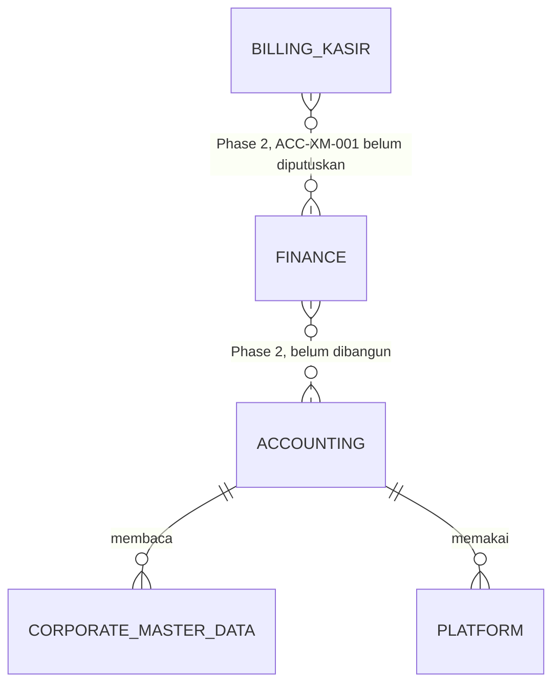
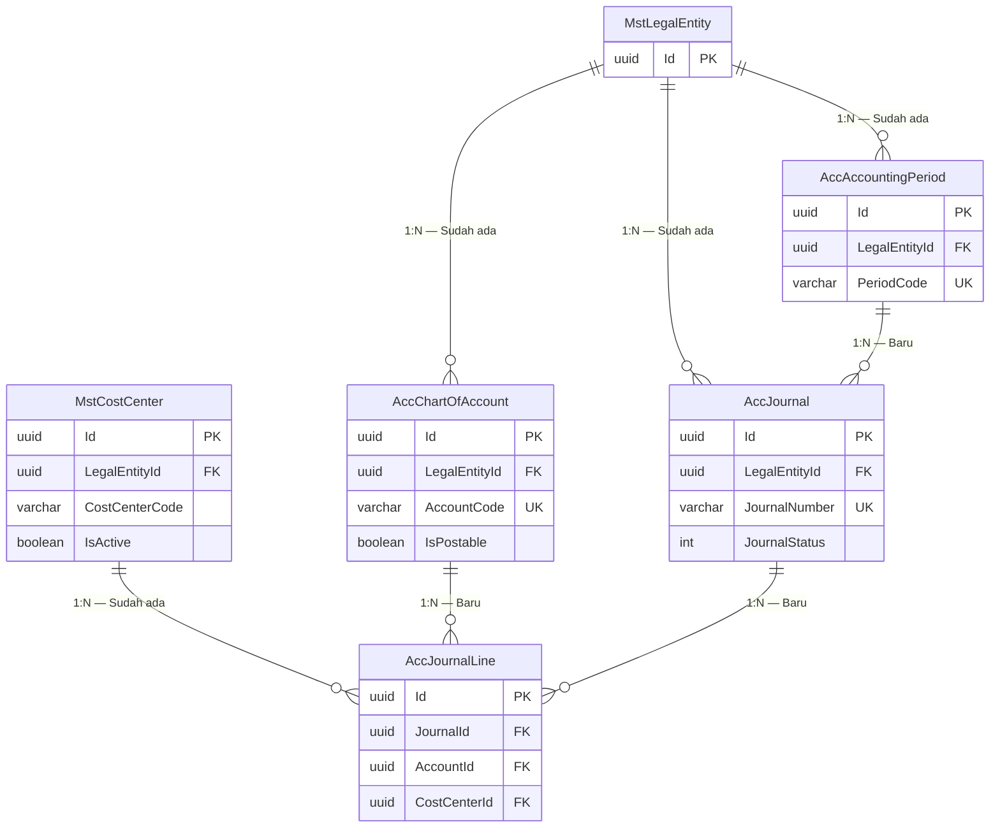

# Accounting — Context ERD

| Field | Value |
|---|---|
| Blueprint ID | `ACC-BP-001` · Revision `3` · Status `draft` |
| Backend SHA | `aa837d784ff51cb2b889cf975ada3a204018f1f5` |
| Cakupan | MVP tulang punggung akuntansi (`ACC-DEC-009`) |

Dokumen ini memetakan **hubungan antar bounded context**, bukan rincian kolom. Rincian kolom ada
di berkas ERD per area dan di [data-dictionary.md](data-dictionary.md).

## Peta ketergantungan antar konteks

Arah panah dibaca sebagai "bergantung kepada". Garis putus-putus berarti belum ada dan belum
diputuskan.

| Konteks | Pemilik | Hubungan dengan Accounting pada MVP |
|---|---|---|
| **Accounting** | Rizki | Konteks yang dirancang di sini |
| Corporate Master Data | Corporate / Human Resource | Accounting **membaca** `MstLegalEntity` dan `MstCostCenter`. Tidak pernah menulis |
| Platform | Tim platform | Accounting memakai mekanisme hak akses dan `LoggerService` |
| Billing dan Kasir | Owner Billing | **Tidak tersentuh pada MVP.** Phase 2 |
| Finance | Belum ditunjuk | **Belum ada.** Phase 2 |

Perlu ditegaskan: pada MVP, Accounting **tidak punya satu pun ketergantungan runtime** kepada
Billing maupun Finance. Modul ini dapat dibangun, dijalankan, dan diuji sampai menghasilkan
neraca saldo tanpa keduanya ada. Inilah yang membuat `ACC-DEC-007` dapat dipenuhi.

## Peta entity lintas konteks

## Tabel status entity

| Entity | Status | Owner | Catatan |
|---|---|---|---|
| `MstLegalEntity` | Sudah ada | Corporate / Master Data | Dirujuk, **MUST NOT** disalin |
| `MstCostCenter` | Sudah ada | Corporate / Human Resource / Master Data / Organization | Dirujuk, **MUST NOT** disalin. Sudah memuat `LegalEntityId` |
| `AccChartOfAccount` | Baru | Accounting | Tabel baru |
| `AccJournalType` | Baru | Accounting | Tabel baru, tidak digambar di peta ini karena tidak lintas konteks |
| `AccAccountingPeriod` | Baru | Accounting | Tabel baru |
| `AccJournal` | Baru | Accounting | Tabel baru |
| `AccJournalLine` | Baru | Accounting | Tabel baru |
| `AccJournalApproval` | Baru | Accounting | Tabel baru, tidak digambar di peta ini karena tidak lintas konteks |

## Mengapa `LegalEntityId` muncul di tiga tabel sekaligus

`ACC-DEC-037` menetapkan pembukuan dipisah per badan hukum. Akibatnya tiga tabel harus membawa
`LegalEntityId` sendiri, bukan menurunkannya lewat relasi:

| Tabel | Alasan membawa `LegalEntityId` sendiri |
|---|---|
| `AccChartOfAccount` | Kode akun unik **per badan hukum**, sehingga kode `1-1001` boleh ada di dua badan hukum sekaligus |
| `AccAccountingPeriod` | Setiap badan hukum menutup bukunya sendiri, pada waktu yang bisa berbeda |
| `AccJournal` | Neraca saldo dihitung per badan hukum, dan penyaringan harus cepat tanpa menelusuri relasi |

**Contoh kenapa ini penting.** Rumah sakit grup punya PT A dan PT B. Keduanya memakai kode akun
`1-1001 Kas Besar`. Tanpa pemisahan per badan hukum, saldo kas keduanya akan tercampur dan
neraca masing-masing PT menjadi salah. Dengan `LegalEntityId`, keduanya adalah dua baris berbeda
pada `AccChartOfAccount` dengan kode yang sama.

`AccJournalLine` **tidak** membawa `LegalEntityId`, karena sudah dipastikan lewat jurnalnya. Ini
disengaja: satu jurnal tidak boleh mencampur dua badan hukum, dan aturan itu ditegakkan pada
tingkat jurnal, bukan pada tingkat baris.

## ERD per area

| Berkas | Isi |
|---|---|
| [01-chart-of-account.md](01-chart-of-account.md) | Daftar akun dan jenis jurnal |
| [02-journal.md](02-journal.md) | Jurnal, baris jurnal, dan riwayat persetujuan |
| [03-accounting-period.md](03-accounting-period.md) | Periode akuntansi |
| [data-dictionary.md](data-dictionary.md) | Kamus data seluruh kolom beserta bentuk DDL |
