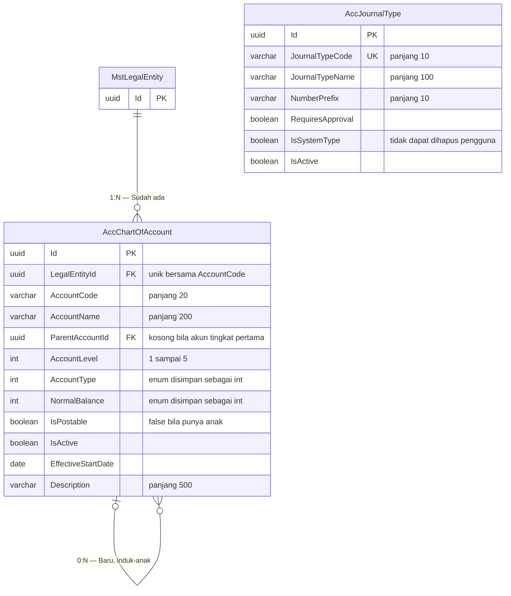

# ERD — Daftar Akun dan Jenis Jurnal

| Field | Value |
|---|---|
| Blueprint ID | `ACC-BP-001` · Revision `3` · Status `draft` |
| Area | Master Data Akuntansi |
| Backend SHA | `aa837d784ff51cb2b889cf975ada3a204018f1f5` |

## Diagram

`AccJournalType` sengaja berdiri sendiri tanpa relasi ke badan hukum. Jenis jurnal bersifat
struktural dan berlaku sama untuk semua badan hukum.

## Tabel status entity

| Entity | Status | Owner | Catatan |
|---|---|---|---|
| `MstLegalEntity` | Sudah ada | Corporate / Master Data | Dirujuk, **MUST NOT** disalin |
| `AccChartOfAccount` | Baru | Accounting | Tabel baru |
| `AccJournalType` | Baru | Accounting | Tabel baru |

## Aturan yang dijaga struktur ini

### Susunan induk-anak dan larangan menerima transaksi

`ParentAccountId` menunjuk ke baris lain pada tabel yang sama. Akun tingkat pertama tidak punya
induk, sehingga kolomnya kosong.

`ACC-DEC-022` melarang akun induk menerima transaksi. Aturannya:

> Sebuah akun boleh bernilai `IsPostable = true` **hanya bila** tidak ada akun lain yang
> menjadikannya induk.

**Contohnya.** Akun `1-1000 Kas dan Setara Kas` memiliki dua anak, yaitu `1-1001 Kas Besar` dan
`1-1002 Kas Kecil`. Karena punya anak, `1-1000` wajib `IsPostable = false`. Petugas yang mencoba
memilihnya pada baris jurnal akan ditolak, dan akun itu tidak muncul pada daftar pilihan akun.

Konsekuensi yang perlu diperhatikan saat implementasi: menambahkan anak baru ke akun yang tadinya
tidak punya anak **harus** mengubah induknya menjadi tidak menerima transaksi. Bila induk itu
sudah terlanjur punya baris jurnal, penambahan anak harus ditolak — jika tidak, saldo lama akan
menggantung pada akun yang tidak lagi boleh menerima transaksi.

### Kode akun unik per badan hukum

Unique index dibentuk dari gabungan `LegalEntityId` dan `AccountCode`, bukan dari `AccountCode`
saja. Ini akibat langsung `ACC-DEC-037`.

**Contohnya.** PT Sehat Sentosa dan PT Sehat Mandiri sama-sama punya akun berkode `1-1001`.
Keduanya adalah dua baris berbeda, dan saldonya tidak pernah tercampur.

### Kode akun tidak boleh berubah setelah dipakai

`ACC-DEC-023`. Pemeriksaannya: sebuah akun boleh mengubah `AccountCode` hanya bila tidak ada satu
pun `AccJournalLine` yang menunjuk akun itu dan jurnalnya berstatus `Posted`.

Baris jurnal yang masih `Draft` tidak menghalangi, karena jurnal draft belum menjadi riwayat
resmi.

### Akun bersaldo tidak boleh dinonaktifkan

`ACC-DEC-024`. Sebelum `IsActive` diubah menjadi salah, sistem menghitung saldo akun itu dari
seluruh baris jurnal berstatus `Posted`. Bila hasilnya bukan nol, permintaan ditolak.

**Contohnya.** Akun `1-1201 Piutang Asuransi X` bersaldo Rp 15.000.000. Petugas ingin
menutupnya karena kerja sama berakhir. Sistem menolak, dan petugas harus memindahkan saldonya
lebih dahulu lewat jurnal, misalnya ke `1-1209 Piutang Lain-lain`. Setelah saldonya nol, akun
baru dapat dinonaktifkan.

### Kewajiban Cost Center diturunkan, bukan disimpan

`ACC-DEC-019` mewajibkan Cost Center pada akun beban. Kewajiban itu **tidak** disimpan sebagai
kolom pada tabel ini, melainkan diturunkan dari `AccountType == Expense`.

Alasannya: kolom tersendiri akan menjadi sumber kebenaran kedua yang bisa bertentangan dengan
jenis akunnya. Bila kelak ada kebutuhan pengecualian per akun, itu keputusan owner baru dan akan
menambah kolom secara sadar, bukan diam-diam.

## Nilai enum

### `AccountType`

| Nilai | Nama | Saldo normal | Masuk laporan |
|---:|---|---|---|
| 1 | `Asset` — Aset | Debit | Neraca |
| 2 | `Liability` — Liabilitas | Kredit | Neraca |
| 3 | `Equity` — Ekuitas | Kredit | Neraca |
| 4 | `Revenue` — Pendapatan | Kredit | Laba Rugi |
| 5 | `Expense` — Beban | Debit | Laba Rugi |

### `NormalBalance`

| Nilai | Nama | Artinya |
|---|---|---|
| 1 | `Debit` | Saldo bertambah di sisi debit |
| 2 | `Credit` | Saldo bertambah di sisi kredit |

`NormalBalance` disimpan sebagai kolom tersendiri walaupun dapat diturunkan dari `AccountType`.
Ini disengaja: sebagian rumah sakit memakai akun kontra, misalnya Akumulasi Penyusutan yang
berjenis aset tetapi bersaldo normal kredit. Menurunkannya dari `AccountType` akan salah pada
kasus itu.

**Contoh akun kontra.** `1-2109 Akumulasi Penyusutan Peralatan Medis` berjenis `Asset` tetapi
`NormalBalance` bernilai `Credit`. Saldonya mengurangi nilai aset, bukan menambah.
