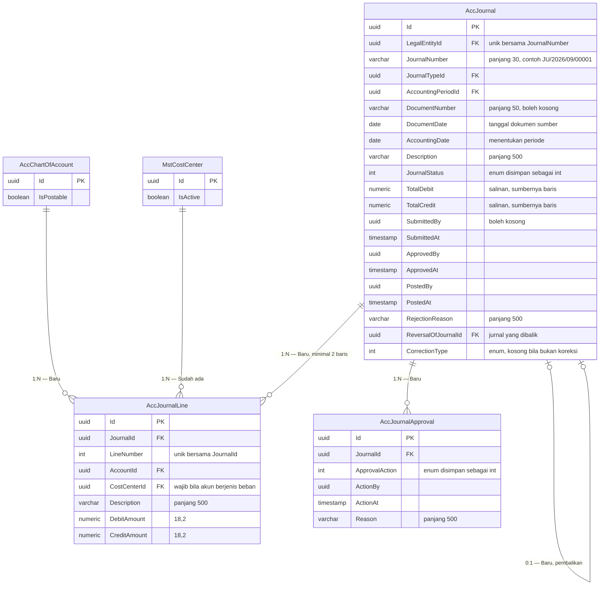

# ERD — Jurnal, Baris Jurnal, dan Riwayat Persetujuan

| Field | Value |
|---|---|
| Blueprint ID | `ACC-BP-001` · Revision `3` · Status `draft` |
| Area | Journal Management |
| Aggregate root | `AccJournal` |
| Backend SHA | `aa837d784ff51cb2b889cf975ada3a204018f1f5` |

## Diagram

## Tabel status entity

| Entity | Status | Owner | Catatan |
|---|---|---|---|
| `AccJournal` | Baru | Accounting | Aggregate root |
| `AccJournalLine` | Baru | Accounting | Tidak punya endpoint sendiri |
| `AccJournalApproval` | Baru | Accounting | Tidak pernah diubah atau dihapus |
| `AccChartOfAccount` | Baru | Accounting | Lihat [01-chart-of-account.md](01-chart-of-account.md) |
| `MstCostCenter` | Sudah ada | Corporate / Human Resource | Dirujuk, **MUST NOT** disalin |

## Aturan yang dijaga struktur ini

### Keseimbangan debit dan kredit

Aturan inti akuntansi, dan invariant paling penting pada modul ini.

> Jumlah seluruh `DebitAmount` pada satu jurnal harus **sama persis** dengan jumlah seluruh
> `CreditAmount` sebelum jurnal boleh diajukan maupun disahkan.

**Contoh yang seimbang.** Jurnal pembelian obat berisi dua baris: debit `5-1001 Beban Obat`
Rp 4.500.000 dan kredit `2-1001 Utang Pemasok` Rp 4.500.000. Total kedua sisi Rp 4.500.000,
sehingga jurnal boleh diajukan.

**Contoh yang tidak seimbang.** Petugas mengisi tiga baris: debit Beban Obat Rp 3.000.000, debit
Beban Alat Habis Pakai Rp 1.500.000, kredit Persediaan Farmasi Rp 4.000.000. Total debit
Rp 4.500.000, total kredit Rp 4.000.000, selisih Rp 500.000. Jurnal tetap **boleh disimpan
sebagai Draft** (`ACC-DEC-025`), tetapi tombol Ajukan tidak aktif sampai selisihnya nol.

Kolom `TotalDebit` dan `TotalCredit` pada `AccJournal` adalah **salinan untuk mempercepat
tampilan daftar**. Nilai yang dipakai memutuskan boleh atau tidaknya pengajuan dan pengesahan
selalu dihitung ulang dari baris, tidak pernah dibaca dari kolom itu.

### Satu baris hanya boleh mengisi satu sisi

Tepat satu dari `DebitAmount` atau `CreditAmount` harus lebih besar dari nol, dan yang lain
bernilai nol. Baris yang mengisi keduanya, atau tidak mengisi keduanya, ditolak.

**Contohnya.** Baris berisi `DebitAmount = 500.000` dan `CreditAmount = 200.000` ditolak.
Bila maksudnya selisih Rp 300.000, petugas harus menuliskannya sebagai satu baris debit
Rp 300.000, atau sebagai dua baris terpisah bila memang dua akun berbeda.

### Minimal dua baris

Sebuah jurnal yang seimbang mustahil hanya punya satu baris, karena satu baris hanya mengisi satu
sisi. Karena itu jurnal wajib punya sekurang-kurangnya dua baris sebelum boleh diajukan.

### Satu jurnal tidak boleh mencampur dua badan hukum

`ACC-DEC-037`. `AccJournalLine` sengaja **tidak** membawa `LegalEntityId` sendiri. Sebagai
gantinya, setiap `AccountId` yang dipakai wajib menunjuk akun yang `LegalEntityId`-nya sama
dengan `LegalEntityId` jurnalnya.

**Contoh yang ditolak.** Jurnal milik PT Sehat Sentosa berisi baris yang menunjuk akun
`1-1001 Kas Besar` milik PT Sehat Mandiri. Permintaan ditolak, karena satu jurnal hanya boleh
menyentuh buku satu badan hukum.

Hal yang sama berlaku untuk `CostCenterId`: Cost Center yang dipilih harus milik badan hukum yang
sama.

### Cost Center wajib pada akun beban

`ACC-DEC-019`. Bila akun yang dipilih berjenis `Expense`, maka `CostCenterId` wajib diisi. Untuk
jenis akun lain, kolom itu boleh kosong.

**Contohnya.** Baris debit `5-1001 Beban Obat` Rp 4.500.000 wajib menyebutkan unit yang
menanggung, misalnya Cost Center `RI-L3` untuk Rawat Inap Lantai 3. Sebaliknya, baris kredit
`2-1001 Utang Pemasok` tidak memerlukannya.

### Nomor jurnal

`ACC-DEC-014`. Bentuknya `{NumberPrefix}/{yyyy}/{MM}/{urutan 5 digit}`, dengan awalan diambil dari
`AccJournalType.NumberPrefix`.

| Bagian | Sumber | Contoh |
|---|---|---|
| Awalan | `AccJournalType.NumberPrefix` | `JU` |
| Tahun | Tahun dari `AccountingDate` | `2026` |
| Bulan | Bulan dari `AccountingDate` | `09` |
| Urutan | Nomor berikutnya untuk kombinasi badan hukum, jenis, tahun, dan bulan | `00001` |

Nomor dibangkitkan **saat penyimpanan**, bukan saat layar dibuka. Tidak ada penguncian antrean
nomor, sehingga beberapa petugas dapat menyimpan bersamaan tanpa saling menunggu.

**Akibat yang disengaja:** nomor bisa terlewat. Bila jurnal `JU/2026/09/00007` dibuat lalu
dihapus saat masih Draft, nomor itu tidak dipakai ulang, dan daftar akan melompat dari `00006`
ke `00008`. Ini wajar secara akuntansi dan sudah disetujui owner.

Unique index tetap dipasang pada gabungan `LegalEntityId` dan `JournalNumber`, sebagai jaring
pengaman bila dua permintaan menghasilkan nomor yang sama pada saat bersamaan. Bila itu terjadi,
satu permintaan gagal dan diulang dengan nomor berikutnya.

### Pembalikan dan koreksi

`ACC-DEC-017` menetapkan dua cara koreksi. Keduanya diwakili `CorrectionType`:

| Nilai | Nama | Dipakai ketika | Bentuk jurnal yang dihasilkan |
|---:|---|---|---|
| 1 | `FullReversal` | Salah akun atau salah pihak | Jurnal baru berjenis `JB` yang membalik seluruh baris asal: debit menjadi kredit dan sebaliknya |
| 2 | `Adjustment` | Salah nominal saja | Jurnal baru berjenis `JP` yang mencatat selisihnya saja |

`ReversalOfJournalId` pada jurnal baru menunjuk jurnal yang dikoreksi. Jurnal asal **tidak
berubah sama sekali** — statusnya tetap `Posted` dan isinya tetap utuh, sesuai `ACC-DEC-006`.

**Contoh pembalikan penuh.** Beban listrik Rp 12.000.000 keliru dicatat ke akun beban air.
Sistem membuat jurnal `JB/2026/09/00001` berisi kredit Beban Air Rp 12.000.000 dan debit Utang
Rp 12.000.000, yaitu kebalikan jurnal asal. Setelah itu petugas membuat jurnal baru yang benar.

**Contoh penyesuaian.** Beban listrik tercatat Rp 12.000.000 padahal seharusnya Rp 12.500.000.
Sistem membuat jurnal `JP/2026/09/00003` berisi debit Beban Listrik Rp 500.000 dan kredit Utang
Rp 500.000. Tidak ada pembalikan penuh, karena akunnya sudah benar.

`ACC-DEC-029` menuntut jurnal pembalik melewati persetujuan baru. Karena itu jurnal pembalik
lahir berstatus `Draft` atau `PendingApproval`, tidak langsung `Posted`.

### Riwayat persetujuan

`AccJournalApproval` mencatat setiap tindakan. Barisnya tidak pernah diubah maupun dihapus.

| Nilai `ApprovalAction` | Nama | `Reason` wajib? |
|---:|---|:---:|
| 1 | `Submitted` — diajukan | Tidak |
| 2 | `Approved` — disetujui | Tidak |
| 3 | `Rejected` — ditolak | **Ya** |
| 4 | `Posted` — disahkan | Tidak |
| 5 | `Reversed` — dibalik | **Ya** |

Tabel ini menjawab pertanyaan audit "siapa menyetujui apa dan kapan" tanpa membaca log teknis.
Ia juga menjadi sumber data bagi pemeriksaan `ACC-DEC-016`: penyetuju tidak boleh sama dengan
pembuat jurnal.

## Nilai enum `JournalStatus`

| Nilai | Nama | Artinya bagi pengguna | Boleh diubah? |
|---:|---|---|:---:|
| 1 | `Draft` | Masih disusun, boleh belum seimbang | Ya |
| 2 | `PendingApproval` | Sudah diajukan, menunggu penyetuju | Tidak |
| 3 | `Approved` | Sudah disetujui, menunggu pengesahan | Tidak |
| 4 | `Posted` | Sudah masuk buku besar, permanen | **Tidak pernah** |
| 5 | `Rejected` | Ditolak penyetuju, kembali dapat disunting | Ya, setelah kembali ke `Draft` |

Rincian perpindahan antar status ada di
[../contracts/state-transition-matrix.md](../contracts/state-transition-matrix.md).

## `AccNumberSeries` — alokator nomor, di luar graf relasi

`AccNumberSeries` **tidak punya relasi** ke tabel mana pun. Ia sengaja berdiri sendiri: ia
menyimpan penghitung nomor, bukan data jurnal. Menautkannya ke `AccJournal` justru akan salah,
karena satu baris deret melayani banyak jurnal dan tetap ada walaupun jurnalnya belum satu pun
dibuat.

| Kolom kunci | Isi |
|---|---|
| `(SequenceKey, ScopeKey)` | Unique. Satu baris untuk satu kombinasi deret dan cakupan reset |
| `CurrentValue` | Penghitung terakhir |

Kolomnya lengkap di [data-dictionary.md](data-dictionary.md) bagian 7; mekanisme alokasinya di
`roadmap/backend-roadmap.md` bagian `BE-ACC-010`.
