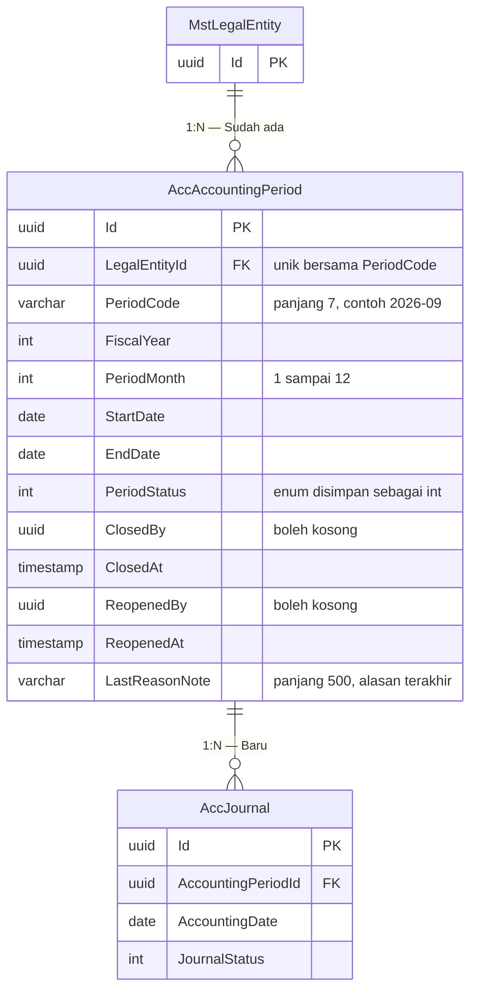

# ERD — Periode Akuntansi

| Field | Value |
|---|---|
| Blueprint ID | `ACC-BP-001` · Revision `3` · Status `draft` |
| Area | Accounting Period |
| Backend SHA | `aa837d784ff51cb2b889cf975ada3a204018f1f5` |

## Diagram

## Tabel status entity

| Entity | Status | Owner | Catatan |
|---|---|---|---|
| `MstLegalEntity` | Sudah ada | Corporate / Master Data | Dirujuk, **MUST NOT** disalin |
| `AccAccountingPeriod` | Baru | Accounting | Tabel baru |
| `AccJournal` | Baru | Accounting | Lihat [02-journal.md](02-journal.md) |

## Aturan yang dijaga struktur ini

### Bentuk periode

`ACC-DEC-013` menetapkan periode bulanan dengan tahun buku mengikuti tahun kalender. Karena itu:

| Kolom | Aturan | Contoh |
|---|---|---|
| `PeriodCode` | `{tahun}-{bulan dua digit}` | `2026-09` |
| `FiscalYear` | Sama dengan tahun kalender | `2026` |
| `PeriodMonth` | 1 sampai 12 | `9` |
| `StartDate` | Tanggal 1 bulan itu | 1 September 2026 |
| `EndDate` | Tanggal terakhir bulan itu | 30 September 2026 |

Satu tahun buku selalu berisi **dua belas** periode. Tidak ada periode ke-13 untuk penyesuaian
akhir tahun — pilihan itu ditolak owner saat menjawab `ACC-OQ-031`.

Dua belas periode dibangkitkan sekaligus per badan hukum lewat satu endpoint, bukan diisi manual
satu per satu. Tahun kabisat ditangani perhitungan tanggal.

### Tiga status dan apa yang boleh dilakukan pada masing-masing

`ACC-DEC-012`. Inilah bagian yang paling sering disalahpahami, jadi ditulis lengkap.

| Nilai | Nama | Jurnal biasa (`JU`) | Jurnal penyesuaian (`JP`) | Jurnal pembalik (`JB`) |
|---:|---|:---:|:---:|:---:|
| 1 | `Open` — Terbuka | **Boleh** | **Boleh** | **Boleh** |
| 2 | `SoftClosed` — Tutup Sementara | Ditolak | **Boleh** | **Boleh** |
| 3 | `Closed` — Tutup Permanen | Ditolak | Ditolak | Ditolak |

Inilah arti `SOFT_CLOSED` yang di `ACC-PRD-001` §18 hanya ditulis "belum approved" dan tidak
dapat diuji. Sekarang dapat diuji: pada Tutup Sementara, jurnal biasa ditolak tetapi jurnal
penyesuaian dan pembalik masih diterima.

**Contoh pemakaiannya.** Tanggal 3 Oktober, akuntansi menutup sementara periode September supaya
tidak ada lagi jurnal operasional baru yang masuk. Selama seminggu berikutnya mereka masih
memasukkan jurnal penyesuaian penyusutan dan koreksi hasil pemeriksaan. Setelah semuanya beres,
tanggal 10 Oktober periode ditutup permanen.

Pemeriksaan ini berlapis dua: pertama status periode, kedua jenis jurnalnya. Itulah yang dimaksud
"pemeriksaan hak akses menjadi dua lapis" pada catatan `ACC-DEC-012`.

### Periode ditentukan dari tanggal akuntansi

`AccJournal.AccountingDate` menentukan `AccountingPeriodId`, bukan sebaliknya. Petugas tidak
memilih periode secara langsung — sistem menemukannya dari tanggal akuntansi dan badan hukum.

**Contohnya.** Jurnal dengan `AccountingDate` 15 September 2026 pada PT Sehat Sentosa akan
menunjuk periode `2026-09` milik PT Sehat Sentosa. Bila periode itu berstatus Tutup Permanen,
pengesahan ditolak dengan pesan yang menyebut nama periodenya, bukan pesan teknis.

### Penutupan dan pembukaan kembali

| Tindakan | Siapa | Alasan wajib? | Keputusan |
|---|---|:---:|---|
| Tutup Sementara | Accounting Manager | Tidak | `ACC-DEC-026` |
| Tutup Permanen | Accounting Manager | Tidak | `ACC-DEC-026` |
| Buka kembali | Accounting Manager | **Ya** | `ACC-DEC-027` |

`LastReasonNote` menyimpan alasan **terakhir** saja. Riwayat lengkap penutupan dan pembukaan
kembali disimpan `LoggerService`, sehingga tabel ini tidak menduplikasi jejak audit.

Ini pilihan sadar: menambah tabel riwayat periode akan menduplikasi apa yang sudah dicatat
platform. Bila kelak riwayat periode perlu ditampilkan ke pengguna di layar — bukan hanya
dibaca auditor — barulah tabel tersendiri dipertimbangkan.

### Setelah dibuka kembali

`ACC-DEC-028`. Periode yang dibuka kembali **tidak** kembali ke `Open`, melainkan ke
`SoftClosed`.

Ini penting dan disengaja. Kembali ke `Open` akan mengizinkan jurnal operasional baru masuk ke
bulan yang laporannya sudah terbit. Kembali ke `SoftClosed` hanya mengizinkan penyesuaian dan
pembalikan — persis yang dituntut `ACC-DEC-028`.

**Contohnya.** Periode `2026-09` sudah Tutup Permanen dan laporannya sudah dikirim ke manajemen.
Ditemukan kesalahan besar. Manager membukanya kembali dengan alasan tertulis. Periode menjadi
Tutup Sementara, sehingga tim akuntansi bisa memasukkan jurnal penyesuaian, tetapi petugas lain
tidak bisa memasukkan jurnal operasional September yang baru.

### Tidak ada batas waktu pembukaan kembali

`ACC-OQ-013` sempat menanyakan apakah ada batas waktu, misalnya periode yang lewat lebih dari 12
bulan tidak boleh dibuka lagi. Owner memilih opsi tanpa batas waktu, cukup dengan alasan tertulis
yang tercatat. Karena itu tidak ada kolom maupun aturan pembatas umur periode.

## Nilai enum `AccountingPeriodStatus`

| Nilai | Nama | Artinya bagi pengguna |
|---:|---|---|
| 1 | `Open` | Terbuka. Semua jenis jurnal boleh disahkan ke periode ini |
| 2 | `SoftClosed` | Tutup Sementara. Hanya penyesuaian dan pembalikan yang diterima |
| 3 | `Closed` | Tutup Permanen. Tidak ada jurnal yang boleh masuk |
