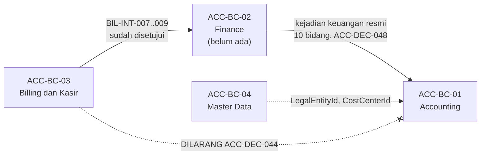
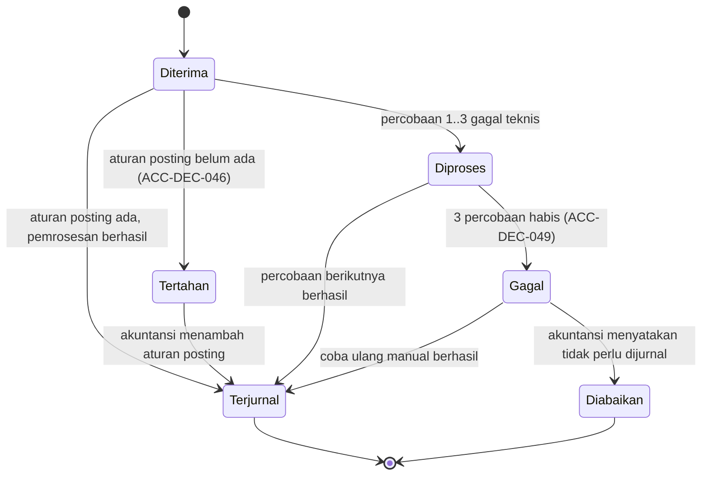

# Accounting Phase 2 — Arsitektur Domain

## A. Identitas arsitektur

| Field | Nilai |
|---|---|
| `blueprint_id` | `ACC-BP-001` |
| Modul / kemampuan | Accounting, fase `ACC-PH-006` |
| Revision arsitektur | `ACC-DOMAIN-P2-0.2` — dinaikkan 8 September 2026 oleh `ACC-DEC-058`, aturan posting menjadi daftar baris. Sebelumnya `0.1` |
| Scope | Empat slice: `ACC-P2-S1` sampai `ACC-P2-S4` |
| Kesiapan requirement | **`READY_FOR_DOMAIN_DESIGN`** — [evidence/08](08-phase2-requirement-completeness-gate.md) |
| Decision ID masukan | `ACC-DEC-044` sampai `ACC-DEC-058` |
| Decision ID yang masih `OPEN` | `DEC-ACC-P2-002` (daftar jenis kejadian), `ACC-XM-001` (ratifikasi lintas modul) |
| Backend SHA | `02c3219`, branch `rizkiG` |
| Baseline rujukan Indonesia | **Tidak dipakai.** Pembukuan berpasangan dan tutup buku tidak khas rumah sakit, dan seluruh aturannya sudah punya keputusan owner yang berwenang |
| Sifat sesi | **Read-only.** Nol source diubah, nol migration, nol endpoint, nol UI, nol commit |
| Tanggal | 8 September 2026 |

### Kenapa sesi arsitektur ini dijalankan, bukan dilewati

Skill `hospital-domain-architect` bersifat opsional. Ia dipakai di sini karena tiga syaratnya
terpenuhi sekaligus:

| Syarat | Terpenuhi? | Buktinya |
|---|---|---|
| Melintasi lebih dari satu bounded context | **Ya** | Menerima kejadian dari Finance, yang menerimanya dari Billing |
| Ada dampak billing yang material | **Ya** | Inilah fase pertama yang membuat tagihan pasien masuk buku besar |
| Lifecycle bercabang dan punya invariant lintas modul | **Ya** | Kejadian bisa berhasil, tertahan, gagal, atau datang terlambat; dan satu tagihan tidak boleh menghasilkan dua jurnal |

MVP dulu **boleh** dirancang tanpa sesi ini karena nol data pasien dan nol integrasi
(`02-backend-architecture.md` bagian 1). Phase 2 membalik keduanya.

---

## B. Ubiquitous language

Istilah di bawah ini punya **satu** makna di seluruh Phase 2. Beberapa sengaja dibedakan tajam
karena sering tertukar dalam percakapan sehari-hari.

| Istilah | Makna bisnisnya | Bukan ini |
|---|---|---|
| **Kejadian keuangan** (*financial event*) | Pemberitahuan resmi bernomor unik bahwa sesuatu yang berakibat keuangan telah terjadi di modul lain | Bukan jurnal, dan bukan tagihan. Ia adalah pesan yang **bisa menjadi** jurnal |
| **Kotak masuk kejadian** | Tempat seluruh kejadian yang diterima Accounting dicatat, berhasil maupun gagal | Bukan antrean sementara. Isinya permanen dan menjadi jejak audit |
| **Aturan posting** (*posting rule*) | Ketetapan baris-baris jurnal yang dihasilkan sebuah jenis kejadian — tiap baris menunjuk komponen nilai, akun, dan sisi debit atau kredit — serta apakah langsung disahkan atau menjadi draft | Bukan jurnal, dan bukan template. Ia hanya kamus penerjemah |
| **Kejadian tertahan** | Kejadian yang **sah** tetapi jenisnya belum punya aturan posting | Berbeda dari kejadian gagal. Yang ini menunggu manusia melengkapi kamus |
| **Kejadian gagal** | Kejadian yang tidak dapat diproses karena gangguan teknis, sesudah tiga kali dicoba | Berbeda dari kejadian tertahan. Yang ini menunggu gangguannya pulih |
| **Jurnal berulang** | Template yang menghasilkan jurnal baru setiap periode, misalnya penyusutan bulanan | Bukan jurnal yang disalin manual |
| **Tutup bulan** | Menyatakan angka satu periode akuntansi final sehingga tidak menerima pencatatan baru | Bukan sekadar mengunci layar |
| **Tutup tahun** | Menolkan saldo akun pendapatan dan beban, lalu memindahkan selisihnya ke laba ditahan | Bukan tutup bulan Desember. Tutup tahun berjalan **sesudah** Desember tertutup |
| **Laba ditahan** | Akun ekuitas tempat laba tahun-tahun sebelumnya menumpuk | Bukan kas, dan bukan laba tahun berjalan |
| **Nomor transaksi asal** | Nomor dokumen di modul penerbit, misalnya nomor tagihan | Bukan pengenal pasien. Untuk tahu ini tagihan siapa, buka modul asalnya (`ACC-DEC-056`) |
| **Pimpinan keuangan** | Sejak `ACC-DEC-055`, ini adalah peran `Accounting Director` | Bukan jabatan bebas. Ia peran yang dapat ditegakkan sistem |

---

## C. Peta bounded context

| ID | Context | Tanggung jawab | Konsep yang dimiliki | Hubungan |
|---|---|---|---|---|
| `ACC-BC-01` | **Accounting** | Mencatat, mengesahkan, dan melaporkan akibat keuangan | Daftar akun, jurnal, periode, jenis jurnal, **dan seluruh konsep baru Phase 2** | **Downstream** terhadap Finance |
| `ACC-BC-02` | **Finance** | Piutang, utang, dan penerbitan kejadian keuangan resmi | Piutang, utang, kejadian keuangan | **Upstream** bagi Accounting. **Belum ada kodenya**, pemilik: Yasmin |
| `ACC-BC-03` | **Billing dan Kasir** | Tagihan pasien, pembayaran, kasir | Faktur, item tagihan, pembayaran | Upstream bagi Finance. **Tidak tersambung ke Accounting** |
| `ACC-BC-04` | **Corporate / Master Data** | Badan hukum, cost center, organisasi | `MstLegalEntity`, `MstCostCenter` | Dipakai Accounting lewat rujukan |
| `ACC-BC-05` | **Platform** | Pengguna, hak akses, jejak audit teknis | Identity, `LoggerService` | Dipakai Accounting apa adanya |

### Bentuk hubungan Finance dan Accounting

Hubungannya adalah **Customer-Supplier dengan Published Language**, bukan sekadar Conformist.
Artinya bentuk pesannya disepakati **bersama** dan dikunci di kontrak, bukan didikte sepihak
oleh Finance. Yang mengunci bentuk itu adalah `ACC-DEC-048` dan `ACC-DEC-060` (dua belas bidang) dan
`ACC-XMOD-0.1`.

Konsekuensi arsitektur yang penting: karena bahasa pesannya disepakati bersama, **Accounting
dapat merancang dan bahkan menguji kotak masuknya sebelum Finance berdiri**, memakai contoh
pesan tiruan. Yang tidak boleh diklaim adalah bahwa integrasinya sudah terbukti sungguhan.

Panah putus-putus dari Billing langsung ke Accounting adalah jalur yang **sengaja ditutup**.
Membukanya membuat satu tagihan Rp 10.000.000 tercatat dua kali menjadi pendapatan
Rp 20.000.000.

---

## D. Katalog konsep domain

Klasifikasi di bawah menggambarkan **tanggung jawab domain**, bukan tabel database. Bentuk fisiknya
ditetapkan `design-business-module`.

### Slice `ACC-P2-S1` — kotak masuk kejadian dan posting otomatis

| ID | Nama bisnis | Klasifikasi | Ownership | Identitas | Invariant utama |
|---|---|---|---|---|---|
| `ACC-DC-01` | Kejadian keuangan diterima | `AGGREGATE_ROOT` | `New` | Nomor kejadian dari penerbit | Satu nomor kejadian hanya boleh menghasilkan **satu** jurnal, selamanya |
| `ACC-DC-02` | Percobaan pemrosesan | `ENTITY` di dalam `ACC-DC-01` | `New` | Nomor urut percobaan | Paling banyak 3 percobaan otomatis (`ACC-DEC-049`) |
| `ACC-DC-03` | Aturan posting | `AGGREGATE_ROOT` | `New` | Jenis kejadian + badan hukum | Seluruh akun barisnya wajib menerima transaksi dan sebadan hukum; aturannya wajib dapat menghasilkan jurnal seimbang |
| `ACC-DC-03a` | Baris aturan posting | `ENTITY` di dalam `ACC-DC-03` | `New` | Aturan + nomor baris | Menunjuk satu komponen nilai, satu akun, dan satu sisi (`ACC-DEC-058`) |
| `ACC-DC-01a` | Rincian nilai kejadian | `ENTITY` di dalam `ACC-DC-01` | `New` | Kejadian + kode komponen | Satu komponen tidak boleh dikirim dua kali dalam satu kejadian |
| `ACC-DC-04` | Jenis kejadian keuangan | `REFERENCE_DATA` | `New` | Kode jenis kejadian | Isinya menunggu `DEC-ACC-P2-002`; **bentuknya** tidak menunggu |
| `ACC-DC-05` | Pesan kejadian keuangan | `EXTERNAL_CONTRACT` | `Adapter/View` | — | Sepuluh bidang wajib terisi (`ACC-DEC-048`) |
| `ACC-DC-06` | Kejadian menghasilkan jurnal | `DOMAIN_EVENT` | `New` | — | Diterbitkan sekali per kejadian yang berhasil |

**Kenapa `ACC-DC-01` sebuah aggregate root sendiri, bukan kolom tambahan pada jurnal.** Karena
lifecycle-nya berbeda dan lebih panjang. Sebuah kejadian bisa hidup berhari-hari dalam keadaan
tertahan **tanpa pernah punya jurnal**. Menempelkannya sebagai kolom `SourceEventId` pada
`AccJournal` akan membuat kejadian tertahan tidak punya tempat tinggal sama sekali. Ini juga yang
sudah diramalkan `04-prd-to-mvp.md` bagian 21: penelusuran ditambahkan **di sisi event**, bukan
dengan mengubah `AccJournal`.

**Kenapa `ACC-DC-03` terpisah dari `ACC-DC-04`.** Jenis kejadian adalah kosakata bersama dengan
Finance; aturan posting adalah kebijakan internal Accounting yang berbeda per badan hukum. PT
Metropolitan Medical Centre dan PT Metropolitan Diagnostic Centre boleh memetakan jenis kejadian
yang sama ke kode akun yang berbeda, karena daftar akunnya memang terpisah (`ACC-DEC-037`).

### Slice `ACC-P2-S2` — jurnal berulang

| ID | Nama bisnis | Klasifikasi | Ownership | Identitas | Invariant utama |
|---|---|---|---|---|---|
| `ACC-DC-07` | Template jurnal berulang | `AGGREGATE_ROOT` | `New` | Kode template + badan hukum | Baris template wajib seimbang, sama seperti jurnal biasa |
| `ACC-DC-08` | Penerbitan template per periode | `ENTITY` di dalam `ACC-DC-07` | `New` | Template + periode | **Satu template hanya boleh terbit sekali per periode** |

`ACC-DC-08` adalah penjaga yang paling mudah dilupakan. Tanpanya, penjadwal yang tidak sengaja
berjalan dua kali akan menghasilkan dua jurnal penyusutan untuk bulan yang sama. Pola penjaganya
sudah ada di repo: `LeaveAccrualSchedulerHostedService` memakai `_lastAutoEnqueueDate` untuk
tujuan yang persis sama.

### Slice `ACC-P2-S3` — tutup bulan

| ID | Nama bisnis | Klasifikasi | Ownership | Identitas | Invariant utama |
|---|---|---|---|---|---|
| `ACC-DC-09` | Riwayat persetujuan penutupan periode | `ENTITY` di dalam `AccAccountingPeriod` | `Extend` | Periode + urutan tindakan | Pengaju penutupan **bukan** penyetujunya |
| `ACC-DC-10` | Daftar penghalang penutupan | `VALUE_OBJECT` **yang dihitung** | `New`, tidak disimpan | — | Dihitung ulang setiap kali diminta |

**`ACC-DC-10` sengaja tidak disimpan.** Ini keputusan arsitektur yang meniru alasan yang sama
dengan buku besar pada MVP: bila daftar penghalang disimpan, ia bisa berselisih dengan keadaan
sebenarnya. Contohnya: daftar disimpan pukul 09.00 menyebut 3 jurnal belum disahkan; pukul 10.00
ketiganya disahkan; bila sistem membaca daftar tersimpan, penutupan tetap ditolak padahal
penghalangnya sudah hilang. Menghitungnya saat diminta membuat keadaan itu mustahil.

**Yang dihitung `ACC-DC-10`** adalah dua penghalang `ACC-DEC-051` — jurnal belum disahkan dan
kejadian gagal — ditambah lima peringatan yang boleh dilewati.

### Slice `ACC-P2-S4` — tutup tahun

| ID | Nama bisnis | Klasifikasi | Ownership | Identitas | Invariant utama |
|---|---|---|---|---|---|
| `ACC-DC-11` | Jenis jurnal `JT` Tutup Tahun | `REFERENCE_DATA` | `Extend` atas `AccJournalType` | Kode `JT` | `RequiresApproval` bernilai benar |
| `ACC-DC-12` | Pengaturan akuntansi per badan hukum | `REFERENCE_DATA` | `New` | Badan hukum | Tepat satu akun laba ditahan per badan hukum |

**Tutup tahun tidak melahirkan aggregate baru.** Jurnal penutup **adalah** jurnal biasa berjenis
`JT`, persis seperti saldo awal yang diwujudkan sebagai jurnal berjenis `SA` pada MVP. Keuntungannya
sama dan besar: jurnal penutup otomatis tunduk pada aturan keseimbangan, otomatis masuk jejak
audit, otomatis tampil di buku besar, dan **otomatis dapat dibalik lewat jalur pembalikan yang
sudah ada** — tanpa satu baris kode khusus.

`ACC-DC-12` diperlukan karena `ACC-DEC-054` menyerahkan kode akun laba ditahan kepada pemilik
proses, sementara sistem tetap harus tahu akun mana yang dituju. Nilainya tidak dapat diturunkan
dari data lain: `AccountType == Equity` saja tidak cukup, sebab akun ekuitas bisa lebih dari satu.

---

## E. Model aggregate

| Aggregate | Batas | Invariant yang dijaga | Perintah bisnis | Domain event |
|---|---|---|---|---|
| **Kejadian keuangan** (`ACC-DC-01`) | Kejadian + seluruh percobaan pemrosesannya | Satu nomor kejadian satu jurnal; paling banyak 3 percobaan otomatis; kejadian tanpa aturan posting tidak menghasilkan jurnal | Terima, Proses, Coba Ulang Manual, Tandai Tertahan | `ACC-DC-06` Kejadian menghasilkan jurnal |
| **Aturan posting** (`ACC-DC-03`) | Aturan + jenis kejadian yang dirujuknya | Akun debit dan kredit wajib menerima transaksi dan sebadan hukum; satu jenis kejadian satu aturan aktif per badan hukum | Buat, Ubah, Nonaktifkan | — |
| **Template jurnal berulang** (`ACC-DC-07`) | Template + baris + riwayat penerbitan | Baris template seimbang; satu terbit per periode | Buat, Ubah, Aktifkan, Terbitkan | — |
| **Periode akuntansi** (existing, diperluas) | Periode + riwayat persetujuan penutupan | Pengaju bukan penyetuju; periode tertutup menolak pencatatan baru | Ajukan Penutupan, Setujui, Tolak, Buka Kembali | — |
| **Jurnal** (existing, tidak berubah bentuk) | Jurnal + baris + riwayat persetujuan | Debit sama dengan kredit; `Posted` tidak dapat diubah | Buat, Ajukan, Setujui, Sahkan, Balik | — |

**Tidak ada satu pun aggregate MVP yang berubah bentuk.** Ini hasil yang disengaja dan sudah
diramalkan `04-prd-to-mvp.md` bagian 21. `AccJournal`, `AccJournalLine`, `AccChartOfAccount`, dan
jalur buku besar tidak disentuh. Yang bertambah hanya lapisan **di atas** jurnal.

### Batas transaksi database

| Operasi | Cakupan satu transaksi | Bila gagal di tengah |
|---|---|---|
| Memproses satu kejadian menjadi jurnal | Ubah status kejadian, buat jurnal beserta barisnya, catat percobaan | Seluruhnya dibatalkan. Kejadian kembali ke keadaan siap dicoba lagi, dan **tidak ada jurnal separuh jadi** |
| Menerbitkan jurnal berulang satu periode | Buat jurnal `Draft` beserta barisnya, catat riwayat penerbitan | Seluruhnya dibatalkan. Riwayat penerbitan tidak tercatat, sehingga periode itu boleh dicoba lagi |
| Menyetujui penutupan periode | Ubah status periode, catat riwayat persetujuan | Status periode tidak berubah sama sekali |
| Menyusun jurnal penutup tahun | Hitung saldo, buat jurnal `JT` beserta seluruh barisnya | Tidak ada jurnal penutup separuh jadi |

---

## F. Model relasi

| Sumber | Tujuan | Makna | Kardinalitas | Wajib? |
|---|---|---|---|---|
| Kejadian keuangan | Jurnal | Kejadian menghasilkan jurnal | `0..1` — satu kejadian paling banyak satu jurnal | Opsional. Kejadian tertahan dan gagal **tidak punya** jurnal |
| Kejadian keuangan | Aturan posting | Kejadian diterjemahkan aturan | `0..1` | Opsional saat diterima; wajib saat diproses |
| Aturan posting | Jenis kejadian | Aturan berlaku untuk satu jenis | `1` | Wajib |
| Aturan posting | Daftar akun | Akun debit dan akun kredit | `2` rujukan | Wajib |
| Template jurnal berulang | Riwayat penerbitan | Template terbit tiap periode | `0..*` | Opsional |
| Riwayat penerbitan | Jurnal | Penerbitan menghasilkan jurnal draft | `1` | Wajib |
| Periode akuntansi | Riwayat persetujuan penutupan | Periode punya jejak penutupan | `0..*` | Opsional |
| Pengaturan akuntansi | Daftar akun | Menunjuk akun laba ditahan | `1` | Wajib sebelum tutup tahun dijalankan |

Kardinalitas `0..1` dari kejadian ke jurnal adalah yang paling menentukan. Ia satu-satunya alasan
mengapa kejadian tertahan dapat hidup di sistem tanpa mengotori buku besar.

---

## G. Model lifecycle

### Kejadian keuangan (`ACC-DC-01`)

| Perpindahan | Wewenang | Prasyarat | Kejadian audit |
|---|---|---|---|
| Diterima → Terjurnal | Sistem | Aturan posting ada, periode menerima | Jurnal tercatat, nomor kejadian tertaut |
| Diterima → Tertahan | Sistem | Aturan posting tidak ada | Dicatat, muncul di daftar periksa penutupan |
| Diproses → Gagal | Sistem | Tiga percobaan habis | Dicatat, penanda jumlah menu bertambah (`ACC-DEC-057`) |
| Gagal → Terjurnal | Accounting Manager | Gangguan sudah pulih | Pelaku dan waktunya dicatat |
| Gagal → Diabaikan | Accounting Manager | **Alasan tertulis wajib** | Alasan disimpan permanen |

**Status `Diabaikan` adalah usulan arsitektur, bukan keputusan owner.** Ia diperlukan karena tanpanya
kejadian gagal yang memang tidak perlu dijurnal — misalnya kejadian uji coba yang terkirim ke
lingkungan produksi — akan menghalangi penutupan bulan selamanya (`ACC-DEC-051`). Lihat
`DEC-ACC-P2-007`.

### Periode akuntansi — perluasan atas lifecycle yang sudah ada

Keadaan sekarang terbaca langsung di source `@02c3219`:
`AccountingPeriodStatus` memuat `Open = 1`, `SoftClosed = 2`, `Closed = 3`.

`ACC-DEC-052` menuntut penutupan disetujui lebih dahulu, sehingga satu status antara dibutuhkan:

| Status | Ada di MVP? | Makna |
|---|:---:|---|
| `Open` | Ya | Menerima pencatatan |
| **`PendingClosingApproval`** | **Tidak — baru** | Accounting Manager sudah mengajukan penutupan, menunggu `Accounting Director` |
| `SoftClosed` | Ya | Tertutup, masih dapat dibuka kembali dengan alasan tertulis (`ACC-DEC-027`) |
| `Closed` | Ya | Tertutup permanen |

Ini **`Extend`**, bukan `New`: nilai enum bertambah, aggregate-nya tetap `AccAccountingPeriod`.

| Perpindahan | Wewenang | Prasyarat |
|---|---|---|
| `Open` → `PendingClosingApproval` | Accounting Manager (`Period : Close`) | Nol penghalang `ACC-DEC-051` |
| `PendingClosingApproval` → `SoftClosed` | **`Accounting Director`** (`Period : Approve`) | Penyetuju **bukan** pengaju |
| `PendingClosingApproval` → `Open` | `Accounting Director` | Penolakan dengan alasan tertulis |
| `SoftClosed` → `Open` | Accounting Manager | Alasan tertulis wajib (`ACC-DEC-027`) |

### Tutup tahun

Tutup tahun **tidak punya lifecycle sendiri**. Ia adalah rangkaian tindakan atas konsep yang sudah
ada:

1. Seluruh periode bulan Januari sampai Desember berstatus `SoftClosed` atau `Closed`.
2. Sistem menghitung saldo seluruh akun `Revenue` dan `Expense` pada tahun tersebut.
3. Sistem menyusun jurnal berjenis `JT` berstatus `Draft` yang menolkan akun-akun itu dan
   memindahkan selisihnya ke akun laba ditahan dari `ACC-DC-12`.
4. Accounting Manager mengesahkannya lewat jalur pengesahan jurnal yang sudah ada.

**Koreksi setelah jurnal penutup disahkan** memakai jalur pembalikan jurnal yang sudah ada
(`ACC-DEC-029`, pembalikan menuntut persetujuan baru). Tidak ada mekanisme "buka kembali tahun
buku" yang perlu dibuat. Ini **usulan arsitektur**, lihat `DEC-ACC-P2-006`.

---

## H. Tanggung jawab authorization

Tujuh peran berlaku sejak `ACC-DEC-055`. Tabel ini menyatakan **batas wewenang bisnis**, bukan
string permission — penulisannya wewenang `design-business-module`.

| Tindakan | Viewer | Staff | Approver | Manager | **Director** | Auditor | Administrator |
|---|:---:|:---:|:---:|:---:|:---:|:---:|:---:|
| Melihat kotak masuk kejadian | ✓ | ✓ | ✓ | ✓ | ✓ | ✓ | ✓ |
| Coba ulang manual kejadian gagal | | | | ✓ | | | ✓ |
| Menandai kejadian Diabaikan | | | | ✓ | | | |
| Mengelola aturan posting | | | | ✓ | | | ✓ |
| Mengelola template jurnal berulang | | | | ✓ | | | ✓ |
| Mengajukan penutupan periode | | | | ✓ | | | |
| **Menyetujui penutupan periode** | | | | | **✓** | | |
| Membuka kembali periode | | | | ✓ | | | |
| Menjalankan penyusunan jurnal tutup tahun | | | | ✓ | | | |
| Mengesahkan jurnal tutup tahun | | | | ✓ | | | |
| Mengubah pengaturan akun laba ditahan | | | | ✓ | | | ✓ |

Dua hal yang membuat tabel ini tidak sekadar rapi:

1. **Baris "Menyetujui penutupan periode" adalah satu-satunya milik `Accounting Director`.**
   Peran itu sengaja dibuat sesempit mungkin supaya tidak menjadi peran serba bisa kedua.
2. **Manager tidak boleh menyetujui penutupan yang ia ajukan sendiri.** Ini penerapan ulang
   `ACC-DEC-016` pada konteks periode, bukan aturan baru.

---

## I. Model audit dan histori

| Kejadian | Yang wajib tersimpan | Berapa lama |
|---|---|---|
| Kejadian keuangan diterima | Nomor kejadian, modul asal, nomor transaksi asal, waktu terima, isi pesan asli | Permanen |
| Setiap percobaan pemrosesan | Nomor percobaan, waktu, hasil, pesan kesalahan | Permanen |
| Kejadian ditandai Diabaikan | Pelaku, waktu, **alasan tertulis** | Permanen |
| Penerbitan jurnal berulang | Template, periode, jurnal yang dihasilkan, waktu | Permanen |
| Pengajuan penutupan periode | Pelaku, waktu, daftar penghalang saat itu | Permanen |
| Persetujuan/penolakan penutupan | Pelaku, waktu, alasan bila menolak | Permanen |
| Pembukaan kembali periode | Pelaku, waktu, alasan tertulis | Permanen |

**Yang tidak boleh masuk catatan `LoggerService`:** nilai uang dan keterangan jurnal. Aturan
`02-backend-architecture.md` bagian 11 berlaku penuh di Phase 2. Nilai uang tetap tersimpan di
data bisnisnya, bukan di log teknis.

**Isi pesan asli disimpan utuh** pada kejadian. Alasannya: ketika Finance dan Accounting berselisih
angka enam bulan kemudian, satu-satunya bukti yang menyelesaikannya adalah pesan apa yang benar-benar
diterima — bukan pesan apa yang seharusnya dikirim.

---

## J. Model integrasi

| Aspek | Ketentuan |
|---|---|
| Arah | Satu arah, Finance → Accounting. Accounting **tidak pernah** menerbitkan kejadian ke modul lain (`ACC-DEC-002`) |
| Pemilik kontrak pesan | Bersama: Rizki dan owner Finance (`ACC-DEC-048`, `ACC-XMOD-0.1`) |
| Idempotency | **Dua kunci** (`ACC-DEC-035`): nomor kejadian sebagai kunci utama, dan gabungan modul asal + nomor transaksi asal + jenis kejadian + versi sebagai jaring pengaman kedua |
| Penanganan gagal | 3 percobaan otomatis dengan jeda naik, lalu daftar gagal (`ACC-DEC-049`) |
| Kejadian telat | Masuk periode terbuka berikutnya, tanggal dokumen asli disimpan (`ACC-DEC-047`) |
| Kejadian tanpa pemetaan | Tertahan, tidak dijurnal, tidak memakai akun sementara (`ACC-DEC-046`) |
| Rekonsiliasi | Daftar kejadian tertahan dan gagal wajib muncul pada daftar periksa penutupan bulan |
| Data pribadi | **Nol.** Hanya modul asal dan nomor transaksi asal (`ACC-DEC-056`) |
| Mata uang | Rupiah saja. Pesan bermata uang lain ditolak (`ACC-DEC-020`) |

### Contoh menyeluruh dengan angka

Tagihan rawat jalan Budi, Rp 10.000.000, penjamin BPJS, badan hukum `LE-MMC-001`.

| Langkah | Yang terjadi | Keadaan kejadian |
|---:|---|---|
| 1 | Kasir menutup tagihan di Billing | — |
| 2 | Billing menyerahkan ke Finance (`BIL-INT-007`) | — |
| 3 | Finance mencatat Piutang Penjamin Rp 10.000.000 | — |
| 4 | Finance menerbitkan `EVT-100`, dua belas bidang terisi termasuk `CorrelationId` ke faktur Billing | `Diterima` |
| 5 | Accounting mencari aturan posting jenis "Pengakuan Piutang" — **ketemu**, dan perlakuannya langsung sahkan | — |
| 6 | Jurnal `JU/2026/09/00042` dibuat: debit `1-1201` Rp 10.000.000, kredit `4-1001` Rp 10.000.000, langsung `Posted` | `Terjurnal` |
| 7 | `EVT-100` terkirim ulang dua kali karena jaringan | Tetap `Terjurnal`, nomor jurnal yang sama dikembalikan, **nol jurnal baru** |

Bila pada langkah 5 aturan postingnya **tidak ketemu** — misalnya jenis kejadian
"Penyusutan Alat Laboratorium Molekuler" yang belum dipetakan — maka kejadian berhenti di
`Tertahan`, nol jurnal dibuat, dan namanya muncul di daftar periksa penutupan September sampai
akuntansi menambah aturannya.

---

## K. Dampak billing

**Ada, dan inilah perubahan terbesar Phase 2.**

| Sebelum Phase 2 | Sesudah Phase 2 |
|---|---|
| Tagihan pasien **tidak pernah** masuk buku besar secara otomatis | Setiap tagihan yang diakui Finance masuk buku besar tanpa campur tangan manusia |
| Setiap jurnal punya satu sumber: manusia yang membuatnya | Jurnal punya dua sumber: manusia, dan kejadian keuangan |
| Salah angka terbatas pada satu jurnal yang dibuat satu orang | Salah **aturan posting** menyebar ke seluruh kejadian sejenis, diam-diam, tanpa error |

Risiko terbesarnya bukan sistem gagal, melainkan **sistem berjalan lancar dengan aturan yang salah**.
Contoh: aturan posting "Pengakuan Piutang" salah menunjuk akun kredit ke `4-1002 Pendapatan Rawat
Inap` alih-alih `4-1001 Pendapatan Rawat Jalan`. Tidak ada satu pun error muncul, buku besar tetap
seimbang, dan laporan pendapatan per unit salah selama berbulan-bulan.

Tiga penjaga yang dirancang untuk itu:

1. **Aturan posting berstatus dan berjejak audit** — setiap perubahan tercatat pelakunya.
2. **Perlakuan berbeda per jenis** (`ACC-DEC-045`) — kejadian bernilai besar dan jarang tetap
   menjadi `Draft` yang dilihat manusia.
3. **Kejadian tanpa aturan ditolak** (`ACC-DEC-046`) — sistem tidak pernah menebak akun.

**Yang belum terjaga dan harus dinyatakan jujur:** tidak ada mekanisme yang mendeteksi aturan posting
yang **ada tetapi salah**. Ia hanya dapat ditemukan dengan membaca laporan. Ini dicatat sebagai
`DEC-ACC-P2-008`.

---

## L. Dampak keselamatan klinis

**Tidak berlaku**, dan alasannya perlu dinyatakan bukan sekadar diklaim.

| Uji | Hasil pada Phase 2 |
|---|---|
| Menyimpan data pasien? | **Tidak.** `ACC-DEC-056` melarang nama, nomor rekam medis, dan nomor kunjungan |
| Memuat isi klinis — diagnosis, obat, hasil pemeriksaan? | Tidak. Yang masuk hanya nilai rupiah dan nomor dokumen |
| Dipakai untuk keputusan perawatan? | Tidak. Keluarannya laporan keuangan |
| Dapatkah kesalahannya menunda layanan pasien? | Tidak. Accounting berada **di hilir**; kegagalannya tidak menahan tagihan maupun layanan |

Poin terakhir adalah sifat arsitektur yang disengaja: karena Accounting hanya membaca kejadian dan
tidak pernah mengembalikan persetujuan ke Finance, matinya Accounting **tidak** menghentikan
pelayanan pasien. Kejadian menumpuk di kotak masuk dan diproses ketika pulih.

Yang tersisa bukan keselamatan klinis melainkan **privasi**, dan itu sudah ditutup `ACC-DEC-056`.

---

## M. Gap arsitektur yang masih terbuka

| ID | Isi | Dampak | Pemilik | Status |
|---|---|---|---|---|
| `DEC-ACC-P2-002` | Daftar jenis kejadian keuangan yang diterbitkan Finance | Isi `ACC-DC-04` dan baris `ACC-DC-03`. **Bentuknya tidak berubah** | Rizki + Yasmin | `OPEN` — menahan go-live, bukan perancangan |
| `DEC-ACC-P2-005` | Isi template jurnal berulang: nominal tetap, atau dihitung dari rumus | Bentuk baris `ACC-DC-07` | Rizki | `OPEN` — usulan: nominal tetap dulu, rumus menyusul |
| ~~`DEC-ACC-P2-006`~~ | ~~Koreksi sesudah jurnal penutup tahun disahkan~~ | Lifecycle `ACC-P2-S4` | Rizki | **`CLOSED` 10 September 2026 — `ACC-DEC-068`.** Usulan arsitekturnya diterima apa adanya: pakai jalur pembalikan `ACC-DEC-029` yang sudah ada, tanpa mekanisme baru |
| `DEC-ACC-P2-007` | Status `Diabaikan` pada kejadian gagal | Lifecycle `ACC-DC-01` dan penghalang tutup bulan | Rizki | `OPEN` — tanpa ini, kejadian gagal yang memang tak perlu dijurnal menahan penutupan selamanya |
| `DEC-ACC-P2-008` | Cara mendeteksi aturan posting yang ada tetapi salah | Mutu angka laporan | Rizki | `OPEN` — usulan: laporan ringkas "jurnal otomatis per aturan posting per periode" |
| `ACC-XM-001` | Ratifikasi `ACC-DEC-044` dan `ACC-DEC-048` | **Implementasi** `ACC-P2-S1` | Owner Billing + Yasmin | `PENDING_RATIFICATION` |
| `ACC-DEP-004` | Modul Finance belum ada | **Implementasi** `ACC-P2-S1` | Yasmin | `MISSING` |

Kelima `DEC-ACC-P2-*` di atas **tidak** memblokir arsitektur, karena tidak satu pun mengubah batas
aggregate, ownership, maupun invariant yang sudah ditetapkan. Seluruhnya menyangkut isi, bukan bentuk.

---

## N. Kesiapan arsitektur

# `DOMAIN_ARCHITECTURE_READY`

| Slice | Kesiapan | Catatan |
|---|---|---|
| `ACC-P2-S1` Kotak masuk kejadian | **`READY`** | Bentuk aggregate, invariant, lifecycle, dan batas integrasi lengkap. Implementasinya menunggu Finance, perancangannya tidak |
| `ACC-P2-S2` Jurnal berulang | **`READY`** | Pola infrastrukturnya sudah terbukti di repo |
| `ACC-P2-S3` Tutup bulan | **`READY`** | Perluasan lifecycle periode dan peran ketujuh sudah ditetapkan |
| `ACC-P2-S4` Tutup tahun | **`READY`** | Tidak melahirkan aggregate baru; memakai ulang jurnal dan jalur pembalikan yang ada |

### Ringkasan dampak pada MVP

| Yang berubah bentuknya | Yang tidak berubah sama sekali |
|---|---|
| `AccountingPeriodStatus` bertambah satu nilai | `AccJournal`, `AccJournalLine`, `AccJournalApproval` |
| `AccJournalType` bertambah satu baris (`JT`) | `AccChartOfAccount` |
| Matriks hak akses bertambah satu peran | Jalur perhitungan buku besar dan neraca saldo |

**Nol tabel MVP dibongkar.** Ini bukan kebetulan — `04-prd-to-mvp.md` bagian 21 sudah merancang
MVP supaya Phase 2 hanya menambah di atasnya.

### Jejak requirement ke domain

| Keputusan | Konsep domain yang lahir |
|---|---|
| `ACC-DEC-044` | Arah integrasi `ACC-BC-02` → `ACC-BC-01`, dan jalur Billing → Accounting ditutup |
| `ACC-DEC-045` | `ACC-DC-03` aturan posting beserta kolom perlakuannya |
| `ACC-DEC-046` | Status `Tertahan` pada `ACC-DC-01` |
| `ACC-DEC-047` | Pemakaian `DocumentDate` yang sudah ada dari `ACC-DEC-040` |
| `ACC-DEC-048` | `ACC-DC-05` kontrak pesan eksternal |
| `ACC-DEC-049` | `ACC-DC-02` percobaan pemrosesan, status `Gagal` |
| `ACC-DEC-050` | `ACC-DC-07` dan `ACC-DC-08` |
| `ACC-DEC-051` | `ACC-DC-10` daftar penghalang yang dihitung |
| `ACC-DEC-052` | `ACC-DC-09` dan status `PendingClosingApproval` |
| `ACC-DEC-053` | `ACC-DC-11` jenis jurnal `JT` |
| `ACC-DEC-054` | `ACC-DC-12` pengaturan akun laba ditahan |
| `ACC-DEC-055` | Peran `Accounting Director` pada bagian H |
| `ACC-DEC-056` | Batas kolom `ACC-DC-01`: nol pengenal pasien |
| `ACC-DEC-057` | Penanda jumlah menu, tanpa Hub baru |

---

## Batas dokumen ini

Dokumen ini **tidak** membuat skema database fisik, migration, endpoint API, komponen UI, maupun
task implementasi. Ia juga tidak menandai approval atas nama siapa pun: keempat slice dinyatakan
siap **secara arsitektur**, dan persetujuan manusia atas blueprint finalnya tetap tindakan
tersendiri. Handoff berikutnya adalah `design-business-module`.
