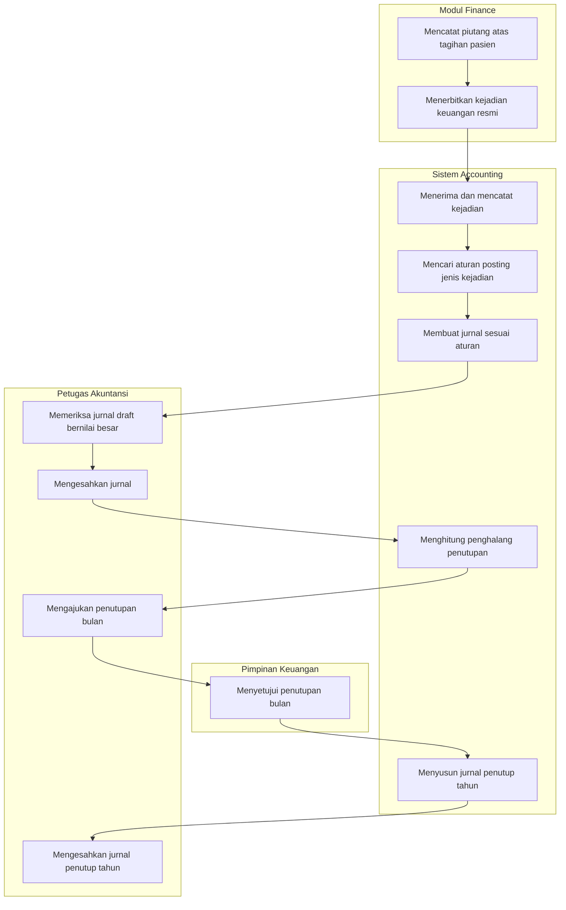

# Accounting Phase 2 — Alur Utama

| Field | Nilai |
|---|---|
| Cakupan | `ACC-PH-006` Phase 2, jalur normal saja |
| Masukan | `ACC-DEC-044` sampai `ACC-DEC-057` |
| Status | `draft` — 8 September 2026 |

Dokumen ini menggambarkan **urutan langkah yang dikerjakan petugas**, bukan bentuk tabel maupun
nama endpoint. Jalur bercabang dan jalur gagalnya ada di berkas terpisah pada folder ini.

## Alur pokok ujung ke ujung

## Tabel langkah

| # | Langkah | Pelaku | Masukan | Keluaran | Bila gagal |
|---:|---|---|---|---|---|
| 1 | Mencatat piutang atas tagihan pasien | Modul Finance | Serah terima dari Billing | Piutang tercatat | Di luar wewenang Accounting |
| 2 | Menerbitkan kejadian keuangan resmi | Modul Finance | Piutang yang baru tercatat | Kejadian bernomor unik | Di luar wewenang Accounting |
| 3 | Menerima dan mencatat kejadian | Sistem | Pesan sepuluh bidang | Kejadian berstatus Diterima | Pesan tidak lengkap ditolak; Finance mengirim ulang setelah diperbaiki |
| 4 | Mencari aturan posting | Sistem | Jenis kejadian | Baris-baris aturan beserta akun dan sisinya | Aturan tidak ada ⇒ kejadian **Tertahan**, lihat `02-kejadian-tertahan.md` |
| 5 | Membuat jurnal | Sistem | Aturan posting dan nilai kejadian | Jurnal, langsung sah atau draft | Gangguan teknis ⇒ lihat `01-kejadian-gagal.md` |
| 6 | Memeriksa jurnal draft bernilai besar | Petugas Akuntansi | Daftar jurnal draft | Jurnal siap disahkan | Salah nilai ⇒ draft diubah atau dihapus |
| 7 | Mengesahkan jurnal | Accounting Manager | Jurnal yang sudah diperiksa | Jurnal masuk buku besar | Ditolak ⇒ kembali ke petugas |
| 8 | Menghitung penghalang penutupan | Sistem | Seluruh jurnal dan kejadian periode itu | Daftar penghalang dan peringatan | — |
| 9 | Mengajukan penutupan bulan | Accounting Manager | Daftar penghalang kosong | Periode menunggu persetujuan | Masih ada penghalang ⇒ lihat `03-tutup-bulan.md` |
| 10 | Menyetujui penutupan bulan | Pimpinan Keuangan | Pengajuan penutupan | Periode tertutup | Ditolak beralasan ⇒ periode kembali terbuka |
| 11 | Menyusun jurnal penutup tahun | Sistem | Seluruh periode setahun tertutup | Jurnal penutup berstatus draft | Ada periode belum tutup ⇒ lihat `04-tutup-tahun.md` |
| 12 | Mengesahkan jurnal penutup tahun | Accounting Manager | Jurnal penutup draft | Laba dipindahkan ke laba ditahan | Salah hitung ⇒ dibalik lewat pembalikan jurnal |

## Berkas alur lainnya

| Berkas | Isi |
|---|---|
| [`01-kejadian-gagal.md`](01-kejadian-gagal.md) | Kejadian gagal diproses, percobaan ulang, dan pengabaian |
| [`02-kejadian-tertahan.md`](02-kejadian-tertahan.md) | Kejadian sah yang jenisnya belum dipetakan |
| [`03-tutup-bulan.md`](03-tutup-bulan.md) | Penutupan bulan beserta penolakan dan pembukaan kembali |
| [`04-tutup-tahun.md`](04-tutup-tahun.md) | Penutupan tahun dan koreksinya |
| [`05-jurnal-berulang.md`](05-jurnal-berulang.md) | Penerbitan jurnal berulang bulanan |
