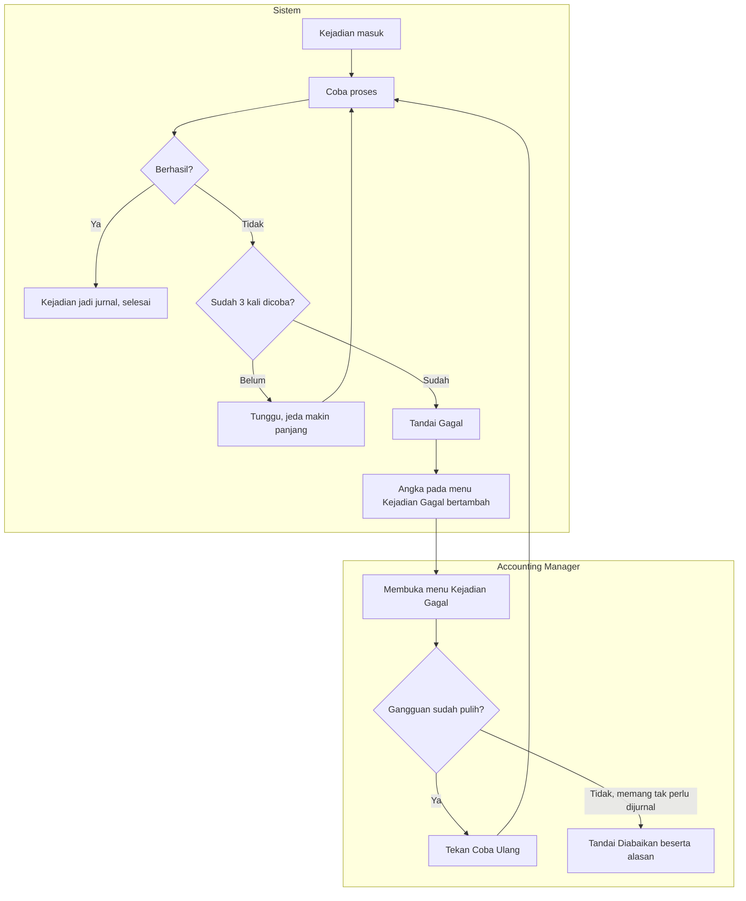

# Alur — Kejadian Keuangan Gagal Diproses

| Field | Nilai |
|---|---|
| Slice | `ACC-P2-S1` |
| Dasar | `ACC-DEC-049`, `ACC-DEC-057`, `DEC-ACC-P2-007` |

Alur ini menangani kejadian yang **tidak dapat diproses karena gangguan teknis** — koneksi
database putus, layanan sedang dimuat ulang, dan sejenisnya. Berbeda dari kejadian **tertahan**,
yang sah tetapi belum punya pemetaan akun; itu ada di [`02-kejadian-tertahan.md`](02-kejadian-tertahan.md).

## Tabel langkah

| # | Langkah | Pelaku | Masukan | Keluaran | Bila gagal |
|---:|---|---|---|---|---|
| 1 | Mencoba memproses kejadian | Sistem | Kejadian yang belum berhasil | Jurnal, atau catatan kegagalan | Lanjut ke percobaan berikutnya |
| 2 | Menunggu sebelum mencoba lagi | Sistem | Nomor percobaan | Jeda yang makin panjang | — |
| 3 | Menandai Gagal sesudah 3 percobaan | Sistem | Tiga catatan kegagalan | Kejadian berstatus Gagal | — |
| 4 | Menambah angka pada menu | Sistem | Jumlah kejadian gagal | Penanda angka terlihat petugas | — |
| 5 | Memeriksa daftar kejadian gagal | Accounting Manager | Daftar beserta pesan kegagalannya | Keputusan: coba ulang atau abaikan | — |
| 6 | Menekan Coba Ulang | Accounting Manager | Kejadian gagal | Kembali ke langkah 1 | Gagal lagi ⇒ kembali berstatus Gagal |
| 7 | Menandai Diabaikan | Accounting Manager | Kejadian gagal **dan alasan tertulis** | Kejadian berstatus Diabaikan, permanen | Alasan kosong ⇒ ditolak |

## Kenapa jedanya dibuat makin panjang

Bila ketiga percobaan dijalankan beruntun dalam hitungan detik, gangguan yang butuh satu menit
untuk pulih akan menghabiskan ketiganya sebelum sempat pulih — dan kejadian yang sebenarnya
baik-baik saja berakhir di daftar gagal. Jeda yang memanjang memberi waktu gangguan sesaat untuk
sembuh sendiri.

## Yang harus diperhatikan petugas

**Menandai Diabaikan tidak dapat dibatalkan.** Bila kejadian itu ternyata memang perlu dijurnal,
satu-satunya jalan adalah meminta Finance menerbitkan ulang dengan nomor kejadian baru. Karena itu
alasan tertulisnya wajib, dan tersimpan permanen.
