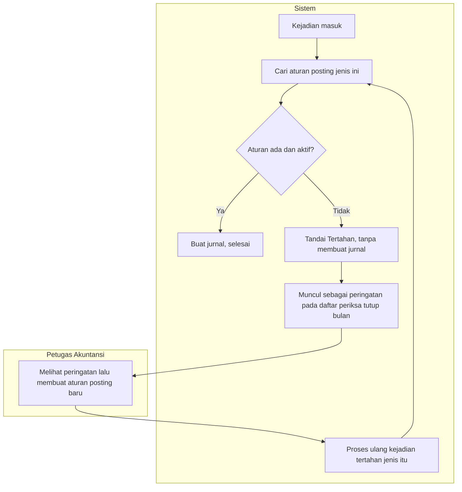

# Alur — Kejadian Sah yang Belum Punya Pemetaan Akun

| Field | Nilai |
|---|---|
| Slice | `ACC-P2-S1` |
| Dasar | `ACC-DEC-046`, `ACC-DEC-051` |

Kejadian **tertahan** adalah kejadian yang sah dan datanya benar, tetapi jenisnya belum pernah
dipetakan ke akun mana pun. Sistem tidak menebak akun, dan tidak memakai akun sementara.

## Tabel langkah

| # | Langkah | Pelaku | Masukan | Keluaran | Bila gagal |
|---:|---|---|---|---|---|
| 1 | Mencari aturan posting | Sistem | Jenis kejadian dan badan hukum | Pasangan akun, atau tidak ketemu | — |
| 2 | Menandai Tertahan | Sistem | Kejadian tanpa aturan | Kejadian tersimpan, **nol jurnal** | — |
| 3 | Menampilkan peringatan | Sistem | Jumlah kejadian tertahan | Peringatan pada daftar periksa penutupan | — |
| 4 | Membuat aturan posting | Petugas Akuntansi | Jenis kejadian, akun debit, akun kredit, perlakuan | Aturan aktif | Akun induk atau beda badan hukum ⇒ ditolak |
| 5 | Memproses ulang kejadian tertahan | Sistem | Kejadian tertahan berjenis sama | Jurnal terbentuk | Gangguan teknis ⇒ masuk alur kejadian gagal |

## Contoh nyata dengan angka

Fixed Asset mengirim kejadian penyusutan Rp 4.000.000 untuk kelompok aset baru
"Alat Laboratorium Molekuler". Jenis kejadian itu belum pernah dipetakan.

| Yang terjadi | Yang **tidak** terjadi |
|---|---|
| Kejadian tersimpan lengkap berstatus Tertahan | Jurnal Rp 4.000.000 **tidak** dibuat |
| Peringatan muncul saat tutup bulan | Akun sementara **tidak** dipakai |
| Setelah akuntansi memetakan ke `5-2001 Beban Penyusutan Alat Lab`, kejadian diproses ulang dan jurnalnya terbentuk | Angka Rp 4.000.000 **tidak** hilang |

## Beda tertahan dan gagal — sering tertukar

| | Tertahan | Gagal |
|---|---|---|
| Sebabnya | Kamus akun belum lengkap | Gangguan teknis |
| Yang menyelesaikan | Petugas akuntansi membuat aturan posting | Gangguan pulih, atau coba ulang manual |
| Menahan tutup bulan? | **Tidak**, hanya peringatan | **Ya** |
| Boleh diabaikan? | **Tidak** | Ya, beserta alasan |
