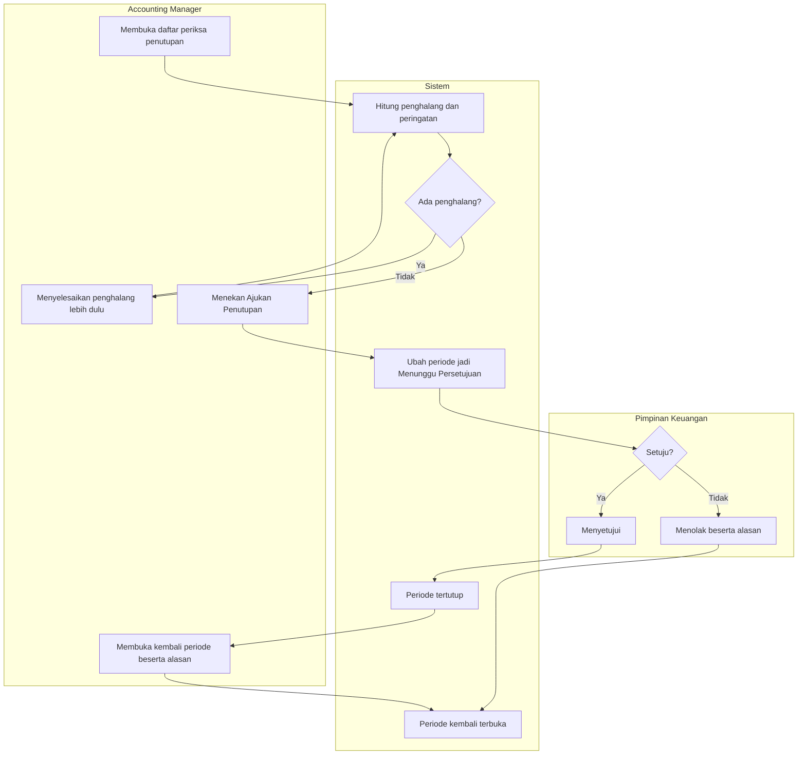

# Alur — Penutupan Bulan

| Field | Nilai |
|---|---|
| Slice | `ACC-P2-S3` |
| Dasar | `ACC-DEC-051`, `ACC-DEC-052`, `ACC-DEC-055`, `ACC-DEC-027` |

## Tabel langkah

| # | Langkah | Pelaku | Masukan | Keluaran | Bila gagal |
|---:|---|---|---|---|---|
| 1 | Membuka daftar periksa penutupan | Accounting Manager | Periode yang hendak ditutup | Daftar penghalang dan peringatan | — |
| 2 | Menghitung penghalang | Sistem | Seluruh jurnal dan kejadian periode itu | Dua penghalang, lima peringatan | — |
| 3 | Menyelesaikan penghalang | Accounting Manager | Jurnal belum sah, kejadian gagal | Penghalang berkurang | Tidak dapat diselesaikan ⇒ penutupan tertunda |
| 4 | Mengajukan penutupan | Accounting Manager | Daftar penghalang kosong | Periode Menunggu Persetujuan | Masih ada penghalang ⇒ tombol Ajukan mati |
| 5 | Menyetujui penutupan | Pimpinan Keuangan | Pengajuan | Periode Tertutup Sementara | Penyetuju sama dengan pengaju ⇒ ditolak sistem |
| 6 | Menolak penutupan | Pimpinan Keuangan | Pengajuan **dan alasan tertulis** | Periode kembali terbuka | Alasan kosong ⇒ ditolak |
| 7 | Membuka kembali periode | Accounting Manager | Periode tertutup **dan alasan tertulis** | Periode terbuka lagi | Alasan kosong ⇒ ditolak |

## Dua penghalang, lima peringatan

| Hal | Menahan penutupan? | Kenapa |
|---|:---:|---|
| Jurnal belum disahkan | **Ya** | Angka laporan pasti berubah bila jurnal itu disahkan setelah periode ditutup |
| Kejadian keuangan **Gagal** | **Ya** | Ada angka yang seharusnya masuk tetapi belum masuk |
| Jurnal belum seimbang | Tidak | Jurnal timpang memang sudah tidak dapat diajukan maupun disahkan (`ACC-DEC-025`) |
| Kejadian **Tertahan** | Tidak, peringatan | Menunggu petugas melengkapi kamus akun |
| Penyusutan belum dijalankan | Tidak, peringatan | Dapat ditindaklanjuti tanpa menahan penutupan |
| Saldo di akun sementara | Tidak, peringatan | Accounting tidak memakai akun sementara (`ACC-DEC-046`) |
| Selisih saldo awal dan akhir | Tidak, peringatan | Perlu diperiksa, tetapi bukan penghalang |

## Kenapa penyetujunya harus orang lain

Bila Accounting Manager boleh menyetujui pengajuannya sendiri, persetujuan itu tidak menambah
apa pun selain satu klik. Yang dijaga bukan kerapian, melainkan adanya **orang kedua** yang
menyatakan angka bulan itu memang final. Aturan yang sama sudah dipakai pada pengesahan jurnal
sejak MVP (`ACC-DEC-016`).
