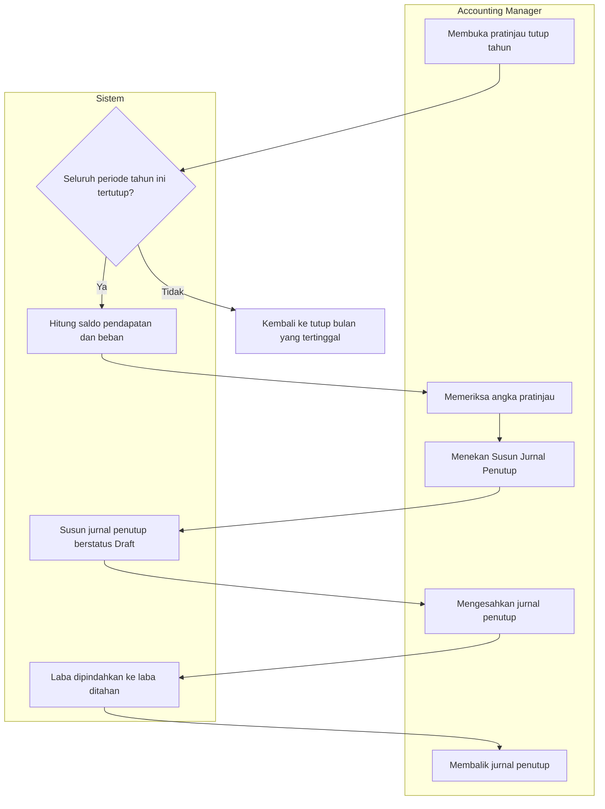

# Alur — Penutupan Tahun

| Field | Nilai |
|---|---|
| Slice | `ACC-P2-S4` |
| Dasar | `ACC-DEC-053`, `ACC-DEC-054`, `ACC-DEC-029` |

Pada akhir tahun, saldo seluruh akun pendapatan dan beban dinolkan, dan selisihnya — laba atau
rugi tahun itu — dipindahkan ke akun laba ditahan.

## Tabel langkah

| # | Langkah | Pelaku | Masukan | Keluaran | Bila gagal |
|---:|---|---|---|---|---|
| 1 | Membuka pratinjau tutup tahun | Accounting Manager | Tahun buku dan badan hukum | Rincian saldo tiap akun | — |
| 2 | Memeriksa seluruh periode tertutup | Sistem | Dua belas periode tahun itu | Boleh lanjut, atau ditolak | Ada yang terbuka ⇒ tutup bulannya lebih dulu |
| 3 | Menghitung saldo pendapatan dan beban | Sistem | Baris jurnal disahkan sepanjang tahun | Saldo per akun dan selisihnya | Akun laba ditahan belum ditetapkan ⇒ ditolak |
| 4 | Memeriksa angka pratinjau | Accounting Manager | Rincian perhitungan | Keputusan lanjut atau tidak | Angka janggal ⇒ periksa jurnal, jangan disusun dulu |
| 5 | Menyusun jurnal penutup | Accounting Manager | Hasil perhitungan | Jurnal draft berjenis Tutup Tahun | Sudah pernah disusun ⇒ ditolak |
| 6 | Mengesahkan jurnal penutup | Accounting Manager | Jurnal draft | Laba masuk laba ditahan | Salah ⇒ jangan disahkan, hapus drafnya |
| 7 | Membalik jurnal penutup | Accounting Manager | Jurnal penutup yang sudah sah | Jurnal pembalik | Menuntut persetujuan baru (`ACC-DEC-029`) |

## Contoh nyata dengan angka

Badan hukum `LE-MMC-001`, tahun buku 2026. Sepanjang tahun tercatat:

| Kelompok | Akun | Saldo |
|---|---|---:|
| Pendapatan | `4-1001 Pendapatan Rawat Jalan` | Rp 800.000.000 |
| Pendapatan | `4-1002 Pendapatan Rawat Inap` | Rp 500.000.000 |
| Beban | `5-1001 Beban Obat` | Rp 300.000.000 |
| Beban | `5-2001 Beban Gaji` | Rp 600.000.000 |

Laba tahun 2026 adalah Rp 1.300.000.000 dikurangi Rp 900.000.000, yaitu **Rp 400.000.000**.

Jurnal penutup yang disusun sistem:

| Akun | Debit | Kredit |
|---|---:|---:|
| `4-1001 Pendapatan Rawat Jalan` | Rp 800.000.000 | |
| `4-1002 Pendapatan Rawat Inap` | Rp 500.000.000 | |
| `5-1001 Beban Obat` | | Rp 300.000.000 |
| `5-2001 Beban Gaji` | | Rp 600.000.000 |
| `3-3001 Laba Ditahan` | | Rp 400.000.000 |
| **Total** | **Rp 1.300.000.000** | **Rp 1.300.000.000** |

Sesudah jurnal ini disahkan, keempat akun pendapatan dan beban bersaldo nol, siap menampung
tahun 2027.

## Bila ada jurnal Desember yang terlewat

Ini pertanyaan yang paling sering muncul, dan jawabannya **tidak** membuka kembali tahun buku.
Karena jurnal penutup adalah jurnal biasa, koreksinya memakai jalur yang sudah ada:

1. Balik jurnal penutup 2026 lewat pembalikan jurnal — menuntut persetujuan baru.
2. Buka kembali periode Desember 2026 beserta alasan tertulis, masukkan jurnal yang terlewat,
   lalu tutup lagi.
3. Susun ulang jurnal penutup 2026.

**Diratifikasi owner 10 September 2026** — `ACC-DEC-068`, menutup `DEC-ACC-P2-006`. Sudah terbukti berjalan pada acceptance (6) `BE-ACC-P2-010`.

**Satu urutan yang wajib diperhatikan.** Tutup **sementara** seluruh bulan, jalankan tutup tahun, **baru** tutup permanen. Menutup Desember secara permanen lebih dahulu akan mengunci tutup tahun selamanya: periode `Closed` tidak menerima jurnal apa pun, termasuk jurnal penutupnya sendiri (`ACC-DEC-067`).
