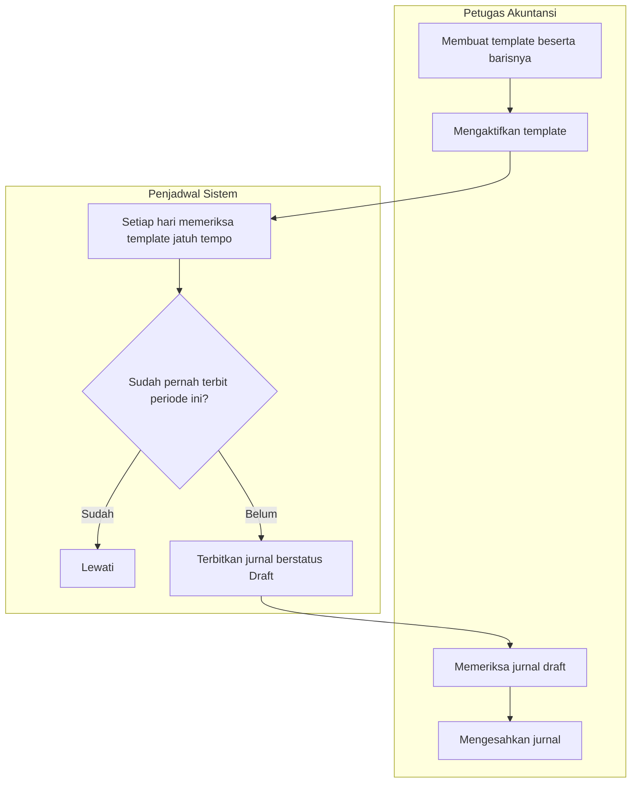

# Alur — Jurnal Berulang

| Field | Nilai |
|---|---|
| Slice | `ACC-P2-S2` |
| Dasar | `ACC-DEC-050` |

Jurnal berulang dipakai untuk pencatatan yang bentuknya sama setiap bulan: penyusutan aset tetap,
sewa dibayar di muka, amortisasi, dan sejenisnya.

## Tabel langkah

| # | Langkah | Pelaku | Masukan | Keluaran | Bila gagal |
|---:|---|---|---|---|---|
| 1 | Membuat template | Petugas Akuntansi | Akun, nominal, cost center, tanggal terbit | Template berstatus tidak aktif | Baris tidak seimbang ⇒ ditolak |
| 2 | Mengaktifkan template | Accounting Manager | Template yang sudah diperiksa | Template aktif | — |
| 3 | Memeriksa template jatuh tempo | Penjadwal | Tanggal hari ini | Daftar template yang harus terbit | — |
| 4 | Memeriksa riwayat penerbitan | Penjadwal | Template dan periode berjalan | Sudah pernah atau belum | — |
| 5 | Menerbitkan jurnal | Penjadwal | Baris template | Jurnal draft | Periode tidak menerima ⇒ dilewati, dicoba periode berikutnya |
| 6 | Memeriksa jurnal draft | Petugas Akuntansi | Jurnal yang baru terbit | Jurnal siap disahkan | Nominal berubah ⇒ ubah drafnya, lalu perbaiki templatenya |
| 7 | Mengesahkan jurnal | Accounting Manager | Jurnal draft | Jurnal masuk buku besar | — |

## Kenapa pengesahannya tetap manual

Penyusutan sebuah alat kesehatan berubah ketika alat itu dijual, rusak, atau habis masa
manfaatnya. Bila sistem mengesahkan sendiri, template yang sudah tidak sesuai akan terus mencatat
beban yang tidak ada — dan karena angkanya wajar, tidak ada yang curiga sampai audit tahunan.
Meminta manusia menekan tombol sekali sebulan adalah harga yang murah untuk mencegahnya.

## Penjaga terbit ganda

Bila penjadwal berjalan dua kali karena layanan dimuat ulang, langkah 4 mencegah jurnal kedua
terbentuk. Penjaganya bukan hanya di kode, melainkan **di database** — satu template hanya boleh
punya satu catatan penerbitan per periode. Ini penting karena dua proses yang berjalan bersamaan
dapat sama-sama lolos pemeriksaan di kode, tetapi tidak dapat sama-sama lolos dari database.
