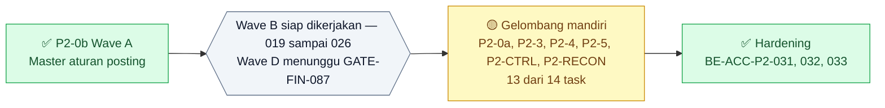
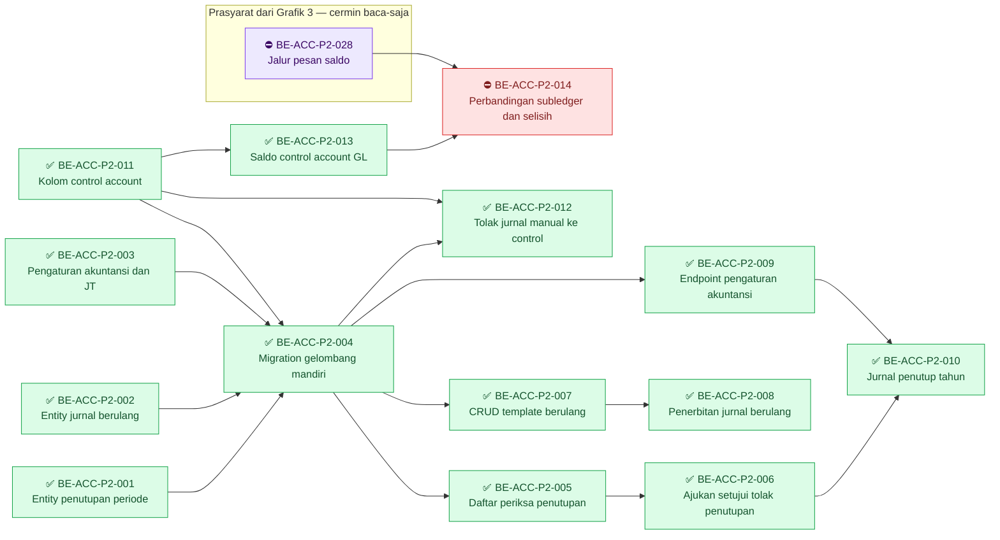
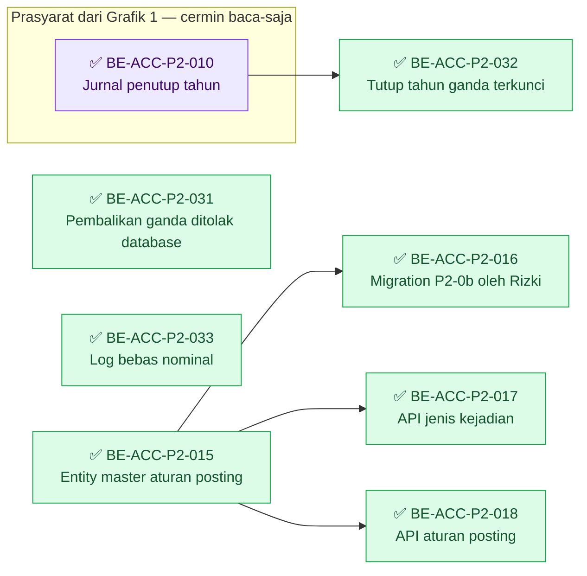
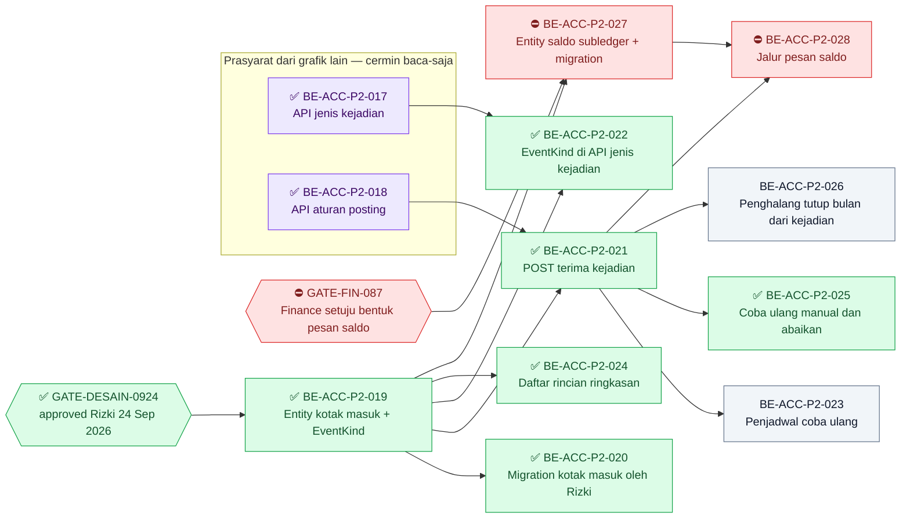

# Roadmap Delivery Backend — Accounting Phase 2 (gelombang mandiri)

## Metadata

```yaml
blueprint_id: ACC-BP-001
blueprint_revision: 11
blueprint_status: approved            # Phase 2 disetujui Rizki, 8 September 2026
roadmap_revision: 4                   # DRAFT 24 Sep 2026 - ACC-DEC-082..091: Wave B (019-026) + Wave D (027-028); revisi 3 APPROVED 14 Sep 2026
roadmap_status: APPROVED              # revisi 4 approved Rizki 24 Sep 2026 lewat GATE-DESAIN-0924; Wave D tetap menunggu GATE-FIN-087
approved_by: [Rizki]
approved_at: 2026-09-14               # revisi 3; revisi 2 disetujui 2026-09-09
source_backend: b3ab542e              # revisi 3; revisi 1-2 disusun di atas 02c3219
source_frontend: f6b1498fe            # revisi 3; revisi 1-2 disusun di atas e732424eb
decision_revision: 9                  # 00-interview-decisions.md revisi 9, ACC-DEC-044 sampai ACC-DEC-081
contracts: [ACC-API-0.10, ACC-STATE-0.3, ACC-VALIDATION-0.6, ACC-PERMISSION-0.5, ACC-INTEGRATION-0.3, ACC-XMOD-0.1, ACC-TEST-0.1]
contracts_proposed: [ACC-API-0.11, ACC-VALIDATION-0.7, ACC-PERMISSION-0.6]   # usulan, belum diratifikasi
scope_waves: [P2-0a, P2-3, P2-4, P2-5, P2-CTRL, P2-RECON, HARDENING, P2-0b]
excluded_waves: [POST-MVP]             # P2-1, P2-2, Wave D masuk revisi 4 (DRAFT); OD-ACC-01 gugur ACC-DEC-082
acceptance_policy: automated test bukan acceptance criterion (ACC-DEC-081)
```

**Arti tanda status pada dokumen ini.**

| Tanda | Artinya |
| :---: | --- |
| ✅ | Selesai. Acceptance criteria dan DoD **terbukti**, buktinya ada pada laporan task |
| 🟡 | Sebagian. Source-nya sudah ada, tetapi acceptance criteria belum terbukti penuh. **Belum selesai** |
| ⛔ | Terblokir. Prasyaratnya belum terpenuhi, dan task **tidak boleh dimulai** |
| tanpa tanda | Belum dikerjakan |

## Grafik Urutan Dependency

Roadmap ini memuat 31 task, melebihi batas 15 node per grafik. Karena itu grafiknya dipecah
menjadi satu grafik ringkasan antar-slice, lalu tiga grafik task: **gelombang mandiri** (14 task
lama), **batch 14 September 2026** (7 task), dan **Grafik 3 — Wave B dan Wave D** (10 task
revisi 4, `DRAFT`, di bagian amandemen 24 September 2026 pada akhir dokumen). Satu-satunya panah yang melintasi kedua
grafik — `BE-ACC-P2-010` ke `BE-ACC-P2-032` — digambar pada grafik kedua sebagai cermin baca-saja
berkelas `luar`; node aslinya tetap tinggal di grafik pertama.

### Ringkasan antar-slice



`BE-ACC-P2-014` — satu-satunya task gelombang mandiri yang belum dikerjakan — menunggu gelombang
`P2-1`, itulah panah dari blocker ke gelombang mandiri. Wave A tidak menunggu siapa pun; ia justru
prasyarat bagi `P2-1` begitu keputusan lintas modul turun.

### Grafik 1 — gelombang mandiri



| Gelombang | Boleh mulai setelah | Task |
| ---: | --- | --- |
| 1 | — | `BE-ACC-P2-001` ✅, `002` ✅, `003` ✅, `011` ✅ |
| 2 | `001`, `002`, `003`, `011` | `BE-ACC-P2-004` ✅, `013` ✅ |
| 3 | `004` | `BE-ACC-P2-005` ✅, `007` ✅, `009` ✅, `012` ✅ |
| 4 | `005`, `007` | `BE-ACC-P2-006` ✅, `008` ✅ |
| 5 | `006`, `009` | `BE-ACC-P2-010` ✅ |
| — | ⛔ menunggu `BE-ACC-P2-028` (Grafik 3) dan `013` ✅ — revisi 4, 24 Sep 2026 | `BE-ACC-P2-014` |

### Grafik 2 — batch 14 September 2026: hardening dan Wave A



| Gelombang batch | Boleh mulai setelah | Task |
| ---: | --- | --- |
| 1 | — (`BE-ACC-P2-010` ✅ sudah selesai) | `BE-ACC-P2-031`, `032`, `033`, `015` — boleh paralel |
| 2 | `BE-ACC-P2-015` | `BE-ACC-P2-016` (dibuat Rizki), `017`, `018` — boleh paralel |

**Catatan runtime, bukan dependency pembangunan.** `017` dan `018` dapat ditulis dan dikompilasi
begitu `015` ada. Endpoint-nya baru **dapat dipanggil** sesudah migration `016` diterapkan Rizki —
sebelum itu tabelnya belum ada dan permintaan akan gagal `500` (`42P01: relation does not exist`).
`031` juga membawa satu perubahan index yang baru berlaku di database sesudah migration dibuat dan
diterapkan Rizki; perubahan itu **boleh digabung** dengan migration `016`.

## Baca ini lebih dahulu

Roadmap ini **hanya** mencakup tiga gelombang yang **tidak menyentuh modul Finance sama sekali**:
jurnal berulang, tutup bulan, dan tutup tahun. Kotak masuk kejadian keuangan (`P2-1`, `P2-2`)
sengaja **tidak** direncanakan di sini, dan alasannya bukan karena terblokir teknis — melainkan
karena isinya bergantung pada `DEC-ACC-P2-002` dan ratifikasi `ACC-XM-001` yang belum ada.

### Koreksi dependency terhadap `04-prd-to-mvp.md` bagian 28

Dokumen PRD menulis `P2-3` bergantung pada `P2-0`. **Diperiksa ulang saat menyusun roadmap ini:
tidak benar.** Template jurnal berulang menunjuk `AccJournalType` yang **sudah terisi empat baris**
(`JB`, `JP`, `JU`, `SA`) sejak `ACC-TD-011` ditutup 3 September 2026. Ia tidak membutuhkan
`AccEventType` maupun `AccPostingRule`.

Dependency yang benar:

| Gelombang | Butuh apa dari `P2-0` | Keterangan |
|---|---|---|
| `P2-3` jurnal berulang | **Tidak ada** | Sepenuhnya mandiri |
| `P2-4` tutup bulan | **Tidak ada** | Sepenuhnya mandiri, hanya memperluas `AccAccountingPeriod` |
| `P2-5` tutup tahun | `AccAccountingConfiguration` dan jenis jurnal `JT` | Disebut `P2-0a` di roadmap ini |

Karena itu `P2-0` **dipecah**: bagian `P2-0a` yang mandiri masuk roadmap ini; bagian `P2-0b`
(`AccEventType`, `AccPostingRule`, `AccPostingRuleLine`) tetap di luar lingkup.

### Batas wewenang roadmap ini

Approval blueprint memberi wewenang **source model persisted**. Ia **tidak** otomatis mengizinkan:

- `dotnet ef migrations add` maupun `dotnet ef database update`;
- perubahan shared database;
- deployment.

`BE-ACC-P2-004` adalah satu-satunya task migration, dan ia **bergerbang**: menuntut instruksi
eksplisit terpisah dari owner beserta Migration Coordination Gate
([`06-shared-migration-coordination-rule.md`](../06-shared-migration-coordination-rule.md)).

### Catatan yang mengikat setiap task backend

QBE preflight dan kesesuaian engineering diselesaikan **pada waktu eksekusi** dari `AGENTS.md`
backend beserta dokumen engineering canonical, bukan diputuskan di roadmap ini. Prefix `Acc`
sudah `ACTIVE` di registry sejak `ACC-DEC-038`.

Pola yang wajib diikuti, diwarisi dari `BE-ACC-007`:

- Controller → Service → `ApplicationDbContext`. **Jangan** meniru `CostCenterController`.
- `AccountingServiceResult<T>` dipetakan lewat `ToActionResult`.
- Pencarian memakai `ToLower().Contains()`, **bukan** `EF.Functions.ILike`.
- Logika yang dipakai lebih dari satu service dibuat `public static` menerima
  `ApplicationDbContext`, bukan registrasi DI baru.

---

## Ringkasan task

| ID | Judul | Gelombang | Dependency | Status |
|---|---|---|---|---|
| `BE-ACC-P2-001` ✅ | Entity dan enum penutupan periode | `P2-4` | — | **`DONE`** 9 Sep 2026 |
| `BE-ACC-P2-002` ✅ | Entity dan enum jurnal berulang | `P2-3` | — | **`DONE`** 9 Sep 2026 |
| `BE-ACC-P2-003` ✅ | Entity pengaturan akuntansi dan jenis jurnal `JT` | `P2-0a` | — | **`DONE`** 9 Sep 2026 |
| `BE-ACC-P2-004` ✅ | **Migration gelombang mandiri** | ketiganya | `001` ✅, `002` ✅, `003` ✅, `011` ✅ | **`DONE`** 9 Sep 2026 — diterapkan owner |
| `BE-ACC-P2-005` ✅ | Daftar periksa penutupan | `P2-4` | `004` ✅ | **`DONE`** 14 Sep 2026 atas `ACC-DEC-081` — sebelumnya `SEBAGIAN` 9 Sep 2026 hanya karena test PostgreSQL |
| `BE-ACC-P2-006` ✅ | Ajukan, setujui, tolak penutupan | `P2-4` | `005` ✅ | **`DONE`** 14 Sep 2026 atas `ACC-DEC-081` — jalan pintas `close` sudah ditutup 9 Sep 2026; satu-satunya sisa dulu test PostgreSQL |
| `BE-ACC-P2-007` ✅ | CRUD template jurnal berulang | `P2-3` | `004` ✅ | **`DONE`** 10 Sep 2026 |
| `BE-ACC-P2-008` ✅ | Penerbitan jurnal berulang dan penjadwalnya | `P2-3` | `007` ✅ | **`DONE`** 10 Sep 2026 — konkurensi terbukti di PostgreSQL |
| `BE-ACC-P2-009` ✅ | Endpoint pengaturan akuntansi | `P2-0a` | `004` ✅ | **`DONE`** 9 Sep 2026 |
| `BE-ACC-P2-010` ✅ | Pratinjau dan penyusunan jurnal penutup tahun | `P2-5` | `006` ✅, `009` ✅ | **`DONE`** 14 Sep 2026 atas `ACC-DEC-081` — 6 dari 6 acceptance terbukti 10 Sep 2026; sisa dulu hanya test PostgreSQL |
| `BE-ACC-P2-011` ✅ | **Kolom control account pada daftar akun** | `P2-CTRL` | — | **`DONE`** 9 Sep 2026 |
| `BE-ACC-P2-012` ✅ | **Penolakan jurnal manual ke control account** | `P2-CTRL` | `004` ✅, `011` ✅ | **✅ `DONE`** 14 Sep 2026 atas `ACC-DEC-081` (verifikasi otomatis dikecualikan dari DoD; jurnal `JT` tetap UAT follow-up). **Riwayat:** 🟡 `SEBAGIAN` 11 Sep 2026 — uji manual PostgreSQL S1–S8 dan A–D: acceptance (1), (3), (4) terbukti di runtime; (2) kecuali jurnal `JT`; build `Release` dan uji SQLite belum diverifikasi. **Keputusan owner 11 Sep 2026:** Implementation `COMPLETE` · Developer Manual Test `COMPLETED` · Automated Verification `DEFERRED` · UAT `HANDOFF TO UAT TEAM` — tetap 🟡 karena DoD formal menuntut test hijau; **bukan penghalang** `FE-ACC-P2-007`/`008` |
| `BE-ACC-P2-013` ✅ | **Saldo control account dari buku besar** | `P2-RECON` | `011` ✅ | **`DONE`** 14 Sep 2026 atas `ACC-DEC-081` — sebelumnya `SEBAGIAN` 9 Sep 2026 hanya karena test PostgreSQL |
| `BE-ACC-P2-014` ⛔ | **Perbandingan subledger dan laporan selisih** | `P2-RECON` | `013` ✅, **`028`** (revisi 4) | ⛔ `BLOCKED` — menunggu `028`. Sebelumnya `READY`, dibuka `ACC-DEC-071` 10 Sep 2026, padahal saldo subledger belum punya jalan masuk |
| `BE-ACC-P2-015` ✅ | Entity dan enum master aturan posting | `P2-0b` | — | ✅ **SELESAI** 14 Sep 2026 — build owner 0 error, nol migration. [Laporan](../task/report/backend/BE-ACC-P2-015.md) |
| `BE-ACC-P2-016` ✅ | Migration master aturan posting (**GATED**, dibuat Rizki) | `P2-0b` | `015` ✅ | ✅ **SELESAI** 14 Sep 2026 — `20260914044507_AddAccountingPostingRuleMaster` dibuat dan diterapkan Rizki, snapshot nol deletion. [Laporan](../task/report/backend/BE-ACC-P2-016.md) |
| `BE-ACC-P2-017` ✅ | API Jenis Kejadian | `P2-0b` | `015` ✅ | ✅ **SELESAI** 15 Sep 2026 — 6 dari 6 acceptance di source; build owner 0 error; `GET /event-types` dan `GET /posting-rules` berlogin menjawab `200`, bentuk cocok DTO. Riwayat: 🟡 14 Sep 2026, menunggu uji panggil. [Laporan](../task/report/backend/BE-ACC-P2-017.md) |
| `BE-ACC-P2-018` ✅ | API Aturan Posting | `P2-0b` | `015` ✅ | ✅ **SELESAI** 14 Sep 2026 — build owner 0 error; dapat dipanggil sesudah `016`. [Laporan](../task/report/backend/BE-ACC-P2-018.md) |
| `BE-ACC-P2-031` ✅ | Penjaga database pembalikan ganda | `HARDENING` | — | ✅ **SELESAI** 14 Sep 2026 — 5 dari 5 acceptance; index unique parsial diterapkan lewat migration `20260914044507` (Rizki), dibuat tanpa penolakan data ganda; build owner 0 error. Riwayat: 🟡 pagi hari, 3 dari 5. [Laporan](../task/report/backend/BE-ACC-P2-031.md) |
| `BE-ACC-P2-032` ✅ | Penjaga penyusunan jurnal penutup tahun bersamaan | `HARDENING` | `010` ✅ | ✅ **SELESAI** 14 Sep 2026 — build owner 0 error. [Laporan](../task/report/backend/BE-ACC-P2-032.md) |
| `BE-ACC-P2-033` ✅ | Nominal tidak masuk log | `HARDENING` | — | ✅ **SELESAI** 14 Sep 2026 — build owner 0 error. [Laporan](../task/report/backend/BE-ACC-P2-033.md) |

Nomor `BE-ACC-P2-019` sampai `030` **sengaja dilompati**. Nomor itu disiapkan review 14 September
2026 untuk kotak masuk kejadian, penanganan kejadian gagal, dan rekonsiliasi subledger (Wave B–D).
**Pembaruan 24 September 2026:** `019` sampai `028` kini direncanakan pada bagian *Amandemen
24 September 2026* di akhir dokumen (`DRAFT`, ⛔ menunggu `GATE-DESAIN-0924`); `029`–`030` tetap
cadangan.

**Jalur tercepat sampai ada yang terlihat:** `001` ✅ → `004` ✅ → `005` ✅ → `006` ✅. **Keempatnya
sudah dikerjakan.** Tutup bulan berjalan ujung ke ujung, dengan satu catatan yang **sudah beres**: endpoint
lama `POST /{id}/close` dulu masih mengizinkan `Open` → `SoftClosed`; jalan pintas itu ditutup
9 September 2026. Lihat kartu `006`.

**Bila mendahulukan control account** (`ACC-DEC-064`, satu-satunya yang menyentuh Phase 1):
`011` ✅ → `004` ✅ → `012`. Kolomnya wajib masuk migration yang sama, jadi `011` **harus** sebelum `004`.
**Keduanya selesai 9 Sep 2026; kolom `IsControlAccount` sudah ada di database, tinggal `012`.**

---

## `BE-ACC-P2-001` ✅ — Entity dan enum penutupan periode

| Field | Isi |
|---|---|
| Outcome | Tabel `AccPeriodClosingApproval` berdiri; `AccAccountingPeriod` bertambah dua kolom; dua enum baru |
| Trace | `ACC-DEC-052`, `ACC-DEC-055`; `FR-P2-026` sampai `FR-P2-029` |
| Kontrak | `ACC-STATE-0.2` bagian 2, `erd/data-dictionary.md` bagian 16 dan 18 |
| Reuse | `IdentityModel`, pola `AccJournalApproval` yang sudah ada |
| Cakupan | `Models/AccPeriodClosingApproval.cs`, satu configuration, satu `DbSet`; dua kolom baru pada `AccAccountingPeriod` (`ClosingSubmittedBy`, `ClosingSubmittedAt`); `Enums/PeriodClosingAction.cs`; nilai `PendingClosingApproval = 4` pada `AccountingPeriodStatus` |
| Dependency | — |
| Acceptance | (1) `PendingClosingApproval` bernilai **4**, ditambahkan di belakang; nilai 1–3 tidak bergeser. (2) Unique `(AccountingPeriodId, ActionSequence)` terpasang. (3) Kedua kolom baru **nullable**. (4) Build lulus |
| Verifikasi | `dotnet build -c Release`; pembandingan terhadap kamus data bagian 16 dan 18 |
| Risiko/pemilik | **Menggeser nilai enum yang sudah tersimpan** akan mengubah arti data periode yang sudah ada. Owner Backend |
| DoD | Build lulus. **Nol migration**, snapshot tidak berubah, database tidak disentuh |
| **Status** | **✅ `DONE`** — 9 September 2026. Build `Release` **0 error**, 145 warning seluruhnya pre-existing di project `Tests/`. **4 dari 4 acceptance lulus.** Nol migration, snapshot utuh, database tidak disentuh. Laporan: [`be-acc-p2-001`](../task/report/backend/be-acc-p2-001-entity-dan-enum-penutupan-periode.md) |
| **Delta — DIRATIFIKASI** | Kamus data bagian 16 menulis `Cascade`; diimplementasikan **`Restrict`** mengikuti `AccJournalApproval` — riwayat persetujuan adalah bukti audit. **Diratifikasi `ACC-DEC-069`, 10 September 2026**: kamus data bagian 16 yang disesuaikan menjadi `Restrict`, bukan kodenya. Nol perubahan source, nol migration |

## `BE-ACC-P2-002` ✅ — Entity dan enum jurnal berulang

| Field | Isi |
|---|---|
| Outcome | Tiga tabel jurnal berulang berdiri beserta configuration dan `DbSet`-nya |
| Trace | `ACC-DEC-050`; `FR-P2-018` sampai `FR-P2-022` |
| Kontrak | `erd/data-dictionary.md` bagian 13, 14, 15 |
| Reuse | `IdentityModel`, `AccJournalType` yang sudah terisi, `MstCostCenter`, pola `AccJournalLine` |
| Cakupan | `AccRecurringJournalTemplate`, `AccRecurringJournalTemplateLine`, `AccRecurringJournalRun`; tiga configuration; tiga `DbSet`; `Enums/RecurringFrequency.cs` |
| Dependency | — |
| Acceptance | (1) **Unique `(TemplateId, AccountingPeriodId)` terpasang pada `AccRecurringJournalRun`** — ini penjaga terbit ganda. (2) `DayOfMonth` dibatasi 1–28. (3) `IsActive` berbawaan `false`. (4) Build lulus |
| Verifikasi | `dotnet build -c Release`; pembandingan terhadap kamus data |
| Risiko/pemilik | Melewatkan unique index membuat penjaga terbit ganda hanya ada di kode, dan dua proses bersamaan akan lolos keduanya. Owner Backend |
| DoD | Build lulus. **Nol migration** |
| **Status** | **✅ `DONE`** — 9 September 2026. Build `Release` **0 error**, 145 warning — **angka yang sama persis** dengan sebelum task ini, jadi kesembilan berkas menyumbang nol warning baru. **4 dari 4 acceptance lulus.** Nol migration, snapshot utuh. Laporan: [`be-acc-p2-002`](../task/report/backend/be-acc-p2-002-entity-dan-enum-jurnal-berulang.md) |
| **Catatan** | Enum `RecurringFrequency` sengaja **hanya memuat `Bulanan`** — nilai tanpa penanganan akan lolos validasi lalu gagal diam-diam di penjadwal. Satu berkas di luar cakupan disunting **komentarnya saja**: `AccJournalLineConfiguration.cs` yang menyatakan dirinya "satu-satunya Cascade", kini tidak lagi benar |

## `BE-ACC-P2-003` ✅ — Entity pengaturan akuntansi dan jenis jurnal `JT`

| Field | Isi |
|---|---|
| Outcome | `AccAccountingConfiguration` berdiri; seeder jenis jurnal bertambah satu baris `JT` |
| Trace | `ACC-DEC-053`, `ACC-DEC-054`; `FR-P2-032`, `FR-P2-033` |
| Kontrak | `erd/data-dictionary.md` bagian 17 dan 19 |
| Reuse | `IdentityModel`, `MstLegalEntity`, `AccChartOfAccount`, seeder jenis jurnal yang sudah ada |
| Cakupan | `Models/AccAccountingConfiguration.cs`, satu configuration, satu `DbSet`; penambahan baris `JT` pada `AccountingMasterDataSeeder` |
| Dependency | — |
| Acceptance | (1) Unique `(LegalEntityId)` terpasang. (2) Seeder tetap **idempoten** — dipanggil dua kali tetap menghasilkan 5 jenis jurnal, bukan 6. (3) `JT` bernilai `RequiresApproval = true`. (4) Build lulus |
| Verifikasi | `dotnet build -c Release`; test idempotensi seeder |
| Risiko/pemilik | Seeder yang tidak idempoten akan menggandakan jenis jurnal setiap kali dipanggil. Owner Backend |
| DoD | Build lulus. **Nol migration**, seeder belum dijalankan |
| **Status** | **✅ `DONE`** — 9 September 2026. Build `Release` **0 error**, 145 warning seluruhnya pre-existing — **angka yang sama persis** dengan sebelum task ini. **4 dari 4 acceptance lulus**, dibuktikan **8 uji baru** (`Failed: 0, Passed: 8`) yang sekaligus menjadi uji pertama modul Accounting. QBE checker `PASS`, `VIOLATION: 0`. Nol migration, snapshot utuh, database tidak disentuh, seeder belum dijalankan. Laporan: [`be-acc-p2-003`](../task/report/backend/be-acc-p2-003-entity-pengaturan-akuntansi-dan-jenis-jurnal-jt.md) |
| **Temuan di luar cakupan** | `SwaggerDocumentationTests` milik `MedicalRecordManagement` **tidak dapat lulus pada Release** karena `.csproj` sengaja mematikan `GenerateDocumentationFile` di sana; ketiganya lulus pada `Debug`. Dilaporkan, tidak diperbaiki |

## `BE-ACC-P2-004` ✅ — Migration gelombang mandiri

| Field | Isi |
|---|---|
| Outcome | **Lima** tabel baru dan **tiga** kolom baru diterapkan ke database |
| Trace | `02-backend-architecture.md` bagian 18, rencana migration urutan 1, 3, dan 4 |
| Kontrak | Kamus data bagian 13–19 |
| Cakupan | Satu migration `AddAccountingPhase2Independent` memuat: `AccPeriodClosingApproval`, tiga tabel jurnal berulang, `AccAccountingConfiguration`, dua kolom pada `AccAccountingPeriod`, dan **satu kolom `IsControlAccount` pada `AccChartOfAccount`** (`ACC-DEC-064`). **Tidak memuat** tabel kejadian maupun aturan posting |
| Dependency | `BE-ACC-P2-001` ✅ selesai, `002` ✅ selesai, `003` ✅ selesai, **`011` belum** |
| Acceptance | (1) Snapshot bertambah **tanpa satu pun deletion**. (2) Dapat dijalankan tanpa mematikan layanan — seluruhnya tabel baru dan kolom nullable. (3) `Down` mengembalikan keadaan semula. (4) `CONTAMINATION GUARD` `CLEAN` |
| Verifikasi | Pemeriksaan berkas migration dan snapshot sebelum diterapkan |
| Risiko/pemilik | **Snapshot kehilangan blok modul lain** — pola kerusakan `ACC-DEP-001` yang pernah terjadi. Periksa jumlah tabel snapshot sebelum dan sesudah. Owner |
| DoD | Migration dibuat **dan** diterapkan owner, snapshot 0 deletion |
| **Status** | **✅ `DONE`** — 9 September 2026. Migration `20260909060515_AddAccountingPhase2Independent` **dibuat dan diterapkan owner sendiri**; agent nol perintah `dotnet ef`. Migration Coordination Gate **lulus 7 dari 7**. **4 dari 4 acceptance lulus**: snapshot **565 → 570 entity, nol deletion** (`CONTAMINATION GUARD` `CLEAN`), 5 `CreateTable` + 3 `AddColumn`, kedua kolom periode `nullable` dan `IsControlAccount` ber-`defaultValue: false`, `Down` lengkap. Laporan: [`be-acc-p2-004`](../task/report/backend/be-acc-p2-004-migration-gelombang-mandiri.md) |
| **Risiko terbuka** | Ketiga berkas migration **belum di-commit**. Selama belum masuk `origin/QuilvianIntegrationBackend`, modul lain yang membuat migration berikutnya bekerja dari baseline tanpa 5 tabel ini — jendela `ACC-DEP-001` sedang terbuka |

## `BE-ACC-P2-005` ✅ — Daftar periksa penutupan

| Field | Isi |
|---|---|
| Outcome | Satu endpoint yang menghitung dua penghalang dan lima peringatan penutupan |
| Trace | `ACC-DEC-051`; `FR-P2-023`, `FR-P2-024`, `FR-P2-025` |
| Kontrak | `ACC-API-0.7` grup Accounting Period, `GET /{id}/closing-checklist`; `ACC-VALIDATION-0.5` bagian 4 |
| Reuse | `AccountingLegalEntityGuard`, `AccountingServiceResult<T>` |
| Cakupan | `Services/AccPeriodClosingService.cs`, satu endpoint, `PeriodClosingChecklistDto`, `PeriodClosingBlockerDto` |
| Dependency | `BE-ACC-P2-004` ✅ |
| Acceptance | (1) **Dihitung saat diminta, bukan disimpan** — dua panggilan berturut-turut setelah satu jurnal disahkan menghasilkan angka berbeda. (2) Jurnal `Draft`, `PendingApproval`, dan `Approved` semuanya terhitung sebagai penghalang; `Posted` tidak. (3) Kejadian **Tertahan** muncul sebagai **peringatan**, bukan penghalang. (4) `[AccessPermission("Period","Read")]` terpasang. **(5) Penghalang ketiga — shift kasir belum ditutup (`ACC-DEC-065`) — disediakan tempatnya pada respons, tetapi bernilai kosong sampai gelombang `P2-1` berdiri.** Lihat baris Catatan |
| Verifikasi | Test integrasi PostgreSQL: siapkan periode berisi 3 jurnal belum sah, panggil endpoint, sahkan satu, panggil lagi, pastikan angkanya turun |
| **Catatan `ACC-DEC-065`** | Penghalang ketiga memvalidasi keberadaan kejadian `CASH_SHIFT_CLOSED`, dan kotak masuk kejadian baru berdiri pada `P2-1` yang di luar lingkup roadmap ini. **Aman ditunda:** selama `P2-1` belum ada, nol kejadian kas mengalir, sehingga tidak ada shift yang dapat menahan penutupan. Yang wajib dikerjakan sekarang hanyalah **menyediakan tempatnya pada respons** — supaya frontend tidak perlu diubah bentuknya saat penghalang itu diaktifkan |
| Risiko/pemilik | Menyimpan hasil hitungan akan membuat penutupan ditolak berdasarkan keadaan yang sudah berubah. **Melewatkan tempat penghalang ketiga** akan memaksa perubahan bentuk respons dan layar saat `P2-1` datang. Owner Backend |
| DoD | Endpoint berjalan, test hijau, laporan task tertulis. Penghalang ketiga **tercatat sebagai pekerjaan menyusul**, bukan didiamkan |
| **Status** | **✅ `DONE` — 14 September 2026, atas keputusan owner `ACC-DEC-081`:** automated test bukan acceptance criterion untuk pekerjaan Accounting di branch developer (arahan lead, `cefd927d`). Satu-satunya butir yang dulu menahan — test integrasi PostgreSQL — **dikecualikan dari DoD**. UAT belum dijalankan dan tidak dinyatakan lulus. **Riwayat:** 🟡 `SEBAGIAN` — 9 September 2026. Endpoint `GET /{id}/closing-checklist` berjalan; build `Release` **0 error**, 145 warning (nol warning baru). **5 dari 5 acceptance terbukti** lewat **8 uji baru** (`Failed: 0, Passed: 8`); seluruh project Sqlite `Failed: 3, Passed: 466` — **nol regresi**. QBE `PASS`. **Yang membuat 🟡 dan bukan ✅:** kolom Verifikasi menuntut **test integrasi PostgreSQL**, dan itu **`NOT RUN`** — `QUILVIAN_BILLING_TEST_DB` tidak diset dan fixture-nya `fail-closed`; mengarahkannya ke database dev dilarang fixture itu sendiri. Skenarionya dijalankan di SQLite. Laporan: [`be-acc-p2-005`](../task/report/backend/be-acc-p2-005-daftar-periksa-penutupan.md) |
| **Delta kontrak** | (1) Hak akses terpasang `("AccountingPeriod","Read")`, **bukan** `("Period","Read")` — argumen pertama wajib sama persis dengan `ControllerName`, kalau menyimpang hasilnya `403` permanen. (2) DTO memakai akhiran `Response` mengikuti konvensi source. (3) Empat bidang di luar kartu — `State`, `UnavailableReason`, `IsComplete`, `NotYetAvailableCount` — ditambahkan supaya butir yang **belum dapat diperiksa** tidak terbaca sebagai nol yang aman. **Menunggu ratifikasi** |
| **Yang wajib diketahui** | **8 dari 9 butir belum dapat diperiksa** karena bergantung pada gelombang `P2-1`. `CanSubmitClosing` bisa bernilai benar sementara pemeriksaannya belum lengkap — `IsComplete` menyatakan itu, dan layar `FE-ACC-P2-001` wajib menampilkannya |

## `BE-ACC-P2-006` ✅ — Ajukan, setujui, dan tolak penutupan

| Field | Isi |
|---|---|
| Outcome | Tiga endpoint penutupan berjalan dengan prinsip empat mata ditegakkan |
| Trace | `ACC-DEC-052`, `ACC-DEC-055`, `ACC-DEC-016`, `ACC-DEC-027`; `FR-P2-026`, `027`, `028`, `029` |
| Kontrak | `ACC-API-0.7`, `ACC-STATE-0.2` bagian 2, `ACC-PERMISSION-0.4` |
| Reuse | Pola persetujuan `AccJournalService`, `AccountingLegalEntityGuard` |
| Cakupan | `POST /{id}/submit-closing`, `POST /{id}/approve-closing`, `POST /{id}/reject-closing`; perluasan `AccPeriodClosingService`; permission `Period : Approve` |
| Dependency | `BE-ACC-P2-005` ✅ |
| Acceptance | (1) Pengajuan ditolak `409` selama masih ada penghalang. (2) **Penyetuju sama dengan pengaju ditolak `403`.** (3) Penolakan tanpa alasan ditolak `400` dan mengembalikan periode ke `Open`. (4) Periode yang sudah `SoftClosed` sebelum Phase 2 **tetap sah tanpa riwayat persetujuan**. (5) Ketiga endpoint membawa `[AccessPermission]` yang benar |
| Verifikasi | Test integrasi PostgreSQL untuk kelima acceptance, terutama (2) dan (4) |
| Risiko/pemilik | **Sudah diverifikasi 8 September 2026: peran adalah DATA, bukan kode.** `Models/ApplicationRole.cs` adalah `IdentityRole<Guid>` biasa, dan `Areas/Administrator/Setting/Controllers/RoleAccessController.cs` menyediakan `POST /policies`. Menambah peran ketujuh cukup pengisian data lewat layar Administrator yang sudah ada — **nol perubahan platform, nol ketergantungan Security**. Yang tersisa hanya memastikan peran itu benar-benar diisi sebelum acceptance (2) diuji. Owner Backend |
| DoD | Tiga endpoint berjalan, test hijau, laporan task tertulis |
| **Status** | **✅ `DONE` — 14 September 2026, atas keputusan owner `ACC-DEC-081`:** test integrasi PostgreSQL **dikecualikan dari DoD**; jalan pintas `close` sudah ditutup 9 September 2026. UAT belum dijalankan dan tidak dinyatakan lulus. **Riwayat:** 🟡 `SEBAGIAN` — 9 September 2026. Tiga endpoint berjalan, ditambah `GET /{id}/closing-history`. Build `Release` **0 error**, 145 warning (nol baru). **5 dari 5 acceptance terbukti** lewat **16 uji baru** (`Failed: 0, Passed: 16`); seluruh project Sqlite `Failed: 3, Passed: 482` — **nol regresi**. QBE `PASS`. **Yang membuat 🟡:** (1) test integrasi PostgreSQL **`NOT RUN`** — tidak ada database test; (2) **jalan pintas belum ditutup**, lihat baris berikutnya. Laporan: [`be-acc-p2-006`](../task/report/backend/be-acc-p2-006-ajukan-setujui-tolak-penutupan.md) |
| **✅ Jalan pintas DITUTUP** | `ACC-STATE-0.2` melarang `Open` → `SoftClosed` pada Phase 2, dan endpoint lama `POST /{id}/close` dulu masih mengizinkannya. **Diperbaiki 9 Sep 2026 atas instruksi owner:** `PeriksaPerpindahanTutup` kini hanya menerima `SoftClosed` → `Closed`; `Open` dan `PendingClosingApproval` ditolak `409` beserta pesan yang menunjukkan jalan yang benar. Diuji `AccPeriodCloseBypassTests` (6 uji). **Dampak frontend:** tombol Tutup Sementara dan Tutup Permanen pada `accounting-period-view.jsx` kini `409` untuk periode `Open` — disengaja, penggantinya `FE-ACC-P2-002`. Nol berkas frontend disentuh |
| **Delta kontrak** | `GET /{id}/closing-history` di luar kartu — riwayat persetujuan adalah bukti audit yang tanpa endpoint ini tersimpan tetapi tak pernah terlihat. Hak akses terpasang `("AccountingPeriod", ...)`, bukan `("Period", ...)`. Hak akses `Approve` **baru**, terpisah dari `Close` |
| **Prasyarat pemakaian** | Peran `Accounting Director` **belum terisi** di layar Administrator. Tanpa itu tidak ada yang dapat menyetujui, dan periode tertahan di `PendingClosingApproval` |

## `BE-ACC-P2-007` ✅ — CRUD template jurnal berulang

| Field | Isi |
|---|---|
| Outcome | Tujuh endpoint pengelolaan template berjalan |
| Trace | `ACC-DEC-050`, `ACC-DEC-019`; `FR-P2-018`, `FR-P2-022` |
| Kontrak | `ACC-API-0.7` grup Recurring Journal, `ACC-VALIDATION-0.5` bagian 3 |
| Reuse | Pola penyimpanan induk-baris `AccJournalService`, `AccountingLegalEntityGuard` |
| Cakupan | `Services/AccRecurringJournalService.cs`, `RecurringJournalController`, tujuh endpoint, DTO terkait |
| Dependency | `BE-ACC-P2-004` ✅ |
| Acceptance | (1) Template tidak seimbang ditolak `400`. (2) Baris berakun `Expense` tanpa cost center ditolak `400`. (3) Baris berisi debit **dan** kredit sekaligus ditolak `400`. (4) Template baru berstatus tidak aktif. (5) Tujuh endpoint membawa `[AccessPermission]` |
| Verifikasi | Test `UnitTests.Sqlite` untuk validasi; test integrasi untuk penyimpanan induk-baris |
| Risiko/pemilik | **Jebakan EF yang sudah memakan waktu sekali:** mengganti baris anak dengan `RemoveRange` + `navigasi.Clear()` lalu menambah lewat navigasi terlacak membuat EF mengirim `UPDATE`, bukan `INSERT`. Tambahkan lewat `DbSet.AddRange`, dan `SaveChanges` penghapusan lebih dahulu di dalam satu transaction. Owner Backend |
| DoD | Tujuh endpoint berjalan, test hijau, laporan task tertulis |
| **Status** | **✅ `DONE`** — 10 September 2026. Tujuh endpoint berjalan pada grup baru `api/v1/corporate/accounting/recurring-journals`. Build `Release` seluruh solution **0 error**, 200 warning seluruhnya pre-existing — **nol dari berkas task ini**. **5 dari 5 acceptance terbukti** lewat **32 uji baru** (`Failed: 0, Passed: 32`); seluruh project Sqlite `Failed: 0, Passed: 604` — **nol regresi**. QBE `PASS`, `VIOLATION: 0`. Nol migration, snapshot utuh. Laporan: [`be-acc-p2-007`](../task/report/backend/be-acc-p2-007-crud-template-jurnal-berulang.md) |
| **Jebakan EF yang dicatat kartu: DITUTUP** | Penghapusan baris disimpan **lebih dahulu** dengan `SaveChanges` tersendiri, lalu baris baru ditambahkan lewat `DbSet.AddRange` — bukan lewat navigation yang terlacak; keduanya dalam satu transaction. Yang membuktikannya bukan jumlah baris yang benar (itu tetap benar walaupun jebakan terjadi) melainkan **`Id` baris yang berganti seluruhnya**, diuji dengan nomor baris yang sengaja dibuat **sama persis** karena itulah yang memancing EF mencocokkan |
| **Delta kontrak** | **Hak akses `Activate` terpisah dari `Update`** untuk `activate`/`deactivate` — mengaktifkan template menyalakan penulisan jurnal otomatis ke buku besar, jauh lebih berat daripada menyuntingnya; preseden `BE-ACC-P2-006` yang memisahkan `Approve` dari `Close`. Nol konsumen rusak, layar template belum ada. **Menunggu ratifikasi.** Ditambah: penamaan DTO `...Response`, empat bidang ringkasan (`LineCount`, `TotalAmount`, `RunCount`, `IsBalanced`), dan tiga penolakan di luar kartu — kode template kembar, masa berlaku terbalik, dan pengaktifan template yang barisnya tidak lagi layak |
| **Batas yang perlu diketahui** | `RecurringFrequency` hanya memuat `Bulanan`, disengaja sejak `002`. Template dapat menunjuk akun yang **benar tetapi keliru**, dan tidak ada yang dapat menangkapnya selain orang yang memeriksa — itulah alasan template lahir tidak aktif |

## `BE-ACC-P2-008` ✅ — Penerbitan jurnal berulang dan penjadwalnya

| Field | Isi |
|---|---|
| Outcome | Template aktif menerbitkan jurnal `Draft` sendiri setiap periode, dan tidak pernah dua kali |
| Trace | `ACC-DEC-050`; `FR-P2-019`, `FR-P2-020`, `FR-P2-021` |
| Kontrak | `ACC-API-0.7` `POST /{id}/generate`, `ACC-VALIDATION-0.5` bagian 3 |
| Reuse | **`LeaveAccrualSchedulerHostedService`** sebagai pola: `IServiceScopeFactory`, `IOptions<...SchedulerOptions>` dengan tombol `Enabled`, penjaga tanggal terakhir diproses |
| Cakupan | `AccRecurringJournalSchedulerHostedService`, endpoint penerbitan manual, perluasan `AccRecurringJournalService` |
| Dependency | `BE-ACC-P2-007` ✅ |
| Acceptance | (1) **Penerbitan dua kali untuk periode yang sama hanya menghasilkan satu jurnal**, dan yang kedua ditolak **oleh database**, bukan hanya oleh kode. (2) Periode tidak menerima pencatatan ⇒ dilewati, bukan gagal. (3) Template nonaktif tidak menerbitkan apa pun. (4) Penjadwal dapat dimatikan lewat konfigurasi |
| Verifikasi | **Test integrasi PostgreSQL wajib**: dua penerbitan bersamaan pada dua koneksi terpisah, pastikan tepat satu berhasil dan satu ditolak unique index. Meniru cara `GAP-ACC-004` dibuktikan pada `BE-ACC-010` |
| Risiko/pemilik | Menguji penjaga terbit ganda hanya berurutan **tidak membuktikan apa pun** — yang dijaga justru dua proses bersamaan. Owner Backend |
| DoD | Penjadwal berjalan, test konkurensi hijau, laporan task tertulis |
| **Status** | **✅ `DONE`** — 10 September 2026. Endpoint penerbitan manual dan hosted service penjadwal berjalan. Build `Release` **0 error**, 200 warning seluruhnya pre-existing — **nol dari berkas task ini**. **4 dari 4 acceptance terbukti** lewat **14 uji baru** (`Failed: 0, Passed: 14`); seluruh project Sqlite `Failed: 0, Passed: 604` — **nol regresi**. QBE `PASS`, `VIOLATION: 0`. Nol migration. Laporan: [`be-acc-p2-008`](../task/report/backend/be-acc-p2-008-penerbitan-jurnal-berulang-dan-penjadwalnya.md) |
| **Acceptance (1) dibuktikan di PostgreSQL sungguhan** | Kartu menegaskan menguji berurutan *"tidak membuktikan apa pun"*. Karena itu pengujiannya dijalankan langsung ke `QuilvianNewDevRizki` dengan **dua koneksi terpisah yang berangkat bersamaan**, disinkronkan barrier. Hasilnya: koneksi A **berhasil**, koneksi B **ditolak** constraint `IX_AccRecurringJournalRun_TemplateId_AccountingPeriodId`, tersimpan **tepat 1 baris**. Satu template uji dan satu baris penerbitan dibuat lalu **dihapus seluruhnya**; nol DDL, nol migration |
| **Delta kontrak** | `GenerateRecurringJournalRequest` membawa `accountingDate`, **bukan** `accountingPeriodId` — periode adalah turunan tanggal di seluruh modul ini, dan menerimanya langsung membuka jalan jurnal tercatat di periode yang tidak sesuai tanggalnya. Ditambah: bawaan penjadwal **`Enabled = false`** (berbeda dari `LeaveAccrualScheduler` yang ditiru — penjadwal ini menulis ke buku besar), dan hasil siklus dikembalikan sebagai objek supaya "dilewati, bukan gagal" dapat diuji tanpa membaca log |
| **Batas yang perlu diketahui** | **Penjadwal bawaannya MATI.** Jurnal berulang tidak akan terbit sampai `Accounting:RecurringJournalScheduler:Enabled` diisi `true`. Penjaga `_tanggalTerakhirDiproses` hanya berlaku dalam satu proses; lebih dari satu instance akan mengerjakan siklus yang sama berulang — tidak berbahaya, karena unique index tetap menjaga, tetapi boros |

## `BE-ACC-P2-009` ✅ — Endpoint pengaturan akuntansi

| Field | Isi |
|---|---|
| Outcome | Dua endpoint penetapan akun laba ditahan berjalan |
| Trace | `ACC-DEC-054`; `FR-P2-032` |
| Kontrak | `ACC-API-0.7` grup Configuration, `ACC-VALIDATION-0.5` bagian 5 |
| Reuse | `AccountingLegalEntityGuard`, `AccChartOfAccountService.HitungSaldoAsync` bila diperlukan |
| Cakupan | `AccountingConfigurationController`, dua endpoint, DTO terkait |
| Dependency | `BE-ACC-P2-004` ✅ |
| Acceptance | (1) Akun bukan `Equity` ditolak `422`. (2) Akun induk ditolak `422`. (3) Satu badan hukum hanya punya satu pengaturan. (4) Kedua endpoint membawa `[AccessPermission]` |
| Verifikasi | Test `UnitTests.Sqlite` untuk ketiga penolakan |
| Risiko/pemilik | Owner Backend |
| DoD | Dua endpoint berjalan, test hijau, laporan task tertulis |
| **Status** | **✅ `DONE`** — 9 September 2026. Dua endpoint berjalan. Build `Release` **0 error**, 145 warning (nol baru). **4 dari 4 acceptance lulus** lewat **14 uji baru** (`Failed: 0, Passed: 14`); seluruh project Sqlite `Failed: 3, Passed: 504` — **nol regresi**. QBE `PASS`, `VIOLATION: 0`. Verifikasi yang diminta kartu adalah `UnitTests.Sqlite`, dan itulah yang dijalankan — **tidak ada verifikasi yang tertinggal**. Nol migration. Laporan: [`be-acc-p2-009`](../task/report/backend/be-acc-p2-009-endpoint-pengaturan-akuntansi.md) |
| **Delta kontrak — DIRATIFIKASI** | Dua penolakan **di luar** tulisan kartu: akun milik badan hukum lain, dan akun nonaktif. Keduanya menutup kesalahan yang sama-sama **tidak menimbulkan error** — laba terbuang ke buku besar badan hukum lain (`ACC-DEC-037`), dan tutup tahun gagal tepat di akhir tahun buku. `GET` menjawab `200` dengan `isConfigured: false` saat belum ditetapkan, bukan `404`. **Diratifikasi `ACC-DEC-069`, 10 September 2026** |
| **Batas yang perlu diketahui** | Sistem **tidak dapat** membedakan `Laba Ditahan` dari `Modal Disetor` — keduanya akun ekuitas yang menerima transaksi, jadi keduanya lolos. Yang membedakan adalah kebijakan akuntansi, dan `ACC-DEC-054` memang menyerahkannya ke pemilik proses |

## `BE-ACC-P2-010` ✅ — Pratinjau dan penyusunan jurnal penutup tahun

| Field | Isi |
|---|---|
| Outcome | Dua endpoint tutup tahun berjalan; jurnal penutup lahir sebagai `Draft` berjenis `JT` |
| Trace | `ACC-DEC-053`, `ACC-DEC-054`, `ACC-DEC-029`; `FR-P2-030` sampai `FR-P2-034` |
| Kontrak | `ACC-API-0.7` grup Year End Closing, `ACC-VALIDATION-0.5` bagian 5 |
| Reuse | `AccChartOfAccountService.HitungSaldoAsync`, `AccJournalService` untuk pembuatan jurnal, jalur pengesahan jurnal yang sudah ada |
| Cakupan | `Services/AccYearEndClosingService.cs`, dua endpoint, DTO pratinjau |
| Dependency | `BE-ACC-P2-006` ✅, `BE-ACC-P2-009` ✅ |
| Acceptance | (1) **Pratinjau tidak membuat apa pun** — dipanggil sepuluh kali, nol jurnal terbentuk. (2) Ada periode belum tertutup ⇒ `409` beserta daftar periodenya. (3) Akun laba ditahan belum ditetapkan ⇒ `422`. (4) Jurnal penutup **seimbang** dan menolkan seluruh akun `Revenue` serta `Expense`. (5) Penyusunan kedua untuk tahun yang sama ⇒ `409`. (6) Jurnal penutup dapat dibalik lewat jalur pembalikan yang sudah ada |
| Verifikasi | Test integrasi PostgreSQL memakai contoh berangka pada [`flowcharts/04-tutup-tahun.md`](../flowcharts/04-tutup-tahun.md): pendapatan Rp 1.300.000.000, beban Rp 900.000.000, laba Rp 400.000.000 |
| Risiko/pemilik | **Salah hitung tutup tahun tidak menimbulkan error** — jurnalnya tetap seimbang, hanya angkanya salah, dan terbawa ke tahun berikutnya sebagai saldo awal. Acceptance (4) wajib memeriksa saldo tiap akun menjadi nol, bukan hanya memeriksa jurnalnya seimbang. Owner Backend |
| DoD | Dua endpoint berjalan, test hijau, laporan task tertulis |
| **Status** | **✅ `DONE` — 14 September 2026, atas keputusan owner `ACC-DEC-081`:** test integrasi PostgreSQL **dikecualikan dari DoD**. Batas "penjaga jurnal penutup ganda belum dijamin" di bawah **tetap berlaku** dan ditangani task tersendiri atas `ACC-DEC-079`. UAT belum dijalankan. **Riwayat:** 🟡 `SEBAGIAN` — 10 September 2026. Dua endpoint berjalan pada grup baru `api/v1/corporate/accounting/year-end-closing`. Build `Release` seluruh solution **0 error**, 200 warning seluruhnya pre-existing — **nol warning dari keenam berkas task ini**. **6 dari 6 acceptance terbukti** lewat **20 uji baru** (`Failed: 0, Passed: 20`); seluruh project Sqlite `Failed: 0, Passed: 558` — **nol regresi**. QBE checker `PASS`, `VIOLATION: 0`. Nol migration, snapshot utuh, nol perintah database. **Yang membuat 🟡:** test integrasi PostgreSQL **`NOT RUN`** — fixture-nya menerapkan migration sendiri ke basis data dev pemilik, dan itu wewenang terpisah yang sengaja dihentikan. Laporan: [`be-acc-p2-010`](../task/report/backend/be-acc-p2-010-pratinjau-dan-penyusunan-jurnal-penutup-tahun.md) |
| **Bukti acceptance (4)** | Tidak berhenti pada "debit sama dengan kredit" — itu justru **selalu** benar, termasuk pada jurnal penutup yang angkanya salah. Uji menyusun, mengajukan, menyetujui dengan pelaku berbeda, lalu **mengesahkan** jurnal penutupnya, baru memeriksa saldo **tiap akun satu per satu** memakai `AccChartOfAccountService.HitungSaldoAsync` — penghitung milik buku besar, bukan penghitung khusus uji. Angkanya contoh berangka `flowcharts/04-tutup-tahun.md`: pendapatan Rp 1.300.000.000, beban Rp 900.000.000, laba Rp 400.000.000 |
| **Delta kontrak — DIRATIFIKASI** | **`JT` kini diterima periode `SoftClosed`.** Tanpa ini task mustahil berjalan: tutup tahun menuntut seluruh periode tahun itu tertutup, sementara tanggal jurnal penutup wajib berada di dalam tahun yang ditutup — sehingga jurnalnya lahir sebagai draft yang tak pernah dapat diajukan maupun disahkan. **Diratifikasi `ACC-DEC-067`, 10 September 2026**; `ACC-STATE` naik `0.2` → `0.3`. Ditambah: controller tersendiri `YearEndClosingController` (dituntut `ACC-PERMISSION-0.4`, sebab argumen pertama `[AccessPermission]` wajib sama dengan `ControllerName`), penamaan DTO `...Response` mengikuti preseden `009`, penolakan ganda tidak berlaku pada pratinjau, dan dua penolakan `422` di luar kartu — periode terakhir tutup permanen, dan akun laba ditahan yang berubah tidak layak sesudah ditetapkan |
| **Batas yang perlu diketahui** | **Penjaga jurnal penutup ganda belum dijamin database.** Pemeriksaan dan pembuatan berada dalam satu transaction, sehingga dua permintaan berurutan pasti tertangkap; dua permintaan **bersamaan** pada koneksi berbeda masih dapat lolos keduanya. Penutupnya unique constraint, dan itu menuntut migration — di luar wewenang task ini |

---

## Coverage gap yang diketahui

| Gap | Isi | Dampak |
|---|---|---|
| ~~`ACC-TD-016`~~ | ~~**Nol test backend Accounting yang ada sekarang.**~~ **TIDAK BERLAKU LAGI 10 September 2026.** Project `UnitTests.Sqlite` kini berisi **604 uji hijau**, di antaranya seluruh acceptance `BE-ACC-P2-003`, `005`, `006`, `007`, `008`, `009`, `010`, `011`, dan `013`. Jaring regresinya berdiri: `BE-ACC-P2-007`, `008`, dan `010` sama-sama menyentuh `AccJournalService`, dan ketiganya dijalankan bersama seluruh uji lain tanpa satu pun regresi |
| `ACC-TEST-0.1` | Matriks acceptance belum punya kolom bukti yang **sudah ada**, hanya "bukti yang diharapkan" | UAT `UAT-P2-11` sampai `UAT-P2-23` tidak punya tempat tinggal saat dijalankan |
| `DEC-ACC-P2-005` | Isi template jurnal berulang: nominal tetap atau rumus | `BE-ACC-P2-007` **sudah dibangun** dengan **nominal tetap**, 10 Sep 2026. Bila kelak berubah jadi rumus, baris template bertambah kolom dan menuntut migration. **Masih terbuka** |
| ~~`DEC-ACC-P2-006`~~ | ~~Koreksi sesudah jurnal penutup tahun sah~~ | **DITUTUP 10 September 2026 — `ACC-DEC-068`.** Alurnya ditetapkan tiga langkah: balik jurnal penutup, buka kembali Desember beserta alasan tertulis lalu tutup lagi, susun ulang jurnal penutupnya. Tanpa mekanisme "buka kembali tahun buku". Sudah terbukti berjalan pada acceptance (6) `BE-ACC-P2-010` |
| ~~`DEC-ACC-P2-009`~~ | ~~`AccPostingRule` butuh dimensi kedua (cara pembayaran)~~ | **DITUTUP 9 September 2026 — `TIDAK DIPERLUKAN`.** Jawaban owner Billing nomor 9 menetapkan kas **diringkas per shift kasir**, sehingga satu kejadian membawa beberapa cara bayar sekaligus — dan mekanisme **komponen** `ACC-DEC-058` sudah menanganinya apa adanya, tanpa kolom tambahan. Bukti: [`evidence/10`](../evidence/10-billing-arap-handoff-scan.md) bagian 25 |

## Amandemen 9 September 2026 — `ACC-DEC-064`, `065`, `066`

Ketiga keputusan diambil **sesudah** roadmap revisi 1 disetujui. Amandemen ini menambah **empat
task backend**, memperbaiki acceptance `BE-ACC-P2-005`, dan memperluas cakupan `BE-ACC-P2-004`.

Dua gelombang baru:

| Gelombang | Isi | Catatan |
|---|---|---|
| `P2-CTRL` | Control account: penandanya, dan penolakan jurnal manual ke sana | **Menyentuh artefak Phase 1** |
| `P2-RECON` | Rekonsiliasi control account | Blokirnya dibuka `ACC-DEC-071` 10 Sep 2026; `BE-ACC-P2-014` kini menunggu gelombang `P2-1`, bukan menunggu keputusan |

---

## `BE-ACC-P2-011` ✅ — Kolom control account pada daftar akun

| Field | Isi |
|---|---|
| Outcome | `AccChartOfAccount` punya penanda `IsControlAccount`, dan penanda itu dapat diisi lewat API |
| Trace | `ACC-DEC-064`; turunan `ACC-DEC-062` |
| Kontrak | `erd/data-dictionary.md` bagian 1, `ACC-API-0.8` grup Chart of Account |
| Reuse | `AccChartOfAccountService` dan DTO-nya yang sudah ada |
| Cakupan | Satu kolom `bool` pada `AccChartOfAccount`, satu index, penambahan bidang pada `CreateChartOfAccountDto` dan `UpdateChartOfAccountDto`, serta pemetaannya di service |
| Dependency | — |
| Acceptance | (1) Kolom `bool` **tidak nullable**, bawaan `false`. (2) Index `(IsControlAccount)` terpasang. (3) Kedua DTO memuat bidangnya. (4) **Akun yang sudah ada tetap bernilai `false`** tanpa perlu pengisian data. (5) Build lulus |
| Verifikasi | `dotnet build -c Release -p:RunAnalyzers=false`; pembandingan terhadap kamus data bagian 1 |
| Risiko/pemilik | **Ini menyentuh entity Phase 1 yang sudah berjalan.** Kolom wajib berbawaan `false` supaya 2 akun yang sudah ada di database tidak berubah perilakunya. Owner Backend |
| DoD | Build lulus. **Nol migration** — kolomnya ikut `BE-ACC-P2-004` |
| **Status** | **✅ `DONE`** — 9 September 2026. Build `Release` **0 error**, 145 warning seluruhnya pre-existing — angka sama persis dengan sebelum task ini. **5 dari 5 acceptance lulus**, dibuktikan **5 uji baru** (`Failed: 0, Passed: 5`). Seluruh project Sqlite `Failed: 3, Passed: 458` — **nol regresi**, ketiga kegagalan pre-existing di `MedicalRecordManagement`. QBE checker `PASS`, `VIOLATION: 0`. Nol migration, snapshot utuh, database tidak disentuh. Laporan: [`be-acc-p2-011`](../task/report/backend/be-acc-p2-011-kolom-control-account-pada-daftar-akun.md) |
| **Delta kontrak** | Kartu menyebut **dua** DTO; diimplementasikan **tiga** — `ChartOfAccountListResponse` ikut diberi bidangnya, sebab tanpa itu penandanya menjadi hanya-tulis dan `FE-ACC-P2-007` mustahil menampilkannya. `ChartOfAccountOptionResponse` dan penyaring daftar **sengaja ditunda** ke `012`/`013` |
| **✅ Peringatan DITUTUP** | `UpdateChartOfAccountRequest.IsControlAccount` kini `bool?`: kosong berarti **pertahankan nilai tersimpan**, dan melepas penanda menuntut pernyataan tegas `false`. Diperbaiki 9 Sep 2026 atas instruksi owner, supaya permintaan lama yang hanya mengubah nama akun tidak membuka kembali akun kas ke jurnal manual. Isi peringatan aslinya: |
| ~~Peringatan asli~~ | `PUT` yang tidak mengirim `IsControlAccount` akan **melepas** penandanya — perilaku `PUT` yang memang sudah berlaku (`IsPostable` sama), tetapi akibatnya di sini membuka kembali akun kas ke jurnal manual. Bentuk `PATCH /{id}/control-account` tersendiri adalah **keputusan kontrak yang belum diambil**. Menunggu owner |

## `BE-ACC-P2-012` ✅ — Penolakan jurnal manual ke control account

| Field | Isi |
|---|---|
| Outcome | Jurnal manual yang menunjuk control account ditolak; jalur otomatis tetap lolos |
| Trace | `ACC-DEC-064`; diperluas `ACC-DEC-072` (koreksi) dan `ACC-DEC-073` (template), 11 Sep 2026 |
| Kontrak | `ACC-VALIDATION-0.6` bagian 3b, **diamandemen usulan `ACC-VALIDATION-0.7`**; `ACC-API-0.11` (usulan) untuk `IsControlAccount` pada `/options` dan kode `422` pada grup Journal dan Recurring Journal |
| Reuse | `AccJournalService` dan `AccountingServiceResult<T>` yang sudah ada |
| Cakupan | Penambahan pemeriksaan pada jalur simpan dan ajukan `AccJournalService` |
| **Perluasan cakupan 11 Sep 2026** | Tiga tambahan dari keputusan owner, **tanpa migration**: (1) jalur penyesuaian `ReverseAsync` (`ACC-DEC-072`); (2) simpan, ubah, dan aktifkan pada `AccRecurringJournalService` — kode milik `BE-ACC-P2-007` (`ACC-DEC-073`); (3) bidang `IsControlAccount` pada `ChartOfAccountOptionResponse`, yang ditunda `BE-ACC-P2-011` ke task ini. **Pengecualian dikenali dari asal-usul jurnal, bukan dari kode jenis** — Form Jurnal menerima jenis apa pun, termasuk `JB` dan `JT` |
| Dependency | `BE-ACC-P2-004` ✅ (kolomnya **sudah** ada di database), `BE-ACC-P2-011` ✅ |
| Acceptance | (1) Baris jurnal **manual** ke akun ber-`IsControlAccount = true` ditolak `422`, dan pesannya menyebut akun mana. (2) **Jurnal dari kejadian akuntansi, dari template berulang, dan jurnal penutup tahun TIDAK terkena aturan ini** — justru merekalah jalur yang sah. (3) Akun non-control tetap dapat dijurnal manual seperti biasa. (4) Jurnal manual yang sudah ada sebelumnya tidak ikut ditolak saat diubah, kecuali barisnya menyentuh control account |
| Verifikasi | Test integrasi PostgreSQL untuk keempat acceptance, terutama (2) |
| Risiko/pemilik | **Acceptance (2) adalah yang paling berbahaya bila keliru.** Bila aturan ini ikut mengenai jalur otomatis, seluruh posting dari kejadian akan tertolak dan Phase 2 mati total — tanpa error yang menjelaskan sebabnya. Owner Backend |
| DoD | Endpoint berjalan, test hijau, laporan task tertulis |
| **Status** | **✅ `DONE` — 14 September 2026, atas keputusan owner `ACC-DEC-081`:** keempat acceptance terpetakan ke source dan terbukti uji manual PostgreSQL dev; build `Release`, 15 uji SQLite, dan regresi — yang dulu `DEFERRED` — **dikecualikan dari DoD**. Jurnal `JT` pada acceptance (2) tetap **UAT follow-up**. UAT belum dijalankan dan tidak dinyatakan lulus. **Riwayat:** 🟡 `SEBAGIAN` — 11 September 2026. Keempat acceptance **terpetakan ke source**: (1) `AccJournalService.AlasanControlAccountAsync` dipasang pada `CreateManualAsync`, `UpdateAsync`, `SubmitAsync`, jalur penyesuaian `ReverseAsync`, serta simpan, ubah, dan aktifkan template; pesannya menyebut kode dan nama akun. (2) Pengecualian diturunkan dari **asal-usul**, bukan kode jenis — `BerasalDariJalurOtomatisAsync`: baris penerbitan template, cermin pembalikan penuh, dan bentuk jurnal `JT` hasil tutup tahun. (3) Akun non-control tidak tersentuh. (4) `UpdateAsync` hanya menolak baris yang menyentuh control account. **Uji manual terhadap PostgreSQL dev, 11 September 2026** — S1–S8 oleh Rizki lewat Swagger, A–D oleh agent lewat API: seluruhnya `PASS`. S6 `reverse` menjawab `200` — **sesuai kontrak dan implementasi**, diputuskan Rizki (dokumentasi saja; penegasan `200` diajukan dalam `ACC-API-0.11`). **Acceptance (1) terbukti di runtime** — Simpan (S1), Ubah (S3), Ajukan (C); **(3) terbukti** — S2, S4, B; **(4) terbukti** — S3, A (baris tidak berubah sesudah `PUT` gagal), B (ubah non-control `200`); **(2) sebagian** — pembalikan penuh saat dibuat dan diajukan ulang (S6, D1) serta draft template (D2) lolos, tetapi jurnal penutup tahun `JT` belum diuji di runtime dan jalur kejadian akuntansi belum ada di kode. **Yang tetap membuat 🟡:** build `Release`, **15 uji SQLite baru** (`AccControlAccountJournalGuardTests`), dan regresi `UnitTests.Sqlite` **belum diverifikasi**; celah `JT` pada (2); kontrak `ACC-VALIDATION-0.7`/`ACC-API-0.11` belum diratifikasi. `JB/2026/09/00002` menunggu persetujuan pengguna kedua sebelum pembuktian penetralan S4. **Keputusan owner 11 September 2026 — status dipisah:** Implementation `COMPLETE` sesuai cakupan yang dibangun · Developer Manual Test `COMPLETED` (S1–S8, A–D) · Automated Verification `DEFERRED` — build `Release`, 15 `AccControlAccountJournalGuardTests`, dan regresi `UnitTests.Sqlite` dijalankan pada pipeline quality/UAT terpisah, tidak dikejar untuk closure · UAT `HANDOFF TO UAT TEAM`. Tanda tetap 🟡 karena DoD formal kartu ini ("test hijau") belum terpenuhi — status `DONE` tidak dipalsukan — tetapi **bukan penghalang** pekerjaan frontend berikutnya. Skenario yang hanya dapat disiapkan lewat setup database invasif (jurnal `JT`, penetralan S4 yang menunggu pengguna kedua) diserahkan sebagai UAT follow-up, tanpa SQL langsung. Laporan: [`be-acc-p2-012`](../task/report/backend/be-acc-p2-012-penolakan-jurnal-manual-ke-control-account.md) |

## `BE-ACC-P2-013` ✅ — Saldo control account dari buku besar

| Field | Isi |
|---|---|
| Outcome | Satu endpoint yang menghitung saldo tiap control account dari baris jurnal berstatus `Posted` |
| Trace | `ACC-DEC-066` |
| Kontrak | `ACC-API-0.8` grup Reconciliation — **delta kontrak, endpoint baru** |
| Reuse | **`AccChartOfAccountService.HitungSaldoAsync`** yang sudah `public static`, dipakai apa adanya |
| Cakupan | `Services/AccControlAccountReconciliationService.cs`, satu endpoint `GET /reconciliation/gl-balances` |
| Dependency | `BE-ACC-P2-011` ✅ |
| Acceptance | (1) Hanya akun ber-`IsControlAccount = true` yang muncul. (2) Saldo dihitung **hanya dari baris berstatus `Posted`**. (3) Disaring per badan hukum dan per tanggal. (4) `[AccessPermission]` terpasang |
| Verifikasi | Test integrasi PostgreSQL memakai contoh berangka |
| Risiko/pemilik | Menghitung dari baris selain `Posted` akan menghasilkan saldo yang tidak pernah cocok dengan subledger, dan selisihnya akan disalahartikan sebagai cacat data. Owner Backend |
| DoD | Endpoint berjalan, test hijau, laporan task tertulis |
| **Status** | **✅ `DONE` — 14 September 2026, atas keputusan owner `ACC-DEC-081`:** test integrasi PostgreSQL **dikecualikan dari DoD**. UAT belum dijalankan. **Riwayat:** 🟡 `SEBAGIAN` — 9 September 2026. Endpoint `GET /reconciliation/gl-balances` berjalan. Build `Release` **0 error**, 145 warning (nol baru). **4 dari 4 acceptance terbukti** lewat **9 uji baru** (`Failed: 0, Passed: 9`); seluruh project Sqlite `Failed: 3, Passed: 513` — **nol regresi**. QBE `PASS`. **Yang membuat 🟡:** kolom Verifikasi menuntut **test integrasi PostgreSQL**, dan itu **`NOT RUN`** — contoh berangkanya dijalankan di SQLite. Laporan: [`be-acc-p2-013`](../task/report/backend/be-acc-p2-013-saldo-control-account-dari-buku-besar.md) |
| **Delta pemakaian ulang** | `HitungSaldoAsync` **tidak diubah sedikit pun**, tetapi tidak dipanggil per akun: memanggilnya per akun berarti satu query per control account (N+1), dan fungsi itu juga tidak menerima batas tanggal yang dituntut acceptance (3). Dipakai satu query pengelompokan dengan rumus yang sama, dan **kesamaan angkanya diuji** lewat `AngkanyaSamaDenganHitungSaldoAsync` |
| **Delta kontrak** | Grup Reconciliation belum ada di `ACC-API-0.8` — sudah diantisipasi kartu ini. Bidang tambahan `BalanceInNormalBalance` (akun bersaldo normal kredit tampil positif) dan `PostedLineCount`. **Menunggu ratifikasi** — **diajukan 11 Sep 2026** sebagai `ACC-API-0.11` grup Reconciliation dan `ACC-PERMISSION-0.6` baris `AccountingReconciliation : Read` |
| **Rintangan `ACC-TD-001`** | Empat uji yang menyimpan baris jurnal semula gagal — check constraint `CK_AccJournalLine_TepatSatuSisiTerisi` **mustahil dipenuhi di SQLite** karena EF menyimpan `decimal` sebagai TEXT. Diatasi dengan `PRAGMA ignore_check_constraints` pada koneksi uji saja; **nol perubahan pada model aplikasi** |
| **Prasyarat pemakaian** | **Nol akun bertanda control account** di database. Laporan ini akan kosong sampai Kas Kasir, Kas Kecil, Piutang, dan Hutang dibuat di daftar akun lalu ditandai |

## `BE-ACC-P2-014` — Perbandingan subledger dan laporan selisih

| Field | Isi |
|---|---|
| Outcome | Saldo control account dibandingkan dengan saldo subledger, dan selisihnya dilaporkan |
| Trace | `ACC-DEC-066` |
| Dependency | `BE-ACC-P2-013` ✅ |
| **Status** | `READY` — blokirnya dibuka 10 September 2026 |
| **Pemblokirnya** | **`DEC-ACC-P2-011` — DITUTUP** oleh `ACC-DEC-071`, 10 September 2026 |
| Keputusan yang mengikat | Finance menerbitkan saldo subledger **final per periode akuntansi** sebagai kejadian, memuat `LegalEntity`, `AccountingPeriod`, `ControlAccount`, `SubledgerBalance`, `AsOfDate`. Accounting **tidak** memanggil API Finance dan **tidak** membaca tabelnya |
| Cakupan yang kini pasti | (1) Menerima dan menyimpan saldo subledger per control account per periode. (2) Membandingkannya dengan saldo buku besar pada periode yang sama. (3) Melaporkan selisihnya. (4) Menyumbang penghalang penutupan periode — lihat `ACC-GAP-013` |
| Dependency baru | **Gelombang `P2-1`** (kotak masuk kejadian), karena saldo subledger tiba sebagai kejadian. Sisi pembandingnya dapat ditulis lebih dulu memakai `BE-ACC-P2-013` yang sudah berdiri |
| Yang tetap dapat berjalan sendiri | **`BE-ACC-P2-013`** — sisi buku besarnya utuh dan sudah berdiri |
| Catatan | Menebak bentuk sumber saldo subledger dulu ditolak justru supaya pembandingnya tidak dibongkar ulang. Bentuknya kini ditetapkan `ACC-DEC-071`, jadi alasan menunggu sudah hilang |

## Amandemen 14 September 2026 — batch hardening dan Wave A

Revisi 3 roadmap ini menambah **tujuh task**, seluruhnya pekerjaan internal Accounting yang tidak
menunggu Finance maupun Kasir. Dasarnya delapan keputusan owner `ACC-DEC-074` sampai `ACC-DEC-081`.

Dua aturan yang mengikat ketujuhnya:

1. **Automated test bukan acceptance criterion** (`ACC-DEC-081`). Verifikasi task backend adalah
   `dotnet build QuilvianSystemBackend.csproj -p:RunAnalyzers=false` — dijalankan Rizki sendiri —
   ditambah pemeriksaan source dan pemeriksaan kontrak. Jangan membuat project, folder, atau berkas test.
2. **Migration dibuat dan diterapkan Rizki sendiri.** Task yang menyentuh skema berhenti tepat
   sebelum `dotnet ef migrations add`, lalu menyerahkan isi migration yang diharapkan.

QBE preflight dan kesesuaian engineering tetap diselesaikan **pada waktu eksekusi** dari
`AGENTS.md` backend dan `docs/engineering/`, bukan diputuskan di sini. Prefix `Acc` berstatus
`ACTIVE` pada registry backend.

---

## ✅ `BE-ACC-P2-033` — Nominal tidak masuk log

| Field | Isi |
|---|---|
| Outcome | Catatan log Accounting tidak lagi memuat angka rupiah, sementara pesan kepada pengguna tetap utuh |
| Trace | `NFR-004`; `ACC-PERMISSION` bagian 4; `ACC-TD-023` |
| Kontrak | Tidak berubah. Seluruh endpoint grup Journal dan Chart of Account menjawab persis sama |
| Reuse | Pola `TanpaNominal` pada `RecurringJournalController` dan `YearEndClosingController` |
| Cakupan | `JournalController.CatatAsync` dan `ChartOfAccountController.CatatAsync` |
| Dependency | — |
| Acceptance | (1) Pesan yang diteruskan ke `LoggerService` dari kedua pencatat tidak memuat angka rupiah — contoh "Jurnal belum seimbang. Total debit Rp 4.500.000 …" tercatat sebagai "… Total debit Rp *** …". (2) `ApiResponse` kepada pengguna tetap memuat pesan lengkap beserta angkanya. (3) Status kode dan isi respons endpoint tidak berubah. (4) Nol migration |
| Verifikasi | Pemeriksaan source kedua pencatat; `dotnet build … -p:RunAnalyzers=false` oleh Rizki |
| Risiko/pemilik | Menyaring pesan **sebelum** dikirim ke pengguna akan membuat petugas tidak tahu berapa selisih jurnalnya. Owner Backend |
| DoD | Source berubah, laporan task tertulis, register `ACC-TD-023` diperbarui |
| **Status** | ✅ **SELESAI 14 September 2026.** 4 dari 4 acceptance terpetakan ke source: `CatatAsync` pada `JournalController` dan `ChartOfAccountController` meneruskan `TanpaNominal(hasil.Message)`, sedangkan `ToActionResult` tetap memakai pesan utuh. `dotnet build QuilvianSystemBackend.csproj -p:RunAnalyzers=false` oleh Rizki: **0 error, 189 warning** — garis dasar 145 diukur sebelum merge `b7ea1ae7`, asal kenaikan belum dipastikan. Nol migration. `ACC-TD-023` `CLOSED`. Automated test tidak dijalankan atas `ACC-DEC-081`; UAT belum dijalankan. **Temuan di luar cakupan:** pelaku pada log `ChartOfAccount`/`JournalType` Update, Deactivate, Activate tercatat sebagai id entitas (`QBE-LOG-001`). Bukti: [laporan](../task/report/backend/BE-ACC-P2-033.md) |

## ✅ `BE-ACC-P2-031` — Penjaga database pembalikan ganda

| Field | Isi |
|---|---|
| Outcome | Jurnal yang sudah pernah dibalik tidak dapat dibalik lagi, dijaga database dan bukan hanya kode |
| Trace | `FR-ACC-041`; `ACC-DEC-006`; `ACC-TD-020` |
| Kontrak | Tidak berubah — `POST /journals/{id}/reverse` tetap menolak `409` dengan pesan "Jurnal ini sudah pernah dibalik dengan jurnal …" |
| Reuse | `AccJournalConfiguration`; advisory lock yang sudah ada di `AccJournalService.ReverseAsync`; pola penerjemahan pelanggaran unique index menjadi `409` pada `AccRecurringJournalService` (`BE-ACC-P2-008`) |
| Cakupan | Index `ReversalOfJournalId` pada `AccJournalConfiguration` menjadi **unique parsial** dengan filter `"ReversalOfJournalId" IS NOT NULL AND "IsDelete" = false`; penerjemahan pelanggaran index itu menjadi `409` di jalur penyimpanan pembalik. Migration **dibuat dan diterapkan Rizki** |
| Dependency | — |
| Acceptance | (1) Configuration memuat unique index parsial dengan filter persis di atas. (2) Bila database menolak pembalik kedua, pengguna menerima `409` beserta pesan yang sama dengan penjaga kode, **bukan** `500`. (3) Advisory lock dan pemeriksaan ulang yang sudah ada tetap dipertahankan. (4) Migration yang dibuat Rizki hanya mengganti index itu — nol tabel dan nol kolom lain berubah. (5) Sebelum migration diterapkan, Rizki memastikan data yang ada tidak memuat pembalik ganda |
| Verifikasi | Pemeriksaan source; `dotnet build … -p:RunAnalyzers=false` oleh Rizki; pemeriksaan berkas migration oleh Rizki |
| Risiko/pemilik | **Data pembalik ganda yang sudah ada** membuat migration gagal diterapkan. Selama migration belum diterapkan, penjaganya tetap advisory lock yang sudah ada — tidak ada kemunduran. Owner Backend + Rizki |
| DoD | Source berubah dan laporan task tertulis. Butir "migration dibuat dan diterapkan" **milik Rizki** |
| **Status** | ✅ **SELESAI 14 September 2026.** 5 dari 5 acceptance terpenuhi. (1)–(3) di source: index unique parsial bernama `IX_AccJournal_ReversalOfJournalId` (nama sama dengan index lama), pelanggaran `23505` pada index itu diterjemahkan `409`, advisory lock tetap. (4) Migration `20260914044507_AddAccountingPostingRuleMaster` (Rizki, `12b8af63`, digabung dengan `016`) terhadap tabel lama hanya membawa pasangan `DropIndex`/`CreateIndex` index itu — nol kolom berubah. (5) Unique index **berhasil dibuat** saat `database update`, jadi data tidak memuat pembalik ganda — bukti tak langsung, diterima owner; query terpisah tidak dijalankan. `dotnet ef migrations list` tanpa `(Pending)`. `dotnet build … -p:RunAnalyzers=false` oleh Rizki sesudah migration: **0 error, 192 warning**, tidak ada yang berasal dari berkas task ini. `ACC-TD-020` `CLOSED`. Automated test tidak dijalankan atas `ACC-DEC-081`; `UAT-12` belum dijalankan. **Riwayat:** 🟡 SEBAGIAN pagi 14 September 2026 — 3 dari 5, build 189 warning, (4) dan (5) menunggu migration Rizki. Bukti: [laporan](../task/report/backend/BE-ACC-P2-031.md) |

## ✅ `BE-ACC-P2-032` — Penjaga penyusunan jurnal penutup tahun bersamaan

| Field | Isi |
|---|---|
| Outcome | Dua permintaan penyusunan jurnal penutup untuk tahun buku yang sama hanya menghasilkan satu jurnal |
| Trace | `FR-P2-033`; `ACC-DEC-079`; `ACC-TD-024` |
| Kontrak | Tidak berubah — `POST /year-end-closing/generate` tetap menolak `409` dengan pesan "Jurnal penutup tahun buku … sudah pernah disusun …" |
| Reuse | `pg_advisory_xact_lock(hashtext(kunci))` beserta penjaga penyedia non-PostgreSQL pada `AccJournalService` |
| Cakupan | `AccYearEndClosingService.GenerateAsync`: ambil kunci per badan hukum dan tahun buku **di dalam** transaction yang sudah ada, **sebelum** pemeriksaan jurnal penutup yang sudah ada |
| Dependency | `BE-ACC-P2-010` ✅ |
| Acceptance | (1) Kunci diambil di dalam transaction yang sama dengan pembuatan jurnal. (2) Pemeriksaan "jurnal penutup sudah ada" dijalankan **sesudah** kunci didapat. (3) Permintaan kedua menerima `409` dengan pesan yang sudah ada. (4) Pada penyedia non-PostgreSQL kunci dilewati, mengikuti pola yang sudah ada. (5) Nol kolom baru, nol migration |
| Verifikasi | Pemeriksaan source; `dotnet build … -p:RunAnalyzers=false` oleh Rizki |
| Risiko/pemilik | Kunci yang diambil **di luar** transaction langsung lepas dan tidak menjaga apa pun. Owner Backend |
| DoD | Source berubah, laporan task tertulis, register `ACC-TD-024` diperbarui |
| **Status** | ✅ **SELESAI 14 September 2026.** 5 dari 5 acceptance terpetakan ke source: `pg_advisory_xact_lock(hashtext('ACC_YEAR_END_{LegalEntityId:N}_{FiscalYear}'))` diambil di dalam transaction `GenerateAsync`, sebelum `CariJurnalPenutupAsync`, dilewati pada penyedia non-PostgreSQL; nol kolom, nol migration. `dotnet build … -p:RunAnalyzers=false` oleh Rizki: **0 error, 189 warning**. `ACC-TD-024` `CLOSED`. Uji dua permintaan bersamaan tidak dijalankan — tidak diminta kolom Verifikasi, automated test dikecualikan `ACC-DEC-081`; UAT belum dijalankan. Bukti: [laporan](../task/report/backend/BE-ACC-P2-032.md) |

## ✅ `BE-ACC-P2-015` — Entity dan enum master aturan posting

| Field | Isi |
|---|---|
| Outcome | Jenis kejadian, aturan posting, dan baris aturan posting terdefinisi sebagai model EF |
| Trace | `FR-P2-007`, `FR-P2-008`; `ACC-DEC-045`, `ACC-DEC-058`, `ACC-DEC-074` |
| Kontrak | `erd/data-dictionary.md` bagian 11, 12, 12b; `02-backend-architecture.md` bagian 15.1, 16, 17, 18 |
| Reuse | `IdentityModel`; pola `AccRecurringJournalTemplate` dan `AccRecurringJournalTemplateLine` beserta configuration-nya; `AccJournalType`, `MstLegalEntity`, `MstCostCenter`, `AccChartOfAccount` |
| Cakupan | `MasterData/EventType/Models/AccEventType.cs`; `MasterData/PostingRule/Models/AccPostingRule.cs` dan `AccPostingRuleLine.cs`; enum `AccountingEventTreatment` (`LangsungSahkan = 1`, `BuatDraft = 2`) dan `PostingSide` (`Debit = 1`, `Kredit = 2`); tiga configuration; tiga `DbSet`. **Tidak** membuat `AccAccountingEvent` maupun tabel kotak masuk lain |
| Dependency | — |
| Acceptance | (1) Unique `(EventTypeCode)` pada `AccEventType`. (2) Unique `(LegalEntityId, EventTypeId)` pada `AccPostingRule` berfilter aturan aktif. (3) `AccPostingRule.JournalTypeId` wajib, FK ke `AccJournalType` (`ACC-DEC-074`). (4) Unique `(PostingRuleId, LineNumber)` pada `AccPostingRuleLine`. (5) `Treatment` berbawaan `BuatDraft`; `ComponentCode` berbawaan `TOTAL`. (6) Hanya `AccPostingRuleLine.PostingRuleId` yang `Cascade`; FK lain `Restrict`. (7) Enum disimpan sebagai `int`. (8) Nol migration, snapshot tidak berubah |
| Verifikasi | Pembandingan terhadap kamus data; `dotnet build … -p:RunAnalyzers=false` oleh Rizki |
| Risiko/pemilik | Model EF mendahului skema sampai `016` diterapkan. Menambah `DbSet` tanpa migration tidak merusak endpoint lama, tetapi `dotnet ef migrations add` berikutnya oleh siapa pun akan membawa ketiga tabel ini. Owner Backend |
| DoD | Source berubah, laporan task tertulis |
| **Status** | ✅ **SELESAI 14 September 2026.** 8 dari 8 acceptance terpetakan ke source dan cocok dengan kamus data bagian 11, 12, 12b: tiga entity, dua enum (`LangsungSahkan = 1`/`BuatDraft = 2`, `Debit = 1`/`Kredit = 2`), tiga configuration, tiga `DbSet`; satu-satunya `Cascade` pada `AccPostingRuleLine.PostingRuleId`. `dotnet build … -p:RunAnalyzers=false` oleh Rizki: **0 error, 189 warning**. Nol migration, snapshot tidak berubah. **Delta:** enum di `MasterData/PostingRule/Enums`, bukan `AccountingEvent/Enums`; unique index ikut berfilter `IsDelete = false`. Isi migration `016` yang diharapkan tertulis di laporan bagian 7. Bukti: [laporan](../task/report/backend/BE-ACC-P2-015.md) |

## ✅ `BE-ACC-P2-016` — Migration master aturan posting (GATED)

| Field | Isi |
|---|---|
| Outcome | Tiga tabel master aturan posting berdiri di database |
| Trace | `02-backend-architecture.md` bagian 18, rencana migration urutan 1 — sisa sesudah `BE-ACC-P2-004` |
| Kontrak | Kamus data bagian 11, 12, 12b |
| Cakupan | Satu migration: `CreateTable` `AccEventType`, `AccPostingRule`, `AccPostingRuleLine` beserta index-nya. **Boleh digabung** dengan perubahan index `BE-ACC-P2-031` |
| Dependency | `BE-ACC-P2-015` |
| Acceptance | (1) Snapshot bertambah **tanpa satu pun deletion** blok modul lain. (2) `Down` menghapus ketiga tabel. (3) `CONTAMINATION GUARD` `CLEAN` — nol `DropTable`, nol perubahan tabel non-`Acc*` |
| Verifikasi | Migration Coordination Gate (`06-shared-migration-coordination-rule.md`); pemeriksaan berkas migration dan snapshot |
| Risiko/pemilik | Pola kerusakan `ACC-DEP-001`: snapshot kehilangan blok modul lain. **Pemilik: Rizki** — agent tidak menjalankan `dotnet ef` |
| DoD | Migration dibuat **dan** diterapkan Rizki; snapshot nol deletion |
| **Status** | ✅ **SELESAI 14 September 2026.** Migration `20260914044507_AddAccountingPostingRuleMaster` **dibuat dan diterapkan Rizki** (commit `12b8af63`); agent nol perintah `dotnet ef`. 3 dari 3 acceptance terbukti: snapshot **+294/−1** — deletion satu-satunya index lama `AccJournal` milik `031`, nol blok modul lain hilang; `Down` menghapus ketiga tabel; `CONTAMINATION GUARD` `CLEAN` — 3 `CreateTable` `Acc*`, 1 pasang `DropIndex`/`CreateIndex` `IX_AccJournal_ReversalOfJournalId`, nol operasi pada tabel non-`Acc*`. `dotnet ef migrations list` tanpa `(Pending)` sesudah merge integration `ba124bbb`; snapshot 619 tabel. `database update` sempat gagal `42P01` di migration Blood Bank `AddBbkBloodOrder` — cacat lintas modul, diperbaiki integration `b3361d07`. **Risiko terbuka:** migration belum ada di integration. Bukti: [laporan](../task/report/backend/BE-ACC-P2-016.md) |

## ✅ `BE-ACC-P2-017` — API Jenis Kejadian

| Field | Isi |
|---|---|
| Outcome | Administrator akuntansi dapat menambah, mengubah, mencari, dan menonaktifkan jenis kejadian keuangan |
| Trace | `FR-P2-007` (prasyarat); `ACC-DEC-045`, `ACC-DEC-075`. Isi datanya menunggu `DEC-ACC-P2-002` — **bukan** bagian task ini |
| Kontrak | `ACC-API-0.10` grup Event Type — enam endpoint, base URL `api/v1/corporate/accounting/event-types`; `ACC-PERMISSION-0.5` `EventType : Read/Create/Update` |
| Reuse | Pola `ChartOfAccountController` dan `AccChartOfAccountService`; `AccountingServiceResult<T>`; `AccountingLegalEntityGuard`; pencatat log tanpa nominal |
| Cakupan | `EventTypeController`, `AccEventTypeService`, DTO, satu baris registrasi service di `Program.cs` mengikuti blok Accounting yang sudah ada |
| Dependency | `BE-ACC-P2-015` |
| Acceptance | (1) Enam endpoint kontrak tersedia dengan `[AccessAction]` dan `[AccessPermission]` `EventType`. (2) Kode jenis kembar ditolak `409`. (3) Penonaktifan jenis yang masih dipakai aturan posting aktif ditolak `409`. (4) Penjaga badan hukum utama dipanggil. (5) Tambah, ubah, dan nonaktifkan tercatat `LoggerService`. (6) Selisih terhadap standar endpoint master data dicatat sebagai delta kontrak pada laporan task |
| Verifikasi | Pemeriksaan source dan kontrak; `dotnet build … -p:RunAnalyzers=false` oleh Rizki. Pemanggilan endpoint sesudah `016` diterapkan |
| Risiko/pemilik | Endpoint menjawab `500` sampai migration `016` diterapkan. Owner Backend |
| DoD | Source berubah, laporan task tertulis |
| **Status** | ✅ **SELESAI 15 September 2026.** Butir Verifikasi terakhir terpenuhi: owner memanggil `GET /event-types` dan `GET /posting-rules` lewat Swagger dengan sesi login — keduanya **`200`**. Bentuk respons cocok penuh dengan DTO: 7 bidang `EventTypeListResponse` dan 13 bidang `PostingRuleListResponse`, `treatment` dikirim sebagai angka `2`, envelope `ApiResponse` + `PagedResult`. Tabel terbukti ada pada database yang dipakai backend. 6 dari 6 acceptance terpetakan ke source; build owner **0 error, 192 warning**. Automated test tidak dijalankan atas `ACC-DEC-081`; UAT belum dijalankan. Pemberian hak bagi pengguna non-SuperAdmin tidak dibuktikan uji ini. **Riwayat:** 🟡 **SEBAGIAN — 14 September 2026.** 6 dari 6 acceptance terpetakan ke source: 6 endpoint kontrak + `PATCH /{id}/activate` (delta), hak `EventType : Read/Create/Update` cocok dengan `ControllerName`, kode kembar dan penonaktifan jenis yang masih dipakai ditolak `409`, penjaga badan hukum dipanggil. `dotnet build … -p:RunAnalyzers=false` oleh Rizki: **0 error, 189 warning** — **sebelum** perbaikan sesi ini: muatan log `new { id }` menimpa `UserId` pelaku di `LoggerService`, diganti `EntityId` (3 baris). **Belum:** build ulang sesudah perbaikan itu, dan pemanggilan endpoint yang diminta kolom Verifikasi — menunggu `BE-ACC-P2-016` (Rizki). Delta standar master data (`/filters/metadata`, `/summary`, `PATCH /status`, `DELETE` tidak dibuat) tercatat di laporan. **Pembaruan 14 September 2026 sore — tetap 🟡.** Build ulang sesudah perbaikan log **terpenuhi**: `dotnet build … -p:RunAnalyzers=false` oleh Rizki **0 error, 192 warning**, satu-satunya warning Accounting yang terlihat (`AccJournalService.cs(381)`) berasal dari `0d4ad3adf`. `BE-ACC-P2-016` ✅ sudah diterapkan. **Sisa satu-satunya:** uji panggil read-only `GET /event-types` dan `GET /posting-rules` saat backend berjalan — **belum dijalankan** karena port 5107 tertutup saat diperiksa 14 September 2026 13.17 WIB. **15.20 WIB:** backend berjalan; `GET` tanpa login ke `event-types`, `posting-rules`, dan `event-types/options` menjawab `401` sedangkan rute kontrol `404` — rute terdaftar, tetapi tabel dan bentuk respons belum terbukti. Owner menyatakan pemberian hak sudah berjalan di database utama, sedangkan di `QuilvianNewDevRizki` departemennya kosong sehingga hak belum dapat dicentang. **Tetap 🟡** sampai ada respons `200` dengan login. Bukti: [laporan](../task/report/backend/BE-ACC-P2-017.md) |

## ✅ `BE-ACC-P2-018` — API Aturan Posting

| Field | Isi |
|---|---|
| Outcome | Akuntansi dapat menyusun aturan posting berbaris yang memetakan satu jenis kejadian ke akun per badan hukum |
| Trace | `FR-P2-007`, `FR-P2-008`; `ACC-DEC-045`, `ACC-DEC-058`, `ACC-DEC-064`, `ACC-DEC-074` |
| Kontrak | `ACC-API-0.10` grup Posting Rule — lima endpoint, base URL `api/v1/corporate/accounting/posting-rules`, termasuk penyesuaian `JournalTypeId` 14 September 2026; `ACC-VALIDATION-0.6` Phase 2 bagian 2; `ACC-PERMISSION-0.5` `PostingRule : Read/Create/Update` |
| Reuse | Pola penyimpanan induk-baris dan jebakan EF yang sudah ditutup `BE-ACC-P2-007`; validasi akun dan cost center pada `AccRecurringJournalService` |
| Cakupan | `PostingRuleController`, `AccPostingRuleService` (termasuk `public static` pencari aturan aktif untuk kotak masuk kelak), DTO, satu baris registrasi service |
| Dependency | `BE-ACC-P2-015` |
| Acceptance | (1) Lima endpoint kontrak tersedia dengan `[AccessAction]` dan `[AccessPermission]` `PostingRule`. (2) Kurang dari dua baris ditolak `400`. (3) Aturan yang **tidak akan pernah seimbang** ditolak `400` — yaitu aturan yang tidak punya sekurang-kurangnya satu baris Debit **dan** satu baris Kredit. (4) Akun induk ditolak `422`. (5) Akun milik badan hukum lain ditolak `409`. (6) Baris akun beban tanpa cost center ditolak `400`. (7) Jenis kejadian yang sudah punya aturan aktif pada badan hukum yang sama ditolak `409`. (8) `JournalTypeId` wajib dan menunjuk jenis jurnal yang ada. (9) Akun control account **boleh** dipakai — aturan posting adalah jalur otomatis yang sah (`ACC-DEC-064`). (10) Penjaga badan hukum utama dipanggil; tambah, ubah, dan nonaktifkan tercatat `LoggerService` tanpa nominal |
| Yang sengaja ditunda | Aturan "penonaktifan ditolak bila masih ada kejadian Tertahan yang menunggunya" (`ACC-VALIDATION` Phase 2 bagian 2 baris terakhir) — tabel kejadian belum ada. Dicatat sebagai kekurangan terencana untuk gelombang `P2-1` |
| Verifikasi | Pemeriksaan source dan kontrak; `dotnet build … -p:RunAnalyzers=false` oleh Rizki |
| Risiko/pemilik | Aturan posting yang menunjuk akun **benar tetapi keliru** tidak dapat ditangkap sistem — `DEC-ACC-P2-008` tetap terbuka. Endpoint menjawab `500` sampai `016` diterapkan. Owner Backend |
| DoD | Source berubah, laporan task tertulis |
| **Status** | ✅ **SELESAI 14 September 2026.** 10 dari 10 acceptance terpetakan ke source: 5 endpoint kontrak dengan hak `PostingRule : Read/Create/Update`; kurang dari 2 baris `400`, tanpa baris debit atau kredit `400`, akun induk `422`, akun badan hukum lain `409`, beban tanpa cost center `400`, aturan aktif ganda `409` (dijaga kode dan unique index), `JournalTypeId` wajib, control account boleh, penjaga badan hukum dan log tanpa nominal. `dotnet build … -p:RunAnalyzers=false` oleh Rizki: **0 error, 189 warning**. Pemanggilan endpoint tidak diminta kolom Verifikasi dan belum dapat dijalankan sampai `016` diterapkan. Penolakan "kejadian tertahan menunggu aturan ini" **ditunda** sesuai kartu. **Temuan untuk owner:** `PUT` mengubah aturan di tempat padahal kamus data menyebut aturan lama disimpan sebagai riwayat; rumusan "tidak akan pernah seimbang" lebih sempit daripada matriks validasi; kontrak API menulis `409`, matriks dan source `400`. Bukti: [laporan](../task/report/backend/BE-ACC-P2-018.md) |

---

## Yang sengaja tidak ada di roadmap ini

| Yang ditunda | Alasan |
|---|---|
| ~~`AccEventType`, `AccPostingRule`, `AccPostingRuleLine`~~ | **Masuk roadmap revisi 3** lewat `BE-ACC-P2-015` sampai `018`. Yang tetap ditunda hanya **isi datanya** — menunggu `DEC-ACC-P2-002` |
| Kotak masuk kejadian, percobaan ulang, pengabaian | Gelombang `P2-1` dan `P2-2` |
| Penyambungan sungguhan ke Finance | `POST-MVP`, menunggu ratifikasi `ACC-XM-001` dan modul Finance berdiri |

---

## Amandemen 24 September 2026 — Wave B kotak masuk kejadian dan Wave D saldo subledger (**DRAFT**)

| Field | Isi |
|---|---|
| `roadmap_revision` | `4` — **`APPROVED`** Rizki, 24 September 2026 (`GATE-DESAIN-0924`); sebelumnya `DRAFT`. Revisi 3 (kartu `001`..`018`, `031`..`033`) tetap `APPROVED`; amandemen ini hanya **menambah** kartu `019`..`028` |
| Dasar | `ACC-DEC-082`..`091` (`00-interview-decisions.md@10`); `02-backend-architecture.md` bagian 22 (**`draft`**); `ACC-XMOD-0.3` (`approved`); `ACC-INTEGRATION-0.5`; usulan `ACC-API-0.12`, `ACC-VALIDATION-0.8`, `ACC-PERMISSION-0.7`, `ACC-STATE-0.4` |
| Source | `rizkiG` `b2b265af`, `RizkiV2` `c941012ac` |
| Kunci yang dicabut | `OD-ACC-01` gugur dan `ACC-XM-001` `CLOSED` (`ACC-DEC-082`) — kotak masuk **boleh** direncanakan. Kalimat "nomor `019` sampai `030` belum boleh direncanakan" pada bagian *Ringkasan task* tidak berlaku lagi |
| ~~Kunci yang masih ada~~ | **`GATE-DESAIN-0924` DIBUKA** — Rizki meng-approve bagian 22 arsitektur dan usulan `ACC-API-0.12`, `ACC-VALIDATION-0.8`, `ACC-PERMISSION-0.7`, `ACC-STATE-0.4`, serta teks `ACC-INTEGRATION-0.4`/`0.5` pada 24 September 2026. Kartu `019`–`026` siap dikerjakan sesuai urutan gelombang |
| Kunci tambahan Wave D | **`GATE-FIN-087`** — persetujuan Finance atas bentuk pesan saldo (`evidence/13` bagian 5 butir 1). Wave D dapat dibangun tanpa kode `SALDO-SUBLEDGER` (berkat `EventKind`), tetapi membangunnya sebelum Finance setuju bentuknya berisiko kerja ulang |
| Yang **tidak** menahan | Mekanisme autentikasi (G3), bagan akun sah (G2), pengirim Finance (G4). Ketiganya menahan **cutover**, bukan pembangunan. Kotak masuk diuji dengan pesan tiruan lewat Swagger, sesuai gelombang `P2-1` pada `04-prd-to-mvp.md` bagian 28 |
| Catatan engineering | Setiap task backend menjalankan QBE preflight dan pemeriksaan kesesuaian engineering pada waktu eksekusi, dari `AGENTS.md` backend dan `docs/engineering/` — bukan dari kartu ini |
| Migration | Dibuat dan diterapkan **Rizki sendiri**. Agent berhenti sebelum `dotnet ef migrations add` |

### Grafik 3 — Wave B dan Wave D



`BE-ACC-P2-014` tetap tinggal di Grafik 1. Di sana node blocker "gelombang `P2-1`" **diganti**
cermin baca-saja `BE-ACC-P2-028`, karena `014` kini menunggu `028`.

| Gelombang | Boleh mulai setelah | Task |
| ---: | --- | --- |
| — | ✅ `GATE-DESAIN-0924` dibuka 24 September 2026 | — |
| 1 | `GATE-DESAIN-0924` | `BE-ACC-P2-019` |
| 2 | `019` | `BE-ACC-P2-020` (Rizki), `021`, `022`, `024` — boleh paralel |
| 3 | `021` | `BE-ACC-P2-023`, `025`, `026` — boleh paralel |
| — | ⛔ `GATE-FIN-087` dan `019` | `BE-ACC-P2-027` |
| Wave D-2 | `021`, `027` | `BE-ACC-P2-028` |
| Wave D-3 | `028`, `013` ✅ | `BE-ACC-P2-014` (node di Grafik 1) |

**Catatan runtime.** Endpoint `021`–`026` dapat ditulis begitu `019` ada, tetapi baru **dapat
dipanggil** sesudah migration `020` diterapkan Rizki. Uji panggil memakai pesan tiruan lewat
Swagger, dengan pengguna yang punya `AccountingEvent : Receive` — di `QuilvianNewDevRizki`
departemennya kosong, jadi uji awal memakai SuperAdmin; syarat "bukan SuperAdmin" (`ACC-DEC-088`)
berlaku untuk akun layanan produksi, bukan untuk uji pengembang.

**Jalur tercepat sampai ada yang terlihat:** `019` → `020` → `021`. Sesudah itu satu pesan tiruan
`PENGAKUAN-PIUTANG` di Swagger sudah menghasilkan jurnal, atau `422` bila aturan posting belum ada.

### Ringkasan task amandemen

| ID | Judul | Gelombang | Dependency | Status |
|---|---|---|---|---|
| `BE-ACC-P2-019` | Entity kotak masuk kejadian dan `EventKind` | `P2-1` | `GATE-DESAIN-0924` ✅ | ✅ `SELESAI` 24 Sep 2026 — commit `70ac4240`. [Laporan](../task/report/backend/BE-ACC-P2-019.md) |
| `BE-ACC-P2-020` | Migration kotak masuk (**GATED**, dibuat Rizki) | `P2-1` | `019` | ✅ `SELESAI` 24 Sep 2026 — `20260924042630_AddAccountingEventInbox` diterapkan. [Laporan](../task/report/backend/BE-ACC-P2-020.md) |
| `BE-ACC-P2-021` | `POST /accounting-events` — terima dan jurnal seketika | `P2-1` | `019`, `018` ✅ | ✅ `SELESAI` 24 Sep 2026 — uji Swagger Rizki lulus. [Laporan](../task/report/backend/BE-ACC-P2-021.md) |
| `BE-ACC-P2-022` | `EventKind` pada API jenis kejadian | `P2-1` | `019`, `017` ✅ | ✅ `SELESAI` 24 Sep 2026 — uji layar + Swagger lulus 10/10; build terbukti tidak langsung. [Laporan](../task/report/backend/BE-ACC-P2-022.md) |
| `BE-ACC-P2-023` | Penjadwal coba ulang | `P2-2` | `021` | `READY` |
| `BE-ACC-P2-024` | Daftar, rincian, dan ringkasan kejadian | `P2-2` | `019` | ✅ `SELESAI` 24 Sep 2026 — build 0 error, uji layar lulus. [Laporan](../task/report/backend/BE-ACC-P2-024.md) |
| `BE-ACC-P2-025` | Coba ulang manual dan abaikan | `P2-2` | `021` | ✅ `SELESAI` 24 Sep 2026 — build 0 error, uji Swagger + layar Rincian lulus; jalur `Gagal` lewat source atas keputusan Rizki. [Laporan](../task/report/backend/BE-ACC-P2-025.md) |
| `BE-ACC-P2-026` | Penghalang tutup bulan dari kejadian, dan penolakan penonaktifan aturan yang ditunggu | `P2-2` | `021` | `READY` |
| `BE-ACC-P2-027` | Entity dan migration saldo subledger | Wave D | `019`, `GATE-FIN-087` | ⛔ `BLOCKED` |
| `BE-ACC-P2-028` | Jalur pesan saldo subledger | Wave D | `021`, `027` | ⛔ `BLOCKED` |

Nomor `029` dan `030` tetap cadangan.

## ✅ `BE-ACC-P2-019` — Entity kotak masuk kejadian dan `EventKind`

| Field | Isi |
|---|---|
| Outcome | Bentuk data kotak masuk ada di kode, siap dijadikan migration |
| Trace | `FR-P2-001`, `002`, `003`, `006`; `ACC-DEC-035`, `046`, `048`, `058`, `060`, `075`, `084`, `085`, `087` |
| Kontrak | Kamus data bagian 9, 10, 11 (`EventKind`), 12c; `02-backend-architecture.md` bagian 15–18 dan 22.9 |
| Reuse | Pola entity + configuration `BE-ACC-P2-015`; letak `Repositories/Configurations/Corporate/AccountingManagement/` |
| Cakupan | `AccAccountingEvent` (termasuk `HoldReasonCode`), `AccAccountingEventAttempt`, `AccAccountingEventComponent`, enum `AccountingEventStatus` (enam nilai, termasuk `Tercatat = 6`), enum `EventTypeKind`, kolom `AccEventType.EventKind`, tiga configuration baru + satu diperbarui, `DbSet`. **Nol migration** |
| Dependency | `GATE-DESAIN-0924` ✅ |
| Acceptance | (1) Kedua unique index anti-ganda terpisah: `(EventNumber)` dan `(SourceModule, SourceTransactionId, EventTypeCode, SourceVersion)`. (2) `EventTypeId` boleh kosong, `EventTypeCode` wajib. (3) `EventKind` wajib, bawaan `Transaksi`. (4) Kolom sensitif (`SourceTransactionId`, `Amount`, `RawPayload`) tidak disentuh logger. (5) Nol kolom identitas pasien |
| Verifikasi | Pemeriksaan source; `dotnet build … -p:RunAnalyzers=false` oleh Rizki |
| Risiko/pemilik | Salah bentuk index baru ketahuan saat migration. Owner Backend |
| DoD | Source berubah, build owner 0 error, laporan task tertulis |
| **Status** | ✅ **SELESAI — 24 September 2026.** 5 dari 5 acceptance terpetakan ke source; 11 berkas (8 baru, 3 diperbarui). Build Rizki berhasil — dibuktikan `migrations add --no-build` membaca ketiga entity baru dan `EventKind`. Commit `70ac4240`. Automated test tidak dijalankan (`ACC-DEC-081`). Riwayat: 🟡 pada hari yang sama, menunggu build. Bukti: [laporan](../task/report/backend/BE-ACC-P2-019.md) |

## ✅ `BE-ACC-P2-020` — Migration kotak masuk (**GATED**, dibuat Rizki)

| Field | Isi |
|---|---|
| Outcome | Tabel kotak masuk dan kolom `EventKind` ada di database |
| Trace | `02-backend-architecture.md` bagian 18 migration 2 dan bagian 22.9 |
| Cakupan | `AddAccountingEventInbox` (tiga tabel baru) dan `AddEventKindToAccEventType` (satu kolom berbawaan). Boleh satu migration. **Dibuat dan diterapkan Rizki** |
| Dependency | `019` |
| Acceptance | (1) Snapshot bertambah tanpa satu pun deletion blok modul lain. (2) `has-pending-model-changes` bersih. (3) Baris `AccEventType` lama bernilai `EventKind = 1`. (4) `Down` menghapus ketiga tabel dan kolom |
| Verifikasi | Output `dotnet ef` Rizki; resep uji Down/Up di Docker lokal bila diminta |
| Risiko/pemilik | Snapshot kehilangan blok modul lain (pernah terjadi). Rizki |
| DoD | Migration diterapkan di `QuilvianNewDevRizki` |
| **Status** | ✅ **SELESAI — 24 September 2026.** `20260924042630_AddAccountingEventInbox` dibuat dan diterapkan Rizki (`Done.`; `migrations list` tanpa `(Pending)`). Diperiksa agent: `CreateTable` 3, `CreateIndex` 9, `AddColumn` 1, nol `Sql`, hanya objek `Acc*`; snapshot `b.ToTable(` 700 → 703, +336/−0 baris. Commit `70ac4240`. Acceptance (2) `has-pending-model-changes` tidak dilaporkan terpisah. Bukti: [laporan](../task/report/backend/BE-ACC-P2-020.md) |

## ✅ `BE-ACC-P2-021` — `POST /accounting-events`: terima dan jurnal seketika

| Field | Isi |
|---|---|
| Outcome | Finance — atau penguji lewat Swagger — dapat mengirim satu kejadian dan langsung tahu hasilnya: terjurnal, tertahan, atau tersimpan menunggu coba ulang |
| Trace | `FR-P2-001`..`006`, `009`, `012`; `ACC-DEC-020`, `035`, `045`, `046`, `047`, `048`, `056`, `058`, `060`, `074`, `075`, `084`, `085`, `086`, `088` |
| Kontrak | `ACC-API-0.12` grup Accounting Event: `POST /`, `ReceiveAccountingEventRequest`, `AccountingEventReceiptDto`; `ACC-VALIDATION-0.8` bagian 1–2; `ACC-STATE-0.4` bagian 1; `ACC-XMOD-0.3` bagian 3–7; arsitektur bagian 22.4 |
| Reuse | `AccPostingRuleService` pencari aturan aktif (`public static`, `BE-ACC-P2-018`); jalur pembuatan jurnal `AccJournalService`; `SystemActorUserId` (`ACC-DEC-074`); `AccountingLegalEntityGuard`; pencatat log tanpa nominal (`BE-ACC-P2-033`) |
| Cakupan | `AccountingEventController` (`POST /` saja), `AccAccountingEventService.TerimaAsync`, DTO request dan tanda terima, satu baris registrasi service mengikuti blok Accounting yang sudah ada. **Tidak** termasuk jalur pesan saldo (`028`) |
| Dependency | `019`, `BE-ACC-P2-018` ✅ |
| Acceptance | (1) `[AccessPermission("AccountingEvent", "Receive")]`. (2) Bidang kosong → `400`; mata uang bukan `IDR` → `409`; data pasien → `400`; `LegalEntityId` bukan badan hukum utama → `403` — semuanya **tanpa** baris tersimpan. (3) Kejadian di-commit (T1) sebelum dijurnal (T2). (4) Aturan ada → `201` + `JournalNumber`, status `Terjurnal`. (5) Kode belum terdaftar, aturan tidak ada, komponen tak dipakai, komponen kurang → `422` + `HoldReasonCode` yang tepat, nol jurnal. (6) Gangguan teknis di T2 → `201` tanpa `JournalNumber`, status tetap `Diterima`, percobaan gagal tercatat. (7) Kiriman ulang lewat kunci pertama **atau** kedua → `200` + tanda terima keadaan terkini, nol jurnal baru. (8) Dua kiriman bersamaan dengan nomor sama → satu kejadian, satu jurnal. (9) Periode tertutup → jurnal di periode terbuka berikutnya, `AccountingPeriodCode` menunjuk periode itu. (10) Perpindahan dari `Diterima` bersyarat. (11) Pesan yang membawa `SubledgerBalance` pada jenis `Transaksi` → `400` |
| Verifikasi | Pemeriksaan source; build owner; uji panggil Swagger dengan pesan tiruan sesudah `020`: satu `201`, satu `200` kirim ulang, satu `422`, satu `409`, satu `400` |
| Risiko/pemilik | Acceptance (6) dan (8) sulit dipicu manual; dibuktikan lewat pembacaan source dan, bila owner meminta, uji terarah. Automated test bukan acceptance (`ACC-DEC-081`). Owner Backend |
| DoD | Source berubah, build owner 0 error, uji panggil tercatat, laporan task tertulis |
| **Status** | ✅ **SELESAI — 24 September 2026.** 11 dari 11 acceptance terpetakan ke source; build Rizki berhasil; uji Swagger oleh Rizki lulus 9 butir (terima `201`, bidang wajib `400`, jenis tak terdaftar `422`, tahan, jurnal terbentuk, idempotensi `200`, mata uang `409`, tanpa jurnal ganda, bentuk galat). Skenario data pasien belum dilaporkan. Riwayat: 🟡 pada hari yang sama. Bukti: [laporan](../task/report/backend/BE-ACC-P2-021.md) |

## ✅ `BE-ACC-P2-022` — `EventKind` pada API jenis kejadian

| Field | Isi |
|---|---|
| Outcome | Administrator akuntansi dapat menandai jenis kejadian sebagai Transaksi atau Saldo subledger |
| Trace | `ACC-DEC-087`; arsitektur bagian 22.6. **Belum ada FR di `04-prd-to-mvp.md`** — coverage gap |
| Kontrak | `ACC-API-0.12` grup Event Type |
| Reuse | `AccEventTypeService` dan `EventTypeController` yang sudah berdiri (`BE-ACC-P2-017`) — **diperbarui**, bukan dibuat ulang |
| Cakupan | DTO Create/Update/List/Detail + `EventKind`; validasi nilai enum; penolakan perubahan |
| Dependency | `019`, `BE-ACC-P2-017` ✅ |
| Acceptance | (1) Permintaan tanpa `EventKind` tersimpan sebagai `Transaksi` — pemanggil lama tidak rusak. (2) Nilai di luar enum → `400`. (3) Mengubah `EventKind` pada jenis yang sudah punya kejadian → `409`. (4) Perubahan tercatat `LoggerService` |
| Verifikasi | Source; build owner; `GET /event-types` menampilkan `EventKind` |
| Risiko/pemilik | Frontend `FE-ACC-P2-013` menyusul. Owner Backend |
| DoD | Source berubah, build owner 0 error, laporan task tertulis |
| **Status** | ✅ **SELESAI — 24 September 2026.** 4 dari 4 acceptance terpetakan ke source (2 berkas di `MasterData/EventType/`, nol migration — kolom sudah ada sejak `020`). Delta kontrak: `AccountingEventCount` pada rincian. Uji Rizki lulus: `GET /event-types` menampilkan `EventKind`, isian terkunci untuk jenis yang sudah dipakai, `PUT` ganti perlakuan → `409`, `eventKind = 3` → `400`, tanpa `eventKind` → `1`. Build owner terbukti **tidak langsung** (kode task ini berjalan di backend yang diuji); jumlah warning tidak dilaporkan. UAT belum dijalankan — diserahkan ke tim UAT. Riwayat: 🟡 pada hari yang sama. Bukti: [laporan](../task/report/backend/BE-ACC-P2-022.md) |

## `BE-ACC-P2-023` — Penjadwal coba ulang

| Field | Isi |
|---|---|
| Outcome | Kejadian yang tertunda gangguan teknis terjurnal sendiri tanpa campur tangan petugas, atau berakhir `Gagal` sesudah tiga percobaan |
| Trace | `FR-P2-013`, `014`; `ACC-DEC-049`, `074`, `084` |
| Kontrak | Arsitektur bagian 22.5; `ACC-STATE-0.4` |
| Reuse | `AccRecurringJournalSchedulerHostedService` dan `AccRecurringJournalSchedulerOptions` (`BE-ACC-P2-008`) sebagai pola; pola `LeaveAccrualSchedulerHostedService` |
| Cakupan | `AccAccountingEventSchedulerHostedService`, `AccAccountingEventSchedulerOptions` (`SystemActorUserId`, `GracePeriodSeconds` bawaan 120), registrasi hosted service mengikuti blok penjadwal Accounting yang sudah ada |
| Dependency | `021` |
| Acceptance | (1) Hanya kejadian `Diterima` yang percobaan terakhirnya lebih tua dari masa tenggang yang diambil. (2) Jeda 1, 5, 15 menit. (3) Percobaan dalam request tidak menambah `AttemptCount`. (4) Sesudah tiga coba ulang gagal → `Gagal`. (5) `Tertahan` dan `Gagal` tidak diambil. (6) Perpindahan status bersyarat — request dan penjadwal bersamaan tetap satu jurnal |
| Verifikasi | Source; build owner; uji manual: matikan sementara jalur jurnal di lingkungan pengembang **bukan** lewat SQL, atau buktikan lewat pembacaan source bila owner menerimanya |
| Risiko/pemilik | Memicu gangguan teknis secara sengaja sulit tanpa mengubah kode; cara uji disepakati owner saat eksekusi. Owner Backend |
| DoD | Source berubah, build owner 0 error, laporan task tertulis |

## ✅ `BE-ACC-P2-024` — Daftar, rincian, dan ringkasan kejadian

| Field | Isi |
|---|---|
| Outcome | Akuntansi dapat melihat seluruh kejadian yang masuk, menyaringnya, membuka rinciannya, dan tahu berapa yang gagal |
| Trace | `FR-P2-006`, `015`; `ACC-DEC-057` |
| Kontrak | `ACC-API-0.12` grup Accounting Event: `GET /`, `GET /{id}`, `GET /summary`; `AccountingEvent : Read` |
| Reuse | Pola daftar berhalaman `PagedResult` dan penyaring pada grup Jurnal |
| Cakupan | Tiga endpoint baca beserta DTO daftar, rincian (termasuk riwayat percobaan dan jurnal yang dihasilkan), dan ringkasan jumlah per status — **termasuk `Tercatat`** |
| Dependency | `019` |
| Acceptance | (1) Penyaring status, jenis, periode, badan hukum. (2) Rincian memuat komponen, percobaan, `HoldReasonCode`, dan nomor jurnal. (3) `RawPayload` **tidak** dikirim ke daftar; ia tampil di rincian (`FR-P2-006`). (4) Ringkasan dipakai penanda angka menu |
| Verifikasi | Source; build owner; uji panggil sesudah `020` |
| Risiko/pemilik | `RawPayload` bertanda sensitif. Owner Backend |
| DoD | Source berubah, build owner 0 error, laporan task tertulis |
| **Status** | ✅ **SELESAI — 24 September 2026.** 4 dari 4 acceptance di source; build Rizki 0 error, 222 warning; uji lewat layar Kotak Masuk membuktikan `GET /` (penyaring status dan periode) dan `GET /summary`. `GET /{id}` diuji bersama `FE-ACC-P2-012`. Riwayat: 🟡 pada hari yang sama. Bukti: [laporan](../task/report/backend/BE-ACC-P2-024.md) |

## ✅ `BE-ACC-P2-025` — Coba ulang manual dan abaikan

| Field | Isi |
|---|---|
| Outcome | Accounting Manager dapat mencoba ulang kejadian gagal atau tertahan, dan mengabaikan kejadian gagal dengan alasan |
| Trace | `FR-P2-010`, `011`, `016`, `017`; `ACC-DEC-046`, `049`, `075`, `078` |
| Kontrak | `POST /{id}/retry` (`AccountingEvent : Retry`), `PATCH /{id}/ignore` (`AccountingEvent : Ignore`); `ACC-STATE-0.4` |
| Cakupan | Dua endpoint; pemrosesan ulang memakai jalur yang sama dengan `021` |
| Dependency | `021` |
| Acceptance | (1) Coba ulang `Gagal` atau `Tertahan` memakai aturan terkini. (2) Kejadian `Tertahan` berjenis belum terdaftar dipasangkan ke jenis yang kodenya sama (`ACC-DEC-075`). (3) Abaikan hanya untuk `Gagal`, alasan wajib; selain itu `409`/`400`. (4) `Tertahan` → `Diabaikan` ditolak |
| Verifikasi | Source; build owner; uji panggil |
| Risiko/pemilik | Pertentangan layar lawan state matrix **selesai** — `ACC-DEC-092`: Coba Ulang berlaku untuk `Gagal` dan `Tertahan`. Owner Backend |
| DoD | Source berubah, build owner 0 error, laporan task tertulis |
| **Status** | ✅ **SELESAI — 24 September 2026.** Dimajukan atas permintaan Rizki supaya rincian dapat diuji lewat layar. 4 dari 4 acceptance di source (`POST /{id}/retry`, `PATCH /{id}/ignore`); build Rizki 0 error, 222 warning. Uji Rizki lulus: `ignore` ditolak `409` untuk `Tertahan` dan `Terjurnal` (Swagger), Coba Ulang `Tertahan` → `Terjurnal` beserta pemasangan jenis berkode sama (layar Rincian). **Jalur `Gagal`** — Abaikan berhasil dan Coba Ulang `Gagal` — dibuktikan lewat pembacaan source **atas keputusan Rizki**, karena belum ada kode yang menghasilkan `Gagal` sebelum `023`; diuji ulang lewat layar sesudah `023`. UAT belum dijalankan. Riwayat: 🟡 pada hari yang sama. Bukti: [laporan](../task/report/backend/BE-ACC-P2-025.md) |

## `BE-ACC-P2-026` — Penghalang tutup bulan dari kejadian, dan penolakan penonaktifan aturan yang ditunggu

| Field | Isi |
|---|---|
| Outcome | Daftar periksa penutupan menghitung kejadian `Gagal` (menahan) dan `Tertahan` (memperingatkan) sungguhan, bukan lagi "belum dapat diperiksa" |
| Trace | `ACC-DEC-051`; kekurangan terencana `BE-ACC-P2-018` |
| Kontrak | `ACC-VALIDATION` Phase 2 bagian 2 baris terakhir dan bagian penutupan; `AccPeriodClosingService.KodeKejadianGagal` (`FAILED_EVENTS`) yang saat ini `NotYetAvailable` |
| Reuse | `AccPeriodClosingService` (`BE-ACC-P2-005`) — **diperbarui**; `AccPostingRuleService` — **diperbarui** |
| Cakupan | Butir `FAILED_EVENTS` menjadi `Evaluated`; peringatan kejadian `Tertahan`; `PATCH /posting-rules/{id}/deactivate` ditolak `409` bila masih ada kejadian `Tertahan` menunggunya |
| Dependency | `021` |
| Acceptance | (1) Satu kejadian `Gagal` pada periode itu menahan pengajuan penutupan. (2) Kejadian `Tertahan` hanya peringatan. (3) Penonaktifan aturan yang ditunggu → `409` |
| Verifikasi | Source; build owner; uji panggil daftar periksa |
| Risiko/pemilik | Layar Daftar Periksa (`FE-ACC-P2-001`) sudah menangani `Evaluated`; tidak butuh kartu frontend baru. Owner Backend |
| DoD | Source berubah, build owner 0 error, laporan task tertulis |

## ⛔ `BE-ACC-P2-027` — Entity dan migration saldo subledger

| Field | Isi |
|---|---|
| Outcome | Tempat menyimpan saldo subledger yang dinyatakan Finance tersedia |
| Trace | `ACC-DEC-071`, `076`, `087` (belum ada FR — coverage gap); kamus data bagian 12d; arsitektur bagian 22.6, 22.9, 22.10 |
| Cakupan | `AccSubledgerBalance` + configuration di folder `Reconciliation`; migration `AddAccSubledgerBalance` **dibuat Rizki** |
| Dependency | `019`, `GATE-FIN-087` |
| Acceptance | (1) Unique `(LegalEntityId, AccountingPeriodId, ChartOfAccountId)`. (2) Empat FK `Restrict`. (3) `Balance` boleh negatif. (4) Snapshot tanpa deletion |
| Verifikasi | Build owner; output `dotnet ef` Rizki |
| Risiko/pemilik | Finance mengubah bentuk pesan → kolom berubah. Karena itu menunggu `GATE-FIN-087`. Owner Backend + Rizki |
| DoD | Source berubah, migration diterapkan, laporan task tertulis |

## ⛔ `BE-ACC-P2-028` — Jalur pesan saldo subledger

| Field | Isi |
|---|---|
| Outcome | Pesan saldo dari Finance tersimpan sebagai saldo rekonsiliasi, tanpa jurnal |
| Trace | `ACC-DEC-071`, `087` (belum ada FR — coverage gap); arsitektur bagian 22.4 langkah 5b dan 22.6 |
| Kontrak | `ACC-API-0.12` bidang `SubledgerBalance`; `ACC-VALIDATION-0.8` baris pesan saldo; `ACC-STATE-0.4` status `Tercatat` |
| Reuse | `AccAccountingEventService.TerimaAsync` dari `021` — **diperbarui** |
| Cakupan | Validasi rincian saldo, penulisan/penggantian `AccSubledgerBalance`, status `Tercatat`, pemrosesan ulang pesan saldo yang tertahan |
| Dependency | `021`, `027` |
| Acceptance | (1) Pesan saldo sah → `201`, status `Tercatat`, nol jurnal. (2) `Amount` nol dan negatif diterima. (3) Versi lebih tinggi mengganti baris; lebih rendah atau sama tidak. (4) Periode `Closed` → `Tercatat` tanpa mengubah baris. (5) Periode atau akun kontrol tidak dikenal, `SourceVersion` bukan bilangan bulat, atau membawa `Components` → `400`. (6) `SubledgerBalance` kosong pada jenis `SaldoSubledger` → `400` |
| Verifikasi | Source; build owner; uji panggil pesan tiruan |
| Risiko/pemilik | Owner Backend |
| DoD | Source berubah, build owner 0 error, laporan task tertulis |

**`BE-ACC-P2-014`** tetap kartu yang sama; dependency-nya kini `013` ✅ dan **`028`**, bukan lagi
"gelombang `P2-1`".

### Yang sengaja tidak dijadikan task

| Hal | Alasan |
|---|---|
| Membuat akun layanan dan penugasan organisasinya | Tindakan Platform dan pemilik hak akses — gerbang cutover G3, bukan pekerjaan kode |
| Mencabut `Receive` dari Administrator di `SysAccessPolicy` | Tindakan data lewat layar Akses Role, bukan kode; `Receive` saat ini punya nol pemberian |
| Menonaktifkan data uji `PATIENT_PAYMENT` | Tindakan owner lewat layar master (`ACC-DEC-083`) |
| Mengisi 17 jenis kejadian dan aturan posting produksi | Data master; aturan posting menunggu bagan akun sah (G2) |
| Uang muka pasien (`ACC-DEC-091`) | Nol kode di Accounting; cukup akun dan aturan posting |
