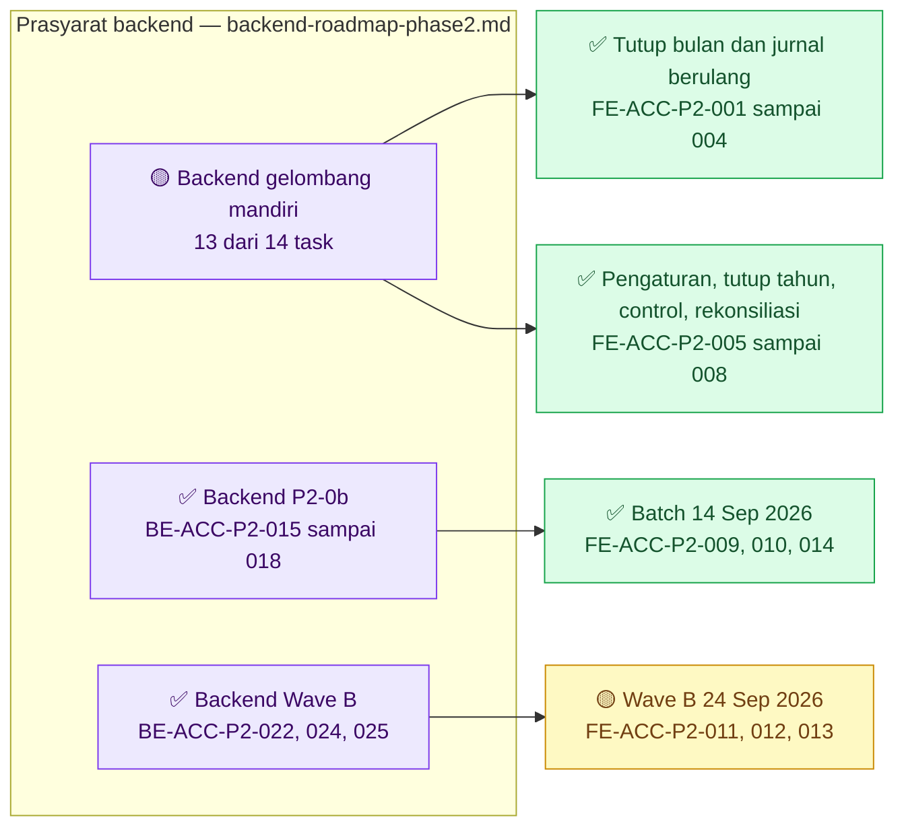
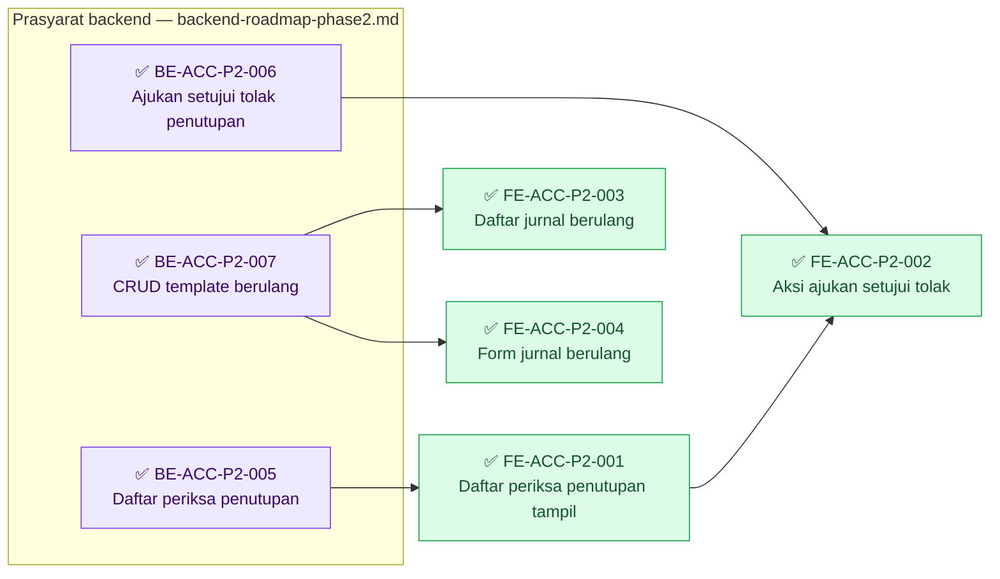
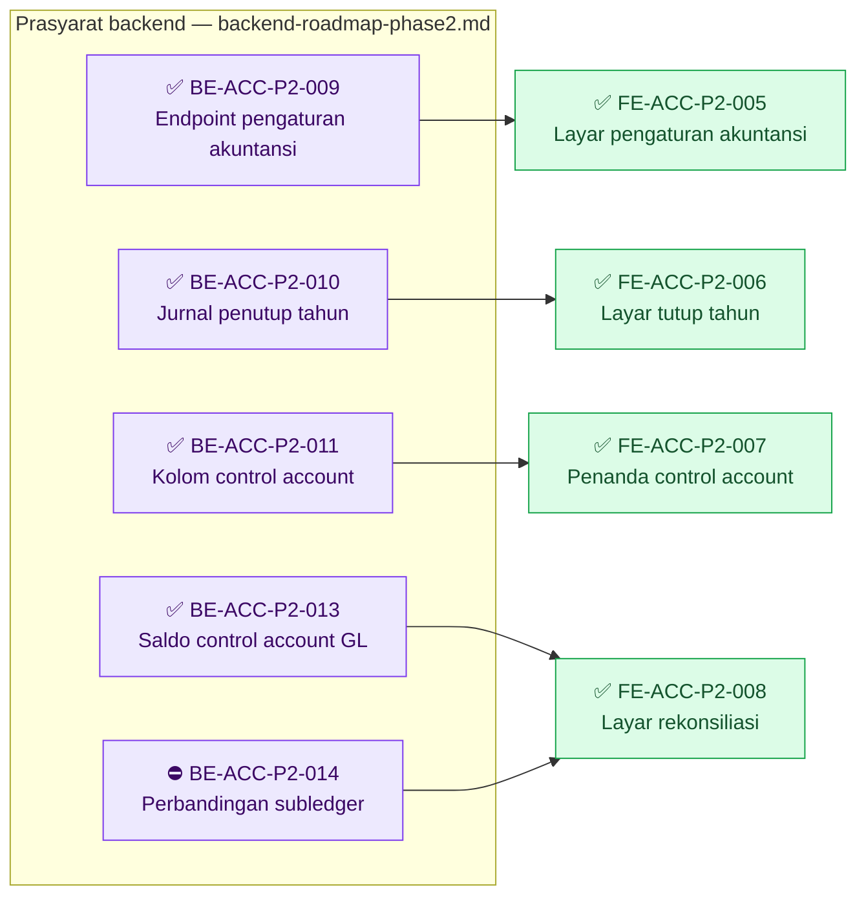
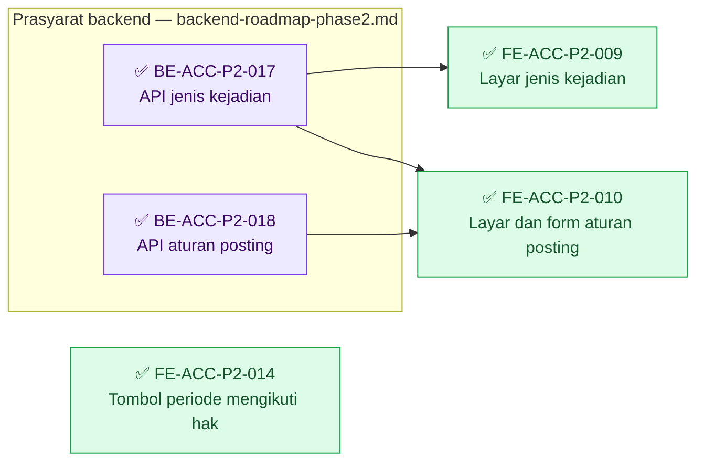
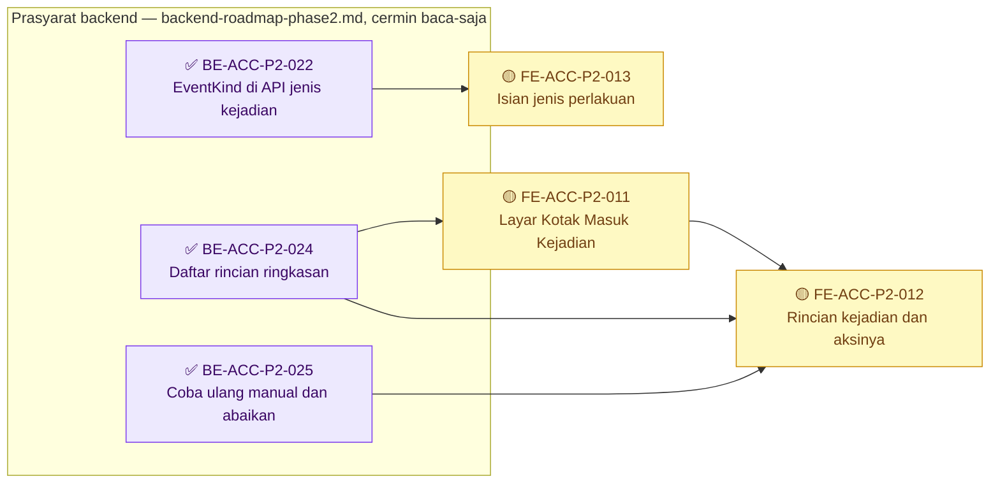

# Roadmap Delivery Frontend — Accounting Phase 2 (gelombang mandiri)

## Metadata

```yaml
blueprint_id: ACC-BP-001
blueprint_revision: 11
blueprint_status: approved
roadmap_revision: 5                 # APPROVED 24 Sep 2026 (GATE-DESAIN-0924) - Wave B: FE-ACC-P2-011, 012, 013
                                    # revisi 4: 14 Sep 2026 - ACC-DEC-074..081: FE-ACC-P2-009, 010, 014
                                    # revisi 3: 10 Sep 2026, penyelarasan FE-ACC-P2-001/002; ACC-DEC-070
roadmap_status: APPROVED
approved_by: [Rizki]
approved_at: 2026-09-14             # revisi 4; revisi 3 disetujui 2026-09-10
source_backend: b3ab542e            # revisi 4; revisi 1-3 disusun di atas 02c3219
source_frontend: f6b1498fe          # branch RizkiV2; revisi 1-3 di atas e732424eb
decision_revision: 9                # 00-interview-decisions.md revisi 9, sampai ACC-DEC-081
contracts: [ACC-API-0.10, ACC-STATE-0.3, ACC-VALIDATION-0.6, ACC-PERMISSION-0.5]
scope_waves: [P2-0a, P2-3, P2-4, P2-5, P2-CTRL, P2-RECON, HARDENING, P2-0b]
acceptance_policy: automated test bukan acceptance criterion (ACC-DEC-081)
```

**Arti tanda status pada dokumen ini.**

| Tanda | Artinya |
| :---: | --- |
| ✅ | Selesai. Acceptance criteria dan DoD **terbukti**, buktinya ada pada laporan task |
| 🟡 | Sebagian. Source-nya sudah ada, tetapi acceptance criteria belum terbukti penuh. **Belum selesai** |
| ⛔ | Terblokir. Prasyaratnya belum terpenuhi, dan task **tidak boleh dimulai** |
| tanpa tanda | Belum dikerjakan |

## Grafik Urutan Dependency

Roadmap ini memuat 14 task (tiga di antaranya amandemen `DRAFT` 24 September 2026, Grafik 4 di akhir dokumen), tetapi bersama task backend yang ditunggunya grafiknya melebihi 15
node. Karena itu grafiknya dipecah per kelompok slice, didahului satu grafik ringkasan. Task
backend digambar di dalam `subgraph` sebagai cermin baca-saja dari
[backend-roadmap-phase2.md](backend-roadmap-phase2.md); tandanya disalin dari sana.

### Ringkasan antar-slice



### Grafik 1 — tutup bulan dan jurnal berulang (`P2-4`, `P2-3`)



| Gelombang | Boleh mulai setelah | Task |
| ---: | --- | --- |
| 1 | `BE-ACC-P2-005` ✅ | `FE-ACC-P2-001` 🟡 — tinggal `npm run build` owner |
| 1 | `BE-ACC-P2-007` ✅ | `FE-ACC-P2-003` ✅, `FE-ACC-P2-004` ✅ |
| 2 | `FE-ACC-P2-001`, `BE-ACC-P2-006` ✅ | `FE-ACC-P2-002` 🟡 — tinggal `npm run build` owner |

### Grafik 2 — pengaturan, tutup tahun, control account, rekonsiliasi (`P2-0a`, `P2-5`, `P2-CTRL`, `P2-RECON`)



| Gelombang | Boleh mulai setelah | Task |
| ---: | --- | --- |
| 1 | `BE-ACC-P2-009` ✅ | `FE-ACC-P2-005` ✅ |
| 1 | `BE-ACC-P2-010` ✅ | `FE-ACC-P2-006` ✅ |
| 1 | `BE-ACC-P2-011` ✅ | `FE-ACC-P2-007` ✅ |
| 1 | `BE-ACC-P2-013` ✅; sisi subledger ⛔ menunggu `BE-ACC-P2-014` | `FE-ACC-P2-008` ✅ untuk sisi buku besar |

### Grafik 3 — batch 14 September 2026 (`HARDENING`, `P2-0b`)



| Gelombang batch | Boleh mulai setelah | Task |
| ---: | --- | --- |
| 1 | — | `FE-ACC-P2-014` |
| 1 | `BE-ACC-P2-017` | `FE-ACC-P2-009` |
| 1 | `BE-ACC-P2-017`, `BE-ACC-P2-018` | `FE-ACC-P2-010` |

**Catatan runtime.** `FE-ACC-P2-009` dan `010` dapat ditulis begitu kontrak dan source backend
`017`/`018` berdiri. Layarnya baru **menampilkan data sungguhan** sesudah migration
`BE-ACC-P2-016` diterapkan Rizki.

## Baca ini lebih dahulu

Enam task frontend pada revisi pertama — kini sebelas sesudah amandemen 9 dan 14 September 2026 —
seluruhnya menunggu endpoint backend pasangannya berdiri. Tidak ada task
frontend yang boleh dimulai sebelum kontraknya benar-benar dapat dipanggil — pelajaran dari MVP,
di mana layar dibangun lebih dahulu lalu ternyata nama DTO-nya berbeda (`ACC-GAP-004`).

### Tiga aturan yang mengikat seluruh task

1. **Pakai ulang komponen yang sudah ada.** Sebelas layar Accounting MVP sudah menyediakan tabel
   berhalaman, pemilih badan hukum, modal konfirmasi, dan tabel baris jurnal. Membuat tandingan
   adalah pelanggaran, bukan pilihan gaya.
2. **`globals.css` tidak disentuh.** Gaya khusus ditulis sebagai CSS Module milik layarnya.
3. **Tombol yang tidak boleh ditekan dimatikan, bukan disembunyikan** — mengikuti pola sebelas
   layar MVP.

### Yang `DEV_DISCRETION`

Warna, jarak, ikon, urutan kolom tabel, dan pilihan component library. Yang **bukan**
`DEV_DISCRETION`: isi layar, sumber datanya, hak akses tiap tombol, dan bunyi keadaan kosong
serta gagal — ketiganya sudah dikunci [`03-frontend-architecture.md`](../03-frontend-architecture.md)
bagian 11.

---

## Ringkasan task

| ID | Judul | Gelombang | Dependency backend | Status |
|---|---|---|---|---|
| `FE-ACC-P2-001` ✅ | Layar Daftar Periksa Penutupan | `P2-4` | `BE-ACC-P2-005` | ✅ `SELESAI` 14 Sep 2026 — ketujuh acceptance di source; build owner `✓ Compiled successfully` (326/326); `READY FOR UAT`. Riwayat: 🟡 11 Sep 2026, tinggal build. [Laporan](../task/report/frontend/fe-acc-p2-001-daftar-periksa-penutupan.md) |
| `FE-ACC-P2-002` ✅ | Aksi penutupan: ajukan, setujui, tolak | `P2-4` | `BE-ACC-P2-006` | ✅ `SELESAI` 14 Sep 2026 — keempat acceptance di source; build owner `✓ Compiled successfully` (326/326); `READY FOR UAT`. Riwayat: 🟡 11 Sep 2026, tinggal build. [Laporan](../task/report/frontend/fe-acc-p2-002-aksi-penutupan-ajukan-setujui-tolak.md) |
| `FE-ACC-P2-003` ✅ | Layar daftar Jurnal Berulang | `P2-3` | `BE-ACC-P2-007` | ✅ `SELESAI` 11 Sep 2026 — `READY FOR UAT` |
| `FE-ACC-P2-004` ✅ | Form Jurnal Berulang | `P2-3` | `BE-ACC-P2-007` | ✅ `SELESAI` 11 Sep 2026 — `READY FOR UAT` |
| `FE-ACC-P2-005` ✅ | Layar Pengaturan Akuntansi | `P2-0a` | `BE-ACC-P2-009` | ✅ `SELESAI` 11 Sep 2026 — `READY FOR UAT` |
| `FE-ACC-P2-006` ✅ | Layar Tutup Tahun | `P2-5` | `BE-ACC-P2-010` | ✅ `SELESAI` 11 Sep 2026 — `READY FOR UAT` |
| `FE-ACC-P2-007` ✅ | **Penanda control account pada layar COA** | `P2-CTRL` | `BE-ACC-P2-011` | ✅ **`SELESAI`** 11 Sep 2026 — `IMPLEMENTATION COMPLETE`, `READY FOR UAT`; lint 0 error, 677 uji lulus, build compiled; dialog penyesuaian dan Form Jurnal Berulang ikut mematikan akun control. UAT belum dijalankan — diserahkan ke tim UAT |
| `FE-ACC-P2-008` ✅ | **Layar Rekonsiliasi Control Account** | `P2-RECON` | `BE-ACC-P2-013` | ✅ **`SELESAI`** 11 Sep 2026 — `IMPLEMENTATION COMPLETE`, `READY FOR UAT`; saldo buku besar dari `gl-balances` terbukti di runtime; saldo subledger dan selisih "Belum tersedia" — `DEFERRED BACKEND CAPABILITY` (`BE-ACC-P2-014`, gelombang `P2-1`). UAT belum dijalankan |
| `FE-ACC-P2-009` ✅ | Layar master Jenis Kejadian | `P2-0b` | `BE-ACC-P2-017` | ✅ `SELESAI` 14 Sep 2026 — 7 dari 7 acceptance di source, lint 0 error, build owner `✓ Compiled successfully` (326/326); migration `016` ✅; `BE-ACC-P2-017` ✅ 15 Sep 2026 — `GET` berlogin `200`, bentuk cocok DTO. [Laporan](../task/report/frontend/FE-ACC-P2-009.md) |
| `FE-ACC-P2-010` ✅ | Layar dan Form Aturan Posting | `P2-0b` | `BE-ACC-P2-017`, `BE-ACC-P2-018` | ✅ `SELESAI` 14 Sep 2026 — 8 dari 8 acceptance di source, lint 0 error, build owner `✓ Compiled successfully` (326/326); migration `016` ✅; `BE-ACC-P2-017` ✅ 15 Sep 2026 — `GET` berlogin `200`, bentuk cocok DTO. [Laporan](../task/report/frontend/FE-ACC-P2-010.md) |
| `FE-ACC-P2-014` ✅ | Tombol Periode Akuntansi mengikuti hak akses (`ACC-GAP-010`) | `HARDENING` | — | ✅ `SELESAI` 14 Sep 2026 — 6 dari 6 acceptance di source, lint 0 error, build owner `✓ Compiled successfully` (326/326); `READY FOR UAT`. [Laporan](../task/report/frontend/FE-ACC-P2-014.md) |

---

## ✅ `FE-ACC-P2-001` — Layar Daftar Periksa Penutupan

| Field | Isi |
|---|---|
| Outcome | Petugas melihat apa saja yang menahan penutupan bulan, dan tahu apa yang harus dikerjakan |
| Trace | `ACC-DEC-051`, **`ACC-DEC-065`**, **`ACC-DEC-070`**; `FR-P2-023`, `FR-P2-025` |
| Kontrak | `GET /periods/{id}/closing-checklist` dan `GET /periods/{id}/closing-history`, dijaga `AccountingPeriod : Read`, pada `ACC-API-0.9`. **Bukan** `accounting-periods`, **bukan** `Period : Read` |
| Reuse | Tabel dan kartu dari layar Periode Akuntansi yang sudah ada; pemilih badan hukum |
| Cakupan | Layar anak dari Periode Akuntansi, dibuka lewat tombol Tutup Periode. `accounting-period-closing-slice.jsx` |
| Dependency | `BE-ACC-P2-005` |
| Acceptance | (1) **Tiga** penghalang (`ACC-DEC-051` + `ACC-DEC-065`) dan **enam** peringatan (`ACC-DEC-051` + `ACC-DEC-070`) tampil terpisah dan **terbaca bedanya**. (2) Butir berkeadaan `NotYetAvailable` dirender **berbeda** dari butir yang sudah diperiksa dan bersih, tanpa menampilkan angka, disertai `UnavailableReason`-nya. (3) Selama `IsComplete` bernilai `false`, spanduk kelengkapan tampil di **atas** daftar memuat `NotYetAvailableCount`. (4) **Tidak memakai cache** — layar dibuka ulang selalu memanggil endpoint lagi. (5) Tautan Lihat membuka daftar jurnal yang sudah tersaring ke periode itu. (6) Keadaan kosong berbunyi "Tidak ada penghalang." (7) Riwayat penutupan tampil dari `closing-history`; gagalnya riwayat **tidak** menghilangkan daftar periksa |
| Verifikasi | `npm run lint`; `npm run build`; unit test slice; UAT peramban `UAT-P2-14` |
| Risiko/pemilik | **Dua risiko.** (a) Menampilkan angka dari cache membuat petugas mengambil keputusan penutupan berdasarkan keadaan lama. (b) **Merender butir `NotYetAvailable` sama seperti butir bersih.** Dua dari tiga penghalang belum dapat diperiksa selama gelombang `P2-1` belum dibangun; bila dirender sama, petugas menutup periode padahal tidak ada yang pernah memeriksa shift kasirnya. Owner Frontend |
| DoD | Lint dan build hijau, unit test lulus, laporan task tertulis |
| Status | ✅ **`SELESAI` — 14 September 2026, atas pilihan owner.** Butir DoD terakhir terpenuhi: `npm run build` oleh Rizki pada `RizkiV2` `a09ba4b13` — `✓ Compiled successfully in 34.7s`, 326/326 halaman statis, rute `/corporate/accounting/periods/[slug]/closing` dan `/corporate/accounting/journals` terdaftar, nol error. Berkas layar penutupan dan acceptance (5) tidak berubah sejak `f6b1498fe` (11 Sep 2026); `npx eslint` diulang agent pada 12 berkas JSX: **0 error, 0 warning**. Unit test tidak diulang — bukti **686 lulus** 11 Sep 2026 atas berkas yang sama. `UAT-P2-14` tetap dikecualikan dari DoD development; `READY FOR UAT`, bukan `UAT PASS`. Laporan: [`fe-acc-p2-001`](../task/report/frontend/fe-acc-p2-001-daftar-periksa-penutupan.md) bagian 10. **Riwayat:** 🟡 **`SEBAGIAN` — 11 September 2026, lanjutan. Tinggal satu butir DoD: `npm run build`, dijalankan owner.** Acceptance (5) kini **terpetakan ke source**: tautan Lihat membawa rentang tanggal periode (`?dateFrom=…&dateTo=…`) yang diambil dari `GET /periods` menurut `accountingPeriodId`, dan layar Jurnal membaca penyaring itu dari URL di balik `Suspense` — **ketujuh acceptance terpetakan ke source**. `npm run lint:errors` seluruh repository `0 errors`; **686 uji unit lulus, 0 gagal** (+9); `npm run build` **`NOT RUN` atas instruksi owner** — sesudah build owner hijau, task ini memenuhi syarat ✅. `UAT-P2-14` **dikecualikan dari DoD development atas keputusan owner 11 September 2026** (UAT dijalankan tim UAT terpisah; bukan `UAT PASS`); `READY FOR UAT`. Laporan: [`fe-acc-p2-001`](../task/report/frontend/fe-acc-p2-001-daftar-periksa-penutupan.md) bagian 9. **Riwayat:** 🟡 `SEBAGIAN` — 10 September 2026. `npm run lint` 0 error; `npm run build` compiled; `node --test tests/unit/` **615 lulus 0 gagal** (17 uji baru). **Diuji terhadap backend sungguhan:** bentuk respons cocok 100% dengan normalizer, 3 penghalang + 6 peringatan, `notYetAvailableCount=7`, dan payload aslinya disimpan sebagai fixture. **Belum terpenuhi:** acceptance (5) — tautan Lihat belum menyaring ke periode; `UAT-P2-14` `NOT FEASIBLE`. Laporan: [`fe-acc-p2-001`](../task/report/frontend/fe-acc-p2-001-daftar-periksa-penutupan.md) |


## ✅ `FE-ACC-P2-002` — Aksi penutupan: ajukan, setujui, tolak

| Field | Isi |
|---|---|
| Outcome | Penutupan bulan dapat ditempuh penuh oleh dua orang berbeda lewat layar |
| Trace | `ACC-DEC-052`, `ACC-DEC-055`, `ACC-DEC-016`; `FR-P2-026`, `027`, `028` |
| Kontrak | `POST /periods/{id}/submit-closing` (`AccountingPeriod : Close`), `/approve-closing` dan `/reject-closing` (`AccountingPeriod : Approve`), pada `ACC-API-0.9`. **Bukan** `accounting-periods`, **bukan** `Period : ...` |
| Reuse | Modal konfirmasi beralasan dari layar Buka Kembali Periode yang sudah ada |
| Cakupan | Tiga tombol pada layar `FE-ACC-P2-001`; modal alasan penolakan. **Tidak ada layar sendiri** |
| Dependency | `BE-ACC-P2-006`; **`FE-ACC-P2-001`** — lihat catatan urutan di bawah kartu ini |
| Acceptance | (1) Tombol Ajukan **mati** selama masih ada penghalang, dan alasannya terbaca di layar. (2) Tombol Setujui dan Tolak **mati** bila pembuka layar adalah yang mengajukan, disertai keterangan. (3) Penolakan tanpa alasan tidak dapat dikirim. (4) Tombol yang bukan haknya dimatikan, bukan disembunyikan |
| Verifikasi | `npm run lint`; `npm run build`; unit test; UAT peramban `UAT-P2-15`, `UAT-P2-16`, `UAT-P2-17`, `UAT-P2-18` |
| Risiko/pemilik | **Peran `Accounting Director` harus sudah ada** di mekanisme hak akses sebelum acceptance (2) dapat diuji sungguhan. Bergantung `BE-ACC-P2-006`. Owner Frontend |
| DoD | Lint dan build hijau, empat UAT terbukti, laporan task tertulis |
| Status | ✅ **`SELESAI` — 14 September 2026, atas pilihan owner.** Butir DoD terakhir terpenuhi: `npm run build` oleh Rizki pada `RizkiV2` `a09ba4b13` — `✓ Compiled successfully in 34.7s`, 326/326 halaman statis, rute `/corporate/accounting/periods/[slug]/closing` terdaftar, nol error; build ini memuat perubahan acceptance (5) `FE-ACC-P2-001` yang membatalkan bukti build 10 Sep 2026. Berkas task tidak berubah sejak `f6b1498fe`; `npx eslint` diulang agent: **0 error, 0 warning**. Aturan `403` empat mata sudah terbukti di runtime 10 Sep 2026. Tampilan tombol mati bagi pengguna kedua dan `UAT-P2-15`..`18` tetap dikecualikan dari DoD development (keputusan owner 11 Sep 2026); `READY FOR UAT`, bukan `UAT PASS`. Laporan: [`fe-acc-p2-002`](../task/report/frontend/fe-acc-p2-002-aksi-penutupan-ajukan-setujui-tolak.md) bagian 9. **Riwayat:** 🟡 **`SEBAGIAN` — penilaian ulang 11 September 2026. Tinggal satu butir DoD: `npm run build`, dijalankan owner.** Keempat acceptance terpetakan ke source; aturan `403` empat mata terbukti di runtime. Layarnya ikut disentuh acceptance (5) `FE-ACC-P2-001` (tautan Lihat saja), sehingga bukti build 11 Sep 2026 tidak lagi berlaku untuk berkasnya — `npm run lint:errors` `0 errors`, 686 uji lulus, build `NOT RUN` atas instruksi owner. `UAT-P2-15`..`18`, termasuk tampilan tombol mati bagi pengguna kedua, **dikecualikan dari DoD development atas keputusan owner 11 September 2026** (UAT dijalankan tim UAT terpisah; bukan `UAT PASS`); `READY FOR UAT`. Laporan: [`fe-acc-p2-002`](../task/report/frontend/fe-acc-p2-002-aksi-penutupan-ajukan-setujui-tolak.md). **Riwayat:** 🟡 `SEBAGIAN` — 10 September 2026, satu paket dengan `FE-ACC-P2-001`. Lint 0 error; build compiled; 615 uji lulus. **Alur penuh terbukti terhadap backend sungguhan** pada tahun buku uji 2019: ajukan → status 4, riwayat 1 baris; setujui oleh pengaju sendiri **403** (prinsip empat mata tegak); tolak tanpa alasan **400**; ajukan ulang **409**; tolak beralasan **200** dan periode kembali terbuka. **Satu cacat ditemukan dan diperbaiki:** urutan alasan tombol mati salah sesudah penolakan. **Belum terpenuhi:** tampilan tombol mati bagi pengguna kedua di peramban; `UAT-P2-15`..`18` `NOT FEASIBLE`. Laporan: [`fe-acc-p2-002`](../task/report/frontend/fe-acc-p2-002-aksi-penutupan-ajukan-setujui-tolak.md) |


### Urutan: `001` lebih dahulu, bukan sebaliknya

**`FE-ACC-P2-002` tidak dapat dikerjakan lebih dulu.** Cakupannya adalah *tiga tombol pada layar
`FE-ACC-P2-001`* — ia menumpang layar daftar periksa dan tidak punya layar sendiri. Tabel
dependency di atas hanya menyebut `BE-ACC-P2-006`, sehingga kartunya **terbaca seolah berdiri
sendiri**; itu yang mudah salah dibaca saat memilih task berikutnya.

Kerjakan `001` lebih dahulu, atau keduanya sebagai **satu paket**. Yang tidak bisa: memulai `002`
sementara `001` belum ada, karena tombolnya tidak punya tempat untuk diletakkan.

Ada alasan kedua untuk menjadikannya satu paket: acceptance (1) `002` berbunyi "tombol Ajukan mati
selama masih ada penghalang", dan daftar penghalang itu **milik** `001`. Menguji `002` tanpa `001`
berarti menguji tombol tanpa hal yang menentukan nyala-matinya.

## ✅ `FE-ACC-P2-003` — Layar daftar Jurnal Berulang

| Field | Isi |
|---|---|
| Outcome | Petugas melihat template yang ada beserta jadwal terbit dan status aktifnya |
| Trace | `ACC-DEC-050`; `FR-P2-022` |
| Kontrak | `GET /recurring-journals`, `GET /{id}/runs` |
| Reuse | Komponen tabel berhalaman dan pemilih badan hukum yang sudah ada |
| Cakupan | Butir menu tingkat 2 `/accounting/recurring-journals`; `accounting-recurring-journal-slice.jsx` |
| Dependency | `BE-ACC-P2-007` |
| Acceptance | (1) Template aktif dan tidak aktif terbedakan jelas. (2) Riwayat penerbitan per periode dapat dibuka beserta tautan ke jurnal yang dihasilkan. (3) Tombol Aktifkan hanya menyala bagi yang berhak. (4) Keadaan kosong berbunyi wajar |
| Verifikasi | `npm run lint`; `npm run build`; unit test slice |
| Risiko/pemilik | Owner Frontend |
| DoD | Lint dan build hijau, laporan task tertulis |
| Status | ✅ **`SELESAI` — penilaian ulang 11 September 2026.** `IMPLEMENTATION COMPLETE`; `READY FOR UAT`. Seluruh acceptance terpetakan ke source; yang tersisa hanya uji peramban, yang **dikecualikan dari DoD development atas keputusan owner 11 September 2026** (UAT dijalankan tim UAT terpisah; bukan `UAT PASS`). Bukti terkini: `npm run build` `✓ Compiled successfully` 11 Sep 2026 (sesi `FE-ACC-P2-008`; berkas task ini tidak berubah sesudahnya); `npm run lint:errors` seluruh repository `0 errors`; **686 uji unit lulus, 0 gagal**. Laporan: [`fe-acc-p2-003`](../task/report/frontend/fe-acc-p2-003-layar-daftar-jurnal-berulang.md). **Riwayat:** 🟡 `SEBAGIAN` — 11 September 2026, satu paket dengan `FE-ACC-P2-004`. `npm run lint` 0 error (warning tidak bertambah); `npm run build` compiled 44 dtk, rute daftar dan rincian terdaftar; `node --test tests/unit/` **640 lulus 0 gagal** (13 baru). Keempat acceptance terpenuhi di kode; tombol Aktifkan dijaga **`RecurringJournal : Activate`** sesuai controller, amandemen kontrak `ACC-API-0.10` menunggu ratifikasi. **Belum:** uji peramban, diserahkan kepada Rizki; acceptance (2) belum dapat diperlihatkan dengan data nyata karena penjadwal mati dan belum ada template. Laporan: [`fe-acc-p2-003`](../task/report/frontend/fe-acc-p2-003-layar-daftar-jurnal-berulang.md) |

## ✅ `FE-ACC-P2-004` — Form Jurnal Berulang

| Field | Isi |
|---|---|
| Outcome | Template dapat dibuat dan diubah, dengan penjaga keseimbangan yang terlihat saat mengetik |
| Trace | `ACC-DEC-050`, `ACC-DEC-019`; `FR-P2-018` |
| Kontrak | `POST /recurring-journals`, `PUT /{id}` |
| Reuse | **Komponen tabel baris dari Form Jurnal MVP**, beserta total berjalan dan penjaga keseimbangannya. Membuat komponen tandingan **dilarang** |
| Cakupan | Layar anak dari `FE-ACC-P2-003` |
| Dependency | `BE-ACC-P2-007` |
| Acceptance | (1) Total debit dan kredit tampil berjalan saat mengetik, dan tombol Simpan mati selama tidak seimbang. (2) Kolom cost center **wajib muncul** saat akun berjenis beban dipilih. (3) Satu baris hanya menerima debit **atau** kredit. (4) Komponen baris yang dipakai **terbukti** komponen yang sama dengan Form Jurnal, bukan salinan |
| Verifikasi | `npm run lint`; `npm run build`; unit test; UAT peramban `UAT-P2-13` |
| Risiko/pemilik | Menyalin komponen tabel baris membuat dua tempat yang harus diperbaiki setiap kali aturan keseimbangan berubah. Acceptance (4) ada justru untuk mencegahnya. Owner Frontend |
| DoD | Lint dan build hijau, laporan task menyebut komponen mana yang dipakai ulang |
| Status | ✅ **`SELESAI` — penilaian ulang 11 September 2026.** `IMPLEMENTATION COMPLETE`; `READY FOR UAT`. Seluruh acceptance terpetakan ke source; yang tersisa hanya `UAT-P2-13`, yang **dikecualikan dari DoD development atas keputusan owner 11 September 2026** (UAT dijalankan tim UAT terpisah; bukan `UAT PASS`). Bukti terkini: `npm run build` `✓ Compiled successfully` 11 Sep 2026 (sesi `FE-ACC-P2-008`; berkas task ini tidak berubah sesudahnya, termasuk perubahan `FE-ACC-P2-007` pada Form Jurnal Berulang); `npm run lint:errors` seluruh repository `0 errors`; **686 uji unit lulus, 0 gagal**. Laporan: [`fe-acc-p2-004`](../task/report/frontend/fe-acc-p2-004-form-jurnal-berulang.md). **Riwayat:** 🟡 `SEBAGIAN` — 11 September 2026. Lint 0 error; build compiled, rute `/create` dan `/[slug]/update` terdaftar; 640 uji lulus. Keempat acceptance terpenuhi: **`JournalLineRow` milik `FE-ACC-006` diimpor apa adanya**, hitungan keseimbangan memakai util bersama baru alih-alih salinan ketiga. **Belum:** `UAT-P2-13`, diserahkan kepada Rizki. Laporan: [`fe-acc-p2-004`](../task/report/frontend/fe-acc-p2-004-form-jurnal-berulang.md) |

## ✅ `FE-ACC-P2-005` — Layar Pengaturan Akuntansi

| Field | Isi |
|---|---|
| Outcome | Akun laba ditahan dapat ditetapkan per badan hukum |
| Trace | `ACC-DEC-054`; `FR-P2-032` |
| Kontrak | `GET /configuration/{legalEntityId}`, `PUT /configuration/{legalEntityId}` |
| Reuse | Pemilih akun (`ChartOfAccountOptionDto`) dari Form Jurnal |
| Cakupan | Butir menu tingkat 3 di bawah Master Data; layar kecil |
| Dependency | `BE-ACC-P2-009` |
| Acceptance | (1) Pemilih akun **hanya menampilkan akun Ekuitas yang menerima transaksi**. (2) Keadaan kosong menjelaskan bahwa tutup tahun belum dapat dijalankan. (3) Hanya yang berhak dapat menyimpan |
| Verifikasi | `npm run lint`; `npm run build`; unit test |
| Risiko/pemilik | Owner Frontend |
| DoD | Lint dan build hijau, laporan task tertulis |
| Status | ✅ **`SELESAI` — penilaian ulang 11 September 2026.** `IMPLEMENTATION COMPLETE`; `READY FOR UAT`. Seluruh acceptance terpetakan ke source; yang tersisa hanya uji peramban, yang **dikecualikan dari DoD development atas keputusan owner 11 September 2026** (UAT dijalankan tim UAT terpisah; bukan `UAT PASS`). Bukti terkini: `npm run build` `✓ Compiled successfully` 11 Sep 2026 (sesi `FE-ACC-P2-008`; berkas task ini tidak berubah sesudahnya); `npm run lint:errors` seluruh repository `0 errors`; **686 uji unit lulus, 0 gagal**. Laporan: [`fe-acc-p2-005`](../task/report/frontend/fe-acc-p2-005-layar-pengaturan-akuntansi.md). **Riwayat:** 🟡 `SEBAGIAN` — 10 September 2026. `npm run lint` 0 error (jumlah warning tidak bertambah); `npm run build` compiled, route `/corporate/accounting/configuration` terdaftar; `node --test tests/unit/` **627 lulus 0 gagal**. Ketiga acceptance **terpenuhi**, termasuk penjaga hak akses `AccountingConfiguration : Update` pada tombol Simpan. **Belum:** UAT peramban, diserahkan kepada Rizki atas permintaannya. Laporan: [`fe-acc-p2-005`](../task/report/frontend/fe-acc-p2-005-layar-pengaturan-akuntansi.md) |

## ✅ `FE-ACC-P2-006` — Layar Tutup Tahun

| Field | Isi |
|---|---|
| Outcome | Petugas melihat perhitungan tutup tahun sebelum memutuskan, lalu menyusun jurnal penutupnya |
| Trace | `ACC-DEC-053`, `ACC-DEC-054`; `FR-P2-030`, `031`, `032`, `033` |
| Kontrak | `GET /year-end-closing/preview`, `POST /year-end-closing/generate` |
| Reuse | Komponen tabel dan format rupiah dari layar Neraca Saldo |
| Cakupan | Butir menu tingkat 2 `/accounting/year-end-closing`; `accounting-year-end-slice.jsx` |
| Dependency | `BE-ACC-P2-010` |
| Acceptance | (1) Layar menyatakan tegas bahwa **Pratinjau tidak membuat apa pun**. (2) Tombol Susun **mati** bila pratinjau kosong atau akun laba ditahan belum ditetapkan, disertai tautan ke Pengaturan Akuntansi. (3) Penolakan karena periode belum tertutup menampilkan **periode mana saja**, bukan pesan umum. (4) Tidak memakai cache |
| Verifikasi | `npm run lint`; `npm run build`; unit test; UAT peramban `UAT-P2-19`, `UAT-P2-20`, `UAT-P2-21`, `UAT-P2-22` |
| Risiko/pemilik | Tutup tahun terasa menakutkan bagi petugas. Acceptance (1) bukan hiasan — tanpanya orang enggan menekan Pratinjau dan justru menebak angkanya. Owner Frontend |
| DoD | Lint dan build hijau, empat UAT terbukti, laporan task tertulis |
| Status | ✅ **`SELESAI` — penilaian ulang 11 September 2026.** `IMPLEMENTATION COMPLETE`; `READY FOR UAT`. Seluruh acceptance terpetakan ke source; yang tersisa hanya `UAT-P2-19` sampai `22`, yang **dikecualikan dari DoD development atas keputusan owner 11 September 2026** (UAT dijalankan tim UAT terpisah; bukan `UAT PASS`). Bukti terkini: `npm run build` `✓ Compiled successfully` 11 Sep 2026 (sesi `FE-ACC-P2-008`; berkas task ini tidak berubah sesudahnya); `npm run lint:errors` seluruh repository `0 errors`; **686 uji unit lulus, 0 gagal**. Laporan: [`fe-acc-p2-006`](../task/report/frontend/fe-acc-p2-006-layar-tutup-tahun.md). **Riwayat:** 🟡 `SEBAGIAN` — 10 September 2026. Lint 0 error; build compiled, route `/corporate/accounting/year-end-closing` terdaftar; 627 uji lulus. Keempat acceptance **terpenuhi**: jaminan "Pratinjau tidak membuat apa pun" dirender sebelum tombolnya, `422` disertai tautan ke Pengaturan Akuntansi sementara `409` menampilkan daftar periode dari backend apa adanya, dan pratinjau tanpa cache. **Belum:** `UAT-P2-19` sampai `22`, diserahkan kepada Rizki. Laporan: [`fe-acc-p2-006`](../task/report/frontend/fe-acc-p2-006-layar-tutup-tahun.md) |

---

## ✅ `FE-ACC-P2-007` — Penanda control account pada layar COA

| Field | Isi |
|---|---|
| Outcome | Petugas dapat menandai sebuah akun sebagai control account, dan melihat penandanya di daftar |
| Trace | `ACC-DEC-064` |
| Kontrak | `ACC-API-0.8` grup Chart of Account. Bidang `IsControlAccount` pada `/options` — yang dibutuhkan acceptance (3) — diajukan `ACC-API-0.11` (usulan, 11 Sep 2026) dan dibangun `BE-ACC-P2-012`. `/options` **tidak** menyaring akun control; penyaringan di hook tiap layar |
| Reuse | **Layar COA dan Form Akun yang sudah ada dari MVP.** Ini penambahan satu kolom dan satu kotak centang, **bukan layar baru** |
| Cakupan | Satu kotak centang pada Form Akun, satu kolom penanda pada tabel COA, dan penjelasan singkat maknanya |
| Dependency | `BE-ACC-P2-011` |
| Acceptance | (1) Kotak centang hanya menyala bagi yang berhak mengubah akun. (2) Tabel COA menampilkan penandanya sehingga terbaca sekilas. (3) **Layar Form Jurnal menyembunyikan atau mematikan akun control dari pemilih akunnya**, disertai keterangan kenapa — supaya petugas tahu sebelum mengisi, bukan setelah ditolak |
| Verifikasi | `npm run lint`; `npm run build`; unit test |
| Risiko/pemilik | **Acceptance (3) yang paling menentukan pengalaman pemakaian.** Tanpa itu petugas baru tahu akunnya terlarang sesudah menekan Simpan dan ditolak `422`. Owner Frontend |
| DoD | Lint dan build hijau, laporan task tertulis |
| Status | ✅ **`SELESAI` — 11 September 2026, lanjutan.** `IMPLEMENTATION COMPLETE`; developer verification `PASS`; `READY FOR UAT` — UAT **belum** dijalankan dan diserahkan ke tim UAT terpisah. Butir uji peramban **dikecualikan dari DoD development atas keputusan owner 11 September 2026** (UAT bukan penghalang development); ia tidak dinyatakan lulus. Ketiga acceptance terpetakan ke source, dan (3) kini **terbukti bersandar pada backend sungguhan**: `/options` pada `rizkiG` `cca0957` mengirim `isControlAccount = true` untuk keenam control account (uji kontrak read-only 11 Sep 2026). `npx eslint` pada 18 berkas yang disentuh `0 errors` (2 warning `set-state-in-effect` pada efek yang sudah ada); **677 uji unit lulus, 0 gagal**; `npm run build` `✓ Compiled successfully` 45 dtk. Sisa yang dicatat laporan sebelumnya ikut dikerjakan: **dialog penyesuaian jurnal (`ACC-DEC-072`) dan Form Jurnal Berulang (`ACC-DEC-073`) kini juga mematikan akun control** beserta keterangannya, lewat satu util bersama `journal-account-option-utils.jsx` yang juga dipakai Form Jurnal. Laporan: [`fe-acc-p2-007`](../task/report/frontend/fe-acc-p2-007-penanda-control-account-layar-coa.md). **Riwayat — 🟡 `SEBAGIAN` pada awal 11 September 2026:** Ketiga acceptance **terpetakan ke source**: (1) kotak centang Control Account di Form Akun, mati bagi pengguna tanpa `ChartOfAccount : Update`; (2) kolom `Control` ber-`StatusBadge` di tabel COA, ditambah baris di rincian; (3) pemilih akun Form Jurnal **mematikan** akun control — tidak menyaringnya — beserta `InformationAlert` yang juga menyebut baris draft yang masih memakainya. `npx eslint` pada 8 berkas `0 errors` (4 warning `set-state-in-effect` pada efek yang sudah ada); **651 uji unit lulus, 0 gagal** (+11). UI GATE: 6 elemen, seluruhnya `REUSE`. **Yang membuat 🟡:** acceptance (3) membaca `isControlAccount` dari `/options`, yang baru ada di source `BE-ACC-P2-012` 🟡 dan kontraknya masih usulan `ACC-API-0.11`; `npm run build` `NOT RUN` atas instruksi owner; uji peramban diserahkan kepada Rizki. Ikut diperbaiki: cacat `{ id, data }` Form Jurnal MVP (disetujui) dan `validateForm` yang membuat layar Ubah Akun tidak pernah dapat disimpan. Laporan: [`fe-acc-p2-007`](../task/report/frontend/fe-acc-p2-007-penanda-control-account-layar-coa.md) |

## ✅ `FE-ACC-P2-008` — Layar Rekonsiliasi Control Account

| Field | Isi |
|---|---|
| Outcome | Saldo control account di buku besar tampil berdampingan dengan saldo subledger, beserta selisihnya |
| Trace | `ACC-DEC-066` |
| Kontrak | `GET /reconciliation/gl-balances` dijaga `AccountingReconciliation : Read` — diajukan `ACC-API-0.11` dan `ACC-PERMISSION-0.6` (usulan, 11 Sep 2026). Tampilkan **`BalanceInNormalBalance`**, bukan `Balance`. Endpoint sisi subledger belum dirancang (`BE-ACC-P2-014`). Kolom ini sebelumnya tidak ada pada kartu |
| Reuse | Komponen tabel dan format rupiah dari layar Neraca Saldo |
| Cakupan | Butir menu tingkat 2 `/accounting/reconciliation` |
| Dependency | `BE-ACC-P2-013` untuk sisi buku besar; `BE-ACC-P2-014` untuk sisi subledger, yang kini bergantung pada gelombang `P2-1` |
| Acceptance | (1) Kolom saldo buku besar tampil segera setelah `BE-ACC-P2-013` berdiri. (2) **Kolom saldo subledger dan selisih ditampilkan sebagai "belum tersedia"**, bukan disembunyikan — supaya pembaca tahu laporannya memang belum lengkap, bukan mengira selisihnya nol. (3) Tidak memakai cache |
| Risiko/pemilik | Menyembunyikan kolom yang belum ada datanya membuat laporan **terbaca seolah sudah cocok**. Itu kesalahan yang paling mahal pada layar rekonsiliasi. Owner Frontend |
| DoD | Lint dan build hijau, laporan task tertulis |
| Status | ✅ **`SELESAI` — 11 September 2026.** `IMPLEMENTATION COMPLETE`; developer verification `PASS`; `READY FOR UAT` — UAT **belum** dijalankan, diserahkan ke tim UAT terpisah (keputusan owner 11 September 2026). Layar `/corporate/accounting/reconciliation`, butir menu tingkat 2. Ketiga acceptance terpetakan ke source: (1) kolom Saldo Buku Besar dari `GET /reconciliation/gl-balances` memakai `BalanceInNormalBalance` — **bentuk respons terbukti cocok** dengan normalizer terhadap backend `rizkiG` `cca0957` (uji kontrak read-only, 6 control account; payloadnya disimpan sebagai fixture uji); (2) kolom Saldo Subledger dan Selisih **tampil** bertuliskan "Belum tersedia" — tidak disembunyikan, tidak pernah `Rp 0` — di bawah spanduk "Rekonsiliasi belum lengkap"; (3) tanpa cache — laporan dibuang saat layar ditutup dan saat badan hukum berganti, Muat Ulang memanggil ulang. `npx eslint` `0 errors`; **677 uji unit lulus** (+22 uji rekonsiliasi); `npm run build` `✓ Compiled successfully`, rute terdaftar. UI GATE 11 elemen: `REUSE` 10, `COMPOSE` 1, `NEW` 0. **`DEFERRED BACKEND CAPABILITY`:** saldo subledger — `BE-ACC-P2-014`, menunggu gelombang `P2-1` (`ACC-DEC-071`); selisih — membutuhkan saldo subledger. Kontrak `ACC-API-0.11` dan `ACC-PERMISSION-0.6` masih usulan. Laporan: [`fe-acc-p2-008`](../task/report/frontend/fe-acc-p2-008-layar-rekonsiliasi-control-account.md). **Riwayat — sebelum dikerjakan:** `READY` sebagian — sisi buku besar dapat dikerjakan sekarang. Kolom subledger menunggu `BE-ACC-P2-014`, yang **tidak lagi terblokir keputusan** sejak `ACC-DEC-071` (10 Sep 2026) dan kini hanya menunggu gelombang `P2-1` menyediakan kotak masuk kejadiannya |

---

## Amandemen 14 September 2026 — batch hardening dan Wave A

Revisi 4 menambah **tiga task**, dasarnya keputusan owner `ACC-DEC-074` sampai `ACC-DEC-081`.
Tiga aturan pada bagian *Baca ini lebih dahulu* tetap berlaku penuh. Ditambah satu aturan:
**automated test bukan acceptance criterion** (`ACC-DEC-081`) — verifikasi task adalah
`npm run lint`, `npm run build` oleh owner, dan pemeriksaan source. Jangan membuat berkas test baru.

## ✅ `FE-ACC-P2-014` — Tombol Periode Akuntansi mengikuti hak akses

| Field | Isi |
|---|---|
| Outcome | Pengguna yang tidak berhak melihat tombol Bangkitkan, Tutup, dan Buka Kembali dalam keadaan mati beserta keterangannya, bukan tombol yang menyala lalu ditolak `403` |
| Trace | `ACC-GAP-010`; `ACC-DEC-080`; acceptance (4) `FE-ACC-004` pada [frontend-roadmap.md](frontend-roadmap.md) |
| Kontrak | Tidak berubah. Hak akses `AccountingPeriod : Create`, `AccountingPeriod : Close`, `AccountingPeriod : Reopen` pada `AccountingPeriodController` |
| Reuse | Hook `usePermission` (`src/lib/hooks/auth/use-permission.jsx`); pola alasan tombol mati pada `period-closing-constants.jsx` dan `period-closing-view.jsx` |
| Cakupan | `accounting-period-view.jsx` beserta hook/konstanta layar Periode Akuntansi bila perlu. **Tidak** menambah `AvailableActions` di backend |
| Dependency | — |
| Acceptance | (1) Tombol Bangkitkan Periode mati bagi pengguna tanpa `AccountingPeriod : Create`. (2) Tombol Tutup mati bagi pengguna tanpa `AccountingPeriod : Close`. (3) Tombol Buka Kembali mati bagi pengguna tanpa `AccountingPeriod : Reopen`. (4) Ketiganya **tetap tampil**, dan keterangan kenapa mati terbaca pengguna — contoh "Anda tidak memiliki hak Buka Kembali Periode." (5) Selama daftar hak belum dimuat, perilaku mengikuti `usePermission` apa adanya. (6) Nol perubahan backend, `globals.css` tidak disentuh, tanpa `style={{ }}` |
| Verifikasi | `npm run lint`; `npm run build` oleh owner; pemeriksaan source |
| Risiko/pemilik | Menyembunyikan tombol membuat petugas mengira fitur itu tidak ada. Backend tetap menolak `403` sebagai pengaman sesungguhnya (`NFR-005`). Owner Frontend |
| DoD | Lint hijau, laporan task tertulis. Build dijalankan owner |
| **Status** | ✅ **SELESAI 14 September 2026.** Satu-satunya sisa DoD terpenuhi: `npm run build` oleh Rizki pada `RizkiV2` `a09ba4b13` — `✓ Compiled successfully in 34.7s`, `✓ Finished TypeScript`, 326/326 halaman statis, rute `/corporate/accounting/periods` terdaftar, nol error. `npx eslint` diulang agent pada 26 berkas JSX commit itu: **0 error, 0 warning**. `globals.css` tidak tersentuh. Uji manual dan `UAT-08`/`UAT-09` belum dijalankan — bukan butir DoD kartu, diserahkan ke tim UAT; bukan `UAT PASS`. **Riwayat:** 🟡 **SEBAGIAN — 14 September 2026.** `IMPLEMENTATION COMPLETE`, `READY FOR UAT`. 6 dari 6 acceptance terpetakan ke source: tiga `usePermission` (`AccountingPeriod : Create/Close/Reopen`) di `use-accounting-period.jsx`; Bangkitkan Setahun, Tutup Sementara, Tutup Permanen, dan Buka Kembali tetap tampil tetapi mati beserta `title` dan keterangan terlihat ("Anda tidak memiliki hak Buka Kembali Periode."); perilaku saat daftar hak belum termuat mengikuti `usePermission` apa adanya. `npx eslint` 3 berkas: **0 error, 0 warning**; grep anti-regresi bersih. UI GATE 5 elemen — `REUSE` 5, `NEW` 0. **Belum:** `npm run build` oleh owner. Uji manual `NOT FEASIBLE` — diserahkan ke tim UAT (`UAT-08`, `UAT-09`). Bukti: [laporan](../task/report/frontend/FE-ACC-P2-014.md) |

## ✅ `FE-ACC-P2-009` — Layar master Jenis Kejadian

| Field | Isi |
|---|---|
| Outcome | Administrator akuntansi dapat melihat, menambah, mengubah, dan menonaktifkan jenis kejadian keuangan lewat layar |
| Trace | `FR-P2-007` (prasyarat); `ACC-DEC-045`; `03-frontend-architecture.md` bagian 9 butir 3 dan bagian 10 butir 17 |
| Kontrak | `ACC-API-0.10` grup Event Type — `GET /event-types`, `GET /{id}`, `GET /options`, `POST /`, `PUT /{id}`, `PATCH /{id}/deactivate`; `ACC-PERMISSION-0.5` `EventType : Read/Create/Update` |
| Reuse | `master-data-resource-slice-factory.jsx`; `DataTable`, `DataFilter`; layar Jenis Jurnal (`FE-ACC-003`) sebagai pola terdekat; `usePermission`; modal konfirmasi yang sudah ada |
| Cakupan | Route `/corporate/accounting/event-types` (daftar, tambah, ubah); butir menu tingkat 3 di Accounting › Master Data; slice didaftarkan di `store.jsx` |
| Dependency | `BE-ACC-P2-017` |
| Acceptance | (1) Daftar memakai `GET /event-types` dengan tabel berhalaman dan penyaring. (2) Form tambah dan ubah mengirim payload sesuai DTO backend. (3) Nonaktifkan meminta konfirmasi, dan penolakan `409` — misalnya jenis masih dipakai aturan posting aktif — tampil apa adanya. (4) Tombol Tambah, Ubah, dan Nonaktifkan dimatikan bagi yang tidak berhak. (5) Keadaan memuat, gagal, dan kosong ditangani. (6) Butir menu terdaftar. (7) `globals.css` tidak disentuh, tanpa `style={{ }}` |
| Verifikasi | `npm run lint`; `npm run build` oleh owner; pemeriksaan kolom layar lawan DTO backend |
| Risiko/pemilik | Layar kosong sampai migration `BE-ACC-P2-016` diterapkan, dan isi jenis kejadian menunggu `DEC-ACC-P2-002`. Owner Frontend |
| DoD | Lint hijau, laporan task tertulis. Build dijalankan owner |
| **Status** | ✅ **SELESAI 14 September 2026.** Satu-satunya sisa DoD terpenuhi: `npm run build` oleh Rizki pada `RizkiV2` `a09ba4b13` — `✓ Compiled successfully in 34.7s`, 326/326 halaman statis, rute `/corporate/accounting/event-types`, `/create`, dan `/[slug]/update` terdaftar, nol error. `npx eslint` diulang agent pada 26 berkas JSX commit itu: **0 error, 0 warning**; kolom layar dan payload diperiksa ulang lawan `EventTypeDtos.cs` — cocok. **Dependency:** `BE-ACC-P2-017` **✅ 15 September 2026** — `GET /event-types` berlogin menjawab `200` dengan 7 bidang yang sama persis dengan `EventTypeDtos.cs`, jadi syarat penurunan kembali **tidak terpicu**. (Catatan 14 September 2026: saat itu 017 masih 🟡 hanya karena uji panggil runtime.) Migration `016` ✅. Uji peramban dan UAT belum dijalankan — bukan butir DoD kartu; bukan `UAT PASS`. Hak `EventType : *` belum diberikan ke peran mana pun. **Riwayat:** 🟡 **SEBAGIAN — 14 September 2026.** `IMPLEMENTATION COMPLETE`. 7 dari 7 acceptance terpetakan ke source: route `/corporate/accounting/event-types` (daftar, tambah, ubah bertoken privat), slice factory dengan tujuh thunk sesuai `EventTypeController`, nonaktifkan/aktifkan lewat `ConfirmModal` dengan penolakan `409` tampil apa adanya, tombol Tambah/Perbarui/Nonaktifkan/Simpan mati beserta keterangan lewat `usePermission`, butir menu tingkat 3. `npx eslint`: **0 error, 0 warning**; grep anti-regresi bersih; kolom layar dan payload cocok dengan `EventTypeDtos.cs`. UI GATE 10 elemen — `REUSE` 10, `NEW` 0. **Selisih terhadap `master-data-feature-standard` dilaporkan:** mengikuti pola modul Accounting — backend tanpa `/summary`, `/filters/metadata`, `DELETE`. **Belum:** `npm run build` owner. Data sungguhan tampil sesudah migration `BE-ACC-P2-016`; uji manual `NOT FEASIBLE` sampai saat itu. Bukti: [laporan](../task/report/frontend/FE-ACC-P2-009.md) |

## ✅ `FE-ACC-P2-010` — Layar dan Form Aturan Posting

| Field | Isi |
|---|---|
| Outcome | Akuntansi dapat menyusun aturan posting berbaris — jenis kejadian, jenis jurnal, perlakuan, lalu baris komponen, akun, dan sisi — lewat layar |
| Trace | `FR-P2-007`, `FR-P2-008`; `ACC-DEC-045`, `ACC-DEC-058`, `ACC-DEC-064`, `ACC-DEC-074`; `03-frontend-architecture.md` bagian 10 butir 15 dan 16 |
| Kontrak | `ACC-API-0.10` grup Posting Rule beserta penyesuaian `JournalTypeId` 14 September 2026; `GET /event-types/options`; `GET /master-data/journal-types/options`; `GET /master-data/chart-of-accounts/options`; `ACC-PERMISSION-0.5` `PostingRule : Read/Create/Update` |
| Reuse | Pola form berbaris Form Jurnal Berulang (`FE-ACC-P2-004`) dan pemilih cost center yang sudah ada; `DataTable`, `DataFilter`; `usePermission` |
| Cakupan | Route `/corporate/accounting/posting-rules` (daftar, tambah, ubah); butir menu tingkat 3 di Accounting › Master Data; slice didaftarkan di `store.jsx` |
| Dependency | `BE-ACC-P2-017`, `BE-ACC-P2-018` |
| Acceptance | (1) Daftar memakai `GET /posting-rules` dan dapat disaring per badan hukum dan jenis kejadian. (2) Form memuat jenis kejadian dari `/event-types/options`, jenis jurnal dari `/journal-types/options`, dan perlakuan `LangsungSahkan`/`BuatDraft` yang angkanya **cocok** dengan enum backend. (3) Baris memuat komponen, akun, sisi Debit/Kredit, dan cost center; kewajiban cost center mengikuti respons backend, bukan aturan yang dihafal layar. (4) **Akun control account tidak dimatikan** pada pemilih akun layar ini — aturan posting adalah jalur otomatis yang sah (`ACC-DEC-064`), berbeda dari Form Jurnal. (5) Penolakan `400`, `409`, dan `422` tampil apa adanya. (6) Tombol dimatikan bagi yang tidak berhak. (7) Keadaan memuat, gagal, dan kosong ditangani. (8) `globals.css` tidak disentuh, tanpa `style={{ }}` |
| Verifikasi | `npm run lint`; `npm run build` oleh owner; pemeriksaan tiga arah — kolom layar lawan respons, kolom payload lawan isian, angka pilihan lawan enum backend |
| Risiko/pemilik | Memakai ulang util pemilih akun Form Jurnal apa adanya akan **mematikan** akun control account dan membuat aturan untuk Kas Kasir mustahil disusun. Owner Frontend |
| DoD | Lint hijau, laporan task tertulis. Build dijalankan owner |
| **Status** | ✅ **SELESAI 14 September 2026.** Satu-satunya sisa DoD terpenuhi: `npm run build` oleh Rizki pada `RizkiV2` `a09ba4b13` — `✓ Compiled successfully in 34.7s`, 326/326 halaman statis, rute `/corporate/accounting/posting-rules`, `/create`, dan `/[slug]/update` terdaftar, nol error. `npx eslint` diulang agent pada 26 berkas JSX commit itu: **0 error, 0 warning**; verifikasi tiga arah diperiksa ulang — `Treatment` 1/2 dan `Side` 1/2 cocok dengan enum backend, control account tetap tidak dimatikan. **Dependency:** `BE-ACC-P2-018` ✅; `BE-ACC-P2-017` **✅ 15 September 2026** — `GET /posting-rules` berlogin menjawab `200` dengan 13 bidang yang sama persis dengan `PostingRuleListResponse` dan `treatment` berupa angka, jadi syarat penurunan kembali **tidak terpicu**. (Catatan 14 September 2026: saat itu 017 masih 🟡 hanya karena uji panggil runtime.) Migration `016` ✅. Uji peramban dan UAT belum dijalankan — bukan butir DoD kartu; bukan `UAT PASS`. **Riwayat:** 🟡 **SEBAGIAN — 14 September 2026.** `IMPLEMENTATION COMPLETE`. 8 dari 8 acceptance terpetakan ke source: route `/corporate/accounting/posting-rules` (daftar tersaring badan hukum dan jenis kejadian, tambah, ubah bertoken privat), form berbaris `react-hook-form` dengan Komponen, Akun, Unit Biaya (wajib dari `requiresCostCenter` backend), Sisi, Keterangan; pilihan dari `/event-types/options`, `/journal-types/options`, `/chart-of-accounts/options`; **control account tidak dimatikan** lewat `buildPostingRuleAccountOption` (util Form Jurnal tidak diubah); penolakan backend tampil apa adanya; tombol mati bagi yang tidak berhak. `npx eslint`: **0 error, 0 warning**. Verifikasi tiga arah `PASS`: kolom ↔ `PostingRuleDtos.cs`, payload ↔ isian, `Treatment` 1/2 dan `Side` 1/2 ↔ enum backend. UI GATE 12 elemen — `REUSE` 11, `COMPOSE` 1 (`PostingRuleLineRow` lokal, opsi A direkomendasikan), `NEW` 0. **Belum:** `npm run build` owner. Data sungguhan tampil sesudah migration `BE-ACC-P2-016`. Bukti: [laporan](../task/report/frontend/FE-ACC-P2-010.md) |

## Peta butir menu yang ditambahkan

| Butir menu | Tingkat | Induk | Route | Task |
|---|:---:|---|---|---|
| Jurnal Berulang | 2 | Accounting | `/accounting/recurring-journals` | `FE-ACC-P2-003` |
| Tutup Tahun | 2 | Accounting | `/accounting/year-end-closing` | `FE-ACC-P2-006` |
| Pengaturan Akuntansi | 3 | Accounting › Master Data | `/accounting/configuration` | `FE-ACC-P2-005` |
| Rekonsiliasi Control Account | 2 | Accounting | `/accounting/reconciliation` | `FE-ACC-P2-008` |
| Jenis Kejadian | 3 | Accounting › Master Data | `/accounting/event-types` | `FE-ACC-P2-009` |
| Aturan Posting | 3 | Accounting › Master Data | `/accounting/posting-rules` | `FE-ACC-P2-010` |

Daftar Periksa Penutupan **bukan** butir menu — ia layar anak dari Periode Akuntansi, sesuai
`03-frontend-architecture.md` bagian 9.

## Coverage gap yang diketahui

| Gap | Isi |
|---|---|
| `ACC-TEST-0.1` | Matriks acceptance belum punya kolom bukti yang sudah ada, sehingga sembilan UAT peramban pada roadmap ini tidak punya tempat dicatat saat dijalankan |
| Butir menu Kotak Masuk Kejadian | ~~Tidak dibuat di roadmap ini.~~ **Direncanakan revisi 5** — `FE-ACC-P2-011` |

---

## Amandemen 24 September 2026 — Wave B kotak masuk kejadian (**DRAFT**)

| Field | Isi |
|---|---|
| `roadmap_revision` | `5` — **`APPROVED`** Rizki, 24 September 2026; sebelumnya `DRAFT`. Revisi 4 tetap `APPROVED`; amandemen ini hanya menambah `FE-ACC-P2-011`, `012`, `013` |
| Dasar | `ACC-DEC-057`, `078`, `084`, `085`, `087`; `03-frontend-architecture.md` bagian 9 butir 1, bagian 10 butir 13, bagian 11.1 dan 11.2; `02-backend-architecture.md` bagian 22.12 |
| Source | `rizkiG` `b2b265af`, `RizkiV2` `c941012ac` |
| Kunci | Setiap kartu menunggu kartu backend-nya. **`GATE-DESAIN-0924` sudah dibuka 24 September 2026** — lihat [backend-roadmap-phase2.md](backend-roadmap-phase2.md) bagian *Amandemen 24 September 2026* |
| Wewenang UI | Isi layar dan sumber datanya dikunci `03-frontend-architecture.md` bagian 11; susunan, warna, ikon, dan komponen tetap `DEV_DISCRETION` mengikuti konvensi yang sudah ada |

### Grafik 4 — Wave B



| Gelombang | Boleh mulai setelah | Task |
| ---: | --- | --- |
| — | Kartu backend masing-masing (gate desain dibuka 24 September 2026) | — |
| 1 | `BE-ACC-P2-024` / `BE-ACC-P2-022` | `FE-ACC-P2-011`, `013` — boleh paralel |
| 2 | `FE-ACC-P2-011`, `BE-ACC-P2-025` | `FE-ACC-P2-012` |

| ID | Judul | Gelombang | Dependency | Status |
|---|---|---|---|---|
| `FE-ACC-P2-011` | Layar Kotak Masuk Kejadian beserta penanda angka menu | `P2-6` | `BE-ACC-P2-024` | 🟡 `SEBAGIAN` 24 Sep 2026 — uji layar 8/8 lulus; angka menu ditunda atas keputusan Rizki; tinggal `npm run build`. [Laporan](../task/report/frontend/FE-ACC-P2-011.md) |
| `FE-ACC-P2-012` | Rincian kejadian: coba ulang dan abaikan | `P2-6` | `BE-ACC-P2-024`, `BE-ACC-P2-025`, `FE-ACC-P2-011` | 🟡 `SEBAGIAN` 24 Sep 2026 — uji layar 7/7 lulus; tinggal `npm run build`. [Laporan](../task/report/frontend/FE-ACC-P2-012.md) |
| `FE-ACC-P2-013` | Isian Jenis perlakuan pada form jenis kejadian | `P2-6` | `BE-ACC-P2-022` | 🟡 `SEBAGIAN` 24 Sep 2026 — uji layar 7/7 + Swagger 3/3 lulus; tinggal `npm run build`. [Laporan](../task/report/frontend/FE-ACC-P2-013.md) |

## 🟡 `FE-ACC-P2-011` — Layar Kotak Masuk Kejadian beserta penanda angka menu

| Field | Isi |
|---|---|
| Outcome | Akuntansi melihat seluruh kejadian keuangan yang masuk, menyaringnya, dan langsung tahu berapa yang gagal dari angka di menu |
| Trace | `FR-P2-006`, `FR-P2-015`; `ACC-DEC-057`; `03-frontend-architecture.md` bagian 9 butir 1, bagian 10 butir 13, bagian 11.1 |
| Kontrak | `ACC-API-0.12` grup Accounting Event — `GET /accounting-events`, `GET /accounting-events/summary`; `AccountingEvent : Read` |
| Reuse | `DataTable`, `DataFilter`; pola slice layar daftar Jurnal; `usePermission`; pola penanda angka menu bila sudah ada, bila belum maka dibuat mengikuti konvensi sidebar yang ada |
| Cakupan | Route `/corporate/accounting/accounting-events`; butir menu tingkat 2 di Accounting; `accounting-event-inbox-slice.jsx` didaftarkan di `store.jsx`; tab cepat Semua, Tertahan, Gagal |
| Dependency | `BE-ACC-P2-024` |
| Acceptance | (1) Daftar berhalaman dengan penyaring status, jenis, periode, badan hukum. (2) Status `Tercatat` dilabeli dan dapat disaring. (3) Angka di tab dan di menu berasal dari `/summary`; angka 0 tidak ditampilkan. (4) Keadaan kosong: "Belum ada kejadian keuangan yang diterima." (5) Klik satu baris membuka rincian. (6) `SourceTransactionId` dan nominal tidak masuk log peramban |
| Verifikasi | `npm run lint`; `npm run build` oleh owner; kolom layar lawan DTO backend |
| Risiko/pemilik | Layar kosong sampai `BE-ACC-P2-020` diterapkan dan ada pesan tiruan. Owner Frontend |
| DoD | Lint hijau, laporan task tertulis. Build dijalankan owner |
| **Status** | 🟡 **SEBAGIAN — 24 September 2026.** Dibangun; eslint 8 berkas 0/0; uji layar Rizki lulus **8 dari 8** (menu, angka tab, tab Tertahan + alasan, jenis, periode, cari, tab Semua dengan nomor jurnal, galat + Coba Lagi). Angka penanda di **menu ditunda atas keputusan Rizki** 24 September 2026 — bagian "di menu" acceptance (3) dikecualikan, sidebar bersama tidak disentuh, `ACC-DEC-057` tetap terbuka untuk task kelak. **Satu-satunya yang belum:** `npm run build` owner (DoD). UAT belum dijalankan. Bukti: [laporan](../task/report/frontend/FE-ACC-P2-011.md) |

## 🟡 `FE-ACC-P2-012` — Rincian kejadian: coba ulang dan abaikan

| Field | Isi |
|---|---|
| Outcome | Accounting Manager membuka satu kejadian, melihat isi pesan, percobaan, dan jurnalnya, lalu mencoba ulang atau mengabaikannya dengan alasan |
| Trace | `FR-P2-006`, `010`, `011`, `016`, `017`; `ACC-DEC-046`, `049`, `078`; `03-frontend-architecture.md` bagian 11.2 |
| Kontrak | `GET /accounting-events/{id}`, `POST /{id}/retry` (`AccountingEvent : Retry`), `PATCH /{id}/ignore` (`AccountingEvent : Ignore`) |
| Reuse | Pola layar rincian Jurnal; modal konfirmasi beralasan yang sudah ada; `usePermission` — tombol bukan hak pengguna **dimatikan, bukan disembunyikan** (`ACC-DEC-080`) |
| Cakupan | Layar anak dari Kotak Masuk Kejadian (bukan butir menu) |
| Dependency | `BE-ACC-P2-024`, `BE-ACC-P2-025`, `FE-ACC-P2-011` |
| Acceptance | (1) Kepala memuat nomor, status, `HoldReasonCode` dalam bahasa petugas, dan nomor jurnal yang dapat diklik. (2) Riwayat percobaan tampil. (3) Abaikan hanya untuk `Gagal`, alasan wajib. (4) Coba Ulang **aktif untuk `Gagal` dan `Tertahan`** (`ACC-DEC-092`). (5) Galat server tampil apa adanya, status tidak berubah |
| Verifikasi | `npm run lint`; `npm run build` oleh owner |
| Risiko/pemilik | Pertentangan desain layar lawan state matrix **selesai** — `ACC-DEC-092`; `03-frontend-architecture.md` bagian 11.2 sudah diselaraskan. Owner Frontend |
| DoD | Lint hijau, laporan task tertulis. Build dijalankan owner |
| **Status** | 🟡 **SEBAGIAN — 24 September 2026.** Halaman rincian (slug, bukan Id), kartu jurnal/komponen/percobaan/pesan asli, Coba Ulang (Gagal+Tertahan) dan Abaikan (Gagal, alasan wajib) dengan `usePermission`; eslint **0/0**; uji layar Rizki lulus **7 dari 7**. Tombol untuk status `Gagal` dibuktikan lewat source **atas keputusan Rizki** — belum ada kode yang menghasilkan `Gagal` sebelum `BE-ACC-P2-023`. **Satu-satunya yang belum:** `npm run build` owner (DoD). UAT belum dijalankan. Bukti: [laporan](../task/report/frontend/FE-ACC-P2-012.md) |

## 🟡 `FE-ACC-P2-013` — Isian Jenis perlakuan pada form jenis kejadian

| Field | Isi |
|---|---|
| Outcome | Administrator akuntansi dapat menandai jenis kejadian sebagai Transaksi atau Saldo subledger |
| Trace | `ACC-DEC-087`; `02-backend-architecture.md` bagian 22.12. **Belum ada FR** — coverage gap |
| Kontrak | `ACC-API-0.12` grup Event Type, bidang `EventKind` |
| Reuse | Form Jenis Kejadian `FE-ACC-P2-009` — **diperbarui**, bukan dibuat ulang |
| Cakupan | Satu isian pilihan, satu kolom di daftar |
| Dependency | `BE-ACC-P2-022` |
| Acceptance | (1) Bawaan Transaksi. (2) Isian terkunci saat ubah bila backend menjawab `409`, pesannya tampil. (3) Angka yang dikirim cocok dengan enum backend |
| Verifikasi | `npm run lint`; `npm run build` oleh owner |
| Risiko/pemilik | Owner Frontend |
| DoD | Lint hijau, laporan task tertulis. Build dijalankan owner |
| **Status** | 🟡 **SEBAGIAN — 24 September 2026.** Isian Jenis Perlakuan (bawaan Transaksi) di form Tambah/Perbarui, kolom di daftar, penguncian dua lapis (`accountingEventCount` dari rincian dan jawaban `409`); 3 dari 3 acceptance di source; eslint 4 berkas **0/0**; nol CSS baru; uji layar Rizki lulus **7 dari 7** + 3 Swagger. **Satu-satunya yang belum:** `npm run build` owner (DoD). UAT belum dijalankan. Bukti: [laporan](../task/report/frontend/FE-ACC-P2-013.md) |

### Peta butir menu — tambahan

| Butir menu | Tingkat | Induk | Route | Task |
|---|:---:|---|---|---|
| Kotak Masuk Kejadian | 2 | Accounting | `/corporate/accounting/accounting-events` | `FE-ACC-P2-011` |

Rincian Kejadian **bukan** butir menu — layar anak Kotak Masuk Kejadian.

### Coverage gap — tambahan

| Gap | Isi |
|---|---|
| FR saldo subledger | `ACC-DEC-087` belum punya FR di `04-prd-to-mvp.md`; `FE-ACC-P2-013` dan `BE-ACC-P2-022`/`027`/`028` ditelusuri ke keputusan saja |
| Route | `03-frontend-architecture.md` menulis `/accounting/accounting-events`; kartu memakai awalan `/corporate/accounting/` seperti layar Phase 2 yang sudah berdiri |
| ~~Coba Ulang untuk `Tertahan`~~ | **Selesai** — `ACC-DEC-092` |
