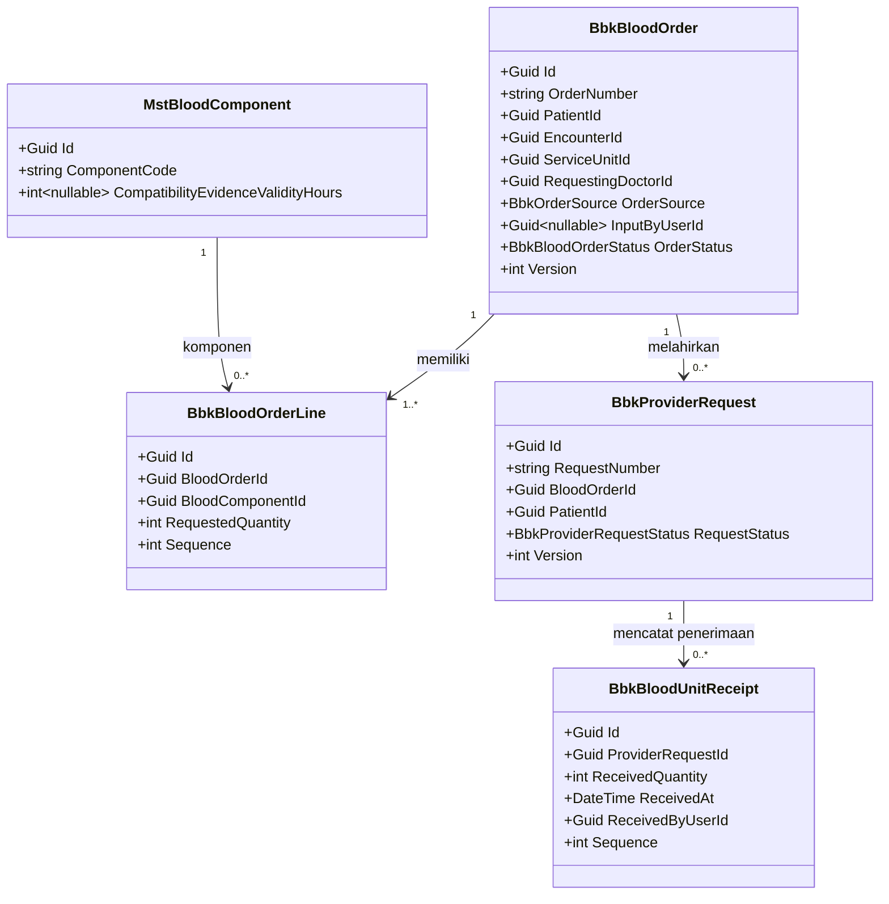
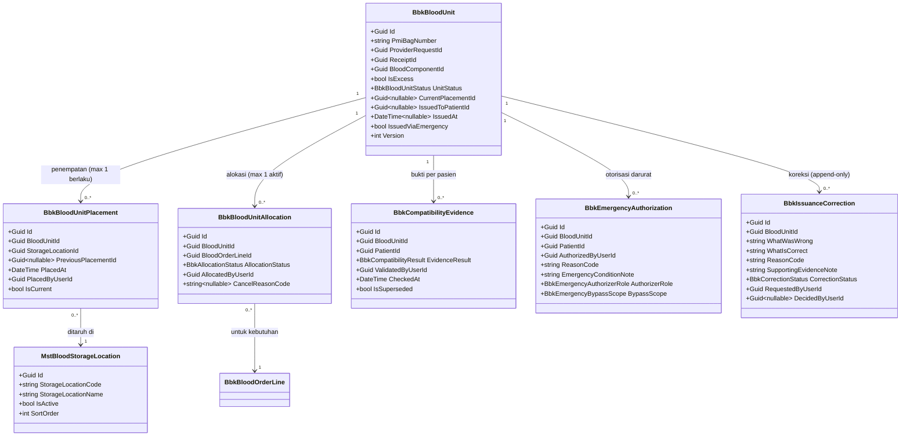
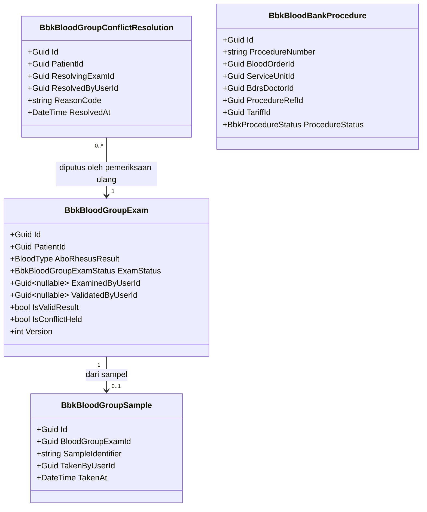
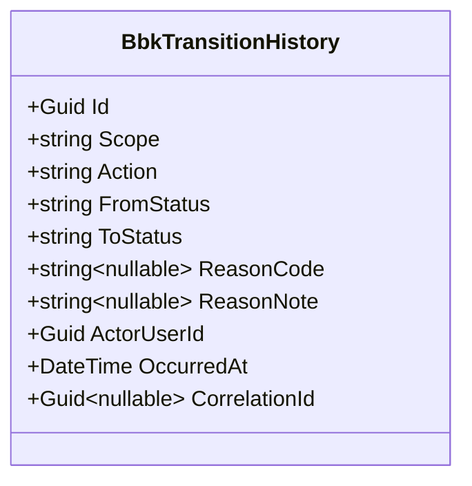

# Bank Darah — Backend Architecture

## A. Identitas dokumen

| Field | Value |
| --- | --- |
| Blueprint ID | `BD-BP-001` |
| Blueprint revision | `13` |
| Contract version | `v4` — status **`approved`** |
| `last_changed_in` | `v4` |
| Modul | Bank Darah (`bank-darah`) · Area `HealthServices` · Module `BloodBankManagement` (baru) |
| Tanggal | `2026-09-02` |
| Backend SHA | `ab39b63edd912e7a825e186be75537fc319a36ce` cabang `sukmagp` |
| Frontend SHA | `afbb8ab47a6a309f24cdaf6d72024f0dc1b2c254` cabang `sukmagpV2` |
| Sumber requirement | `00-interview-decisions.md` revisi 9 · `02-existing-capability-map.md` revisi 2 · `02-requirement-completeness-assessment.md` revisi 2 |
| Sumber arsitektur domain | `03-domain-architecture.md` revisi 6 — `DOMAIN_ARCHITECTURE_READY` |
| Pass ini | `v4` — penyerapan role residue closure (`DEC-BD-042`, `DEC-BD-043`, `DEC-BD-044`) |
| Owner | Product/domain: pemilik proses BDRS · API: pemilik arsitektur backend · Security: pemilik keamanan platform · Frontend authority: pemilik proses BDRS |
| `approved_by` / `approved_at` | `Sukmagp` / `2026-09-03` |

### Jejak requirement-ke-domain yang dipatuhi

Dokumen ini **tidak** merancang ulang batas domain. Bounded context, batas aggregate, ownership,
lifecycle, dampak billing, dan batas keselamatan klinis seluruhnya diambil dari
`03-domain-architecture.md` revisi 6. Yang dilakukan di sini hanyalah menurunkannya menjadi entity,
service, controller, folder, dan rencana migration sesuai pola repository.

Scope yang dirancang (seluruhnya `DOMAIN_ARCHITECTURE_READY`): `BD-AGG-01` sampai `BD-AGG-05`,
`BD-DOM-13`, `BD-DOM-14`, `BD-DOM-16`, `BD-DOM-17`, `BD-DOM-18`, `BD-DOM-21`, `BD-DOM-22`,
`BD-DOM-23`, **`BD-DOM-24`** (master lokasi penyimpanan darah), dan **`BD-DOM-25`** (riwayat
penempatan kantong).

**Yang berubah pada pass `v2`.** Empat keputusan diserap sekaligus:

| Keputusan | Akibat pada rancangan backend |
| --- | --- |
| `DEC-BD-035` | Master baru `MstBloodStorageLocation` milik BDRS. **Bukan** memakai ulang `MstDrugStorageLocation` yang sudah ada di `Areas/HealthServices/MasterData/Models/` |
| `DEC-BD-036` | `BbkBloodUnitStatus` bertambah dua nilai di depan (`Received`, `Stored`); lahir entity `BbkBloodUnitPlacement`; gerbang alokasi bertambah syarat |
| `DEC-BD-037` | Penonaktifan lokasi menutup gerbang alokasi tanpa menyentuh satu baris kantong pun; tidak ada perpindahan otomatis |
| `DEC-BD-038` | Gerbang pemberian memuat gerbang alokasi; otorisasi darurat wajib menyebut gerbang mana yang dilewati |

**Yang berubah pada pass `v3`.** Tiga keputusan penutup `DEF-BD-004`:

| Keputusan | Akibat pada rancangan backend |
| --- | --- |
| `DEC-BD-039` | Butir hak akses `BloodGroupExam : Validate` **dipecah** menjadi `Validate` (rutin) dan `ResolveConflict` (konflik). Tidak ada entity baru |
| `DEC-BD-040` | `BbkEmergencyAuthorization` bertambah dua kolom wajib: peran penerbit dan keterangan kondisi kedaruratan. Lahir enum `BbkEmergencyAuthorizerRole` |
| `DEC-BD-041` | **Perubahan bentuk, bukan sekadar peran.** `BbkIssuanceCorrection` memperoleh lifecycle (`Requested` → `Approved`/`Rejected`), kolom peminta dan pemutus terpisah, serta kolom bukti pendukung. Lahir enum `BbkCorrectionStatus`. Angka pemenuhan order **hanya** menghormati koreksi yang sudah disetujui (`INV-BD-033`) |

`DEC-BD-041` adalah satu-satunya keputusan pada rangkaian ini yang mengubah bentuk data. Dua lainnya
mengisi peran dan menambah kolom rekam.

**Yang berubah pada pass `v4`.** Tiga keputusan penutup sisa `DEF-BD-004`:

| Keputusan | Akibat pada rancangan backend |
| --- | --- |
| `DEC-BD-042` | `BbkCompatibilityEvidence` bertambah kolom **hasil keputusan**; lahir enum `BbkCompatibilityResult`. Wewenangnya memakai ulang butir `BloodUnit : Compatibility` yang sudah ada — **tanpa** mewajibkan pelaksana berbeda dari validator |
| `DEC-BD-043` | Butir `BloodUnit : Resolve` **dipecah tiga**: `ResolveReallocate`, `ResolveReturn`, `ResolveNotUsable`. Tidak ada entity, kolom, maupun endpoint baru — hanya penjaga yang berbeda per endpoint yang sudah ada |
| `DEC-BD-044` | Butir `BloodOrder : Cancel` **dipisah** dari `BloodOrder : Update`. `MstBloodBankReason` bertambah dua kategori alasan yang membedakan pembatalan klinis dari operasional |

Dua dari tiga keputusan ini **tidak menambah satu pun entity**. Yang bertambah hanya satu kolom, satu
enum, dan empat butir hak akses.

Yang **tidak** dirancang, sesuai perintah dan sesuai batas scope arsitektur: implementasi charge
Billing (`DEC-BD-016` menggantung), mekanik cetak label golongan darah (`OQ-BD-011`), integrasi API
PMI, integrasi HCLAB, mesin crossmatch, dan manajemen donor.

---

## B. Prefix registry — `BD-DEP-008` dan `BD-DEP-016` **keduanya tertutup**

Aturan struktur backend melarang memilih prefix entity sendiri (`QBE-NAM-004`); satu-satunya sumbernya
adalah registry kepemilikan modul. **Bank Darah kini terdaftar di sana**, commit `ed7fba8`
3 September 2026:

| Area | Module/pemilik | Category | Prefix | Lifecycle |
| --- | --- | --- | --- | --- |
| `HealthServices` | `BloodBankManagement / Blood Bank` | `BUSINESS DOMAIN / MODULE` | **`Bbk`** | **`ACTIVE`** |

Prefix yang disahkan **persis `Bbk`**, sama dengan yang diajukan blueprint sejak `v1`. Karena itu:

- Seluruh nama `Bbk*` pada dokumen ini **berlaku apa adanya**; tidak lagi placeholder.
- Skenario "prefix berbeda → seluruh nama berganti sebagai satu paket" yang tercatat sejak `v1`
  **tidak terjadi**.
- `QBE-NAM-004` terpenuhi: prefix berasal dari registry, bukan disimpulkan dari nama folder.
- Blueprint ini tetap **MUST NOT** memakai `Trx*` sebagai jalan pintas (`QBE-NAM-001`).

**Lifecycle dinaikkan ke `ACTIVE`** pada 3 September 2026 lewat commit `8075784`. Changelog registry
menyatakan aktivasi itu "membuka wewenang implementasi entity operasional `Bbk*` sesuai `QBE-MOD-002`".
Dengan itu `BD-DEP-016` tertutup dan **tidak ada lagi gerbang registry yang menahan** pembuatan entity
operasional maupun migration modul.

Dua batas tetap berlaku dan disebut changelog registry sendiri: **eksekusi database di luar dev
pemilik** dan **deployment** adalah wewenang terpisah, bukan bagian dari aktivasi ini.

Prefix master tetap `Mst`, berstatus `ACTIVE` di registry, dan tidak pernah terikat pengajuan ini.

---

## C. Bounded context dan ownership

Konteks pemilik modul ini adalah `BD-CTX-01` **Bank Darah**. Batas, aggregate root, invariant, dan
batas transaksinya diambil apa adanya dari `03-domain-architecture.md` §E.

| Aggregate | Root (entity) | Invariant utama yang dilindungi | Batas transaksi | Rollback |
| --- | --- | --- | --- | --- |
| `BD-AGG-01` Order Darah | `BbkBloodOrder` | Order menunjuk pasien & kunjungan sah; tiap baris punya komponen dari katalog & jumlah > 0; angka pemenuhan dihitung dari transaksi | Order + seluruh barisnya dalam satu transaksi | Order gagal dibuat → tidak ada baris tersimpan |
| `BD-AGG-02` Permintaan PMI | `BbkProviderRequest` | Selalu atas nama satu pasien; sisa = diminta − diterima, batas bawah 0, **tidak pernah negatif** (`INV-BD-017`); tak boleh digandakan untuk kebutuhan sama; penerimaan fisik tak pernah ditolak karena kelebihan | Permintaan + catatan penerimaan | Penerimaan gagal → stok tidak bertambah |
| `BD-AGG-03` Kantong Operasional | `BbkBloodUnit` | **Satu kantong ≤ satu alokasi aktif**; kantong tak pernah jadi stok bebas; **tak dapat dialokasikan sebelum melewati `Stored`** (`INV-BD-025`) **maupun selama penempatan terakhirnya menunjuk lokasi nonaktif** (`INV-BD-028`); **riwayat penempatan hanya bertambah, maks. satu penempatan berlaku** (`INV-BD-026`); **pemberian jalur normal menuntut gerbang alokasi + bukti kecocokan berlaku yang hasilnya cocok, dinilai ulang saat pemberian** (`INV-BD-029`, `DEC-BD-042`); otorisasi darurat wajib menyebut gerbang yang dilewati (`INV-BD-030`); **pemberian tak pernah dihapus/dibalik** (`INV-BD-021`) · **koreksi berlaku hanya setelah disetujui, dan peminta ≠ penyetuju** (`INV-BD-033`) | Kantong + penempatan + alokasi + bukti + otorisasi darurat + koreksi | Alokasi bentrok → transaksi kedua ditolak lewat token konkurensi |
| `BD-AGG-04` Pemeriksaan Golongan Darah | `BbkBloodGroupExam` | Hasil belum tervalidasi tak dipakai klinis; hasil tervalidasi tak pernah ditimpa; konflik hanya ditutup lewat pemeriksaan ulang tervalidasi, tak pernah hitung mayoritas (`INV-BD-022`) · **validasi rutin dan penyelesaian konflik adalah dua wewenang terpisah** (`INV-BD-031`) | Pemeriksaan + sampelnya | Validasi gagal → status tetap `ResultRecorded` |
| `BD-AGG-05` Tindakan Bank Darah | `BbkBloodBankProcedure` | Menunjuk satu order sah; tarif tak pernah dihitung sendiri; satu tindakan ≤ satu fakta biaya; **koreksi tak membalik biaya otomatis** (`INV-BD-024`) | Tindakan + konteksnya | — |

Empat invariant **lintas aggregate** (`BD-XINV-01`..`04`) tidak dijaga satu batas transaksi;
mekanismenya ada di `contracts/concurrency` (bagian K) dan `contracts/validation-matrix.md`.

---

## D. Tabel kepemilikan data

Pertahanan langsung terhadap duplikasi entity. Kolom "Dibuat ulang" bernilai **Tidak** untuk seluruh
master bersama; Bank Darah menyimpan rujukan (`Id`), bukan salinan.

| Kelompok data | Modul pemilik | Dipakai modul ini | Dibuat ulang di modul ini |
| --- | --- | :---: | --- |
| Pasien | PatientManagement | Ya | Tidak — rujuk `PatientId` (`BD-CAP-001`) |
| Kunjungan & status penutupannya | RegistrationManagement + InPatientManagement | Ya | Tidak — rujuk `EncounterId`; status dibaca lewat adapter (`BD-CAP-002`, `BD-CAP-003`) |
| Dokter | HR — Master Data Workforce | Ya | Tidak — rujuk `DoctorId` (`BD-CAP-004`) |
| Unit pelayanan, klinik, ruangan, kelas pasien | HealthServices — Master Data | Ya | Tidak — rujuk `Id` (`BD-CAP-006`) |
| Kewenangan unit memesan darah | HealthServices — Master Data | Ya | **Extend** — tambah satu kolom penanda pada `MstServiceUnit` (`BD-CAP-005`, `BD-DOM-18`) |
| Tindakan & tarif | HealthServices — Master Data / Billing | Ya | Tidak — rujuk `ProcedureId`/`TariffId` + snapshot kode-nama-tarif (`BD-CAP-008`) |
| Nilai golongan darah (ABO+Rhesus) | Platform backend | Ya | Tidak — pakai enum `BloodType` yang sudah ada (`BD-CAP-016`) |
| Fakta biaya (charge) ke Billing | BillingManagement | Ya (produsen fakta) | **Tidak dirancang** — `DEC-BD-016` menggantung (`BD-CAP-015`) |
| Order darah, permintaan PMI, kantong, alokasi, bukti kecocokan, pemeriksaan golongan darah, sampel, tindakan, riwayat | **Bank Darah** | Ya | **Ya, baru** — belum ada di sistem (`BD-CAP-019`, `BD-CAP-017`) |
| Katalog komponen darah | **Bank Darah** | Ya | **Ya, baru** master (`BD-CAP-018`, `BD-DOM-13`) |
| **Lokasi penyimpanan darah (kulkas darah)** | **Bank Darah** | Ya | **Ya, baru** master `MstBloodStorageLocation` (`BD-DOM-24`, `DEC-BD-035`) |
| **Lokasi penyimpanan obat / cold storage farmasi** | HealthServices — Master Data (berorientasi Farmasi) | **Tidak** | Tidak — dan **tidak dipakai ulang**. `MstDrugStorageLocation` sudah ada, tetapi ditolak `DEC-BD-035`; lihat bagian L |
| **Riwayat penempatan kantong** | **Bank Darah** | Ya | **Ya, baru** `BbkBloodUnitPlacement` (`BD-DOM-25`) |
| Daftar alasan terkendali | **Bank Darah** | Ya | **Ya, baru** master (`BD-DOM-14`) |
| Golongan darah administratif `MstPatient.BloodType` | PatientManagement | **Hanya sebagai pembeda** | Tidak — dilarang jadi sumber klinis (`INV-BD-014`) |

**Catatan celah cakupan audit.** `BD-CAP-006` tidak menyebut `MstDrugStorageLocation`, padahal berkasnya
ada di `Areas/HealthServices/MasterData/Models/MstDrugStorageLocation.cs`. Celah **cakupan** audit ini
sudah diperiksa langsung terhadap sumbernya dan **tidak mengubah kesimpulan mana pun**, karena
`DEC-BD-035` justru menolak memakai ulang master itu. Bukti penolakannya terbaca pada isi master
tersebut: `IsPharmacyLocation` (bawaan `true`), `IsControlledDrugStorage`, `IsHighAlertStorage`,
`IsAllowDispensing`, `IsAllowReceiving`, rentang suhu dan kelembapan — seluruhnya aturan bisnis farmasi
yang tidak berlaku bagi kantong darah. Memakainya ulang berarti menaruh dua pemilik proses di atas satu
tabel.

---

## E. Class diagram per bounded context

Diagram dipecah per aggregate agar tiap diagram muat satu layar. Hanya field kunci, status, dan field
aturan bisnis yang ditampilkan; field lengkap ada di `data/data-dictionary.md`. Entity master bersama
(`MstPatient`, dll.) ditampilkan sebagai kotak rujukan, **bukan** milik modul ini.

### E.1 Order Darah (`BD-AGG-01`) dan Permintaan PMI (`BD-AGG-02`)



### E.2 Kantong Darah Operasional (`BD-AGG-03`)



**Kenapa `MstBloodStorageLocation` digambar di sini walaupun bukan milik aggregate.** Ia data rujukan
yang berada **di luar** batas `BD-AGG-03`, sama seperti `MstBloodComponent`. Ia digambar karena
penanda `IsActive`-nya ikut menentukan dua gerbang, sehingga hubungannya perlu terbaca. Yang dilarang
adalah menariknya **masuk** ke dalam batas transaksi kantong — penyuntingan nama kulkas tidak boleh
mengunci kantong di dalamnya.

**Kenapa `CurrentPlacementId` ada padahal lokasi saat ini adalah jawaban turunan.** `ARCH-BD-POS-05`
mengunci **larangannya berbeda dari riwayat**, bukan cara menyimpannya, dan menyerahkan pilihan
penyimpanan ke dokumen ini. Yang dipilih: simpan penunjuk ke penempatan terakhir demi kemudahan baca,
dengan syarat penunjuk itu **selalu** hasil dari penempatan terakhir dan tidak pernah disunting
sendiri. Konsekuensinya mengikat implementasi — menambah penempatan dan memindahkan penunjuk terjadi
dalam **satu** transaksi, dan `IsCurrent` pada penempatan lama ikut dipadamkan di transaksi yang sama.
Alternatif yang ditolak: menyimpan `StorageLocationId` langsung pada kantong, karena nilai itu dapat
disunting tanpa menambah riwayat dan membuat kedua sumber berselisih.

### E.3 Pemeriksaan Golongan Darah (`BD-AGG-04`) dan Tindakan (`BD-AGG-05`)



### E.4 Riwayat pergerakan (`BD-DOM-15`)



`BbkTransitionHistory` merekam perpindahan status Order, Permintaan, dan Kantong. Hanya bisa ditambah;
tidak ada jalur update maupun delete di service (pola `BD-CAP-009`).

---

## F. Penjelasan setiap class

Status memakai `Baru` / `Diperbarui` / `Sudah ada`. Lokasi file mengikuti `backend-structure-rules.md`.
Seluruh entity `Bbk*` berlokasi di `Areas/HealthServices/BloodBankManagement/Models/`, dan Configuration
terpisah di `Repositories/Configurations/HealthServices/BloodBankManagement/`.

### F.1 Model — aggregate root

**`BbkBloodOrder`** — `BD-DOM-01`

| Aspek | Penjelasan |
| --- | --- |
| Status | `Baru` — aktivasi modul (`BD-DEP-016`) sudah turun 3 September 2026; pembuatannya berwenang dijadwalkan lewat `BE-BD-003` |
| Lokasi file | `Areas/HealthServices/BloodBankManagement/Models/BbkBloodOrder.cs` |
| Kategori | Transaksi |
| Tanggung jawab | Menyimpan satu permintaan kebutuhan darah untuk seorang pasien, dari unit pelayanan (elektronik) atau diinput Bank Darah (manual). Angka pemenuhan tidak disimpan sebagai kolom; dihitung dari pemberian nyata |
| Field penting | `OrderNumber` (dari number-series), `PatientId`, `EncounterId`, `ServiceUnitId`, `RequestingDoctorId`, `OrderSource`, `InputByUserId` (wajib bila manual), `OrderStatus`, `Version` |
| Relasi | Memiliki banyak `BbkBloodOrderLine`; dirujuk `BbkProviderRequest` dan `BbkBloodBankProcedure` |
| Pemakaian alur | Dibuat di awal proses; ditutup saat terpenuhi penuh, dibatalkan, atau kunjungan berakhir |
| Catatan desain | Jangan menyimpan `FulfilledQuantity` sebagai kolom yang disunting; dihitung `BD-DOM-17`. Deteksi ganda `BD-XINV-01` bukan urusan satu order |
| Ekuivalen lama | — |

**`BbkProviderRequest`** — `BD-DOM-03`

| Aspek | Penjelasan |
| --- | --- |
| Status | `Baru` |
| Lokasi file | `.../BloodBankManagement/Models/BbkProviderRequest.cs` |
| Kategori | Transaksi |
| Tanggung jawab | Catatan administratif permintaan pasokan ke PMI atas nama satu pasien. Pengirimannya manual di luar sistem (`DEC-BD-002`) |
| Field penting | `RequestNumber`, `BloodOrderId`, `PatientId`, `RequestStatus`, `Version`. Jumlah diminta diturunkan dari baris order; sisa = diminta − Σ penerimaan, batas bawah 0 |
| Relasi | Milik satu `BbkBloodOrder`; mencatat banyak `BbkBloodUnitReceipt` |
| Pemakaian alur | Dibuat petugas Bank Darah setelah order; ditutup `Fulfilled`, `Cancelled`, atau `ClosedEncounter` |
| Catatan desain | Penerimaan fisik **tak pernah ditolak** karena kelebihan (`DEC-BD-025`); sisa berhenti di 0, kantong berlebih ditandai `IsExcess` dan masuk `PendingReview` |
| Ekuivalen lama | — (pola dari `LabOrder`, `BD-CAP-007`) |

**`BbkBloodUnit`** — `BD-DOM-05`

| Aspek | Penjelasan |
| --- | --- |
| Status | `Baru` |
| Lokasi file | `.../BloodBankManagement/Models/BbkBloodUnit.cs` |
| Kategori | Transaksi |
| Tanggung jawab | Satu kantong fisik yang sudah diterima MMC. Membawa identitas PMI dan seluruh lifecycle pemakaiannya |
| Field penting | `PmiBagNumber` (identifier bisnis unik, dari PMI — `ASM-BD-003`), `ProviderRequestId` (asal, **tak pernah putus**), `ReceiptId`, `BloodComponentId`, `IsExcess`, `UnitStatus`, `IssuedToPatientId`, `IssuedAt`, `IssuedViaEmergency`, `Version` |
| Relasi | Milik `BbkProviderRequest` (asal); punya banyak alokasi, bukti, otorisasi darurat, koreksi |
| Pemakaian alur | Lahir saat penerimaan fisik; berpindah lewat alokasi → pemberian, atau menunggu keputusan → dialihkan/dikembalikan/tidak layak |
| Catatan desain | Nomor kantong **tidak** diterbitkan server. Pemberian (`IssuedAt`) bersifat terminal & tak dapat dibalik; koreksi hanya lewat `BbkIssuanceCorrection`. `Version` menjaga alokasi tunggal aktif |
| Ekuivalen lama | — |

**`BbkBloodGroupExam`** — `BD-DOM-09`

| Aspek | Penjelasan |
| --- | --- |
| Status | `Baru` |
| Lokasi file | `.../BloodBankManagement/Models/BbkBloodGroupExam.cs` |
| Kategori | Transaksi |
| Tanggung jawab | Satu pemeriksaan golongan darah milik Bank Darah, dengan status validasinya sendiri. Sumber sah golongan darah pasien (`DEC-BD-015`) |
| Field penting | `PatientId`, `AboRhesusResult` (enum `BloodType`), `ExamStatus`, `ExaminedByUserId`, `ValidatedByUserId`, `IsValidResult`, `IsConflictHeld`, `Version` |
| Relasi | Dari 0..1 `BbkBloodGroupSample`; dirujuk `BbkBloodGroupConflictResolution` sebagai pemeriksaan ulang yang memutus |
| Pemakaian alur | Sampel → hasil dicatat → validasi. Bila hasil tervalidasi baru berbeda dari sah sebelumnya → keadaan konflik (`IsConflictHeld`), diselesaikan lewat pemeriksaan ulang (`DEC-BD-031`) |
| Catatan desain | Hasil tervalidasi **tak pernah ditimpa**. "Golongan darah sah pasien" adalah turunan (`BD-DOM-21`), bukan kolom di `MstPatient` |
| Ekuivalen lama | — |

**`BbkBloodBankProcedure`** — `BD-DOM-12`

| Aspek | Penjelasan |
| --- | --- |
| Status | `Baru` |
| Lokasi file | `.../BloodBankManagement/Models/BbkBloodBankProcedure.cs` |
| Kategori | Transaksi |
| Tanggung jawab | Mencatat tindakan Bank Darah beserta konteksnya sebagai dasar biaya. **Penyaluran fakta biaya ke Billing tidak dirancang** (`DEC-BD-016`) |
| Field penting | `ProcedureNumber`, `BloodOrderId`, `ServiceUnitId`, `BdrsDoctorId`, `ProcedureRefId`, `TariffId` + snapshot kode/nama/tarif, `ProcedureStatus` |
| Relasi | Milik satu `BbkBloodOrder`; merujuk tindakan & tarif milik Master Data/Billing |
| Pemakaian alur | Dicatat lalu dinyatakan selesai; satu tindakan ≤ satu fakta biaya |
| Catatan desain | Tarif **tidak** dihitung sendiri; disalin sebagai snapshot (pola `BD-CAP-008`). Koreksi pemberian tak membalik biaya (`INV-BD-024`) |
| Ekuivalen lama | — |

### F.2 Model — entity di dalam aggregate

| Class | Status | Lokasi | Tanggung jawab & catatan |
| --- | --- | --- | --- |
| `BbkBloodOrderLine` (`BD-DOM-02`) | `Baru` | `.../Models/BbkBloodOrderLine.cs` | Baris komponen+jumlah di bawah order. `RequestedQuantity` > 0; `BloodComponentId` wajib dari katalog |
| `BbkBloodUnitReceipt` (`BD-DOM-04`) | `Baru` | `.../Models/BbkBloodUnitReceipt.cs` | Mencatat kedatangan fisik. Stok bertambah **hanya** lewat konsep ini; tak pernah ditolak karena kelebihan; melahirkan `BbkBloodUnit` |
| `BbkBloodUnitAllocation` (`BD-DOM-06`) | `Baru` | `.../Models/BbkBloodUnitAllocation.cs` | Mengikat kantong ke satu baris kebutuhan. **Maks. satu `Active` per kantong**; pembatalan tak menghapus, hanya `Cancelled` + alasan/pelaku/waktu (`DEC-BD-029`) |
| `BbkBloodUnitPlacement` (`BD-DOM-25`) | `Baru` | `.../Models/BbkBloodUnitPlacement.cs` | Riwayat penempatan kantong: di kulkas mana, sejak kapan, oleh siapa. **Append-only** (`INV-BD-026`); penempatan pertama membawa kantong `Received`→`Stored`, penempatan berikutnya adalah perpindahan yang **tidak** mengubah status. Maks. satu `IsCurrent=true` per kantong. `StorageLocationId` wajib menunjuk lokasi **aktif** saat penempatan dibuat (`INV-BD-027`) |
| `BbkCompatibilityEvidence` (`BD-DOM-07`) | `Baru` | `.../Models/BbkCompatibilityEvidence.cs` | Bukti kecocokan **terikat pasangan kantong+pasien**. Masa berlaku dihitung dari `CheckedAt` + `CompatibilityEvidenceValidityHours` komponen (`DEC-BD-027`). Pengalihan → `IsSuperseded` (`DEC-BD-028`). **Sejak `v4`** menyimpan **hasil keputusan** (`EvidenceResult`) dan validator yang menyatakannya (`DEC-BD-042`); bukti yang hasilnya **tidak cocok** tetap tersimpan dan **tidak** membuka gerbang pemberian |
| `BbkEmergencyAuthorization` (`BD-DOM-08`) | `Baru` | `.../Models/BbkEmergencyAuthorization.cs` | Menggantikan **gerbang pemberian** pada keadaan darurat — bukti kecocokan, lokasi nonaktif, atau keduanya. Alasan wajib; penanda permanen (`DEC-BD-017`). `BypassScope` **wajib** menyatakan gerbang mana yang dilewati (`INV-BD-030`). **Sejak `v3`** penerbitnya Dokter BDRS **atau** DPJP pasien, dan dua kolom baru wajib terisi: `AuthorizerRole` (peran yang dipakai) dan `EmergencyConditionNote` (keadaan klinis saat itu) — `DEC-BD-040`, `INV-BD-032` |
| `BbkIssuanceCorrection` (`BD-DOM-23`) | `Baru` | `.../Models/BbkIssuanceCorrection.cs` | Menyatakan **pencatatan** pemberian keliru. Append-only; tak pernah menghapus/membalik/memindah ke pasien lain (`DEC-BD-030`, `INV-BD-021`). **Sejak `v3` punya lifecycle dua tahap** (`DEC-BD-041`): dibuat `Requested` oleh petugas BDRS, lalu `Approved`/`Rejected` oleh Dokter BDRS. **Belum berlaku selama `Requested`** — angka pemenuhan order tidak bergerak (`INV-BD-033`). Peminta dan pemutus wajib orang berbeda |
| `BbkBloodGroupSample` (`BD-DOM-10`) | `Baru` | `.../Models/BbkBloodGroupSample.cs` | Sampel Bank Darah, bukan sampel Laboratorium; tak menimbulkan tagihan Lab (`DEC-BD-018`) |
| `BbkBloodGroupConflictResolution` (`BD-DOM-22`) | `Baru` | `.../Models/BbkBloodGroupConflictResolution.cs` | Menutup keadaan konflik. Append-only; **wajib** menunjuk `ResolvingExamId` (pemeriksaan ulang tervalidasi) + validator/alasan/waktu (`DEC-BD-031`) |
| `BbkTransitionHistory` (`BD-DOM-15`) | `Baru` | `.../Models/BbkTransitionHistory.cs` | Riwayat pergerakan append-only; menyalin `ReasonNote` sebagai teks saat kejadian |

### F.3 Master / reference

| Class | Status | Lokasi | Catatan |
| --- | --- | --- | --- |
| `MstBloodComponent` (`BD-DOM-13`) | `Baru` | `Areas/HealthServices/MasterData/Models/MstBloodComponent.cs` | Katalog komponen (PRC, TC, FFP, dst). Kolom `CompatibilityEvidenceValidityHours` (nullable, konfigurasi per komponen — `DEC-BD-032`). **Master, bukan menu Setup baru** |
| `MstBloodBankReason` (`BD-DOM-14`) | `Baru` | `Areas/HealthServices/MasterData/Models/MstBloodBankReason.cs` | Daftar alasan terkendali dengan `ReasonCategory`. Alasan tak boleh teks bebas (`INV-BD-016`); perubahan berjejak |
| `MstBloodStorageLocation` (`BD-DOM-24`) | `Baru` | `Areas/HealthServices/MasterData/Models/MstBloodStorageLocation.cs` | Master lokasi penyimpanan darah milik BDRS (Kulkas Besar, Kulkas Kecil, dst). Kolom inti: `StorageLocationCode`, `StorageLocationName`, `IsActive`, `SortOrder`, `Description`. **Tidak** memuat suhu, kapasitas, rak/shelf/bin, maupun penanda farmasi apa pun — di luar scope MVP (`DEC-BD-035`). Nonaktif **tidak pernah dihapus**, karena penempatan lama wajib tetap terbaca |
| `MstServiceUnit` (`BD-DOM-18`) | `Diperbarui` | `Areas/HealthServices/MasterData/Models/MstServiceUnit.cs` | **Milik Master Data**, bukan Bank Darah. Ditambah **satu kolom** `IsAvailableForBloodOrder` (bool, default `false`) bergaya `IsAvailableFor*` yang sudah ada (`BD-CAP-005`) |

### F.4 Service (tanpa interface, `AddScoped`, di-inject ke controller)

| Service | Status | Lokasi | Fungsi utama | Buka transaksi DB |
| --- | --- | --- | --- | --- |
| `BbkBloodOrderService` | `Baru` | `.../BloodBankManagement/Services/BbkBloodOrderService.cs` | CRUD order, deteksi ganda `BD-XINV-01`, hitung pemenuhan `BD-DOM-17`, alokasi number-series order | Ya |
| `BbkProviderRequestService` | `Baru` | `.../Services/BbkProviderRequestService.cs` | Buat permintaan (`BD-XINV-02`), catat penerimaan (termasuk kelebihan `BD-XINV-03`), tutup administratif | Ya |
| `BbkBloodUnitService` | `Baru` | `.../Services/BbkBloodUnitService.cs` | **Penetapan lokasi (`Received`→`Stored`) & perpindahan lokasi**, alokasi & pembatalan, catat bukti kecocokan, pemberian (+darurat), koreksi, penyelesaian `PendingReview`. Memegang **dua gerbang**: `EvaluateAllocationGate` dan `EvaluateIssuanceGate` — lihat catatan di bawah | Ya |
| `BbkBloodGroupExamService` | `Baru` | `.../Services/BbkBloodGroupExamService.cs` | Sampel, catat hasil, **validasi rutin**, deteksi konflik `BD-XINV-04`, **penyelesaian konflik**. Dua tindakan terakhir dijaga butir hak akses yang **berbeda** (`DEC-BD-039`) | Ya |
| `BbkBloodBankProcedureService` | `Baru` | `.../Services/BbkBloodBankProcedureService.cs` | Catat & selesaikan tindakan. **Tidak** memanggil producer Billing (tertahan `DEC-BD-016`) | Ya |
| `BbkEncounterStatusReader` (`BD-DOM-16`) | `Baru` | `.../Services/BbkEncounterStatusReader.cs` | Adapter baca status kunjungan/episode; **tak pernah menulis** ke modul hulu (`DEC-BD-014`) | Tidak |
| `MstBloodComponentService` | `Baru` | `Areas/HealthServices/MasterData/Services/MstBloodComponentService.cs` | CRUD katalog komponen | Ya |
| `MstBloodBankReasonService` | `Baru` | `Areas/HealthServices/MasterData/Services/MstBloodBankReasonService.cs` | CRUD daftar alasan | Ya |
| `MstBloodStorageLocationService` | `Baru` | `Areas/HealthServices/MasterData/Services/MstBloodStorageLocationService.cs` | CRUD master lokasi penyimpanan darah, termasuk aktif/nonaktif. **Menonaktifkan lokasi tidak menyentuh satu baris kantong pun** (`DEC-BD-037`) | Ya |

Alokasi nomor bisnis (`OrderNumber`, `RequestNumber`, `ProcedureNumber`) memakai provider
number-series atomik yang sudah ada; **MUST NOT** memakai Count+1 / Max+1 (`QBE-CODE-002/003`).

**Perubahan `v4` pada `BbkBloodUnitService`.** Predikat `EvaluateIssuanceGate` bertambah satu syarat:
bukti kecocokan yang dipakai wajib berhasil **cocok**. Sebelum `v4`, keberadaan bukti sudah cukup —
karena bukti hanya dicatat ketika hasilnya memang cocok. Sejak hasil keputusan disimpan eksplisit
(`DEC-BD-042`), keberadaan saja tidak lagi cukup: bukti yang menyatakan **tidak cocok** juga tersimpan,
dan meloloskannya berarti memberikan darah yang sudah dinyatakan tidak cocok oleh manusia.

Ketiga jalur penyelesaian `PendingReview` tetap satu service, tetapi **tiga butir hak akses berbeda**
menjaganya (`DEC-BD-043`). Pemisahan itu ada pada atribut controller, bukan pada pemecahan service —
ketiganya berbagi batas transaksi dan invariant yang sama.

**Perubahan `v3` pada `BbkBloodUnitService`.** Jalur koreksi pecah menjadi dua tindakan yang berbeda
wewenangnya: `RequestIssuanceCorrection` (petugas BDRS) dan `DecideIssuanceCorrection`
(Dokter BDRS, menyetujui atau menolak). Perhitungan ringkasan pemenuhan (`BD-DOM-17`) **wajib**
menyaring hanya koreksi berstatus `Approved`; menyertakan koreksi `Requested` akan membuat angka
pemenuhan bergerak sebelum keputusan turun, dan itu persis yang dilarang `INV-BD-033`.

**Dua gerbang pada `BbkBloodUnitService`, dan kenapa keduanya satu fungsi masing-masing.**
`ARCH-BD-POS-06` dan `ARCH-BD-POS-07` menuntut tiap gerbang dinyatakan sebagai **satu** pertanyaan,
bukan beberapa pemeriksaan tersebar. Turunannya:

| Gerbang | Pertanyaan tunggal yang dijawab | Dipakai oleh |
| --- | --- | --- |
| `EvaluateAllocationGate(unit)` | Kantong sudah melewati `Stored` **dan** penempatan terakhirnya menunjuk lokasi yang `IsActive` | `allocate`, `reallocate` |
| `EvaluateIssuanceGate(unit, patientId, now)` | **Seluruh** `EvaluateAllocationGate` **ditambah** bukti kecocokan berlaku untuk pasien tujuan dan belum lewat masa berlakunya | `issue` |

Aturan yang mengikat implementasi: keduanya dinilai **saat tindakan dicoba**, tidak pernah membaca
hasil pemeriksaan yang tersimpan dari tindakan sebelumnya (`INV-BD-029`), dan keaktifan lokasi
**tidak pernah disalin** ke `BbkBloodUnit` (`ARCH-BD-POS-06`). Konsekuensi yang disengaja: menonaktifkan
satu lokasi cukup satu `UPDATE` pada satu baris master, dan seluruh gerbang kantong di dalamnya ikut
tertutup pada saat yang sama — **tanpa** background job, tanpa batch update, tanpa jendela waktu
setengah-jalan.

### F.5 Controller (satu grup Swagger per resource)

| Controller | Status | Lokasi | Service dipakai | Atribut akses |
| --- | --- | --- | --- | --- |
| `BbkBloodOrderController` | `Baru` | `.../BloodBankManagement/Controllers/BbkBloodOrderController.cs` | `BbkBloodOrderService` | `[AccessController]`, `[AccessPermission("BloodOrder", ...)]` |
| `BbkProviderRequestController` | `Baru` | `.../Controllers/BbkProviderRequestController.cs` | `BbkProviderRequestService` | `[AccessPermission("BloodProviderRequest", ...)]` |
| `BbkBloodUnitController` | `Baru` | `.../Controllers/BbkBloodUnitController.cs` | `BbkBloodUnitService` | `[AccessPermission("BloodUnit", ...)]` |
| `BbkBloodGroupExamController` | `Baru` | `.../Controllers/BbkBloodGroupExamController.cs` | `BbkBloodGroupExamService` | `[AccessPermission("BloodGroupExam", ...)]` |
| `BbkBloodBankProcedureController` | `Baru` | `.../Controllers/BbkBloodBankProcedureController.cs` | `BbkBloodBankProcedureService` | `[AccessPermission("BloodBankProcedure", ...)]` |
| `MstBloodComponentController` | `Baru` | `Areas/HealthServices/MasterData/Controllers/MstBloodComponentController.cs` | `MstBloodComponentService` | `[AccessPermission("BloodComponent", ...)]` |
| `MstBloodBankReasonController` | `Baru` | `Areas/HealthServices/MasterData/Controllers/MstBloodBankReasonController.cs` | `MstBloodBankReasonService` | `[AccessPermission("BloodBankReason", ...)]` |
| `MstBloodStorageLocationController` | `Baru` | `Areas/HealthServices/MasterData/Controllers/MstBloodStorageLocationController.cs` | `MstBloodStorageLocationService` | `[AccessPermission("BloodStorageLocation", ...)]` |

Seluruh controller: Controller → Module Service → `ApplicationDbContext` (`QBE-SVC-001`); controller
**MUST NOT** menyentuh context langsung. Pemetaan endpoint→hak akses lengkap ada di
`contracts/api-contract.md`.

### F.6 Enum

| Enum | Nilai | Lokasi |
| --- | --- | --- |
| `BbkBloodOrderStatus` | `Active`, `PartiallyFulfilled`, `FullyFulfilled`, `Cancelled`, `Expired` | `.../BloodBankManagement/Enums/BbkBloodOrderStatus.cs` |
| `BbkProviderRequestStatus` | `Requested`, `PartiallyFulfilled`, `Fulfilled`, `Cancelled`, `ClosedEncounter` | `.../Enums/BbkProviderRequestStatus.cs` |
| `BbkBloodUnitStatus` | **`Received`**, **`Stored`**, `Available`, `Allocated`, `Issued`, `PendingReview`, `Reallocated`, `ReturnedToProvider`, `NotUsable` | `.../Enums/BbkBloodUnitStatus.cs` |
| `BbkAllocationStatus` | `Active`, `Cancelled` | `.../Enums/BbkAllocationStatus.cs` |
| `BbkBloodGroupExamStatus` | `SampleTaken`, `ResultRecorded`, `Validated` | `.../Enums/BbkBloodGroupExamStatus.cs` |
| `BbkOrderSource` | `Electronic`, `Manual` | `.../Enums/BbkOrderSource.cs` |
| `BbkProcedureStatus` | `Recorded`, `Completed` | `.../Enums/BbkProcedureStatus.cs` |
| `BbkEmergencyBypassScope` | `CompatibilityEvidence`, `InactiveStorageLocation`, `Both` | `.../Enums/BbkEmergencyBypassScope.cs` |
| `BbkEmergencyAuthorizerRole` | `BloodBankDoctor`, `AttendingPhysician` | `.../Enums/BbkEmergencyAuthorizerRole.cs` |
| `BbkCorrectionStatus` | `Requested`, `Approved`, `Rejected` | `.../Enums/BbkCorrectionStatus.cs` |
| `BbkCompatibilityResult` | `Compatible`, `Incompatible` | `.../Enums/BbkCompatibilityResult.cs` |
| `BloodType` (dipakai ulang) | `Sudah ada` — `Enums/BloodType.cs` (`BD-CAP-016`) | tidak dibuat ulang |

Keadaan "konflik golongan darah" **bukan** enum tersendiri; ia flag `IsConflictHeld` pada
`BbkBloodGroupExam` (menghindari entity-per-status). Lewatnya masa berlaku bukti **bukan** status
tersimpan; dihitung saat gerbang diperiksa (`ARCH-BD-POS-01`).

**Dua nilai baru pada `BbkBloodUnitStatus`, dan satu yang sengaja tidak dibuat.** `Received` dan
`Stored` masuk sebagai nilai enum karena keduanya keadaan yang benar-benar dipegang kantong
(`DEC-BD-036`). Sebaliknya, "berada di lokasi nonaktif" **tidak** menjadi nilai status: ia kondisi
turunan yang dihitung dari `MstBloodStorageLocation.IsActive` saat gerbang diperiksa
(`ARCH-BD-POS-06`), mengikuti pola yang sama dengan lewatnya masa berlaku bukti. Menjadikannya status
akan menuntut penyuntingan massal setiap kali satu kulkas dinonaktifkan, dan itu justru yang dilarang
`DEC-BD-037`.

**Kenapa `BbkCompatibilityResult` hanya dua nilai, dan kenapa `Incompatible` tetap disimpan.**
`DEC-BD-042` menuntut hasil keputusan tersimpan, dan sebuah "hasil" yang hanya punya satu nilai bukan
hasil — ia sekadar penanda keberadaan. Dua nilai adalah bentuk terkecil yang benar-benar menyimpan
keputusan manusia. Bukti yang hasilnya `Incompatible` **tetap disimpan**, tidak dibuang: fakta bahwa
kantong itu pernah diuji terhadap pasien itu dan dinyatakan tidak cocok adalah bagian riwayat yang
paling berguna, dan membuangnya membuka jalan bagi orang berikutnya mengulang uji yang sama.

⚠️ **Satu penurunan yang perlu dibaca teliti, karena ia mengetatkan gerbang.** Menyimpan hasil
keputusan tanpa memeriksanya di gerbang akan menciptakan lubang *fail-open*: bukti bertanda "tidak
cocok" akan membuka gerbang hanya karena ia ada. Karena itu predikat gerbang pemberian pada `v4`
menuntut hasil **cocok**, bukan sekadar keberadaan bukti. Ini penurunan dari `DEC-BD-042`, **bukan**
aturan baru yang dikarang — tetapi pemilik proses belum menegaskannya, dan pertanyaannya terbuka
sebagai `OQ-BD-018`. Bila pemilik menghendaki hasil keputusan bersifat keterangan saja, pengetatan ini
dicabut. Sampai itu dinyatakan, rancangan memilih arah *fail-closed*, konsisten dengan seluruh
keputusan keselamatan modul ini.

**Kenapa `BbkEmergencyAuthorizerRole` disimpan, padahal pelakunya sudah tercatat.** `AuthorizedByUserId`
menjawab *siapa*, bukan *dengan wewenang apa*. `DEC-BD-040` membuka dua jalur wewenang yang berbeda —
Dokter BDRS dan DPJP pasien — dan seorang dokter bisa saja memenuhi keduanya pada kasus yang berbeda.
Tanpa kolom ini, peninjau tidak dapat membedakan jalur mana yang dipakai, dan seluruh gunanya membuka
dua jalur menjadi tidak terlacak (`INV-BD-032`).

**Kenapa `BbkCorrectionStatus` punya `Rejected`, bukan hanya `Requested` dan `Approved`.** Permintaan
koreksi yang ditolak **tetap tersimpan dan tetap terbaca**. Menghapusnya, atau membiarkannya
menggantung selamanya di `Requested`, sama-sama menghilangkan fakta bahwa seseorang pernah menyatakan
catatan itu keliru dan pemutus tidak sependapat. Itu justru bagian riwayat yang paling berguna saat
ditinjau kemudian.

**Kenapa satu pasang kolom pemutus, bukan dua pasang.** Yang dipakai `DecidedByUserId` dan `DecidedAt`,
bukan `ApprovedBy`/`ApprovedAt` ditambah `RejectedBy`/`RejectedAt`. Dua pasang memungkinkan keadaan tak
sah — baris yang punya penyetuju sekaligus penolak. Satu pasang membuat keadaan itu tidak dapat ditulis.

**Kenapa `BbkEmergencyBypassScope` berupa enum, bukan dua kolom bool.** Dua bool memungkinkan keadaan
tak sah `(false, false)` — otorisasi darurat yang tidak melewati gerbang apa pun. Enum tiga nilai
membuat keadaan itu tidak dapat ditulis sama sekali, sehingga `INV-BD-030` dijaga bentuk datanya,
bukan hanya dijaga validasi.

---

## G. Arsitektur folder

```text
Areas/HealthServices/
├── BloodBankManagement/                    # BARU — module operasional Bank Darah
│   ├── Models/                             # BbkBloodOrder, BbkBloodOrderLine, BbkProviderRequest,
│   │                                       #   BbkBloodUnitReceipt, BbkBloodUnit, BbkBloodUnitPlacement,
│   │                                       #   BbkBloodUnitAllocation,
│   │                                       #   BbkCompatibilityEvidence, BbkEmergencyAuthorization,
│   │                                       #   BbkIssuanceCorrection, BbkBloodGroupExam,
│   │                                       #   BbkBloodGroupSample, BbkBloodGroupConflictResolution,
│   │                                       #   BbkBloodBankProcedure, BbkTransitionHistory  (semua Baru)
│   ├── Enums/                              # sebelas enum Bbk* (Baru)
│   ├── DTOs/                               # DTO Create/Update/Status/Response/PagedQuery per resource (Baru)
│   ├── Services/                           # lima service transaksi + BbkEncounterStatusReader (Baru)
│   └── Controllers/                        # lima controller operasional (Baru)
└── MasterData/
    ├── Models/                            # MstBloodComponent, MstBloodBankReason,
    │                                       #   MstBloodStorageLocation (Baru);
    │                                       #   MstServiceUnit (Diperbarui: +IsAvailableForBloodOrder)
    │                                       #   MstDrugStorageLocation (Sudah ada — milik Farmasi, TIDAK disentuh)
    ├── Services/                          # MstBloodComponentService, MstBloodBankReasonService,
    │                                       #   MstBloodStorageLocationService (Baru)
    └── Controllers/                       # MstBloodComponentController, MstBloodBankReasonController,
                                            #   MstBloodStorageLocationController (Baru)

Repositories/Configurations/HealthServices/
├── BloodBankManagement/                    # BARU — seluruh <Entity>Configuration.cs (Baru)
└── MasterData/                            # MstBloodComponentConfiguration, MstBloodBankReasonConfiguration,
                                            #   MstBloodStorageLocationConfiguration (Baru);
                                            #   MstServiceUnitConfiguration (Diperbarui)

Migrations/                                 # migration modul Bank Darah (Baru) — lihat bagian I
```

**Catatan struktur:** Configuration **tidak** berada di dalam `Areas/`; ia di
`Repositories/Configurations/<Domain>/<SubDomain>/`. Master (`Mst*`) tinggal di `MasterData/Models/`,
bukan di folder `BloodBankManagement/`. Tidak ada penyimpangan `Trx*` atau `Controller/` tunggal yang
ditiru.

---

## H. Status model dan dampak migration

| Tabel | Status | Kolom yang berubah | Dampak migration |
| --- | --- | --- | --- |
| 15 tabel `Bbk*` + 3 master `Mst*` | `Baru` | seluruh kolom (lihat `data/data-dictionary.md`) | `CREATE TABLE` + index + FK |
| `MstServiceUnit` | `Diperbarui` | **+1 kolom** `IsAvailableForBloodOrder` `bool NOT NULL DEFAULT false` | `ADD COLUMN` dengan default; aman tanpa downtime |

Perubahan `v2` terhadap hitungan di atas — dirinci karena "diperbarui" tanpa rincian kolom membuat
migration tidak dapat direncanakan:

| Tabel | Status pada `v2` | Kolom yang berubah |
| --- | --- | --- |
| `MstBloodStorageLocation` | `Baru` | Seluruh kolom: `StorageLocationCode`, `StorageLocationName`, `IsActive`, `SortOrder`, `Description` |
| `BbkBloodUnitPlacement` | `Baru` | Seluruh kolom: `BloodUnitId`, `StorageLocationId`, `PreviousPlacementId`, `PlacedAt`, `PlacedByUserId`, `IsCurrent`, `Note` |
| `BbkBloodUnit` | `Diperbarui` terhadap `v1` | **+1 kolom** `CurrentPlacementId` `uuid NULL` (FK ke `BbkBloodUnitPlacement`). Nilai bawaan status berpindah dari `Available` menjadi **`Received`** |
| `BbkEmergencyAuthorization` | `Diperbarui` terhadap `v1` | **+1 kolom** `BypassScope` `int NOT NULL` (enum `BbkEmergencyBypassScope`) |

Perubahan `v3` terhadap kontrak `v2` — seluruhnya pada dua tabel, dan seluruhnya masih `CREATE TABLE`
karena belum satu pun tabel `Bbk*` pernah dibuat di database mana pun:

| Tabel | Status pada `v3` | Kolom yang berubah |
| --- | --- | --- |
| `BbkEmergencyAuthorization` | `Diperbarui` terhadap `v2` | **+2 kolom**: `AuthorizerRole` `int NOT NULL` (enum `BbkEmergencyAuthorizerRole`), `EmergencyConditionNote` `varchar(500) NOT NULL` |
| `BbkIssuanceCorrection` | `Diperbarui` terhadap `v2` | **+4 kolom**: `CorrectionStatus` `int NOT NULL` (bawaan `Requested`), `SupportingEvidenceNote` `varchar(1000) NOT NULL`, `DecidedByUserId` `uuid NULL`, `DecidedAt` `timestamp NULL`, `DecisionNote` `varchar(500) NULL`. **2 kolom berganti nama**: `CorrectedByUserId` → `RequestedByUserId`, `CorrectedAt` → `RequestedAt` |

Perubahan `v4` terhadap kontrak `v3` — satu tabel operasional dan satu master:

| Tabel | Status pada `v4` | Kolom yang berubah |
| --- | --- | --- |
| `BbkCompatibilityEvidence` | `Diperbarui` terhadap `v3` | **+1 kolom** `EvidenceResult` `int NOT NULL` (enum `BbkCompatibilityResult`). **1 kolom berganti nama**: `CheckedByUserId` → `ValidatedByUserId`, karena `DEC-BD-042` menetapkan yang tersimpan adalah **validator** yang menyatakan, dan pelaksana pemeriksaan boleh orang lain |
| `MstBloodBankReason` | `Diperbarui` terhadap `v3` | **Tidak ada kolom baru.** Yang bertambah adalah **nilai** pada `ReasonCategory`: `OrderCancellationClinical` dan `OrderCancellationOperational` menggantikan `OrderCancellation` tunggal (`DEC-BD-044`) |

Keduanya masih `CREATE TABLE`/data awal, bukan `ALTER TABLE`, karena tabelnya belum pernah dibuat.

Penggantian nama pada `BbkIssuanceCorrection` bukan kosmetik. Pada `v2` kolom itu berarti "siapa yang
mengoreksi", satu tindakan tunggal. Sejak `DEC-BD-041` ada dua pelaku pada dua saat yang berbeda, dan
nama lama menjadi menyesatkan: ia akan terbaca seolah menunjuk orang yang memutuskan, padahal isinya
orang yang mengajukan.

Ketiga tabel `Bbk*` di atas belum pernah dibuat di database mana pun — perubahannya terhadap **kontrak
`v1`**, bukan terhadap skema yang sudah berjalan. Karena itu tidak ada `ALTER TABLE` yang timbul
darinya; seluruhnya masuk ke `CREATE TABLE` pada migration pertama modul.

Tabel `Sudah ada` yang hanya dirujuk (`MstPatient`, `TrxPatientEncounter`, `InpEpisode`, `MstDoctor`,
`MstClinic`, `MstRoom`, `MstPatientClass`, `MstProcedure`, tarif) **tidak** diubah.

---

## I. Rencana migration

Urutan (satu migration modul, dapat dipecah bila perlu):

1. **`AddBloodBankMasterData`** — `MstBloodComponent`, `MstBloodBankReason`, **`MstBloodStorageLocation`**.
   Bisa jalan tanpa downtime.
2. **`AddServiceUnitBloodOrderFlag`** — `ADD COLUMN IsAvailableForBloodOrder DEFAULT false` pada
   `MstServiceUnit`. Data lama otomatis `false` — sesuai `DEC-BD-012` "bawaan menolak". Tanpa downtime.
3. **`AddBloodBankOperational`** — 15 tabel `Bbk*` (termasuk **`BbkBloodUnitPlacement`**) beserta FK
   `Restrict` dan index. Tanpa downtime (tabel baru, tidak menyentuh trafik existing).

**Catatan `v3`.** Perubahan pass ini menyentuh dua tabel yang **belum pernah dibuat**, sehingga tidak
menambah satu pun migration baru maupun satu pun `ALTER TABLE`. Seluruhnya larut ke dalam langkah 3.
Bila migration langkah 3 sudah terlanjur dijalankan di lingkungan mana pun sebelum `v3` disetujui,
barulah perubahan ini menjadi `ALTER TABLE` tersendiri — dan pada saat itu kolom `EmergencyConditionNote`
serta `SupportingEvidenceNote` yang `NOT NULL` menuntut nilai bawaan sementara untuk baris lama.

**Urutan ketiganya mengikat.** `MstBloodStorageLocation` wajib ada **sebelum** langkah 3, karena
`BbkBloodUnitPlacement.StorageLocationId` menunjuk ke sana. Menukar urutannya membuat migration gagal
di FK.

**Satu simpul melingkar yang perlu diperhatikan implementasi.** `BbkBloodUnit.CurrentPlacementId`
menunjuk `BbkBloodUnitPlacement`, sedangkan `BbkBloodUnitPlacement.BloodUnitId` menunjuk balik ke
`BbkBloodUnit`. Karena keduanya lahir pada migration yang sama, FK yang melingkar itu wajib
dibereskan dengan membuat `CurrentPlacementId` **nullable** dan FK-nya `Restrict` — kantong lahir
dengan `CurrentPlacementId = NULL` pada status `Received`, dan terisi saat penempatan pertama. Ini
juga alasan mengapa `Received` harus ada sebagai status: tanpa `Received`, kantong tidak punya keadaan
sah untuk hidup sebelum penempatan pertamanya.

**Pengisian data lama:** tidak ada data Bank Darah lama untuk dipindahkan (`BD-CAP-019` `Missing`).
Master wajib diisi lebih dulu (bagian J) sebelum modul dipakai. Khusus lokasi penyimpanan, master yang
kosong membuat modul **berhenti total** — tanpa satu pun lokasi aktif, tidak ada kantong yang dapat
melewati `Stored`, sehingga tidak ada yang dapat dialokasikan maupun diberikan (`INV-BD-025`).
Ini konsekuensi *fail-closed* yang disengaja, bukan cacat rancangan, tetapi ia menjadikan pengisian
`MstBloodStorageLocation` sebagai **prasyarat go-live**, bukan pekerjaan yang bisa menyusul.

**Langkah mundur:** karena seluruhnya objek baru dan satu kolom bawaan, rollback = `DROP` tabel baru
dan `DROP COLUMN` flag. Tidak ada data existing yang hilang.

**Prasyarat yang dulu mutlak, kini tertutup:** migration operasional sempat menunggu keputusan aktivasi
modul (`BD-DEP-016`, gerbang `G2b`). Keputusan itu turun 3 September 2026 lewat commit `8075784`, dan
`BD-DEP-008` pendaftaran prefix tertutup lebih dulu lewat `ed7fba8`. Migration master (langkah 1) dan
kolom flag (langkah 2) memakai prefix `Mst` yang sejak awal berstatus `ACTIVE`; urutan pemakaian modul
tetap menuntut ketiganya lengkap.

**Yang masih berlaku dan tidak dibuka oleh apa pun di atas:** menulis migration dan menjalankannya adalah
dua wewenang berbeda. Approval `G1` dan aktivasi `G2b` membuka **penjadwalan** task; eksekusi database di
luar dev pemilik dan deployment tetap wewenang terpisah yang diminta per tindakan.

---

## J. Rencana data master awal

Modul dengan master kosong tidak dapat dipakai. Isi minimum:

| Master | Isi minimum | Sumber nilai |
| --- | --- | --- |
| `MstBloodComponent` | Minimal PRC, TC, FFP (kode + nama); `CompatibilityEvidenceValidityHours` boleh kosong dulu | Katalog komponen darah MMC (`DEC-BD-024`). Angka jam menyusul dari kebijakan klinis (`OQ-BD-012`) |
| `MstBloodBankReason` | Alasan terkendali per kategori: **pembatalan order klinis** dan **pembatalan order operasional** sebagai dua kategori terpisah (`DEC-BD-044`), jalur darurat, penyelesaian `PendingReview`, pengembalian, tidak layak, **kiriman melebihi permintaan** (`DEC-BD-025`), **pembatalan alokasi** (`DEC-BD-029`), **koreksi pemberian** (`DEC-BD-030`), **penolakan koreksi** (`DEC-BD-041`) | Daftar alasan yang disepakati BDRS (`DEC-BD-024`, `INV-BD-016`) |
| `MstBloodStorageLocation` | **Minimal satu lokasi aktif.** Contoh yang disebut pemilik proses: "Kulkas Besar" dan "Kulkas Kecil" | Daftar kulkas darah BDRS yang benar-benar ada (`DEC-BD-035`). **Prasyarat go-live** — lihat bagian I |
| `MstServiceUnit` (flag) | Set `IsAvailableForBloodOrder = true` hanya untuk Rawat Inap, IGD, Rawat Jalan (`DEC-BD-012`) | Konfigurasi unit pemesan MVP; sisanya tetap `false` |

Nilai seperti masa berlaku bukti **MUST** dari master, **MUST NOT** di-hardcode di controller/frontend
(`INV-BD-023`).

---

## K. Concurrency dan idempotency (ringkas — detail di `contracts/`)

| Kepedulian | Pola | Sumber |
| --- | --- | --- |
| Satu kantong ≤ satu alokasi aktif (`BD-XINV`-lokal) | Token konkurensi `Version` pada `BbkBloodUnit`; alokasi aktif divalidasi atas himpunan `Active` (`ARCH-BD-POS-03`) | `BD-CAP-010` |
| Sisa permintaan tak pernah negatif (`BD-XINV-03`) | Penerimaan mengunci `BbkProviderRequest.Version`; kelebihan → `IsExcess` + `PendingReview` | `DEC-BD-025` |
| Deteksi order ganda (`BD-XINV-01`) & permintaan ganda (`BD-XINV-02`) | Pemeriksaan lintas-baris di service + unique guard, bukan di dalam satu aggregate | `DEC-BD-005`, `DEC-BD-008` |
| Satu golongan darah sah per pasien (`BD-XINV-04`) | Validasi lintas seluruh pemeriksaan pasien saat validasi hasil; konflik → `IsConflictHeld` | `DEC-BD-026` |
| **Satu penempatan berlaku per kantong** (`INV-BD-026`) | Penambahan `BbkBloodUnitPlacement` + pemadaman `IsCurrent` lama + pemindahan `BbkBloodUnit.CurrentPlacementId` dalam **satu** transaksi, dikawal token `Version` kantong. Unique filtered index pada `(BloodUnitId)` untuk baris `IsCurrent = true` | `DEC-BD-036` |
| **Gerbang alokasi & pemberian tidak memakai salinan** (`INV-BD-028`, `INV-BD-029`) | Keaktifan lokasi dibaca dari master **saat gerbang dinilai**, tidak pernah disalin ke kantong. Tidak ada background job dan tidak ada batch update saat lokasi dinonaktifkan | `DEC-BD-037`, `ARCH-BD-POS-06` |
| **Lomba antara menonaktifkan lokasi dan mengalokasikan kantong** | Perlombaan ini **tidak berbahaya**: yang kalah hanyalah satu alokasi yang terlanjur lolos beberapa milidetik sebelum penanda berubah. Kantongnya tetap tidak dapat **diberikan**, karena gerbang pemberian dinilai ulang (`INV-BD-029`) — inilah nilai praktis dari gerbang pemberian yang memuat gerbang alokasi | `DEC-BD-038`, `ARCH-BD-POS-07` |
| **Koreksi diputuskan dua kali** | Keputusan menyaring `CorrectionStatus = Requested`; token `Version` kantong mengawal. Koreksi yang sudah `Approved`/`Rejected` tidak dapat diputuskan lagi | `DEC-BD-041` |
| **Peminta menyetujui permintaannya sendiri** | Dijaga aturan bisnis di service, **bukan** hak akses — seseorang dapat sah memegang kedua butir hak akses sekaligus, dan justru itu kasus yang perlu ditahan. Perbandingannya `RequestedByUserId ≠ DecidedByUserId` | `DEC-BD-041` |
| Pengiriman fakta biaya idempotent | **Tidak dirancang** — `DEC-BD-016` menggantung | `BD-CAP-015` |

---

## L. Yang sengaja tidak dibuat

| Yang ditolak | Alasan |
| --- | --- |
| `BbkPatient` / salinan pasien | Pasien milik PatientManagement; dipakai lewat `PatientId` (`BD-CAP-001`, tabel kepemilikan) |
| `BbkEncounter` / salinan kunjungan | Milik Registration/InPatient; dibaca lewat `BbkEncounterStatusReader` |
| Entity `BbkBloodStock` / stok nasional | Bank Darah bukan pemilik stok; PMI pemegang kebenaran (`DEC-BD-001`) |
| Entity "Kantong Berlebih" | Kantong berlebih tetap `BbkBloodUnit` biasa dengan `IsExcess=true`; membuat entity per status dilarang (`DEC-BD-025`, `03-domain-architecture.md`) |
| Entity "Bukti Kedaluwarsa" | Lewatnya masa berlaku adalah kondisi turunan, dihitung saat gerbang (`ARCH-BD-POS-01`) |
| Entity "Pembatalan Alokasi" | Pembatalan adalah perpindahan status pada `BbkBloodUnitAllocation`, bukan entity (`DEC-BD-029`) |
| Entity "Golongan Darah Sah Pasien" | Turunan (`BD-DOM-21`), dihitung dari pemeriksaan tervalidasi; bukan kolom yang bisa disunting |
| Memakai ulang `MstDrugStorageLocation` | Master itu sudah ada dan punya `ColdStorage` beserta rentang suhu, sehingga godaannya besar. Ditolak `DEC-BD-035`: isinya aturan farmasi (`IsPharmacyLocation`, `IsControlledDrugStorage`, `IsAllowDispensing`), pemiliknya Farmasi, dan lifecycle-nya berbeda. Memakainya ulang menaruh dua pemilik proses di atas satu tabel |
| Memperluas `MstDrugStorageLocation` dengan atribut darah | Arah yang sama buruknya: menambah kolom darah ke master milik modul lain. `DEC-BD-035` memilih master sendiri yang bersih dari atribut farmasi |
| `MstStorageLocation` generik lintas domain | Bukan ditolak, melainkan **ditunda**. `DEC-BD-035` menempatkannya sebagai bahan evaluasi POST-MVP; mendahuluinya sekarang berarti memutuskan kepemilikan master gabungan tanpa pemiliknya |
| Entity "Perpindahan Lokasi" terpisah dari penempatan | Penempatan pertama dan perpindahan adalah kejadian yang sama bentuknya; yang membedakan hanya ada tidaknya `PreviousPlacementId`. Dua tabel untuk satu pertanyaan yang sama (`BD-DOM-25`) |
| Status `InInactiveLocation` pada `BbkBloodUnitStatus` | Kondisi turunan, dinilai saat gerbang diperiksa (`ARCH-BD-POS-06`). Menjadikannya status menuntut penyuntingan massal tiap kali satu kulkas dinonaktifkan — persis yang dilarang `DEC-BD-037` |
| Kolom `StorageLocationId` langsung pada `BbkBloodUnit` | Nilai itu dapat disunting tanpa menambah riwayat, sehingga kantong dan riwayatnya bisa berselisih tanpa ketahuan (`INV-BD-026`). Yang dipakai `CurrentPlacementId`, penunjuk ke baris riwayat |
| Job penutup gerbang saat lokasi dinonaktifkan | Tidak diperlukan sama sekali; gerbang dinilai saat diperiksa. Menambah job justru menciptakan jendela waktu ketika sebagian kantong sudah tertutup dan sebagian belum |
| Daftar kerja operasional keempat untuk kantong `Received` / di lokasi nonaktif | `DEC-BD-023` menetapkan tiga daftar kerja, dan `AC-BD-057` menegaskan polanya. Keduanya cukup dilayani **penyaring** pada daftar kantong yang sudah ada |
| Pemantauan suhu, kapasitas, IoT | Dikeluarkan `DEC-BD-035` dari MVP. Catatan lokasi adalah bukti **penempatan**, bukan bukti rantai dingin terjaga |
| Entity "Permintaan Koreksi" terpisah dari "Koreksi" | Permintaan dan koreksi yang disetujui adalah **satu benda pada dua keadaan**, bukan dua benda. Memisahkannya membuat entity per status — dilarang — dan memaksa penyalinan isi saat disetujui |
| Butir hak akses terpisah untuk pembatalan order klinis dan operasional | Cukup **satu** butir `BloodOrder : Cancel`; yang membedakan kedua sebab adalah **kategori alasan** yang wajib diisi, bukan penjaga yang berbeda. `DEC-BD-044` menetapkan dua peran boleh membatalkan, bukan dua jalur pembatalan yang berbeda bentuknya |
| Kewajiban pelaksana pemeriksaan berbeda dari validator bukti kecocokan | `DEC-BD-042` menyatakan keduanya **dapat** berbeda — izin, bukan kewajiban. Menjadikannya kewajiban berarti mengetatkan melebihi keputusan pemilik proses, dan itu ditolak sekeras mengarang kelonggaran |
| Peran/role baru di tabel role platform | `DEC-BD-039` sampai `DEC-BD-041` menetapkan **pemetaan jabatan ke butir hak akses**, bukan menuntut role baru. Role tetap dikelola Administrator/Setting seperti modul lain |
| Kolom `IsSelfApproved` atau sejenisnya | Persetujuan sendiri **ditolak**, bukan ditandai. Menyediakan kolom untuk mencatatnya berarti mengakui keadaan yang seharusnya tidak pernah tersimpan |
| Lampiran berkas pada bukti pendukung koreksi | Bukti yang disetujui menyebut "bukti pendukung" tanpa menyatakan bentuknya. Dirancang sebagai **teks**; lampiran berkas adalah kemampuan penyimpanan berkas tersendiri yang belum diputuskan — lihat `OQ-BD-016` |
| Model keamanan baru | Pola `[AccessController]/[AccessAction]/[AccessPermission]` sudah ada (`BD-CAP-013`) |
| Mekanisme konfigurasi unit baru | Cukup extend `MstServiceUnit` dengan satu flag (`BD-CAP-005`) |
| Perhitungan tarif / charge sendiri | Billing pemilik tarif; hanya kirim fakta — dan itu pun tertahan `DEC-BD-016` (`BD-CAP-015`) |
| Sampel/pesanan Laboratorium | Sampel Bank Darah terpisah, tak menimbulkan tagihan Lab (`DEC-BD-018`) |
| Producer/menu Label golongan darah | `OQ-BD-011` di luar scope |
| Klien PMI / HCLAB / mesin crossmatch / donor | Di luar scope MVP (`DEC-BD-002`, `DEC-BD-022`, BRD §9) |

---

## M. Traceability

| Requirement / Decision | Konsep domain | Realisasi backend |
| --- | --- | --- |
| `DEC-BD-004/005/006` | `BD-AGG-01` | `BbkBloodOrder`, `BbkBloodOrderLine`, `BbkBloodOrderService` (deteksi ganda) |
| `DEC-BD-002/003/008/020/025` | `BD-AGG-02` | `BbkProviderRequest`, `BbkBloodUnitReceipt`, `IsExcess` |
| `DEC-BD-007/013/017/019/027/028/029/030` | `BD-AGG-03` | `BbkBloodUnit` + alokasi/bukti/otorisasi/koreksi |
| `DEC-BD-015/018/026/031` | `BD-AGG-04` | `BbkBloodGroupExam`, `BbkBloodGroupSample`, `BbkBloodGroupConflictResolution` |
| `DEC-BD-021` | `BD-AGG-05` | `BbkBloodBankProcedure` (tanpa charge) |
| `DEC-BD-024/032` | `BD-DOM-13/14` | `MstBloodComponent`, `MstBloodBankReason` |
| `DEC-BD-035` | `BD-DOM-24` | `MstBloodStorageLocation` + service + controller; penolakan memakai ulang `MstDrugStorageLocation` (bagian L) |
| `DEC-BD-036` | `BD-DOM-25`, `BD-AGG-03` | `BbkBloodUnitPlacement`; enum `Received`/`Stored`; `BbkBloodUnit.CurrentPlacementId` |
| `DEC-BD-037` | `BD-DOM-24`, `BD-AGG-03` | `MstBloodStorageLocation.IsActive` + `EvaluateAllocationGate`; tanpa job dan tanpa perpindahan otomatis |
| `DEC-BD-038` | `BD-AGG-03`, `BD-DOM-08` | `EvaluateIssuanceGate`; `BbkEmergencyAuthorization.BypassScope` + enum `BbkEmergencyBypassScope` |
| `DEC-BD-039` | `BD-AGG-04` | Pemecahan butir hak akses `BloodGroupExam : Validate` dan `: ResolveConflict`; tanpa entity baru |
| `DEC-BD-040` | `BD-DOM-08` | `BbkEmergencyAuthorization.AuthorizerRole` + `EmergencyConditionNote`; enum `BbkEmergencyAuthorizerRole` |
| `DEC-BD-041` | `BD-DOM-23`, `BD-DOM-17` | Lifecycle `BbkIssuanceCorrection` + enum `BbkCorrectionStatus`; kolom peminta/pemutus terpisah; penyaringan `Approved` pada ringkasan pemenuhan |
| `DEC-BD-042` | `BD-DOM-07` | `BbkCompatibilityEvidence.EvidenceResult` + enum `BbkCompatibilityResult`; `CheckedByUserId` → `ValidatedByUserId`; pengetatan predikat gerbang pemberian |
| `DEC-BD-043` | `BD-AGG-03` | Tiga butir hak akses menggantikan `BloodUnit : Resolve`; tanpa entity, kolom, maupun endpoint baru |
| `DEC-BD-044` | `BD-AGG-01`, `BD-DOM-14` | Butir `BloodOrder : Cancel` dipisah dari `Update`; dua kategori alasan pembatalan pada `MstBloodBankReason` |
| `DEC-BD-012` | `BD-DOM-18` | `MstServiceUnit.IsAvailableForBloodOrder` |
| `DEC-BD-014` | `BD-DOM-16` | `BbkEncounterStatusReader` |
| `DEC-BD-009/013` | `BD-DOM-15` | `BbkTransitionHistory` (append-only) |

**Dampak security & privacy:** data pasien sensitif; nomor kantong dari PMI tak dijamin bebas
keterangan pribadi → identifier internal & sampel mengikuti pola `BD-CAP-008` (tanpa data pribadi).
Detail di `contracts/permission-audit-matrix.md`.

**Dampak billing:** berdampak charge tetapi penyalurannya tertahan `DEC-BD-016` — lihat
`contracts/integration-contract.md`.

**Acceptance test pembukti:** `AC-BD-001`..`AC-BD-088` di `testing/acceptance-test-matrix.md`.
Khusus pass `v2`: `AC-BD-059`..`AC-BD-064` (penyimpanan dan perpindahan), `AC-BD-065`..`AC-BD-071`
(lokasi nonaktif dan gerbang alokasi), `AC-BD-072`..`AC-BD-076` (gerbang pemberian dan jalur darurat).
Khusus pass `v3`: `AC-BD-077`..`AC-BD-080` (pemisahan wewenang validasi), `AC-BD-081`..`AC-BD-085`
(otorisasi darurat dua peran), `AC-BD-086`..`AC-BD-088` (koreksi dua tahap).
Khusus pass `v4`: `AC-BD-089`..`AC-BD-091` (bukti kecocokan dan validatornya), `AC-BD-092`..`AC-BD-094`
(tiga butir penyelesaian `PendingReview`), `AC-BD-095`..`AC-BD-097` (pembatalan order dua peran).

**Pertanyaan terbuka yang menyertai pass `v4`.** `OQ-BD-017` — peran konkret pemegang penetapan
`NOT_USABLE`; butir hak aksesnya sudah terpisah dan alurnya pasti, yang tertahan hanya satu baris
seeder. `OQ-BD-018` — apakah hasil keputusan bukti kecocokan bersifat menggerbang atau sekadar
keterangan; rancangan memilih *fail-closed* sampai dinyatakan, lihat bagian F.6. Keduanya **tidak**
menahan rancangan.

**Satu pertanyaan terbuka yang lahir dari pass `v3`.** `OQ-BD-016` — apakah "bukti pendukung" pada
permintaan koreksi berupa keterangan tertulis saja, atau menuntut lampiran berkas. Dokumen ini
merancangnya sebagai **teks**, karena bukti yang disetujui tidak menyebut lampiran dan menambahkan
penyimpanan berkas adalah kemampuan tersendiri dengan scope, keamanan, dan masa simpan sendiri.
Pertanyaan ini **tidak memblokir**: bila kelak lampiran dikehendaki, ia menempel pada satu kolom yang
sudah dikenali tanpa menggeser lifecycle maupun wewenang mana pun. Pemiliknya pemilik proses BDRS.

**Dampak keselamatan klinis pass `v2`.** Dua gerbang baru seluruhnya *fail-closed*, dan keduanya
menahan **tindakan administratif**, bukan menilai kelayakan darah — batas `INV-BD-013` utuh. Satu batas
wajib dibaca apa adanya oleh siapa pun yang membaca dokumen ini: status `Stored` menyatakan kantong
punya tempat yang tercatat, **bukan** menyatakan rantai dinginnya terjaga. Sistem tidak memantau suhu
pada MVP (`DEC-BD-035`).
