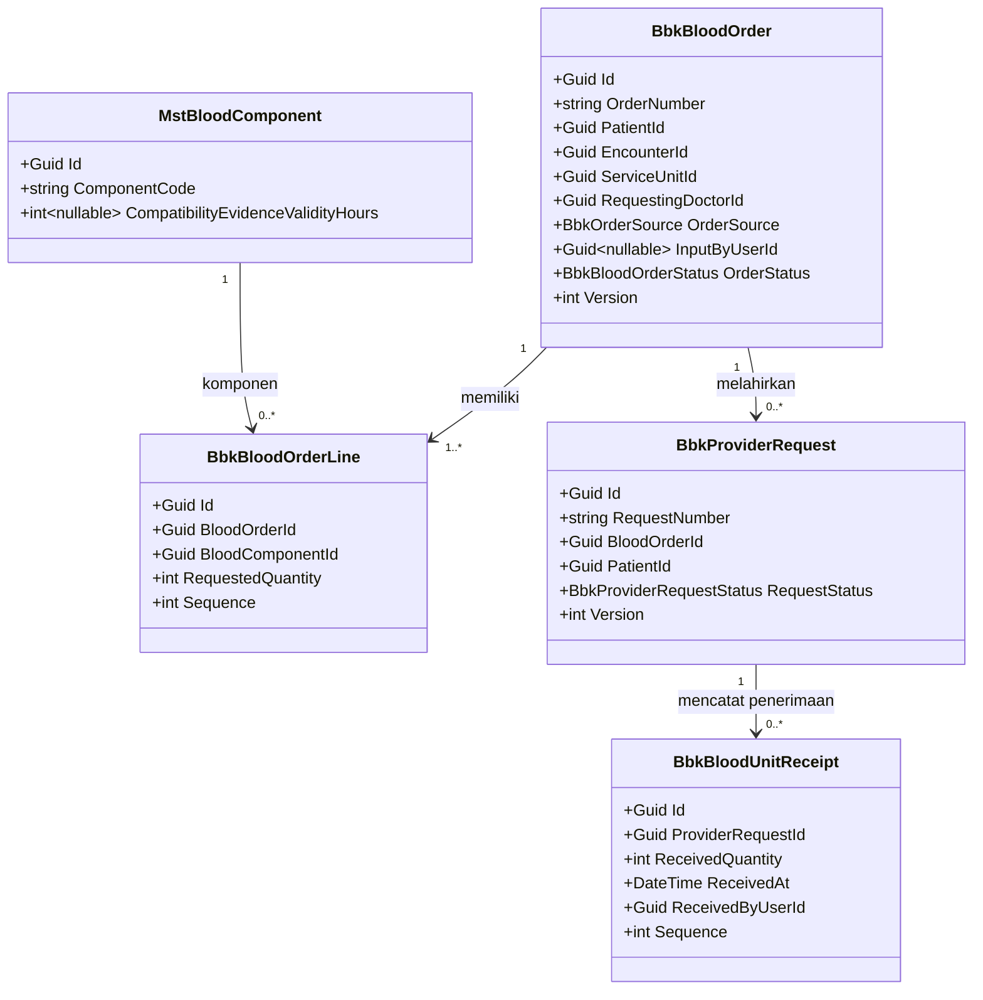
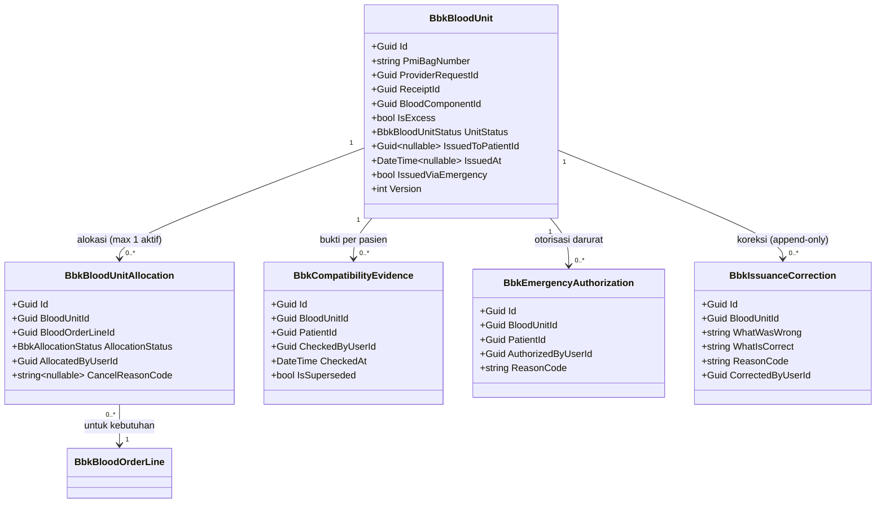
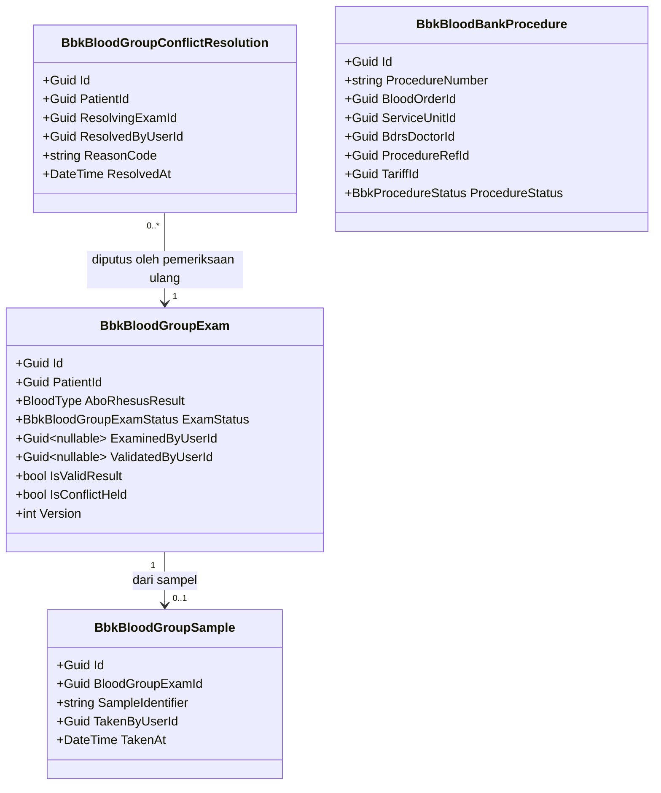
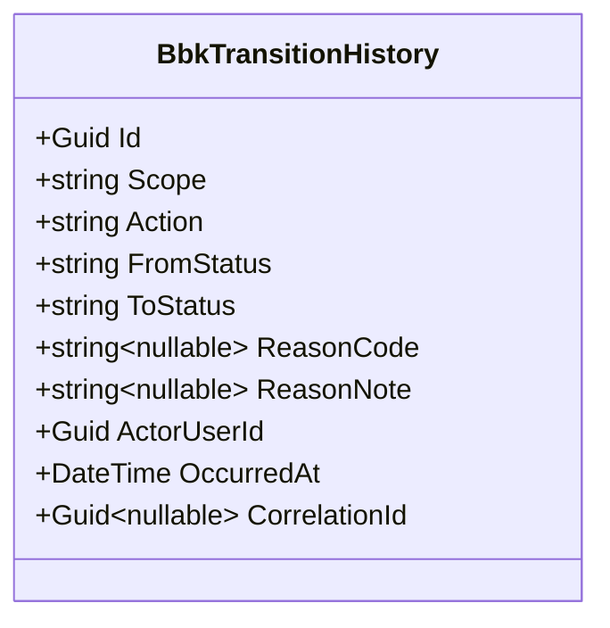

# Bank Darah — Backend Architecture

## A. Identitas dokumen

| Field | Value |
| --- | --- |
| Blueprint ID | `BD-BP-001` |
| Blueprint revision | `7` |
| Contract version | `v1` — status `draft` |
| `last_changed_in` | `v1` |
| Modul | Bank Darah (`bank-darah`) · Area `HealthServices` · Module `BloodBankManagement` (baru) |
| Tanggal | `2026-09-02` |
| Backend SHA | `db08c14dbfb9d6b704e8d0bdfb4fd05e2b52a8cb` cabang `sukmagp` |
| Frontend SHA | `afbb8ab47a6a309f24cdaf6d72024f0dc1b2c254` cabang `sukmagpV2` |
| Sumber requirement | `00-interview-decisions.md` revisi 4 · `02-existing-capability-map.md` revisi 2 · `02-requirement-completeness-assessment.md` revisi 2 |
| Sumber arsitektur domain | `03-domain-architecture.md` revisi 3 — `DOMAIN_ARCHITECTURE_READY` |
| Owner | Product/domain: pemilik proses BDRS · API: pemilik arsitektur backend · Security: pemilik keamanan platform · Frontend authority: pemilik proses BDRS |
| `approved_by` / `approved_at` | Kosong — desain ini `draft`, approval tetap tindakan manusia |

### Jejak requirement-ke-domain yang dipatuhi

Dokumen ini **tidak** merancang ulang batas domain. Bounded context, batas aggregate, ownership,
lifecycle, dampak billing, dan batas keselamatan klinis seluruhnya diambil dari
`03-domain-architecture.md` revisi 3. Yang dilakukan di sini hanyalah menurunkannya menjadi entity,
service, controller, folder, dan rencana migration sesuai pola repository.

Scope yang dirancang (seluruhnya `DOMAIN_ARCHITECTURE_READY`): `BD-AGG-01` sampai `BD-AGG-05`,
`BD-DOM-13`, `BD-DOM-14`, `BD-DOM-16`, `BD-DOM-17`, `BD-DOM-18`, `BD-DOM-21`, `BD-DOM-22`, `BD-DOM-23`.

Yang **tidak** dirancang, sesuai perintah dan sesuai batas scope arsitektur: implementasi charge
Billing (`DEC-BD-016` menggantung), mekanik cetak label golongan darah (`OQ-BD-011`), integrasi API
PMI, integrasi HCLAB, mesin crossmatch, dan manajemen donor.

---

## B. ⚠️ Prasyarat prefix registry — `BD-DEP-008`

Aturan struktur backend melarang memilih prefix entity sendiri (`QBE-NAM-004`); satu-satunya sumbernya
adalah `rules/backend/engineering/MODULE_OWNERSHIP_PREFIX_REGISTRY.md`. Bank Darah **belum terdaftar**
di sana (`BD-DEP-008`).

Karena itu seluruh nama entity operasional pada dokumen ini memakai **prefix placeholder `Bbk`**
(*Blood Bank*) yang **belum disahkan**. Baris registry yang diajukan:

| Area | Module/pemilik | Category | Prefix (diusulkan) | Kepanjangan | Lifecycle |
| --- | --- | --- | --- | --- | --- |
| `HealthServices` | `BloodBankManagement` | Operational | `Bbk` | *Blood Bank* | Operational transaction |

**Konsekuensi yang mengikat implementasi:**

- Pembuatan entity operasional berstatus `BLOCKED` (`QBE-MOD-002`, `QBE-MOD-003`) sampai baris di atas
  disetujui pemilik registry engineering.
- Bila pemilik registry menetapkan prefix lain, seluruh nama `Bbk*` pada blueprint ini ikut berganti
  sebagai satu paket (class, file, Configuration, DbSet, tabel) sebelum model pertama dibuat.
- Blueprint ini **MUST NOT** memakai `Trx*` sebagai jalan pintas (`QBE-NAM-001`).

Prefix master tetap `Mst` (masih berlaku, tidak deprecated) dan tidak terikat pada pengajuan ini.

---

## C. Bounded context dan ownership

Konteks pemilik modul ini adalah `BD-CTX-01` **Bank Darah**. Batas, aggregate root, invariant, dan
batas transaksinya diambil apa adanya dari `03-domain-architecture.md` §E.

| Aggregate | Root (entity) | Invariant utama yang dilindungi | Batas transaksi | Rollback |
| --- | --- | --- | --- | --- |
| `BD-AGG-01` Order Darah | `BbkBloodOrder` | Order menunjuk pasien & kunjungan sah; tiap baris punya komponen dari katalog & jumlah > 0; angka pemenuhan dihitung dari transaksi | Order + seluruh barisnya dalam satu transaksi | Order gagal dibuat → tidak ada baris tersimpan |
| `BD-AGG-02` Permintaan PMI | `BbkProviderRequest` | Selalu atas nama satu pasien; sisa = diminta − diterima, batas bawah 0, **tidak pernah negatif** (`INV-BD-017`); tak boleh digandakan untuk kebutuhan sama; penerimaan fisik tak pernah ditolak karena kelebihan | Permintaan + catatan penerimaan | Penerimaan gagal → stok tidak bertambah |
| `BD-AGG-03` Kantong Operasional | `BbkBloodUnit` | **Satu kantong ≤ satu alokasi aktif**; kantong tak pernah jadi stok bebas; tak dapat diberikan tanpa bukti kecocokan berlaku untuk pasien tujuan & belum lewat masa berlaku, atau tanpa otorisasi darurat; **pemberian tak pernah dihapus/dibalik** (`INV-BD-021`) | Kantong + alokasi + bukti + otorisasi darurat + koreksi | Alokasi bentrok → transaksi kedua ditolak lewat token konkurensi |
| `BD-AGG-04` Pemeriksaan Golongan Darah | `BbkBloodGroupExam` | Hasil belum tervalidasi tak dipakai klinis; hasil tervalidasi tak pernah ditimpa; konflik hanya ditutup lewat pemeriksaan ulang tervalidasi, tak pernah hitung mayoritas (`INV-BD-022`) | Pemeriksaan + sampelnya | Validasi gagal → status tetap `ResultRecorded` |
| `BD-AGG-05` Tindakan Bank Darah | `BbkBloodBankProcedure` | Menunjuk satu order sah; tarif tak pernah dihitung sendiri; satu tindakan ≤ satu fakta biaya; **koreksi tak membalik biaya otomatis** (`INV-BD-024`) | Tindakan + konteksnya | — |

Empat invariant **lintas aggregate** (`BD-XINV-01`..`04`) tidak dijaga satu batas transaksi;
mekanismenya ada di `contracts/concurrency` (bagian K) dan `contracts/validation-matrix.md`.

---

## D. Tabel kepemilikan data

Pertahanan langsung terhadap duplikasi entity. Kolom "Dibuat ulang" bernilai **Tidak** untuk seluruh
master bersama; Bank Darah menyimpan rujukan (`Id`), bukan salinan.

| Kelompok data | Modul pemilik | Dipakai modul ini | Dibuat ulang di modul ini |
| --- | --- | :---: | --- |
| Pasien | PatientManagement | Ya | Tidak — rujuk `PatientId` (`BD-CAP-001`) |
| Kunjungan & status penutupannya | RegistrationManagement + InPatientManagement | Ya | Tidak — rujuk `EncounterId`; status dibaca lewat adapter (`BD-CAP-002`, `BD-CAP-003`) |
| Dokter | HR — Master Data Workforce | Ya | Tidak — rujuk `DoctorId` (`BD-CAP-004`) |
| Unit pelayanan, klinik, ruangan, kelas pasien | HealthServices — Master Data | Ya | Tidak — rujuk `Id` (`BD-CAP-006`) |
| Kewenangan unit memesan darah | HealthServices — Master Data | Ya | **Extend** — tambah satu kolom penanda pada `MstServiceUnit` (`BD-CAP-005`, `BD-DOM-18`) |
| Tindakan & tarif | HealthServices — Master Data / Billing | Ya | Tidak — rujuk `ProcedureId`/`TariffId` + snapshot kode-nama-tarif (`BD-CAP-008`) |
| Nilai golongan darah (ABO+Rhesus) | Platform backend | Ya | Tidak — pakai enum `BloodType` yang sudah ada (`BD-CAP-016`) |
| Fakta biaya (charge) ke Billing | BillingManagement | Ya (produsen fakta) | **Tidak dirancang** — `DEC-BD-016` menggantung (`BD-CAP-015`) |
| Order darah, permintaan PMI, kantong, alokasi, bukti kecocokan, pemeriksaan golongan darah, sampel, tindakan, riwayat | **Bank Darah** | Ya | **Ya, baru** — belum ada di sistem (`BD-CAP-019`, `BD-CAP-017`) |
| Katalog komponen darah | **Bank Darah** | Ya | **Ya, baru** master (`BD-CAP-018`, `BD-DOM-13`) |
| Daftar alasan terkendali | **Bank Darah** | Ya | **Ya, baru** master (`BD-DOM-14`) |
| Golongan darah administratif `MstPatient.BloodType` | PatientManagement | **Hanya sebagai pembeda** | Tidak — dilarang jadi sumber klinis (`INV-BD-014`) |

---

## E. Class diagram per bounded context

Diagram dipecah per aggregate agar tiap diagram muat satu layar. Hanya field kunci, status, dan field
aturan bisnis yang ditampilkan; field lengkap ada di `data/data-dictionary.md`. Entity master bersama
(`MstPatient`, dll.) ditampilkan sebagai kotak rujukan, **bukan** milik modul ini.

### E.1 Order Darah (`BD-AGG-01`) dan Permintaan PMI (`BD-AGG-02`)



### E.2 Kantong Darah Operasional (`BD-AGG-03`)



### E.3 Pemeriksaan Golongan Darah (`BD-AGG-04`) dan Tindakan (`BD-AGG-05`)



### E.4 Riwayat pergerakan (`BD-DOM-15`)



`BbkTransitionHistory` merekam perpindahan status Order, Permintaan, dan Kantong. Hanya bisa ditambah;
tidak ada jalur update maupun delete di service (pola `BD-CAP-009`).

---

## F. Penjelasan setiap class

Status memakai `Baru` / `Diperbarui` / `Sudah ada`. Lokasi file mengikuti `backend-structure-rules.md`.
Seluruh entity `Bbk*` berlokasi di `Areas/HealthServices/BloodBankManagement/Models/`, dan Configuration
terpisah di `Repositories/Configurations/HealthServices/BloodBankManagement/`.

### F.1 Model — aggregate root

**`BbkBloodOrder`** — `BD-DOM-01`

| Aspek | Penjelasan |
| --- | --- |
| Status | `Baru` (BLOCKED sampai `BD-DEP-008`) |
| Lokasi file | `Areas/HealthServices/BloodBankManagement/Models/BbkBloodOrder.cs` |
| Kategori | Transaksi |
| Tanggung jawab | Menyimpan satu permintaan kebutuhan darah untuk seorang pasien, dari unit pelayanan (elektronik) atau diinput Bank Darah (manual). Angka pemenuhan tidak disimpan sebagai kolom; dihitung dari pemberian nyata |
| Field penting | `OrderNumber` (dari number-series), `PatientId`, `EncounterId`, `ServiceUnitId`, `RequestingDoctorId`, `OrderSource`, `InputByUserId` (wajib bila manual), `OrderStatus`, `Version` |
| Relasi | Memiliki banyak `BbkBloodOrderLine`; dirujuk `BbkProviderRequest` dan `BbkBloodBankProcedure` |
| Pemakaian alur | Dibuat di awal proses; ditutup saat terpenuhi penuh, dibatalkan, atau kunjungan berakhir |
| Catatan desain | Jangan menyimpan `FulfilledQuantity` sebagai kolom yang disunting; dihitung `BD-DOM-17`. Deteksi ganda `BD-XINV-01` bukan urusan satu order |
| Ekuivalen lama | — |

**`BbkProviderRequest`** — `BD-DOM-03`

| Aspek | Penjelasan |
| --- | --- |
| Status | `Baru` |
| Lokasi file | `.../BloodBankManagement/Models/BbkProviderRequest.cs` |
| Kategori | Transaksi |
| Tanggung jawab | Catatan administratif permintaan pasokan ke PMI atas nama satu pasien. Pengirimannya manual di luar sistem (`DEC-BD-002`) |
| Field penting | `RequestNumber`, `BloodOrderId`, `PatientId`, `RequestStatus`, `Version`. Jumlah diminta diturunkan dari baris order; sisa = diminta − Σ penerimaan, batas bawah 0 |
| Relasi | Milik satu `BbkBloodOrder`; mencatat banyak `BbkBloodUnitReceipt` |
| Pemakaian alur | Dibuat petugas Bank Darah setelah order; ditutup `Fulfilled`, `Cancelled`, atau `ClosedEncounter` |
| Catatan desain | Penerimaan fisik **tak pernah ditolak** karena kelebihan (`DEC-BD-025`); sisa berhenti di 0, kantong berlebih ditandai `IsExcess` dan masuk `PendingReview` |
| Ekuivalen lama | — (pola dari `LabOrder`, `BD-CAP-007`) |

**`BbkBloodUnit`** — `BD-DOM-05`

| Aspek | Penjelasan |
| --- | --- |
| Status | `Baru` |
| Lokasi file | `.../BloodBankManagement/Models/BbkBloodUnit.cs` |
| Kategori | Transaksi |
| Tanggung jawab | Satu kantong fisik yang sudah diterima MMC. Membawa identitas PMI dan seluruh lifecycle pemakaiannya |
| Field penting | `PmiBagNumber` (identifier bisnis unik, dari PMI — `ASM-BD-003`), `ProviderRequestId` (asal, **tak pernah putus**), `ReceiptId`, `BloodComponentId`, `IsExcess`, `UnitStatus`, `IssuedToPatientId`, `IssuedAt`, `IssuedViaEmergency`, `Version` |
| Relasi | Milik `BbkProviderRequest` (asal); punya banyak alokasi, bukti, otorisasi darurat, koreksi |
| Pemakaian alur | Lahir saat penerimaan fisik; berpindah lewat alokasi → pemberian, atau menunggu keputusan → dialihkan/dikembalikan/tidak layak |
| Catatan desain | Nomor kantong **tidak** diterbitkan server. Pemberian (`IssuedAt`) bersifat terminal & tak dapat dibalik; koreksi hanya lewat `BbkIssuanceCorrection`. `Version` menjaga alokasi tunggal aktif |
| Ekuivalen lama | — |

**`BbkBloodGroupExam`** — `BD-DOM-09`

| Aspek | Penjelasan |
| --- | --- |
| Status | `Baru` |
| Lokasi file | `.../BloodBankManagement/Models/BbkBloodGroupExam.cs` |
| Kategori | Transaksi |
| Tanggung jawab | Satu pemeriksaan golongan darah milik Bank Darah, dengan status validasinya sendiri. Sumber sah golongan darah pasien (`DEC-BD-015`) |
| Field penting | `PatientId`, `AboRhesusResult` (enum `BloodType`), `ExamStatus`, `ExaminedByUserId`, `ValidatedByUserId`, `IsValidResult`, `IsConflictHeld`, `Version` |
| Relasi | Dari 0..1 `BbkBloodGroupSample`; dirujuk `BbkBloodGroupConflictResolution` sebagai pemeriksaan ulang yang memutus |
| Pemakaian alur | Sampel → hasil dicatat → validasi. Bila hasil tervalidasi baru berbeda dari sah sebelumnya → keadaan konflik (`IsConflictHeld`), diselesaikan lewat pemeriksaan ulang (`DEC-BD-031`) |
| Catatan desain | Hasil tervalidasi **tak pernah ditimpa**. "Golongan darah sah pasien" adalah turunan (`BD-DOM-21`), bukan kolom di `MstPatient` |
| Ekuivalen lama | — |

**`BbkBloodBankProcedure`** — `BD-DOM-12`

| Aspek | Penjelasan |
| --- | --- |
| Status | `Baru` |
| Lokasi file | `.../BloodBankManagement/Models/BbkBloodBankProcedure.cs` |
| Kategori | Transaksi |
| Tanggung jawab | Mencatat tindakan Bank Darah beserta konteksnya sebagai dasar biaya. **Penyaluran fakta biaya ke Billing tidak dirancang** (`DEC-BD-016`) |
| Field penting | `ProcedureNumber`, `BloodOrderId`, `ServiceUnitId`, `BdrsDoctorId`, `ProcedureRefId`, `TariffId` + snapshot kode/nama/tarif, `ProcedureStatus` |
| Relasi | Milik satu `BbkBloodOrder`; merujuk tindakan & tarif milik Master Data/Billing |
| Pemakaian alur | Dicatat lalu dinyatakan selesai; satu tindakan ≤ satu fakta biaya |
| Catatan desain | Tarif **tidak** dihitung sendiri; disalin sebagai snapshot (pola `BD-CAP-008`). Koreksi pemberian tak membalik biaya (`INV-BD-024`) |
| Ekuivalen lama | — |

### F.2 Model — entity di dalam aggregate

| Class | Status | Lokasi | Tanggung jawab & catatan |
| --- | --- | --- | --- |
| `BbkBloodOrderLine` (`BD-DOM-02`) | `Baru` | `.../Models/BbkBloodOrderLine.cs` | Baris komponen+jumlah di bawah order. `RequestedQuantity` > 0; `BloodComponentId` wajib dari katalog |
| `BbkBloodUnitReceipt` (`BD-DOM-04`) | `Baru` | `.../Models/BbkBloodUnitReceipt.cs` | Mencatat kedatangan fisik. Stok bertambah **hanya** lewat konsep ini; tak pernah ditolak karena kelebihan; melahirkan `BbkBloodUnit` |
| `BbkBloodUnitAllocation` (`BD-DOM-06`) | `Baru` | `.../Models/BbkBloodUnitAllocation.cs` | Mengikat kantong ke satu baris kebutuhan. **Maks. satu `Active` per kantong**; pembatalan tak menghapus, hanya `Cancelled` + alasan/pelaku/waktu (`DEC-BD-029`) |
| `BbkCompatibilityEvidence` (`BD-DOM-07`) | `Baru` | `.../Models/BbkCompatibilityEvidence.cs` | Bukti kecocokan **terikat pasangan kantong+pasien**. Masa berlaku dihitung dari `CheckedAt` + `CompatibilityEvidenceValidityHours` komponen (`DEC-BD-027`). Pengalihan → `IsSuperseded` (`DEC-BD-028`) |
| `BbkEmergencyAuthorization` (`BD-DOM-08`) | `Baru` | `.../Models/BbkEmergencyAuthorization.cs` | Menggantikan gerbang bukti pada keadaan darurat. Hanya peran berwenang; alasan wajib; penanda permanen (`DEC-BD-017`) |
| `BbkIssuanceCorrection` (`BD-DOM-23`) | `Baru` | `.../Models/BbkIssuanceCorrection.cs` | Menyatakan **pencatatan** pemberian keliru. Append-only; tak pernah menghapus/membalik/memindah ke pasien lain (`DEC-BD-030`, `INV-BD-021`) |
| `BbkBloodGroupSample` (`BD-DOM-10`) | `Baru` | `.../Models/BbkBloodGroupSample.cs` | Sampel Bank Darah, bukan sampel Laboratorium; tak menimbulkan tagihan Lab (`DEC-BD-018`) |
| `BbkBloodGroupConflictResolution` (`BD-DOM-22`) | `Baru` | `.../Models/BbkBloodGroupConflictResolution.cs` | Menutup keadaan konflik. Append-only; **wajib** menunjuk `ResolvingExamId` (pemeriksaan ulang tervalidasi) + validator/alasan/waktu (`DEC-BD-031`) |
| `BbkTransitionHistory` (`BD-DOM-15`) | `Baru` | `.../Models/BbkTransitionHistory.cs` | Riwayat pergerakan append-only; menyalin `ReasonNote` sebagai teks saat kejadian |

### F.3 Master / reference

| Class | Status | Lokasi | Catatan |
| --- | --- | --- | --- |
| `MstBloodComponent` (`BD-DOM-13`) | `Baru` | `Areas/HealthServices/MasterData/Models/MstBloodComponent.cs` | Katalog komponen (PRC, TC, FFP, dst). Kolom `CompatibilityEvidenceValidityHours` (nullable, konfigurasi per komponen — `DEC-BD-032`). **Master, bukan menu Setup baru** |
| `MstBloodBankReason` (`BD-DOM-14`) | `Baru` | `Areas/HealthServices/MasterData/Models/MstBloodBankReason.cs` | Daftar alasan terkendali dengan `ReasonCategory`. Alasan tak boleh teks bebas (`INV-BD-016`); perubahan berjejak |
| `MstServiceUnit` (`BD-DOM-18`) | `Diperbarui` | `Areas/HealthServices/MasterData/Models/MstServiceUnit.cs` | **Milik Master Data**, bukan Bank Darah. Ditambah **satu kolom** `IsAvailableForBloodOrder` (bool, default `false`) bergaya `IsAvailableFor*` yang sudah ada (`BD-CAP-005`) |

### F.4 Service (tanpa interface, `AddScoped`, di-inject ke controller)

| Service | Status | Lokasi | Fungsi utama | Buka transaksi DB |
| --- | --- | --- | --- | --- |
| `BbkBloodOrderService` | `Baru` | `.../BloodBankManagement/Services/BbkBloodOrderService.cs` | CRUD order, deteksi ganda `BD-XINV-01`, hitung pemenuhan `BD-DOM-17`, alokasi number-series order | Ya |
| `BbkProviderRequestService` | `Baru` | `.../Services/BbkProviderRequestService.cs` | Buat permintaan (`BD-XINV-02`), catat penerimaan (termasuk kelebihan `BD-XINV-03`), tutup administratif | Ya |
| `BbkBloodUnitService` | `Baru` | `.../Services/BbkBloodUnitService.cs` | Alokasi & pembatalan, catat bukti kecocokan, pemberian (+darurat), koreksi, penyelesaian `PendingReview` | Ya |
| `BbkBloodGroupExamService` | `Baru` | `.../Services/BbkBloodGroupExamService.cs` | Sampel, catat hasil, validasi, deteksi konflik `BD-XINV-04`, penyelesaian konflik | Ya |
| `BbkBloodBankProcedureService` | `Baru` | `.../Services/BbkBloodBankProcedureService.cs` | Catat & selesaikan tindakan. **Tidak** memanggil producer Billing (tertahan `DEC-BD-016`) | Ya |
| `BbkEncounterStatusReader` (`BD-DOM-16`) | `Baru` | `.../Services/BbkEncounterStatusReader.cs` | Adapter baca status kunjungan/episode; **tak pernah menulis** ke modul hulu (`DEC-BD-014`) | Tidak |
| `MstBloodComponentService` | `Baru` | `Areas/HealthServices/MasterData/Services/MstBloodComponentService.cs` | CRUD katalog komponen | Ya |
| `MstBloodBankReasonService` | `Baru` | `Areas/HealthServices/MasterData/Services/MstBloodBankReasonService.cs` | CRUD daftar alasan | Ya |

Alokasi nomor bisnis (`OrderNumber`, `RequestNumber`, `ProcedureNumber`) memakai provider
number-series atomik yang sudah ada; **MUST NOT** memakai Count+1 / Max+1 (`QBE-CODE-002/003`).

### F.5 Controller (satu grup Swagger per resource)

| Controller | Status | Lokasi | Service dipakai | Atribut akses |
| --- | --- | --- | --- | --- |
| `BbkBloodOrderController` | `Baru` | `.../BloodBankManagement/Controllers/BbkBloodOrderController.cs` | `BbkBloodOrderService` | `[AccessController]`, `[AccessPermission("BloodOrder", ...)]` |
| `BbkProviderRequestController` | `Baru` | `.../Controllers/BbkProviderRequestController.cs` | `BbkProviderRequestService` | `[AccessPermission("BloodProviderRequest", ...)]` |
| `BbkBloodUnitController` | `Baru` | `.../Controllers/BbkBloodUnitController.cs` | `BbkBloodUnitService` | `[AccessPermission("BloodUnit", ...)]` |
| `BbkBloodGroupExamController` | `Baru` | `.../Controllers/BbkBloodGroupExamController.cs` | `BbkBloodGroupExamService` | `[AccessPermission("BloodGroupExam", ...)]` |
| `BbkBloodBankProcedureController` | `Baru` | `.../Controllers/BbkBloodBankProcedureController.cs` | `BbkBloodBankProcedureService` | `[AccessPermission("BloodBankProcedure", ...)]` |
| `MstBloodComponentController` | `Baru` | `Areas/HealthServices/MasterData/Controllers/MstBloodComponentController.cs` | `MstBloodComponentService` | `[AccessPermission("BloodComponent", ...)]` |
| `MstBloodBankReasonController` | `Baru` | `Areas/HealthServices/MasterData/Controllers/MstBloodBankReasonController.cs` | `MstBloodBankReasonService` | `[AccessPermission("BloodBankReason", ...)]` |

Seluruh controller: Controller → Module Service → `ApplicationDbContext` (`QBE-SVC-001`); controller
**MUST NOT** menyentuh context langsung. Pemetaan endpoint→hak akses lengkap ada di
`contracts/api-contract.md`.

### F.6 Enum

| Enum | Nilai | Lokasi |
| --- | --- | --- |
| `BbkBloodOrderStatus` | `Active`, `PartiallyFulfilled`, `FullyFulfilled`, `Cancelled`, `Expired` | `.../BloodBankManagement/Enums/BbkBloodOrderStatus.cs` |
| `BbkProviderRequestStatus` | `Requested`, `PartiallyFulfilled`, `Fulfilled`, `Cancelled`, `ClosedEncounter` | `.../Enums/BbkProviderRequestStatus.cs` |
| `BbkBloodUnitStatus` | `Available`, `Allocated`, `Issued`, `PendingReview`, `Reallocated`, `ReturnedToProvider`, `NotUsable` | `.../Enums/BbkBloodUnitStatus.cs` |
| `BbkAllocationStatus` | `Active`, `Cancelled` | `.../Enums/BbkAllocationStatus.cs` |
| `BbkBloodGroupExamStatus` | `SampleTaken`, `ResultRecorded`, `Validated` | `.../Enums/BbkBloodGroupExamStatus.cs` |
| `BbkOrderSource` | `Electronic`, `Manual` | `.../Enums/BbkOrderSource.cs` |
| `BbkProcedureStatus` | `Recorded`, `Completed` | `.../Enums/BbkProcedureStatus.cs` |
| `BloodType` (dipakai ulang) | `Sudah ada` — `Enums/BloodType.cs` (`BD-CAP-016`) | tidak dibuat ulang |

Keadaan "konflik golongan darah" **bukan** enum tersendiri; ia flag `IsConflictHeld` pada
`BbkBloodGroupExam` (menghindari entity-per-status). Lewatnya masa berlaku bukti **bukan** status
tersimpan; dihitung saat gerbang diperiksa (`ARCH-BD-POS-01`).

---

## G. Arsitektur folder

```text
Areas/HealthServices/
├── BloodBankManagement/                    # BARU — module operasional Bank Darah
│   ├── Models/                             # BbkBloodOrder, BbkBloodOrderLine, BbkProviderRequest,
│   │                                       #   BbkBloodUnitReceipt, BbkBloodUnit, BbkBloodUnitAllocation,
│   │                                       #   BbkCompatibilityEvidence, BbkEmergencyAuthorization,
│   │                                       #   BbkIssuanceCorrection, BbkBloodGroupExam,
│   │                                       #   BbkBloodGroupSample, BbkBloodGroupConflictResolution,
│   │                                       #   BbkBloodBankProcedure, BbkTransitionHistory  (semua Baru)
│   ├── Enums/                              # tujuh enum Bbk* (Baru)
│   ├── DTOs/                               # DTO Create/Update/Status/Response/PagedQuery per resource (Baru)
│   ├── Services/                           # lima service transaksi + BbkEncounterStatusReader (Baru)
│   └── Controllers/                        # lima controller operasional (Baru)
└── MasterData/
    ├── Models/                            # MstBloodComponent, MstBloodBankReason (Baru);
    │                                       #   MstServiceUnit (Diperbarui: +IsAvailableForBloodOrder)
    ├── Services/                          # MstBloodComponentService, MstBloodBankReasonService (Baru)
    └── Controllers/                       # MstBloodComponentController, MstBloodBankReasonController (Baru)

Repositories/Configurations/HealthServices/
├── BloodBankManagement/                    # BARU — seluruh <Entity>Configuration.cs (Baru)
└── MasterData/                            # MstBloodComponentConfiguration, MstBloodBankReasonConfiguration (Baru);
                                            #   MstServiceUnitConfiguration (Diperbarui)

Migrations/                                 # migration modul Bank Darah (Baru) — lihat bagian I
```

**Catatan struktur:** Configuration **tidak** berada di dalam `Areas/`; ia di
`Repositories/Configurations/<Domain>/<SubDomain>/`. Master (`Mst*`) tinggal di `MasterData/Models/`,
bukan di folder `BloodBankManagement/`. Tidak ada penyimpangan `Trx*` atau `Controller/` tunggal yang
ditiru.

---

## H. Status model dan dampak migration

| Tabel | Status | Kolom yang berubah | Dampak migration |
| --- | --- | --- | --- |
| 14 tabel `Bbk*` + 2 master `Mst*` | `Baru` | seluruh kolom (lihat `data/data-dictionary.md`) | `CREATE TABLE` + index + FK |
| `MstServiceUnit` | `Diperbarui` | **+1 kolom** `IsAvailableForBloodOrder` `bool NOT NULL DEFAULT false` | `ADD COLUMN` dengan default; aman tanpa downtime |

Tabel `Sudah ada` yang hanya dirujuk (`MstPatient`, `TrxPatientEncounter`, `InpEpisode`, `MstDoctor`,
`MstClinic`, `MstRoom`, `MstPatientClass`, `MstProcedure`, tarif) **tidak** diubah.

---

## I. Rencana migration

Urutan (satu migration modul, dapat dipecah bila perlu):

1. **`AddBloodBankMasterData`** — `MstBloodComponent`, `MstBloodBankReason`. Bisa jalan tanpa downtime.
2. **`AddServiceUnitBloodOrderFlag`** — `ADD COLUMN IsAvailableForBloodOrder DEFAULT false` pada
   `MstServiceUnit`. Data lama otomatis `false` — sesuai `DEC-BD-012` "bawaan menolak". Tanpa downtime.
3. **`AddBloodBankOperational`** — 14 tabel `Bbk*` beserta FK `Restrict` dan index. Tanpa downtime
   (tabel baru, tidak menyentuh trafik existing).

**Pengisian data lama:** tidak ada data Bank Darah lama untuk dipindahkan (`BD-CAP-019` `Missing`).
Master wajib diisi lebih dulu (bagian J) sebelum modul dipakai.

**Langkah mundur:** karena seluruhnya objek baru dan satu kolom bawaan, rollback = `DROP` tabel baru
dan `DROP COLUMN` flag. Tidak ada data existing yang hilang.

**Prasyarat mutlak:** migration operasional **BLOCKED** sampai prefix `Bbk` disahkan (`BD-DEP-008`).
Migration master (langkah 1) dan kolom flag (langkah 2) memakai prefix `Mst` dan pemilik Master Data,
tidak terikat pengajuan prefix operasional — tetapi urutan pemakaian modul menuntut ketiganya lengkap.

---

## J. Rencana data master awal

Modul dengan master kosong tidak dapat dipakai. Isi minimum:

| Master | Isi minimum | Sumber nilai |
| --- | --- | --- |
| `MstBloodComponent` | Minimal PRC, TC, FFP (kode + nama); `CompatibilityEvidenceValidityHours` boleh kosong dulu | Katalog komponen darah MMC (`DEC-BD-024`). Angka jam menyusul dari kebijakan klinis (`OQ-BD-012`) |
| `MstBloodBankReason` | Alasan terkendali per kategori: pembatalan order, jalur darurat, penyelesaian `PendingReview`, pengembalian, tidak layak, **kiriman melebihi permintaan** (`DEC-BD-025`), **pembatalan alokasi** (`DEC-BD-029`), **koreksi pemberian** (`DEC-BD-030`) | Daftar alasan yang disepakati BDRS (`DEC-BD-024`, `INV-BD-016`) |
| `MstServiceUnit` (flag) | Set `IsAvailableForBloodOrder = true` hanya untuk Rawat Inap, IGD, Rawat Jalan (`DEC-BD-012`) | Konfigurasi unit pemesan MVP; sisanya tetap `false` |

Nilai seperti masa berlaku bukti **MUST** dari master, **MUST NOT** di-hardcode di controller/frontend
(`INV-BD-023`).

---

## K. Concurrency dan idempotency (ringkas — detail di `contracts/`)

| Kepedulian | Pola | Sumber |
| --- | --- | --- |
| Satu kantong ≤ satu alokasi aktif (`BD-XINV`-lokal) | Token konkurensi `Version` pada `BbkBloodUnit`; alokasi aktif divalidasi atas himpunan `Active` (`ARCH-BD-POS-03`) | `BD-CAP-010` |
| Sisa permintaan tak pernah negatif (`BD-XINV-03`) | Penerimaan mengunci `BbkProviderRequest.Version`; kelebihan → `IsExcess` + `PendingReview` | `DEC-BD-025` |
| Deteksi order ganda (`BD-XINV-01`) & permintaan ganda (`BD-XINV-02`) | Pemeriksaan lintas-baris di service + unique guard, bukan di dalam satu aggregate | `DEC-BD-005`, `DEC-BD-008` |
| Satu golongan darah sah per pasien (`BD-XINV-04`) | Validasi lintas seluruh pemeriksaan pasien saat validasi hasil; konflik → `IsConflictHeld` | `DEC-BD-026` |
| Pengiriman fakta biaya idempotent | **Tidak dirancang** — `DEC-BD-016` menggantung | `BD-CAP-015` |

---

## L. Yang sengaja tidak dibuat

| Yang ditolak | Alasan |
| --- | --- |
| `BbkPatient` / salinan pasien | Pasien milik PatientManagement; dipakai lewat `PatientId` (`BD-CAP-001`, tabel kepemilikan) |
| `BbkEncounter` / salinan kunjungan | Milik Registration/InPatient; dibaca lewat `BbkEncounterStatusReader` |
| Entity `BbkBloodStock` / stok nasional | Bank Darah bukan pemilik stok; PMI pemegang kebenaran (`DEC-BD-001`) |
| Entity "Kantong Berlebih" | Kantong berlebih tetap `BbkBloodUnit` biasa dengan `IsExcess=true`; membuat entity per status dilarang (`DEC-BD-025`, `03-domain-architecture.md`) |
| Entity "Bukti Kedaluwarsa" | Lewatnya masa berlaku adalah kondisi turunan, dihitung saat gerbang (`ARCH-BD-POS-01`) |
| Entity "Pembatalan Alokasi" | Pembatalan adalah perpindahan status pada `BbkBloodUnitAllocation`, bukan entity (`DEC-BD-029`) |
| Entity "Golongan Darah Sah Pasien" | Turunan (`BD-DOM-21`), dihitung dari pemeriksaan tervalidasi; bukan kolom yang bisa disunting |
| Model keamanan baru | Pola `[AccessController]/[AccessAction]/[AccessPermission]` sudah ada (`BD-CAP-013`) |
| Mekanisme konfigurasi unit baru | Cukup extend `MstServiceUnit` dengan satu flag (`BD-CAP-005`) |
| Perhitungan tarif / charge sendiri | Billing pemilik tarif; hanya kirim fakta — dan itu pun tertahan `DEC-BD-016` (`BD-CAP-015`) |
| Sampel/pesanan Laboratorium | Sampel Bank Darah terpisah, tak menimbulkan tagihan Lab (`DEC-BD-018`) |
| Producer/menu Label golongan darah | `OQ-BD-011` di luar scope |
| Klien PMI / HCLAB / mesin crossmatch / donor | Di luar scope MVP (`DEC-BD-002`, `DEC-BD-022`, BRD §9) |

---

## M. Traceability

| Requirement / Decision | Konsep domain | Realisasi backend |
| --- | --- | --- |
| `DEC-BD-004/005/006` | `BD-AGG-01` | `BbkBloodOrder`, `BbkBloodOrderLine`, `BbkBloodOrderService` (deteksi ganda) |
| `DEC-BD-002/003/008/020/025` | `BD-AGG-02` | `BbkProviderRequest`, `BbkBloodUnitReceipt`, `IsExcess` |
| `DEC-BD-007/013/017/019/027/028/029/030` | `BD-AGG-03` | `BbkBloodUnit` + alokasi/bukti/otorisasi/koreksi |
| `DEC-BD-015/018/026/031` | `BD-AGG-04` | `BbkBloodGroupExam`, `BbkBloodGroupSample`, `BbkBloodGroupConflictResolution` |
| `DEC-BD-021` | `BD-AGG-05` | `BbkBloodBankProcedure` (tanpa charge) |
| `DEC-BD-024/032` | `BD-DOM-13/14` | `MstBloodComponent`, `MstBloodBankReason` |
| `DEC-BD-012` | `BD-DOM-18` | `MstServiceUnit.IsAvailableForBloodOrder` |
| `DEC-BD-014` | `BD-DOM-16` | `BbkEncounterStatusReader` |
| `DEC-BD-009/013` | `BD-DOM-15` | `BbkTransitionHistory` (append-only) |

**Dampak security & privacy:** data pasien sensitif; nomor kantong dari PMI tak dijamin bebas
keterangan pribadi → identifier internal & sampel mengikuti pola `BD-CAP-008` (tanpa data pribadi).
Detail di `contracts/permission-audit-matrix.md`.

**Dampak billing:** berdampak charge tetapi penyalurannya tertahan `DEC-BD-016` — lihat
`contracts/integration-contract.md`.

**Acceptance test pembukti:** `AC-BD-001`..`AC-BD-058` di `testing/acceptance-test-matrix.md`.
