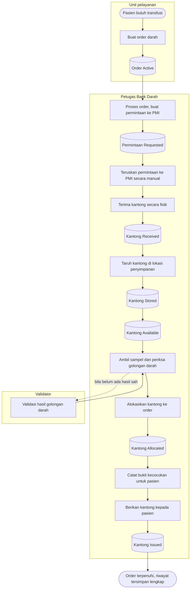

# Alur Utama Bank Darah — Jalur Normal

Alur pokok dari ujung ke ujung, **jalur normal saja**. Percabangan dan jalur gagal ada di file proses
tersendiri. Nama keadaan pada node `[(...)]` sama persis dengan `contracts/state-transition-matrix.md`.

## Tabel langkah

| Langkah | Pelaku | Masukan | Keluaran | Bila gagal |
| --- | --- | --- | --- | --- |
| Buat order darah | Unit pelayanan / petugas Bank Darah | Pasien terdaftar, kunjungan aktif, unit berwenang | Order `Active` | Ditolak; petugas melengkapi isian atau memakai jalur manual — lihat `order-darah.md` |
| Buat permintaan ke PMI | Petugas Bank Darah | Order aktif | Permintaan `Requested` | Ditahan bila sudah ada permintaan berjalan — lihat `permintaan-pmi.md` |
| Terima kantong fisik | Petugas Bank Darah | Kantong datang dari PMI | Kantong `Received` — **belum dapat dialokasikan** | Kelebihan/kekurangan/kunjungan berakhir — lihat `permintaan-pmi.md` |
| Taruh kantong di lokasi penyimpanan | Petugas Bank Darah | Kantong `Received`, lokasi penyimpanan yang aktif | Kantong `Stored`, lalu `Available`; stok bertambah | Lokasi tidak aktif atau belum ada lokasi sama sekali — lihat `penyimpanan-kantong.md` |
| Periksa golongan darah | Petugas + validator | Sampel pasien | Hasil tervalidasi | Hasil bertentangan ditahan — lihat `pemeriksaan-golongan-darah.md` |
| Alokasikan kantong | Petugas Bank Darah | Kantong `Available`, order aktif, lokasi penyimpanannya masih aktif | Kantong `Allocated` | Bentrok/keliru/belum disimpan/lokasi tidak aktif — lihat `alokasi-dan-pemberian.md` dan `penyimpanan-kantong.md` |
| Catat bukti kecocokan | Petugas berwenang | Kantong dialokasikan, pasien tujuan | Bukti tercatat | — |
| Berikan kantong | Petugas Bank Darah | Kantong sudah disimpan, lokasinya masih aktif, bukti berlaku untuk pasien tujuan dan belum lewat masa berlaku | Kantong `Issued` | Gerbang menolak — lihat `alokasi-dan-pemberian.md` dan `penyimpanan-kantong.md` |

Bila kantong tidak jadi dipakai, ia tidak pernah menjadi stok bebas — lihat `penyelesaian-kantong.md`.

Kantong yang baru diterima **belum** dapat dialokasikan sampai lokasi penyimpanannya tercatat, dan
kantong yang lokasinya dinonaktifkan berhenti dapat dialokasikan maupun diberikan sampai dipindahkan —
keduanya beserta jalur gagalnya ada di `penyimpanan-kantong.md`.
