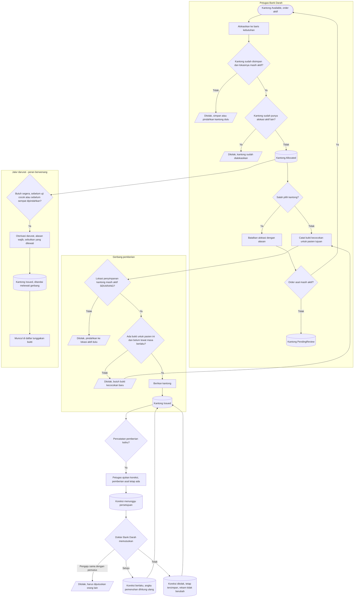

# Proses: Alokasi, Bukti Kecocokan, dan Pemberian — dengan jalur pengecualian

## Tabel langkah

| Langkah | Pelaku | Masukan | Keluaran | Bila gagal |
| --- | --- | --- | --- | --- |
| Alokasikan kantong | Petugas | Kantong `Available`, order aktif, sudah disimpan, lokasinya aktif | Kantong `Allocated` | Ditolak bila kantong sudah punya alokasi aktif, belum disimpan, atau lokasinya nonaktif — lihat `penyimpanan-kantong.md` |
| Batalkan alokasi | Petugas | Kantong belum diberikan, alasan | Kantong kembali `Available` atau `PendingReview` | Ditolak bila kantong sudah `Issued`; pakai catatan koreksi |
| Catat bukti kecocokan | Petugas berwenang | Kantong dialokasikan, pasien tujuan | Bukti tercatat | — |
| Periksa gerbang pemberian | Sistem | Tiga syarat sekaligus: sudah disimpan, lokasi terakhir masih aktif **saat itu**, bukti untuk pasien tujuan belum lewat masa berlaku | Lolos | Tertahan bukti → catat bukti baru. Tertahan lokasi → pindahkan kantong ke lokasi aktif |
| Berikan kantong | Petugas | Gerbang lolos | Kantong `Issued` | — |
| Jalur darurat | Peran berwenang | Alasan wajib + keterangan gerbang yang dilewati (bukti, lokasi nonaktif, atau keduanya) | Kantong `Issued` ditandai melewati gerbang | Ditolak bila bukan peran berwenang, alasan kosong, atau keterangan gerbang tidak diisi |
| Ajukan koreksi | Petugas BDRS | Pemberian yang ada, alasan terkendali, bukti pendukung | Koreksi tersimpan **menunggu persetujuan**; pemenuhan belum berubah | Ditolak bila dipakai memindah pemberian ke pasien lain, atau bukti pendukung kosong |
| Putuskan koreksi | Dokter BDRS | Koreksi yang menunggu | Disetujui → koreksi berlaku dan pemenuhan dihitung ulang. Ditolak → rekam tidak berubah, permintaan tetap terbaca | Ditolak bila pemutus adalah pengaju yang sama, atau koreksi sudah pernah diputuskan |

Pemberian tidak pernah dihapus atau dibalik. Pengalihan kantong hanya sah lewat jalur `Reallocated`
pada kantong yang **belum** diberikan — lihat `penyelesaian-kantong.md`.

Koreksi pencatatan **tidak berlaku saat diajukan**. Angka pemenuhan order baru bergerak setelah Dokter
Bank Darah menyetujui, dan permintaan yang ditolak tetap tersimpan supaya terbaca bahwa seseorang pernah
menyatakan catatan itu keliru.

Gerbang lokasi dinilai **dua kali**: saat alokasi dan sekali lagi saat pemberian. Sebuah kantong karena
itu dapat lolos dialokasikan lalu tertahan saat hendak diberikan, bila lokasinya dinonaktifkan di
antara keduanya. Itu perilaku yang benar, bukan ketidakkonsistenan — seluruh jalurnya ada di
`penyimpanan-kantong.md`.
