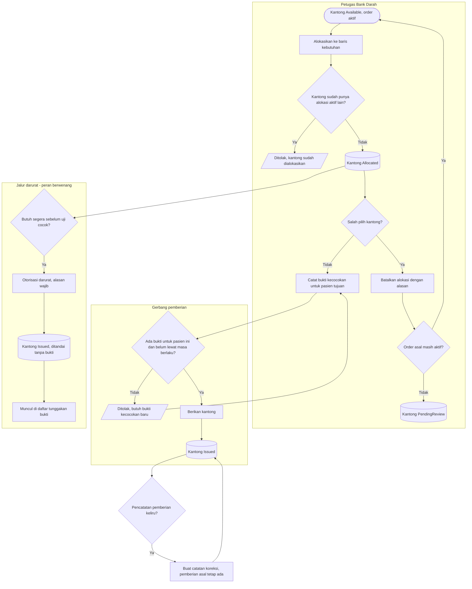

# Proses: Alokasi, Bukti Kecocokan, dan Pemberian — dengan jalur pengecualian

## Tabel langkah

| Langkah | Pelaku | Masukan | Keluaran | Bila gagal |
| --- | --- | --- | --- | --- |
| Alokasikan kantong | Petugas | Kantong `Available`, order aktif | Kantong `Allocated` | Ditolak bila kantong sudah punya alokasi aktif; muat ulang |
| Batalkan alokasi | Petugas | Kantong belum diberikan, alasan | Kantong kembali `Available` atau `PendingReview` | Ditolak bila kantong sudah `Issued`; pakai catatan koreksi |
| Catat bukti kecocokan | Petugas berwenang | Kantong dialokasikan, pasien tujuan | Bukti tercatat | — |
| Periksa gerbang pemberian | Sistem | Bukti untuk pasien tujuan, belum lewat masa berlaku | Lolos | Ditolak; catat bukti baru |
| Berikan kantong | Petugas | Gerbang lolos | Kantong `Issued` | — |
| Jalur darurat | Peran berwenang | Alasan wajib | Kantong `Issued` ditandai tanpa bukti | Ditolak bila bukan peran berwenang atau alasan kosong |
| Catat koreksi | Peran berwenang | Pemberian yang ada, alasan | Koreksi melekat, pemenuhan dihitung ulang | Ditolak bila dipakai memindah pemberian ke pasien lain |

Pemberian tidak pernah dihapus atau dibalik. Pengalihan kantong hanya sah lewat jalur `Reallocated`
pada kantong yang **belum** diberikan — lihat `penyelesaian-kantong.md`.
