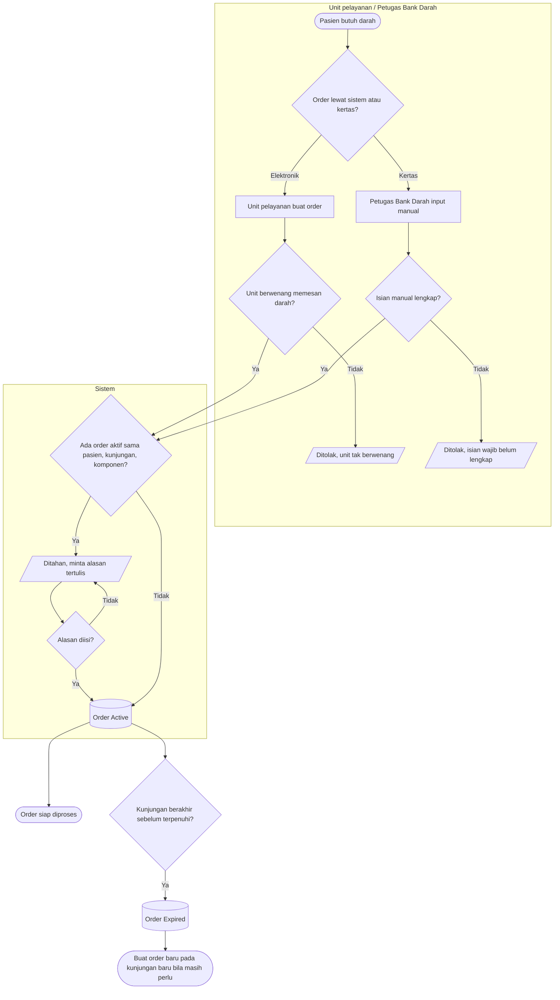

# Proses: Order Darah — dengan jalur pengecualian

## Tabel langkah

| Langkah | Pelaku | Masukan | Keluaran | Bila gagal |
| --- | --- | --- | --- | --- |
| Pilih jalur order | Unit / petugas | Kebutuhan klinis | Jalur elektronik atau manual | — |
| Periksa kewenangan unit | Sistem | Penanda unit boleh memesan darah | Lolos | Ditolak; unit diberi kewenangan lewat konfigurasi lebih dulu |
| Periksa order ganda | Sistem | Pasien + kunjungan + komponen + status aktif | Lolos atau ditahan | Ditahan; petugas mengisi alasan tertulis untuk melanjutkan |
| Simpan order | Sistem | Data lengkap | Order `Active` | — |
| Kedaluwarsa | Sistem | Sinyal kunjungan berakhir | Order `Expired` | Order lama tak dihidupkan; buat order baru |

Order `Expired` tidak dapat dibuka kembali. Pembatalan menyimpan alasan, tidak menghapus apa pun.
