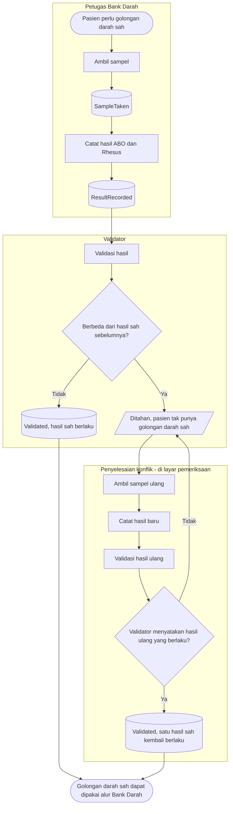

# Proses: Pemeriksaan Golongan Darah dan Penyelesaian Konflik — dengan jalur pengecualian

## Tabel langkah

| Langkah | Pelaku | Masukan | Keluaran | Bila gagal |
| --- | --- | --- | --- | --- |
| Ambil sampel | Petugas pengambil | Pasien | `SampleTaken` | — |
| Catat hasil | Pemeriksa | ABO & Rhesus | `ResultRecorded` | Ditolak bila pemeriksa/waktu kosong |
| Validasi | Validator | Hasil tercatat | `Validated` sah, atau konflik ditahan | Ditolak bila bukan validator |
| Deteksi konflik | Sistem | Hasil sah sebelumnya | Ditahan bila berbeda | Selama ditahan, gerbang klinis tertutup |
| Ambil & catat pemeriksaan ulang | Petugas + validator | Sampel baru | Hasil ulang tervalidasi | — |
| Selesaikan konflik | Validator | Pemeriksaan ulang tervalidasi | Satu hasil sah berlaku | Ditolak bila tanpa pemeriksaan ulang, atau bila sistem diminta memilih mayoritas |

Sistem tidak pernah menentukan hasil mana yang benar; ia menahan dan memanggil validator. Hasil ulang
yang berbeda dari kedua hasil lama tetap boleh menjadi sah bila validator menyatakannya. Tidak ada
daftar kerja keempat — penyelesaian hidup di layar pemeriksaan golongan darah.
