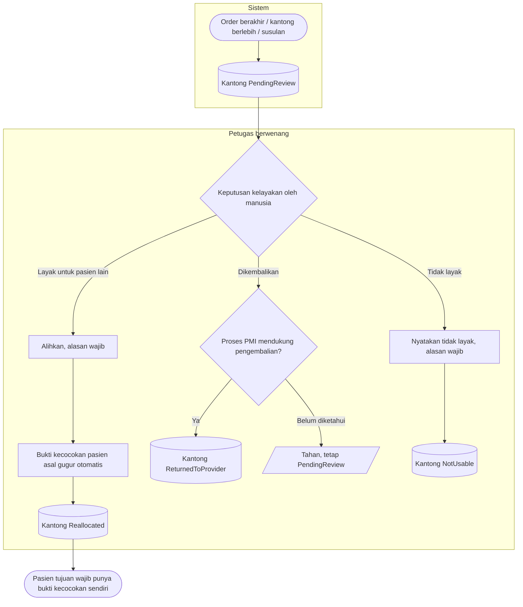

# Proses: Penyelesaian Kantong Menunggu Keputusan — dengan jalur pengecualian

Kantong masuk `PendingReview` ketika ordernya berakhir, ketika datang berlebih, atau ketika datang
susulan setelah kunjungan berakhir. Ia **tidak pernah** menjadi stok bebas.

## Tabel langkah

| Langkah | Pelaku | Masukan | Keluaran | Bila gagal |
| --- | --- | --- | --- | --- |
| Kantong masuk menunggu keputusan | Sistem | Order berakhir / berlebih / susulan | Kantong `PendingReview` | — |
| Alihkan ke pasien lain | Petugas berwenang | Pernyataan kelayakan, alasan | Kantong `Reallocated`; bukti asal gugur | Ditolak tanpa alasan; rantai pasien asal→tujuan wajib tersimpan |
| Kembalikan ke PMI | Petugas berwenang | Proses PMI mendukung | Kantong `ReturnedToProvider` | Ditahan bila kesediaan PMI belum diketahui |
| Nyatakan tidak layak | Petugas berwenang | Alasan | Kantong `NotUsable` | Ditolak tanpa alasan |

Setelah dialihkan, pemberian ke pasien tujuan menuntut bukti kecocokan **baru** terhadap pasien itu,
walaupun golongan darahnya kebetulan sama. Sistem tidak pernah menyimpulkan bukti lama masih cocok.
