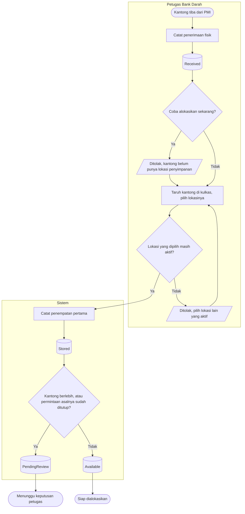
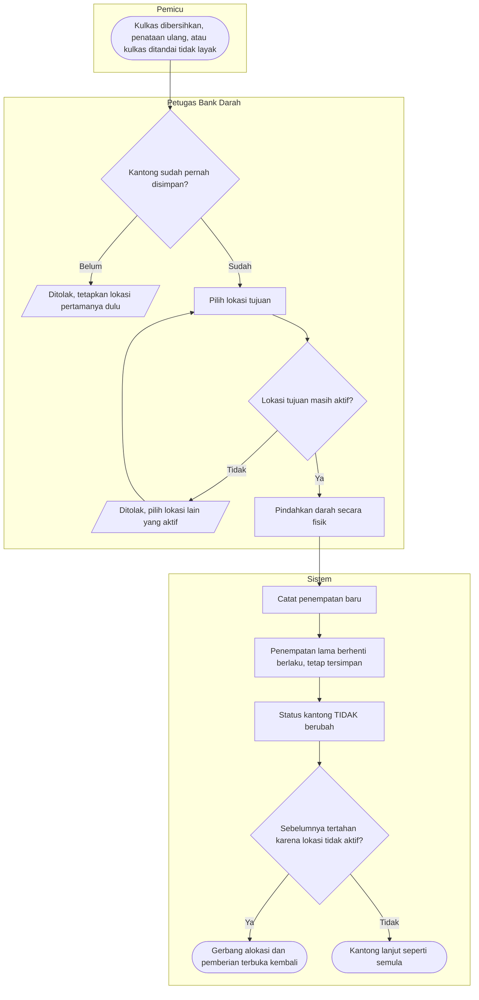
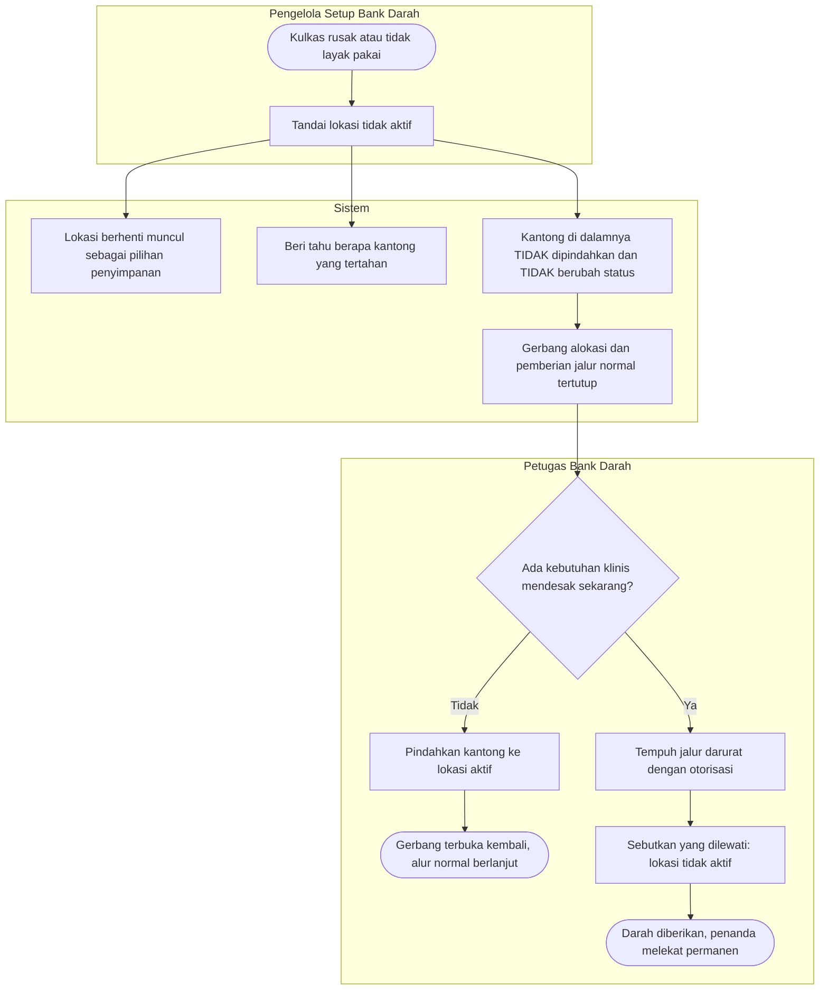
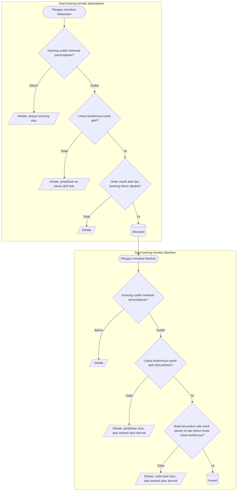

# Proses: Penerimaan, Penyimpanan, dan Perpindahan Lokasi Kantong — dengan jalur pengecualian

Menutup tiga proses yang saling bersambung dan sering dianggap satu: kantong **diterima**, kantong
**disimpan**, dan kantong **dipindahkan**. Ketiganya dipisah di sini karena jalur gagalnya berbeda.

Nama status pada diagram sama persis dengan `contracts/state-transition-matrix.md`.

---

## 1. Penerimaan dan penyimpanan kantong

**Yang paling sering salah dipahami di sini:** kantong berlebih dan kantong yang permintaannya sudah
ditutup **tetap wajib disimpan lebih dulu**. Nasib administratifnya tidak membebaskan siapa pun dari
kewajiban menaruh darah ke dalam kulkas. Karena itu jalur `PendingReview` berangkat dari `Stored`,
bukan memotong dari `Received`.

### Tabel langkah

| Langkah | Pelaku | Masukan | Keluaran | Bila gagal |
| --- | --- | --- | --- | --- |
| Catat penerimaan fisik | Petugas Bank Darah | Kantong fisik + permintaan asal | Kantong `Received` | — |
| Coba alokasikan sebelum disimpan | Petugas Bank Darah | Kantong `Received` | **Ditolak** | Simpan kantong lebih dulu, lalu ulangi alokasi |
| Pilih lokasi penyimpanan | Petugas Bank Darah | Daftar lokasi aktif | Lokasi terpilih | Lokasi nonaktif ditolak; pilih lokasi lain. Bila **tidak ada** lokasi aktif sama sekali, hubungi pengelola Setup — kantong tidak dapat diproses sampai ada |
| Catat penempatan pertama | Sistem | Kantong + lokasi + pelaku + waktu | Kantong `Stored`, riwayat bertambah satu baris | — |
| Tentukan kelanjutan | Sistem | Status permintaan asal, penanda berlebih | `Available` atau `PendingReview` | — |

---

## 2. Perpindahan lokasi

**Perpindahan tidak pernah mengubah status.** Kantong yang sedang dialokasikan untuk seorang pasien
tetap dialokasikan untuk pasien yang sama setelah pindah kulkas, dan bukti kecocokannya tetap berlaku.
Yang bertambah hanya satu baris riwayat.

**Riwayat tidak pernah ditimpa.** Salah taruh diperbaiki dengan mencatat perpindahan baru, bukan dengan
mengubah catatan lama. Pertanyaan "kantong ini pernah ada di mana saja, sejak kapan sampai kapan" harus
selalu dapat dijawab.

### Tabel langkah

| Langkah | Pelaku | Masukan | Keluaran | Bila gagal |
| --- | --- | --- | --- | --- |
| Periksa kantong sudah pernah disimpan | Sistem | Kantong | Lolos | Belum pernah → pakai penetapan lokasi pertama, bukan perpindahan |
| Pilih lokasi tujuan | Petugas Bank Darah | Daftar lokasi aktif | Lokasi terpilih | Lokasi nonaktif ditolak; pilih lokasi lain |
| Pindahkan darah secara fisik | Petugas Bank Darah | Kantong | Kantong ada di lokasi baru | Bila fisik gagal dipindahkan, **jangan** catat perpindahannya — catatan yang tidak sesuai kenyataan lebih berbahaya daripada catatan yang tertinggal |
| Catat penempatan baru | Sistem | Lokasi asal, lokasi tujuan, pelaku, waktu | Riwayat bertambah; status tetap | — |

---

## 3. Lokasi dinonaktifkan, dan bagaimana kantong di dalamnya keluar

**Sistem menutup gerbang; manusia yang memindahkan barang.** Menandai kulkas tidak aktif di layar tidak
memindahkan darah yang ada di dalamnya. Sistem yang berpura-pura memindahkannya akan berbohong tentang
letak barang. Yang dapat dilakukan sistem dengan jujur hanyalah berhenti menawarkan kantong itu untuk
dialokasikan sampai ada orang yang benar-benar memindahkannya.

**Penonaktifan tidak pernah ditahan.** Lokasi dinonaktifkan justru ketika ada yang salah dengannya.
Menolak penonaktifan karena masih ada isinya akan memaksa petugas memindahkan darah dari kulkas yang
sudah diketahui bermasalah **sebelum** boleh menandainya bermasalah — urutan yang terbalik.

### Tabel langkah

| Langkah | Pelaku | Masukan | Keluaran | Bila gagal |
| --- | --- | --- | --- | --- |
| Tandai lokasi tidak aktif | Pengelola Setup Bank Darah | Lokasi | Lokasi nonaktif; peringatan jumlah kantong tertahan | Penonaktifan **tidak** ditahan walaupun masih ada isinya |
| Temukan kantong yang tertahan | Petugas Bank Darah | Saringan pada daftar kantong | Daftar kantong yang perlu dipindahkan | Tanpa saringan ini pekerjaan tidak terlihat — lihat kewajiban layar pada arsitektur frontend |
| Pindahkan ke lokasi aktif | Petugas Bank Darah | Kantong + lokasi tujuan aktif | Gerbang terbuka kembali | Tidak ada lokasi aktif lain → tambahkan lebih dulu lewat Setup |
| Pemberian mendesak sebelum sempat dipindahkan | Peran berwenang | Otorisasi darurat + alasan + keterangan gerbang yang dilewati | Darah diberikan, penanda permanen melekat | Bukan peran berwenang → ditolak; pindahkan kantong lebih dulu |

---

## 4. Gerbang alokasi dan gerbang pemberian

Dua gerbang, dan yang kedua **memuat** yang pertama. Inilah alasan sebuah kantong dapat lolos
dialokasikan hari Senin lalu tertahan saat hendak diberikan hari Selasa — bukan ketidakkonsistenan,
melainkan penilaian ulang yang memang dituntut.

**Kenapa lokasi diperiksa dua kali.** Lokasi bisa saja masih aktif ketika kantong dialokasikan, lalu
dinonaktifkan sesudahnya. Bila gerbang hanya diperiksa saat alokasi, kantong dari kulkas yang sudah
diketahui bermasalah tetap keluar ke pasien. Pemeriksaan kedua itulah inti keputusannya.

### Tabel langkah

| Langkah | Pelaku | Masukan | Keluaran | Bila gagal |
| --- | --- | --- | --- | --- |
| Nilai gerbang alokasi | Sistem | Kantong, lokasi terakhirnya, order tujuan | Kantong terikat pada kebutuhan pasien | Petugas menyimpan atau memindahkan kantong lebih dulu, lalu mengulang |
| Nilai gerbang pemberian | Sistem | Kantong, lokasi terakhirnya **saat itu**, bukti kecocokan, pasien tujuan | Darah diberikan | Bila tertahan lokasi → pindahkan. Bila tertahan bukti → catat bukti baru. Bila keadaan klinis tidak memungkinkan menunggu → jalur darurat dengan otorisasi |
| Tempuh jalur darurat | Peran berwenang | Alasan + keterangan gerbang yang dilewati | Darah diberikan, penanda permanen | Keterangan gerbang tidak diisi → ditolak |

**Sistem tidak menilai kelayakan darah.** Kedua gerbang menahan **tindakan administratif** — mengikat
kantong pada pasien, dan mengeluarkannya. Apakah darah dari kulkas yang rusak masih layak dipakai tetap
penilaian manusia, dan jalurnya sudah ada sejak semula lewat penetapan kantong tidak layak.
