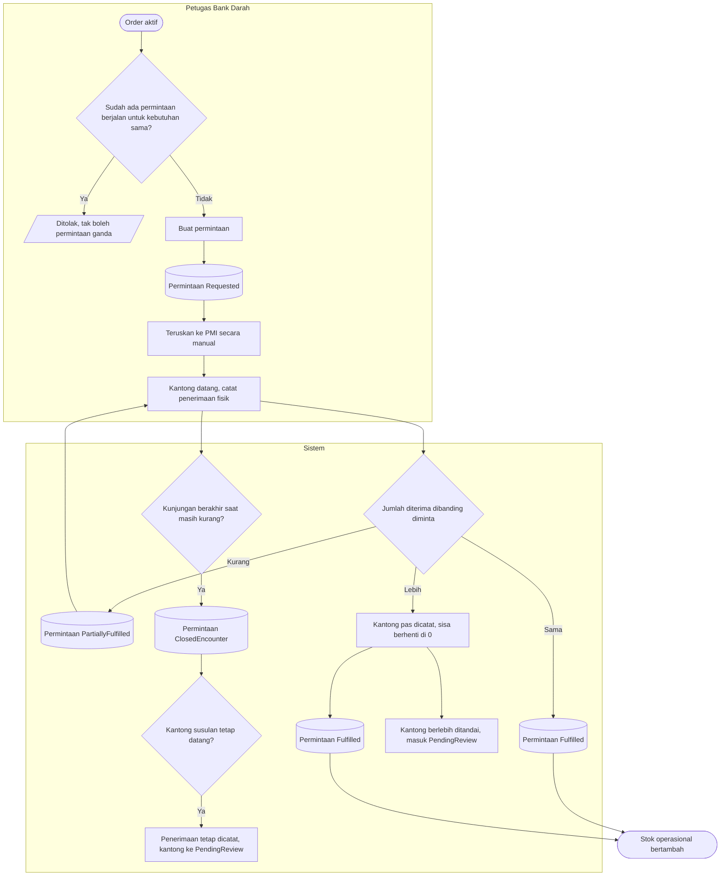

# Proses: Permintaan ke PMI dan Penerimaan Kantong — dengan jalur pengecualian

## Tabel langkah

| Langkah | Pelaku | Masukan | Keluaran | Bila gagal |
| --- | --- | --- | --- | --- |
| Periksa permintaan ganda | Sistem | Kebutuhan order | Lolos | Ditolak; pakai permintaan yang sudah berjalan |
| Buat permintaan | Petugas | Order aktif | Permintaan `Requested` | — |
| Catat penerimaan | Petugas | Kantong fisik | Stok bertambah | — |
| Bandingkan diterima vs diminta | Sistem | Jumlah | Partial / Fulfilled / kelebihan | Sisa tak pernah negatif; kelebihan tetap dicatat lalu `PendingReview` |
| Kunjungan berakhir | Sistem | Sinyal kunjungan | `ClosedEncounter` | Kantong susulan tetap dicatat, masuk `PendingReview` |

Kekurangan pengiriman **tidak** melahirkan permintaan baru; pengiriman berikutnya menambah ke
permintaan yang sama.
