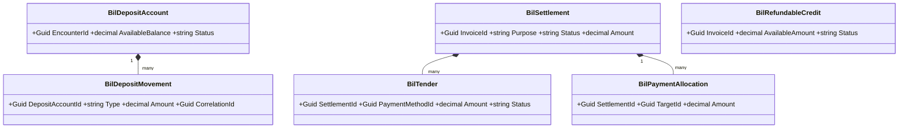
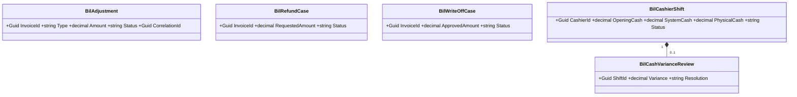
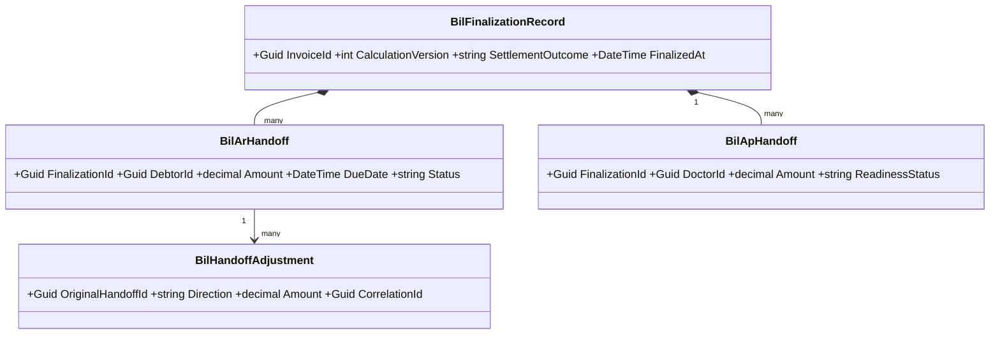

# Billing dan Kasir — Arsitektur Backend

> Blueprint `BIL-CASH-001`, revision `0.4`, status **approved**. Input: keputusan `0.2`, gate `0.3`, domain architecture `0.3`. Owner desain: Product/Domain, Finance/AR/AP, API, Security. Disetujui Product/Domain Owner melalui percakapan pada 20 Agustus 2026 pukul 13:41 WIB.

## Tujuan dan batas desain

Backend menyediakan satu invoice per encounter, charge idempotent, perhitungan berversi, deposit dan pembayaran terpisah, exception finansial immutable, operasi shift kasir, serta finalisasi ke AR/AP. Desain ini belum tersedia di source dan tidak mengizinkan migrasi dijalankan. Trace utama: `BKC-DEC-001`–`044`, `BIL-CON-001`–`013`, acceptance `BIL-AT-001`–`024`.

Semua entitas operasional baru memakai prefix `Bil` sesuai ownership registry. Alur implementasi wajib Controller → Module Service → `ApplicationDbContext`; controller tidak melakukan orkestrasi finansial langsung. Setiap model persisted mewarisi `IdentityModel` dan memiliki `IEntityTypeConfiguration<T>`.

## Bounded context, aggregate, dan transaction boundary

| Context | Aggregate root | Invariant dan transaction boundary | Owner |
| --- | --- | --- | --- |
| `BIL-CTX-01` Billing Account & Charge | `BilInvoice` | Satu invoice per encounter; satu item aktif per `(SourceDomain, SourceDetailId)`; versi kalkulasi immutable; perubahan item dan versi baru atomik | Billing |
| `BIL-CTX-02` Patient Funds & Settlement | `BilDepositAccount`, `BilSettlement` | Ledger deposit append-only; tender independen; allocation tidak boleh melebihi dana sukses atau outstanding | Treasury/Billing |
| `BIL-CTX-03` Financial Exception & Adjustment | `BilAdjustment`, `BilRefundCase`, `BilWriteOffCase` | Maker-checker; posting lama tidak diubah; reversal berupa entry kompensasi baru | Finance |
| `BIL-CTX-04` Cashier Operations | `BilCashierShift` | Satu shift aktif per kasir/register; cash receipt perlu shift aktif; selisih tetap tercatat sampai review | Cashier Operations |
| `BIL-CTX-05` Billing Finalization & Handoff | `BilFinalizationRecord` | Finalisasi sekali per versi; AR per debtor dan AP dokter idempotent; koreksi memakai handoff adjustment | Billing/Finance Integration |

Contoh: pasien rawat inap memiliki running charge Rp10.000.000 dan deposit Rp8.000.000. Alokasi Rp5.000.000 membuat progress payment, bukan menutup invoice. Tindakan baru masih dapat ditambahkan; kalkulasi baru menentukan saldo final, sementara ledger Rp5.000.000 tetap immutable.

## Kepemilikan data

| Kelompok data | Modul pemilik | Dipakai | Dibuat ulang |
| --- | --- | :---: | --- |
| Pasien, encounter, jenis layanan | Registration/Patient Management | Ya | Tidak; referensi ID |
| Order/tindakan klinis dan status selesai | Domain klinis produsen | Ya | Tidak; adapter/event |
| Resep dan jumlah obat diserahkan | Pharmacy | Ya | Tidak |
| Occupancy/transfer kamar | Inpatient/Bed | Ya | Tidak |
| Tarif layanan dan share dokter | Pricing/Remuneration | Ya | Tidak; snapshot nilai |
| Coverage primary/excess dan kontrak | Insurance/Contract | Ya | Tidak; snapshot hasil |
| Metode pembayaran | Billing Master Data (`MstPaymentMethod`) | Ya | Tidak |
| Kategori billing item | Billing Master Data (`MstBillingItemCategory`) | Ya | Tidak |
| Invoice, item, calculation, snapshot | Billing | Ya | Ya, `Bil*` |
| Deposit, settlement, tender, allocation | Billing/Treasury | Ya | Ya, `Bil*` |
| AR setelah finalisasi | AR | Ya | Tidak; Billing hanya handoff |
| AP dokter setelah finalisasi | AP/Doctor Remuneration | Ya | Tidak; Billing hanya handoff |
| Shift dan selisih kas | Cashier Operations | Ya | Ya, `Bil*` |

## Class diagram

Diagram sengaja dipecah; detail kolom berada di ERD dan kamus data.








## Class dan lokasi target

| Class | Konsep | Status | Lokasi file target | Tanggung jawab |
| --- | --- | --- | --- | --- |
| `BilInvoice`, `BilInvoiceItem`, `BilCalculationVersion`, `BilDiscountApplication` | `BIL-CPT-001`–`005`,`009` | Baru | `Areas/HealthServices/BillingManagement/Billing/Models/` | Aggregate charge dan kalkulasi |
| `BilDepositAccount`, `BilDepositMovement` | `BIL-CPT-012`–`013` | Baru | `.../Billing/Models/` | Ledger dana pasien |
| `BilSettlement`, `BilTender`, `BilPaymentAllocation`, `BilRefundableCredit` | `BIL-CPT-014`–`017` | Baru | `.../Billing/Models/` | Penerimaan dan alokasi dana |
| `BilAdjustment`, `BilRefundCase`, `BilWriteOffCase` | `BIL-CPT-006`,`025`,`026` | Baru | `.../Billing/Models/` | Exception append-only |
| `BilCashierShift`, `BilCashVarianceReview` | `BIL-CPT-027`–`028` | Baru | `.../Cashier/Models/` | Kontrol shift dan variance |
| `BilFinalizationRecord`, `BilArHandoff`, `BilApHandoff`, `BilHandoffAdjustment` | `BIL-CPT-018`,`019`,`029`,`030` | Baru | `.../Billing/Models/` | Posting dan handoff idempotent |
| `MstAdministrationFeePolicy`, `MstDiscountPolicy`, `MstTaxRule`, `MstRoomChargePolicy` | `BIL-CPT-007`,`008`,`021`,`023` | Baru | `.../MasterData/Models/` | Kebijakan effective-dated |
| `MstPaymentMethod`, `MstBillingItemCategory` | existing | Sudah ada | `.../MasterData/Models/` | Direuse; perubahan hanya bila task terpisah membuktikan perlu |
| `BillingInvoiceService`, `BillingSettlementService`, `BillingExceptionService`, `BillingFinalizationService` | service | Baru | `.../Billing/Services/` | Command/query dan transaction boundary |
| `CashierShiftService` | service | Baru | `.../Cashier/Services/` | Open/close/review/reopen shift |
| `BillingInvoicesController`, `BillingSettlementsController`, `BillingExceptionsController`, `BillingFinalizationsController` | controller | Baru | `.../Billing/Controllers/` | HTTP boundary tipis |
| `CashierShiftsController` | controller | Baru | `.../Cashier/Controllers/` | HTTP boundary tipis |
| Request/response DTO per endpoint | DTO | Baru | folder `Dtos/` di slice terkait | Tidak mengekspos model EF |
| Satu configuration per model | configuration | Baru | folder `Configurations/` terkait | Key, index, precision, FK, concurrency |

Semua adapter eksternal (`EncounterReference`, `ChargeSourceReference`, `OccupancyReference`) adalah interface/read contract, bukan tabel salinan. Field identitas pasien, data klinis, nomor kartu, token provider, dan bukti pembayaran termasuk sensitif; nilainya tidak boleh masuk custom log.

### Penjelasan setiap persisted class

| Class | Status/lokasi | Fungsi khusus |
| --- | --- | --- |
| `BilInvoice` | Baru, `Billing/Models/BilInvoice.cs` | Root satu encounter dan lifecycle finansial |
| `BilInvoiceItem` | Baru, `Billing/Models/BilInvoiceItem.cs` | Charge sumber idempotent, void tanpa delete |
| `BilCalculationVersion` | Baru, `Billing/Models/BilCalculationVersion.cs` | Hasil kalkulasi immutable dan lock |
| `BilDiscountApplication` | Baru, `Billing/Models/BilDiscountApplication.cs` | Bukti policy/approval/effect diskon |
| `BilDepositAccount` | Baru, `Billing/Models/BilDepositAccount.cs` | Saldo dana belum dialokasikan per ranap |
| `BilDepositMovement` | Baru, `Billing/Models/BilDepositMovement.cs` | Ledger top-up/allocation/release/reversal |
| `BilSettlement` | Baru, `Billing/Models/BilSettlement.cs` | Kelompok penerimaan dana untuk satu tujuan |
| `BilTender` | Baru, `Billing/Models/BilTender.cs` | Attempt per metode pembayaran |
| `BilPaymentAllocation` | Baru, `Billing/Models/BilPaymentAllocation.cs` | Penerapan dana sukses ke target |
| `BilRefundableCredit` | Baru, `Billing/Models/BilRefundableCredit.cs` | Saldo kredit yang boleh dikembalikan |
| `BilAdjustment` | Baru, `Billing/Models/BilAdjustment.cs` | Koreksi debit/credit append-only |
| `BilRefundCase` | Baru, `Billing/Models/BilRefundCase.cs` | Workflow refund metode asal |
| `BilWriteOffCase` | Baru, `Billing/Models/BilWriteOffCase.cs` | Workflow penghapusan AR parsial/penuh |
| `BilCashierShift` | Baru, `Cashier/Models/BilCashierShift.cs` | Root kas fisik/system per shift |
| `BilCashVarianceReview` | Baru, `Cashier/Models/BilCashVarianceReview.cs` | Review selisih dan otorisasi reopen |
| `BilFinalizationRecord` | Baru, `Billing/Models/BilFinalizationRecord.cs` | Bukti final satu calculation version |
| `BilArHandoff` | Baru, `Billing/Models/BilArHandoff.cs` | Basis posting AR per debtor |
| `BilApHandoff` | Baru, `Billing/Models/BilApHandoff.cs` | Basis AP dokter dan readiness |
| `BilHandoffAdjustment` | Baru, `Billing/Models/BilHandoffAdjustment.cs` | Koreksi handoff tanpa mengubah posting lama |
| `MstAdministrationFeePolicy` | Baru, `MasterData/Models/MstAdministrationFeePolicy.cs` | Fee effective-dated dan replacement |
| `MstDiscountPolicy` | Baru, `MasterData/Models/MstDiscountPolicy.cs` | Eligibility dan approval diskon |
| `MstTaxRule` | Baru, `MasterData/Models/MstTaxRule.cs` | Basis/rate/rounding/alokasi pajak |
| `MstRoomChargePolicy` | Baru, `MasterData/Models/MstRoomChargePolicy.cs` | Periode/minimum/rounding kamar |

Setiap baris di atas memiliki configuration bernama `<Class>Configuration.cs` di `Configurations/` konteks yang sama. DTO tidak satu-per-model: request/response dibentuk per endpoint agar tidak membocorkan entity EF.

## Arsitektur folder target

```text
Areas/HealthServices/BillingManagement/
├── Billing/
│   ├── Controllers/                 # Baru
│   ├── Dtos/                        # Baru
│   ├── Models/                      # Baru: BilInvoice sampai BilHandoffAdjustment
│   ├── Configurations/              # Baru: satu per entity
│   ├── Services/                    # Baru: interface + module service
│   └── Integrations/                # Baru: producer, AR, AP adapters/outbox contract
├── Cashier/
│   ├── Controllers/ Dtos/ Models/ Configurations/ Services/  # Baru
└── MasterData/
    ├── Models/                      # Existing + master policy baru
    ├── Controllers/ Dtos/           # Existing; endpoint policy direncanakan
    └── Configurations/ Services/    # Configuration baru; service untuk master baru
Repositories/ApplicationDbContext.cs # Diperbarui: DbSet/config registration
Migrations/                          # Diperbarui hanya oleh task migrasi berizin
```

## Status model dan dampak migration

| Kelompok | Status | Dampak |
| --- | --- | --- |
| 19 entitas `Bil*` pada diagram/kamus | Baru | Tabel, FK, UK, index, decimal precision, optimistic concurrency |
| 4 master policy | Baru | Tabel effective-dated dan seed minimum |
| `MstPaymentMethod`, `MstBillingItemCategory` | Sudah ada | Tidak ada perubahan dalam blueprint ini |
| `ApplicationDbContext` | Diperbarui | Registrasi DbSet/configuration |
| Tabel pasien/encounter/order/pharmacy/occupancy/AR/AP | Sudah ada/eksternal | Tidak dimigrasikan oleh Billing |

## Rencana migration, backfill, dan rollback

1. Tambahkan master policy dan seed nonaktif/draft; belum mengubah jalur produksi.
2. Tambahkan tabel invoice/item/calculation beserta unique filtered index sumber aktif.
3. Tambahkan deposit/settlement/tender/allocation, kemudian exception dan cashier shift.
4. Tambahkan finalization/handoff/outbox serta index idempotency/correlation.
5. Daftarkan adapter producer dalam mode observasi; rekonsiliasi jumlah sumber vs calon billing item.
6. Backfill hanya encounter terbuka yang disetujui Finance/Billing. Data legacy tidak dianggap benar otomatis; simpan `LegacyReference` dan laporan rekonsiliasi.
7. Aktifkan per jenis layanan secara bertahap. Tidak memerlukan downtime bila migration hanya additive dan index besar dibuat melalui strategi DB yang disetujui DBA.

Rollback aplikasi mematikan feature flag dan kembali ke jalur lama; tabel baru tidak langsung di-drop. Posting yang sudah terjadi dikompensasi, bukan dihapus. Rollback schema hanya setelah ekspor rekonsiliasi, tidak ada consumer aktif, dan persetujuan DBA/Finance. Nomor bisnis dibuat oleh service/sequence yang aman—dilarang `Count+1`, `Max+1`, atau dibuat controller.

## Data master awal

| Master | Isi minimum | Sumber/owner |
| --- | --- | --- |
| `MstAdministrationFeePolicy` | Rajal/IGD/OTC dan ranap; nominal tetap; sekali per pasien per hari Asia/Jakarta; replacement rajal→ranap; coverage flag; tanpa diskon | Finance, konfigurasi IT |
| `MstDiscountPolicy` | Promo total/item; target patient portion; periode, eligibility, limit; doctor-share approval | Finance dan Dokter |
| `MstTaxRule` | Basis setelah diskon item, rate, rounding, allocation patient/guarantor, effective dates | Finance/Tax |
| `MstRoomChargePolicy` | 24 jam/minimum/pembulatan/tarif awal periode/leave rule | Inpatient + Finance/contract |
| `MstPaymentMethod` | Tunai, QRIS, transfer/provider aktif dan reconciliation capability | Existing master, Treasury |
| `MstBillingItemCategory` | Tindakan, penunjang, farmasi, kamar, administrasi, jasa dokter | Existing master, Billing |

Nilai nominal, warna/status display, rate, rounding, dan limit tidak boleh di-hardcode di controller atau frontend.

## Yang sengaja tidak dibuat

| Yang ditolak | Alasan |
| --- | --- |
| `BilPatient` / `BilEncounter` | Ownership berada di Patient/Registration; cukup referensi |
| Salinan order/lab/radiologi/resep/occupancy | Producer adalah source of truth; Billing menyimpan source tuple dan snapshot finansial |
| `BilAccountsReceivable` / `BilAccountsPayable` | Lifecycle setelah handoff dimiliki AR/AP |
| `PaymentInProgressInvoice` terpisah | Rawat inap tetap OPEN dengan progress allocation; lock final baru saat finalisasi |
| Mutasi/delete posting historis | Koreksi wajib adjustment/reversal append-only |
| PPN global/hardcoded | Tax mengikuti rule effective-dated |
| Late charge | Keputusan menyatakan seluruh biaya harus dicatat sebagai charge biasa |
| Supervisor approval untuk item sebelum bayar | Tidak disyaratkan; audit actor tetap wajib |

## Security, privacy, exception, dan concurrency

Permission bersifat deny-by-default dan dirinci di matriks permission. Command finansial memakai idempotency key, row-version/optimistic concurrency, reason code, actor, waktu Asia/Jakarta, dan before/after non-sensitif. Provider timeout menghasilkan status `PENDING`, bukan dianggap gagal atau sukses. Conflict mengembalikan pesan agar pengguna memuat ulang; retry dengan key sama harus mengembalikan hasil yang sama.

Exception utama: OTC belum lunas tidak boleh release tindakan; departure kematian/transfer darurat/DAMA boleh administratif dengan debtor sah; keluarga dapat menjadi payer/debtor; rejected insurance claim tidak otomatis dialihkan ke pasien; post-final correction memerlukan Finance approval dan debit/credit handoff adjustment.

## Trace dan approval

Kontrak detail ada di [`contracts/`](./contracts/api-contract.md), ERD di [`erd/`](./erd/00-context-erd.md), dan test di [`testing/acceptance-test-matrix.md`](./testing/acceptance-test-matrix.md). Implementasi baru boleh direncanakan setelah Product/Domain, API, Security, Frontend, Finance/AR/AP menyetujui revision ini.
