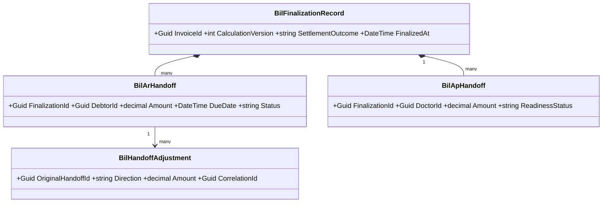
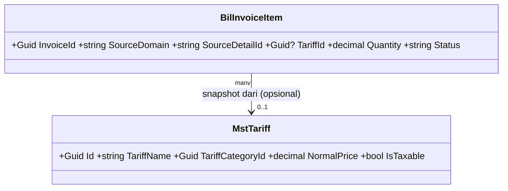
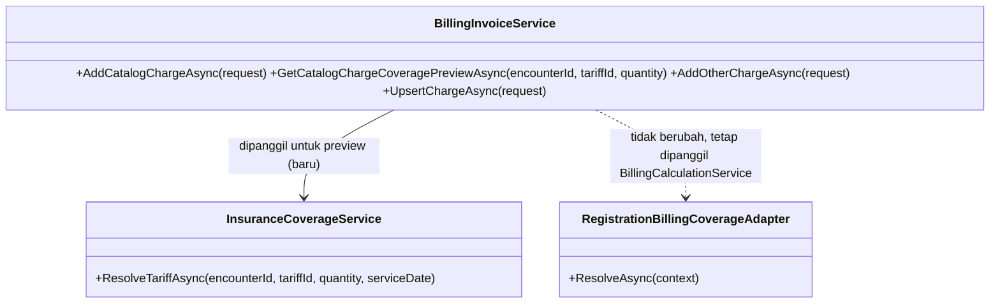
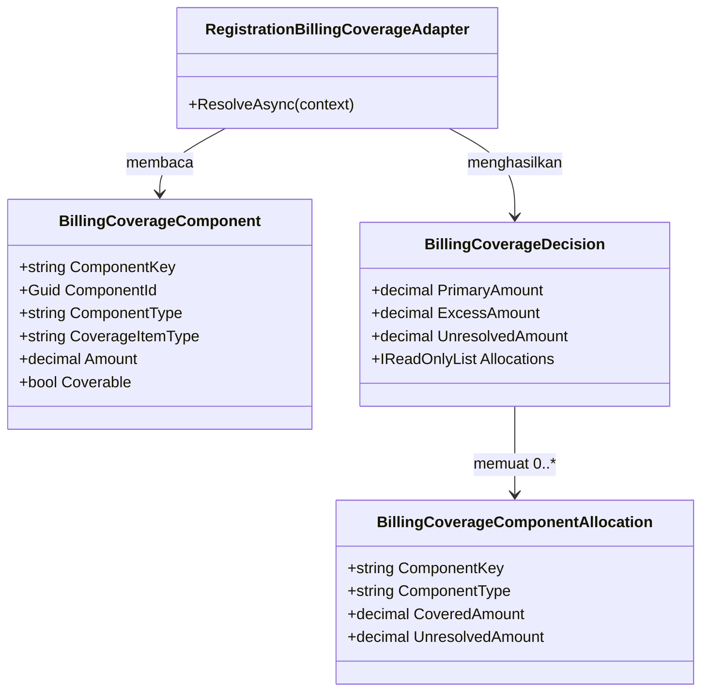
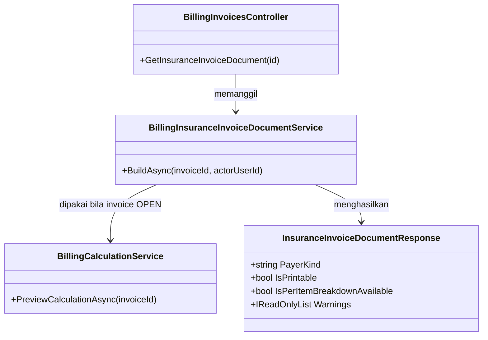

# Billing dan Kasir — Arsitektur Backend

> Blueprint `BIL-CASH-001`, revision `0.4`, status **approved**. Input: keputusan `0.2`, gate `0.3`, domain architecture `0.3`. Owner desain: Product/Domain, Finance/AR/AP, API, Security. Disetujui Product/Domain Owner melalui percakapan pada 20 Agustus 2026 pukul 13:41 WIB.

## Tujuan dan batas desain

Backend menyediakan satu invoice per encounter, charge idempotent, perhitungan berversi, deposit dan pembayaran terpisah, exception finansial immutable, operasi shift kasir, serta finalisasi ke AR/AP. Desain ini belum tersedia di source dan tidak mengizinkan migrasi dijalankan. Trace utama: `BKC-DEC-001`–`044`, `BIL-CON-001`–`013`, acceptance `BIL-AT-001`–`024`.

Semua entitas operasional baru memakai prefix `Bil` sesuai ownership registry. Alur implementasi wajib Controller → Module Service → `ApplicationDbContext`; controller tidak melakukan orkestrasi finansial langsung. Setiap model persisted mewarisi `IdentityModel` dan memiliki `IEntityTypeConfiguration<T>`.

## Bounded context, aggregate, dan transaction boundary

| Context | Aggregate root | Invariant dan transaction boundary | Owner |
| --- | --- | --- | --- |
| `BIL-CTX-01` Billing Account & Charge | `BilInvoice` | Satu invoice per encounter; satu item aktif per `(SourceDomain, SourceDetailId)`; versi kalkulasi immutable; perubahan item dan versi baru atomik | Billing |
| `BIL-CTX-02` Patient Funds & Settlement | `BilDepositAccount`, `BilSettlement` | Ledger deposit append-only; tender independen; allocation tidak boleh melebihi dana sukses atau outstanding | Treasury/Billing |
| `BIL-CTX-03` Financial Exception & Adjustment | `BilAdjustment`, `BilRefundCase`, `BilWriteOffCase` | Maker-checker; posting lama tidak diubah; reversal berupa entry kompensasi baru | Finance |
| `BIL-CTX-04` Cashier Operations | `BilCashierShift` | Satu shift aktif per kasir/register; cash receipt perlu shift aktif; selisih tetap tercatat sampai review | Cashier Operations |
| `BIL-CTX-05` Billing Finalization & Handoff | `BilFinalizationRecord` | Finalisasi sekali per versi; AR per debtor dan AP dokter idempotent; koreksi memakai handoff adjustment | Billing/Finance Integration |

Contoh: pasien rawat inap memiliki running charge Rp10.000.000 dan deposit Rp8.000.000. Alokasi Rp5.000.000 membuat progress payment, bukan menutup invoice. Tindakan baru masih dapat ditambahkan; kalkulasi baru menentukan saldo final, sementara ledger Rp5.000.000 tetap immutable.

## Kepemilikan data

| Kelompok data | Modul pemilik | Dipakai | Dibuat ulang |
| --- | --- | :---: | --- |
| Pasien, encounter, jenis layanan | Registration/Patient Management | Ya | Tidak; referensi ID |
| Order/tindakan klinis dan status selesai | Domain klinis produsen | Ya | Tidak; adapter/event |
| Resep dan jumlah obat diserahkan | Pharmacy | Ya | Tidak |
| Occupancy/transfer kamar | Inpatient/Bed | Ya | Tidak |
| Tarif layanan dan share dokter | Pricing/Remuneration | Ya | Tidak; snapshot nilai |
| Coverage primary/excess dan kontrak | Insurance/Contract | Ya | Tidak; snapshot hasil |
| Metode pembayaran | Billing Master Data (`MstPaymentMethod`) | Ya | Tidak |
| Kategori billing item | Billing Master Data (`MstBillingItemCategory`) | Ya | Tidak |
| Invoice, item, calculation, snapshot | Billing | Ya | Ya, `Bil*` |
| Deposit, settlement, tender, allocation | Billing/Treasury | Ya | Ya, `Bil*` |
| AR setelah finalisasi | AR | Ya | Tidak; Billing hanya handoff |
| AP dokter setelah finalisasi | AP/Doctor Remuneration | Ya | Tidak; Billing hanya handoff |
| Shift dan selisih kas | Cashier Operations | Ya | Ya, `Bil*` |

## Class diagram

Diagram sengaja dipecah; detail kolom berada di ERD dan kamus data.




## Class dan lokasi target

| Class | Konsep | Status | Lokasi file target | Tanggung jawab |
| --- | --- | --- | --- | --- |
| `BilInvoice`, `BilInvoiceItem`, `BilCalculationVersion`, `BilDiscountApplication` | `BIL-CPT-001`–`005`,`009` | Baru | `Areas/HealthServices/BillingManagement/Billing/Models/` | Aggregate charge dan kalkulasi |
| `BilDepositAccount`, `BilDepositMovement` | `BIL-CPT-012`–`013` | Baru | `.../Billing/Models/` | Ledger dana pasien |
| `BilSettlement`, `BilTender`, `BilPaymentAllocation`, `BilRefundableCredit` | `BIL-CPT-014`–`017` | Baru | `.../Billing/Models/` | Penerimaan dan alokasi dana |
| `BilAdjustment`, `BilRefundCase`, `BilWriteOffCase` | `BIL-CPT-006`,`025`,`026` | Baru | `.../Billing/Models/` | Exception append-only |
| `BilCashierShift`, `BilCashVarianceReview` | `BIL-CPT-027`–`028` | Baru | `.../Cashier/Models/` | Kontrol shift dan variance |
| `BilFinalizationRecord`, `BilArHandoff`, `BilApHandoff`, `BilHandoffAdjustment` | `BIL-CPT-018`,`019`,`029`,`030` | Baru | `.../Billing/Models/` | Posting dan handoff idempotent |
| `MstAdministrationFeePolicy`, `MstDiscountPolicy`, `MstTaxRule`, `MstRoomChargePolicy` | `BIL-CPT-007`,`008`,`021`,`023` | Baru | `.../MasterData/Models/` | Kebijakan effective-dated |
| `MstPaymentMethod`, `MstBillingItemCategory` | existing | Sudah ada | `.../MasterData/Models/` | Direuse; perubahan hanya bila task terpisah membuktikan perlu |
| `BillingInvoiceService`, `BillingSettlementService`, `BillingExceptionService`, `BillingFinalizationService` | service | Baru | `.../Billing/Services/` | Command/query dan transaction boundary |
| `CashierShiftService` | service | Baru | `.../Cashier/Services/` | Open/close/review/reopen shift |
| `BillingInvoicesController`, `BillingSettlementsController`, `BillingExceptionsController`, `BillingFinalizationsController` | controller | Baru | `.../Billing/Controllers/` | HTTP boundary tipis |
| `CashierShiftsController` | controller | Baru | `.../Cashier/Controllers/` | HTTP boundary tipis |
| Request/response DTO per endpoint | DTO | Baru | folder `Dtos/` di slice terkait | Tidak mengekspos model EF |
| Satu configuration per model | configuration | Baru | folder `Configurations/` terkait | Key, index, precision, FK, concurrency |

Semua adapter eksternal (`EncounterReference`, `ChargeSourceReference`, `OccupancyReference`) adalah interface/read contract, bukan tabel salinan. Field identitas pasien, data klinis, nomor kartu, token provider, dan bukti pembayaran termasuk sensitif; nilainya tidak boleh masuk custom log.

### Penjelasan setiap persisted class

| Class | Status/lokasi | Fungsi khusus |
| --- | --- | --- |
| `BilInvoice` | Baru, `Billing/Models/BilInvoice.cs` | Root satu encounter dan lifecycle finansial |
| `BilInvoiceItem` | Baru, `Billing/Models/BilInvoiceItem.cs` | Charge sumber idempotent, void tanpa delete |
| `BilCalculationVersion` | Baru, `Billing/Models/BilCalculationVersion.cs` | Hasil kalkulasi immutable dan lock |
| `BilDiscountApplication` | Baru, `Billing/Models/BilDiscountApplication.cs` | Bukti policy/approval/effect diskon |
| `BilDepositAccount` | Baru, `Billing/Models/BilDepositAccount.cs` | Saldo dana belum dialokasikan per ranap |
| `BilDepositMovement` | Baru, `Billing/Models/BilDepositMovement.cs` | Ledger top-up/allocation/release/reversal |
| `BilSettlement` | Baru, `Billing/Models/BilSettlement.cs` | Kelompok penerimaan dana untuk satu tujuan |
| `BilTender` | Baru, `Billing/Models/BilTender.cs` | Attempt per metode pembayaran |
| `BilPaymentAllocation` | Baru, `Billing/Models/BilPaymentAllocation.cs` | Penerapan dana sukses ke target |
| `BilRefundableCredit` | Baru, `Billing/Models/BilRefundableCredit.cs` | Saldo kredit yang boleh dikembalikan |
| `BilAdjustment` | Baru, `Billing/Models/BilAdjustment.cs` | Koreksi debit/credit append-only |
| `BilRefundCase` | Baru, `Billing/Models/BilRefundCase.cs` | Workflow refund metode asal |
| `BilWriteOffCase` | Baru, `Billing/Models/BilWriteOffCase.cs` | Workflow penghapusan AR parsial/penuh |
| `BilCashierShift` | Baru, `Cashier/Models/BilCashierShift.cs` | Root kas fisik/system per shift |
| `BilCashVarianceReview` | Baru, `Cashier/Models/BilCashVarianceReview.cs` | Review selisih dan otorisasi reopen |
| `BilFinalizationRecord` | Baru, `Billing/Models/BilFinalizationRecord.cs` | Bukti final satu calculation version |
| `BilArHandoff` | Baru, `Billing/Models/BilArHandoff.cs` | Basis posting AR per debtor |
| `BilApHandoff` | Baru, `Billing/Models/BilApHandoff.cs` | Basis AP dokter dan readiness |
| `BilHandoffAdjustment` | Baru, `Billing/Models/BilHandoffAdjustment.cs` | Koreksi handoff tanpa mengubah posting lama |
| `MstAdministrationFeePolicy` | Baru, `MasterData/Models/MstAdministrationFeePolicy.cs` | Fee effective-dated dan replacement |
| `MstDiscountPolicy` | Baru, `MasterData/Models/MstDiscountPolicy.cs` | Eligibility dan approval diskon |
| `MstTaxRule` | Baru, `MasterData/Models/MstTaxRule.cs` | Basis/rate/rounding/alokasi pajak |
| `MstRoomChargePolicy` | Baru, `MasterData/Models/MstRoomChargePolicy.cs` | Periode/minimum/rounding kamar |

Setiap baris di atas memiliki configuration bernama `<Class>Configuration.cs` di `Configurations/` konteks yang sama. DTO tidak satu-per-model: request/response dibentuk per endpoint agar tidak membocorkan entity EF.

## Arsitektur folder target

```text
Areas/HealthServices/BillingManagement/
├── Billing/
│   ├── Controllers/                 # Baru
│   ├── Dtos/                        # Baru
│   ├── Models/                      # Baru: BilInvoice sampai BilHandoffAdjustment
│   ├── Configurations/              # Baru: satu per entity
│   ├── Services/                    # Baru: interface + module service
│   └── Integrations/                # Baru: producer, AR, AP adapters/outbox contract
├── Cashier/
│   ├── Controllers/ Dtos/ Models/ Configurations/ Services/  # Baru
└── MasterData/
    ├── Models/                      # Existing + master policy baru
    ├── Controllers/ Dtos/           # Existing; endpoint policy direncanakan
    └── Configurations/ Services/    # Configuration baru; service untuk master baru
Repositories/ApplicationDbContext.cs # Diperbarui: DbSet/config registration
Migrations/                          # Diperbarui hanya oleh task migrasi berizin
```

## Status model dan dampak migration

| Kelompok | Status | Dampak |
| --- | --- | --- |
| 19 entitas `Bil*` pada diagram/kamus | Baru | Tabel, FK, UK, index, decimal precision, optimistic concurrency |
| 4 master policy | Baru | Tabel effective-dated dan seed minimum |
| `MstPaymentMethod`, `MstBillingItemCategory` | Sudah ada | Tidak ada perubahan dalam blueprint ini |
| `ApplicationDbContext` | Diperbarui | Registrasi DbSet/configuration |
| Tabel pasien/encounter/order/pharmacy/occupancy/AR/AP | Sudah ada/eksternal | Tidak dimigrasikan oleh Billing |

## Rencana migration, backfill, dan rollback

1. Tambahkan master policy dan seed nonaktif/draft; belum mengubah jalur produksi.
2. Tambahkan tabel invoice/item/calculation beserta unique filtered index sumber aktif.
3. Tambahkan deposit/settlement/tender/allocation, kemudian exception dan cashier shift.
4. Tambahkan finalization/handoff/outbox serta index idempotency/correlation.
5. Daftarkan adapter producer dalam mode observasi; rekonsiliasi jumlah sumber vs calon billing item.
6. Backfill hanya encounter terbuka yang disetujui Finance/Billing. Data legacy tidak dianggap benar otomatis; simpan `LegacyReference` dan laporan rekonsiliasi.
7. Aktifkan per jenis layanan secara bertahap. Tidak memerlukan downtime bila migration hanya additive dan index besar dibuat melalui strategi DB yang disetujui DBA.

Rollback aplikasi mematikan feature flag dan kembali ke jalur lama; tabel baru tidak langsung di-drop. Posting yang sudah terjadi dikompensasi, bukan dihapus. Rollback schema hanya setelah ekspor rekonsiliasi, tidak ada consumer aktif, dan persetujuan DBA/Finance. Nomor bisnis dibuat oleh service/sequence yang aman—dilarang `Count+1`, `Max+1`, atau dibuat controller.

## Data master awal

| Master | Isi minimum | Sumber/owner |
| --- | --- | --- |
| `MstAdministrationFeePolicy` | Rajal/IGD/OTC dan ranap; nominal tetap; sekali per pasien per hari Asia/Jakarta; replacement rajal→ranap; coverage flag; tanpa diskon | Finance, konfigurasi IT |
| `MstDiscountPolicy` | Promo total/item; target patient portion; periode, eligibility, limit; doctor-share approval | Finance dan Dokter |
| `MstTaxRule` | Basis setelah diskon item, rate, rounding, allocation patient/guarantor, effective dates | Finance/Tax |
| `MstRoomChargePolicy` | 24 jam/minimum/pembulatan/tarif awal periode/leave rule | Inpatient + Finance/contract |
| `MstPaymentMethod` | Tunai, QRIS, transfer/provider aktif dan reconciliation capability | Existing master, Treasury |
| `MstBillingItemCategory` | Tindakan, penunjang, farmasi, kamar, administrasi, jasa dokter | Existing master, Billing |

Nilai nominal, warna/status display, rate, rounding, dan limit tidak boleh di-hardcode di controller atau frontend.

## Yang sengaja tidak dibuat

| Yang ditolak | Alasan |
| --- | --- |
| `BilPatient` / `BilEncounter` | Ownership berada di Patient/Registration; cukup referensi |
| Salinan order/lab/radiologi/resep/occupancy | Producer adalah source of truth; Billing menyimpan source tuple dan snapshot finansial |
| `BilAccountsReceivable` / `BilAccountsPayable` | Lifecycle setelah handoff dimiliki AR/AP |
| `PaymentInProgressInvoice` terpisah | Rawat inap tetap OPEN dengan progress allocation; lock final baru saat finalisasi |
| Mutasi/delete posting historis | Koreksi wajib adjustment/reversal append-only |
| PPN global/hardcoded | Tax mengikuti rule effective-dated |
| Late charge | Keputusan menyatakan seluruh biaya harus dicatat sebagai charge biasa |
| Supervisor approval untuk item sebelum bayar | Tidak disyaratkan; audit actor tetap wajib |

## Security, privacy, exception, dan concurrency

Permission bersifat deny-by-default dan dirinci di matriks permission. Command finansial memakai idempotency key, row-version/optimistic concurrency, reason code, actor, waktu Asia/Jakarta, dan before/after non-sensitif. Provider timeout menghasilkan status `PENDING`, bukan dianggap gagal atau sukses. Conflict mengembalikan pesan agar pengguna memuat ulang; retry dengan key sama harus mengembalikan hasil yang sama.

Exception utama: OTC belum lunas tidak boleh release tindakan; departure kematian/transfer darurat/DAMA boleh administratif dengan debtor sah; keluarga dapat menjadi payer/debtor; rejected insurance claim tidak otomatis dialihkan ke pasien; post-final correction memerlukan Finance approval dan debit/credit handoff adjustment.

## Trace dan approval

Kontrak detail ada di [`contracts/`](./contracts/api-contract.md), ERD di [`erd/`](./erd/00-context-erd.md), dan test di [`testing/acceptance-test-matrix.md`](./testing/acceptance-test-matrix.md). Implementasi baru boleh direncanakan setelah Product/Domain, API, Security, Frontend, Finance/AR/AP menyetujui revision ini.

## Amendment 2 September 2026 — Entri manual berbasis katalog tarif + coverage per item

> Status **approved** (Product/Domain Owner, 2 September 2026 13:53 WIB — "approval eksplisit sekarang untuk BKC-DEC-059–062"). Input: keputusan `BKC-DEC-059`–`062` (`00-interview-decisions.md`), impact scan § 16 (`01-existing-capability-map.md`). Backend SHA diaudit `17b9c0e21e32b41a8dfd6dbde31462d52717646b`, frontend SHA `60febdcdbb39de6cebc2d825906bce949f3b5af3`. Catatan wewenang pada `BKC-DEC-062` tetap berlaku (amendemen sebagian `BKC-DEC-042` tanpa konfirmasi terpisah Payer/Insurance+Finance/AR) — lihat `00-interview-decisions.md`.

### Tujuan dan batas amendment ini

Mengganti entri item pada form "Buat Invoice Manual (Testing)" dari free-text/free-price menjadi terikat katalog `MstTariff`, menambah preview coverage per item untuk pasien asuransi, dan menyelaraskan sebagian perilaku mesin coverage kalkulasi invoice (`BKC-DEC-062`). Panel "Tambah Biaya Lain-lain" pada Menu Pembayaran (`BKC-DEC-047`) **TIDAK** disentuh. Trace: `BKC-DEC-059`–`062`, CAP-01–CAP-08 (impact scan § 16).

### Ringkasan keputusan arsitektur untuk conflict § 16.2.A

Dua mesin coverage (`RegistrationBillingCoverageAdapter` milik Billing dan `InsuranceCoverageService` milik Clinical Management) TETAP terpisah pada amendment ini — tidak disatukan. Pembagian tanggung jawab:

| Kebutuhan | Mesin yang dipakai | Alasan |
| --- | --- | --- |
| Preview coverage per item pada dropdown (advisory, sebelum item ditambahkan) | `InsuranceCoverageService.ResolveTariffAsync` (Clinical Management, direuse) | Sudah mensyaratkan `MstInsuranceTariff` dan sudah memperlakukan flag approval sebagai info, bukan gating — persis kebutuhan `BKC-DEC-060` tanpa kode baru |
| Kalkulasi resmi invoice di Menu Pembayaran (otoritatif, dipakai penagihan) | `RegistrationBillingCoverageAdapter` (Billing, tetap pemilik) | Ownership kalkulasi finansial tetap di Billing; hanya gating approval yang dipersempit sesuai `BKC-DEC-062` |

Konsekuensi yang **MUST** disadari: badge preview bisa saja optimistis dibanding angka final Menu Pembayaran untuk kasus yang gate-nya berbeda (`MstInsuranceTariff` tidak dicek oleh `RegistrationBillingCoverageAdapter`). Ini bukan bug — didokumentasikan sebagai keterbatasan yang disengaja, dengan mitigasi berupa disclaimer UI (lihat amendment frontend). Menyatukan kedua mesin adalah keputusan cross-module terpisah, **di luar scope** amendment ini (lihat "Yang sengaja tidak dibuat").

### Kepemilikan data — baris baru

| Kelompok data | Modul pemilik | Dipakai modul ini | Dibuat ulang |
| --- | --- | :---: | --- |
| Tarif layanan (`MstTariff`, `MstTariffCategory`) | Health Services Master Data | Ya | Tidak; sudah direferensikan `BilInvoiceItem.CategoryId` sejak awal, kini ditambah `TariffId` |
| Resolusi coverage per tarif (`InsuranceCoverageService.ResolveTariffAsync`) | Clinical Management | Ya | Tidak; dipanggil langsung sebagai service dalam proses yang sama (bukan HTTP terpisah — modular monolith, satu assembly) |
| Kontrak tarif asuransi (`MstInsuranceTariff`), rule coverage (`MstInsuranceCoverageRule`) | Health Services Master Data (dikonsumsi `InsuranceCoverageService`) | Ya, tidak langsung (lewat `InsuranceCoverageService`) | Tidak |

### Class diagram — perubahan





### Penjelasan class yang berubah/baru

| Class | Status | Lokasi file | Tanggung jawab |
| --- | --- | --- | --- |
| `BilInvoiceItem.TariffId` | Diperbarui (kolom baru) | `Areas/HealthServices/BillingManagement/Billing/Models/BilInvoiceItem.cs` | FK opsional ke `MstTariff` yang dipakai saat entri berasal dari katalog; `null` untuk item lama/free-form (adhoc bebas, klinis tanpa tarif eksplisit) |
| `AddCatalogChargeRequest` | Baru | `Areas/HealthServices/BillingManagement/Billing/Dtos/BillingInvoiceDtos.cs` | Request entri katalog: `EncounterId`, `TariffId`, `Quantity`, `CorrelationId`, `CausationId` — **TIDAK punya field harga/kategori/deskripsi**, seluruhnya diturunkan server-side dari `MstTariff` (menegakkan `BKC-DEC-059`/A.3 secara struktural, bukan hanya validasi) |
| `CatalogChargeCoveragePreviewResponse` | Baru | `Areas/HealthServices/BillingManagement/Billing/Dtos/BillingInvoiceDtos.cs` | Response preview: `TariffId`, `TariffName`, `CoverageStatus` (`Covered`/`PartiallyCovered`/`NotCovered`/`NeedApproval`/`SelfPay`), `CoveragePercent`, `HospitalUnitPrice`, `ContractUnitPrice`, `EstimatedCoveredAmount`, `EstimatedPatientAmount`, `IsNeedApproval`, `IsNeedGuaranteeLetter`, `Warnings`. Field `Estimated*` diberi awalan eksplisit karena BUKAN angka final — angka final tetap dari `RegistrationBillingCoverageAdapter` saat kalkulasi invoice |
| `BillingInvoiceService.AddCatalogChargeAsync` | Baru (method) | `Areas/HealthServices/BillingManagement/Billing/Services/BillingInvoiceService.cs` | Pola sama seperti `AddOtherChargeAsync` existing: lookup `MstTariff` aktif+efektif by Id, ambil `NormalPrice`+`TariffCategoryId`+`TariffName`, build `UpsertChargeRequest` dengan `SourceDomain="ADHOC_CATALOG"`, `TariffId` diisi, lalu delegasikan ke `UpsertChargeAsync` yang sudah ada (idempotensi/locking/invoice-upsert direuse penuh) |
| `BillingInvoiceService.GetCatalogChargeCoveragePreviewAsync` | Baru (method) | sama | Validasi encounter+tarif, panggil `InsuranceCoverageService.ResolveTariffAsync` (constructor injection baru), map `InsuranceCoverageResult` → `CatalogChargeCoveragePreviewResponse`. Read-only, tanpa side effect, tanpa transaksi |
| `BillingInvoiceService` (constructor) | Diperbarui | sama | Tambah dependency `InsuranceCoverageService` (`AddScoped`, sudah terdaftar untuk Clinical Management — injeksi lintas Area valid karena satu assembly/proses, konsisten dengan pola `RegistrationBillingCoverageAdapter` yang sudah membaca tabel Registration langsung) |
| `BillingInvoiceService.GetActiveEncounterOptionsAsync` | Diperbarui | sama | Tambah proyeksi `ServiceUnitId`, `ClinicId`, `PatientClassId` dari `TrxPatientEncounter` yang sudah dimuat — tidak perlu join baru |
| `ActiveEncounterOptionResponse` | Diperbarui | `Areas/HealthServices/BillingManagement/Billing/Dtos/BillingInvoiceDtos.cs` | Tambah field `ServiceUnitId` (`Guid`), `ClinicId` (`Guid?`), `PatientClassId` (`Guid?`) — dipakai FE untuk memfilter `GET Tariff/options` (`BKC-DEC-061`) |
| `BillingInvoicesController` | Diperbarui | `Areas/HealthServices/BillingManagement/Billing/Controllers/BillingInvoicesController.cs` | Tambah 2 action: `POST catalog-charges`, `GET catalog-charges/coverage-preview` |
| `BillingChargeSourceAdapter.SourcePolicies` | Diperbarui | `Areas/HealthServices/BillingManagement/Billing/Services/BillingChargeSourceAdapter.cs` | Tambah entri `["ADHOC_CATALOG"] = Policy(["ADDED"], ["ADDED"], ["VOIDED"], completeOnEntry: true)` — policy identik `"ADHOC"`, domain baru murni untuk keterlacakan (§ 16.2.B), bukan perilaku baru |
| `RegistrationBillingCoverageAdapter.ResolveAsync` | Diperbarui | `Areas/HealthServices/BillingManagement/Billing/Services/BillingCoverageAdapter.cs` | Persempit kondisi gating: `rule.IsNeedApproval`/`rule.IsNeedGuaranteeLetter` **TIDAK LAGI** memindahkan komponen ke `unresolved` selama `rule.CoverageStatus == "Covered"`. `CoverageStatus == "NeedApproval"` dan `MaxAmountPerMonth`/`MaxQuantityPerMonth` **TETAP** menjadi gate (belum dikonfirmasi user untuk dilepas — lihat pertanyaan terbuka `04-prd-to-mvp.md`) |

### Arsitektur folder — perubahan

```text
Areas/HealthServices/BillingManagement/Billing/
├── Models/
│   └── BilInvoiceItem.cs                 # Diperbarui: +TariffId
├── Dtos/
│   └── BillingInvoiceDtos.cs             # Diperbarui: +AddCatalogChargeRequest, +CatalogChargeCoveragePreviewResponse, +3 field ActiveEncounterOptionResponse
├── Services/
│   ├── BillingInvoiceService.cs          # Diperbarui: +2 method, +dependency InsuranceCoverageService
│   └── BillingChargeSourceAdapter.cs     # Diperbarui: +policy ADHOC_CATALOG
│   └── BillingCoverageAdapter.cs         # Diperbarui: gating dipersempit
└── Controllers/
    └── BillingInvoicesController.cs      # Diperbarui: +2 action
Repositories/Configurations/HealthServices/BillingManagement/Billing/
└── BilInvoiceItemConfiguration.cs        # Diperbarui: FK TariffId, index, DeleteBehavior.Restrict
Migrations/
└── <timestamp>_AddTariffIdToBilInvoiceItem.cs   # Baru
```

### Status model dan dampak migration

| Kelompok | Status | Dampak |
| --- | --- | --- |
| `BilInvoiceItem.TariffId` | Diperbarui | Kolom baru `Guid?`, FK ke `MstTariff` (`Restrict`), index non-unique (bukan bagian UK source tuple) |
| `MstTariff`, `MstTariffCategory`, `MstInsuranceCoverageRule`, `MstInsuranceTariff` | Sudah ada | Tidak ada perubahan skema; hanya dibaca |

### Rencana migration, backfill, dan rollback

1. Tambah kolom `TariffId` (`nullable`) pada `BilInvoiceItem` beserta FK `Restrict` dan index — migration tunggal, additive, tanpa downtime (kolom nullable, tidak mengunci baris existing).
2. Tidak perlu backfill: baris lama sah tetap `TariffId = null` (item lama memang bukan hasil entri katalog).
3. Registrasi `SourcePolicies["ADHOC_CATALOG"]` dan endpoint baru adalah perubahan kode, dideploy bersamaan dengan migration di atas.
4. Rollback: turunkan migration (drop kolom+FK+index) aman selama tidak ada baris yang sudah mengisi `TariffId` — jika sudah ada, exporting dulu sebelum drop. Rollback kode (nonaktifkan 2 endpoint baru) tidak memerlukan rollback schema karena kolom nullable tidak dibaca oleh jalur lama.

### Data master awal

Tidak ada tabel master baru. Fitur ini **BERGANTUNG** pada `MstTariff`, `MstTariffCategory`, `MstInsuranceCoverageRule`, dan `MstInsuranceTariff` sudah terisi data nyata — tanpa itu dropdown item kosong dan preview coverage selalu `SelfPay`/`NotCovered`. Pengisian data master ini **di luar scope** amendment (tanggung jawab operasional/Finance/Insurance Owner yang sudah berjalan sebelum amendment ini).

### Yang sengaja tidak dibuat (tambahan)

| Yang ditolak | Alasan |
| --- | --- |
| Menyatukan `RegistrationBillingCoverageAdapter` dan `InsuranceCoverageService` jadi satu mesin | Perubahan cross-module besar (menyentuh SEMUA invoice, bukan cuma form ini) yang belum diminta/diputuskan user — lihat § 16.2.A. Dicatat sebagai pertanyaan terbuka, bukan dikerjakan diam-diam |
| Menambah gate `MstInsuranceTariff` ke `RegistrationBillingCoverageAdapter` | Sama seperti di atas — mengubah kalkulasi resmi seluruh invoice tanpa keputusan eksplisit |
| Melepas gating `MaxAmountPerMonth`/`MaxQuantityPerMonth` pada `RegistrationBillingCoverageAdapter` | User hanya mengonfirmasi soal flag approval ("ga perlu approval"), belum soal limit bulanan — tetap gating sampai dikonfirmasi eksplisit |
| Endpoint HTTP baru di Clinical Management untuk `ResolveTariffAsync` | Tidak perlu — pemanggilan lintas Area cukup lewat DI dalam proses yang sama (modular monolith), konsisten pola `RegistrationBillingCoverageAdapter` yang sudah membaca tabel Registration langsung |
| Menghapus `addAdhocBillingCharge`/endpoint `from-source` free-category lama dari jalur form testing | Endpoint `from-source` tetap dipakai domain lain (klinis); thunk FE `addAdhocBillingCharge` menjadi tidak terpakai oleh form ini setelah amendment tapi TIDAK dihapus pada task ini — pembersihan kode mati adalah task cleanup terpisah, di luar scope (`AGENTS.md`: jangan cleanup tidak terkait) |
| Kolom snapshot `InsuranceCoverageRuleId` pada `BilInvoiceItem` | `BKC-DEC-013` (approved) sudah menyatakan coverage dihitung ulang live, bukan snapshot saat entri — menyimpannya di item hanya menambah kolom yang tidak pernah jadi source of truth |

### Security, privacy, exception, dan concurrency — tambahan

`GET catalog-charges/coverage-preview` adalah read-only tanpa command/idempotency key. `POST catalog-charges` mengikuti pola idempotency yang sama dengan `POST from-source`. Response preview **MUST NOT** membocorkan detail kontrak asuransi (`MstInsuranceTariff.ContractUnitPrice` boleh tampil sebagai harga, tapi field internal rule seperti `RuleCode`/`ApprovalInstruction` tidak diekspos ke DTO publik). `TariffId` bukan kolom sensitif; `ServiceUnitId`/`ClinicId`/`PatientClassId` pada `ActiveEncounterOptionResponse` juga tidak sensitif (bukan data klinis).

## Amendment 3 September 2026 — Dokumen "Invoice Asuransi" dan pecahan rupiah coverage per item

> Status **draft** (belum di-approve manusia). Input keputusan: `BKC-DEC-065`–`069` (`00-interview-decisions.md`, approved Product/Domain Owner 3 September 2026). Keputusan arsitektur baru pada amendment ini diberi ID `BKC-DES-001`–`BKC-DES-009` — ini keputusan **teknis** dalam wewenang desain, bukan keputusan bisnis baru; masing-masing menunjuk `BKC-DEC-*` yang menjadi dasarnya.
>
> **Impact scan read-only 3 September 2026.** Manifest revision `0.5` mencatat `backend_commit_sha: 17b9c0e2…` dan `frontend_commit_sha: 60febdcd…`. Keduanya sudah bergerak: backend kini `a42b651d7518060dcc5e7df46cb495ef822b57f5`, frontend `00210f9a5fb2f4f69e57b8c90c57c63c788da792`. Commit backend di antaranya (`fec3579`, `5dc874d`, `a42b651`) dan commit frontend (`8a01704`, `00210f9`) adalah pekerjaan modul ini sendiri (`BE-BKC-018`–`021`, `BE-BKC-FIX-001`/`002`, `FE-BKC-014`–`017`, `FE-BKC-FIX-001`–`007`) yang sudah tercatat di `roadmap/requirement-traceability.md` — bukan perubahan pihak lain yang tidak diketahui. Area terdampak amendment ini dibaca ulang langsung dari source pada SHA baru (daftar bukti di § "Bukti as-is" di bawah). Ini **bukan** pengganti `/trace-existing-capabilities`: `01-existing-capability-map.md` belum punya bagian impact scan untuk tanggal ini, dan pembaruannya tetap milik skill itu.

### Tujuan dan batas amendment ini

Menyediakan dua hal yang saling bergantung:

1. **Fondasi kalkulasi** — mesin kalkulasi invoice mengekspos *pecahan rupiah yang ditanggung penjamin per baris biaya*, bukan hanya total per invoice (`BKC-DEC-069`).
2. **Dokumen "Invoice Asuransi"** — satu tab baru pada halaman Dokumen Kasir, milik `billing-kasir` sendiri, memuat identitas pasien, informasi perusahaan asuransi, dan rincian item yang ditanggung asuransi beserta rupiahnya, dapat dicetak dan diunduh (`BKC-DEC-065`–`068`).

**Di luar scope**: konten resmi tab `Claim Letter` (tetap placeholder milik `InsuranceManagement`, `PLANNED`); dukungan `MstCompanyGuarantor` sebagai "perusahaan" pada dokumen ini (`BKC-DEC-067` memilih `MstInsuranceProvider`); perubahan formula coverage apa pun; pembuatan tabel/master baru; perubahan isi Kwitansi maupun Struk Pasien (`BKC-DEC-052`–`058` tetap berlaku).

### Bukti as-is (dibaca langsung pada SHA `a42b651`)

| Fakta yang menjadi dasar desain | Bukti |
| --- | --- |
| Pecahan rupiah tercover per komponen **sudah dihitung** lalu dibuang — hanya total `primary` yang dikembalikan | `Areas/HealthServices/BillingManagement/Billing/Services/BillingCoverageAdapter.cs` — `CalculateCoveredAmount` dipanggil di dalam loop, hasilnya hanya diakumulasi ke variabel lokal `primary`; `BillingCoverageDecision` tidak punya field per komponen |
| Komponen pajak **tidak punya identitas unik** — semua baris pajak item memakai `TaxRuleId` yang sama | `BillingCalculationService.BuildCoverageComponents` membangun `new BillingCoverageComponent(tax.TaxRuleId, "TAX", …)`, sementara `LoadInvoiceTaxRuleAsync` menolak lebih dari satu rule aktif → satu invoice = satu `TaxRuleId` |
| Pembulatan tidak menimbulkan selisih | `CalculateCoveredAmount` sudah `decimal.Round(covered, 2, AwayFromZero)` per komponen; `Money()` (`BillingCalculationService.cs:996`) juga membulatkan ke 2 desimal — jumlah dari angka yang sudah 2 desimal tidak berubah oleh `Money()` |
| `calculation-preview` **hanya bekerja untuk invoice `OPEN`** | `BillingCalculationService.CalculateAsync` melempar `BillingCalculationValidationException("Hanya invoice OPEN yang dapat dihitung ulang.")` sebelum kalkulasi apa pun; `PreviewCalculationAsync` memanggil jalur yang sama dengan `persist: false` |
| Rincian kalkulasi invoice `FINAL`/`CLOSED` hanya tersedia dari snapshot tersimpan | `BilCalculationVersion.BreakdownSnapshot` (`string`, JSON) diisi `JsonSerializer.Serialize(breakdown, …)`; `MapResponse` membacanya kembali lewat `DeserializeBreakdown` |
| Identitas penjamin per kunjungan sudah tersnapshot saat registrasi | `Areas/HealthServices/RegistrationManagement/Models/TrxPatientEncounterGuarantor.cs` — `PaymentType`, `InsuranceProviderId`, `PolicyNumberSnapshot`, `MemberNumberSnapshot`, `PlanNameSnapshot`, `ClassNameSnapshot`, `BenefitPlanCodeSnapshot`, `IsEligible`, `IsPolicyActive` |
| Data perusahaan asuransi tersedia di master | `Areas/Administrator/MasterData/Models/MstInsuranceProvider.cs` — `InsuranceProviderName`, `InsuranceGroupName`, `ProviderType`, `ClaimMethod`, `ContractNumber`, `OfficeAddress` |
| Deskripsi item tidak ada di `CalculationItemResponse` | `BillingInvoiceDtos.cs` — `CalculationItemResponse` hanya memuat `InvoiceItemId`, `CategoryId`, `CategoryCode`, `SourceDomain`, `SourceVersion`, dan nominal; teks item ada di `BilInvoiceItem.DescriptionSnapshot` |
| Frontend hari ini hanya bisa menebak status per baris | `menu-pembayaran-view.jsx` § `getItemCoverageStatus` menyimpulkan "Penjamin"/"Mandiri" dari `breakdown.items[].coverable` **dan** total `subtotalAsuransi > 0` — bukan dari rupiah per baris (perbaikan `FE-BKC-FIX-006`) |

### Keputusan arsitektur amendment ini

| ID | Keputusan | Dasar | Alasan |
| --- | --- | --- | --- |
| `BKC-DES-001` | Pecahan rupiah per baris **diekspos dari perhitungan yang sudah ada**, tidak dihitung ulang dengan logika baru di lapisan lain | `BKC-DEC-069` | Dua jalur perhitungan untuk angka yang sama pasti berbeda pada suatu kasus, dan yang tercetak di dokumen itulah yang akan dianggap salah oleh pihak asuransi. Adapter tetap satu-satunya yang memutuskan berapa yang ditanggung |
| `BKC-DES-002` | Alokasi dikembalikan sebagai daftar beralamat `ComponentKey` (teks), **bukan** `ComponentId` (`Guid`) | bukti as-is baris 2 | `ComponentId` untuk baris pajak adalah `TaxRuleId` yang sama untuk seluruh item pada satu invoice, sehingga tidak dapat dipakai sebagai kunci. Bentuk kunci: `ITEM:{invoiceItemId}`, `TAX:ITEM:{invoiceItemId}`, `ADMINISTRATION_FEE`, `TAX:ADMINISTRATION_FEE`, `ROOM_CHARGE`, `TAX:ROOM_CHARGE` |
| `BKC-DES-003` | Tidak ada tabel, kolom, maupun migration baru. Alokasi per baris ikut tersimpan di dalam JSON `BilCalculationVersion.BreakdownSnapshot` yang sudah ada | `BKC-DEC-069` ("dipersist di `BreakdownSnapshot` atau dihitung ulang?") | `BreakdownSnapshot` sudah menjadi tempat resmi rincian kalkulasi satu versi dan sudah ikut terkunci saat finalisasi. Menambah kolom relasional untuk data yang bentuknya daftar-per-baris berarti tabel baru + migration + backfill, demi informasi yang tidak pernah di-query per baris |
| `BKC-DES-004` | Ketersediaan alokasi ditandai **boolean eksplisit** `CoverageCalculationResponse.IsPerItemAllocationAvailable`, bukan dengan membandingkan teks `ContractVersion` | `BKC-DES-003` | Snapshot lama (ditulis sebelum amendment ini) tidak punya field itu, sehingga deserialisasi mengisinya `false` dengan sendirinya. Dokumen jadi bisa berkata "rincian per baris tidak tersedia untuk tagihan ini" alih-alih menampilkan Rp 0 yang salah dan tidak terlihat salah |
| `BKC-DES-005` | Komponen **non-item** yang tercover (biaya administrasi, biaya kamar) tampil sebagai **baris tersendiri** pada dokumen, bukan disembunyikan atau dititipkan ke item mana pun | `BKC-DEC-069` (pertanyaan komponen non-item) | Keduanya bisa ditanggung penjamin (`MstAdministrationFeePolicy.Coverable`; room charge diperlakukan coverable seperti item biasa). Kalau disembunyikan, jumlah baris dokumen tidak akan sama dengan total yang ditagihkan ke asuransi — dokumen yang tidak menjumlah adalah dokumen yang ditolak |
| `BKC-DES-006` | Pajak **tidak** menjadi baris sendiri; porsi pajak yang tercover dilipat ke baris induknya, dan tetap dapat dibaca terpisah lewat kolom `CoveredTaxAmount` | struktur `ApplyInvoiceTax` yang sudah mengalokasikan pajak proporsional ke setiap komponen | Pembaca dokumen (pasien, RS, asuransi) membaca per layanan, bukan per aturan pajak. Nilainya tetap tidak hilang karena disediakan sebagai kolom |
| `BKC-DES-007` | Dokumen memakai `BilInvoice.InvoiceNumber` sebagai nomor dokumen; **tidak** ada seri nomor baru pada `BilNumberSeries` | catatan `DEV_DISCRETION` pada `BKC-DEC-069` | Dokumen ini bukan `Claim Letter` formal (`BKC-DEC-065`). Seri nomor baru berarti konfigurasi `Prefix`/`ResetPolicy`/`SequenceDigits` baru dan satu titik kegagalan alokasi nomor, tanpa manfaat bisnis yang pernah disebutkan. **Terbuka untuk keberatan pemilik produk** — bila kelak dokumen ini dijadikan dokumen bernomor resmi, pola `AllocateKwitansiNumberAsync` sudah ada dan tinggal ditiru |
| `BKC-DES-008` | Kunjungan tunai dan kunjungan penjamin perusahaan mengembalikan `200` dengan penanda `PayerKind` dan `IsPrintable=false`, **bukan** `422` | `BKC-DEC-067` (Company Guarantor di luar scope) | "Pasien ini bukan pasien asuransi" adalah keadaan bisnis yang normal, bukan kegagalan permintaan. Membalasnya sebagai galat memaksa layar menampilkan pesan merah untuk keadaan yang wajar, dan menyamarkan galat sungguhan |
| `BKC-DES-009` | Informasi polis diambil dari kolom **snapshot** `TrxPatientEncounterGuarantor`, bukan dari `MstPatientInsurance` yang berlaku sekarang | `BKC-DEC-066` (dokumen dipakai tiga pihak) | Dokumen harus dapat dicetak ulang enam bulan kemudian dan menghasilkan lembar yang sama. Bila pasien mengganti polis setelah kunjungan, membaca master terkini membuat cetakan kedua berbeda dari cetakan pertama untuk tagihan yang sama |

### Kepemilikan data — baris baru

| Kelompok data | Modul pemilik | Dipakai modul ini | Dibuat ulang di modul ini |
| --- | --- | :---: | --- |
| Perusahaan asuransi (`MstInsuranceProvider`) | Administrator / Master Data | Ya, hanya dibaca | **Tidak.** Dirujuk lewat `TrxPatientEncounterGuarantor.InsuranceProviderId`; tidak ada salinan nama/alamat perusahaan di tabel `Bil*` |
| Sumber pembayaran kunjungan beserta snapshot polis (`TrxPatientEncounterGuarantor`) | Registration Management | Ya, hanya dibaca | **Tidak.** Sudah dibaca `RegistrationBillingCoverageAdapter` dengan pola yang sama |
| Kartu asuransi pasien (`MstPatientInsurance`) | Patient Management / Master Data | **Tidak** | Tidak — lihat `BKC-DES-009`; dokumen memakai snapshot registrasi |
| Identitas pasien dan kunjungan (`MstPatient`, `TrxPatientEncounter`) | Patient/Registration Management | Ya, hanya dibaca | Tidak. Direuse lewat pola `LoadPatientSummaryAsync` yang sudah ada |
| Aturan coverage (`MstInsuranceCoverageRule`) | Health Services Master Data | Ya, tidak langsung (lewat adapter) | Tidak |
| Rincian kalkulasi per versi (`BilCalculationVersion.BreakdownSnapshot`) | Billing dan Kasir (modul ini) | Ya | Tidak — isinya diperluas, bukan diduplikasi |

Bila kolom snapshot penjamin kosong, dokumen menampilkan `—` dan menambahkan satu peringatan terbaca — **tidak** diam-diam mengambil nilai dari master.

### Class diagram — mesin kalkulasi (perubahan)



### Class diagram — dokumen Invoice Asuransi (baru)



### Penjelasan setiap class yang berubah atau baru

#### `BillingCoverageComponent`

| Aspek | Penjelasan |
| --- | --- |
| **Status** | `Diperbarui` |
| **Lokasi file** | `Areas/HealthServices/BillingManagement/Billing/Services/BillingCoverageAdapter.cs` |
| Kategori | Record kontrak internal antar-service (bukan entity, tidak tersimpan) |
| Tanggung jawab utama | Mewakili satu potongan biaya yang dinilai penjamin: satu item, satu pajak item, biaya administrasi, biaya kamar, atau pajak dari kedua biaya itu |
| Field penting | **Baru:** `string ComponentKey` (parameter pertama). Field lain tidak berubah |
| Navigation property dan relasi | Dibentuk `BillingCalculationService.BuildCoverageComponents`; dikonsumsi `RegistrationBillingCoverageAdapter.ResolveAsync` |
| Pemakaian dalam alur bisnis | Terbentuk setiap kali tagihan dihitung, baik pratinjau maupun versi tersimpan |
| Catatan desain | Ini `record` posisional — menambah satu parameter mengubah **semua** titik pembentukan di `BuildCoverageComponents` (enam titik). Jangan memakai `ComponentId` sebagai kunci alokasi; untuk baris pajak nilainya sama di seluruh item |
| Ekuivalen model lama | — |

#### `BillingCoverageComponentAllocation`

| Aspek | Penjelasan |
| --- | --- |
| **Status** | `Baru` |
| **Lokasi file** | `Areas/HealthServices/BillingManagement/Billing/Services/BillingCoverageAdapter.cs` |
| Kategori | Record kontrak internal antar-service |
| Tanggung jawab utama | Menyimpan hasil keputusan penjamin untuk satu potongan biaya: berapa rupiah ditanggung, dan berapa rupiah yang statusnya belum jelas |
| Field penting | `ComponentKey` (`string`), `ComponentType` (`string`), `CoveredAmount` (`decimal`), `UnresolvedAmount` (`decimal`) |
| Navigation property dan relasi | Dimuat `BillingCoverageDecision.Allocations` |
| Pemakaian dalam alur bisnis | Tidak dilihat pengguna secara langsung; menjadi bahan kolom rupiah per baris pada dokumen Invoice Asuransi |
| Catatan desain | Nominal sudah dibulatkan dua desimal oleh `CalculateCoveredAmount`, jadi **MUST NOT** dibulatkan ulang. `AppliedRuleId` sengaja **tidak** dimasukkan: nomor dan instruksi aturan asuransi tidak boleh sampai ke DTO publik (lihat § Security) |
| Ekuivalen model lama | — |

#### `BillingCoverageDecision`

| Aspek | Penjelasan |
| --- | --- |
| **Status** | `Diperbarui` |
| **Lokasi file** | `Areas/HealthServices/BillingManagement/Billing/Services/BillingCoverageAdapter.cs` |
| Kategori | Record kontrak internal antar-service |
| Tanggung jawab utama | Hasil akhir penilaian penjamin atas satu invoice |
| Field penting | **Baru:** `IReadOnlyList<BillingCoverageComponentAllocation> Allocations` |
| Navigation property dan relasi | Dihasilkan `IBillingCoverageAdapter.ResolveAsync`; dikonsumsi `BillingCalculationService.ApplyCoverageWaterfall` |
| Pemakaian dalam alur bisnis | Setiap perhitungan tagihan |
| Catatan desain | `SelfPay()` dan `Unresolved()` mengembalikan daftar kosong (`[]`), bukan `null`. Pada `Unresolved()` daftar kosong memang benar — di jalur itu tidak ada aturan yang dicocokkan per komponen |
| Ekuivalen model lama | — |

#### `RegistrationBillingCoverageAdapter.ResolveAsync`

| Aspek | Penjelasan |
| --- | --- |
| **Status** | `Diperbarui` |
| **Lokasi file** | `Areas/HealthServices/BillingManagement/Billing/Services/BillingCoverageAdapter.cs` |
| Kategori | Service (adapter) |
| Dipanggil oleh | `BillingCalculationService.CalculateAsync` |
| Membuka transaksi database | Tidak — hanya membaca (`AsNoTracking`) |
| Tanggung jawab utama | Memutuskan berapa yang ditanggung penjamin untuk satu invoice, komponen per komponen |
| Perubahan pada amendment ini | Di dalam loop yang sudah ada, setiap komponen yang selesai dinilai **mencatat** hasilnya ke daftar `allocations` alih-alih hanya menambah ke variabel `primary`/`unresolved`. Empat cabang keluar semuanya mencatat: (1) tidak ada aturan cocok → `covered=0`, `unresolved=Amount`; (2) aturan `NeedApproval` atau ada limit bulanan → `covered=0`, `unresolved=Amount`; (3) aturan `NotCovered` → `covered=0`, `unresolved=Amount` bila `IsAllowExcessPaymentByPatient` bernilai `false`, `0` bila `true`; (4) cabang tercover → `covered` hasil `CalculateCoveredAmount` setelah cap `MaxAmountPerVisit`, `unresolved` sisa residual bila `IsAllowExcessPaymentByPatient` bernilai `false` |
| Catatan desain | **Formula coverage tidak berubah satu baris pun.** Yang berubah hanya "hasil per komponen ikut disimpan, bukan dibuang". Bukti bahwa tidak ada perubahan nominal: `primary` dan `unresolved` yang dikembalikan tetap dihitung dari variabel yang sama seperti sebelumnya. Perubahan ini **MUST NOT** dipakai sebagai kesempatan menyisipkan penyesuaian aturan apa pun |
| Ekuivalen model lama | — |

#### `BillingCalculationService.BuildCoverageComponents`

| Aspek | Penjelasan |
| --- | --- |
| **Status** | `Diperbarui` |
| **Lokasi file** | `Areas/HealthServices/BillingManagement/Billing/Services/BillingCalculationService.cs` |
| Kategori | Service (perhitungan) |
| Dipanggil oleh | `BillingCalculationService.CalculateAsync` |
| Membuka transaksi database | Tidak (method statis murni) |
| Perubahan pada amendment ini | Setiap `new BillingCoverageComponent(...)` diberi `ComponentKey` sesuai pola `BKC-DES-002`. Enam titik: item, pajak item, biaya administrasi, pajak biaya administrasi, biaya kamar, pajak biaya kamar |
| Catatan desain | Kunci **MUST** dibentuk dari `invoiceItemId`, bukan dari urutan baris — urutan berubah bila item di-void atau ditambah, dan kunci berbasis urutan akan menempelkan rupiah ke item yang salah pada snapshot yang dibaca ulang |

#### `BillingCalculationService.ApplyCoverageWaterfall`

| Aspek | Penjelasan |
| --- | --- |
| **Status** | `Diperbarui` |
| **Lokasi file** | `Areas/HealthServices/BillingManagement/Billing/Services/BillingCalculationService.cs` |
| Kategori | Service (perhitungan) |
| Dipanggil oleh | `BillingCalculationService.CalculateAsync` |
| Membuka transaksi database | Tidak |
| Perubahan pada amendment ini | Setelah seluruh pemeriksaan batas yang sudah ada, method ini **membagikan** `decision.Allocations` ke baris keluaran: `CalculationItemResponse` per item (alokasi item digabung dengan alokasi pajak item yang sama), `AdministrationFeeCalculationResponse`, dan `RoomChargeCalculationResponse`. Lalu memeriksa satu invariant baru (`BIL-VAL-028`) dan menyetel `IsPerItemAllocationAvailable = true` |
| Aturan bisnis baru | Jumlah seluruh `CoveredAmount` per baris **MUST** sama dengan `PrimaryAmount + ExcessAmount`. Bila tidak sama, perhitungan dihentikan dengan pesan "Rincian tanggungan penjamin per baris tidak menjumlah ke total tanggungan; hubungi tim teknis." — bukan dibiarkan lolos dengan selisih |
| Catatan desain | Pembulatan **tidak** menimbulkan selisih (§ Bukti as-is baris 3), sehingga invariant ini boleh bersifat mutlak tanpa toleransi. Justru karena tanpa toleransi, setiap pelanggarannya berarti ada bug alokasi — bukan pembulatan yang perlu dimaafkan |

#### `CalculationItemResponse`

| Aspek | Penjelasan |
| --- | --- |
| **Status** | `Diperbarui` |
| **Lokasi file** | `Areas/HealthServices/BillingManagement/Billing/Dtos/BillingInvoiceDtos.cs` |
| Kategori | DTO Response (bagian `CalculationBreakdownResponse`, ikut tersimpan di `BreakdownSnapshot`) |
| Field penting | **Baru:** `CoveredNetAmount` (`decimal`), `CoveredTaxAmount` (`decimal`), `CoveredAmount` (`decimal`), `UnresolvedAmount` (`decimal`), `PatientAmount` (`decimal`) |
| Pemakaian dalam alur bisnis | Menjadi sumber kolom "Ditanggung Asuransi" per baris pada dokumen Invoice Asuransi, dan memungkinkan badge per baris di Menu Pembayaran memakai rupiah sungguhan alih-alih tebakan dari `coverable` |
| Catatan desain | `CoveredAmount = CoveredNetAmount + CoveredTaxAmount`. `PatientAmount = (NetAmount + TaxAmount) − CoveredAmount − UnresolvedAmount`. Seluruh field bertipe nilai non-nullable dengan bawaan `0`, sehingga snapshot lama tetap dapat dideserialisasi — kebenaran nilainya dijaga `IsPerItemAllocationAvailable`, bukan oleh `null` |

#### `AdministrationFeeCalculationResponse` dan `RoomChargeCalculationResponse`

| Aspek | Penjelasan |
| --- | --- |
| **Status** | `Diperbarui` (keduanya) |
| **Lokasi file** | `Areas/HealthServices/BillingManagement/Billing/Dtos/BillingInvoiceDtos.cs` |
| Kategori | DTO Response (bagian `CalculationBreakdownResponse`) |
| Field penting | **Baru pada keduanya:** `CoveredNetAmount`, `CoveredTaxAmount`, `CoveredAmount` |
| Catatan desain | Ini yang menjawab pertanyaan "bagaimana komponen non-item?" pada `BKC-DEC-069`. Keduanya bukan `BilInvoiceItem`, jadi tidak punya baris di `Items` — kolomnya harus menempel di response komponennya sendiri (`BKC-DES-005`) |

#### `CoverageCalculationResponse`

| Aspek | Penjelasan |
| --- | --- |
| **Status** | `Diperbarui` |
| **Lokasi file** | `Areas/HealthServices/BillingManagement/Billing/Dtos/BillingInvoiceDtos.cs` |
| Kategori | DTO Response |
| Field penting | **Baru:** `bool IsPerItemAllocationAvailable` |
| Catatan desain | Bawaan `false` (`BKC-DES-004`). Diisi `true` hanya oleh `ApplyCoverageWaterfall` versi baru. Snapshot lama tidak memuat properti ini di JSON-nya, sehingga otomatis `false` saat dibaca ulang — inilah mekanisme kompatibilitasnya, bukan pengecekan versi |

#### `BillingCalculationContract.Version`

| Aspek | Penjelasan |
| --- | --- |
| **Status** | `Diperbarui` |
| **Lokasi file** | `Areas/HealthServices/BillingManagement/Billing/Dtos/BillingInvoiceDtos.cs` |
| Perubahan | `"BIL-CALCULATION-0.4"` → `"BIL-CALCULATION-0.5"` |
| Catatan desain | Nilai ini ikut tersimpan di dalam JSON snapshot dan berguna untuk investigasi, tetapi **MUST NOT** dipakai program sebagai penentu ketersediaan alokasi. Yang dipakai adalah `IsPerItemAllocationAvailable`; membandingkan teks versi memaksa kode mengetahui semua nilai versi lampau |

#### `BillingInsuranceInvoiceDocumentService`

| Aspek | Penjelasan |
| --- | --- |
| **Status** | `Baru` |
| **Lokasi file** | `Areas/HealthServices/BillingManagement/Billing/Services/BillingInsuranceInvoiceDocumentService.cs` |
| Kategori | Service |
| Dipanggil oleh | `BillingInvoicesController.GetInsuranceInvoiceDocument` |
| Membuka transaksi database | **Tidak** — seluruhnya baca (`AsNoTracking`), tanpa `Idempotency-Key`, tanpa penulisan apa pun |
| Tanggung jawab utama | Menyusun satu lembar dokumen Invoice Asuransi: identitas pasien, blok perusahaan asuransi, daftar baris yang ditanggung asuransi beserta rupiahnya, dan totalnya |
| Field penting (langkah) | 1) muat `BilInvoice` beserta `Items` + `Category`; 2) muat `TrxPatientEncounterGuarantor` aktif kunjungan itu; 3) tentukan `PayerKind` dari `PaymentType`; 4) bila `INSURANCE`, muat `MstInsuranceProvider`; 5) ambil rincian kalkulasi (lihat baris berikut); 6) susun baris dengan `CoveredAmount > 0`; 7) hitung total; 8) susun `Warnings` |
| Sumber rincian kalkulasi | Invoice `OPEN` → `BillingCalculationService.PreviewCalculationAsync` (angka segar, sama dengan yang dilihat kasir di Menu Pembayaran). Invoice `FINAL`/`CLOSED`/`SETTLED_BY_WRITE_OFF` → baris `BilCalculationVersion` dengan `VersionNo == invoice.CurrentCalculationVersion`, dibaca lewat `BillingCalculationService.MapResponse`. **Wajib begitu**, karena `PreviewCalculationAsync` menolak invoice non-`OPEN` (§ Bukti as-is baris 4) |
| Pemakaian dalam alur bisnis | Saat kasir membuka tab "Invoice Asuransi" pada halaman Dokumen Kasir, lalu menekan Cetak/Unduh |
| Catatan desain | Penyaringan "hanya item yang ditanggung asuransi" (`BKC-DEC-068`) **MUST** dikerjakan di sini, bukan di browser: layar yang menyaring sendiri berarti dua tempat memutuskan item mana yang ditanggung, dan yang tercetaklah yang dikirim ke pihak asuransi. Service ini **MUST NOT** menghitung ulang coverage — hanya membacakan hasil |
| Ekuivalen model lama | — |

#### DTO baru untuk dokumen

Seluruhnya pada `Areas/HealthServices/BillingManagement/Billing/Dtos/BillingInsuranceInvoiceDtos.cs` (**file baru** — dipisahkan dari `BillingInvoiceDtos.cs` yang sudah sekitar 460 baris, agar kontrak dokumen tidak bercampur dengan kontrak transaksi).

| DTO | Jenis | Field |
| --- | --- | --- |
| `InsuranceInvoiceDocumentResponse` | Response | `InvoiceId`, `DocumentNumber` (= `InvoiceNumber`, `BKC-DES-007`), `InvoiceNumber`, `InvoiceStatus`, `ServiceType`, `InvoiceDate`, `PayerKind`, `IsPrintable`, `IsFromLockedSnapshot`, `IsPerItemBreakdownAvailable`, `CalculationVersionNo`, `CalculationContractVersion`, `CalculatedAt`, `Patient`, `Payer`, `Items`, `Totals`, `Warnings` |
| `InsuranceInvoicePatientResponse` | Response | `MedicalRecordNumber`, `FullName`, `Gender`, `AgeText`, `EncounterNumber`, `EncounterDate`, `EncounterType`, `ServiceUnitName`, `RoomName`, `PatientClassName` |
| `InsuranceInvoicePayerResponse` | Response | `InsuranceProviderName`, `InsuranceGroupName`, `ProviderType`, `ClaimMethod`, `ContractNumber`, `OfficeAddress`, `PolicyNumber`, `MemberNumber`, `PlanName`, `ClassName`, `BenefitPlanCode`, `EffectiveStartDate`, `EffectiveEndDate`, `IsEligible`, `IsPolicyActive` |
| `InsuranceInvoiceItemResponse` | Response | `Kind`, `InvoiceItemId` (`Guid?`), `Description`, `CategoryCode`, `CategoryName`, `Quantity`, `UnitPrice`, `GrossAmount`, `ItemDiscount`, `NetAmount`, `TaxAmount`, `CoveredNetAmount`, `CoveredTaxAmount`, `CoveredAmount`, `PatientAmount` |
| `InsuranceInvoiceTotalResponse` | Response | `EligibleAmount`, `CoveredNetAmount`, `CoveredTaxAmount`, `TotalCoveredAmount`, `PrimaryAmount`, `ExcessAmount`, `UnresolvedCoverageAmount`, `PatientAmount` |
| `InsuranceInvoicePayerKinds` | Konstanta | `Insurance = "INSURANCE"`, `Cash = "CASH"`, `CompanyGuarantor = "COMPANY_GUARANTOR"`, `Unknown = "UNKNOWN"` |
| `InsuranceInvoiceItemKinds` | Konstanta | `Item = "ITEM"`, `AdministrationFee = "ADMINISTRATION_FEE"`, `RoomCharge = "ROOM_CHARGE"` |

**Contoh isi `Items` dan `Totals`.** Kunjungan pasien asuransi (perusahaan samaran "Asuransi Sejahtera Nusantara"). Tiga item: "Konsultasi Dokter Umum" Rp 100.000 (aturan `Covered` 100%), "Fisioterapi" Rp 300.000 (aturan `Covered` 80%), "Vitamin C tablet" Rp 25.000 (tidak ada aturan yang cocok). Biaya administrasi Rp 15.000 dengan `Coverable=true` (aturan `Covered` 100%). Pajak tidak aktif (Rp 0).

| Baris yang tampil | `Kind` | `NetAmount` | `CoveredAmount` | `PatientAmount` |
| --- | --- | --- | --- | --- |
| Konsultasi Dokter Umum | `ITEM` | Rp 100.000 | Rp 100.000 | Rp 0 |
| Fisioterapi | `ITEM` | Rp 300.000 | Rp 240.000 | Rp 60.000 |
| Biaya Administrasi | `ADMINISTRATION_FEE` | Rp 15.000 | Rp 15.000 | Rp 0 |

"Vitamin C tablet" **tidak tampil** karena `CoveredAmount = 0` (`BKC-DEC-068`). `Totals.TotalCoveredAmount = Rp 355.000`, dan angka itu sama persis dengan `PrimaryAmount` pada kalkulasi invoice — inilah invariant `BIL-VAL-028`. Sisa Rp 85.000 (Rp 60.000 kelebihan fisioterapi + Rp 25.000 vitamin) adalah porsi pasien; muncul di Struk Pasien dan Menu Pembayaran, bukan di dokumen ini.

#### `BillingInvoicesController`

| Aspek | Penjelasan |
| --- | --- |
| **Status** | `Diperbarui` |
| **Lokasi file** | `Areas/HealthServices/BillingManagement/Billing/Controllers/BillingInvoicesController.cs` |
| Kategori | Controller |
| Service yang dipakai | Tambah `BillingInsuranceInvoiceDocumentService` pada constructor, di samping `BillingInvoiceService`, `BillingCalculationService`, dan `BillingDiscountService` yang sudah ada |
| Endpoint yang diurus | Tambah satu: `GET {id:guid}/insurance-invoice-document` |
| Atribut akses | `[AccessAction("Read", "Read Insurance Invoice Document", AccessType = AccessTypes.Read, SortOrder = 9)]` dan `[AccessPermission("BillingInvoice", "Read")]` |
| Catatan desain | Grup Swagger tetap `[Tags("Health Services / Billing Management / Billing / Invoices")]` — dokumen ini proyeksi baca satu invoice, bukan resource baru, jadi tidak perlu controller maupun `[AccessController]` baru. `SortOrder = 9` melanjutkan nomor terakhir yang dipakai (`8` pada `calculation-preview`) |

#### `BillingManagementServiceCollectionExtensions`

| Aspek | Penjelasan |
| --- | --- |
| **Status** | `Diperbarui` |
| **Lokasi file** | `Areas/HealthServices/BillingManagement/Billing/BillingManagementServiceCollectionExtensions.cs` |
| Kategori | Registrasi dependency |
| Perubahan | Tambah `services.AddScoped<BillingInsuranceInvoiceDocumentService>();` |
| Catatan desain | Tanpa interface, mengikuti konvensi project: service didaftarkan sebagai kelas konkret dan diinject langsung ke constructor controller |

### Arsitektur folder — perubahan

```text
Areas/HealthServices/BillingManagement/Billing/
├── Dtos/
│   ├── BillingInvoiceDtos.cs                        # Diperbarui: +5 field CalculationItemResponse,
│   │                                                #   +3 field AdministrationFee/RoomCharge,
│   │                                                #   +IsPerItemAllocationAvailable, versi 0.4 -> 0.5
│   └── BillingInsuranceInvoiceDtos.cs               # Baru: 5 DTO + 2 kelas konstanta dokumen
├── Services/
│   ├── BillingCoverageAdapter.cs                    # Diperbarui: +ComponentKey, +Allocation, +Allocations
│   ├── BillingCalculationService.cs                 # Diperbarui: BuildCoverageComponents +ComponentKey;
│   │                                                #   ApplyCoverageWaterfall membagikan alokasi + BIL-VAL-028
│   └── BillingInsuranceInvoiceDocumentService.cs    # Baru
├── Controllers/
│   └── BillingInvoicesController.cs                 # Diperbarui: +1 action GET
└── BillingManagementServiceCollectionExtensions.cs  # Diperbarui: +AddScoped service dokumen
```

Tidak ada perubahan di bawah `Repositories/Configurations/` dan tidak ada berkas baru di `Migrations/` — tidak ada tabel maupun kolom baru (`BKC-DES-003`).

Catatan pola: folder DTO pada submodul ini bernama **`Dtos/`**, berbeda dari `DTOs/` yang dipakai submodul `MasterData` di sebelahnya dan dari pola standar pada aturan struktur backend. Ini penyimpangan yang sudah ada sebelum amendment ini. Berkas baru **MUST** mengikuti `Dtos/` agar konsisten di dalam submodul yang sama; perapian nama folder **MUST** menjadi task tersendiri dengan approval pemilik arsitektur backend, **MUST NOT** dikerjakan menyelip di task ini.

### Status model dan dampak migration

| Kelompok | Status | Dampak dan kolom yang berubah |
| --- | --- | --- |
| `BilInvoice`, `BilInvoiceItem`, `BilCalculationVersion` | `Sudah ada` | **Tidak ada perubahan skema — nol kolom berubah.** Isi kolom `BreakdownSnapshot` (bertipe `string` berisi JSON) menjadi lebih kaya; bentuk kolomnya tidak berubah |
| `TrxPatientEncounterGuarantor`, `MstInsuranceProvider`, `MstPatient`, `TrxPatientEncounter`, `MstTariffCategory`, `MstInsuranceCoverageRule` | `Sudah ada` | Hanya dibaca; tidak ada perubahan |
| Tabel baru | — | **Tidak ada** |
| Kolom baru | — | **Tidak ada** |

### Rencana migration, backfill, dan rollback

1. **Tidak ada migration.** Seluruh perubahan adalah kode dan bentuk JSON di dalam kolom yang sudah ada, sehingga dapat dideploy tanpa mematikan layanan dan tanpa mengunci tabel mana pun.
2. **Tidak ada backfill, dan itu keputusan yang sengaja.** Snapshot yang sudah tersimpan sebelum deploy tetap tidak memuat alokasi per baris. Menulis ulang `BreakdownSnapshot` invoice lama berarti mengubah bukti kalkulasi yang sudah terkunci saat finalisasi — itu justru merusak jejak audit yang kolom itu ada untuk melindunginya.
3. **Akibat yang harus diketahui pengguna.** Untuk tagihan yang sudah `FINAL`/`CLOSED` sebelum deploy, dokumen Invoice Asuransi menampilkan blok identitas, blok asuransi, dan total tanggungan (total memang tersimpan sebagai kolom relasional `BilCalculationVersion.PrimaryAmount`), tetapi **tidak** rincian per baris. Peringatan yang tampil: "Rincian per item tidak tersedia untuk tagihan yang difinalkan sebelum pembaruan sistem ini. Total tanggungan penjamin tetap sah." Tagihan yang masih `OPEN` tidak terpengaruh sama sekali karena angkanya dihitung ulang saat halaman dibuka.
4. **Rollback.** Cukup rollback kode; tidak ada langkah mundur basis data. Field tambahan yang sudah tertulis di dalam JSON snapshot akan diabaikan kode versi lama (`JsonSerializerDefaults.Web` mengabaikan properti yang tidak dikenal), sehingga snapshot yang lahir selama versi baru berjalan tetap dapat dibaca versi lama tanpa galat.
5. **Urutan deploy.** Fondasi kalkulasi (slice backend pertama) **MUST** lebih dulu daripada endpoint dokumen. Endpoint dokumen yang dideploy sendirian akan selalu melaporkan `IsPerItemBreakdownAvailable=false` untuk semua invoice, termasuk yang `OPEN` — terlihat seperti fitur gagal, padahal urutan deploy-nya yang salah.

### Rencana data master awal

Tidak ada tabel master baru, sehingga tidak ada data master baru yang harus dibuat. Yang **MUST** disadari: dokumen ini kosong isinya bila data master berikut belum terisi, dan kekosongan itu bukan bug.

| Master | Isi minimum agar dokumen bermakna | Sumber nilai | Pemilik |
| --- | --- | --- | --- |
| `MstInsuranceProvider` | Minimal satu perusahaan asuransi dengan `InsuranceProviderName`, `ContractNumber`, dan `OfficeAddress` terisi — tiga kolom itulah yang dicetak sebagai blok tujuan dokumen | Kontrak kerja sama RS dengan perusahaan asuransi | Insurance/Finance Owner |
| `MstInsuranceCoverageRule` | Minimal satu aturan `CoverageStatus="Covered"` yang cocok dengan tarif yang benar-benar dipakai kunjungan | Buku tarif/benefit perusahaan asuransi | Insurance/Finance Owner |
| `MstAdministrationFeePolicy` | Kolom `Coverable` diisi sesuai kesepakatan dengan penjamin | Kebijakan billing RS | Billing/Finance Owner |
| `TrxPatientEncounterGuarantor` (bukan master, tapi prasyarat data) | Kolom snapshot polis (`PolicyNumberSnapshot`, `MemberNumberSnapshot`, `PlanNameSnapshot`) terisi saat registrasi | Petugas pendaftaran | Registration Owner |

Tanpa `MstInsuranceCoverageRule` yang cocok, seluruh item jatuh ke `unresolved`, `CoveredAmount` setiap baris nol, dan dokumen tidak punya satu baris pun untuk ditampilkan — dokumen akan menyatakan "Tidak ada item yang ditanggung asuransi pada tagihan ini" dan tombol cetak dimatikan. Pengisian master ini **di luar scope** amendment.

### Yang sengaja tidak dibuat

| Yang ditolak | Alasan |
| --- | --- |
| Tabel `BilInsuranceInvoiceDocument` (menyimpan dokumen yang pernah dicetak) | Tidak ada kebutuhan bisnis yang pernah disebutkan untuk melacak siapa mencetak Invoice Asuransi dan kapan. Dokumen ini proyeksi baca dari data yang sudah tersimpan dan selalu dapat dibentuk ulang. Bila kelak jejak cetak dibutuhkan, itu keputusan baru dengan pemilik Security/Compliance |
| Seri nomor dokumen baru pada `BilNumberSeries` | `BKC-DES-007` — dokumen ini bukan `Claim Letter` formal; nomor invoice sudah unik dan sudah tercetak di Kwitansi maupun Struk Pasien |
| Tabel atau kolom relasional untuk alokasi coverage per baris | `BKC-DES-003` — bentuk datanya daftar-per-versi-kalkulasi yang tidak pernah di-query per baris; `BreakdownSnapshot` sudah tempat resminya |
| Backfill `BreakdownSnapshot` invoice lama | Mengubah bukti kalkulasi yang sudah terkunci merusak jejak audit. Ketidaklengkapan dinyatakan terbuka lewat `IsPerItemBreakdownAvailable` dan peringatan terbaca, bukan ditutupi |
| Mengisi tab `Claim Letter` dengan dokumen ini | `BKC-DEC-065` — slot itu dicadangkan untuk `InsuranceManagement` (`PLANNED`, tanpa wewenang implementasi) |
| Dukungan `MstCompanyGuarantor` (penjamin perusahaan tempat kerja) | `BKC-DEC-067` memilih `MstInsuranceProvider` secara eksplisit. Kunjungan penjamin perusahaan tetap dilayani endpoint dengan `PayerKind="COMPANY_GUARANTOR"` dan `IsPrintable=false` beserta alasan terbaca — bukan galat, bukan pula dokumen setengah benar |
| Membalas `422` untuk kunjungan tunai | `BKC-DES-008` — itu keadaan bisnis normal, bukan kegagalan permintaan |
| Menampilkan `RuleCode`, `RuleName`, `ApprovalInstruction`, atau `BillingInstruction` aturan asuransi | Melanjutkan larangan yang sudah ditetapkan amendment 2 September 2026: field internal aturan tidak diekspos ke DTO publik. Isi aturan adalah kesepakatan komersial RS–asuransi, bukan bagian rincian tagihan pasien |
| Menampilkan `CardNumberSnapshot` (nomor kartu asuransi) | Nomor polis dan nomor anggota sudah cukup bagi pihak asuransi untuk mengenali klaim. Nomor kartu identitas tambahan yang tidak menambah kegunaan dokumen, dan setiap lembar cetak yang beredar memperbesar peluang kebocorannya |
| Menampilkan kontak PIC perusahaan asuransi (`PicName`, `PicPhoneNumber`, `PicEmail`) | Data operasional internal untuk petugas klaim, bukan bagian lembar tagihan. Tidak diminta `BKC-DEC-066`–`069` |
| Menghitung "terbilang" (rupiah dalam huruf) di backend | Frontend sudah punya `utils/terbilang.js` (`terbilangRupiah`) yang dipakai `KwitansiDocument` — menambahkannya di backend berarti dua implementasi untuk hasil yang harus selalu sama |
| Controller atau `[AccessController]` baru untuk dokumen | Dokumen adalah proyeksi baca satu invoice. Menambah resource permission baru berarti seluruh role harus di-remap sebelum fitur bisa dipakai siapa pun |
| Menyatukan `RegistrationBillingCoverageAdapter` dan `InsuranceCoverageService` | Tetap ditolak dengan alasan yang sama seperti amendment 2 September 2026 (§ 16.2.A) — di luar scope, butuh keputusan pemilik kedua modul |
| Merapikan nama folder `Dtos/` menjadi `DTOs/` | Menyentuh source di luar scope task dan berisiko memecah build; harus menjadi task perapian tersendiri |
| Menyimpan hasil dokumen sebagai PDF di server | Pembuatan PDF sudah di browser lewat `html2pdf.js` (`BKC-DEC-063`). Menyimpan berkas di server menambah penyimpanan berisi data pasien tanpa kebutuhan yang pernah disebutkan |

### Security, privacy, exception, dan concurrency — tambahan

**Hak akses.** Satu endpoint baru dengan `[AccessPermission("BillingInvoice", "Read")]`. Tidak ada resource permission baru. Konsekuensi yang **MUST** dinyatakan terbuka: siapa pun yang hari ini boleh membuka Menu Pembayaran satu invoice otomatis boleh mencetak Invoice Asuransi invoice itu. Ini disengaja — dokumen tidak memuat satu pun data yang belum terlihat pengguna itu di Menu Pembayaran, kecuali nama, alamat, dan nomor kontrak perusahaan asuransi, yang merupakan data mitra dan bukan data pasien. Bila Security ingin memisahkan kewenangan cetak dokumen asuransi dari kewenangan baca invoice, itu amendment tersendiri dengan pemilik Security.

**Logging.** `GET` **MUST NOT** dicatat custom logger, mengikuti konvensi project. Akibatnya tidak ada jejak "siapa mencetak dokumen ini" — sudah dicatat sebagai batasan yang diketahui pada tabel "Yang sengaja tidak dibuat".

**Kolom sensitif yang tersentuh.** `PolicyNumberSnapshot`, `MemberNumberSnapshot`, `MedicalRecordNumber`, `FullName`, dan `DescriptionSnapshot`. Seluruhnya **MUST NOT** masuk payload log mana pun. Deskripsi layanan pada dokumen adalah nama tarif administratif (misalnya "Fisioterapi"), bukan diagnosis atau catatan klinis — tetap ditandai sensitif karena rangkaiannya dapat menyiratkan kondisi pasien. Seluruh contoh pada dokumentasi ini memakai data samaran.

**Exception dan jalur tidak normal.**

| Keadaan | Perilaku |
| --- | --- |
| Invoice tidak ditemukan | `404`, "Invoice Billing tidak ditemukan." (mengikuti pola `GetDetail` yang sudah ada) |
| Kunjungan tunai | `200`, `PayerKind="CASH"`, `IsPrintable=false`, peringatan "Kunjungan ini dibayar mandiri, sehingga tidak ada Invoice Asuransi yang dapat diterbitkan." |
| Kunjungan penjamin perusahaan | `200`, `PayerKind="COMPANY_GUARANTOR"`, `IsPrintable=false`, peringatan "Penjamin kunjungan ini adalah perusahaan tempat kerja, bukan perusahaan asuransi. Dokumen ini belum mendukung penjamin perusahaan." |
| Baris penjamin kunjungan tidak ada sama sekali | `200`, `PayerKind="UNKNOWN"`, `IsPrintable=false`, peringatan "Sumber pembayaran kunjungan ini belum tercatat. Lengkapi data penjamin di Registrasi terlebih dahulu." |
| Pasien asuransi, tetapi tidak ada satu pun baris tercover | `200`, `PayerKind="INSURANCE"`, `Items` kosong, `IsPrintable=false`, peringatan "Tidak ada item yang ditanggung asuransi pada tagihan ini." |
| Invoice `OPEN` tetapi belum punya item | `200`, `Items` kosong, `IsPrintable=false`, peringatan yang sama seperti baris di atas |
| Invoice non-`OPEN` dengan snapshot lama (sebelum `BIL-CALCULATION-0.5`) | `200`, `IsFromLockedSnapshot=true`, `IsPerItemBreakdownAvailable=false`, `Items` kosong, `Totals` terisi dari kolom relasional `BilCalculationVersion`, `IsPrintable=false`, peringatan sesuai § Rencana migration butir 3 |
| Kalkulasi pratinjau gagal (misalnya dua tax rule aktif bersamaan) | `422` dengan pesan asli dari mesin kalkulasi. Kegagalan hitung **MUST NOT** ditelan menjadi dokumen kosong — dokumen kosong yang sebenarnya berasal dari kegagalan hitung adalah kesalahan paling mahal di modul ini |
| `InsuranceProviderId` terisi tetapi barisnya tidak ada di master | `200`, blok asuransi berisi `—`, `IsPrintable=false`, peringatan "Data perusahaan asuransi tidak ditemukan pada master. Hubungi admin master data." |

**Concurrency.** Endpoint ini murni baca dan **tidak** memakai `ExpectedRowVersion`. Untuk invoice `OPEN`, isinya bisa berbeda antara satu pembukaan dan pembukaan berikutnya — itu benar, karena tagihan berjalan memang masih berubah. Response menyertakan `CalculationVersionNo` dan `CalculatedAt` agar lembar yang tercetak dapat ditelusuri ke versi kalkulasi mana. Dokumen **SHOULD NOT** dipakai sebagai dasar penagihan formal ke asuransi selama invoice masih `OPEN`; ini dinyatakan sebagai keterbatasan yang diketahui dan bukan dicegah teknis, karena `BKC-DEC-066` menghendaki dokumen dapat dipakai tiga pihak bahkan sebelum finalisasi.

### Trace dan approval

| Aspek | Nilai |
| --- | --- |
| Keputusan bisnis dasar | `BKC-DEC-065`, `066`, `067`, `068`, `069` — approved Product/Domain Owner 3 September 2026 |
| Keputusan arsitektur amendment ini | `BKC-DES-001`–`BKC-DES-009`, status **draft**, dalam wewenang desain, terbuka untuk keberatan pemilik |
| Kontrak terdampak | `BIL-API-0.5`, `BIL-STATE-0.5`, `BIL-VALIDATION-0.5`, `BIL-INTEGRATION-0.5`, `BIL-PERMISSION-0.5`, `BIL-TEST-0.5`, `BIL-CALCULATION-0.5` |
| Acceptance test | `BIL-AT-029`–`BIL-AT-035` (`testing/acceptance-test-matrix.md`) |
| Backend SHA diaudit | `a42b651d7518060dcc5e7df46cb495ef822b57f5` |
| Frontend SHA diaudit | `00210f9a5fb2f4f69e57b8c90c57c63c788da792` |
| Status | **draft** — approval tetap tindakan manusia dan belum diberikan untuk `BKC-DES-*` |
