# Billing dan Kasir — Arsitektur Backend

> Blueprint `BIL-CASH-001`, revision `0.4`, status **approved**. Input: keputusan `0.2`, gate `0.3`, domain architecture `0.3`. Owner desain: Product/Domain, Finance/AR/AP, API, Security. Disetujui Product/Domain Owner melalui percakapan pada 20 Agustus 2026 pukul 13:41 WIB.

## Tujuan dan batas desain

Backend menyediakan satu invoice per encounter, charge idempotent, perhitungan berversi, deposit dan pembayaran terpisah, exception finansial immutable, operasi shift kasir, serta finalisasi ke AR/AP. Desain ini belum tersedia di source dan tidak mengizinkan migrasi dijalankan. Trace utama: `BKC-DEC-001`–`044`, `BIL-CON-001`–`013`, acceptance `BIL-AT-001`–`024`.

Semua entitas operasional baru memakai prefix `Bil` sesuai ownership registry. Alur implementasi wajib Controller → Module Service → `ApplicationDbContext`; controller tidak melakukan orkestrasi finansial langsung. Setiap model persisted mewarisi `IdentityModel` dan memiliki `IEntityTypeConfiguration<T>`.

## Bounded context, aggregate, dan transaction boundary

| Context | Aggregate root | Invariant dan transaction boundary | Owner |
| --- | --- | --- | --- |
| `BIL-CTX-01` Billing Account & Charge | `BilInvoice` | Satu invoice per encounter; satu item aktif per `(SourceDomain, SourceDetailId)`; versi kalkulasi immutable; perubahan item dan versi baru atomik | Billing |
| `BIL-CTX-02` Patient Funds & Settlement | `BilDepositAccount`, `BilSettlement` | Ledger deposit append-only; tender independen; allocation tidak boleh melebihi dana sukses atau outstanding | Treasury/Billing |
| `BIL-CTX-03` Financial Exception & Adjustment | `BilAdjustment`, `BilRefundCase`, `BilWriteOffCase` | Maker-checker; posting lama tidak diubah; reversal berupa entry kompensasi baru | Finance |
| `BIL-CTX-04` Cashier Operations | `BilCashierShift` | Satu shift aktif per kasir/register; cash receipt perlu shift aktif; selisih tetap tercatat sampai review | Cashier Operations |
| `BIL-CTX-05` Billing Finalization & Handoff | `BilFinalizationRecord` | Finalisasi sekali per versi; AR per debtor dan AP dokter idempotent; koreksi memakai handoff adjustment | Billing/Finance Integration |

Contoh: pasien rawat inap memiliki running charge Rp10.000.000 dan deposit Rp8.000.000. Alokasi Rp5.000.000 membuat progress payment, bukan menutup invoice. Tindakan baru masih dapat ditambahkan; kalkulasi baru menentukan saldo final, sementara ledger Rp5.000.000 tetap immutable.

## Kepemilikan data

| Kelompok data | Modul pemilik | Dipakai | Dibuat ulang |
| --- | --- | :---: | --- |
| Pasien, encounter, jenis layanan | Registration/Patient Management | Ya | Tidak; referensi ID |
| Order/tindakan klinis dan status selesai | Domain klinis produsen | Ya | Tidak; adapter/event |
| Resep dan jumlah obat diserahkan | Pharmacy | Ya | Tidak |
| Occupancy/transfer kamar | Inpatient/Bed | Ya | Tidak |
| Tarif layanan dan share dokter | Pricing/Remuneration | Ya | Tidak; snapshot nilai |
| Coverage primary/excess dan kontrak | Insurance/Contract | Ya | Tidak; snapshot hasil |
| Metode pembayaran | Billing Master Data (`MstPaymentMethod`) | Ya | Tidak |
| Kategori billing item | Billing Master Data (`MstBillingItemCategory`) | Ya | Tidak |
| Invoice, item, calculation, snapshot | Billing | Ya | Ya, `Bil*` |
| Deposit, settlement, tender, allocation | Billing/Treasury | Ya | Ya, `Bil*` |
| AR setelah finalisasi | AR | Ya | Tidak; Billing hanya handoff |
| AP dokter setelah finalisasi | AP/Doctor Remuneration | Ya | Tidak; Billing hanya handoff |
| Shift dan selisih kas | Cashier Operations | Ya | Ya, `Bil*` |

## Class diagram

Diagram sengaja dipecah; detail kolom berada di ERD dan kamus data.

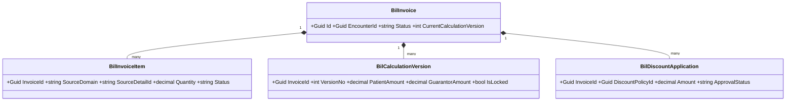


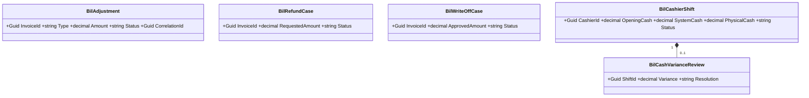

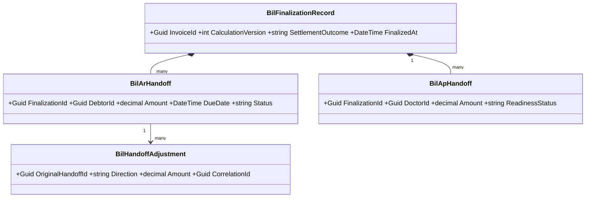

## Class dan lokasi target

| Class | Konsep | Status | Lokasi file target | Tanggung jawab |
| --- | --- | --- | --- | --- |
| `BilInvoice`, `BilInvoiceItem`, `BilCalculationVersion`, `BilDiscountApplication` | `BIL-CPT-001`–`005`,`009` | Baru | `Areas/HealthServices/BillingManagement/Billing/Models/` | Aggregate charge dan kalkulasi |
| `BilDepositAccount`, `BilDepositMovement` | `BIL-CPT-012`–`013` | Baru | `.../Billing/Models/` | Ledger dana pasien |
| `BilSettlement`, `BilTender`, `BilPaymentAllocation`, `BilRefundableCredit` | `BIL-CPT-014`–`017` | Baru | `.../Billing/Models/` | Penerimaan dan alokasi dana |
| `BilAdjustment`, `BilRefundCase`, `BilWriteOffCase` | `BIL-CPT-006`,`025`,`026` | Baru | `.../Billing/Models/` | Exception append-only |
| `BilCashierShift`, `BilCashVarianceReview` | `BIL-CPT-027`–`028` | Baru | `.../Cashier/Models/` | Kontrol shift dan variance |
| `BilFinalizationRecord`, `BilArHandoff`, `BilApHandoff`, `BilHandoffAdjustment` | `BIL-CPT-018`,`019`,`029`,`030` | Baru | `.../Billing/Models/` | Posting dan handoff idempotent |
| `MstAdministrationFeePolicy`, `MstDiscountPolicy`, `MstTaxRule`, `MstRoomChargePolicy` | `BIL-CPT-007`,`008`,`021`,`023` | Baru | `.../MasterData/Models/` | Kebijakan effective-dated |
| `MstPaymentMethod`, `MstBillingItemCategory` | existing | Sudah ada | `.../MasterData/Models/` | Direuse; perubahan hanya bila task terpisah membuktikan perlu |
| `BillingInvoiceService`, `BillingSettlementService`, `BillingExceptionService`, `BillingFinalizationService` | service | Baru | `.../Billing/Services/` | Command/query dan transaction boundary |
| `CashierShiftService` | service | Baru | `.../Cashier/Services/` | Open/close/review/reopen shift |
| `BillingInvoicesController`, `BillingSettlementsController`, `BillingExceptionsController`, `BillingFinalizationsController` | controller | Baru | `.../Billing/Controllers/` | HTTP boundary tipis |
| `CashierShiftsController` | controller | Baru | `.../Cashier/Controllers/` | HTTP boundary tipis |
| Request/response DTO per endpoint | DTO | Baru | folder `Dtos/` di slice terkait | Tidak mengekspos model EF |
| Satu configuration per model | configuration | Baru | folder `Configurations/` terkait | Key, index, precision, FK, concurrency |

Semua adapter eksternal (`EncounterReference`, `ChargeSourceReference`, `OccupancyReference`) adalah interface/read contract, bukan tabel salinan. Field identitas pasien, data klinis, nomor kartu, token provider, dan bukti pembayaran termasuk sensitif; nilainya tidak boleh masuk custom log.

### Penjelasan setiap persisted class

| Class | Status/lokasi | Fungsi khusus |
| --- | --- | --- |
| `BilInvoice` | Baru, `Billing/Models/BilInvoice.cs` | Root satu encounter dan lifecycle finansial |
| `BilInvoiceItem` | Baru, `Billing/Models/BilInvoiceItem.cs` | Charge sumber idempotent, void tanpa delete |
| `BilCalculationVersion` | Baru, `Billing/Models/BilCalculationVersion.cs` | Hasil kalkulasi immutable dan lock |
| `BilDiscountApplication` | Baru, `Billing/Models/BilDiscountApplication.cs` | Bukti policy/approval/effect diskon |
| `BilDepositAccount` | Baru, `Billing/Models/BilDepositAccount.cs` | Saldo dana belum dialokasikan per ranap |
| `BilDepositMovement` | Baru, `Billing/Models/BilDepositMovement.cs` | Ledger top-up/allocation/release/reversal |
| `BilSettlement` | Baru, `Billing/Models/BilSettlement.cs` | Kelompok penerimaan dana untuk satu tujuan |
| `BilTender` | Baru, `Billing/Models/BilTender.cs` | Attempt per metode pembayaran |
| `BilPaymentAllocation` | Baru, `Billing/Models/BilPaymentAllocation.cs` | Penerapan dana sukses ke target |
| `BilRefundableCredit` | Baru, `Billing/Models/BilRefundableCredit.cs` | Saldo kredit yang boleh dikembalikan |
| `BilAdjustment` | Baru, `Billing/Models/BilAdjustment.cs` | Koreksi debit/credit append-only |
| `BilRefundCase` | Baru, `Billing/Models/BilRefundCase.cs` | Workflow refund metode asal |
| `BilWriteOffCase` | Baru, `Billing/Models/BilWriteOffCase.cs` | Workflow penghapusan AR parsial/penuh |
| `BilCashierShift` | Baru, `Cashier/Models/BilCashierShift.cs` | Root kas fisik/system per shift |
| `BilCashVarianceReview` | Baru, `Cashier/Models/BilCashVarianceReview.cs` | Review selisih dan otorisasi reopen |
| `BilFinalizationRecord` | Baru, `Billing/Models/BilFinalizationRecord.cs` | Bukti final satu calculation version |
| `BilArHandoff` | Baru, `Billing/Models/BilArHandoff.cs` | Basis posting AR per debtor |
| `BilApHandoff` | Baru, `Billing/Models/BilApHandoff.cs` | Basis AP dokter dan readiness |
| `BilHandoffAdjustment` | Baru, `Billing/Models/BilHandoffAdjustment.cs` | Koreksi handoff tanpa mengubah posting lama |
| `MstAdministrationFeePolicy` | Baru, `MasterData/Models/MstAdministrationFeePolicy.cs` | Fee effective-dated dan replacement |
| `MstDiscountPolicy` | Baru, `MasterData/Models/MstDiscountPolicy.cs` | Eligibility dan approval diskon |
| `MstTaxRule` | Baru, `MasterData/Models/MstTaxRule.cs` | Basis/rate/rounding/alokasi pajak |
| `MstRoomChargePolicy` | Baru, `MasterData/Models/MstRoomChargePolicy.cs` | Periode/minimum/rounding kamar |

Setiap baris di atas memiliki configuration bernama `<Class>Configuration.cs` di `Configurations/` konteks yang sama. DTO tidak satu-per-model: request/response dibentuk per endpoint agar tidak membocorkan entity EF.

## Arsitektur folder target

```text
Areas/HealthServices/BillingManagement/
├── Billing/
│   ├── Controllers/                 # Baru
│   ├── Dtos/                        # Baru
│   ├── Models/                      # Baru: BilInvoice sampai BilHandoffAdjustment
│   ├── Configurations/              # Baru: satu per entity
│   ├── Services/                    # Baru: interface + module service
│   └── Integrations/                # Baru: producer, AR, AP adapters/outbox contract
├── Cashier/
│   ├── Controllers/ Dtos/ Models/ Configurations/ Services/  # Baru
└── MasterData/
    ├── Models/                      # Existing + master policy baru
    ├── Controllers/ Dtos/           # Existing; endpoint policy direncanakan
    └── Configurations/ Services/    # Configuration baru; service untuk master baru
Repositories/ApplicationDbContext.cs # Diperbarui: DbSet/config registration
Migrations/                          # Diperbarui hanya oleh task migrasi berizin
```

## Status model dan dampak migration

| Kelompok | Status | Dampak |
| --- | --- | --- |
| 19 entitas `Bil*` pada diagram/kamus | Baru | Tabel, FK, UK, index, decimal precision, optimistic concurrency |
| 4 master policy | Baru | Tabel effective-dated dan seed minimum |
| `MstPaymentMethod`, `MstBillingItemCategory` | Sudah ada | Tidak ada perubahan dalam blueprint ini |
| `ApplicationDbContext` | Diperbarui | Registrasi DbSet/configuration |
| Tabel pasien/encounter/order/pharmacy/occupancy/AR/AP | Sudah ada/eksternal | Tidak dimigrasikan oleh Billing |

## Rencana migration, backfill, dan rollback

1. Tambahkan master policy dan seed nonaktif/draft; belum mengubah jalur produksi.
2. Tambahkan tabel invoice/item/calculation beserta unique filtered index sumber aktif.
3. Tambahkan deposit/settlement/tender/allocation, kemudian exception dan cashier shift.
4. Tambahkan finalization/handoff/outbox serta index idempotency/correlation.
5. Daftarkan adapter producer dalam mode observasi; rekonsiliasi jumlah sumber vs calon billing item.
6. Backfill hanya encounter terbuka yang disetujui Finance/Billing. Data legacy tidak dianggap benar otomatis; simpan `LegacyReference` dan laporan rekonsiliasi.
7. Aktifkan per jenis layanan secara bertahap. Tidak memerlukan downtime bila migration hanya additive dan index besar dibuat melalui strategi DB yang disetujui DBA.

Rollback aplikasi mematikan feature flag dan kembali ke jalur lama; tabel baru tidak langsung di-drop. Posting yang sudah terjadi dikompensasi, bukan dihapus. Rollback schema hanya setelah ekspor rekonsiliasi, tidak ada consumer aktif, dan persetujuan DBA/Finance. Nomor bisnis dibuat oleh service/sequence yang aman—dilarang `Count+1`, `Max+1`, atau dibuat controller.

## Data master awal

| Master | Isi minimum | Sumber/owner |
| --- | --- | --- |
| `MstAdministrationFeePolicy` | Rajal/IGD/OTC dan ranap; nominal tetap; sekali per pasien per hari Asia/Jakarta; replacement rajal→ranap; coverage flag; tanpa diskon | Finance, konfigurasi IT |
| `MstDiscountPolicy` | Promo total/item; target patient portion; periode, eligibility, limit; doctor-share approval | Finance dan Dokter |
| `MstTaxRule` | Basis setelah diskon item, rate, rounding, allocation patient/guarantor, effective dates | Finance/Tax |
| `MstRoomChargePolicy` | 24 jam/minimum/pembulatan/tarif awal periode/leave rule | Inpatient + Finance/contract |
| `MstPaymentMethod` | Tunai, QRIS, transfer/provider aktif dan reconciliation capability | Existing master, Treasury |
| `MstBillingItemCategory` | Tindakan, penunjang, farmasi, kamar, administrasi, jasa dokter | Existing master, Billing |

Nilai nominal, warna/status display, rate, rounding, dan limit tidak boleh di-hardcode di controller atau frontend.

## Yang sengaja tidak dibuat

| Yang ditolak | Alasan |
| --- | --- |
| `BilPatient` / `BilEncounter` | Ownership berada di Patient/Registration; cukup referensi |
| Salinan order/lab/radiologi/resep/occupancy | Producer adalah source of truth; Billing menyimpan source tuple dan snapshot finansial |
| `BilAccountsReceivable` / `BilAccountsPayable` | Lifecycle setelah handoff dimiliki AR/AP |
| `PaymentInProgressInvoice` terpisah | Rawat inap tetap OPEN dengan progress allocation; lock final baru saat finalisasi |
| Mutasi/delete posting historis | Koreksi wajib adjustment/reversal append-only |
| PPN global/hardcoded | Tax mengikuti rule effective-dated |
| Late charge | Keputusan menyatakan seluruh biaya harus dicatat sebagai charge biasa |
| Supervisor approval untuk item sebelum bayar | Tidak disyaratkan; audit actor tetap wajib |

## Security, privacy, exception, dan concurrency

Permission bersifat deny-by-default dan dirinci di matriks permission. Command finansial memakai idempotency key, row-version/optimistic concurrency, reason code, actor, waktu Asia/Jakarta, dan before/after non-sensitif. Provider timeout menghasilkan status `PENDING`, bukan dianggap gagal atau sukses. Conflict mengembalikan pesan agar pengguna memuat ulang; retry dengan key sama harus mengembalikan hasil yang sama.

Exception utama: OTC belum lunas tidak boleh release tindakan; departure kematian/transfer darurat/DAMA boleh administratif dengan debtor sah; keluarga dapat menjadi payer/debtor; rejected insurance claim tidak otomatis dialihkan ke pasien; post-final correction memerlukan Finance approval dan debit/credit handoff adjustment.

## Trace dan approval

Kontrak detail ada di [`contracts/`](./contracts/api-contract.md), ERD di [`erd/`](./erd/00-context-erd.md), dan test di [`testing/acceptance-test-matrix.md`](./testing/acceptance-test-matrix.md). Implementasi baru boleh direncanakan setelah Product/Domain, API, Security, Frontend, Finance/AR/AP menyetujui revision ini.

## Amendment 2 September 2026 — Entri manual berbasis katalog tarif + coverage per item

> Status **approved** (Product/Domain Owner, 2 September 2026 13:53 WIB — "approval eksplisit sekarang untuk BKC-DEC-059–062"). Input: keputusan `BKC-DEC-059`–`062` (`00-interview-decisions.md`), impact scan § 16 (`01-existing-capability-map.md`). Backend SHA diaudit `17b9c0e21e32b41a8dfd6dbde31462d52717646b`, frontend SHA `60febdcdbb39de6cebc2d825906bce949f3b5af3`. Catatan wewenang pada `BKC-DEC-062` tetap berlaku (amendemen sebagian `BKC-DEC-042` tanpa konfirmasi terpisah Payer/Insurance+Finance/AR) — lihat `00-interview-decisions.md`.

### Tujuan dan batas amendment ini

Mengganti entri item pada form "Buat Invoice Manual (Testing)" dari free-text/free-price menjadi terikat katalog `MstTariff`, menambah preview coverage per item untuk pasien asuransi, dan menyelaraskan sebagian perilaku mesin coverage kalkulasi invoice (`BKC-DEC-062`). Panel "Tambah Biaya Lain-lain" pada Menu Pembayaran (`BKC-DEC-047`) **TIDAK** disentuh. Trace: `BKC-DEC-059`–`062`, CAP-01–CAP-08 (impact scan § 16).

### Ringkasan keputusan arsitektur untuk conflict § 16.2.A

Dua mesin coverage (`RegistrationBillingCoverageAdapter` milik Billing dan `InsuranceCoverageService` milik Clinical Management) TETAP terpisah pada amendment ini — tidak disatukan. Pembagian tanggung jawab:

| Kebutuhan | Mesin yang dipakai | Alasan |
| --- | --- | --- |
| Preview coverage per item pada dropdown (advisory, sebelum item ditambahkan) | `InsuranceCoverageService.ResolveTariffAsync` (Clinical Management, direuse) | Sudah mensyaratkan `MstInsuranceTariff` dan sudah memperlakukan flag approval sebagai info, bukan gating — persis kebutuhan `BKC-DEC-060` tanpa kode baru |
| Kalkulasi resmi invoice di Menu Pembayaran (otoritatif, dipakai penagihan) | `RegistrationBillingCoverageAdapter` (Billing, tetap pemilik) | Ownership kalkulasi finansial tetap di Billing; hanya gating approval yang dipersempit sesuai `BKC-DEC-062` |

Konsekuensi yang **MUST** disadari: badge preview bisa saja optimistis dibanding angka final Menu Pembayaran untuk kasus yang gate-nya berbeda (`MstInsuranceTariff` tidak dicek oleh `RegistrationBillingCoverageAdapter`). Ini bukan bug — didokumentasikan sebagai keterbatasan yang disengaja, dengan mitigasi berupa disclaimer UI (lihat amendment frontend). Menyatukan kedua mesin adalah keputusan cross-module terpisah, **di luar scope** amendment ini (lihat "Yang sengaja tidak dibuat").

### Kepemilikan data — baris baru

| Kelompok data | Modul pemilik | Dipakai modul ini | Dibuat ulang |
| --- | --- | :---: | --- |
| Tarif layanan (`MstTariff`, `MstTariffCategory`) | Health Services Master Data | Ya | Tidak; sudah direferensikan `BilInvoiceItem.CategoryId` sejak awal, kini ditambah `TariffId` |
| Resolusi coverage per tarif (`InsuranceCoverageService.ResolveTariffAsync`) | Clinical Management | Ya | Tidak; dipanggil langsung sebagai service dalam proses yang sama (bukan HTTP terpisah — modular monolith, satu assembly) |
| Kontrak tarif asuransi (`MstInsuranceTariff`), rule coverage (`MstInsuranceCoverageRule`) | Health Services Master Data (dikonsumsi `InsuranceCoverageService`) | Ya, tidak langsung (lewat `InsuranceCoverageService`) | Tidak |

### Class diagram — perubahan

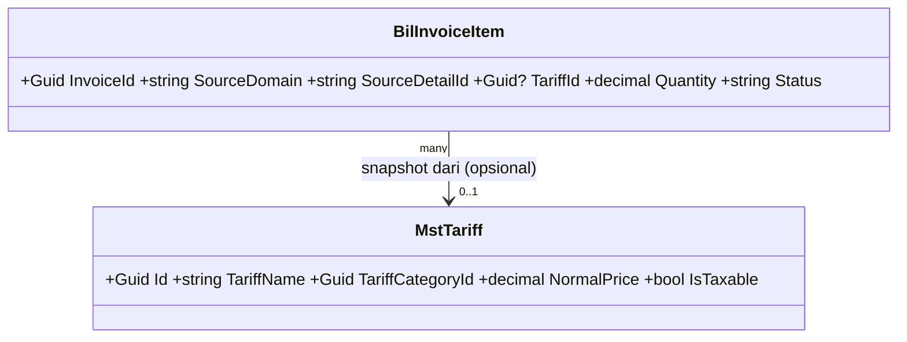

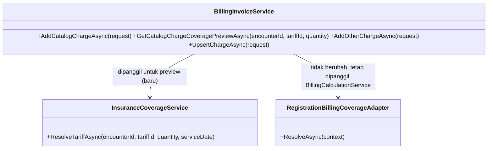

### Penjelasan class yang berubah/baru

| Class | Status | Lokasi file | Tanggung jawab |
| --- | --- | --- | --- |
| `BilInvoiceItem.TariffId` | Diperbarui (kolom baru) | `Areas/HealthServices/BillingManagement/Billing/Models/BilInvoiceItem.cs` | FK opsional ke `MstTariff` yang dipakai saat entri berasal dari katalog; `null` untuk item lama/free-form (adhoc bebas, klinis tanpa tarif eksplisit) |
| `AddCatalogChargeRequest` | Baru | `Areas/HealthServices/BillingManagement/Billing/Dtos/BillingInvoiceDtos.cs` | Request entri katalog: `EncounterId`, `TariffId`, `Quantity`, `CorrelationId`, `CausationId` — **TIDAK punya field harga/kategori/deskripsi**, seluruhnya diturunkan server-side dari `MstTariff` (menegakkan `BKC-DEC-059`/A.3 secara struktural, bukan hanya validasi) |
| `CatalogChargeCoveragePreviewResponse` | Baru | `Areas/HealthServices/BillingManagement/Billing/Dtos/BillingInvoiceDtos.cs` | Response preview: `TariffId`, `TariffName`, `CoverageStatus` (`Covered`/`PartiallyCovered`/`NotCovered`/`NeedApproval`/`SelfPay`), `CoveragePercent`, `HospitalUnitPrice`, `ContractUnitPrice`, `EstimatedCoveredAmount`, `EstimatedPatientAmount`, `IsNeedApproval`, `IsNeedGuaranteeLetter`, `Warnings`. Field `Estimated*` diberi awalan eksplisit karena BUKAN angka final — angka final tetap dari `RegistrationBillingCoverageAdapter` saat kalkulasi invoice |
| `BillingInvoiceService.AddCatalogChargeAsync` | Baru (method) | `Areas/HealthServices/BillingManagement/Billing/Services/BillingInvoiceService.cs` | Pola sama seperti `AddOtherChargeAsync` existing: lookup `MstTariff` aktif+efektif by Id, ambil `NormalPrice`+`TariffCategoryId`+`TariffName`, build `UpsertChargeRequest` dengan `SourceDomain="ADHOC_CATALOG"`, `TariffId` diisi, lalu delegasikan ke `UpsertChargeAsync` yang sudah ada (idempotensi/locking/invoice-upsert direuse penuh) |
| `BillingInvoiceService.GetCatalogChargeCoveragePreviewAsync` | Baru (method) | sama | Validasi encounter+tarif, panggil `InsuranceCoverageService.ResolveTariffAsync` (constructor injection baru), map `InsuranceCoverageResult` → `CatalogChargeCoveragePreviewResponse`. Read-only, tanpa side effect, tanpa transaksi |
| `BillingInvoiceService` (constructor) | Diperbarui | sama | Tambah dependency `InsuranceCoverageService` (`AddScoped`, sudah terdaftar untuk Clinical Management — injeksi lintas Area valid karena satu assembly/proses, konsisten dengan pola `RegistrationBillingCoverageAdapter` yang sudah membaca tabel Registration langsung) |
| `BillingInvoiceService.GetActiveEncounterOptionsAsync` | Diperbarui | sama | Tambah proyeksi `ServiceUnitId`, `ClinicId`, `PatientClassId` dari `TrxPatientEncounter` yang sudah dimuat — tidak perlu join baru |
| `ActiveEncounterOptionResponse` | Diperbarui | `Areas/HealthServices/BillingManagement/Billing/Dtos/BillingInvoiceDtos.cs` | Tambah field `ServiceUnitId` (`Guid`), `ClinicId` (`Guid?`), `PatientClassId` (`Guid?`) — dipakai FE untuk memfilter `GET Tariff/options` (`BKC-DEC-061`) |
| `BillingInvoicesController` | Diperbarui | `Areas/HealthServices/BillingManagement/Billing/Controllers/BillingInvoicesController.cs` | Tambah 2 action: `POST catalog-charges`, `GET catalog-charges/coverage-preview` |
| `BillingChargeSourceAdapter.SourcePolicies` | Diperbarui | `Areas/HealthServices/BillingManagement/Billing/Services/BillingChargeSourceAdapter.cs` | Tambah entri `["ADHOC_CATALOG"] = Policy(["ADDED"], ["ADDED"], ["VOIDED"], completeOnEntry: true)` — policy identik `"ADHOC"`, domain baru murni untuk keterlacakan (§ 16.2.B), bukan perilaku baru |
| `RegistrationBillingCoverageAdapter.ResolveAsync` | Diperbarui | `Areas/HealthServices/BillingManagement/Billing/Services/BillingCoverageAdapter.cs` | Persempit kondisi gating: `rule.IsNeedApproval`/`rule.IsNeedGuaranteeLetter` **TIDAK LAGI** memindahkan komponen ke `unresolved` selama `rule.CoverageStatus == "Covered"`. `CoverageStatus == "NeedApproval"` dan `MaxAmountPerMonth`/`MaxQuantityPerMonth` **TETAP** menjadi gate (belum dikonfirmasi user untuk dilepas — lihat pertanyaan terbuka `04-prd-to-mvp.md`) |

### Arsitektur folder — perubahan

```text
Areas/HealthServices/BillingManagement/Billing/
├── Models/
│   └── BilInvoiceItem.cs                 # Diperbarui: +TariffId
├── Dtos/
│   └── BillingInvoiceDtos.cs             # Diperbarui: +AddCatalogChargeRequest, +CatalogChargeCoveragePreviewResponse, +3 field ActiveEncounterOptionResponse
├── Services/
│   ├── BillingInvoiceService.cs          # Diperbarui: +2 method, +dependency InsuranceCoverageService
│   └── BillingChargeSourceAdapter.cs     # Diperbarui: +policy ADHOC_CATALOG
│   └── BillingCoverageAdapter.cs         # Diperbarui: gating dipersempit
└── Controllers/
    └── BillingInvoicesController.cs      # Diperbarui: +2 action
Repositories/Configurations/HealthServices/BillingManagement/Billing/
└── BilInvoiceItemConfiguration.cs        # Diperbarui: FK TariffId, index, DeleteBehavior.Restrict
Migrations/
└── <timestamp>_AddTariffIdToBilInvoiceItem.cs   # Baru
```

### Status model dan dampak migration

| Kelompok | Status | Dampak |
| --- | --- | --- |
| `BilInvoiceItem.TariffId` | Diperbarui | Kolom baru `Guid?`, FK ke `MstTariff` (`Restrict`), index non-unique (bukan bagian UK source tuple) |
| `MstTariff`, `MstTariffCategory`, `MstInsuranceCoverageRule`, `MstInsuranceTariff` | Sudah ada | Tidak ada perubahan skema; hanya dibaca |

### Rencana migration, backfill, dan rollback

1. Tambah kolom `TariffId` (`nullable`) pada `BilInvoiceItem` beserta FK `Restrict` dan index — migration tunggal, additive, tanpa downtime (kolom nullable, tidak mengunci baris existing).
2. Tidak perlu backfill: baris lama sah tetap `TariffId = null` (item lama memang bukan hasil entri katalog).
3. Registrasi `SourcePolicies["ADHOC_CATALOG"]` dan endpoint baru adalah perubahan kode, dideploy bersamaan dengan migration di atas.
4. Rollback: turunkan migration (drop kolom+FK+index) aman selama tidak ada baris yang sudah mengisi `TariffId` — jika sudah ada, exporting dulu sebelum drop. Rollback kode (nonaktifkan 2 endpoint baru) tidak memerlukan rollback schema karena kolom nullable tidak dibaca oleh jalur lama.

### Data master awal

Tidak ada tabel master baru. Fitur ini **BERGANTUNG** pada `MstTariff`, `MstTariffCategory`, `MstInsuranceCoverageRule`, dan `MstInsuranceTariff` sudah terisi data nyata — tanpa itu dropdown item kosong dan preview coverage selalu `SelfPay`/`NotCovered`. Pengisian data master ini **di luar scope** amendment (tanggung jawab operasional/Finance/Insurance Owner yang sudah berjalan sebelum amendment ini).

### Yang sengaja tidak dibuat (tambahan)

| Yang ditolak | Alasan |
| --- | --- |
| Menyatukan `RegistrationBillingCoverageAdapter` dan `InsuranceCoverageService` jadi satu mesin | Perubahan cross-module besar (menyentuh SEMUA invoice, bukan cuma form ini) yang belum diminta/diputuskan user — lihat § 16.2.A. Dicatat sebagai pertanyaan terbuka, bukan dikerjakan diam-diam |
| Menambah gate `MstInsuranceTariff` ke `RegistrationBillingCoverageAdapter` | Sama seperti di atas — mengubah kalkulasi resmi seluruh invoice tanpa keputusan eksplisit |
| Melepas gating `MaxAmountPerMonth`/`MaxQuantityPerMonth` pada `RegistrationBillingCoverageAdapter` | User hanya mengonfirmasi soal flag approval ("ga perlu approval"), belum soal limit bulanan — tetap gating sampai dikonfirmasi eksplisit |
| Endpoint HTTP baru di Clinical Management untuk `ResolveTariffAsync` | Tidak perlu — pemanggilan lintas Area cukup lewat DI dalam proses yang sama (modular monolith), konsisten pola `RegistrationBillingCoverageAdapter` yang sudah membaca tabel Registration langsung |
| Menghapus `addAdhocBillingCharge`/endpoint `from-source` free-category lama dari jalur form testing | Endpoint `from-source` tetap dipakai domain lain (klinis); thunk FE `addAdhocBillingCharge` menjadi tidak terpakai oleh form ini setelah amendment tapi TIDAK dihapus pada task ini — pembersihan kode mati adalah task cleanup terpisah, di luar scope (`AGENTS.md`: jangan cleanup tidak terkait) |
| Kolom snapshot `InsuranceCoverageRuleId` pada `BilInvoiceItem` | `BKC-DEC-013` (approved) sudah menyatakan coverage dihitung ulang live, bukan snapshot saat entri — menyimpannya di item hanya menambah kolom yang tidak pernah jadi source of truth |

### Security, privacy, exception, dan concurrency — tambahan

`GET catalog-charges/coverage-preview` adalah read-only tanpa command/idempotency key. `POST catalog-charges` mengikuti pola idempotency yang sama dengan `POST from-source`. Response preview **MUST NOT** membocorkan detail kontrak asuransi (`MstInsuranceTariff.ContractUnitPrice` boleh tampil sebagai harga, tapi field internal rule seperti `RuleCode`/`ApprovalInstruction` tidak diekspos ke DTO publik). `TariffId` bukan kolom sensitif; `ServiceUnitId`/`ClinicId`/`PatientClassId` pada `ActiveEncounterOptionResponse` juga tidak sensitif (bukan data klinis).

## Amendment 3 September 2026 — Dokumen "Invoice Asuransi" dan pecahan rupiah coverage per item

> Status **draft** (belum di-approve manusia). Input keputusan: `BKC-DEC-065`–`069` (`00-interview-decisions.md`, approved Product/Domain Owner 3 September 2026). Keputusan arsitektur baru pada amendment ini diberi ID `BKC-DES-001`–`BKC-DES-009` — ini keputusan **teknis** dalam wewenang desain, bukan keputusan bisnis baru; masing-masing menunjuk `BKC-DEC-*` yang menjadi dasarnya.
>
> **Impact scan read-only 3 September 2026.** Manifest revision `0.5` mencatat `backend_commit_sha: 17b9c0e2…` dan `frontend_commit_sha: 60febdcd…`. Keduanya sudah bergerak: backend kini `a42b651d7518060dcc5e7df46cb495ef822b57f5`, frontend `00210f9a5fb2f4f69e57b8c90c57c63c788da792`. Commit backend di antaranya (`fec3579`, `5dc874d`, `a42b651`) dan commit frontend (`8a01704`, `00210f9`) adalah pekerjaan modul ini sendiri (`BE-BKC-018`–`021`, `BE-BKC-FIX-001`/`002`, `FE-BKC-014`–`017`, `FE-BKC-FIX-001`–`007`) yang sudah tercatat di `roadmap/requirement-traceability.md` — bukan perubahan pihak lain yang tidak diketahui. Area terdampak amendment ini dibaca ulang langsung dari source pada SHA baru (daftar bukti di § "Bukti as-is" di bawah). Ini **bukan** pengganti `/trace-existing-capabilities`: `01-existing-capability-map.md` belum punya bagian impact scan untuk tanggal ini, dan pembaruannya tetap milik skill itu.

### Tujuan dan batas amendment ini

Menyediakan dua hal yang saling bergantung:

1. **Fondasi kalkulasi** — mesin kalkulasi invoice mengekspos *pecahan rupiah yang ditanggung penjamin per baris biaya*, bukan hanya total per invoice (`BKC-DEC-069`).
2. **Dokumen "Invoice Asuransi"** — satu tab baru pada halaman Dokumen Kasir, milik `billing-kasir` sendiri, memuat identitas pasien, informasi perusahaan asuransi, dan rincian item yang ditanggung asuransi beserta rupiahnya, dapat dicetak dan diunduh (`BKC-DEC-065`–`068`).

**Di luar scope**: konten resmi tab `Claim Letter` (tetap placeholder milik `InsuranceManagement`, `PLANNED`); dukungan `MstCompanyGuarantor` sebagai "perusahaan" pada dokumen ini (`BKC-DEC-067` memilih `MstInsuranceProvider`); perubahan formula coverage apa pun; pembuatan tabel/master baru; perubahan isi Kwitansi maupun Struk Pasien (`BKC-DEC-052`–`058` tetap berlaku).

### Bukti as-is (dibaca langsung pada SHA `a42b651`)

| Fakta yang menjadi dasar desain | Bukti |
| --- | --- |
| Pecahan rupiah tercover per komponen **sudah dihitung** lalu dibuang — hanya total `primary` yang dikembalikan | `Areas/HealthServices/BillingManagement/Billing/Services/BillingCoverageAdapter.cs` — `CalculateCoveredAmount` dipanggil di dalam loop, hasilnya hanya diakumulasi ke variabel lokal `primary`; `BillingCoverageDecision` tidak punya field per komponen |
| Komponen pajak **tidak punya identitas unik** — semua baris pajak item memakai `TaxRuleId` yang sama | `BillingCalculationService.BuildCoverageComponents` membangun `new BillingCoverageComponent(tax.TaxRuleId, "TAX", …)`, sementara `LoadInvoiceTaxRuleAsync` menolak lebih dari satu rule aktif → satu invoice = satu `TaxRuleId` |
| Pembulatan tidak menimbulkan selisih | `CalculateCoveredAmount` sudah `decimal.Round(covered, 2, AwayFromZero)` per komponen; `Money()` (`BillingCalculationService.cs:996`) juga membulatkan ke 2 desimal — jumlah dari angka yang sudah 2 desimal tidak berubah oleh `Money()` |
| `calculation-preview` **hanya bekerja untuk invoice `OPEN`** | `BillingCalculationService.CalculateAsync` melempar `BillingCalculationValidationException("Hanya invoice OPEN yang dapat dihitung ulang.")` sebelum kalkulasi apa pun; `PreviewCalculationAsync` memanggil jalur yang sama dengan `persist: false` |
| Rincian kalkulasi invoice `FINAL`/`CLOSED` hanya tersedia dari snapshot tersimpan | `BilCalculationVersion.BreakdownSnapshot` (`string`, JSON) diisi `JsonSerializer.Serialize(breakdown, …)`; `MapResponse` membacanya kembali lewat `DeserializeBreakdown` |
| Identitas penjamin per kunjungan sudah tersnapshot saat registrasi | `Areas/HealthServices/RegistrationManagement/Models/TrxPatientEncounterGuarantor.cs` — `PaymentType`, `InsuranceProviderId`, `PolicyNumberSnapshot`, `MemberNumberSnapshot`, `PlanNameSnapshot`, `ClassNameSnapshot`, `BenefitPlanCodeSnapshot`, `IsEligible`, `IsPolicyActive` |
| Data perusahaan asuransi tersedia di master | `Areas/Administrator/MasterData/Models/MstInsuranceProvider.cs` — `InsuranceProviderName`, `InsuranceGroupName`, `ProviderType`, `ClaimMethod`, `ContractNumber`, `OfficeAddress` |
| Deskripsi item tidak ada di `CalculationItemResponse` | `BillingInvoiceDtos.cs` — `CalculationItemResponse` hanya memuat `InvoiceItemId`, `CategoryId`, `CategoryCode`, `SourceDomain`, `SourceVersion`, dan nominal; teks item ada di `BilInvoiceItem.DescriptionSnapshot` |
| Frontend hari ini hanya bisa menebak status per baris | `menu-pembayaran-view.jsx` § `getItemCoverageStatus` menyimpulkan "Penjamin"/"Mandiri" dari `breakdown.items[].coverable` **dan** total `subtotalAsuransi > 0` — bukan dari rupiah per baris (perbaikan `FE-BKC-FIX-006`) |

### Keputusan arsitektur amendment ini

| ID | Keputusan | Dasar | Alasan |
| --- | --- | --- | --- |
| `BKC-DES-001` | Pecahan rupiah per baris **diekspos dari perhitungan yang sudah ada**, tidak dihitung ulang dengan logika baru di lapisan lain | `BKC-DEC-069` | Dua jalur perhitungan untuk angka yang sama pasti berbeda pada suatu kasus, dan yang tercetak di dokumen itulah yang akan dianggap salah oleh pihak asuransi. Adapter tetap satu-satunya yang memutuskan berapa yang ditanggung |
| `BKC-DES-002` | Alokasi dikembalikan sebagai daftar beralamat `ComponentKey` (teks), **bukan** `ComponentId` (`Guid`) | bukti as-is baris 2 | `ComponentId` untuk baris pajak adalah `TaxRuleId` yang sama untuk seluruh item pada satu invoice, sehingga tidak dapat dipakai sebagai kunci. Bentuk kunci: `ITEM:{invoiceItemId}`, `TAX:ITEM:{invoiceItemId}`, `ADMINISTRATION_FEE`, `TAX:ADMINISTRATION_FEE`, `ROOM_CHARGE`, `TAX:ROOM_CHARGE` |
| `BKC-DES-003` | Tidak ada tabel, kolom, maupun migration baru. Alokasi per baris ikut tersimpan di dalam JSON `BilCalculationVersion.BreakdownSnapshot` yang sudah ada | `BKC-DEC-069` ("dipersist di `BreakdownSnapshot` atau dihitung ulang?") | `BreakdownSnapshot` sudah menjadi tempat resmi rincian kalkulasi satu versi dan sudah ikut terkunci saat finalisasi. Menambah kolom relasional untuk data yang bentuknya daftar-per-baris berarti tabel baru + migration + backfill, demi informasi yang tidak pernah di-query per baris |
| `BKC-DES-004` | Ketersediaan alokasi ditandai **boolean eksplisit** `CoverageCalculationResponse.IsPerItemAllocationAvailable`, bukan dengan membandingkan teks `ContractVersion` | `BKC-DES-003` | Snapshot lama (ditulis sebelum amendment ini) tidak punya field itu, sehingga deserialisasi mengisinya `false` dengan sendirinya. Dokumen jadi bisa berkata "rincian per baris tidak tersedia untuk tagihan ini" alih-alih menampilkan Rp 0 yang salah dan tidak terlihat salah |
| `BKC-DES-005` | Komponen **non-item** yang tercover (biaya administrasi, biaya kamar) tampil sebagai **baris tersendiri** pada dokumen, bukan disembunyikan atau dititipkan ke item mana pun | `BKC-DEC-069` (pertanyaan komponen non-item) | Keduanya bisa ditanggung penjamin (`MstAdministrationFeePolicy.Coverable`; room charge diperlakukan coverable seperti item biasa). Kalau disembunyikan, jumlah baris dokumen tidak akan sama dengan total yang ditagihkan ke asuransi — dokumen yang tidak menjumlah adalah dokumen yang ditolak |
| `BKC-DES-006` | Pajak **tidak** menjadi baris sendiri; porsi pajak yang tercover dilipat ke baris induknya, dan tetap dapat dibaca terpisah lewat kolom `CoveredTaxAmount` | struktur `ApplyInvoiceTax` yang sudah mengalokasikan pajak proporsional ke setiap komponen | Pembaca dokumen (pasien, RS, asuransi) membaca per layanan, bukan per aturan pajak. Nilainya tetap tidak hilang karena disediakan sebagai kolom |
| `BKC-DES-007` | Dokumen memakai `BilInvoice.InvoiceNumber` sebagai nomor dokumen; **tidak** ada seri nomor baru pada `BilNumberSeries` | catatan `DEV_DISCRETION` pada `BKC-DEC-069` | Dokumen ini bukan `Claim Letter` formal (`BKC-DEC-065`). Seri nomor baru berarti konfigurasi `Prefix`/`ResetPolicy`/`SequenceDigits` baru dan satu titik kegagalan alokasi nomor, tanpa manfaat bisnis yang pernah disebutkan. **Terbuka untuk keberatan pemilik produk** — bila kelak dokumen ini dijadikan dokumen bernomor resmi, pola `AllocateKwitansiNumberAsync` sudah ada dan tinggal ditiru |
| `BKC-DES-008` | Kunjungan tunai dan kunjungan penjamin perusahaan mengembalikan `200` dengan penanda `PayerKind` dan `IsPrintable=false`, **bukan** `422` | `BKC-DEC-067` (Company Guarantor di luar scope) | "Pasien ini bukan pasien asuransi" adalah keadaan bisnis yang normal, bukan kegagalan permintaan. Membalasnya sebagai galat memaksa layar menampilkan pesan merah untuk keadaan yang wajar, dan menyamarkan galat sungguhan |
| `BKC-DES-009` | Informasi polis diambil dari kolom **snapshot** `TrxPatientEncounterGuarantor`, bukan dari `MstPatientInsurance` yang berlaku sekarang | `BKC-DEC-066` (dokumen dipakai tiga pihak) | Dokumen harus dapat dicetak ulang enam bulan kemudian dan menghasilkan lembar yang sama. Bila pasien mengganti polis setelah kunjungan, membaca master terkini membuat cetakan kedua berbeda dari cetakan pertama untuk tagihan yang sama |

### Kepemilikan data — baris baru

| Kelompok data | Modul pemilik | Dipakai modul ini | Dibuat ulang di modul ini |
| --- | --- | :---: | --- |
| Perusahaan asuransi (`MstInsuranceProvider`) | Administrator / Master Data | Ya, hanya dibaca | **Tidak.** Dirujuk lewat `TrxPatientEncounterGuarantor.InsuranceProviderId`; tidak ada salinan nama/alamat perusahaan di tabel `Bil*` |
| Sumber pembayaran kunjungan beserta snapshot polis (`TrxPatientEncounterGuarantor`) | Registration Management | Ya, hanya dibaca | **Tidak.** Sudah dibaca `RegistrationBillingCoverageAdapter` dengan pola yang sama |
| Kartu asuransi pasien (`MstPatientInsurance`) | Patient Management / Master Data | **Tidak** | Tidak — lihat `BKC-DES-009`; dokumen memakai snapshot registrasi |
| Identitas pasien dan kunjungan (`MstPatient`, `TrxPatientEncounter`) | Patient/Registration Management | Ya, hanya dibaca | Tidak. Direuse lewat pola `LoadPatientSummaryAsync` yang sudah ada |
| Aturan coverage (`MstInsuranceCoverageRule`) | Health Services Master Data | Ya, tidak langsung (lewat adapter) | Tidak |
| Rincian kalkulasi per versi (`BilCalculationVersion.BreakdownSnapshot`) | Billing dan Kasir (modul ini) | Ya | Tidak — isinya diperluas, bukan diduplikasi |

Bila kolom snapshot penjamin kosong, dokumen menampilkan `—` dan menambahkan satu peringatan terbaca — **tidak** diam-diam mengambil nilai dari master.

### Class diagram — mesin kalkulasi (perubahan)

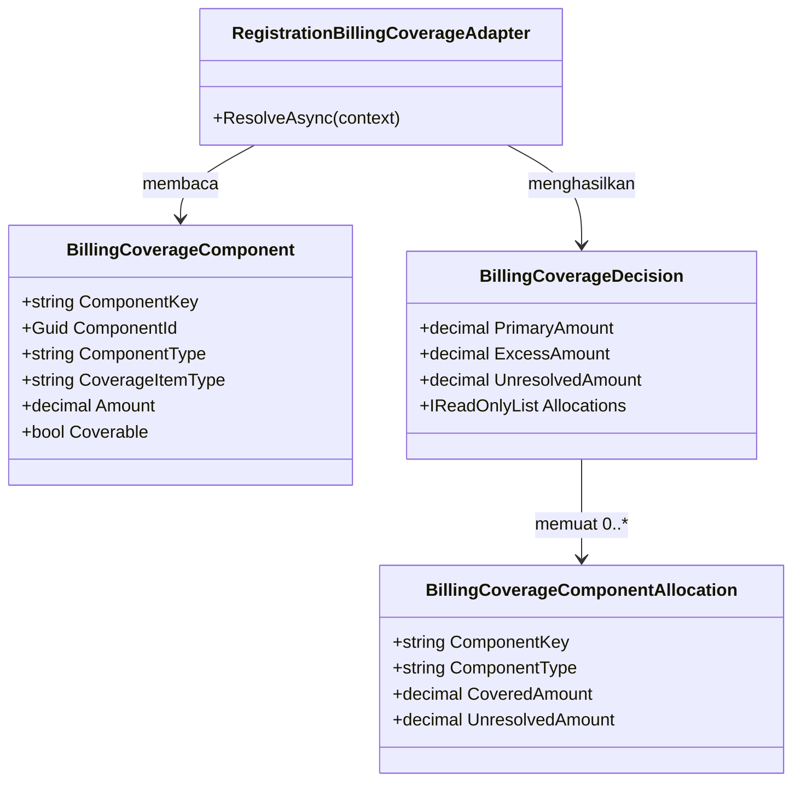

### Class diagram — dokumen Invoice Asuransi (baru)

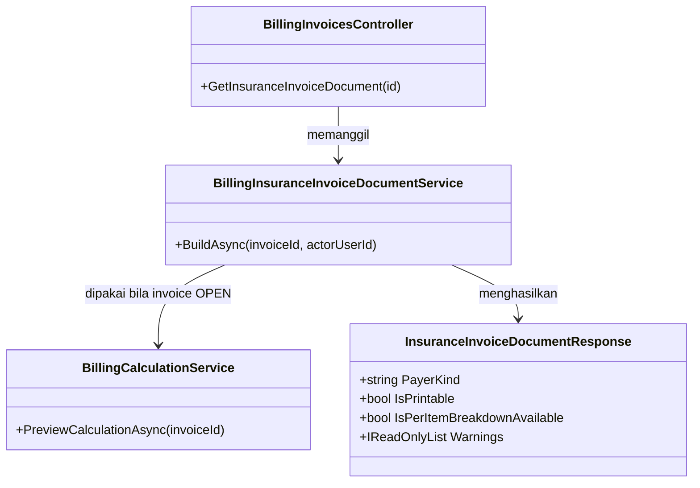

### Penjelasan setiap class yang berubah atau baru

#### `BillingCoverageComponent`

| Aspek | Penjelasan |
| --- | --- |
| **Status** | `Diperbarui` |
| **Lokasi file** | `Areas/HealthServices/BillingManagement/Billing/Services/BillingCoverageAdapter.cs` |
| Kategori | Record kontrak internal antar-service (bukan entity, tidak tersimpan) |
| Tanggung jawab utama | Mewakili satu potongan biaya yang dinilai penjamin: satu item, satu pajak item, biaya administrasi, biaya kamar, atau pajak dari kedua biaya itu |
| Field penting | **Baru:** `string ComponentKey` (parameter pertama). Field lain tidak berubah |
| Navigation property dan relasi | Dibentuk `BillingCalculationService.BuildCoverageComponents`; dikonsumsi `RegistrationBillingCoverageAdapter.ResolveAsync` |
| Pemakaian dalam alur bisnis | Terbentuk setiap kali tagihan dihitung, baik pratinjau maupun versi tersimpan |
| Catatan desain | Ini `record` posisional — menambah satu parameter mengubah **semua** titik pembentukan di `BuildCoverageComponents` (enam titik). Jangan memakai `ComponentId` sebagai kunci alokasi; untuk baris pajak nilainya sama di seluruh item |
| Ekuivalen model lama | — |

#### `BillingCoverageComponentAllocation`

| Aspek | Penjelasan |
| --- | --- |
| **Status** | `Baru` |
| **Lokasi file** | `Areas/HealthServices/BillingManagement/Billing/Services/BillingCoverageAdapter.cs` |
| Kategori | Record kontrak internal antar-service |
| Tanggung jawab utama | Menyimpan hasil keputusan penjamin untuk satu potongan biaya: berapa rupiah ditanggung, dan berapa rupiah yang statusnya belum jelas |
| Field penting | `ComponentKey` (`string`), `ComponentType` (`string`), `CoveredAmount` (`decimal`), `UnresolvedAmount` (`decimal`) |
| Navigation property dan relasi | Dimuat `BillingCoverageDecision.Allocations` |
| Pemakaian dalam alur bisnis | Tidak dilihat pengguna secara langsung; menjadi bahan kolom rupiah per baris pada dokumen Invoice Asuransi |
| Catatan desain | Nominal sudah dibulatkan dua desimal oleh `CalculateCoveredAmount`, jadi **MUST NOT** dibulatkan ulang. `AppliedRuleId` sengaja **tidak** dimasukkan: nomor dan instruksi aturan asuransi tidak boleh sampai ke DTO publik (lihat § Security) |
| Ekuivalen model lama | — |

#### `BillingCoverageDecision`

| Aspek | Penjelasan |
| --- | --- |
| **Status** | `Diperbarui` |
| **Lokasi file** | `Areas/HealthServices/BillingManagement/Billing/Services/BillingCoverageAdapter.cs` |
| Kategori | Record kontrak internal antar-service |
| Tanggung jawab utama | Hasil akhir penilaian penjamin atas satu invoice |
| Field penting | **Baru:** `IReadOnlyList<BillingCoverageComponentAllocation> Allocations` |
| Navigation property dan relasi | Dihasilkan `IBillingCoverageAdapter.ResolveAsync`; dikonsumsi `BillingCalculationService.ApplyCoverageWaterfall` |
| Pemakaian dalam alur bisnis | Setiap perhitungan tagihan |
| Catatan desain | `SelfPay()` dan `Unresolved()` mengembalikan daftar kosong (`[]`), bukan `null`. Pada `Unresolved()` daftar kosong memang benar — di jalur itu tidak ada aturan yang dicocokkan per komponen |
| Ekuivalen model lama | — |

#### `RegistrationBillingCoverageAdapter.ResolveAsync`

| Aspek | Penjelasan |
| --- | --- |
| **Status** | `Diperbarui` |
| **Lokasi file** | `Areas/HealthServices/BillingManagement/Billing/Services/BillingCoverageAdapter.cs` |
| Kategori | Service (adapter) |
| Dipanggil oleh | `BillingCalculationService.CalculateAsync` |
| Membuka transaksi database | Tidak — hanya membaca (`AsNoTracking`) |
| Tanggung jawab utama | Memutuskan berapa yang ditanggung penjamin untuk satu invoice, komponen per komponen |
| Perubahan pada amendment ini | Di dalam loop yang sudah ada, setiap komponen yang selesai dinilai **mencatat** hasilnya ke daftar `allocations` alih-alih hanya menambah ke variabel `primary`/`unresolved`. Empat cabang keluar semuanya mencatat: (1) tidak ada aturan cocok → `covered=0`, `unresolved=Amount`; (2) aturan `NeedApproval` atau ada limit bulanan → `covered=0`, `unresolved=Amount`; (3) aturan `NotCovered` → `covered=0`, `unresolved=Amount` bila `IsAllowExcessPaymentByPatient` bernilai `false`, `0` bila `true`; (4) cabang tercover → `covered` hasil `CalculateCoveredAmount` setelah cap `MaxAmountPerVisit`, `unresolved` sisa residual bila `IsAllowExcessPaymentByPatient` bernilai `false` |
| Catatan desain | **Formula coverage tidak berubah satu baris pun.** Yang berubah hanya "hasil per komponen ikut disimpan, bukan dibuang". Bukti bahwa tidak ada perubahan nominal: `primary` dan `unresolved` yang dikembalikan tetap dihitung dari variabel yang sama seperti sebelumnya. Perubahan ini **MUST NOT** dipakai sebagai kesempatan menyisipkan penyesuaian aturan apa pun |
| Ekuivalen model lama | — |

#### `BillingCalculationService.BuildCoverageComponents`

| Aspek | Penjelasan |
| --- | --- |
| **Status** | `Diperbarui` |
| **Lokasi file** | `Areas/HealthServices/BillingManagement/Billing/Services/BillingCalculationService.cs` |
| Kategori | Service (perhitungan) |
| Dipanggil oleh | `BillingCalculationService.CalculateAsync` |
| Membuka transaksi database | Tidak (method statis murni) |
| Perubahan pada amendment ini | Setiap `new BillingCoverageComponent(...)` diberi `ComponentKey` sesuai pola `BKC-DES-002`. Enam titik: item, pajak item, biaya administrasi, pajak biaya administrasi, biaya kamar, pajak biaya kamar |
| Catatan desain | Kunci **MUST** dibentuk dari `invoiceItemId`, bukan dari urutan baris — urutan berubah bila item di-void atau ditambah, dan kunci berbasis urutan akan menempelkan rupiah ke item yang salah pada snapshot yang dibaca ulang |

#### `BillingCalculationService.ApplyCoverageWaterfall`

| Aspek | Penjelasan |
| --- | --- |
| **Status** | `Diperbarui` |
| **Lokasi file** | `Areas/HealthServices/BillingManagement/Billing/Services/BillingCalculationService.cs` |
| Kategori | Service (perhitungan) |
| Dipanggil oleh | `BillingCalculationService.CalculateAsync` |
| Membuka transaksi database | Tidak |
| Perubahan pada amendment ini | Setelah seluruh pemeriksaan batas yang sudah ada, method ini **membagikan** `decision.Allocations` ke baris keluaran: `CalculationItemResponse` per item (alokasi item digabung dengan alokasi pajak item yang sama), `AdministrationFeeCalculationResponse`, dan `RoomChargeCalculationResponse`. Lalu memeriksa satu invariant baru (`BIL-VAL-028`) dan menyetel `IsPerItemAllocationAvailable = true` |
| Aturan bisnis baru | Jumlah seluruh `CoveredAmount` per baris **MUST** sama dengan `PrimaryAmount + ExcessAmount`. Bila tidak sama, perhitungan dihentikan dengan pesan "Rincian tanggungan penjamin per baris tidak menjumlah ke total tanggungan; hubungi tim teknis." — bukan dibiarkan lolos dengan selisih |
| Catatan desain | Pembulatan **tidak** menimbulkan selisih (§ Bukti as-is baris 3), sehingga invariant ini boleh bersifat mutlak tanpa toleransi. Justru karena tanpa toleransi, setiap pelanggarannya berarti ada bug alokasi — bukan pembulatan yang perlu dimaafkan |

#### `CalculationItemResponse`

| Aspek | Penjelasan |
| --- | --- |
| **Status** | `Diperbarui` |
| **Lokasi file** | `Areas/HealthServices/BillingManagement/Billing/Dtos/BillingInvoiceDtos.cs` |
| Kategori | DTO Response (bagian `CalculationBreakdownResponse`, ikut tersimpan di `BreakdownSnapshot`) |
| Field penting | **Baru:** `CoveredNetAmount` (`decimal`), `CoveredTaxAmount` (`decimal`), `CoveredAmount` (`decimal`), `UnresolvedAmount` (`decimal`), `PatientAmount` (`decimal`) |
| Pemakaian dalam alur bisnis | Menjadi sumber kolom "Ditanggung Asuransi" per baris pada dokumen Invoice Asuransi, dan memungkinkan badge per baris di Menu Pembayaran memakai rupiah sungguhan alih-alih tebakan dari `coverable` |
| Catatan desain | `CoveredAmount = CoveredNetAmount + CoveredTaxAmount`. `PatientAmount = (NetAmount + TaxAmount) − CoveredAmount − UnresolvedAmount`. Seluruh field bertipe nilai non-nullable dengan bawaan `0`, sehingga snapshot lama tetap dapat dideserialisasi — kebenaran nilainya dijaga `IsPerItemAllocationAvailable`, bukan oleh `null` |

#### `AdministrationFeeCalculationResponse` dan `RoomChargeCalculationResponse`

| Aspek | Penjelasan |
| --- | --- |
| **Status** | `Diperbarui` (keduanya) |
| **Lokasi file** | `Areas/HealthServices/BillingManagement/Billing/Dtos/BillingInvoiceDtos.cs` |
| Kategori | DTO Response (bagian `CalculationBreakdownResponse`) |
| Field penting | **Baru pada keduanya:** `CoveredNetAmount`, `CoveredTaxAmount`, `CoveredAmount` |
| Catatan desain | Ini yang menjawab pertanyaan "bagaimana komponen non-item?" pada `BKC-DEC-069`. Keduanya bukan `BilInvoiceItem`, jadi tidak punya baris di `Items` — kolomnya harus menempel di response komponennya sendiri (`BKC-DES-005`) |

#### `CoverageCalculationResponse`

| Aspek | Penjelasan |
| --- | --- |
| **Status** | `Diperbarui` |
| **Lokasi file** | `Areas/HealthServices/BillingManagement/Billing/Dtos/BillingInvoiceDtos.cs` |
| Kategori | DTO Response |
| Field penting | **Baru:** `bool IsPerItemAllocationAvailable` |
| Catatan desain | Bawaan `false` (`BKC-DES-004`). Diisi `true` hanya oleh `ApplyCoverageWaterfall` versi baru. Snapshot lama tidak memuat properti ini di JSON-nya, sehingga otomatis `false` saat dibaca ulang — inilah mekanisme kompatibilitasnya, bukan pengecekan versi |

#### `BillingCalculationContract.Version`

| Aspek | Penjelasan |
| --- | --- |
| **Status** | `Diperbarui` |
| **Lokasi file** | `Areas/HealthServices/BillingManagement/Billing/Dtos/BillingInvoiceDtos.cs` |
| Perubahan | `"BIL-CALCULATION-0.4"` → `"BIL-CALCULATION-0.5"` |
| Catatan desain | Nilai ini ikut tersimpan di dalam JSON snapshot dan berguna untuk investigasi, tetapi **MUST NOT** dipakai program sebagai penentu ketersediaan alokasi. Yang dipakai adalah `IsPerItemAllocationAvailable`; membandingkan teks versi memaksa kode mengetahui semua nilai versi lampau |

#### `BillingInsuranceInvoiceDocumentService`

| Aspek | Penjelasan |
| --- | --- |
| **Status** | `Baru` |
| **Lokasi file** | `Areas/HealthServices/BillingManagement/Billing/Services/BillingInsuranceInvoiceDocumentService.cs` |
| Kategori | Service |
| Dipanggil oleh | `BillingInvoicesController.GetInsuranceInvoiceDocument` |
| Membuka transaksi database | **Tidak** — seluruhnya baca (`AsNoTracking`), tanpa `Idempotency-Key`, tanpa penulisan apa pun |
| Tanggung jawab utama | Menyusun satu lembar dokumen Invoice Asuransi: identitas pasien, blok perusahaan asuransi, daftar baris yang ditanggung asuransi beserta rupiahnya, dan totalnya |
| Field penting (langkah) | 1) muat `BilInvoice` beserta `Items` + `Category`; 2) muat `TrxPatientEncounterGuarantor` aktif kunjungan itu; 3) tentukan `PayerKind` dari `PaymentType`; 4) bila `INSURANCE`, muat `MstInsuranceProvider`; 5) ambil rincian kalkulasi (lihat baris berikut); 6) susun baris dengan `CoveredAmount > 0`; 7) hitung total; 8) susun `Warnings` |
| Sumber rincian kalkulasi | Invoice `OPEN` → `BillingCalculationService.PreviewCalculationAsync` (angka segar, sama dengan yang dilihat kasir di Menu Pembayaran). Invoice `FINAL`/`CLOSED`/`SETTLED_BY_WRITE_OFF` → baris `BilCalculationVersion` dengan `VersionNo == invoice.CurrentCalculationVersion`, dibaca lewat `BillingCalculationService.MapResponse`. **Wajib begitu**, karena `PreviewCalculationAsync` menolak invoice non-`OPEN` (§ Bukti as-is baris 4) |
| Pemakaian dalam alur bisnis | Saat kasir membuka tab "Invoice Asuransi" pada halaman Dokumen Kasir, lalu menekan Cetak/Unduh |
| Catatan desain | Penyaringan "hanya item yang ditanggung asuransi" (`BKC-DEC-068`) **MUST** dikerjakan di sini, bukan di browser: layar yang menyaring sendiri berarti dua tempat memutuskan item mana yang ditanggung, dan yang tercetaklah yang dikirim ke pihak asuransi. Service ini **MUST NOT** menghitung ulang coverage — hanya membacakan hasil |
| Ekuivalen model lama | — |

#### DTO baru untuk dokumen

Seluruhnya pada `Areas/HealthServices/BillingManagement/Billing/Dtos/BillingInsuranceInvoiceDtos.cs` (**file baru** — dipisahkan dari `BillingInvoiceDtos.cs` yang sudah sekitar 460 baris, agar kontrak dokumen tidak bercampur dengan kontrak transaksi).

| DTO | Jenis | Field |
| --- | --- | --- |
| `InsuranceInvoiceDocumentResponse` | Response | `InvoiceId`, `DocumentNumber` (= `InvoiceNumber`, `BKC-DES-007`), `InvoiceNumber`, `InvoiceStatus`, `ServiceType`, `InvoiceDate`, `PayerKind`, `IsPrintable`, `IsFromLockedSnapshot`, `IsPerItemBreakdownAvailable`, `CalculationVersionNo`, `CalculationContractVersion`, `CalculatedAt`, `Patient`, `Payer`, `Items`, `Totals`, `Warnings` |
| `InsuranceInvoicePatientResponse` | Response | `MedicalRecordNumber`, `FullName`, `Gender`, `AgeText`, `EncounterNumber`, `EncounterDate`, `EncounterType`, `ServiceUnitName`, `RoomName`, `PatientClassName` |
| `InsuranceInvoicePayerResponse` | Response | `InsuranceProviderName`, `InsuranceGroupName`, `ProviderType`, `ClaimMethod`, `ContractNumber`, `OfficeAddress`, `PolicyNumber`, `MemberNumber`, `PlanName`, `ClassName`, `BenefitPlanCode`, `EffectiveStartDate`, `EffectiveEndDate`, `IsEligible`, `IsPolicyActive` |
| `InsuranceInvoiceItemResponse` | Response | `Kind`, `InvoiceItemId` (`Guid?`), `Description`, `CategoryCode`, `CategoryName`, `Quantity`, `UnitPrice`, `GrossAmount`, `ItemDiscount`, `NetAmount`, `TaxAmount`, `CoveredNetAmount`, `CoveredTaxAmount`, `CoveredAmount`, `PatientAmount` |
| `InsuranceInvoiceTotalResponse` | Response | `EligibleAmount`, `CoveredNetAmount`, `CoveredTaxAmount`, `TotalCoveredAmount`, `PrimaryAmount`, `ExcessAmount`, `UnresolvedCoverageAmount`, `PatientAmount` |
| `InsuranceInvoicePayerKinds` | Konstanta | `Insurance = "INSURANCE"`, `Cash = "CASH"`, `CompanyGuarantor = "COMPANY_GUARANTOR"`, `Unknown = "UNKNOWN"` |
| `InsuranceInvoiceItemKinds` | Konstanta | `Item = "ITEM"`, `AdministrationFee = "ADMINISTRATION_FEE"`, `RoomCharge = "ROOM_CHARGE"` |

**Contoh isi `Items` dan `Totals`.** Kunjungan pasien asuransi (perusahaan samaran "Asuransi Sejahtera Nusantara"). Tiga item: "Konsultasi Dokter Umum" Rp 100.000 (aturan `Covered` 100%), "Fisioterapi" Rp 300.000 (aturan `Covered` 80%), "Vitamin C tablet" Rp 25.000 (tidak ada aturan yang cocok). Biaya administrasi Rp 15.000 dengan `Coverable=true` (aturan `Covered` 100%). Pajak tidak aktif (Rp 0).

| Baris yang tampil | `Kind` | `NetAmount` | `CoveredAmount` | `PatientAmount` |
| --- | --- | --- | --- | --- |
| Konsultasi Dokter Umum | `ITEM` | Rp 100.000 | Rp 100.000 | Rp 0 |
| Fisioterapi | `ITEM` | Rp 300.000 | Rp 240.000 | Rp 60.000 |
| Biaya Administrasi | `ADMINISTRATION_FEE` | Rp 15.000 | Rp 15.000 | Rp 0 |

"Vitamin C tablet" **tidak tampil** karena `CoveredAmount = 0` (`BKC-DEC-068`). `Totals.TotalCoveredAmount = Rp 355.000`, dan angka itu sama persis dengan `PrimaryAmount` pada kalkulasi invoice — inilah invariant `BIL-VAL-028`. Sisa Rp 85.000 (Rp 60.000 kelebihan fisioterapi + Rp 25.000 vitamin) adalah porsi pasien; muncul di Struk Pasien dan Menu Pembayaran, bukan di dokumen ini.

#### `BillingInvoicesController`

| Aspek | Penjelasan |
| --- | --- |
| **Status** | `Diperbarui` |
| **Lokasi file** | `Areas/HealthServices/BillingManagement/Billing/Controllers/BillingInvoicesController.cs` |
| Kategori | Controller |
| Service yang dipakai | Tambah `BillingInsuranceInvoiceDocumentService` pada constructor, di samping `BillingInvoiceService`, `BillingCalculationService`, dan `BillingDiscountService` yang sudah ada |
| Endpoint yang diurus | Tambah satu: `GET {id:guid}/insurance-invoice-document` |
| Atribut akses | `[AccessAction("Read", "Read Insurance Invoice Document", AccessType = AccessTypes.Read, SortOrder = 9)]` dan `[AccessPermission("BillingInvoice", "Read")]` |
| Catatan desain | Grup Swagger tetap `[Tags("Health Services / Billing Management / Billing / Invoices")]` — dokumen ini proyeksi baca satu invoice, bukan resource baru, jadi tidak perlu controller maupun `[AccessController]` baru. `SortOrder = 9` melanjutkan nomor terakhir yang dipakai (`8` pada `calculation-preview`) |

#### `BillingManagementServiceCollectionExtensions`

| Aspek | Penjelasan |
| --- | --- |
| **Status** | `Diperbarui` |
| **Lokasi file** | `Areas/HealthServices/BillingManagement/Billing/BillingManagementServiceCollectionExtensions.cs` |
| Kategori | Registrasi dependency |
| Perubahan | Tambah `services.AddScoped<BillingInsuranceInvoiceDocumentService>();` |
| Catatan desain | Tanpa interface, mengikuti konvensi project: service didaftarkan sebagai kelas konkret dan diinject langsung ke constructor controller |

### Arsitektur folder — perubahan

```text
Areas/HealthServices/BillingManagement/Billing/
├── Dtos/
│   ├── BillingInvoiceDtos.cs                        # Diperbarui: +5 field CalculationItemResponse,
│   │                                                #   +3 field AdministrationFee/RoomCharge,
│   │                                                #   +IsPerItemAllocationAvailable, versi 0.4 -> 0.5
│   └── BillingInsuranceInvoiceDtos.cs               # Baru: 5 DTO + 2 kelas konstanta dokumen
├── Services/
│   ├── BillingCoverageAdapter.cs                    # Diperbarui: +ComponentKey, +Allocation, +Allocations
│   ├── BillingCalculationService.cs                 # Diperbarui: BuildCoverageComponents +ComponentKey;
│   │                                                #   ApplyCoverageWaterfall membagikan alokasi + BIL-VAL-028
│   └── BillingInsuranceInvoiceDocumentService.cs    # Baru
├── Controllers/
│   └── BillingInvoicesController.cs                 # Diperbarui: +1 action GET
└── BillingManagementServiceCollectionExtensions.cs  # Diperbarui: +AddScoped service dokumen
```

Tidak ada perubahan di bawah `Repositories/Configurations/` dan tidak ada berkas baru di `Migrations/` — tidak ada tabel maupun kolom baru (`BKC-DES-003`).

Catatan pola: folder DTO pada submodul ini bernama **`Dtos/`**, berbeda dari `DTOs/` yang dipakai submodul `MasterData` di sebelahnya dan dari pola standar pada aturan struktur backend. Ini penyimpangan yang sudah ada sebelum amendment ini. Berkas baru **MUST** mengikuti `Dtos/` agar konsisten di dalam submodul yang sama; perapian nama folder **MUST** menjadi task tersendiri dengan approval pemilik arsitektur backend, **MUST NOT** dikerjakan menyelip di task ini.

### Status model dan dampak migration

| Kelompok | Status | Dampak dan kolom yang berubah |
| --- | --- | --- |
| `BilInvoice`, `BilInvoiceItem`, `BilCalculationVersion` | `Sudah ada` | **Tidak ada perubahan skema — nol kolom berubah.** Isi kolom `BreakdownSnapshot` (bertipe `string` berisi JSON) menjadi lebih kaya; bentuk kolomnya tidak berubah |
| `TrxPatientEncounterGuarantor`, `MstInsuranceProvider`, `MstPatient`, `TrxPatientEncounter`, `MstTariffCategory`, `MstInsuranceCoverageRule` | `Sudah ada` | Hanya dibaca; tidak ada perubahan |
| Tabel baru | — | **Tidak ada** |
| Kolom baru | — | **Tidak ada** |

### Rencana migration, backfill, dan rollback

1. **Tidak ada migration.** Seluruh perubahan adalah kode dan bentuk JSON di dalam kolom yang sudah ada, sehingga dapat dideploy tanpa mematikan layanan dan tanpa mengunci tabel mana pun.
2. **Tidak ada backfill, dan itu keputusan yang sengaja.** Snapshot yang sudah tersimpan sebelum deploy tetap tidak memuat alokasi per baris. Menulis ulang `BreakdownSnapshot` invoice lama berarti mengubah bukti kalkulasi yang sudah terkunci saat finalisasi — itu justru merusak jejak audit yang kolom itu ada untuk melindunginya.
3. **Akibat yang harus diketahui pengguna.** Untuk tagihan yang sudah `FINAL`/`CLOSED` sebelum deploy, dokumen Invoice Asuransi menampilkan blok identitas, blok asuransi, dan total tanggungan (total memang tersimpan sebagai kolom relasional `BilCalculationVersion.PrimaryAmount`), tetapi **tidak** rincian per baris. Peringatan yang tampil: "Rincian per item tidak tersedia untuk tagihan yang difinalkan sebelum pembaruan sistem ini. Total tanggungan penjamin tetap sah." Tagihan yang masih `OPEN` tidak terpengaruh sama sekali karena angkanya dihitung ulang saat halaman dibuka.
4. **Rollback.** Cukup rollback kode; tidak ada langkah mundur basis data. Field tambahan yang sudah tertulis di dalam JSON snapshot akan diabaikan kode versi lama (`JsonSerializerDefaults.Web` mengabaikan properti yang tidak dikenal), sehingga snapshot yang lahir selama versi baru berjalan tetap dapat dibaca versi lama tanpa galat.
5. **Urutan deploy.** Fondasi kalkulasi (slice backend pertama) **MUST** lebih dulu daripada endpoint dokumen. Endpoint dokumen yang dideploy sendirian akan selalu melaporkan `IsPerItemBreakdownAvailable=false` untuk semua invoice, termasuk yang `OPEN` — terlihat seperti fitur gagal, padahal urutan deploy-nya yang salah.

### Rencana data master awal

Tidak ada tabel master baru, sehingga tidak ada data master baru yang harus dibuat. Yang **MUST** disadari: dokumen ini kosong isinya bila data master berikut belum terisi, dan kekosongan itu bukan bug.

| Master | Isi minimum agar dokumen bermakna | Sumber nilai | Pemilik |
| --- | --- | --- | --- |
| `MstInsuranceProvider` | Minimal satu perusahaan asuransi dengan `InsuranceProviderName`, `ContractNumber`, dan `OfficeAddress` terisi — tiga kolom itulah yang dicetak sebagai blok tujuan dokumen | Kontrak kerja sama RS dengan perusahaan asuransi | Insurance/Finance Owner |
| `MstInsuranceCoverageRule` | Minimal satu aturan `CoverageStatus="Covered"` yang cocok dengan tarif yang benar-benar dipakai kunjungan | Buku tarif/benefit perusahaan asuransi | Insurance/Finance Owner |
| `MstAdministrationFeePolicy` | Kolom `Coverable` diisi sesuai kesepakatan dengan penjamin | Kebijakan billing RS | Billing/Finance Owner |
| `TrxPatientEncounterGuarantor` (bukan master, tapi prasyarat data) | Kolom snapshot polis (`PolicyNumberSnapshot`, `MemberNumberSnapshot`, `PlanNameSnapshot`) terisi saat registrasi | Petugas pendaftaran | Registration Owner |

Tanpa `MstInsuranceCoverageRule` yang cocok, seluruh item jatuh ke `unresolved`, `CoveredAmount` setiap baris nol, dan dokumen tidak punya satu baris pun untuk ditampilkan — dokumen akan menyatakan "Tidak ada item yang ditanggung asuransi pada tagihan ini" dan tombol cetak dimatikan. Pengisian master ini **di luar scope** amendment.

### Yang sengaja tidak dibuat

| Yang ditolak | Alasan |
| --- | --- |
| Tabel `BilInsuranceInvoiceDocument` (menyimpan dokumen yang pernah dicetak) | Tidak ada kebutuhan bisnis yang pernah disebutkan untuk melacak siapa mencetak Invoice Asuransi dan kapan. Dokumen ini proyeksi baca dari data yang sudah tersimpan dan selalu dapat dibentuk ulang. Bila kelak jejak cetak dibutuhkan, itu keputusan baru dengan pemilik Security/Compliance |
| Seri nomor dokumen baru pada `BilNumberSeries` | `BKC-DES-007` — dokumen ini bukan `Claim Letter` formal; nomor invoice sudah unik dan sudah tercetak di Kwitansi maupun Struk Pasien |
| Tabel atau kolom relasional untuk alokasi coverage per baris | `BKC-DES-003` — bentuk datanya daftar-per-versi-kalkulasi yang tidak pernah di-query per baris; `BreakdownSnapshot` sudah tempat resminya |
| Backfill `BreakdownSnapshot` invoice lama | Mengubah bukti kalkulasi yang sudah terkunci merusak jejak audit. Ketidaklengkapan dinyatakan terbuka lewat `IsPerItemBreakdownAvailable` dan peringatan terbaca, bukan ditutupi |
| Mengisi tab `Claim Letter` dengan dokumen ini | `BKC-DEC-065` — slot itu dicadangkan untuk `InsuranceManagement` (`PLANNED`, tanpa wewenang implementasi) |
| Dukungan `MstCompanyGuarantor` (penjamin perusahaan tempat kerja) | `BKC-DEC-067` memilih `MstInsuranceProvider` secara eksplisit. Kunjungan penjamin perusahaan tetap dilayani endpoint dengan `PayerKind="COMPANY_GUARANTOR"` dan `IsPrintable=false` beserta alasan terbaca — bukan galat, bukan pula dokumen setengah benar |
| Membalas `422` untuk kunjungan tunai | `BKC-DES-008` — itu keadaan bisnis normal, bukan kegagalan permintaan |
| Menampilkan `RuleCode`, `RuleName`, `ApprovalInstruction`, atau `BillingInstruction` aturan asuransi | Melanjutkan larangan yang sudah ditetapkan amendment 2 September 2026: field internal aturan tidak diekspos ke DTO publik. Isi aturan adalah kesepakatan komersial RS–asuransi, bukan bagian rincian tagihan pasien |
| Menampilkan `CardNumberSnapshot` (nomor kartu asuransi) | Nomor polis dan nomor anggota sudah cukup bagi pihak asuransi untuk mengenali klaim. Nomor kartu identitas tambahan yang tidak menambah kegunaan dokumen, dan setiap lembar cetak yang beredar memperbesar peluang kebocorannya |
| Menampilkan kontak PIC perusahaan asuransi (`PicName`, `PicPhoneNumber`, `PicEmail`) | Data operasional internal untuk petugas klaim, bukan bagian lembar tagihan. Tidak diminta `BKC-DEC-066`–`069` |
| Menghitung "terbilang" (rupiah dalam huruf) di backend | Frontend sudah punya `utils/terbilang.js` (`terbilangRupiah`) yang dipakai `KwitansiDocument` — menambahkannya di backend berarti dua implementasi untuk hasil yang harus selalu sama |
| Controller atau `[AccessController]` baru untuk dokumen | Dokumen adalah proyeksi baca satu invoice. Menambah resource permission baru berarti seluruh role harus di-remap sebelum fitur bisa dipakai siapa pun |
| Menyatukan `RegistrationBillingCoverageAdapter` dan `InsuranceCoverageService` | Tetap ditolak dengan alasan yang sama seperti amendment 2 September 2026 (§ 16.2.A) — di luar scope, butuh keputusan pemilik kedua modul |
| Merapikan nama folder `Dtos/` menjadi `DTOs/` | Menyentuh source di luar scope task dan berisiko memecah build; harus menjadi task perapian tersendiri |
| Menyimpan hasil dokumen sebagai PDF di server | Pembuatan PDF sudah di browser lewat `html2pdf.js` (`BKC-DEC-063`). Menyimpan berkas di server menambah penyimpanan berisi data pasien tanpa kebutuhan yang pernah disebutkan |

### Security, privacy, exception, dan concurrency — tambahan

**Hak akses.** Satu endpoint baru dengan `[AccessPermission("BillingInvoice", "Read")]`. Tidak ada resource permission baru. Konsekuensi yang **MUST** dinyatakan terbuka: siapa pun yang hari ini boleh membuka Menu Pembayaran satu invoice otomatis boleh mencetak Invoice Asuransi invoice itu. Ini disengaja — dokumen tidak memuat satu pun data yang belum terlihat pengguna itu di Menu Pembayaran, kecuali nama, alamat, dan nomor kontrak perusahaan asuransi, yang merupakan data mitra dan bukan data pasien. Bila Security ingin memisahkan kewenangan cetak dokumen asuransi dari kewenangan baca invoice, itu amendment tersendiri dengan pemilik Security.

**Logging.** `GET` **MUST NOT** dicatat custom logger, mengikuti konvensi project. Akibatnya tidak ada jejak "siapa mencetak dokumen ini" — sudah dicatat sebagai batasan yang diketahui pada tabel "Yang sengaja tidak dibuat".

**Kolom sensitif yang tersentuh.** `PolicyNumberSnapshot`, `MemberNumberSnapshot`, `MedicalRecordNumber`, `FullName`, dan `DescriptionSnapshot`. Seluruhnya **MUST NOT** masuk payload log mana pun. Deskripsi layanan pada dokumen adalah nama tarif administratif (misalnya "Fisioterapi"), bukan diagnosis atau catatan klinis — tetap ditandai sensitif karena rangkaiannya dapat menyiratkan kondisi pasien. Seluruh contoh pada dokumentasi ini memakai data samaran.

**Exception dan jalur tidak normal.**

| Keadaan | Perilaku |
| --- | --- |
| Invoice tidak ditemukan | `404`, "Invoice Billing tidak ditemukan." (mengikuti pola `GetDetail` yang sudah ada) |
| Kunjungan tunai | `200`, `PayerKind="CASH"`, `IsPrintable=false`, peringatan "Kunjungan ini dibayar mandiri, sehingga tidak ada Invoice Asuransi yang dapat diterbitkan." |
| Kunjungan penjamin perusahaan | `200`, `PayerKind="COMPANY_GUARANTOR"`, `IsPrintable=false`, peringatan "Penjamin kunjungan ini adalah perusahaan tempat kerja, bukan perusahaan asuransi. Dokumen ini belum mendukung penjamin perusahaan." |
| Baris penjamin kunjungan tidak ada sama sekali | `200`, `PayerKind="UNKNOWN"`, `IsPrintable=false`, peringatan "Sumber pembayaran kunjungan ini belum tercatat. Lengkapi data penjamin di Registrasi terlebih dahulu." |
| Pasien asuransi, tetapi tidak ada satu pun baris tercover | `200`, `PayerKind="INSURANCE"`, `Items` kosong, `IsPrintable=false`, peringatan "Tidak ada item yang ditanggung asuransi pada tagihan ini." |
| Invoice `OPEN` tetapi belum punya item | `200`, `Items` kosong, `IsPrintable=false`, peringatan yang sama seperti baris di atas |
| Invoice non-`OPEN` dengan snapshot lama (sebelum `BIL-CALCULATION-0.5`) | `200`, `IsFromLockedSnapshot=true`, `IsPerItemBreakdownAvailable=false`, `Items` kosong, `Totals` terisi dari kolom relasional `BilCalculationVersion`, `IsPrintable=false`, peringatan sesuai § Rencana migration butir 3 |
| Kalkulasi pratinjau gagal (misalnya dua tax rule aktif bersamaan) | `422` dengan pesan asli dari mesin kalkulasi. Kegagalan hitung **MUST NOT** ditelan menjadi dokumen kosong — dokumen kosong yang sebenarnya berasal dari kegagalan hitung adalah kesalahan paling mahal di modul ini |
| `InsuranceProviderId` terisi tetapi barisnya tidak ada di master | `200`, blok asuransi berisi `—`, `IsPrintable=false`, peringatan "Data perusahaan asuransi tidak ditemukan pada master. Hubungi admin master data." |

**Concurrency.** Endpoint ini murni baca dan **tidak** memakai `ExpectedRowVersion`. Untuk invoice `OPEN`, isinya bisa berbeda antara satu pembukaan dan pembukaan berikutnya — itu benar, karena tagihan berjalan memang masih berubah. Response menyertakan `CalculationVersionNo` dan `CalculatedAt` agar lembar yang tercetak dapat ditelusuri ke versi kalkulasi mana. Dokumen **SHOULD NOT** dipakai sebagai dasar penagihan formal ke asuransi selama invoice masih `OPEN`; ini dinyatakan sebagai keterbatasan yang diketahui dan bukan dicegah teknis, karena `BKC-DEC-066` menghendaki dokumen dapat dipakai tiga pihak bahkan sebelum finalisasi.

### Trace dan approval

| Aspek | Nilai |
| --- | --- |
| Keputusan bisnis dasar | `BKC-DEC-065`, `066`, `067`, `068`, `069` — approved Product/Domain Owner 3 September 2026 |
| Keputusan arsitektur amendment ini | `BKC-DES-001`–`BKC-DES-009`, status **draft**, dalam wewenang desain, terbuka untuk keberatan pemilik |
| Kontrak terdampak | `BIL-API-0.5`, `BIL-STATE-0.5`, `BIL-VALIDATION-0.5`, `BIL-INTEGRATION-0.5`, `BIL-PERMISSION-0.5`, `BIL-TEST-0.5`, `BIL-CALCULATION-0.5` |
| Acceptance test | `BIL-AT-029`–`BIL-AT-035` (`testing/acceptance-test-matrix.md`) |
| Backend SHA diaudit | `a42b651d7518060dcc5e7df46cb495ef822b57f5` |
| Frontend SHA diaudit | `00210f9a5fb2f4f69e57b8c90c57c63c788da792` |
| Status | **draft** — approval tetap tindakan manusia dan belum diberikan untuk `BKC-DES-*` |

---

## Amendment 4 September 2026 — Pembagian tanggungan penjamin, anomali data, dan gerbang PPN rawat jalan/rawat inap

> Status **draft** (belum di-approve manusia). Masukan keputusan bisnis: `BKC-DEC-070`–`075` (penghapusan bucket "Penjamin Belum Terverifikasi"), `BKC-DEC-076`–`077` (alokasi PPN, dengan `BKC-DEC-076` sebagian `superseded`), dan `BKC-DEC-078`–`079` (gerbang PPN rawat jalan vs rawat inap) — seluruhnya `approved` Product/Domain Owner 4 September 2026 pada `00-interview-decisions.md`. Amendment ini juga **menuntaskan** dua blocker desain yang sengaja ditinggalkan terbuka pada amendment 3 September 2026, yaitu bentuk teknis kategori "anomali data" (`BKC-DEC-073`) dan bentuk kontrak pecahan rupiah per baris (`BKC-DEC-069`).
>
> Keputusan arsitektur baru pada amendment ini diberi ID `BKC-DES-010`–`BKC-DES-020`. Semuanya keputusan **teknis** dalam wewenang desain, bukan keputusan bisnis baru.

### Tujuan dan batas amendment ini

Tiga benang keputusan dirancang bersama karena ketiganya menyentuh satu method yang sama (`RegistrationBillingCoverageAdapter.ResolveAsync`), satu kontrak response yang sama (`BillingCoverageDecision` beserta DTO kalkulasi yang membungkusnya), dan satu pipeline komponen yang sama (`BuildCoverageComponents` → `ApplyInvoiceTax` → `ApplyCoverageWaterfall`). Merancangnya terpisah berarti menyentuh kontrak yang baru saja disetujui sebanyak tiga kali.

1. **Pembagian tanggungan penjamin** — melepas gerbang `NeedApproval`/surat jaminan dan limit bulanan, lalu memastikan sisa jalur yang masih menghasilkan `unresolved` punya nama dan tempat yang benar (`BKC-DEC-070`–`075`).
2. **Kategori anomali data** — precondition penjamin dan encounter tetap diperiksa, tetapi hasilnya berhenti menyamar sebagai "tagihan yang belum jelas siapa penanggungnya" (`BKC-DEC-073`).
3. **Gerbang PPN obat/alkes** — basis pajak ditambah syarat care setting: rawat jalan dan IGD kena PPN, rawat inap dibebaskan sepenuhnya (`BKC-DEC-078`–`079`).

**Di luar scope**: formula `CalculateCoveredAmount` (tidak berubah satu baris pun, `BKC-DEC-070`); jalur "tidak ada rule cocok" dan `NotCovered` sebagai keputusan bisnis (tetap ke pasien, `BKC-DEC-072`); proses verifikasi penjamin di modul Registrasi; isi dan aturan bisnis Kwitansi maupun Struk Pasien; tabel `Claim Letter` milik `InsuranceManagement`.

### Bukti as-is — dibaca langsung pada HEAD `ffeb45a8` beserta working tree

Bagian ini **mengoreksi** sebagian "Bukti as-is" pada amendment 3 September 2026. Sebagian mekanisme yang di sana dirancang sebagai pekerjaan baru ternyata **sudah dikerjakan** di antara kedua tanggal lewat dua task ad-hoc di luar roadmap.

| Fakta yang menjadi dasar desain | Bukti |
| --- | --- |
| **Pecahan rupiah per komponen SUDAH diekspos** — bukan lagi dibuang seperti dicatat amendment sebelumnya | `Areas/HealthServices/BillingManagement/Billing/Services/BillingCoverageAdapter.cs` — record `BillingCoverageComponentOutcome(Guid ComponentId, string ComponentType, decimal PrimaryAmount, decimal UnresolvedAmount)` dan field `BillingCoverageDecision.ComponentOutcomes`. Dikerjakan `BE-BKC-FIX-003` (4 September 2026, ad-hoc, otorisasi eksplisit pengguna) |
| Hasil per komponen sudah disalin balik ke DTO kalkulasi | `BillingCalculationService.CalculateAsync` membangun `outcomeByComponent` ber-kunci `(ComponentId, ComponentType)`, lalu mengisi `CalculationItemResponse.ItemPrimaryAmount`/`ItemUnresolvedAmount`/`TaxPrimaryAmount`/`TaxUnresolvedAmount`, serta `AdministrationFeeCalculationResponse`/`RoomChargeCalculationResponse.PrimaryAmount`/`UnresolvedAmount` |
| Tabrakan identitas komponen pajak per item **sudah diperbaiki** | `BuildCoverageComponents` kini memakai `item.Id` (bukan `tax.TaxRuleId`) sebagai `ComponentId` komponen `"TAX"` milik item — persis masalah yang `BKC-DES-002` hendak selesaikan lewat `ComponentKey` bertipe teks |
| Frontend sudah mengonsumsi angka eksak itu | `menu-pembayaran-view.jsx` — `getItemCoverageStatus` membaca `itemPrimaryAmount`/`itemUnresolvedAmount`/`taxPrimaryAmount`/`taxUnresolvedAmount` per baris; `subtotalAsuransi`, `subtotalMandiri`, `pajakAsuransi`, `pajakMandiri` dijumlah eksak. Dikerjakan `FE-BKC-FIX-008` |
| **Kelima perubahan itu belum di-commit** | `git status --short` pada kedua repository menunjukkan `BillingCoverageAdapter.cs`, `BillingCalculationService.cs`, `BillingInvoiceDtos.cs`, `InsuranceCoverageService.cs`, `menu-pembayaran-view.jsx`, dan `billing-invoice-constants.js` berstatus `M` (modified, belum staged). Laporan `BE-BKC-FIX-003.md` dan `FE-BKC-FIX-008.md` sendiri masih `??` (untracked) |
| Perubahan itu **belum pernah diverifikasi hidup** | `BE-BKC-FIX-003.md` § 4: `AUTOMATED TEST: BLOCKED` (`dotnet build`/`dotnet test` tidak dijalankan atas instruksi pengguna), `MANUAL TEST: BLOCKED` (backend belum di-rebuild) |
| Gerbang `NeedApproval` dan limit bulanan **masih ada** di kode | `BillingCoverageAdapter.cs` — `if (string.Equals(rule.CoverageStatus, "NeedApproval", …) \|\| rule.MaxAmountPerMonth.GetValueOrDefault() > 0 \|\| rule.MaxQuantityPerMonth.GetValueOrDefault() > 0) { unresolved += component.Amount; … }` |
| Jalur "tidak ada rule cocok" masih menulis ke `unresolved`, **bukan** ke pasien | `BillingCoverageAdapter.cs` — cabang `if (rule is null) { unresolved += component.Amount; … }`. Ini menyimpang dari formula `BKC-DEC-062`/`BKC-DEC-072` yang menempatkannya di Subtotal Mandiri |
| Precondition penjamin dan encounter mengembalikan seluruh nilai sebagai `unresolved` | `BillingCoverageAdapter.cs` — `Unresolved(context.Components, "REJECTED")` untuk `!IsEligible`/`!IsPolicyActive`/`InsuranceProviderId` kosong, dan `Unresolved(context.Components, "UNRESOLVED")` untuk encounter tidak ditemukan |
| `IsAllowExcessPaymentByPatient` bernilai bawaan `true` | `Areas/HealthServices/MasterData/Models/MstInsuranceCoverageRule.cs:47` — `public bool IsAllowExcessPaymentByPatient { get; set; } = true;`. Artinya kasus "residual tidak boleh ditagihkan ke pasien" adalah pengecualian yang harus di-set sengaja, bukan keadaan bawaan |
| Basis PPN **tidak pernah melihat care setting** | `BillingCalculationService.ApplyInvoiceTax` hanya menyaring `if (!item.IsPharmacy) continue;`. Tidak ada rujukan ke encounter, unit layanan, kelas pasien, maupun jenis kunjungan di dalam method itu |
| Encounter **sudah dimuat** sebelum pajak dihitung | `BillingCalculationService.CalculateAsync` memuat `encounter` (`TrxPatientEncounters`, `AsNoTracking`) beberapa baris sebelum `LoadInvoiceTaxRuleAsync`/`ApplyInvoiceTax` dipanggil — menambahkan gerbang care setting tidak memerlukan query baru |
| Billing **sudah punya** snapshot care setting miliknya sendiri | `BilInvoice.ServiceType`, diisi `BillingInvoiceService.MapServiceType(encounter.EncounterType)` saat invoice dibuat. Pemetaannya: `Outpatient→"RAJAL"`, `Emergency→"IGD"`, `Inpatient→"RANAP"`, `MedicalCheckup→"MCU"`, `Telemedicine→"TELEMEDICINE"`, selain itu ditolak |
| Snapshot itu **sudah dipakai** sebagai gerbang care setting di method yang sama | `BillingCalculationService.CalculateAsync` — `invoice.ServiceType == AdministrationFeeServiceTypes.Ranap` menentukan apakah biaya kamar dihitung |
| Daftar `AdministrationFeeServiceTypes` **tidak sama** dengan keluaran `MapServiceType` | `AdministrationFeePolicyDtos.cs` memuat `RAJAL`, `IGD`, `OTC`, `RANAP` — `MCU` dan `TELEMEDICINE` diproduksi `MapServiceType` tetapi tidak ada di daftar itu, sedangkan `OTC` ada di daftar tetapi tidak pernah diproduksi `MapServiceType`. Ini ketidakselarasan yang sudah ada sebelum amendment ini |
| Mekanisme alokasi pajak per payer sudah lengkap | `TaxComponentCoverable(string? allocationRule, bool underlyingCoverable)` — `PATIENT→false`, `GUARANTOR→true`, selain itu (termasuk `PROPORTIONAL`) mengikuti komponen yang dipajaki. `TaxRuleValues.AllocationRules` = `{PROPORTIONAL, PATIENT, GUARANTOR}` |
| Komponen pajak item memakai granularitas rujukan yang sama dengan itemnya | `BuildCoverageComponents` memberi komponen `"TAX"` nilai `tariffId`/`procedureId`/`drugId`/`drugCategoryId`/`tariffCategoryId` yang identik dengan komponen `"ITEM"`-nya — sehingga komponen pajak otomatis dicocokkan aturan asuransi yang sama dan mendapat `CoveragePercent` yang sama |

**Konsekuensi metodologis.** Karena kelima berkas source itu belum di-commit, `backend_commit_sha` pada manifest **tidak** mewakili keadaan yang dibaca desain ini. Manifest revision `0.7` mencatatnya apa adanya sebagai `working_tree_uncommitted`. Ini bukan sekadar kerapian: bila perubahan `BE-BKC-FIX-003` dibuang sebelum implementasi dimulai, sebagian besar amendment ini berubah dari "menyempurnakan yang sudah ada" menjadi "membangun dari nol".

### Keputusan arsitektur amendment ini

| ID | Keputusan | Dasar | Alasan |
| --- | --- | --- | --- |
| `BKC-DES-010` | Kategori "anomali data" memakai **field tersendiri** — `DataAnomalyAmount` beserta daftar kode `AnomalyCodes` — dan **BUKAN** memakai ulang `UnresolvedAmount` dengan makna dipersempit | `BKC-DEC-073`, `BKC-DEC-075` | Satu field yang menampung dua arti berbeda persis itulah penyakit yang hendak disembuhkan `BKC-DEC-075`: "Penjamin Belum Terverifikasi" jadi salah dibaca karena ia mencampur "kontrak memang begitu" dengan "ada data yang salah". Membuat field kedua berbiaya nol (tidak ada tabel, tidak ada migration) dan membuat kedua kondisi bisa ditangani orang yang berbeda: yang satu kasir, yang satu petugas pendaftaran |
| `BKC-DES-011` | Pada jalur anomali data, seluruh komponen coverable dialokasikan ke **pasien** (masuk Subtotal Mandiri) sehingga `Subtotal Mandiri + Subtotal Asuransi + Pajak = Total Tagihan` tetap menjumlah. `DataAnomalyAmount` menjadi **penanda di atas** pembagian itu, bukan bucket uang ketiga | `BKC-DEC-073`, `BKC-DEC-075` | Bucket uang ketiga adalah bentuk lain dari baris "Penjamin Belum Terverifikasi" yang baru saja dihapus, dan ia membuat tagihan tidak dapat dibayar selama data pendaftaran belum dibetulkan. Pasien yang sudah selesai berobat tidak boleh tertahan di kasir karena kolom `IsEligible` lupa dicentang |
| `BKC-DES-012` | Penjaga `ApplyCoverageWaterfall` yang berbunyi "Coverage yang ditolak tidak boleh otomatis dipindahkan ke pasien tanpa policy kontrak" **diretarget**: syaratnya berubah dari `unresolvedAmount == 0` menjadi `dataAnomalyAmount == 0`. Aturannya menjadi `BIL-VAL-036` | `BKC-DES-011` | Maksud penjaga itu adalah "jangan pernah diam-diam". `BKC-DES-011` memang memindahkan nilai ke pasien, tetapi **tidak diam-diam** — ia wajib disertai `DataAnomalyAmount` dan kode anomali yang tampil di layar. Bila penjaga dibiarkan menguji `unresolved`, ia akan melempar galat pada setiap kunjungan yang penjaminnya belum eligible, dan kasir tidak bisa menagih apa pun |
| `BKC-DES-013` (**dipersempit lagi** oleh `BKC-DES-021`, amendment lanjutan 4 September 2026) | `UnresolvedAmount` **dipertahankan** di kontrak dengan makna yang dipersempit menjadi satu hal saja: residual yang menurut kontrak penjamin **tidak boleh ditagihkan ke pasien** (`IsAllowExcessPaymentByPatient = false`). Ia ditampilkan hanya bila lebih besar dari nol, dengan label "Selisih Tidak Ditagihkan (kontrak penjamin)". **Koreksi `BKC-DES-021`:** porsi residual perhitungan (jalur 5) pindah ke field baru `NonBillableResidualAmount`; `UnresolvedAmount` menyisakan jalur `NotCovered` + `IsAllowExcessPaymentByPatient = false` (jalur 2) saja | `BKC-DEC-070`, `BKC-DEC-074`, `BKC-DEC-075` | `BKC-DEC-074` mempertahankan field masternya sebagai penentu runtime, jadi keadaan ini masih bisa terjadi dan nominalnya harus punya tempat. Menghapus field kontraknya berarti nominal itu hilang dari penjumlahan tanpa jejak. Namanya tidak diganti karena penggantian nama adalah perubahan yang merusak kompatibilitas konsumen |
| `BKC-DES-014` | `ExcessAmount` dan `ExcessStatus` **dipertahankan** sebagai field kontrak yang secara permanen bernilai `0` dan `"NOT_CONFIGURED"`, dan **dihapus dari tampilan** | `BKC-DEC-075` | Adapter tidak pernah mengisi keduanya sejak awal (`new(…, primary, 0, unresolved, …)`), sehingga menghapusnya dari kontrak adalah perubahan yang merusak konsumen demi menghapus angka yang memang selalu nol. Yang berdampak bagi pengguna adalah tampilannya, dan itu yang dihapus |
| `BKC-DES-015` | Kontrak pecahan rupiah per baris **mengadopsi bentuk yang sudah terimplementasi** `BE-BKC-FIX-003`: `BillingCoverageComponentOutcome` ber-kunci `(ComponentId, ComponentType)`, dengan komponen pajak item memakai `ComponentId = item.Id`. Keputusan ini **menggantikan `BKC-DES-002`** (`ComponentKey` bertipe teks) dan **menutup blocker `BKC-DEC-069`** | `BKC-DEC-069`, bukti as-is baris 1–4 | Keduanya menyelesaikan masalah yang sama persis — `ComponentId` komponen pajak dulu memakai `TaxRuleId` yang sama untuk seluruh item. Satu sudah ada di source dan sudah dikonsumsi frontend; satu masih di atas kertas. Memilih yang di atas kertas berarti membongkar kode yang sudah jalan demi kunci berbentuk teks yang tidak memberi kemampuan tambahan apa pun |
| `BKC-DES-016` | Komponen pajak yang **bukan** milik item memakai `ComponentType` tersendiri: `"TAX_ADMINISTRATION_FEE"` dan `"TAX_ROOM_CHARGE"`, bukan `"TAX"` | bukti as-is baris 3 | Kunci `(ComponentId, ComponentType)` untuk pajak biaya administrasi dan pajak biaya kamar sama-sama menjadi `(PolicyId ?? Guid.Empty, "TAX")`. Bila kedua kebijakan itu tidak berkebijakan (keduanya `Guid.Empty`), `ToDictionary` melempar `ArgumentException` dan **seluruh kalkulasi invoice gagal**. Hari ini bahaya itu tidak muncul karena basis PPN sudah dibatasi ke item obat/alkes sehingga kedua komponen itu tidak pernah terbentuk — tetapi ia akan bangun kembali begitu basis pajak diperluas. Ditutup sekarang selagi murah |
| `BKC-DES-017` | `CoverageCalculationResponse.IsPerItemAllocationAvailable` **tetap berlaku** sebagaimana `BKC-DES-004`, dan menjadi satu-satunya penentu apakah rincian per baris boleh dipercaya | `BKC-DES-004` | Belum diimplementasikan `BE-BKC-FIX-003`. Tanpa penanda ini, snapshot kalkulasi yang ditulis sebelum perubahan ini akan dibaca ulang sebagai "seluruh baris tertanggung Rp 0" — angka yang salah dan tidak terlihat salah. Penanda boolean lebih baik daripada membandingkan teks `ContractVersion`, karena teks versi memaksa kode mengenal semua nilai versi lampau |
| `BKC-DES-018` | Gerbang PPN care setting membaca **`BilInvoice.ServiceType`**, bukan `TrxPatientEncounter.EncounterType` secara langsung | `BKC-DEC-078`, `BKC-DEC-079` | Tiga alasan, berurut dari yang paling menentukan. (1) `ServiceType` adalah **snapshot milik Billing** yang diambil saat invoice dibuat; basis pajak sebuah tagihan tidak boleh berubah karena Registrasi membetulkan jenis kunjungan sebulan kemudian — prinsip yang sama sudah dikunci `BKC-DES-009`. (2) `invoice.ServiceType` **sudah dipakai sebagai gerbang care setting** di method yang sama untuk biaya kamar; memakai `EncounterType` untuk pajak berarti ada dua definisi "rawat inap" di dalam satu perhitungan, dan suatu hari keduanya akan berbeda. (3) `ApplyInvoiceTax` adalah method statis murni; `invoice.ServiceType` bertipe `string` sudah ada di tangan pemanggil, tanpa query dan tanpa `Include` tambahan |
| `BKC-DES-019` | Gerbang ditulis sebagai **daftar bebas pajak** yang berisi `"RANAP"` saja — bukan daftar kena pajak yang berisi `"RAJAL"` dan `"IGD"` | `BKC-DEC-078`, `BKC-DEC-079` | Arah daftar menentukan apa yang terjadi pada jenis kunjungan yang belum diputuskan. Dengan daftar bebas pajak, jenis kunjungan baru **kena** pajak sampai ada keputusan sebaliknya; dengan daftar kena pajak, ia **bebas** pajak tanpa ada yang memutuskan. Yang pertama menghasilkan keluhan pasien yang dapat dikoreksi lewat refund; yang kedua menghasilkan kurang bayar pajak yang baru ketahuan saat pemeriksaan. `BKC-DEC-078` juga menyebut pembebasan sebagai pengecualian ("Rawat Inap → PPN DIBEBASKAN"), bukan sebaliknya |
| `BKC-DES-020` | Amendment ini **tidak** menambah tabel, kolom, maupun migration. Nilai `MstTaxRule.AllocationRule` tetap murni koreksi data master dan **MUST NOT** di-hardcode di kode | `BKC-DEC-077`, `BKC-DES-003` | Seluruh field baru hidup di record kontrak antar-service dan di DTO yang ikut terserialisasi ke `BilCalculationVersion.BreakdownSnapshot` yang sudah ada. `LoadInvoiceTaxRuleAsync` mengambil rule aktif apa adanya dari tabel; memaksa `PROPORTIONAL` di kode akan membuat layar master Tax Rule berbohong kepada admin yang mengisinya |

### Kepemilikan data — baris baru

| Kelompok data | Modul pemilik | Dipakai modul ini | Dibuat ulang di modul ini |
| --- | --- | :---: | --- |
| Jenis kunjungan (`TrxPatientEncounter.EncounterType`) | Registration Management | Ya, **tidak langsung** — hanya lewat snapshot `BilInvoice.ServiceType` yang dibuat saat invoice dibuka | **Tidak.** `BilInvoice.ServiceType` sudah ada sejak baseline `0.4` dan bukan tabel baru |
| Kelayakan dan keaktifan polis (`TrxPatientEncounterGuarantor.IsEligible`, `IsPolicyActive`, `InsuranceProviderId`) | Registration Management | Ya, hanya dibaca | **Tidak.** Sudah dibaca `RegistrationBillingCoverageAdapter` |
| Aturan pajak aktif (`MstTaxRule`, termasuk `AllocationRule`) | Billing Master Data | Ya, hanya dibaca | Tidak |
| Aturan coverage (`MstInsuranceCoverageRule`, termasuk `IsAllowExcessPaymentByPatient`) | Health Services Master Data | Ya, hanya dibaca lewat adapter | Tidak |
| Rincian kalkulasi per versi (`BilCalculationVersion.BreakdownSnapshot`) | Billing dan Kasir (modul ini) | Ya | Tidak — isinya diperluas, bukan diduplikasi |

### Class diagram — pembagian tanggungan dan anomali data

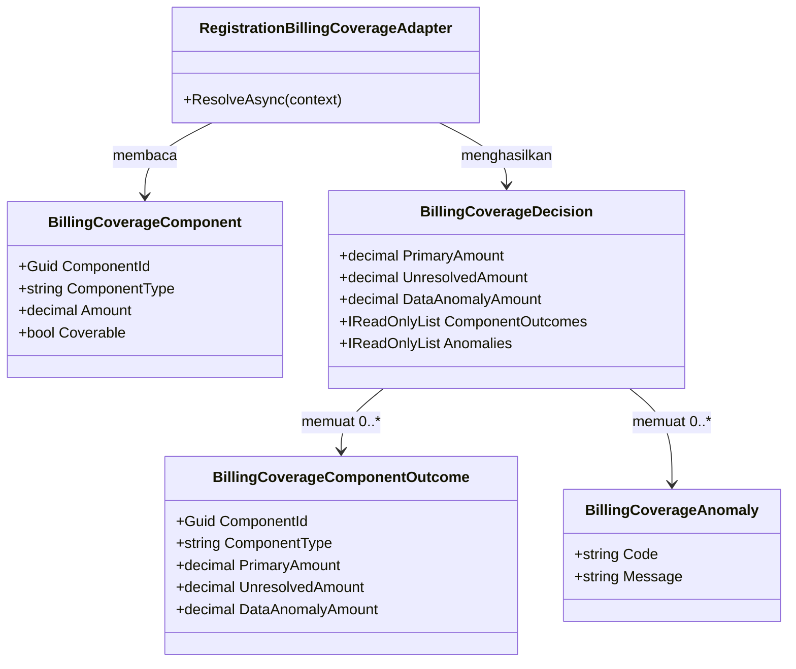

### Class diagram — gerbang PPN care setting

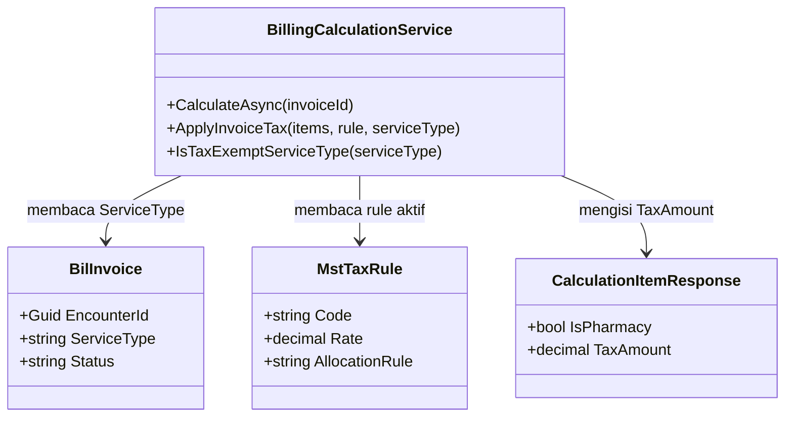

### Penjelasan setiap class yang berubah atau baru

#### `BillingCoverageAnomaly`

| Aspek | Penjelasan |
| --- | --- |
| **Status** | `Baru` |
| **Lokasi file** | `Areas/HealthServices/BillingManagement/Billing/Services/BillingCoverageAdapter.cs` |
| Kategori | Record kontrak internal antar-service (bukan entity, tidak tersimpan sebagai tabel) |
| Tanggung jawab utama | Menyatakan satu masalah data pendaftaran yang membuat penilaian penjamin tidak dapat dilakukan dengan benar |
| Field penting | `Code` (`string`), `Message` (`string`) |
| Daftar `Code` yang berlaku | `PAYER_NOT_ELIGIBLE`, `POLICY_INACTIVE`, `INSURANCE_PROVIDER_MISSING`, `ENCOUNTER_NOT_FOUND` |
| Navigation property dan relasi | Dimuat `BillingCoverageDecision.Anomalies` |
| Pemakaian dalam alur bisnis | Menjadi isi peringatan di Menu Pembayaran, dan menjadi alasan yang dibaca petugas pendaftaran saat membetulkan data |
| Catatan desain | `Message` **MUST** ditulis dalam kalimat yang dapat dibaca kasir, bukan nama kolom. Contoh: `POLICY_INACTIVE` → "Polis asuransi kunjungan ini tercatat tidak aktif. Periksa data penjamin di Registrasi." `Code` **MUST NOT** diterjemahkan; ia kunci program |

#### `BillingCoverageComponentOutcome`

| Aspek | Penjelasan |
| --- | --- |
| **Status** | `Diperbarui` (sudah ada di working tree lewat `BE-BKC-FIX-003`, belum di-commit) |
| **Lokasi file** | `Areas/HealthServices/BillingManagement/Billing/Services/BillingCoverageAdapter.cs` |
| Kategori | Record kontrak internal antar-service |
| Tanggung jawab utama | Hasil penilaian penjamin untuk satu potongan biaya |
| Field penting | Sudah ada: `ComponentId`, `ComponentType`, `PrimaryAmount`, `UnresolvedAmount`. **Baru:** `DataAnomalyAmount` (`decimal`) |
| Catatan desain | Porsi pasien tetap **diturunkan** pemanggil, tidak disimpan: `PatientAmount = component.Amount − PrimaryAmount − UnresolvedAmount − DataAnomalyAmount`. Menyimpannya berarti ada dua sumber untuk satu angka, dan suatu hari keduanya berbeda. Nominal sudah dibulatkan dua desimal oleh `CalculateCoveredAmount`, **MUST NOT** dibulatkan ulang |

#### `BillingCoverageDecision`

| Aspek | Penjelasan |
| --- | --- |
| **Status** | `Diperbarui` |
| **Lokasi file** | `Areas/HealthServices/BillingManagement/Billing/Services/BillingCoverageAdapter.cs` |
| Kategori | Record kontrak internal antar-service |
| Field penting | **Baru:** `decimal DataAnomalyAmount`, `IReadOnlyList<BillingCoverageAnomaly> Anomalies`. **Makna dipersempit:** `UnresolvedAmount` (`BKC-DES-013`). **Dipertahankan selalu nol:** `ExcessAmount`, `ExcessStatus` (`BKC-DES-014`) |
| Catatan desain | `SelfPay()` mengembalikan `DataAnomalyAmount = 0` dan `Anomalies = []`. Ketiga titik pembentukan record ini (`ResolveAsync`, `SelfPay`, `Unresolved`) **MUST** ikut berubah bersamaan — ini `record` posisional |

#### `RegistrationBillingCoverageAdapter.ResolveAsync`

| Aspek | Penjelasan |
| --- | --- |
| **Status** | `Diperbarui` |
| **Lokasi file** | `Areas/HealthServices/BillingManagement/Billing/Services/BillingCoverageAdapter.cs` |
| Kategori | Service (adapter) |
| Dipanggil oleh | `BillingCalculationService.CalculateAsync` |
| Membuka transaksi database | Tidak — hanya membaca (`AsNoTracking`) |
| Perubahan pada amendment ini | Empat perubahan, dijelaskan satu per satu pada tabel "Perubahan perilaku `ResolveAsync`" di bawah |
| Aturan yang **tidak** berubah | `Matches()` dan `CalculateCoveredAmount()` **tidak berubah satu baris pun** (`BKC-DEC-070`). Cap `MaxAmountPerVisit` tetap berlaku. `MaxQuantityPerVisit` tetap berlaku di dalam `CalculateCoveredAmount` — yang dihapus adalah limit **bulanan**, bukan limit per kunjungan |
| Catatan desain | Perubahan ini **MUST NOT** dipakai sebagai kesempatan menyisipkan penyesuaian aturan lain. Bukti bahwa nominal tanggungan penjamin tidak bergeser: variabel `primary` tetap dihitung dari `CalculateCoveredAmount` yang sama |

##### Perubahan perilaku `ResolveAsync` — sebelum dan sesudah

| Jalur | Sebelum | Sesudah | Dasar |
| --- | --- | --- | --- |
| (1) Tidak ada rule yang cocok | `unresolved += Amount` | **`patient`** — komponen tidak menyumbang ke `primary`, `unresolved`, maupun `anomaly`; seluruh nilainya jatuh ke pasien lewat identitas turunan | `BKC-DEC-072` (Subtotal Mandiri) |
| (2) Rule `CoverageStatus = NotCovered` | `unresolved += Amount` bila `IsAllowExcessPaymentByPatient = false`, selain itu pasien | ~~Tidak berubah~~ **DIKOREKSI amendment lanjutan revisi `0.9`** — cabang `false` **tidak lagi** menjadi `unresolved`, melainkan `nonBillableResidual` yang dirutekan ke write-off, sama seperti jalur (5). Cabang `true` tetap ke pasien. Lihat § "Amendment lanjutan 4 September 2026 — Perluasan perutean write-off ke jalur `NotCovered` (revisi `0.9`)" | `BKC-DEC-072`, `BKC-DEC-074`, **`BKC-DEC-089`**, `BKC-DES-026` |
| (3) Rule `NeedApproval`, atau `MaxAmountPerMonth`/`MaxQuantityPerMonth` terisi | `unresolved += Amount` | **Cabang dihapus seluruhnya.** Komponen lanjut ke perhitungan normal seolah gerbang itu tidak pernah ada | `BKC-DEC-071` |
| (4) Penjamin tidak `IsEligible`/`IsPolicyActive`/`InsuranceProviderId` kosong, atau encounter tidak ditemukan | `Unresolved(...)` — seluruh komponen coverable menjadi `unresolved` | **`anomaly`** — seluruh komponen coverable dicatat `DataAnomalyAmount = Amount`, `PrimaryAmount = 0`, `UnresolvedAmount = 0`, dan nilainya **jatuh ke pasien** pada penjumlahan tampilan. `Anomalies` diisi kode yang sesuai | `BKC-DEC-073`, `BKC-DES-010`, `BKC-DES-011` |
| (5) Residual `CalculateCoveredAmount` (`CoveragePercent < 100`, co-payment, cap `MaxCoverageAmount`) | Pasien bila `IsAllowExcessPaymentByPatient = true`; `unresolved` bila `false` | ~~Tidak berubah~~ **DIKOREKSI amendment lanjutan 4 September 2026** — cabang `false` **tidak lagi** menjadi `unresolved`, melainkan `nonBillableResidual` yang dirutekan ke write-off. Cabang `true` tetap ke pasien. Lihat § "Amendment lanjutan 4 September 2026 — Residual non-billable dirutekan ke write-off" | `BKC-DEC-070`, `BKC-DEC-074`, **`BKC-DEC-080`**, `BKC-DES-022` |

> **Contoh berangka untuk jalur (1).** Kunjungan rawat jalan pasien asuransi. Item "Vitamin C tablet" Rp 25.000 tidak punya satu pun aturan yang cocok di `MstInsuranceCoverageRule`. **Sebelum:** Rp 25.000 masuk "Penjamin Belum Terverifikasi", Subtotal Mandiri Rp 0, dan kasir tidak tahu harus menagih berapa. **Sesudah:** Rp 25.000 masuk Subtotal Mandiri, kasir menagih Rp 25.000, dan baris "Penjamin Belum Terverifikasi" tidak ada lagi di layar.

> **Contoh berangka untuk jalur (4).** Kunjungan yang sama, tetapi kolom `IsEligible` pada data penjamin belum dicentang petugas pendaftaran. Total biaya coverable Rp 440.000. **Sebelum:** Rp 440.000 masuk "Penjamin Belum Terverifikasi", `ApplyCoverageWaterfall` lolos, dan Subtotal Mandiri Rp 0 — kasir melihat tagihan Rp 440.000 yang tidak dapat dialokasikan ke siapa pun. **Sesudah:** Rp 440.000 masuk Subtotal Mandiri sehingga tagihan tetap dapat dibayar, `DataAnomalyAmount = Rp 440.000`, dan di atas ringkasan pembayaran muncul peringatan "Penjamin kunjungan ini belum dinyatakan layak (eligible). Rp 440.000 untuk sementara dibebankan ke pasien. Periksa data penjamin di Registrasi sebelum menagih."

#### `BillingCalculationService.BuildCoverageComponents`

| Aspek | Penjelasan |
| --- | --- |
| **Status** | `Diperbarui` |
| **Lokasi file** | `Areas/HealthServices/BillingManagement/Billing/Services/BillingCalculationService.cs` |
| Kategori | Service (perhitungan, method statis murni) |
| Dipanggil oleh | `BillingCalculationService.CalculateAsync` |
| Membuka transaksi database | Tidak |
| Perubahan pada amendment ini | Dua komponen pajak non-item berganti `ComponentType`: pajak biaya administrasi menjadi `"TAX_ADMINISTRATION_FEE"`, pajak biaya kamar menjadi `"TAX_ROOM_CHARGE"` (`BKC-DES-016`). Komponen pajak milik item **tetap** `"TAX"` — nama itu sudah dikonsumsi `CalculateAsync` dan frontend |
| Catatan desain | Perubahan ini menutup kemungkinan `ToDictionary` melempar `ArgumentException` karena kunci ganda. Ia **tidak** mengubah pencocokan aturan: `Matches()` membandingkan `CoverageItemType`, bukan `ComponentType` |

#### `BillingCalculationService.ApplyInvoiceTax`

| Aspek | Penjelasan |
| --- | --- |
| **Status** | `Diperbarui` |
| **Lokasi file** | `Areas/HealthServices/BillingManagement/Billing/Services/BillingCalculationService.cs` |
| Kategori | Service (perhitungan, method statis murni) |
| Dipanggil oleh | `BillingCalculationService.CalculateAsync` |
| Membuka transaksi database | Tidak |
| Perubahan pada amendment ini | Signature bertambah satu parameter: `string? serviceType`. Sebelum basis pajak disusun, gerbang baru dijalankan — bila `IsTaxExemptServiceType(serviceType)` bernilai `true`, method mengembalikan `empty` tanpa menghitung apa pun (`BKC-DEC-078`) |
| Aturan yang **tidak** berubah | Basis pajak tetap dibatasi ke `item.IsPharmacy = true` (`BKC-DEC-076`, bagian yang tidak direvisi). Alokasi proporsional per item, pembebanan sisa pembulatan ke komponen terakhir, dan `TaxCalculationResponse.AllocationRule` tetap seperti sekarang |
| Catatan desain | Gerbang **MUST** dijalankan sebelum `bases` disusun, bukan sesudah, supaya `TaxCalculationResponse` untuk kunjungan rawat inap benar-benar kosong dan `BuildCoverageComponents` tidak membentuk komponen pajak apa pun. Gerbang **MUST NOT** ditempatkan di `LoadInvoiceTaxRuleAsync` — memuat rule tetap perlu terjadi agar galat "lebih dari satu tax rule aktif" tetap terdeteksi pada kunjungan rawat inap juga |

#### `BillingCalculationService.IsTaxExemptServiceType`

| Aspek | Penjelasan |
| --- | --- |
| **Status** | `Baru` |
| **Lokasi file** | `Areas/HealthServices/BillingManagement/Billing/Services/BillingCalculationService.cs` |
| Kategori | Method pembantu statis privat |
| Tanggung jawab utama | Menjawab satu pertanyaan: apakah care setting tagihan ini dibebaskan dari PPN |
| Bentuk logis | Daftar bebas pajak berisi **satu** nilai, `AdministrationFeeServiceTypes.Ranap` (`"RANAP"`), dibandingkan tanpa membedakan huruf besar-kecil. Selain nilai itu, termasuk `null` dan teks yang tidak dikenal, mengembalikan `false` sehingga pajak tetap dikenakan (`BKC-DES-019`) |
| Catatan desain | Daftar ini **MUST NOT** ditulis sebagai daftar kena pajak. Nilai `"MCU"`, `"TELEMEDICINE"`, dan `"OTC"` belum diputuskan pemilik produk — lihat `BKC-OQ-083`. Di bawah bentuk daftar bebas pajak, ketiganya kena PPN sampai ada keputusan sebaliknya, dan itu keadaan yang dapat dikoreksi lewat refund; kebalikannya menghasilkan kurang bayar pajak yang tidak terlihat |

#### `BillingCalculationService.ApplyCoverageWaterfall`

| Aspek | Penjelasan |
| --- | --- |
| **Status** | `Diperbarui` |
| **Lokasi file** | `Areas/HealthServices/BillingManagement/Billing/Services/BillingCalculationService.cs` |
| Kategori | Service (perhitungan) |
| Perubahan pada amendment ini | (1) Penjaga `REJECTED` diretarget ke `DataAnomalyAmount == 0` (`BIL-VAL-036`, `BKC-DES-012`). (2) `DataAnomalyAmount` diteruskan ke `CoverageCalculationResponse`. (3) `PatientAmount` dihitung ulang sebagai `residualAfterExcess − unresolvedAmount` — **tidak berubah rumusnya**, karena nilai anomali memang harus jatuh ke pasien (`BKC-DES-011`). (4) `IsPerItemAllocationAvailable` disetel `true` (`BKC-DES-017`) |
| Aturan bisnis baru | `BIL-VAL-036` — tanggungan penjamin yang ditolak boleh menjadi tanggungan pasien **hanya** bila kondisinya tercatat sebagai anomali data. Bila `PrimaryStatus` mengandung `REJECTED`, `coverableAmount > 0`, dan `DataAnomalyAmount == 0`, perhitungan dihentikan dengan pesan lama yang dipertahankan apa adanya |
| Catatan desain | Batas-batas yang sudah ada (`primary + excess + unresolved > coverableAmount`, `primary > eligibleAmount`, dan seterusnya) **MUST** tetap berlaku. `DataAnomalyAmount` **MUST NOT** ikut dijumlahkan ke dalam pemeriksaan `> coverableAmount`, karena nominalnya sudah terwakili sebagai porsi pasien; menjumlahkannya berarti menghitung uang yang sama dua kali |

#### `CalculationItemResponse`

| Aspek | Penjelasan |
| --- | --- |
| **Status** | `Diperbarui` |
| **Lokasi file** | `Areas/HealthServices/BillingManagement/Billing/Dtos/BillingInvoiceDtos.cs` |
| Kategori | DTO Response (bagian `CalculationBreakdownResponse`, ikut tersimpan di `BreakdownSnapshot`) |
| Field yang sudah ada dari `BE-BKC-FIX-003` | `ItemPrimaryAmount`, `ItemUnresolvedAmount`, `TaxPrimaryAmount`, `TaxUnresolvedAmount` — **dipertahankan apa adanya**, tidak diganti nama (`BKC-DES-015`) |
| Field penting **baru** | `ItemDataAnomalyAmount` (`decimal`), `TaxDataAnomalyAmount` (`decimal`) |
| Catatan desain | Nilai turunan `CoveredAmount`, `PatientAmount`, dan `CoveredNetAmount` yang sempat dirancang amendment 3 September 2026 **tidak jadi ditambahkan**: seluruhnya dapat dihitung konsumen dari field di atas, dan menyimpan angka turunan di dalam snapshot berarti dua sumber untuk satu angka. Seluruh field bertipe nilai non-nullable dengan bawaan `0`, sehingga snapshot lama tetap dapat dideserialisasi — kebenarannya dijaga `IsPerItemAllocationAvailable`, bukan oleh `null` |

#### `AdministrationFeeCalculationResponse` dan `RoomChargeCalculationResponse`

| Aspek | Penjelasan |
| --- | --- |
| **Status** | `Diperbarui` (keduanya) |
| **Lokasi file** | `Areas/HealthServices/BillingManagement/Billing/Dtos/BillingInvoiceDtos.cs` |
| Field yang sudah ada dari `BE-BKC-FIX-003` | `PrimaryAmount`, `UnresolvedAmount` pada keduanya |
| Field penting **baru** | `DataAnomalyAmount` (`decimal`) pada keduanya |
| Catatan desain | Ini yang menjawab pertanyaan "bagaimana komponen non-item?" pada `BKC-DEC-069`. Keduanya bukan `BilInvoiceItem` sehingga tidak punya baris di `Items`; kolomnya harus menempel di response komponennya sendiri (`BKC-DES-005`, tetap berlaku) |

#### `CoverageCalculationResponse`

| Aspek | Penjelasan |
| --- | --- |
| **Status** | `Diperbarui` |
| **Lokasi file** | `Areas/HealthServices/BillingManagement/Billing/Dtos/BillingInvoiceDtos.cs` |
| Field penting **baru** | `decimal DataAnomalyAmount`, `bool HasDataAnomaly`, `IReadOnlyList<string> AnomalyCodes`, `IReadOnlyList<string> AnomalyMessages`, `bool IsPerItemAllocationAvailable` |
| Field yang **maknanya dipersempit** | `UnresolvedAmount` — kini hanya berarti residual yang tidak boleh ditagihkan ke pasien menurut kontrak penjamin (`BKC-DES-013`) |
| Field yang **dipertahankan selalu nol** | `ExcessAmount`, `ExcessStatus` (`BKC-DES-014`) |
| Catatan desain | `HasDataAnomaly` sengaja disediakan terpisah dari `DataAnomalyAmount > 0`. Anomali dapat terjadi pada tagihan yang seluruh komponennya bernilai nol — misalnya invoice yang baru dibuka — dan dalam keadaan itu nominalnya nol tetapi masalah datanya nyata. Layar yang menguji nominal akan melewatkan kasus itu. `AnomalyCodes` dan `AnomalyMessages` sejajar indeksnya |

#### `BillingCalculationContract.Version`

| Aspek | Penjelasan |
| --- | --- |
| **Status** | `Diperbarui` |
| **Lokasi file** | `Areas/HealthServices/BillingManagement/Billing/Dtos/BillingInvoiceDtos.cs` |
| Perubahan | `"BIL-CALCULATION-0.4"` → `"BIL-CALCULATION-0.6"`. Nilai `0.5` **dilewati** karena tidak pernah ada di source: amendment 3 September 2026 merancangnya, tetapi implementasinya (`BE-BKC-FIX-003`) mendarat tanpa menaikkan angka versi |
| Catatan desain | Nilai ini ikut tersimpan di dalam JSON snapshot dan berguna untuk investigasi, tetapi **MUST NOT** dipakai program sebagai penentu ketersediaan alokasi. Yang dipakai adalah `IsPerItemAllocationAvailable` (`BKC-DES-017`) |

#### `BillingInsuranceInvoiceDocumentService`

| Aspek | Penjelasan |
| --- | --- |
| **Status** | `Baru` (dirancang amendment 3 September 2026, **belum** ada di source) |
| **Lokasi file** | `Areas/HealthServices/BillingManagement/Billing/Services/BillingInsuranceInvoiceDocumentService.cs` |
| Perubahan pada amendment ini | Sumber kolom rupiah per baris berubah mengikuti `BKC-DES-015`: dibaca dari `CalculationItemResponse.ItemPrimaryAmount + TaxPrimaryAmount` (dan `PrimaryAmount` untuk biaya administrasi/kamar), bukan dari `BillingCoverageComponentAllocation` yang tidak jadi dibuat. Penyaringan `BKC-DEC-068` menjadi: tampilkan baris yang `ItemPrimaryAmount + TaxPrimaryAmount > 0` |
| Perilaku baru untuk anomali data | Bila `HasDataAnomaly` bernilai `true`, dokumen dikembalikan dengan `IsPrintable = false` dan peringatan "Data penjamin kunjungan ini bermasalah, sehingga rincian tanggungan asuransi belum dapat diterbitkan." Dokumen yang menyatakan tanggungan asuransi Rp 0 padahal sebabnya kolom `IsEligible` belum dicentang adalah dokumen yang menyesatkan pihak asuransi |
| Catatan desain | Service ini **MUST NOT** menghitung ulang coverage — hanya membacakan hasil. Seluruh catatan desain amendment 3 September 2026 untuk service ini tetap berlaku |

### Arsitektur folder — perubahan

```text
Areas/HealthServices/BillingManagement/Billing/
├── Dtos/
│   ├── BillingInvoiceDtos.cs                        # Diperbarui: +ItemDataAnomalyAmount/TaxDataAnomalyAmount,
│   │                                                #   +DataAnomalyAmount pada AdminFee/RoomCharge,
│   │                                                #   +DataAnomalyAmount/HasDataAnomaly/AnomalyCodes/
│   │                                                #   AnomalyMessages/IsPerItemAllocationAvailable pada
│   │                                                #   CoverageCalculationResponse, versi 0.4 -> 0.6
│   └── BillingInsuranceInvoiceDtos.cs               # Baru (dari amendment 3 Sep 2026, belum ada di source)
├── Services/
│   ├── BillingCoverageAdapter.cs                    # Diperbarui: +BillingCoverageAnomaly,
│   │                                                #   +DataAnomalyAmount pada Outcome dan Decision,
│   │                                                #   cabang NeedApproval/limit bulanan DIHAPUS,
│   │                                                #   jalur no-rule-match dialihkan ke pasien,
│   │                                                #   Unresolved() menjadi DataAnomaly()
│   ├── BillingCalculationService.cs                 # Diperbarui: +IsTaxExemptServiceType,
│   │                                                #   ApplyInvoiceTax +parameter serviceType,
│   │                                                #   BuildCoverageComponents ComponentType pajak non-item,
│   │                                                #   ApplyCoverageWaterfall BIL-VAL-036 + anomali
│   └── BillingInsuranceInvoiceDocumentService.cs    # Baru (dari amendment 3 Sep 2026, belum ada di source)
├── Controllers/
│   └── BillingInvoicesController.cs                 # Diperbarui (dari amendment 3 Sep 2026): +1 action GET
└── BillingManagementServiceCollectionExtensions.cs  # Diperbarui (dari amendment 3 Sep 2026): +AddScoped
```

Tidak ada perubahan di bawah `Repositories/Configurations/` dan tidak ada berkas baru di `Migrations/` (`BKC-DES-020`).

Catatan pola yang tetap berlaku: folder DTO submodul ini bernama **`Dtos/`**, menyimpang dari pola standar `DTOs/`. Ini utang teknis yang sudah ada; berkas baru **MUST** mengikuti `Dtos/` agar konsisten di dalam submodul yang sama, dan perapiannya **MUST** menjadi task tersendiri.

### Status model dan dampak migration

| Kelompok | Status | Dampak dan kolom yang berubah |
| --- | --- | --- |
| `BilInvoice`, `BilInvoiceItem`, `BilCalculationVersion` | `Sudah ada` | **Nol kolom berubah.** Isi kolom `BreakdownSnapshot` (bertipe `string` berisi JSON) menjadi lebih kaya; bentuk kolomnya tidak berubah |
| `MstInsuranceCoverageRule` | `Sudah ada` | Hanya dibaca. `IsNeedApproval`, `IsNeedGuaranteeLetter`, `MaxAmountPerMonth`, `MaxQuantityPerMonth` **tetap ada sebagai kolom** dan tetap dapat diisi admin, tetapi **berhenti dibaca** `ResolveAsync` (`BKC-DEC-071`). `IsAllowExcessPaymentByPatient` tetap dibaca (`BKC-DEC-074`) |
| `MstTaxRule` | `Sudah ada` | Hanya dibaca. Tidak ada kolom yang berubah; yang perlu berubah adalah **nilai** `AllocationRule` pada baris yang aktif (`BKC-DEC-077`) |
| `TrxPatientEncounter`, `TrxPatientEncounterGuarantor` | `Sudah ada` | Hanya dibaca | 
| Tabel baru | — | **Tidak ada** |
| Kolom baru | — | **Tidak ada** |

**Peringatan tentang empat kolom yang berhenti dibaca.** `IsNeedApproval`, `IsNeedGuaranteeLetter`, `MaxAmountPerMonth`, dan `MaxQuantityPerMonth` **MUST NOT** dihapus dari model maupun dari layar master data pada amendment ini. Keempatnya tetap punya arti bisnis bagi petugas klaim, dan `InsuranceCoverageService` di `ClinicalManagement` masih membacanya untuk keperluan advisory. Menghapusnya adalah keputusan pemilik master data asuransi, bukan efek samping amendment billing. Yang **MUST** dilakukan adalah menambahkan keterangan pada layar master data bahwa keempatnya tidak lagi menahan perhitungan tagihan — lihat `BKC-OQ-084`.

### Rencana migration, backfill, dan rollback

1. **Tidak ada migration.** Seluruh perubahan adalah kode dan bentuk JSON di dalam kolom yang sudah ada; dapat dideploy tanpa mematikan layanan dan tanpa mengunci tabel mana pun.
2. **Tidak ada backfill, dan itu disengaja.** Snapshot yang sudah terkunci sebelum deploy tetap memakai angka lama. Menulis ulang `BreakdownSnapshot` invoice yang sudah difinalkan berarti mengubah bukti kalkulasi yang kolom itu ada untuk melindunginya.
3. **Akibat yang MUST diketahui pengguna — tagihan rawat inap yang masih `OPEN` akan turun nilainya.** Invoice rawat inap yang berisi obat/alkes dan masih berstatus `OPEN` hari ini membawa PPN. Pada kalkulasi ulang pertama setelah deploy, PPN itu hilang (`BKC-DEC-078`) dan total tagihan berkurang. Bila deposit atau pembayaran sudah diterima sebesar total lama, selisihnya menjadi kelebihan bayar dan diselesaikan lewat mekanisme Pengecualian Finansial yang sudah ada (refund/adjustment, `BKC-DEC-032`–`035`) — **bukan** lewat penyesuaian diam-diam pada tagihan. Besarnya dampak ini **MUST** dihitung sebelum deploy; lihat `BKC-OQ-085`.
4. **Akibat untuk tagihan yang sudah `FINAL`/`CLOSED`.** Tidak ada yang berubah. Angka lama tetap sah dan tetap tercetak sama pada Kwitansi maupun Struk Pasien yang dicetak ulang.
5. **Urutan deploy.** Perubahan adapter dan mesin kalkulasi (satu slice) **MUST** lebih dulu daripada perubahan tampilan Menu Pembayaran. Frontend yang dideploy lebih dulu akan membaca field yang belum ada dan menampilkan Rp 0 pada kolom anomali — terlihat seperti tidak ada masalah data, padahal masalahnya ada.
6. **Rollback.** Cukup rollback kode; tidak ada langkah mundur basis data. Field tambahan yang sudah tertulis di dalam JSON snapshot akan diabaikan kode versi lama (`JsonSerializerDefaults.Web` mengabaikan properti yang tidak dikenal).

### Rencana data master awal

Tidak ada tabel master baru. Yang **MUST** disiapkan adalah **nilai** pada master yang sudah ada, dan tanpanya perilaku yang baru dirancang tidak akan terlihat benar.

| Master | Isi minimum agar perilaku benar | Sumber nilai | Pemilik |
| --- | --- | --- | --- |
| `MstTaxRule` (baris yang aktif) | `AllocationRule = "PROPORTIONAL"`. Bila hari ini bernilai `"PATIENT"`, seluruh PPN obat/alkes rawat jalan dibebankan ke pasien walaupun obatnya ditanggung asuransi — melanggar `BKC-DEC-077` kasus (2). Bila `"GUARANTOR"`, PPN dibebankan ke asuransi walaupun obatnya tidak ditanggung — melanggar kasus (3) | Kebijakan pajak RS, hasil keputusan `BKC-DEC-077` | Finance/Tax Owner |
| `MstTaxRule` (jumlah baris aktif) | **Tepat satu** baris aktif pada satu waktu. `LoadInvoiceTaxRuleAsync` melempar galat bila ada dua, dan galat itu menghentikan seluruh kalkulasi invoice | Konfigurasi master | Finance/Tax Owner |
| `MstInsuranceCoverageRule` | Aturan `CoverageStatus = "Covered"` yang benar-benar mencakup tarif yang dipakai. Setelah `BKC-DEC-071`, tarif tanpa aturan yang cocok langsung menjadi tanggungan pasien tanpa peringatan apa pun — kelengkapan master ini menjadi **lebih** penting, bukan kurang | Buku tarif/benefit perusahaan asuransi | Insurance/Finance Owner |
| `MstInsuranceCoverageRule.IsAllowExcessPaymentByPatient` | Diisi sadar per aturan. Bawaannya `true` (residual ditagihkan ke pasien); `false` berarti RS menanggung selisihnya dan nominal itu muncul sebagai "Selisih Tidak Ditagihkan" | Kontrak kerja sama RS–asuransi | Insurance/Finance Owner |
| `TrxPatientEncounterGuarantor` (bukan master, tetapi prasyarat data) | `IsEligible`, `IsPolicyActive`, dan `InsuranceProviderId` terisi benar saat registrasi. Setelah amendment ini, kesalahan di sini muncul sebagai peringatan anomali di Menu Pembayaran, bukan lagi sebagai angka yang tidak dapat dijelaskan | Petugas pendaftaran | Registration Owner |

### Yang sengaja tidak dibuat

| Yang ditolak | Alasan |
| --- | --- |
| Memakai ulang `UnresolvedAmount` sebagai penampung anomali data | `BKC-DES-010`. Satu field dua arti adalah penyakit yang sedang diobati, bukan obatnya |
| Bucket uang ketiga di ringkasan pembayaran untuk nominal anomali | `BKC-DES-011`. Itu baris "Penjamin Belum Terverifikasi" dengan nama baru, dan ia menahan pasien di kasir karena kesalahan data orang lain |
| Menghapus `UnresolvedAmount` dan `ExcessAmount` dari kontrak backend | `BKC-DEC-075` menyatakan eksplisit keduanya tidak dihapus total dari kontrak. Menghapusnya juga merusak konsumen tanpa manfaat |
| Mengganti nama `ItemPrimaryAmount` dan sekerabatnya menjadi `CoveredNetAmount` | `BKC-DES-015`. Nama itu sudah dikonsumsi frontend; penggantian nama adalah perubahan yang merusak kompatibilitas demi kosakata yang lebih rapi |
| Field turunan `CoveredAmount`/`PatientAmount` yang disimpan pada `CalculationItemResponse` | Dapat dihitung konsumen dari field yang sudah ada. Menyimpan angka turunan di dalam snapshot berarti dua sumber untuk satu angka, dan invariant `BIL-VAL-028` yang menjaganya menjadi biaya perawatan tanpa manfaat |
| `BillingCoverageComponentAllocation` dan `ComponentKey` bertipe teks | `BKC-DES-015` menggantikan `BKC-DES-002`. Masalahnya sudah diselesaikan dengan cara lain yang sudah berjalan di source |
| Menghapus kolom `IsNeedApproval`, `IsNeedGuaranteeLetter`, `MaxAmountPerMonth`, `MaxQuantityPerMonth` | Keempatnya masih dibaca `InsuranceCoverageService` di `ClinicalManagement` dan masih punya arti bagi petugas klaim. Penghapusannya keputusan pemilik master data asuransi |
| Memindahkan pemeriksaan limit bulanan ke tempat lain (mis. layar approval) | `BKC-DEC-071` menghapusnya, bukan memindahkannya. Membangun tempat baru berarti mengarang requirement yang tidak pernah diminta |
| Memblokir finalisasi invoice ketika `HasDataAnomaly` bernilai `true` | Itu aturan bisnis baru yang tidak diminta `BKC-DEC-073`. Diajukan sebagai `BKC-OQ-086` beserta rekomendasi "peringatkan, jangan blokir" |
| Menurunkan gerbang PPN dari `ServiceUnitId` atau `PatientClassId` | `BKC-DES-018`. Keduanya menjawab pertanyaan lain: unit menjawab "dilayani di mana", kelas pasien menjawab "kelas perawatan apa". Satu unit dapat melayani rawat jalan dan rawat inap sekaligus, dan kelas pasien terisi juga pada kunjungan rawat jalan |
| Menurunkan gerbang PPN langsung dari `TrxPatientEncounter.EncounterType` | `BKC-DES-018`. Basis pajak sebuah tagihan tidak boleh berubah karena Registrasi membetulkan jenis kunjungan setelah tagihan berjalan |
| Menambah kolom `IsTaxExempt` pada `BilInvoice` | Nilainya seluruhnya dapat diturunkan dari `ServiceType` yang sudah ada. Kolom turunan yang dipersist akan menyimpang dari sumbernya begitu aturannya berubah |
| Meng-hardcode `AllocationRule = "PROPORTIONAL"` di kode | `BKC-DES-020`. Layar master Tax Rule akan berbohong kepada admin yang mengisinya |
| Menambah endpoint baru pada amendment ini | Seluruh perubahan terbawa oleh payload `GET .../calculation-preview` dan `GET .../calculations/{versionNo}` yang sudah ada. Endpoint dokumen Invoice Asuransi tetap satu, sebagaimana amendment 3 September 2026 |

### Security, privacy, exception, dan concurrency — tambahan

**Hak akses.** Tidak ada resource maupun action permission baru. Seluruh field baru terbawa oleh endpoint kalkulasi yang sudah dijaga `[AccessPermission("BillingInvoice", "Read")]` dan `[AccessPermission("BillingInvoice", "Update")]`. Konsekuensi yang **MUST** dinyatakan terbuka: kode dan pesan anomali data terlihat oleh siapa pun yang boleh membuka Menu Pembayaran. Isinya adalah status administratif penjamin, bukan data klinis, sehingga dinilai sepadan dengan kewenangan yang sudah ada.

**Logging.** Anomali data adalah kondisi yang **MUST** meninggalkan jejak, tetapi `GET` tidak dicatat custom logger menurut konvensi project. Karena itu jejaknya menempel pada kalkulasi yang **dipersist**: ketika `CalculateAsync` berjalan dengan `persist: true` dan `HasDataAnomaly` bernilai `true`, `BilCalculationVersion.BreakdownSnapshot` yang tersimpan sudah memuat kode anomalinya. Payload log **MUST** memuat `InvoiceId` dan kode anomali saja — **MUST NOT** memuat nomor polis, nomor anggota, nama pasien, maupun `DescriptionSnapshot`.

**Kolom sensitif yang tersentuh.** `PolicyNumberSnapshot`, `MemberNumberSnapshot`, `MedicalRecordNumber`, `FullName`, `DescriptionSnapshot`. Seluruhnya **MUST NOT** masuk payload log mana pun, dan **MUST NOT** dipakai sebagai contoh berisi data asli. Seluruh contoh pada dokumen ini memakai data samaran.

**Exception dan jalur tidak normal.**

| Keadaan | Perilaku |
| --- | --- |
| Penjamin tidak `IsEligible` | Kalkulasi **berhasil**. Seluruh komponen coverable ke pasien, `DataAnomalyAmount` terisi, kode `PAYER_NOT_ELIGIBLE` |
| Polis tercatat tidak aktif | Kalkulasi berhasil, kode `POLICY_INACTIVE` |
| `InsuranceProviderId` kosong padahal `PaymentType` bukan `Cash` | Kalkulasi berhasil, kode `INSURANCE_PROVIDER_MISSING` |
| Encounter tidak ditemukan saat adapter membacanya | Kalkulasi berhasil, kode `ENCOUNTER_NOT_FOUND`. Ini kondisi yang seharusnya tidak mungkin karena `CalculateAsync` sudah memuat encounter lebih dulu; bila muncul, ia menandakan data terhapus di tengah perhitungan |
| `PrimaryStatus` mengandung `REJECTED`, `coverableAmount > 0`, `DataAnomalyAmount == 0` | `422` dengan pesan lama: "Coverage yang ditolak tidak boleh otomatis dipindahkan ke pasien tanpa policy kontrak." (`BIL-VAL-036`) |
| Lebih dari satu `MstTaxRule` aktif | `409` dengan pesan yang sudah ada, menyebut kode kedua rule. **Tetap berlaku untuk kunjungan rawat inap**, walaupun pajaknya tidak akan dipakai — supaya salah konfigurasi tetap terdeteksi |
| `BilInvoice.ServiceType` bernilai `null` atau teks yang tidak dikenal | Pajak **tetap dikenakan** (`BKC-DES-019`). Tidak melempar galat: menghentikan kalkulasi seluruh invoice karena satu teks care setting yang tidak dikenal jauh lebih merugikan daripada memungut pajak yang mungkin perlu dikoreksi |
| Kunjungan rawat inap dengan item obat/alkes | `Taxes` kosong, `TaxAmount` setiap item `0`, tidak ada komponen `"TAX"` yang dibentuk. Bukan galat |

**Concurrency.** Tidak ada perubahan. `CalculateAsync` tetap memakai `ExpectedRowVersion`, `Serializable`, dan advisory lock yang sudah ada. Amendment ini tidak menambah titik tulis apa pun.

### Trace dan approval

| Aspek | Nilai |
| --- | --- |
| Keputusan bisnis dasar | `BKC-DEC-070`–`075`, `BKC-DEC-076` (sebagian `superseded`), `BKC-DEC-077`, `BKC-DEC-078`–`079` — approved Product/Domain Owner 4 September 2026 |
| Keputusan bisnis lampau yang ditutup | `BKC-DEC-069` (bentuk kontrak pecahan per baris) dan `BKC-DEC-073` (bentuk kategori anomali data) — keduanya blocker desain terbuka dari amendment 3 September 2026 |
| Keputusan arsitektur amendment ini | `BKC-DES-010`–`BKC-DES-020`, status **draft** |
| Keputusan arsitektur yang digantikan | `BKC-DES-002` digantikan `BKC-DES-015` |
| Kontrak terdampak | `BIL-API-0.6`, `BIL-STATE-0.6`, `BIL-VALIDATION-0.6`, `BIL-INTEGRATION-0.6`, `BIL-PERMISSION-0.6`, `BIL-TEST-0.6`, `BIL-CALCULATION-0.6` |
| Acceptance test | `BIL-AT-036`–`BIL-AT-048` (`testing/acceptance-test-matrix.md`) |
| Backend SHA diaudit | `ffeb45a83a6282982214668acc57e15ac0652f04` **beserta working tree yang belum di-commit** |
| Frontend SHA diaudit | `00210f9a5fb2f4f69e57b8c90c57c63c788da792` **beserta working tree yang belum di-commit** |
| Status | ~~draft~~ **approved** — `BKC-DES-010`–`020` disetujui `BKC-DEC-084` (Product/Domain Owner) dan `BKC-DEC-085` (caveat Finance/AR ditutup, wewenang ganda dikonfirmasi), 4 September 2026 |

---

## Amendment lanjutan 4 September 2026 — Residual non-billable dirutekan ke write-off

> Revisi blueprint `0.8`, status **draft**. Masukan keputusan bisnis: **`BKC-DEC-080`** — `approved` Product/Domain Owner 4 September 2026, mengoreksi ketegangan `BKC-DEC-070`/`BKC-DEC-074` dan menutup `BKC-OQ-084`. Mekanisme tujuannya adalah Pengecualian Finansial/write-off yang sudah berlaku sejak baseline, `BKC-DEC-036` (`approved` 20 Agustus 2026).
>
> Keputusan arsitektur baru pada amendment ini diberi ID `BKC-DES-021`–`BKC-DES-025`. Seluruhnya keputusan **teknis** dalam wewenang desain; tidak ada keputusan bisnis baru di dalamnya. Statusnya **draft** — approval tetap tindakan manusia.

### Tujuan dan batas amendment ini

Revisi `0.7` menuliskan jalur (5) pada tabel "Perubahan perilaku `ResolveAsync`" sebagai **"Tidak berubah"**: residual perhitungan tetap jatuh ke pasien bila `IsAllowExcessPaymentByPatient = true`, dan tetap masuk `unresolved` bila `false`. Penafsiran itu diambil agent karena `BKC-DEC-070` dan `BKC-DEC-074` saling bertegangan, dan ketegangan itu dilaporkan apa adanya sebagai `BKC-OQ-084` — bukan ditebak diam-diam.

`BKC-DEC-080` menjawabnya, dan jawabannya **membalik** cabang `false`: residual itu **bukan** tanggungan pasien dan **bukan pula** angka yang berhenti di `unresolved` tanpa tindak lanjut. Ia adalah nominal **tidak dapat ditagih kepada siapa pun** — penjamin sudah membayar sebatas kontraknya, dan kontrak yang sama melarang selisihnya ditagihkan ke pasien. Rumah sakit yang menanggungnya, dan penanggungan itu **MUST** melewati mekanisme Pengecualian Finansial/write-off yang sudah ada agar tercatat sebagai keputusan finansial bernama pelaku, bukan sebagai uang yang hilang tanpa jejak.

**Yang ada di dalam amendment ini**: satu ember uang baru pada rantai kontrak kalkulasi, satu kategori pada `BilWriteOffCase`, penyesuaian plafon dan perhitungan outstanding, serta jawaban atas pertanyaan pemicu — otomatis atau manual.

**Di luar scope, dan sengaja tidak disentuh**:

| Yang tidak disentuh | Alasan |
| --- | --- |
| ~~Jalur (2) `CoverageStatus = NotCovered` dengan `IsAllowExcessPaymentByPatient = false`~~ **TIDAK BERLAKU LAGI sejak revisi `0.9`** | `BKC-DEC-080` menyebut **hanya** residual perhitungan (`CoveragePercent < 100%`/co-payment/cap `MaxCoverageAmount`). Merutekan jalur (2) sekalian berarti mengarang keputusan bisnis yang tidak pernah diambil pemiliknya. Diajukan sebagai `BKC-OQ-093`. **`BKC-DEC-089` (4 September 2026) sudah mengambil keputusan itu**: jalur (2) ikut dirutekan ke write-off. Desainnya di § "Amendment lanjutan 4 September 2026 — Perluasan perutean write-off ke jalur `NotCovered` (revisi `0.9`)", `BKC-DES-026` |
| Formula `CalculateCoveredAmount` dan `Matches()` | `BKC-DEC-070` menyatakan eksplisit tidak berubah satu baris pun. Amendment ini hanya mengubah **ke mana** residualnya pergi, bukan **berapa** besarnya |
| `DataAnomalyAmount` beserta empat kode anomalinya | Sebab yang berbeda, penanggung jawab yang berbeda — lihat `BKC-DES-021` |
| Alur maker-checker, approval, dan reversal write-off | Dipakai apa adanya. Amendment ini menambah kategori pada mekanisme itu, bukan mekanisme kedua |
| Gerbang PPN rawat jalan/rawat inap, dokumen Invoice Asuransi, kontrak pecahan per baris | Tidak bersentuhan. Revisi `0.7` untuk ketiganya tetap berlaku utuh |

### Bukti as-is — dibaca langsung pada HEAD `ffeb45a8` beserta working tree

| Fakta yang menjadi dasar desain | Bukti |
| --- | --- |
| Write-off adalah **perintah manusia**, bukan kejadian sistem | `BillingFinancialExceptionService.CreateWriteOffAsync` menuntut `actorUserId` (`RequestedBy`), `Reason` wajib maksimal 500 karakter, header `Idempotency-Key`, dan `ExpectedInvoiceRowVersion`. Keempatnya hanya tersedia pada konteks permintaan HTTP milik seorang pengguna |
| Maker-checker ditegakkan di approval | `ApproveWriteOffAsync` — "Pengaju write-off tidak boleh menyetujui pengajuannya sendiri." (`BIL-VAL-017`) |
| Plafon write-off hari ini adalah **outstanding pasien** | `CreateWriteOffAsync` menolak dengan "Nominal write-off melebihi saldo outstanding invoice saat ini." |
| Outstanding diturunkan dari porsi pasien, bukan dari total tagihan | `CalculateOutstandingAsync` — `Math.Max(calculation.PatientAmount − paidAmount + allocationExcess − writeOffTotal − adjustmentNet, 0)` |
| `writeOffTotal` menjumlah **seluruh** write-off `POSTED` pada invoice itu tanpa membedakan sebabnya | `CalculateOutstandingAsync` — `Where(x => x.InvoiceId == invoice.Id && x.Status == Posted && !x.IsDelete).Sum(x => x.Amount)` |
| `BilWriteOffCase` **belum punya** pembeda kategori | `BilWriteOffCase.cs` — kolomnya `InvoiceId`, `Amount`, `IsFullSettlement`, `Status`, `RequestedBy`, `ApprovedBy`, `Reason`, jejak idempotency, dan waktu. Tidak ada kolom sebab/kategori |
| Statusnya hanya tiga, tidak ada `DRAFT`/`PENDING` | `BillingWriteOffCaseStatuses` — `SUBMITTED`, `POSTED`, `REJECTED` |
| Full write-off memindahkan status invoice | `ApproveWriteOffAsync` — `if (IsFullSettlement) invoice.Status = BillingInvoiceStatuses.SettledByWriteOff` |
| Reversal memakai `BilAdjustment` ber-`Direction = Debit`, **bukan** menghapus case | `ReverseWriteOffAsync` — `new BilAdjustment { Direction = Debit, Amount = original.Amount, ReversesWriteOffCaseId = original.Id, Status = Posted }`, lalu invoice dikembalikan ke `OPEN` bila sebelumnya `SETTLED_BY_WRITE_OFF` |
| `BilAdjustment` **tidak** punya kolom `AdjustmentType` | `BilAdjustment.cs` hanya memuat `BillingAdjustmentDirections` dan `BillingAdjustmentStatuses`. Diagram pada `erd/03-financial-exception-adjustment.md` yang mencantumkan `AdjustmentType` **tidak sesuai source**; dicatat apa adanya, tidak dirapikan pada amendment ini |
| Nominal residual sudah dipersist sebagai kolom, bukan hanya JSON | `BilCalculationVersion.UnresolvedCoverageAmount` — kolom `decimal` yang sudah ada sejak baseline dan menampung nilai `unresolved` versi kalkulasi terkini |
| Mesin kalkulasi berjalan pada jalur **baca** dan dipanggil berulang | `GET .../calculation-preview` memakai `[AccessPermission("BillingInvoice", "Read")]`; revisi `0.7` menyatakan eksplisit "Amendment ini tidak menambah titik tulis apa pun" |
| `IsAllowExcessPaymentByPatient` bawaannya `true` | `MstInsuranceCoverageRule.cs:47`. Kasus yang dirancang amendment ini adalah **pengecualian yang di-set sengaja**, bukan keadaan bawaan — volumenya diperkirakan kecil, dan itu ikut menentukan pilihan pemicu manual |

### Keputusan arsitektur amendment ini

| ID | Keputusan | Dasar | Alasan |
| --- | --- | --- | --- |
| `BKC-DES-021` | Residual non-billable memakai **field tersendiri** `NonBillableResidualAmount`, terpisah dari `DataAnomalyAmount` (`BKC-DES-010`) **dan** terpisah dari `UnresolvedAmount` (`BKC-DES-013`). Ditambahkan pada `BillingCoverageComponentOutcome`, `BillingCoverageDecision`, `CoverageCalculationResponse`, `CalculationItemResponse` (`ItemNonBillableResidualAmount`, `TaxNonBillableResidualAmount`), serta `AdministrationFeeCalculationResponse`/`RoomChargeCalculationResponse` | `BKC-DEC-080`, disiplin `BKC-DES-010` | Ketiga nominal ini sama-sama "bukan tanggungan pasien", dan justru karena itu godaan menyatukannya besar. Ketiganya berbeda pada hal yang paling menentukan: **siapa yang harus bertindak**. `DataAnomalyAmount` menunggu petugas **pendaftaran** membetulkan data, dan nominalnya sementara jatuh ke pasien. `UnresolvedAmount` (jalur `NotCovered`) menunggu **keputusan pemilik** yang belum diambil (`BKC-OQ-093`). `NonBillableResidualAmount` menunggu **Finance** mengajukan write-off. Satu field yang menampung ketiganya membuat layar Pengecualian Finansial menawarkan write-off atas uang yang seharusnya dibetulkan Pendaftaran — persis penyakit yang `BKC-DES-010` sembuhkan, diulang dengan nama baru. **Catatan revisi `0.9`:** keputusannya **tetap berlaku utuh**, tetapi satu kalimat alasannya sudah usang — `UnresolvedAmount` tidak lagi "menunggu keputusan pemilik yang belum diambil", karena `BKC-DEC-089` mengambil keputusan itu dan memindahkan jalur (2) ke ember yang sama. Lihat `BKC-DES-026` dan `BKC-DES-027` |
| `BKC-DES-022` | Titik tangkapnya adalah **cabang residual di dalam `RegistrationBillingCoverageAdapter.ResolveAsync`** (jalur 5 pada tabel revisi `0.7`), bukan `ApplyCoverageWaterfall`. Akumulator `unresolved += residual` untuk cabang `IsAllowExcessPaymentByPatient = false` diganti `nonBillableResidual += residual`. `ApplyCoverageWaterfall` hanya **meneruskan** angkanya ke DTO dan menjaga invariannya | `BKC-DEC-080` | Hanya `ResolveAsync` yang memegang `rule` — `IsAllowExcessPaymentByPatient` adalah kolom pada `MstInsuranceCoverageRule` yang tidak pernah sampai ke `ApplyCoverageWaterfall`. Menangkapnya di hilir berarti membawa aturan asuransi ke method perhitungan yang tidak mengenal asuransi, atau menebak sebab dari selisih angka. Keduanya lebih rapuh daripada satu baris di tempat aturannya dibaca |
| `BKC-DES-023` | Write-off **TIDAK dibuat otomatis** oleh mesin kalkulasi. Sistem **mendeteksi, memberi nilai, menandai, dan menyiapkan pre-fill**; **manusia berwenang** (Finance/kasir pemegang `BillingWriteOff : Create`) yang mengajukannya lewat endpoint yang sudah ada, dan orang kedua yang menyetujuinya. Mesin kalkulasi **MUST NOT** membuat, mengubah, atau menghapus satu pun baris `BilWriteOffCase` | `BKC-DEC-036`, `BKC-DEC-080`, bukti as-is baris 1–7 | Lima alasan, berurut dari yang paling menentukan. (1) **Maker-checker akan runtuh.** `BIL-VAL-017` melarang pengaju menyetujui pengajuannya sendiri; bila pengajunya mesin, satu-satunya manusia dalam alur itu adalah penyetujunya, dan dua-mata berubah menjadi satu-mata atas uang rumah sakit. (2) **Jalur baca akan berubah menjadi jalur tulis.** `CalculateAsync` dipanggil setiap kali layar pembayaran dibuka, dengan hak akses `BillingInvoice : Read`; membuat case di sana berarti setiap kasir memperoleh kewenangan `BillingWriteOff : Create` secara diam-diam, dan setiap muat ulang layar melahirkan satu case baru. (3) **Angkanya belum final.** Residual berubah setiap item ditambah atau dibatalkan; case yang lahir pada pratinjau pertama sudah basi saat tagihan difinalkan. (4) **Tidak ada status untuk menampungnya.** `BilWriteOffCase` hanya mengenal `SUBMITTED`/`POSTED`/`REJECTED`; baris otomatis akan masuk sebagai `SUBMITTED`, yaitu pengajuan resmi seorang manusia — padahal bukan. Menambah status keempat berarti mengubah state machine yang sudah `approved` demi kebutuhan yang tidak diminta. (5) **Alasannya wajib kalimat manusia.** `Reason` wajib diisi maksimal 500 karakter dan dibaca auditor; kalimat yang dibangkitkan mesin akan seragam untuk seluruh kasus dan berhenti berguna sebagai alasan. **Yang otomatis tetap ada**: deteksi, nominal, penanda, dan pre-fill — sehingga petugas tidak perlu menghitung sendiri dan tidak dapat salah ketik nominal |
| `BKC-DES-024` | `BilWriteOffCase` mendapat kolom **`Category`** dengan dua nilai: `PATIENT_AR` (bawaan, seluruh perilaku hari ini) dan `NON_BILLABLE_RESIDUAL`. Kategori menentukan tiga hal: plafon nominal, keikutsertaan dalam `writeOffTotal` pada `CalculateOutstandingAsync`, dan boleh tidaknya memindahkan invoice ke `SETTLED_BY_WRITE_OFF` | `BKC-DEC-036`, `BKC-DEC-080` | Tanpa pembeda, write-off residual akan **mengurangi tagihan pasien**. Buktinya aritmetis: `outstanding = PatientAmount − paid − writeOffTotal − …`, sedangkan residual non-billable memang **tidak pernah** masuk `PatientAmount`. Menulis-off Rp 30.000 residual pada tagihan yang porsi pasiennya Rp 85.000 akan membuat kasir hanya boleh menagih Rp 55.000 — rumah sakit kehilangan Rp 30.000 dua kali untuk satu peristiwa. Kolom teks dipilih, bukan boolean, mengikuti pola `Status`/`Direction` yang sudah ada dan agar kategori ketiga kelak tidak menuntut kolom keempat |
| `BKC-DES-025` | Plafon write-off kategori `NON_BILLABLE_RESIDUAL` dibaca dari kolom baru **`BilCalculationVersion.NonBillableResidualAmount`** pada versi kalkulasi terkini, **bukan** dari JSON `BreakdownSnapshot` | `BKC-DES-024`, pola `CalculateOutstandingAsync` | `CalculateOutstandingAsync` sudah membaca `calculation.PatientAmount` sebagai kolom; plafon yang bersebelahan dengannya wajib dibaca dengan cara yang sama. Mengurai JSON di dalam penjaga validasi berarti satu perubahan bentuk snapshot dapat melumpuhkan penjaga uang tanpa satu pun galat kompilasi. `BreakdownSnapshot` adalah **bukti perhitungan**, bukan sumber angka yang dieksekusi program — pemisahan yang sudah dipegang seluruh baseline |

### Kepemilikan data — baris baru

| Kelompok data | Modul pemilik | Dipakai modul ini | Dibuat ulang di modul ini |
| --- | --- | :---: | --- |
| Kasus write-off (`BilWriteOffCase`) | Billing dan Kasir (modul ini) | Ya, **ditulis** | Tidak — kolom `Category` ditambahkan pada tabel yang sudah ada |
| Nominal residual non-billable per versi kalkulasi (`BilCalculationVersion.NonBillableResidualAmount`) | Billing dan Kasir (modul ini) | Ya, ditulis mesin kalkulasi dan dibaca penjaga write-off | Tidak — kolom baru pada tabel yang sudah ada |
| Penanda kontrak `MstInsuranceCoverageRule.IsAllowExcessPaymentByPatient` | Health Services Master Data | Ya, hanya dibaca lewat adapter | Tidak |
| Adjustment reversal (`BilAdjustment.ReversesWriteOffCaseId`) | Billing dan Kasir (modul ini) | Ya, sudah ada | Tidak — tidak ada kolom baru; kategori dibaca lewat relasi ke `BilWriteOffCase` |

### Class diagram — perutean residual non-billable ke write-off

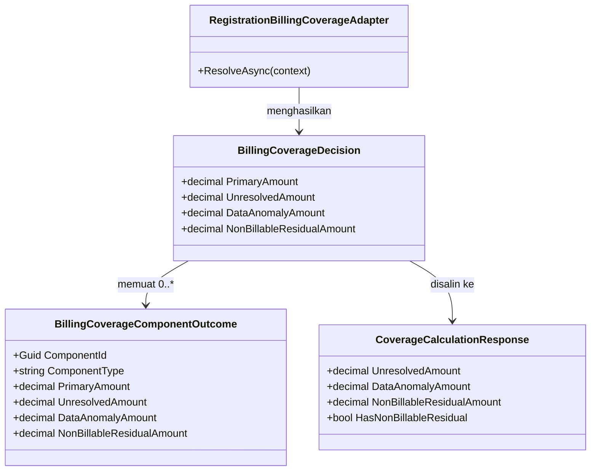

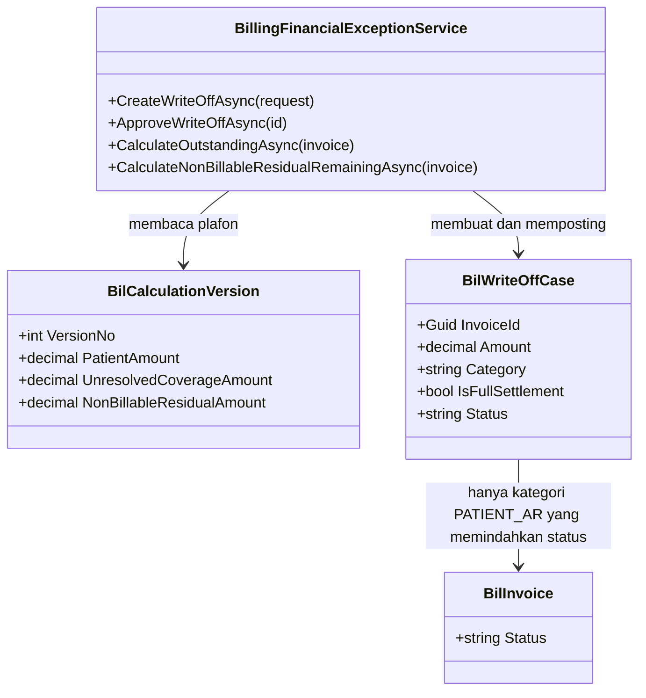

### Penjelasan setiap class yang berubah atau baru

#### `RegistrationBillingCoverageAdapter.ResolveAsync`

| Aspek | Penjelasan |
| --- | --- |
| **Status** | `Diperbarui` |
| **Lokasi file** | `Areas/HealthServices/BillingManagement/Billing/Services/BillingCoverageAdapter.cs` |
| Kategori | Service (adapter) |
| Dipanggil oleh | `BillingCalculationService.CalculateAsync` |
| Membuka transaksi database | Tidak — hanya membaca (`AsNoTracking`) |
| Perubahan pada amendment ini | ~~**Satu cabang.**~~ **DIPERLUAS menjadi dua cabang pada revisi `0.9`.** Pada jalur (5), ketika `residual > 0` dan `rule.IsAllowExcessPaymentByPatient == false`, nominalnya masuk akumulator baru `nonBillableResidual` — bukan `unresolved`. Cabang `IsAllowExcessPaymentByPatient == true` **tidak disentuh**: residual tetap jatuh ke pasien lewat identitas turunan (`BKC-DEC-070`). Revisi `0.9` menambahkan cabang kedua yang perlakuannya persis sama pada jalur (2) — lihat `BKC-DES-026` |
| Aturan yang **tidak** berubah | `Matches()`, `CalculateCoveredAmount()`, cap `MaxAmountPerVisit`/`MaxQuantityPerVisit`, jalur (1), (3), (4), dan seluruh perilaku `SelfPay()`. ~~Jalur (2) (`NotCovered` + `IsAllowExcessPaymentByPatient = false`) **tetap** menulis ke `unresolved` — lihat `BKC-OQ-093`~~ **DIKOREKSI revisi `0.9`**: jalur (2) ikut pindah ke `nonBillableResidual` (`BKC-DEC-089`, `BKC-DES-026`) |
| Catatan desain | `BillingCoverageDecision` adalah `record` posisional; **ketiga** titik pembentukannya (`ResolveAsync`, `SelfPay`, `DataAnomaly`) **MUST** ikut menerima argumen baru dalam urutan yang sama. `SelfPay()` dan `DataAnomaly()` mengembalikan `NonBillableResidualAmount = 0` |

##### Perubahan perilaku `ResolveAsync` — koreksi atas tabel revisi `0.7`

| Jalur | Revisi `0.7` | Revisi `0.8` | Dasar |
| --- | --- | --- | --- |
| (1) Tidak ada rule yang cocok | Pasien | **Tidak berubah** | `BKC-DEC-072` |
| (2) Rule `CoverageStatus = NotCovered` | `unresolved` bila `IsAllowExcessPaymentByPatient = false`, selain itu pasien | ~~Tidak berubah — dan sengaja tidak disentuh, lihat `BKC-OQ-093`~~ **DIKOREKSI revisi `0.9`: `nonBillableResidual`** bila `IsAllowExcessPaymentByPatient = false`, selain itu tetap pasien | `BKC-DEC-072`, `BKC-DEC-074`, **`BKC-DEC-089`**, `BKC-DES-026` |
| (3) `NeedApproval`/limit bulanan | Cabang dihapus | **Tidak berubah** | `BKC-DEC-071` |
| (4) Anomali data penjamin/encounter | `anomaly`, nominal jatuh ke pasien | **Tidak berubah** | `BKC-DEC-073`, `BKC-DES-010`–`011` |
| (5) Residual `CalculateCoveredAmount` dengan `IsAllowExcessPaymentByPatient = true` | Pasien | **Tidak berubah** | `BKC-DEC-070` |
| (5) Residual `CalculateCoveredAmount` dengan `IsAllowExcessPaymentByPatient = false` | `unresolved` | **`nonBillableResidual`** — nominal yang sama, ember yang berbeda, dan ember itu punya tindak lanjut: pengajuan write-off oleh Finance | **`BKC-DEC-080`**, `BKC-DES-021`, `BKC-DES-022` |

> **Contoh berangka.** Kunjungan rawat jalan pasien asuransi. Tindakan Fisioterapi Rp 100.000 cocok dengan aturan yang menanggung 70% dan menandai `IsAllowExcessPaymentByPatient = false`.
>
> | Nominal | Revisi `0.7` | Revisi `0.8` |
> | --- | ---: | ---: |
> | Subtotal Asuransi (`primaryAmount`) | Rp 70.000 | Rp 70.000 |
> | Subtotal Mandiri (`patientAmount`) | Rp 0 | Rp 0 |
> | `unresolvedAmount` | Rp 30.000 | Rp 0 |
> | `nonBillableResidualAmount` | — | Rp 30.000 |
> | Total Tagihan | Rp 100.000 | Rp 100.000 |
>
> **Yang dibayar pasien tidak bergeser satu rupiah pun.** Yang berubah adalah nasib Rp 30.000 itu sesudahnya: pada revisi `0.7` ia berhenti sebagai angka bernama tanpa tindak lanjut; pada revisi `0.8` ia muncul di layar Pengecualian Finansial sebagai nominal yang menunggu pengajuan write-off, dan setelah disetujui orang kedua ia tercatat sebagai keputusan finansial bernama pelaku dan beralasan.

#### `BillingCoverageComponentOutcome`

| Aspek | Penjelasan |
| --- | --- |
| **Status** | `Diperbarui` |
| **Lokasi file** | `Areas/HealthServices/BillingManagement/Billing/Services/BillingCoverageAdapter.cs` |
| Kategori | Record kontrak internal antar-service (bukan entity) |
| Field penting **baru** | `NonBillableResidualAmount` (`decimal`) |
| Catatan desain | Identitas turunan porsi pasien menjadi `PatientAmount = component.Amount − PrimaryAmount − UnresolvedAmount − DataAnomalyAmount − NonBillableResidualAmount`. Karena nominal yang sama sebelumnya sudah dikurangkan lewat `UnresolvedAmount`, hasil akhirnya **identik** — perubahan ini memindahkan suku, bukan menambah pengurang baru. Nominal sudah dibulatkan dua desimal oleh `CalculateCoveredAmount` dan **MUST NOT** dibulatkan ulang |

#### `BillingCoverageDecision`

| Aspek | Penjelasan |
| --- | --- |
| **Status** | `Diperbarui` |
| **Lokasi file** | `Areas/HealthServices/BillingManagement/Billing/Services/BillingCoverageAdapter.cs` |
| Field penting **baru** | `decimal NonBillableResidualAmount` |
| Makna `UnresolvedAmount` sesudah amendment ini | ~~Menyisakan **satu** sebab: rule `CoverageStatus = NotCovered` dengan `IsAllowExcessPaymentByPatient = false` (jalur 2).~~ **DIKOREKSI revisi `0.9`:** sebab terakhir itu ikut pindah, sehingga `ResolveAsync` **tidak lagi punya satu pun jalur** yang mengisi `UnresolvedAmount` (`BKC-DES-027`). Nama field tetap tidak diganti dan field-nya tetap ada — penggantian nama maupun penghapusan merusak konsumen tanpa menambah kemampuan, alasan yang sama dengan `BKC-DES-013` |
| Catatan desain | Ketiga titik pembentukan record ini **MUST** berubah bersamaan. Uji regresi jalur `SelfPay()` wajib ada: kesalahan urutan argumen pada `record` posisional paling mudah terjadi di sini dan paling terlambat ketahuan |

#### `BillingCalculationService.ApplyCoverageWaterfall`

| Aspek | Penjelasan |
| --- | --- |
| **Status** | `Diperbarui` |
| **Lokasi file** | `Areas/HealthServices/BillingManagement/Billing/Services/BillingCalculationService.cs` |
| Kategori | Service (perhitungan) |
| Perubahan pada amendment ini | (1) `NonBillableResidualAmount` diteruskan ke `CoverageCalculationResponse` dan ke kolom persist `BilCalculationVersion.NonBillableResidualAmount`. (2) Rumus porsi pasien menjadi `residualAfterExcess − unresolvedAmount − nonBillableResidualAmount` — **hasilnya tidak berubah**, karena suku yang dikurangkan hanya berpindah nama. (3) Invarian baru `BIL-VAL-043` ditegakkan |
| Aturan yang **tidak** berubah | `BIL-VAL-036` (penjaga `REJECTED` menguji `dataAnomalyAmount == 0`), `BIL-VAL-035`, `BIL-VAL-028`, batas `primary + excess + unresolved > coverableAmount`, dan `primary > eligibleAmount` |
| Catatan desain | `NonBillableResidualAmount` **MUST** ikut dijumlahkan pada pemeriksaan batas `> coverableAmount` — berbeda dari `DataAnomalyAmount` yang dikecualikan. Sebabnya berlawanan arah: nominal anomali sudah terwakili sebagai porsi pasien sehingga menjumlahkannya berarti menghitung dua kali, sedangkan residual non-billable **tidak** terwakili di suku mana pun dan justru akan lolos tanpa batas bila dikecualikan |

#### `CoverageCalculationResponse`

| Aspek | Penjelasan |
| --- | --- |
| **Status** | `Diperbarui` |
| **Lokasi file** | `Areas/HealthServices/BillingManagement/Billing/Dtos/BillingInvoiceDtos.cs` |
| Kategori | DTO Response (ikut tersimpan di `BreakdownSnapshot`) |
| Field penting **baru** | `decimal NonBillableResidualAmount`, `bool HasNonBillableResidual` |
| Catatan desain | `HasNonBillableResidual` disediakan terpisah dengan alasan yang **berbeda** dari `HasDataAnomaly`: bukan karena nominalnya bisa nol saat masalahnya nyata, melainkan karena layar Pengecualian Finansial perlu membedakan "tidak ada residual" dari "residual sudah habis ditulis-off". Nilainya `true` selama versi kalkulasi terkini memuat residual, terlepas dari sudah atau belum ditulis-off; sisa yang belum ditulis-off dibaca dari endpoint Pengecualian Finansial, bukan dari mesin kalkulasi |
| Perilaku tampilan | Layar kasir **MUST** tetap menampilkan **satu** baris "Selisih Tidak Ditagihkan (kontrak penjamin)" berisi `unresolvedAmount + nonBillableResidualAmount`. Kasir tidak berkepentingan membedakan sebabnya, dan dua baris bernama mirip di layar penagihan hanya menambah keraguan. Pemisahannya berguna di layar Pengecualian Finansial, bukan di layar kasir |

#### `CalculationItemResponse`, `AdministrationFeeCalculationResponse`, `RoomChargeCalculationResponse`

| Aspek | Penjelasan |
| --- | --- |
| **Status** | `Diperbarui` (ketiganya) |
| **Lokasi file** | `Areas/HealthServices/BillingManagement/Billing/Dtos/BillingInvoiceDtos.cs` |
| Field penting **baru** | `CalculationItemResponse`: `ItemNonBillableResidualAmount`, `TaxNonBillableResidualAmount`. `AdministrationFeeCalculationResponse`/`RoomChargeCalculationResponse`: `NonBillableResidualAmount` |
| Catatan desain | Seluruhnya bertipe nilai non-nullable berbawaan `0` sehingga snapshot lama tetap dapat dideserialisasi. Kebenarannya tetap dijaga `IsPerItemAllocationAvailable` (`BKC-DES-017`), bukan oleh `null`. Rincian per baris ini yang memungkinkan alasan write-off menyebut item mana yang menyumbang residual — tanpanya, Finance hanya melihat satu angka gabungan dan tidak dapat menulis alasan yang berarti |

#### `BilWriteOffCase`

| Aspek | Penjelasan |
| --- | --- |
| **Status** | `Diperbarui` |
| **Lokasi file** | `Areas/HealthServices/BillingManagement/Billing/Models/BilWriteOffCase.cs` |
| Kategori | Entity (persisted, tabel `public.BilWriteOffCase`) |
| Kolom penting **baru** | `Category` — `string`, `[Required, MaxLength(30)]`, nilai bawaan `BillingWriteOffCategories.PatientAr` |
| Daftar nilai yang berlaku | `PATIENT_AR` (bawaan; seluruh perilaku yang sudah berjalan), `NON_BILLABLE_RESIDUAL` (`BKC-DEC-080`) |
| Index | Index gabungan `(InvoiceId, Category, Status)` yang **memfilter** `IsDelete = false`, untuk menghitung sisa plafon dan `writeOffTotal` per kategori tanpa memindai seluruh case invoice |
| Perilaku hapus | Tidak berubah — soft-delete `IsDelete` warisan `IdentityModel`, tanpa cascade |
| Catatan desain | Nilai kategori **MUST NOT** dapat diubah setelah case dibuat. Mengubahnya berarti memindahkan uang antar-ember setelah keputusan diambil, dan itu tidak boleh terjadi tanpa reversal + pengajuan ulang |

#### `BillingWriteOffCategories`

| Aspek | Penjelasan |
| --- | --- |
| **Status** | `Baru` |
| **Lokasi file** | `Areas/HealthServices/BillingManagement/Billing/Models/BilWriteOffCase.cs` (berdampingan dengan `BillingWriteOffCaseStatuses`, mengikuti pola yang sudah ada di berkas itu) |
| Kategori | Static class berisi konstanta string |
| Isi | `PatientAr = "PATIENT_AR"`, `NonBillableResidual = "NON_BILLABLE_RESIDUAL"` |
| Catatan desain | Nilai konstanta **MUST NOT** diterjemahkan; ia kunci program dan ikut tersimpan di database. Label Bahasa Indonesianya milik layar |

#### `BillingFinancialExceptionService.CreateWriteOffAsync`

| Aspek | Penjelasan |
| --- | --- |
| **Status** | `Diperbarui` |
| **Lokasi file** | `Areas/HealthServices/BillingManagement/Billing/Services/BillingFinancialExceptionService.cs` |
| Kategori | Service (domain, pengecualian finansial) |
| Dipanggil oleh | `BillingFinancialExceptionsController.CreateWriteOff` |
| Membuka transaksi database | Ya — tidak berubah |
| Perubahan pada amendment ini | Plafon nominal bercabang mengikuti `request.Category`. `PATIENT_AR` tetap dibatasi outstanding pasien (pesan lama dipertahankan apa adanya). `NON_BILLABLE_RESIDUAL` dibatasi **sisa residual non-billable** = `BilCalculationVersion.NonBillableResidualAmount` versi terkini dikurangi jumlah write-off `NON_BILLABLE_RESIDUAL` berstatus `POSTED` pada invoice itu, ditambah kembali nominal yang sudah direversal (`BIL-VAL-040`). `IsFullSettlement` **MUST** `false` untuk kategori residual (`BIL-VAL-041`) |
| Aturan yang **tidak** berubah | `Idempotency-Key` + `PayloadHash`, `ExpectedInvoiceRowVersion`, `Reason` wajib maksimal 500 karakter, `EnsureLedgerMutableInvoice` (invoice `CLOSED`/`SETTLED_BY_WRITE_OFF` tetap menolak case baru), dan penolakan case `SUBMITTED` ganda |
| Catatan desain | `Category` **MUST** ikut ke dalam `PayloadHash`. Tanpa itu, dua pengajuan bernominal sama dengan kategori berbeda akan dianggap pengulangan idempotency yang sama, dan yang kedua diam-diam mengembalikan case yang pertama |

#### `BillingFinancialExceptionService.ApproveWriteOffAsync`

| Aspek | Penjelasan |
| --- | --- |
| **Status** | `Diperbarui` |
| **Lokasi file** | `Areas/HealthServices/BillingManagement/Billing/Services/BillingFinancialExceptionService.cs` |
| Perubahan pada amendment ini | Dua penjaga bercabang kategori. (1) Pemeriksaan ulang plafon sebelum posting memakai plafon kategorinya masing-masing. (2) Pemindahan `BilInvoice.Status` ke `SETTLED_BY_WRITE_OFF` **hanya** berlaku untuk `PATIENT_AR` dengan `IsFullSettlement = true` |
| Aturan yang **tidak** berubah | Maker-checker `BIL-VAL-017`, transisi `SUBMITTED` → `POSTED`, dan seluruh audit |
| Catatan desain | Bila kategori residual dibiarkan memindahkan status, tagihan yang porsi pasiennya **sudah lunas dibayar** akan tercatat sebagai "diselesaikan lewat write-off". Itu keterangan yang salah pada dokumen yang dibaca auditor, dan salahnya tidak terlihat dari nominal mana pun |

#### `BillingFinancialExceptionService.CalculateOutstandingAsync`

| Aspek | Penjelasan |
| --- | --- |
| **Status** | `Diperbarui` |
| **Lokasi file** | `Areas/HealthServices/BillingManagement/Billing/Services/BillingFinancialExceptionService.cs` |
| Perubahan pada amendment ini | `writeOffTotal` menyaring `Category == PATIENT_AR`. `adjustmentNet` mengecualikan adjustment reversal yang `ReversesWriteOffCaseId`-nya menunjuk case berkategori `NON_BILLABLE_RESIDUAL` |
| Catatan desain | Kedua penyaringan itu **satu paket**. Menyaring `writeOffTotal` saja akan membuat reversal write-off residual **menaikkan** outstanding pasien atas uang yang tidak pernah ada di sana — kesalahan yang arahnya berlawanan tetapi sama besarnya. Rumus akhirnya tetap `Math.Max(…, 0)` dan **MUST NOT** berubah bentuknya |

#### `BillingFinancialExceptionService.CalculateNonBillableResidualRemainingAsync`

| Aspek | Penjelasan |
| --- | --- |
| **Status** | `Baru` |
| **Lokasi file** | `Areas/HealthServices/BillingManagement/Billing/Services/BillingFinancialExceptionService.cs` |
| Kategori | Method pembantu privat, berpasangan dengan `CalculateOutstandingAsync` |
| Tanggung jawab utama | Menjawab satu pertanyaan: berapa rupiah residual non-billable pada invoice ini yang **belum** ditutup write-off |
| Bentuk logis | `NonBillableResidualAmount` versi kalkulasi terkini − jumlah `Amount` case `NON_BILLABLE_RESIDUAL` berstatus `POSTED` + jumlah nominal case tersebut yang sudah direversal, dijepit `Math.Max(…, 0)` |
| Membuka transaksi database | Tidak — hanya membaca |
| Catatan desain | Nilainya **MUST** ikut ditampilkan pada response `GET .../financial-exceptions/invoices/{invoiceId}` agar layar tidak menghitungnya sendiri dari daftar case. Perhitungan uang di sisi layar akan menyimpang dari server begitu ada satu case yang tidak ikut terkirim karena paging |

#### `CreateWriteOffRequest` dan `WriteOffResponse`

| Aspek | Penjelasan |
| --- | --- |
| **Status** | `Diperbarui` (keduanya) |
| **Lokasi file** | DTO pengecualian finansial pada `Areas/HealthServices/BillingManagement/Billing/Dtos/` — mengikuti berkas DTO tempat keduanya sudah berada |
| Jenis | `CreateWriteOffRequest`: Create. `WriteOffResponse`: Response |
| Field penting **baru** | `CreateWriteOffRequest.Category` — `string`, **opsional**, bawaan `"PATIENT_AR"` bila tidak dikirim, `[MaxLength(30)]`, hanya menerima dua nilai yang terdaftar. `WriteOffResponse.Category` — `string`, selalu terisi |
| Catatan desain | Field request dibuat **opsional berbawaan**, bukan wajib, supaya konsumen yang sudah ada tidak rusak oleh amendment ini — persis alasan yang sama dengan `BKC-DES-014`. Nilai di luar dua yang terdaftar ditolak `422`, **bukan** diam-diam diperlakukan sebagai `PATIENT_AR` |

### Arsitektur folder — perubahan

```text
Areas/HealthServices/BillingManagement/Billing/
├── Dtos/
│   ├── BillingInvoiceDtos.cs                        # Diperbarui: +NonBillableResidualAmount/
│   │                                                #   HasNonBillableResidual pada CoverageCalculationResponse,
│   │                                                #   +ItemNonBillableResidualAmount/TaxNonBillableResidualAmount,
│   │                                                #   +NonBillableResidualAmount pada AdminFee/RoomCharge,
│   │                                                #   versi 0.6 -> 0.7
│   └── (DTO pengecualian finansial)                 # Diperbarui: +Category pada CreateWriteOffRequest
│                                                    #   dan WriteOffResponse
├── Models/
│   ├── BilWriteOffCase.cs                           # Diperbarui: +kolom Category,
│   │                                                #   +static class BillingWriteOffCategories
│   └── BilCalculationVersion.cs                     # Diperbarui: +kolom NonBillableResidualAmount
├── Services/
│   ├── BillingCoverageAdapter.cs                    # Diperbarui: cabang residual jalur (5) diretarget,
│   │                                                #   +NonBillableResidualAmount pada Outcome dan Decision
│   ├── BillingCalculationService.cs                 # Diperbarui: ApplyCoverageWaterfall meneruskan dan
│   │                                                #   mempersist NonBillableResidualAmount, BIL-VAL-040
│   └── BillingFinancialExceptionService.cs          # Diperbarui: plafon per kategori, penjaga status,
│                                                    #   outstanding per kategori,
│                                                    #   +CalculateNonBillableResidualRemainingAsync
├── Controllers/
│   └── BillingFinancialExceptionsController.cs      # Sudah ada — tidak ada action baru;
│                                                    #   payload request/response yang berubah
└── Repositories/Configurations/                     # Diperbarui: index (InvoiceId, Category, Status)
                                                     #   pada BilWriteOffCase
```

Folder DTO submodul ini tetap bernama **`Dtos/`** (utang teknis yang sudah dicatat revisi `0.7`); berkas dan field baru **MUST** mengikuti pola yang sudah ada di dalamnya.

### Status model dan dampak migration

| Kelompok | Status | Dampak dan kolom yang berubah |
| --- | --- | --- |
| `BilWriteOffCase` | `Diperbarui` | **Satu kolom baru:** `Category` `varchar(30)` `NOT NULL` `DEFAULT 'PATIENT_AR'`. **Satu index baru:** `(InvoiceId, Category, Status)` dengan filter `IsDelete = false`. Tidak ada kolom yang dihapus, diganti nama, atau berubah tipe |
| `BilCalculationVersion` | `Diperbarui` | **Satu kolom baru:** `NonBillableResidualAmount` `numeric` `NOT NULL` `DEFAULT 0`, presisi mengikuti kolom uang yang sudah ada pada tabel yang sama (`PatientAmount`, `UnresolvedCoverageAmount`). Kolom `UnresolvedCoverageAmount` **tetap ada dan tetap diisi**, maknanya menyempit ke jalur (2) |
| `BilAdjustment` | `Sudah ada` | **Nol kolom berubah.** Kategori reversal dibaca lewat relasi `ReversesWriteOffCaseId` → `BilWriteOffCase.Category` |
| `BilInvoice`, `BilInvoiceItem` | `Sudah ada` | Nol kolom berubah |
| `MstInsuranceCoverageRule` | `Sudah ada` | Hanya dibaca. `IsAllowExcessPaymentByPatient` kini punya efek nyata yang konsisten (`BKC-DEC-074` terpenuhi) |
| Tabel baru | — | **Tidak ada** |

### Rencana migration, backfill, dan rollback

1. **Satu migration, dua kolom dan satu index.** Keduanya `NOT NULL` dengan `DEFAULT`, sehingga PostgreSQL menuliskannya sebagai perubahan metadata dan **tidak** menulis ulang seluruh tabel. Index dibuat `CONCURRENTLY` bila jumlah baris `BilWriteOffCase` di lingkungan tujuan sudah besar.
2. **Backfill = nilai bawaan, dan itu benar secara bisnis.** Seluruh `BilWriteOffCase` yang sudah ada memang write-off piutang pasien; `PATIENT_AR` adalah keterangan yang jujur untuk semuanya. Tidak ada baris lama yang perlu ditinjau manusia.
3. **`BilCalculationVersion.NonBillableResidualAmount` versi lama tetap `0`, dan itu juga benar.** Sebelum amendment ini, residual jenis ini tercatat pada `UnresolvedCoverageAmount`. Menulis ulang versi kalkulasi lama berarti mengubah bukti perhitungan yang kolom itu ada untuk melindunginya — larangan yang sama dengan revisi `0.7` butir 2.
4. **Akibat yang MUST diketahui pengguna: tidak ada tagihan yang berubah nilainya.** Berbeda dari amendment sebelumnya, perubahan ini **tidak** menggeser satu rupiah pun pada Total Tagihan, Subtotal Mandiri, maupun Subtotal Asuransi. Yang bergeser hanya **nama ember** tempat nominal yang sudah dikeluarkan dari tagihan pasien itu duduk. Tidak ada kelebihan bayar yang timbul, dan tidak ada refund yang perlu disiapkan.
5. **Urutan deploy.** Migration → backend (adapter, kalkulasi, pengecualian finansial dalam satu slice) → frontend. Frontend yang dideploy lebih dulu akan membaca `nonBillableResidualAmount` yang belum ada dan menampilkan Rp 0 pada baris selisih — terlihat seolah tidak ada residual, padahal ada.
6. **Rollback.** Rollback kode aman tanpa langkah mundur basis data: kedua kolom baru akan diabaikan kode lama. Bila migration ikut dimundurkan, `BilWriteOffCase` berkategori `NON_BILLABLE_RESIDUAL` yang sudah terlanjur `POSTED` akan **kehilangan pembedanya** dan ikut mengurangi outstanding pasien. Karena itu penurunan migration **MUST** didahului pemeriksaan bahwa tidak ada baris berkategori residual, dan bila ada, baris tersebut direversal lebih dulu lewat alur reversal yang sah.

### Rencana data master awal

Tidak ada tabel master baru dan tidak ada baris master baru. Yang **MUST** disiapkan tetap sama seperti revisi `0.7`, dengan satu penekanan yang berubah bobotnya:

| Master | Isi minimum agar perilaku benar | Sumber nilai | Pemilik |
| --- | --- | --- | --- |
| `MstInsuranceCoverageRule.IsAllowExcessPaymentByPatient` | Diisi sadar per aturan. Bawaannya `true`. **Sesudah amendment ini, nilai `false` bukan lagi sekadar penanda tampilan** — ia melahirkan kewajiban administratif berupa pengajuan write-off oleh Finance untuk setiap tagihan yang terkena. Aturan yang disetel `false` tanpa dasar kontrak akan membanjiri Finance dengan pengajuan yang tidak perlu | Kontrak kerja sama RS–asuransi | Insurance/Finance Owner |

Pemeriksaan sekali jalan yang **MUST** dilakukan sebelum rilis: berapa banyak baris `MstInsuranceCoverageRule` aktif yang hari ini bernilai `false`, dan apakah seluruhnya memang berdasar kontrak. Angka itu adalah perkiraan beban kerja write-off bulanan Finance, dan tanpa angka itu pilihan pemicu manual (`BKC-DES-023`) tidak dapat dinilai kelayakannya.

### Yang sengaja tidak dibuat

| Yang ditolak | Alasan |
| --- | --- |
| Memakai ulang `DataAnomalyAmount` sebagai penampung residual non-billable | `BKC-DES-021`. Kedua nominal memang sama-sama "bukan tanggungan pasien", tetapi yang satu menunggu Pendaftaran membetulkan data dan yang satu menunggu Finance mengajukan write-off. Menyatukannya membuat layar Pengecualian Finansial menawarkan write-off atas kesalahan data yang seharusnya dibetulkan, bukan ditulis-off — pengulangan persis penyakit yang `BKC-DES-010` sembuhkan |
| Memakai ulang `UnresolvedAmount` apa adanya tanpa field baru | `BKC-DES-021`. Selama jalur (2) belum diputuskan (`BKC-OQ-093`), satu field akan menampung nominal yang boleh ditulis-off bercampur nominal yang belum boleh — dan penjaga plafon tidak punya cara memisahkannya. **Catatan revisi `0.9`:** sesudah `BKC-DEC-089` kedua jalur boleh ditulis-off, tetapi field terpisah **tetap dipertahankan** — alasannya berpindah dari "memisahkan yang boleh dari yang belum boleh" menjadi "memisahkan uang yang menunggu Finance dari uang yang menunggu Pendaftaran" (`BKC-DES-027`) |
| Mesin kalkulasi membuat `BilWriteOffCase` berstatus `SUBMITTED` secara otomatis | `BKC-DES-023`, lima alasan pada tabel keputusan. Yang paling menentukan: maker-checker runtuh menjadi satu-mata, dan jalur baca berubah menjadi jalur tulis yang dapat dipicu setiap kasir |
| Menambah status keempat (`DRAFT`/`PENDING`) pada `BilWriteOffCase` | Mengubah state machine yang sudah `approved` demi menampung baris yang tidak seharusnya lahir otomatis. Bila pemicunya manual, statusnya cukup tiga |
| Kolom `IsNonBillableResidual` bertipe boolean | `BKC-DES-024`. Boolean menutup kemungkinan kategori ketiga tanpa kolom keempat, dan menyimpang dari pola `Status`/`Direction` yang sudah dipakai di berkas yang sama |
| Membaca plafon residual dari JSON `BreakdownSnapshot` | `BKC-DES-025`. Penjaga uang yang bergantung pada bentuk JSON dapat lumpuh oleh satu perubahan bentuk tanpa satu pun galat kompilasi |
| Membiarkan write-off residual memindahkan invoice ke `SETTLED_BY_WRITE_OFF` | `BKC-DES-024`. Tagihan yang porsi pasiennya sudah lunas dibayar akan tercatat "diselesaikan lewat write-off" — keterangan salah pada dokumen yang dibaca auditor |
| Menambah endpoint baru untuk pengajuan write-off residual | `POST .../financial-exceptions/write-offs` yang sudah ada cukup; yang bertambah hanya satu field opsional pada request. Endpoint kedua berarti dua alur maker-checker yang harus dijaga tetap sama selamanya |
| Daftar kerja lintas invoice ("semua tagihan yang menunggu write-off residual") | Berguna, tetapi tidak diminta `BKC-DEC-080` dan menuntut endpoint pencarian baru beserta hak aksesnya. Ditunda ke `POST-MVP`; untuk MVP, nominalnya terlihat pada tagihan yang sedang dibuka |
| Memblokir finalisasi invoice selama residual belum ditulis-off | Aturan bisnis baru yang tidak diminta `BKC-DEC-080`. Mengikuti presedennya sendiri pada `BKC-OQ-086`, desain ini memilih **memperingatkan, bukan memblokir**, dan mengajukannya sebagai `BKC-OQ-094` |
| ~~Merutekan jalur (2) (`NotCovered` + `IsAllowExcessPaymentByPatient = false`) ke write-off sekalian~~ **DICABUT revisi `0.9` — jalur (2) SEKARANG dirutekan** | `BKC-DEC-080` menyebut hanya residual perhitungan. Ekonominya memang mirip, tetapi kemiripan bukan keputusan pemilik. Diajukan sebagai `BKC-OQ-093` beserta rekomendasi. **`BKC-DEC-089` menyetujui rekomendasi itu**, sehingga penolakan ini tidak berlaku lagi; lihat `BKC-DES-026` |

### Security, privacy, exception, dan concurrency — tambahan

**Hak akses.** Tidak ada resource maupun action permission baru. Pengajuan tetap `[AccessPermission("BillingWriteOff", "Create")]`, persetujuan tetap `[AccessPermission("BillingWriteOff", "Approve")]`, reversal tetap `[AccessPermission("BillingFinancialException", "Reverse")]`, dan nominal residual terbawa oleh endpoint kalkulasi yang sudah dijaga `[AccessPermission("BillingInvoice", "Read")]`. Konsekuensi yang **MUST** dinyatakan terbuka: kasir pemegang `BillingInvoice : Read` melihat nominal residual, tetapi **tidak** memperoleh kewenangan menulis-off-kannya — pemisahan itu justru inti `BKC-DES-023`.

**Logging.** Pengajuan, persetujuan, dan reversal write-off sudah dicatat `AuditWriteOffAsync`, `AuditWriteOffApprovalAsync`, dan `AuditReversalAsync`. Payload audit **MUST** bertambah satu field `Category`, dan **MUST NOT** memuat nomor polis, nomor anggota, nama pasien, maupun `DescriptionSnapshot`.

**Kolom sensitif yang tersentuh.** `Reason` pada `BilWriteOffCase` diisi manusia dan **MUST NOT** memuat nomor polis, nomor anggota, maupun diagnosis. Aturan ini **MUST** muncul sebagai keterangan pada layar pengisian, bukan hanya di dokumen ini — kolom bebas teks yang tidak diberi rambu akan terisi apa saja.

**Exception dan jalur tidak normal.**

| Keadaan | Perilaku |
| --- | --- |
| Residual non-billable muncul pada tagihan `OPEN` | Kalkulasi **berhasil**. `nonBillableResidualAmount` terisi, porsi pasien tidak bertambah, Total Tagihan tidak berubah |
| Jumlah seluruh ember tanggungan melebihi biaya yang memenuhi syarat | `422` `BIL-VAL-043`; versi kalkulasi baru **tidak** dibuat |
| Pengajuan write-off `NON_BILLABLE_RESIDUAL` melebihi sisa residual | `422` `BIL-VAL-040` |
| Pengajuan write-off `NON_BILLABLE_RESIDUAL` dengan `IsFullSettlement = true` | `422` `BIL-VAL-041` |
| `Category` diisi teks di luar dua nilai terdaftar | `422` `BIL-VAL-042` — **bukan** diperlakukan sebagai `PATIENT_AR` |
| `Category` tidak dikirim sama sekali | Diperlakukan `PATIENT_AR`; perilaku konsumen lama tidak berubah |
| Invoice belum punya versi kalkulasi terkini | Pesan lama dipertahankan: "Invoice belum memiliki hasil perhitungan terkini." |
| Invoice sudah `CLOSED`/`SETTLED_BY_WRITE_OFF` | Pesan lama dipertahankan; case baru ditolak untuk **kedua** kategori |
| Write-off residual disetujui saat porsi pasien masih ada | Berhasil. Outstanding pasien **tidak berubah**, status invoice **tidak berpindah** |
| Reversal write-off residual | Berhasil. Sisa residual kembali terbuka untuk diajukan ulang; outstanding pasien **tidak berubah**; invoice **tidak** dipaksa kembali ke `OPEN` karena statusnya memang tidak pernah dipindahkan |
| Tagihan dihitung ulang setelah write-off residual `POSTED`, dan residualnya mengecil karena item dibatalkan | Sisa residual dapat menjadi negatif secara aritmetis; `CalculateNonBillableResidualRemainingAsync` menjepitnya ke `0`. Kelebihan write-off yang sudah terlanjur `POSTED` **MUST** diselesaikan lewat reversal, bukan lewat penyesuaian diam-diam |

**Concurrency.** Tidak ada pola baru. `CreateWriteOffAsync`/`ApproveWriteOffAsync` tetap memakai transaksi, `ExpectedInvoiceRowVersion`, dan `Idempotency-Key` yang sudah ada. `CalculateAsync` tetap tidak menulis satu pun `BilWriteOffCase` (`BKC-DES-023`), sehingga amendment ini **tidak menambah titik tulis baru pada jalur kalkulasi** — kolom `NonBillableResidualAmount` ditulis pada titik tulis `BilCalculationVersion` yang sudah ada.

### Trace dan approval

| Aspek | Nilai |
| --- | --- |
| Keputusan bisnis dasar | **`BKC-DEC-080`** — `approved` Product/Domain Owner 4 September 2026 (`00-interview-decisions.md`, amendment "Penutupan lima open question hasil `/design-business-module`") |
| Keputusan bisnis pendukung | `BKC-DEC-036` (mekanisme write-off, `approved` 20 Agustus 2026), `BKC-DEC-070`, `BKC-DEC-074` (keduanya `approved` 4 September 2026, ketegangannya ditutup `BKC-DEC-080`), `BKC-DEC-085` (wewenang ganda Product/Domain Owner + Finance/AR dikonfirmasi) |
| Pertanyaan terbuka yang ditutup | `BKC-OQ-084` — ditutup keputusan bisnisnya oleh `BKC-DEC-080`, dan ditutup desainnya oleh amendment ini |
| Keputusan arsitektur amendment ini | `BKC-DES-021`–`BKC-DES-025`, status **draft** |
| Keputusan arsitektur yang dipersempit | `BKC-DES-013` — makna `UnresolvedAmount` menyisakan jalur (2) saja. **Tidak** digugurkan |
| Pertanyaan terbuka baru | `BKC-OQ-093` (jalur `NotCovered` + `false`) — **DITUTUP** `BKC-DEC-089`, desainnya pada revisi `0.9`. `BKC-OQ-094` (finalisasi diblokir atau diperingatkan, dan perlakuan AR/AP handoff) — **DITUTUP** `BKC-DEC-090`/`BKC-DEC-091`. Keduanya memang **tidak memblokir** |
| Kontrak terdampak | `BIL-API-0.7`, `BIL-STATE-0.7`, `BIL-VALIDATION-0.7`, `BIL-TEST-0.7`, `BIL-CALCULATION-0.7`. `BIL-INTEGRATION` dan `BIL-PERMISSION` **tidak bergerak** — isinya tidak berubah |
| Acceptance test | `BIL-AT-055`–`BIL-AT-061`, beserta koreksi `BIL-AT-040` (`testing/acceptance-test-matrix.md`) |
| Backend SHA diaudit | `ffeb45a83a6282982214668acc57e15ac0652f04` **beserta working tree yang belum di-commit** |
| Frontend SHA diaudit | `00210f9a5fb2f4f69e57b8c90c57c63c788da792` **beserta working tree yang belum di-commit** |
| Status | ~~draft~~ **approved** — `BKC-DES-021`–`025` disetujui `BKC-DEC-088` (Product/Domain Owner + Finance/AR), 4 September 2026. Approval itu **bukan** otorisasi membuat atau menjalankan migration |

---

## Amendment lanjutan 4 September 2026 — Perluasan perutean write-off ke jalur `NotCovered` (revisi `0.9`)

> Revisi blueprint `0.9`, status ~~**draft**~~ **approved** 5 September 2026. Masukan keputusan bisnis: **`BKC-DEC-089`** — `approved` Product/Domain Owner + Finance/AR 4 September 2026, menutup `BKC-OQ-093`. Amendment ini **memperluas jangkauan** `BKC-DES-021`–`025`; ia tidak merancang ulang satu pun di antaranya.
>
> Keputusan arsitektur baru pada amendment ini diberi ID `BKC-DES-026` dan `BKC-DES-027`. Keduanya keputusan **teknis** dalam wewenang desain. Statusnya ~~**draft**~~ **approved** — `BKC-DES-026`–`027` disetujui Product/Domain Owner ("Saya approve untuk case diatas", wewenang ganda Finance/AR `BKC-DEC-085`), 5 September 2026, sesudah pertanyaan "kenapa `BE-BKC-030` masih `BLOCKED` oleh `BKC-GATE-06`" dijawab dengan tiga penyebabnya.

### Tujuan dan batas amendment ini

Revisi `0.8` merutekan **satu** jalur ke write-off: sisa perhitungan tanggungan (jalur 5) pada aturan yang menandai `IsAllowExcessPaymentByPatient = false`. Jalur (2) — aturan yang secara eksplisit menyatakan `CoverageStatus = NotCovered` **dan** menandai `IsAllowExcessPaymentByPatient = false` — sengaja ditinggalkan di jalur lama (`unresolved`), karena kalimat `BKC-DEC-080` secara harfiah hanya menyebut residual perhitungan. Selisihnya diajukan apa adanya sebagai `BKC-OQ-093`, lengkap dengan rekomendasi bahwa sebaiknya keduanya diperlakukan sama.

`BKC-DEC-089` menyetujui rekomendasi itu. Alasan pemiliknya satu kalimat, dan kalimat itulah yang menjadi dasar seluruh amendment ini: **kedua jalur sama-sama berarti "penjamin tidak membayar, DAN kontrak yang sama melarang menagihkannya ke pasien"**. Sumber angkanya berbeda — yang satu lahir dari aturan yang menolak menanggung sama sekali, yang satu dari persentase tanggungan yang tidak penuh — tetapi nasib uangnya identik: tidak dapat ditagihkan kepada siapa pun, sehingga rumah sakit yang menanggungnya lewat mekanisme Pengecualian Finansial/write-off (`BKC-DEC-036`). Pemilik secara eksplisit **menolak** membedakan perlakuan keduanya hanya karena sumber angkanya berbeda.

**Yang ada di dalam amendment ini**: satu syarat yang diperlebar pada `ResolveAsync`, dan satu konsekuensi yang harus dinyatakan terbuka atas `UnresolvedAmount`.

**Di luar scope, dan sengaja tidak disentuh**:

| Yang tidak disentuh | Alasan |
| --- | --- |
| `BKC-DES-021`, `BKC-DES-023`, `BKC-DES-024`, `BKC-DES-025` | Keempatnya berlaku **apa adanya** untuk jalur (2). Rinciannya pada tabel "Empat keputusan yang tidak berubah" di bawah |
| Formula `CalculateCoveredAmount` dan `Matches()` | Sama seperti revisi `0.8`: yang berubah adalah **ke mana** nominalnya pergi, bukan **berapa** besarnya. Jalur (2) bahkan tidak memanggil `CalculateCoveredAmount` sama sekali |
| Skema basis data | **Nol kolom baru, nol index baru, nol migration tambahan.** Migration `BKC-DES-024` yang sudah dirancang revisi `0.8` sudah cukup dan tidak berubah satu baris pun |
| Kontrak `state`, `validation`, `integration`, `permission` | Isinya tidak bergerak. Alasannya dijelaskan pada bagian "Kontrak yang tidak bergerak" di bawah |
| `BKC-DEC-090` (finalisasi diperingatkan, bukan diblokir) dan `BKC-DEC-091` (residual non-billable di luar alur AR/AP) | Keduanya keputusan bisnis yang **sudah** `approved`, tetapi desainnya **belum** ditulis dan bukan bagian addendum ini. Keduanya perlu pass tersendiri |

### Bukti as-is — dibaca langsung pada HEAD `ffeb45a8` beserta working tree

| Fakta yang menjadi dasar desain | Bukti |
| --- | --- |
| Jalur (2) dan jalur (5) berada di dalam **satu perulangan yang sama**, berjarak belasan baris | `BillingCoverageAdapter.cs` — `ResolveAsync`, cabang `NotCovered` pada baris 148–155 dan cabang residual pada baris 166–170, keduanya di dalam `foreach` komponen yang sama |
| Keduanya membaca **penanda kontrak yang sama** dari **objek `rule` yang sama** | Baris 150 `!rule.IsAllowExcessPaymentByPatient ? component.Amount : 0` dan baris 167 `!rule.IsAllowExcessPaymentByPatient ? residual : 0`. Bentuk ekspresinya nyaris identik; yang berbeda hanya nominal yang dipilih |
| Keduanya menulis ke **akumulator yang sama** hari ini | Baris 151 `unresolved += notCoveredUnresolved` dan baris 168 `unresolved += residualUnresolved` |
| Keduanya menulis `BillingCoverageComponentOutcome` pada **posisi argumen yang sama** | Baris 152–153 dan 169–170 — keduanya memakai `(ComponentId, ComponentType, primary, unresolved)` dengan `primary` bernilai `0` pada jalur (2) dan `covered` pada jalur (5) |
| Sesudah revisi `0.7`, cabang jalur (3) **dihapus** | Tabel "Perubahan perilaku `ResolveAsync` — sebelum dan sesudah" baris (3), `BKC-DEC-071`. Konsekuensinya menjadi dasar `BKC-DES-027` |
| Sesudah revisi `0.7`, jalur (4) tidak lagi memakai `Unresolved(...)` | Tabel yang sama baris (4), `BKC-DES-010`/`BKC-DES-011` — nominalnya pindah ke `DataAnomalyAmount` |

Gabungan tiga baris terakhir itulah yang melahirkan `BKC-DES-027`: sesudah jalur (2) ikut pindah, **tidak tersisa satu pun jalur** di dalam `ResolveAsync` yang mengisi `unresolved`.

### Keputusan arsitektur amendment ini

| ID | Keputusan | Dasar | Alasan |
| --- | --- | --- | --- |
| `BKC-DES-026` | Titik tangkap `BKC-DES-022` **diperlebar syaratnya**, bukan dipindah dan bukan digandakan. Akumulator `nonBillableResidual` yang sama menerima **dua** cabang di dalam `ResolveAsync`: (a) jalur (2), ketika `rule.CoverageStatus == "NotCovered"` dan `rule.IsAllowExcessPaymentByPatient == false` — seluruh `component.Amount` masuk `nonBillableResidual`, bukan `unresolved`; (b) jalur (5), ketika `residual > 0` dan `rule.IsAllowExcessPaymentByPatient == false` — tidak berubah dari revisi `0.8`. `BillingCoverageComponentOutcome` jalur (2) menjadi `PrimaryAmount = 0`, `UnresolvedAmount = 0`, `NonBillableResidualAmount = component.Amount` | **`BKC-DEC-089`**, `BKC-DES-021`, `BKC-DES-022` | Ini alasan yang sama dengan `BKC-DES-022`, hanya diterapkan pada satu cabang lagi: hanya `ResolveAsync` yang memegang objek `rule`, dan `IsAllowExcessPaymentByPatient` tidak pernah sampai ke `ApplyCoverageWaterfall`. Yang penting justru bentuk perubahannya: **satu akumulator, dua cabang** — bukan dua akumulator, bukan dua mekanisme, dan bukan kategori write-off ketiga. Bila jalur (2) diberi ember sendiri, layar Pengecualian Finansial akan menampilkan dua baris yang menuntut tindakan yang persis sama dari orang yang sama, dan Finance harus mengajukan dua write-off untuk satu tagihan tanpa satu pun alasan bisnis yang membedakannya |
| `BKC-DES-027` | `UnresolvedAmount` (record kontrak internal) dan kolom `BilCalculationVersion.UnresolvedCoverageAmount` **DIPERTAHANKAN apa adanya** — tidak diganti nama, tidak dihapus, tipenya tidak berubah, dan kolomnya tidak di-`DROP` — walaupun sesudah `BKC-DES-026` tidak ada satu pun jalur pada `ResolveAsync` yang mengisinya, sehingga nilainya **selalu `0`** pada setiap versi kalkulasi baru. Method `Unresolved(...)` pada adapter juga **dipertahankan** sebagai jalur yang tidak lagi dipanggil, bukan dihapus. Layar kasir **tetap** menjumlahkan `unresolvedAmount + nonBillableResidualAmount` seperti yang sudah diputuskan revisi `0.8` | **`BKC-DEC-089`**, `BKC-DES-013`, `BKC-DES-014` | Empat alasan. (1) **Versi kalkulasi lama tetap memuat angkanya.** Kolom itu adalah bukti perhitungan tagihan yang sudah terjadi; mengosongkan atau menghapusnya berarti menghapus bukti, larangan yang sama dengan revisi `0.7` butir 2 dan revisi `0.8` butir 3. (2) **Penghapusan field adalah perubahan yang merusak konsumen** tanpa menambah satu pun kemampuan — alasan yang sudah dipakai `BKC-DES-013` dan `BKC-DES-014`, dan `excessAmount` sudah menjadi presedennya: field yang permanen bernilai `0` **tetap dipertahankan**. (3) **Penjaga `BIL-VAL-043` tetap menjumlahkannya**, dan menjumlahkan nol tidak merugikan; mencabut suku itu dari rumus justru membuat rumus berbeda antara versi lama dan baru. (4) **Angka nol yang jujur lebih baik daripada field yang hilang**: konsumen yang membaca `unresolvedAmount = 0` tetap mendapat jumlah yang benar, sedangkan konsumen yang field-nya lenyap mendapat galat |

### Empat keputusan revisi `0.8` yang **tidak** berubah, beserta sebabnya

Ini bagian terpenting bagi pembaca yang perlu memastikan addendum ini benar-benar kecil.

| Keputusan | Berubah? | Sebab |
| --- | :---: | --- |
| `BKC-DES-021` — field tersendiri `NonBillableResidualAmount` | **Tidak** | Field-nya justru menjadi lebih tepat, bukan kurang. Ketiga ember tetap dibedakan oleh **siapa yang harus bertindak**: `DataAnomalyAmount` menunggu Pendaftaran, `NonBillableResidualAmount` menunggu Finance, dan `UnresolvedAmount` kini tidak menunggu siapa pun karena tidak lagi terisi. Satu kalimat alasan pada tabel `BKC-DES-021` menjadi usang dan sudah diberi catatan di tempatnya |
| `BKC-DES-023` — pemicu write-off **manual** | **Tidak** | Kelima alasannya tidak menyinggung sumber nominal sama sekali. Maker-checker tetap runtuh bila mesin yang mengajukan; `CalculateAsync` tetap jalur baca berhak akses `BillingInvoice : Read`; nominal jalur (2) sama tidak finalnya dengan jalur (5) karena item masih bisa dibatalkan; `BilWriteOffCase` tetap hanya mengenal tiga status; dan `Reason` tetap wajib kalimat manusia. Menambah satu cabang penghasil angka **tidak menyentuh** satu pun di antaranya |
| `BKC-DES-024` — kolom `Category` dengan dua nilai | **Tidak** | Uang dari jalur (2) adalah jenis uang yang sama: tidak pernah masuk `PatientAmount`, tidak boleh mengurangi outstanding pasien, dan tidak boleh memindahkan invoice ke `SETTLED_BY_WRITE_OFF`. Ketiga perilaku yang ditentukan `Category` berlaku identik. Kategori ketiga **ditolak** — lihat bagian "Yang sengaja tidak dibuat" di bawah |
| `BKC-DES-025` — plafon dibaca dari kolom `BilCalculationVersion.NonBillableResidualAmount` | **Tidak** | Kolomnya kini menampung jumlah dari dua jalur, bukan satu. Bentuk plafonnya, cara membacanya, dan alasan tidak mengurai JSON `BreakdownSnapshot` seluruhnya tidak tersentuh. `CalculateNonBillableResidualRemainingAsync` juga tidak berubah satu baris pun |

### Perubahan perilaku `ResolveAsync` — tabel gabungan sesudah revisi `0.9`

| Jalur | Revisi `0.7` | Revisi `0.8` | Revisi `0.9` | Dasar |
| --- | --- | --- | --- | --- |
| (1) Tidak ada rule yang cocok | Pasien | Tidak berubah | **Tidak berubah** | `BKC-DEC-072` |
| (2) Rule `NotCovered`, `IsAllowExcessPaymentByPatient = true` | Pasien | Tidak berubah | **Tidak berubah** | `BKC-DEC-072`, `BKC-DEC-074` |
| (2) Rule `NotCovered`, `IsAllowExcessPaymentByPatient = false` | `unresolved` | Tidak berubah (`BKC-OQ-093` dibiarkan terbuka) | **`nonBillableResidual`** — ember dan tindak lanjut yang sama persis dengan jalur (5) | **`BKC-DEC-089`**, `BKC-DES-026` |
| (3) `NeedApproval`/limit bulanan | Cabang dihapus | Tidak berubah | **Tidak berubah** | `BKC-DEC-071` |
| (4) Anomali data penjamin/encounter | `anomaly`, nominal jatuh ke pasien | Tidak berubah | **Tidak berubah** | `BKC-DEC-073`, `BKC-DES-010`–`011` |
| (5) Residual, `IsAllowExcessPaymentByPatient = true` | Pasien | Tidak berubah | **Tidak berubah** | `BKC-DEC-070` |
| (5) Residual, `IsAllowExcessPaymentByPatient = false` | `unresolved` | **`nonBillableResidual`** | **Tidak berubah** | `BKC-DEC-080`, `BKC-DES-021`–`022` |
| **Jumlah jalur yang mengisi `unresolved`** | tiga | satu | **nol** | `BKC-DES-027` |

> **Contoh berangka.** Kunjungan rawat jalan pasien asuransi. Satu tindakan Akupunktur Rp 200.000 cocok dengan aturan yang berstatus `NotCovered` — penjamin memang tidak menanggung layanan ini — dan aturan yang sama menandai `IsAllowExcessPaymentByPatient = false`, artinya kontrak melarang biaya itu ditagihkan kepada pasien.
>
> | Nominal | Revisi `0.8` | Revisi `0.9` |
> | --- | ---: | ---: |
> | Subtotal Asuransi (`primaryAmount`) | Rp 0 | Rp 0 |
> | Subtotal Mandiri (`patientAmount`) | Rp 0 | Rp 0 |
> | `unresolvedAmount` | Rp 200.000 | Rp 0 |
> | `nonBillableResidualAmount` | Rp 0 | Rp 200.000 |
> | Total Tagihan | Rp 200.000 | Rp 200.000 |
> | Yang ditagih kasir | Rp 0 | Rp 0 |
>
> **Sekali lagi, yang dibayar pasien tidak bergeser satu rupiah pun**, dan angka pada baris "Selisih Tidak Ditagihkan (kontrak penjamin)" di layar kasir juga tidak bergeser — layar menjumlahkan kedua field, dan jumlahnya tetap Rp 200.000. Yang berubah adalah nasib Rp 200.000 itu sesudahnya: pada revisi `0.8` ia berhenti sebagai angka bernama tanpa tindak lanjut, sementara Rp 30.000 pada contoh revisi `0.8` — yang secara ekonomi persis sama keadaannya — sudah punya jalur penanggungan. Pada revisi `0.9` keduanya berjalan di jalur yang sama.

> **Contoh pembanding, supaya batasnya jelas.** Aturan `NotCovered` yang **tidak** menandai `IsAllowExcessPaymentByPatient = false` (yaitu nilai bawaannya, `true`) tetap berperilaku seperti sebelumnya: Rp 200.000 itu menjadi Subtotal Mandiri dan **ditagih kasir kepada pasien**. Amendment ini hanya menyentuh aturan yang penandanya di-set `false` secara sengaja.

### Penjelasan class yang berubah

Hanya **satu** class yang berubah pada amendment ini. Seluruh class lain yang disebut revisi `0.8` — `BillingCoverageComponentOutcome`, `BillingCoverageDecision`, `BillingCalculationService.ApplyCoverageWaterfall`, `CoverageCalculationResponse`, `CalculationItemResponse`, `BilWriteOffCase`, `BillingWriteOffCategories`, ketiga method `BillingFinancialExceptionService`, `CreateWriteOffRequest`, dan `WriteOffResponse` — **tidak bertambah, tidak berkurang, dan tidak berubah bentuknya**.

#### `RegistrationBillingCoverageAdapter.ResolveAsync`

| Aspek | Penjelasan |
| --- | --- |
| **Status** | `Diperbarui` |
| **Lokasi file** | `Areas/HealthServices/BillingManagement/Billing/Services/BillingCoverageAdapter.cs` |
| Kategori | Service (adapter) |
| Dipanggil oleh | `BillingCalculationService.CalculateAsync` |
| Membuka transaksi database | Tidak — hanya membaca (`AsNoTracking`) |
| Perubahan pada amendment ini | **Satu cabang lagi, pada perulangan yang sama.** Cabang `NotCovered` (jalur 2) menulis nominalnya ke `nonBillableResidual` — akumulator yang sudah diperkenalkan `BKC-DES-022` — bukan ke `unresolved`. `BillingCoverageComponentOutcome` untuk komponen itu diisi `NonBillableResidualAmount = component.Amount` dan `UnresolvedAmount = 0` |
| Aturan yang **tidak** berubah | `Matches()`, `CalculateCoveredAmount()`, seluruh cap per kunjungan, jalur (1), (3), (4), (5), perilaku `SelfPay()`, dan perilaku cabang `IsAllowExcessPaymentByPatient = true` pada jalur (2) maupun (5) |
| Catatan desain | Kedua cabang **MUST** memakai akumulator yang sama dan **MUST NOT** dipecah menjadi dua variabel. Nominal keduanya bermuara pada satu kolom, satu plafon, dan satu kategori write-off; dua variabel hanya akan dijumlahkan kembali beberapa baris kemudian, dan penjumlahan itu adalah tempat kesalahan berikutnya bersembunyi. Urutan argumen `BillingCoverageComponentOutcome` **MUST** diperiksa ulang pada cabang jalur (2), karena posisi `NonBillableResidualAmount` di sana berbeda dari posisi `UnresolvedAmount` yang selama ini diisi |

### Kontrak yang tidak bergerak, beserta sebabnya

| Kontrak | Bergerak? | Sebab |
| --- | :---: | --- |
| `contracts/validation-matrix.md` | **Tidak** | `BIL-VAL-040`–`043` seluruhnya dirumuskan atas **kolom, kategori, dan nominal**, bukan atas jalur asal angkanya. Plafon `BIL-VAL-040` tetap dibaca dari `BilCalculationVersion.NonBillableResidualAmount`; `BIL-VAL-041`/`042` bicara `IsFullSettlement` dan `Category`; `BIL-VAL-043` menjumlahkan `unresolvedAmount` yang kini selalu `0` sehingga hasil pemeriksaannya identik. Tidak ada satu kalimat pun yang perlu diperlebar |
| `contracts/state-transition-matrix.md` | **Tidak** | Tidak ada status baru, tidak ada transisi baru, dan tidak ada kategori baru. Perilaku posting dan reversal ditentukan `Category`, dan `Category` tidak bertambah nilainya |
| `contracts/integration-contract.md`, `contracts/permission-audit-matrix.md` | **Tidak** | Tidak ada integrasi baru dan tidak ada resource/action permission baru, sama seperti revisi `0.8` |
| `03-frontend-architecture.md` | **Tidak** | Layar kasir sudah diputuskan menjumlahkan kedua field sejak revisi `0.8`, dan layar Pengecualian Finansial sudah membaca satu nominal residual. Keduanya menerima nominal jalur (2) tanpa perubahan satu baris pun |
| `contracts/api-contract.md` | **Ya** | Makna `coverage.unresolvedAmount` bergeser lagi — dari "satu jalur tersisa" menjadi "selalu nol" — dan perubahan makna tanpa perubahan nama wajib disosialisasikan |
| `data/data-dictionary.md` | **Ya** | Peran kedua kolom uang itu berubah keterangannya, walaupun **tidak** ada kolom baru |
| `testing/acceptance-test-matrix.md` | **Ya** | Satu baris regresi revisi `0.8` menguji perilaku yang kini justru salah, dan jalur (2) belum punya uji sendiri |

### Skema, migration, dan data master

**Nol perubahan.** Amendment ini **tidak** menambah kolom, **tidak** menambah index, dan **tidak** menambah migration. Migration `BKC-DES-024` yang dirancang revisi `0.8` — dua kolom dan satu index — sudah cukup untuk keduanya, dan rencananya tidak berubah satu baris pun. Backfill juga tidak berubah: versi kalkulasi lama tetap `0` pada `NonBillableResidualAmount` dan tetap memuat angka lamanya pada `UnresolvedCoverageAmount`.

Rencana data master juga tidak berubah, dengan satu penekanan yang bertambah bobotnya: pemeriksaan sekali jalan sebelum rilis yang sudah diminta revisi `0.8` — berapa banyak `MstInsuranceCoverageRule` aktif bernilai `IsAllowExcessPaymentByPatient = false` — kini **MUST** dipecah dua, yaitu berapa di antaranya yang berstatus `NotCovered` dan berapa yang berstatus `Covered` dengan tanggungan sebagian. Keduanya sama-sama melahirkan pengajuan write-off, sehingga perkiraan beban kerja Finance adalah jumlah keduanya, bukan hanya kelompok kedua seperti perkiraan revisi `0.8`.

### Yang sengaja tidak dibuat

| Yang ditolak | Alasan |
| --- | --- |
| Kategori write-off ketiga, misalnya `NON_COVERED_RULE`, untuk membedakan jalur (2) dari jalur (5) | `BKC-DEC-089` **secara eksplisit menolak** membedakan perlakuan keduanya. Kategori ada untuk menentukan plafon, keikutsertaan pada outstanding pasien, dan perpindahan status invoice (`BKC-DES-024`) — ketiganya identik bagi kedua jalur. Kategori yang tidak mengubah satu pun perilaku hanya menambah nilai yang harus dijaga selamanya, dan memaksa Finance mengajukan dua write-off untuk satu tagihan |
| Ember uang keempat di samping `NonBillableResidualAmount` | Alasan `BKC-DES-021` justru menuntut sebaliknya: ember dibedakan oleh **siapa yang harus bertindak**, dan kedua jalur ini sama-sama menunggu Finance |
| Menghapus atau mengganti nama `UnresolvedAmount`/`UnresolvedCoverageAmount` yang kini selalu nol | `BKC-DES-027`, empat alasan. Yang paling menentukan: kolomnya masih memuat angka pada versi kalkulasi lama, dan angka itu bukti perhitungan tagihan yang sudah terjadi |
| Mengosongkan `UnresolvedCoverageAmount` pada versi kalkulasi lama supaya "konsisten" | Sama seperti larangan revisi `0.7` butir 2 dan revisi `0.8` butir 3: menulis ulang versi kalkulasi lama berarti mengubah bukti yang kolom itu ada untuk melindunginya. Konsistensi angka lintas waktu **bukan** tujuan; kejujuran catatan yang menjadi tujuan |
| Menghapus method `Unresolved(...)` pada adapter yang kini tidak dipanggil siapa pun | `BKC-DES-027`. Penghapusan itu sah secara teknis, tetapi berada di luar `BKC-DEC-089` dan menyentuh jalur yang menjadi jaring pengaman bila keputusan berikutnya membutuhkannya kembali. Dicatat sebagai kode yang tidak terpakai, bukan dibersihkan diam-diam pada addendum ini |
| Merancang perilaku warning finalisasi (`BKC-DEC-090`) dan penegasan AR/AP (`BKC-DEC-091`) sekalian | Keduanya keputusan bisnis tersendiri yang memang sudah `approved`, tetapi menuntut desain pada layar, alur finalisasi, dan kontrak yang tidak disentuh addendum ini. Menggabungkannya berarti addendum kecil berubah menjadi pass desain baru |

### Security, privacy, exception, dan concurrency

**Tidak ada perubahan sama sekali** terhadap revisi `0.8`. Tidak ada resource maupun action permission baru; pengajuan tetap `BillingWriteOff : Create`, persetujuan tetap `BillingWriteOff : Approve`, reversal tetap `BillingFinancialException : Reverse`, dan nominalnya tetap terbawa endpoint kalkulasi berhak akses `BillingInvoice : Read`. Payload audit tetap bertambah satu field `Category` seperti yang sudah diputuskan, dan `Reason` tetap **MUST NOT** memuat nomor polis, nomor anggota, nama pasien, maupun diagnosis.

Seluruh baris tabel "Exception dan jalur tidak normal" revisi `0.8` berlaku apa adanya untuk nominal jalur (2). Satu baris ditambahkan:

| Keadaan | Perilaku |
| --- | --- |
| Satu tagihan memuat nominal dari jalur (2) **dan** jalur (5) sekaligus | Keduanya dijumlahkan menjadi **satu** nominal `nonBillableResidualAmount`, satu plafon, dan cukup **satu** pengajuan write-off. Contoh: Rp 200.000 dari aturan `NotCovered` ditambah Rp 30.000 residual Fisioterapi menghasilkan satu nominal Rp 230.000, bukan dua pengajuan terpisah |

**Concurrency.** Tidak ada pola baru dan tidak ada titik tulis baru. `CalculateAsync` tetap tidak menulis satu pun `BilWriteOffCase` (`BKC-DES-023`).

### Trace dan approval

| Aspek | Nilai |
| --- | --- |
| Keputusan bisnis dasar | **`BKC-DEC-089`** — `approved` Product/Domain Owner + Finance/AR 4 September 2026 (`00-interview-decisions.md`, amendment "Penutupan `BKC-OQ-093` dan `BKC-OQ-094`") |
| Keputusan bisnis pendukung | `BKC-DEC-080` (perutean residual ke write-off), `BKC-DEC-036` (mekanisme write-off), `BKC-DEC-072`, `BKC-DEC-074`, `BKC-DEC-085` (wewenang ganda Product/Domain Owner + Finance/AR), `BKC-DEC-088` (approval `BKC-DES-021`–`025`) |
| Pertanyaan terbuka yang ditutup | `BKC-OQ-093` — keputusan bisnisnya ditutup `BKC-DEC-089`, dan **desainnya ditutup amendment ini** |
| Keputusan arsitektur amendment ini | `BKC-DES-026`, `BKC-DES-027`, status ~~draft~~ **approved** 5 September 2026 |
| Keputusan arsitektur yang diperluas | `BKC-DES-022` — syarat titik tangkapnya diperlebar dari satu cabang menjadi dua. **Tidak** digugurkan dan **tidak** digantikan |
| Keputusan arsitektur yang dipersempit lebih jauh | `BKC-DES-013` — makna `UnresolvedAmount` menyempit dari "satu jalur tersisa" menjadi "tidak ada jalur yang mengisinya". Field-nya tetap ada (`BKC-DES-027`) |
| Keputusan arsitektur yang **tidak** disentuh | `BKC-DES-021`, `BKC-DES-023`, `BKC-DES-024`, `BKC-DES-025` — seluruhnya berlaku apa adanya, alasannya pada tabel "Empat keputusan revisi `0.8` yang **tidak** berubah" |
| Kontrak terdampak | `BIL-API-0.8`, `BIL-TEST-0.8`, `BIL-CALCULATION-0.8`. `BIL-STATE`, `BIL-VALIDATION`, `BIL-INTEGRATION`, dan `BIL-PERMISSION` **tidak bergerak** — isinya tidak berubah |
| Acceptance test | `BIL-AT-062`–`BIL-AT-063`, beserta koreksi baris regresi jalur (2) (`testing/acceptance-test-matrix.md`) |
| Dampak skema | **Nol.** Tidak ada kolom, index, maupun migration tambahan |
| Backend SHA diaudit | `ffeb45a83a6282982214668acc57e15ac0652f04` **beserta working tree yang belum di-commit** |
| Frontend SHA diaudit | `00210f9a5fb2f4f69e57b8c90c57c63c788da792` **beserta working tree yang belum di-commit** |
| Status | ~~draft~~ **approved** — `BKC-DES-026`–`027` disetujui Product/Domain Owner (wewenang ganda Finance/AR, `BKC-DEC-085`), 5 September 2026. Approval itu tidak relevan dengan otorisasi migration/database — amendment ini nol perubahan skema |

---

# Amendment 7 September 2026 — Rumpun baru: Petty Cash (Voucher Kas Kecil)

> Revisi blueprint `1.0`, status **draft**. Masukan keputusan bisnis: **`PC-DEC-001`–`PC-DEC-013`**, seluruhnya `approved` Product/Domain Owner 7 September 2026 (`00-interview-decisions.md`, amendment "Kapabilitas baru: Petty Cash (Voucher Kas Kecil)"). Masukan audit kemampuan: `01-existing-capability-map.md` § 18 (`CAP-29`–`CAP-32`), dibaca pada backend SHA `dd31bc9`.
>
> Keputusan arsitektur amendment ini diberi ID **`PC-DES-001`–`PC-DES-014`**. Seluruhnya keputusan **teknis** dalam wewenang desain; tidak ada keputusan bisnis baru di dalamnya. Statusnya **draft** — approval tetap tindakan manusia.
>
> **Bentuk blueprint tidak berubah.** `billing-kasir` tetap `SINGLE`. Petty Cash masuk sebagai **rumpun baru di dalam blueprint yang sama**, mengikuti preseden Shift Kasir, Diskon, Deposit, Refund, dan Pengecualian Finansial. Uji pemecahan **tidak** dijalankan ulang pada pass ini; keputusannya sudah diambil pada `00-interview-decisions.md` amendment 7 September 2026.

## Tujuan dan batas amendment ini

Rumah sakit mengeluarkan uang tunai kecil setiap hari untuk keperluan operasional — ongkos transport kurir, konsumsi rapat, alat tulis, perbaikan kecil. Hari ini pengeluaran itu tidak tercatat di sistem sama sekali (`CAP-29`, **Missing**, dikonfirmasi nihil pada seluruh `Areas/HealthServices/BillingManagement/**`). Yang ada hanya kertas dan catatan manual, sehingga tidak ada seorang pun yang dapat menjawab dua pertanyaan paling dasar: **berapa sisa uang kas kecil sekarang**, dan **siapa yang menyetujui pengeluaran ini**.

Amendment ini merancang siklus hidup satu voucher kas kecil dari pengajuan sampai bukti nota, beserta satu kolam anggaran yang saldonya berjalan.

**Yang ada di dalam amendment ini**: empat tabel operasional baru, satu tabel master data baru, satu perluasan pada layanan penomoran yang sudah ada, tiga service baru, tiga controller baru, dan sebelas endpoint baru.

**Di luar scope, dan sengaja tidak disentuh**:

| Yang tidak disentuh | Alasan |
| --- | --- |
| Kas fisik Shift Kasir (`BilCashierShift`, `BilCashVarianceReview`) | `PC-DEC-001` menyatakan **eksplisit** anggaran Petty Cash adalah kolam terpisah. Pencairan voucher **MUST NOT** memengaruhi `SystemCash`, `PhysicalCash`, maupun `Variance` shift mana pun. Ini bukan kelalaian menyambung; ini keputusan pemilik yang dicatat |
| `BilInvoice` beserta seluruh rantai kalkulasi | Petty Cash bukan tagihan pasien. Tidak ada satu pun rupiah Petty Cash yang masuk `PatientAmount`, `PrimaryAmount`, `TaxAmount`, atau `NonBillableResidualAmount` |
| Master pegawai (`MstEmployee`, `WorkforceProfile`) | `PC-DEC-011` — "Nama Penerima" tetap teks bebas. Konsisten dengan pola `billing-kasir` sendiri yang tidak pernah menyentuh employee master di tempat lain mana pun (`CAP-32`) |
| `MstExpenseCategory` dan seluruh `Corporate/HumanResource/ExpenseManagement` | Bounded context yang berbeda, kepemilikan belum terdaftar, dan `01-existing-capability-map.md` § 18.3 menghentikan perbandingan lintas modul itu atas instruksi pemilik modul |
| Pengingat/eskalasi otomatis bukti nota terlambat | `PC-DEC-006` menunda eksplisit ke rilis berikutnya |
| Anggaran multi-kolam per unit/departemen | `PC-DEC-010` menunda eksplisit ke rilis berikutnya |
| Pengajuan mandiri oleh pegawai (*self-service*) | `PC-DEC-011` menunda eksplisit ke rilis berikutnya |
| Approval berjenjang berdasar nominal | `PC-DEC-004` menunda eksplisit ke rilis berikutnya |

## Bukti as-is — dibaca langsung pada HEAD `dd31bc9`

| Fakta yang menjadi dasar desain | Bukti |
| --- | --- |
| Tidak ada satu pun kapabilitas Petty-Cash-like di dalam modul ini | Pencarian `voucher`/`uang muka`/`Advance`/`kas kecil`/`petty` pada seluruh `Areas/HealthServices/BillingManagement/**` **nihil** (`CAP-29`) |
| Mekanisme penomoran sudah generik dan sudah dipakai ulang empat kali | `Billing/Models/BilNumberSeries.cs` (`SequenceKey`, `ScopeKey`, `ResetPolicy`, `CurrentValue`, `LastAllocatedAt`) dan `Billing/Services/BillingNumberSeriesService.cs` — `AllocateInvoiceNumberAsync`, `AllocateDepositAccountNumberAsync`, `AllocateCashierShiftNumberAsync`, `AllocateKwitansiNumberAsync`, seluruhnya memanggil helper privat `AllocateNumberAsync` yang sama (`CAP-30`) |
| Penomoran sudah aman di bawah pemakaian bersamaan | `BillingNumberSeriesService.cs` baris 170–177 — `pg_advisory_xact_lock(hashtext({0}))` dengan kunci `BIL_NUMBER_{sequenceKey}_{scopeKey}`, dan penolakan eksplisit bila dipanggil di luar transaction |
| Setiap jenis nomor punya kelas `Options` sendiri | `BillingInvoiceNumberOptions` (`BIL`, `DAILY`, 8 digit), `BillingDepositAccountNumberOptions` (`DEP`, `NEVER`, 8), `BillingCashierShiftNumberOptions` (`CSH`, `DAILY`, 6), `BillingKwitansiNumberOptions` (`KWS`, `DAILY`, 4) |
| Modul ini sudah punya enam master data ber-CRUD penuh, seluruhnya berprefix `Mst` | `MasterData/Models/`: `MstTaxRule`, `MstPaymentMethod`, `MstDiscountPolicy`, `MstRoomChargePolicy`, `MstAdministrationFeePolicy`, `MstRegister` |
| Master data modul ini memakai kode bisnis yang **diisi pengguna**, bukan dialokasikan sistem | `MstTaxRule.Code` (`[Required, MaxLength(30)]`) hadir pada `CreateTaxRuleRequest` sebagai field yang dikirim frontend |
| Pola controller master data sudah baku dan lengkap | `MasterData/Controllers/TaxRulesController.cs` — `filters/metadata`, `summary`, `/`, `options`, `{id}`, `POST /`, `PUT /{id}`, `{id}/deactivate`, `{id}/activate`, `DELETE /{id}` |
| Aksi bernama di luar CRUD **boleh**, asalkan nama aksinya sama di kedua atribut | `Cashier/Controllers/CashierShiftsController.cs` baris 102–103: `[AccessAction("Handover", …, AccessType = AccessTypes.Update)]` berpasangan `[AccessPermission("CashierShift", "Handover")]`. Keduanya bernilai `Handover`, sehingga tidak menghasilkan `403` permanen |
| Saldo berjalan + ledger append-only sudah menjadi pola modul ini | `BilDepositAccount.AvailableBalance` sebagai kolom saldo, didampingi `BilDepositMovement` sebagai ledger pergerakan |
| Actor selalu `ApplicationUser`, tidak pernah pegawai | `Cashier/Models/BilCashierShiftCommand.cs#ActorUserId` bertipe `Guid` menunjuk identitas login (`CAP-32`) |
| Jejak perintah workflow disimpan sebagai tabel tersendiri | `BilCashierShiftCommand` — `CommandType`, `ActorUserId`, `ActorRole`, `StatusBefore`, `StatusAfter`, `IdempotencyKey`, `PayloadHash`, `CorrelationId`, `CausationId`, `Reason`, `OccurredAt`, `ResponseJson` |
| Prefix `Bil` sudah terdaftar dan berstatus aktif | `rules/backend/engineering/MODULE_OWNERSHIP_PREFIX_REGISTRY.md` baris 20 — `HealthServices \| BillingManagement / Billing \| BUSINESS DOMAIN / MODULE \| Bil \| ACTIVE` |
| Prefix `Mst` adalah prefix terdaftar untuk master/reference dan **tidak** deprecated | Registry baris 14 — `Administrator / HealthServices \| Master / Reference \| MASTER / REFERENCE \| Mst \| ACTIVE` |

## Bounded context, aggregate, dan transaction boundary

Satu konteks baru ditambahkan pada tabel konteks di kepala dokumen ini.

| Context | Aggregate root | Invariant dan transaction boundary | Owner |
| --- | --- | --- | --- |
| `BIL-CTX-06` Petty Cash Operations | `BilPettyCashVoucher`, `BilPettyCashBudget` | Nomor voucher unik; saldo anggaran **MUST NOT** negatif; pengurangan saldo terjadi tepat sekali per voucher dan tepat pada transisi ke `Uang Diterima`; ledger pergerakan anggaran append-only; voucher `Ditolak` immutable | Kepala Kasir / Finance Operations |

**Batas transaksi yang mengikat:**

1. **Buat voucher** — alokasi nomor voucher dan penyimpanan barisnya berada dalam **satu** transaction. Alokasi nomor **MUST** berada di dalam transaction karena `BillingNumberSeriesService.AllocateNumberAsync` menolak dipanggil di luar transaction pada penyedia relational.
2. **Setujui voucher** — pembacaan saldo, pembacaan komitmen, penulisan status, dan penulisan jejak perintah berada dalam **satu** transaction. Saldo **tidak** berubah di sini (`PC-DEC-009`).
3. **Uang Diberikan** — penulisan status, penulisan satu baris ledger, pembaruan `CurrentBalance`, dan penulisan jejak perintah berada dalam **satu** transaction beserta kunci baris kolam. Ini satu-satunya titik yang mengurangi saldo.
4. **Input Nota** dan **Batalkan** — transaction tunggal tanpa sentuhan saldo sama sekali.

**Invariant yang tidak boleh dilanggar:**

> Untuk setiap voucher, jumlah baris `BilPettyCashBudgetMovement` bertipe `DISBURSEMENT` yang menunjuk voucher itu **MUST** tepat satu atau nol. Tidak pernah dua. Inilah yang membuat "uang diberikan dua kali karena tombolnya diklik dua kali" tidak mungkin terjadi.

## Kepemilikan data — baris baru

| Kelompok data | Modul pemilik | Dipakai modul ini | Dibuat ulang di modul ini |
| --- | --- | :---: | --- |
| Voucher kas kecil | Billing dan Kasir (modul ini) | Ya, **ditulis** | Ya, `BilPettyCashVoucher` — tidak ada pemilik lain |
| Jejak perintah voucher kas kecil | Billing dan Kasir (modul ini) | Ya, **ditulis** | Ya, `BilPettyCashVoucherCommand` |
| Kolam anggaran kas kecil beserta saldonya | Billing dan Kasir (modul ini) | Ya, **ditulis** | Ya, `BilPettyCashBudget` |
| Ledger pergerakan anggaran kas kecil | Billing dan Kasir (modul ini) | Ya, **ditulis** | Ya, `BilPettyCashBudgetMovement` |
| Kategori pengeluaran kas kecil | Billing Master Data (modul ini) | Ya, dibaca dan dikelola | Ya, `MstPettyCashCategory` — **bukan** memakai `MstExpenseCategory` milik HR |
| Identitas pengaju, penyetuju, dan pencair | Administrator / Identity (`ApplicationUser`) | Ya, hanya direferensikan lewat `Guid` | Tidak |
| Nama penerima uang | **Tidak ada pemilik** — teks bebas | Ya, disimpan sebagai teks | Tidak. `PC-DEC-011` melarang menautkannya ke master pegawai |
| Nomor seri (`BilNumberSeries`) | Billing dan Kasir (modul ini) | Ya, dipakai ulang | **Tidak** — satu baris `SequenceKey` baru pada tabel yang sudah ada |
| Kas fisik shift kasir | Cashier Operations (modul ini) | **Tidak** | Tidak. `PC-DEC-001` memutuskan keduanya terpisah |

## Class diagram — siklus hidup voucher

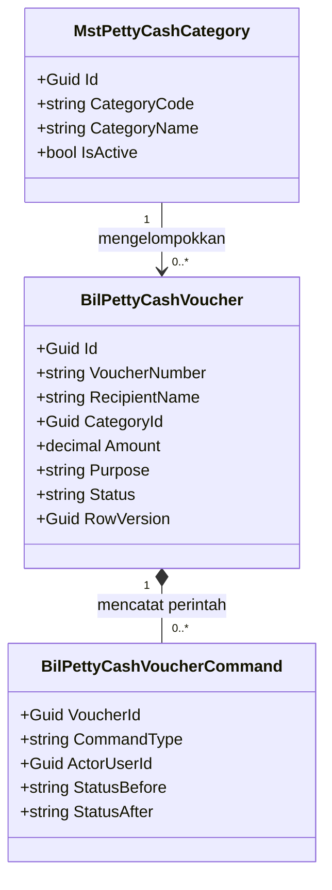

## Class diagram — kolam anggaran dan saldo berjalan

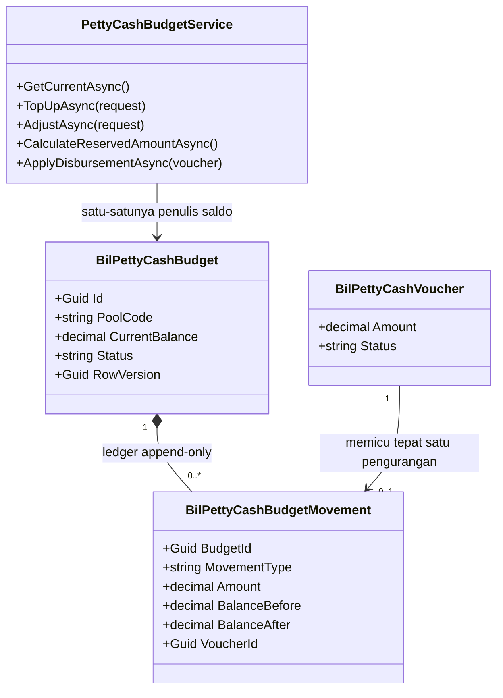

## Class diagram — penomoran yang dipakai ulang

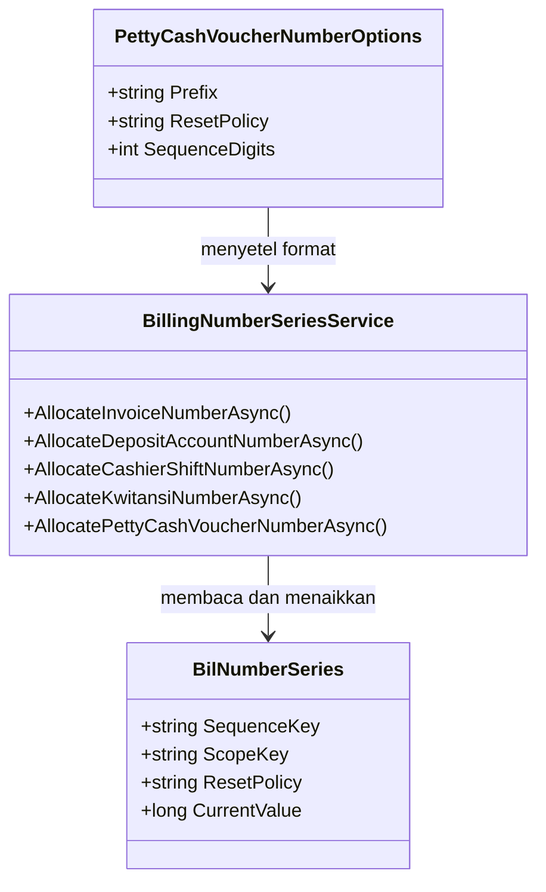

## Keputusan arsitektur amendment ini

| ID | Keputusan | Dasar | Alasan |
| --- | --- | --- | --- |
| `PC-DES-001` | Petty Cash menjadi **konteks tersendiri** `BIL-CTX-06` dengan dua aggregate root, **tanpa** satu pun foreign key ke `BilInvoice`, `BilCashierShift`, maupun `BilSettlement` | `PC-DEC-001` | Kolam anggaran Petty Cash dan kas fisik shift kasir adalah dua uang yang berbeda. Satu foreign key saja di antara keduanya akan mengundang orang berikutnya "merapikan" dengan menjumlahkannya, dan saat itu terjadi selisih kas shift akan ikut bergerak setiap kali kurir menerima ongkos transport — persis yang `PC-DEC-001` larang |
| `PC-DES-002` | Kategori memakai entity master data **baru** `MstPettyCashCategory` milik `billing-kasir` sendiri, ditempatkan di `MasterData/Models/`, ber-CRUD penuh mengikuti pola `MstTaxRule` | `PC-DEC-012`, `CAP-31` | Dua hal ditolak sekaligus. Pertama, memakai ulang `MstExpenseCategory` milik HR — bounded context berbeda dan kepemilikannya belum terdaftar (`01-existing-capability-map.md` § 18.3). Kedua, meniru pola bebas-teks "Tambah Biaya Lain-lain" (`BKC-DEC-047`) — arahnya berlawanan; `PC-DEC-012` meminta daftar terkelola, sedangkan `BKC-DEC-047` sengaja meniadakan katalog. Prefix `Mst` dipakai, bukan `Bil`: lihat catatan di bawah tabel ini |
| `PC-DES-003` | Status **dipersist sebagai kode mesin** (`WAITING_APPROVAL`, `APPROVED`, `CASH_RECEIVED`, `COMPLETED`, `REJECTED`); label Bahasa Indonesia yang dikunci `PC-DEC-013` adalah **kontrak tampilan**, dipetakan di lapisan penyajian | `PC-DEC-013`, pola `CashierShiftStatuses`/`BillingWriteOffCaseStatuses` | Seluruh status di modul ini dipersist sebagai `UPPER_SNAKE`. Menyimpan "Menunggu Persetujuan" ke kolom database berarti setiap perbandingan status bergantung pada spasi, kapitalisasi, dan ejaan sebuah kalimat Bahasa Indonesia — dan berarti memperbaiki salah ketik label kelak menuntut migration data. Kelima label tetap **terkunci** dan **MUST NOT** diterjemahkan ulang di layar |
| `PC-DES-004` | Saldo anggaran disimpan sebagai **kolom** `BilPettyCashBudget.CurrentBalance`, didampingi **ledger append-only** `BilPettyCashBudgetMovement` yang mencatat setiap pergerakan beserta `BalanceBefore` dan `BalanceAfter` | `PC-DEC-002`, pola `BilDepositAccount` + `BilDepositMovement` | Menghitung saldo dengan menjumlah ulang seluruh ledger setiap kali kartu "TOTAL PETTY CASH" dibuka akan melambat seiring umur sistem, dan menjadikan penjaga saldo bergantung pada agregasi yang berjalan di luar kunci baris. Menyimpan **hanya** kolom saldo tanpa ledger membuat pertanyaan "kenapa saldonya berkurang Rp 250.000 kemarin" tidak terjawab. Modul ini sudah memilih kombinasi keduanya untuk deposit pasien; Petty Cash mengikutinya |
| `PC-DES-005` | Penjaga persetujuan memakai **sisa yang benar-benar bebas**, yaitu `CurrentBalance − ReservedAmount`, dengan `ReservedAmount` = jumlah nominal seluruh voucher berstatus `APPROVED` yang belum dicairkan dan belum dibatalkan | `PC-DEC-008`, `PC-DEC-009` | Ini konsekuensi aritmetis dari dua keputusan yang berbeda titik waktunya: persetujuan diperiksa terhadap saldo (`PC-DEC-008`), tetapi saldonya baru berkurang saat pencairan (`PC-DEC-009`). Tanpa komitmen, sepuluh voucher Rp 500.000 dapat disetujui berurutan di atas saldo Rp 1.000.000 — seluruhnya lolos pemeriksaan, lalu tiga di antaranya gagal dicairkan. `PC-DEC-008` menyatakan tujuannya "mencegah saldo menjadi negatif"; komitmenlah satu-satunya cara memenuhi tujuan itu tanpa memindahkan titik pengurangan saldo |
| `PC-DES-006` | Saldo berkurang **tepat satu kali**, di dalam transaction aksi "Uang Diberikan", disertai **penjaga kedua** yang memeriksa ulang `CurrentBalance ≥ Amount` pada saat itu juga | `PC-DEC-009`, `PC-DEC-005` | Penjaga kedua bukan pengulangan yang mubazir. Antara persetujuan dan pencairan, Finance dapat menurunkan kolam lewat penyesuaian, atau voucher lain dapat dicairkan lebih dulu. Tanpa pemeriksaan ulang di dalam kunci, saldo dapat menjadi negatif walaupun setiap persetujuannya sah pada saat disetujui |
| `PC-DES-007` | Pembatalan oleh pemohon memakai **penandaan `IsCancel` warisan `IdentityModel`** (`IsCancel`, `CancelDateTime`, `CancelBy`), **bukan** status keenam | `PC-DEC-007`, `PC-DEC-013` | `PC-DEC-013` mengunci kosakata status pada lima nilai dan menyebutnya "lengkap"; `PC-DEC-007` mengizinkan pembatalan. Keduanya hanya dapat dipenuhi bersamaan bila pembatalan **bukan** status. `IdentityModel` sudah menyediakan penandaan pembatalan beserta pelaku dan waktunya untuk seluruh entity di repository ini, sehingga tidak ada kolom baru yang perlu dibuat. Layar menampilkan baris ber-`IsCancel = true` sebagai penanda "Dibatalkan" — itu keterangan tampilan, bukan nilai `Status` |
| `PC-DES-008` | Penomoran **memakai ulang** `BilNumberSeries` dan `BillingNumberSeriesService`. Ditambahkan `PettyCashVoucherNumberOptions` (bawaan `PTC`, `DAILY`, 4 digit), `AllocatePettyCashVoucherNumberAsync`, dan `SequenceKey` baru `BILLING_PETTY_CASH_VOUCHER` | `CAP-30` (`Ready to reuse`), `QBE-CODE-002`, `QBE-CODE-003` | Pola ini sudah terbukti dipakai ulang empat kali di modul yang sama, dan mewarisi gratis `pg_advisory_xact_lock` yang menjamin nomor tidak kembar ketika dua kasir menekan Simpan pada saat hampir bersamaan. Membuat mekanisme kelima berarti kelima tabel sequence harus dijaga tetap benar selamanya. Format nomor pada rujukan tampilan (`PC-1786239462244`, tampak berbasis milidetik epoch) **ditolak** — lihat "Yang sengaja tidak dibuat" |
| `PC-DES-009` | Setiap perpindahan status meninggalkan satu baris `BilPettyCashVoucherCommand` yang meniru bentuk `BilCashierShiftCommand` | `PC-DEC-003`, `PC-DEC-004`, pola `BilCashierShiftCommand` | `PC-DEC-003` menjadikan voucher `Ditolak` sebagai catatan audit permanen. Catatan audit yang hanya menyimpan status akhir tidak menjawab siapa menolak, kapan, dan dengan alasan apa. Tabel jejak perintah juga yang membuat `Idempotency-Key` bekerja: permintaan berulang dengan kunci sama mengembalikan `ResponseJson` yang tersimpan, bukan memproses ulang |
| `PC-DES-010` | `RecipientName` adalah **kolom teks** tanpa foreign key ke tabel mana pun | `PC-DEC-011`, `CAP-32` | Penerima kas kecil bisa pegawai, kurir, vendor kecil, atau pihak lain yang tidak pernah ada di master pegawai. Menautkannya ke master pegawai akan memaksa petugas mendaftarkan tukang ledeng sebagai pegawai hanya agar ongkosnya bisa dibayar. Ini juga konsisten dengan `billing-kasir` yang tidak pernah menyentuh employee master di tempat lain mana pun |
| `PC-DES-011` | Operasi yang menyentuh saldo mengambil **kunci penasihat** `pg_advisory_xact_lock` pada kunci `BIL_PETTY_CASH_BUDGET_{PoolCode}` di dalam transaction, **ditambah** pemeriksaan `RowVersion` | `PC-DEC-010`, pola `BillingNumberSeriesService` baris 170–177 | `PC-DEC-010` menetapkan satu kolam untuk seluruh rumah sakit, sehingga satu baris menjadi titik rebutan setiap pencairan. Optimistic concurrency saja akan membuat kasir sering melihat "Data telah berubah, muat ulang" pada jam sibuk. Kunci penasihat mengantre permintaannya alih-alih menolaknya, dan polanya sudah ada di modul yang sama |
| `PC-DES-012` | Aksi "Input Nota" memindahkan voucher dari `CASH_RECEIVED` langsung ke `COMPLETED` dalam **satu langkah**. Koreksi nomor nota pada voucher `COMPLETED` diizinkan dan **tetap** `COMPLETED`, tercatat sebagai perintah `PROOF_CORRECTED` | `PC-DEC-009`, `PC-DEC-013` | `PC-DEC-009` menyatakan `Selesai` "murni soal kelengkapan administratif (bukti sudah lengkap)". Tidak ada status antara antara "sudah ada nota" dan "selesai", sehingga memisahkannya menjadi dua langkah akan menciptakan status keenam yang `PC-DEC-013` tidak mengenalnya. Koreksi diizinkan karena salah ketik nomor nota adalah kejadian sehari-hari, dan menolaknya memaksa petugas membuat voucher baru untuk uang yang sudah terlanjur keluar |
| `PC-DES-013` | Voucher `REJECTED` **tidak memiliki endpoint apa pun** yang dapat mengubahnya. Ini ditegakkan **secara struktural**, bukan lewat pemeriksaan nilai di dalam service | `PC-DEC-003` | Aturan yang ditegakkan dengan `if (status == REJECTED) throw` dapat hilang saat seseorang menambah endpoint baru dan lupa menyalin penjaganya. Tidak adanya endpoint pengubah sama sekali tidak dapat lupa disalin. Pemohon yang masih membutuhkan pengeluaran itu membuat voucher baru bernomor baru |
| `PC-DES-014` | Tepat **satu** baris `BilPettyCashBudget` berkode `HOSPITAL_MAIN` di-seed, dan sebuah unique index memastikan hanya satu kolam berstatus `ACTIVE` yang boleh ada | `PC-DEC-010` | `PC-DEC-010` menunda multi-kolam, bukan menolaknya. Menyediakan tabel berkolom `PoolCode` sejak awal membuat rilis berikutnya cukup menambah baris, bukan membongkar skema. Unique index-lah yang menjaga penundaan itu tetap dipatuhi selama MVP |

### Catatan `PC-DES-002` — kenapa prefix `Mst`, bukan `Bil`

`01-existing-capability-map.md` § 18.8 merekomendasikan entity master data baru "prefix `Bil`, sudah terdaftar registry", tetapi pada kalimat yang sama menunjuk `MstPaymentMethod`, `MstBillingItemCategory`, `MstTaxRule`, dan `MstInsuranceCoverageRule` sebagai pola yang tepat untuk ditiru. Kedua bagian kalimat itu saling bertentangan, dan desain ini memilih yang kedua. Alasannya berurut:

1. **Registry memisahkan keduanya secara eksplisit.** Baris 14 menetapkan prefix `Mst` untuk kategori `MASTER / REFERENCE`; baris 20 menetapkan prefix `Bil` untuk kategori `BUSINESS DOMAIN / MODULE`. Kategori Petty Cash adalah data referensi yang dikelola Finance, bukan entity operasional yang punya siklus hidup transaksi.
2. **`BACKEND_ENGINEERING_CONTRACT.md` menyatakan `Mst*` masih berlaku dan tidak deprecated**, dan `QBE-NAM-002` memerintahkan memakai prefix registry yang disetujui.
3. **Enam dari enam master data modul ini memakai `Mst`.** `MstPettyCashCategory` duduk di folder yang sama, dilayani controller yang berbentuk sama, dan tampil di menu Master Data yang sama. Menamainya `BilPettyCashCategory` membuat satu dari tujuh berbeda sendiri tanpa alasan yang dapat dijelaskan kepada pembaca berikutnya.

Yang **tidak** berubah dari rekomendasi § 18.8: kategori ini **dimiliki `billing-kasir`**, tidak dibagi dengan tabel mana pun milik HR, dan tidak memakai ulang `MstExpenseCategory`. Selisih penamaan ini dicatat sebagai `PC-OQ-001` untuk diratifikasi pemilik arsitektur backend; bila pemilik memutuskan `BilPettyCashCategory`, perubahannya hanya nama kelas, nama berkas, nama configuration, nama DbSet, dan nama tabel — satu paket, sebelum berkas model pertama dibuat, sehingga tidak menimbulkan migration rename.

## Penjelasan setiap class yang baru atau berubah

### `BilPettyCashVoucher`

| Aspek | Penjelasan |
| --- | --- |
| **Status** | `Baru` |
| **Lokasi file** | `Areas/HealthServices/BillingManagement/PettyCash/Models/BilPettyCashVoucher.cs` |
| Kategori | Transaksi — aggregate root |
| Tanggung jawab utama | Menyimpan satu pengajuan uang kas kecil beserta seluruh perjalanannya: siapa penerimanya, untuk apa, berapa, sudah disetujui atau belum, sudah diserahkan atau belum, dan sudah ada bukti notanya atau belum |
| Field penting | `VoucherNumber`, `RecipientName`, `CategoryId`, `Amount`, `Purpose`, `Status`, `RequestedBy`, `SubmittedAt`, `DecidedBy`, `DecidedAt`, `RejectionReason`, `DisbursedBy`, `DisbursedAt`, `ProofReferenceNumber`, `ProofSubmittedBy`, `ProofSubmittedAt`, `CompletedAt`, `RowVersion` |
| Navigation property dan relasi | Menunjuk `MstPettyCashCategory` lewat `CategoryId` (`Restrict`); memiliki banyak `BilPettyCashVoucherCommand`; dirujuk paling banyak satu `BilPettyCashBudgetMovement` bertipe `DISBURSEMENT` |
| Pemakaian dalam alur bisnis | Dibuat kasir/petugas administrasi saat mengisi modal "Buat Voucher"; dibaca Kepala Kasir saat menyetujui; dibaca kasir saat menyerahkan uang; dibaca lagi saat nota masuk |
| Catatan desain | **Tidak ada** kolom yang menunjuk `BilInvoice`, `BilCashierShift`, maupun `BilSettlement` (`PC-DEC-001`). `RecipientName` adalah teks bebas dan **MUST NOT** diberi foreign key (`PC-DES-010`). Baris ber-`Status = REJECTED` **MUST NOT** disunting jalur mana pun (`PC-DES-013`) |
| Ekuivalen model lama | — (kapabilitas benar-benar baru, `CAP-29`) |

### `BilPettyCashVoucherCommand`

| Aspek | Penjelasan |
| --- | --- |
| **Status** | `Baru` |
| **Lokasi file** | `Areas/HealthServices/BillingManagement/PettyCash/Models/BilPettyCashVoucherCommand.cs` |
| Kategori | Transaksi — jejak audit append-only |
| Tanggung jawab utama | Mencatat setiap perintah yang pernah dijalankan atas sebuah voucher, beserta siapa yang menjalankannya dan status sebelum serta sesudahnya |
| Field penting | `VoucherId`, `CommandType`, `ActorUserId`, `ActorRole`, `EntityVersion`, `IdempotencyKey`, `PayloadHash`, `CorrelationId`, `CausationId`, `StatusBefore`, `StatusAfter`, `Amount`, `Reason`, `OccurredAt`, `ResponseJson` |
| Navigation property dan relasi | Milik `BilPettyCashVoucher` (`Restrict`) |
| Pemakaian dalam alur bisnis | Tidak pernah dilihat langsung oleh kasir; dibaca auditor dan dipakai layar riwayat voucher |
| Catatan desain | Baris di sini **MUST NOT** pernah disunting atau dihapus. `Reason` **MUST** terisi untuk `REJECT` dan `CANCEL`. Nilai `CommandType`: `SUBMIT`, `APPROVE`, `REJECT`, `CANCEL`, `DISBURSE`, `ATTACH_PROOF`, `PROOF_CORRECTED` |
| Ekuivalen model lama | — |

### `BilPettyCashBudget`

| Aspek | Penjelasan |
| --- | --- |
| **Status** | `Baru` |
| **Lokasi file** | `Areas/HealthServices/BillingManagement/PettyCash/Models/BilPettyCashBudget.cs` |
| Kategori | Transaksi — aggregate root, satu baris pada MVP |
| Tanggung jawab utama | Menyimpan saldo kas kecil yang berjalan. Inilah angka yang tampil pada kartu "TOTAL PETTY CASH" |
| Field penting | `PoolCode`, `PoolName`, `CurrentBalance`, `TotalTopUpAmount`, `TotalDisbursedAmount`, `Status`, `LastMovementAt`, `RowVersion` |
| Navigation property dan relasi | Memiliki banyak `BilPettyCashBudgetMovement` |
| Pemakaian dalam alur bisnis | Dibaca setiap layar Petty Cash dibuka; ditulis hanya saat Finance menambah anggaran, Finance menyesuaikan, atau kasir menyerahkan uang |
| Catatan desain | `CurrentBalance` **MUST NOT** ditulis dari mana pun selain `PettyCashBudgetService`, dan **MUST NOT** ditulis tanpa membuat baris ledger pasangannya pada transaction yang sama (`PC-DES-004`). Nilainya **MUST NOT** negatif |
| Ekuivalen model lama | — |

### `BilPettyCashBudgetMovement`

| Aspek | Penjelasan |
| --- | --- |
| **Status** | `Baru` |
| **Lokasi file** | `Areas/HealthServices/BillingManagement/PettyCash/Models/BilPettyCashBudgetMovement.cs` |
| Kategori | Transaksi — ledger append-only |
| Tanggung jawab utama | Menjelaskan **kenapa** saldo bergerak. Satu baris untuk setiap penambahan anggaran, setiap penyesuaian, dan setiap penyerahan uang |
| Field penting | `BudgetId`, `MovementType`, `Amount`, `BalanceBefore`, `BalanceAfter`, `VoucherId`, `Reason`, `ActorUserId`, `IdempotencyKey`, `CorrelationId`, `OccurredAt` |
| Navigation property dan relasi | Milik `BilPettyCashBudget` (`Restrict`); menunjuk paling banyak satu `BilPettyCashVoucher` (`Restrict`, nullable) |
| Pemakaian dalam alur bisnis | Dibaca Finance saat menelusuri "kenapa saldo berkurang"; ditulis otomatis oleh service |
| Catatan desain | Baris **MUST NOT** disunting atau dihapus; koreksi memakai baris `ADJUSTMENT` baru. Unique index `(VoucherId, MovementType)` dengan filter `MovementType = 'DISBURSEMENT' AND IsDelete = false` menegakkan invariant "satu voucher paling banyak satu pengurangan" |
| Ekuivalen model lama | — |

### `MstPettyCashCategory`

| Aspek | Penjelasan |
| --- | --- |
| **Status** | `Baru` |
| **Lokasi file** | `Areas/HealthServices/BillingManagement/MasterData/Models/MstPettyCashCategory.cs` |
| Kategori | Master data |
| Tanggung jawab utama | Menyimpan daftar kategori pengeluaran kas kecil yang boleh dipilih — Transport, Operasional, Konsumsi, Maintenance, ATK, dan seterusnya — yang dikelola Finance sendiri tanpa mengubah kode aplikasi |
| Field penting | `CategoryCode`, `CategoryName`, `Description`, `IsActive` |
| Navigation property dan relasi | Dirujuk banyak `BilPettyCashVoucher` (`Restrict`) |
| Pemakaian dalam alur bisnis | Dikelola Finance lewat menu Master Data; dibaca sebagai isi dropdown "Pilih Kategori" pada modal Buat Voucher |
| Catatan desain | Kategori yang sudah dipakai voucher mana pun **MUST NOT** dapat dihapus — dinonaktifkan saja, mengikuti pola `MstTaxRule`. `CategoryCode` diisi pengguna dan wajib unik, mengikuti `MstTaxRule.Code` yang juga diisi pengguna |
| Ekuivalen model lama | — . **Bukan** pengganti dan **bukan** turunan `MstExpenseCategory` milik HR |

### `BillingNumberSeriesService`

| Aspek | Penjelasan |
| --- | --- |
| **Status** | `Diperbarui` |
| **Lokasi file** | `Areas/HealthServices/BillingManagement/Billing/Services/BillingNumberSeriesService.cs` |
| Kategori | Service infrastruktur bersama |
| Dipanggil oleh | `BillingInvoiceService`, `BillingDepositService`, `BillingSettlementService`, `CashierShiftService`, dan **baru**: `PettyCashVoucherService` |
| Membuka transaksi database | Tidak — ia **menuntut** pemanggil sudah berada di dalam transaction |
| Perubahan pada amendment ini | Satu kelas `Options` baru (`PettyCashVoucherNumberOptions`), satu konstanta `SequenceKey` baru (`BILLING_PETTY_CASH_VOUCHER`), satu parameter constructor opsional baru, dan satu method `AllocatePettyCashVoucherNumberAsync`. Helper privat `AllocateNumberAsync` **tidak disentuh sama sekali** |
| Catatan desain | Parameter constructor baru **MUST** opsional berbawaan `new PettyCashVoucherNumberOptions()`, persis seperti tiga parameter opsional yang sudah ada — agar seluruh pemanggil dan test yang sudah berjalan tidak rusak |

### `PettyCashVoucherService`

| Aspek | Penjelasan |
| --- | --- |
| **Status** | `Baru` |
| **Lokasi file** | `Areas/HealthServices/BillingManagement/PettyCash/Services/PettyCashVoucherService.cs` |
| Kategori | Module service |
| Dipanggil oleh | `PettyCashVouchersController` |
| Membuka transaksi database | **Ya** — pada `CreateAsync`, `ApproveAsync`, `RejectAsync`, `CancelAsync`, `DisburseAsync`, dan `AttachProofAsync` |
| Tanggung jawab utama | Seluruh perpindahan status voucher, penulisan jejak perintah, penegakan idempotency, dan pemanggilan `PettyCashBudgetService` pada saat pencairan |
| Catatan desain | Service ini **MUST NOT** menulis `BilPettyCashBudget.CurrentBalance` sendiri; ia memanggil `PettyCashBudgetService.ApplyDisbursementAsync` di dalam transaction yang sama (`PC-DES-004`). Ia juga **MUST NOT** memiliki method apa pun yang menyunting voucher `REJECTED` (`PC-DES-013`) |

### `PettyCashBudgetService`

| Aspek | Penjelasan |
| --- | --- |
| **Status** | `Baru` |
| **Lokasi file** | `Areas/HealthServices/BillingManagement/PettyCash/Services/PettyCashBudgetService.cs` |
| Kategori | Module service |
| Dipanggil oleh | `PettyCashBudgetController` dan `PettyCashVoucherService` |
| Membuka transaksi database | **Ya** pada `TopUpAsync` dan `AdjustAsync`; **tidak** pada `ApplyDisbursementAsync`, yang justru **MUST** dipanggil dari dalam transaction milik pemanggilnya |
| Tanggung jawab utama | Satu-satunya penulis `CurrentBalance`. Mengambil kunci baris kolam, menulis ledger, memperbarui saldo, dan menghitung komitmen (`ReservedAmount`) |
| Catatan desain | `CalculateReservedAmountAsync` menjumlah `Amount` seluruh voucher `APPROVED` yang `IsCancel = false` dan `IsDelete = false`. Angka ini **MUST** dihitung server dan **MUST NOT** dihitung ulang di layar |

### `PettyCashCategoryService`

| Aspek | Penjelasan |
| --- | --- |
| **Status** | `Baru` |
| **Lokasi file** | `Areas/HealthServices/BillingManagement/MasterData/Services/PettyCashCategoryService.cs` |
| Kategori | Module service master data |
| Dipanggil oleh | `PettyCashCategoriesController` |
| Membuka transaksi database | Tidak — CRUD baris tunggal, mengikuti `TaxRuleService` |
| Tanggung jawab utama | CRUD kategori, metadata filter, ringkasan, opsi dropdown, aktivasi/nonaktivasi, dan penolakan penghapusan kategori yang sudah dipakai |

### `PettyCashVouchersController`

| Aspek | Penjelasan |
| --- | --- |
| **Status** | `Baru` |
| **Lokasi file** | `Areas/HealthServices/BillingManagement/PettyCash/Controllers/PettyCashVouchersController.cs` |
| Kategori | Controller |
| Service yang dipakai | `PettyCashVoucherService` |
| Atribut akses | `[Authorize]`, `[AccessController("HEALTH_SERVICE_BILLING_MANAGEMENT_PETTY_CASH", …, "Petty Cash Vouchers", AreaName = "HealthServices", ControllerName = "PettyCashVoucher")]`, `[Tags("Health Services / Billing Management / Petty Cash / Vouchers")]` |
| Endpoint yang diurus | `GET /filters/metadata`, `GET /summary`, `GET /`, `GET /{id}`, `POST /`, `POST /{id}/approve`, `POST /{id}/reject`, `POST /{id}/cancel`, `POST /{id}/disburse`, `POST /{id}/proofs` |
| Catatan desain | Controller **MUST NOT** menyentuh `ApplicationDbContext` (`QBE-SVC-001`) dan **MUST NOT** membentuk nomor voucher (`QBE-CODE-002`). Arketipenya **aggregate ber-lifecycle**, sehingga tidak ada `GET /options`, tidak ada `PATCH /{id}/status` generik, dan tidak ada `DELETE /{id}` |

### `PettyCashBudgetController`

| Aspek | Penjelasan |
| --- | --- |
| **Status** | `Baru` |
| **Lokasi file** | `Areas/HealthServices/BillingManagement/PettyCash/Controllers/PettyCashBudgetController.cs` |
| Kategori | Controller |
| Service yang dipakai | `PettyCashBudgetService` |
| Atribut akses | `[Tags("Health Services / Billing Management / Petty Cash / Budget")]`, `ControllerName = "PettyCashBudget"` |
| Endpoint yang diurus | `GET /current`, `GET /movements`, `POST /top-ups`, `POST /adjustments` |

### `PettyCashCategoriesController`

| Aspek | Penjelasan |
| --- | --- |
| **Status** | `Baru` |
| **Lokasi file** | `Areas/HealthServices/BillingManagement/MasterData/Controllers/PettyCashCategoriesController.cs` |
| Kategori | Controller master data |
| Service yang dipakai | `PettyCashCategoryService` |
| Atribut akses | `[Tags("Health Services / Billing Management / Master Data / Petty Cash Category")]`, `ControllerName = "PettyCashCategory"` |
| Endpoint yang diurus | Sembilan endpoint baseline master data, mengikuti `TaxRulesController` apa adanya |

### `BillingManagementServiceCollectionExtensions`

| Aspek | Penjelasan |
| --- | --- |
| **Status** | `Diperbarui` |
| **Lokasi file** | `Areas/HealthServices/BillingManagement/Billing/BillingManagementServiceCollectionExtensions.cs` |
| Perubahan pada amendment ini | Tiga `AddScoped` baru (`PettyCashVoucherService`, `PettyCashBudgetService`, `PettyCashCategoryService`) dan satu `AddOptions<PettyCashVoucherNumberOptions>().BindConfiguration(...).ValidateOnStart()`, mengikuti tiga blok `Options` yang sudah ada |

### `ApplicationDbContext`

| Aspek | Penjelasan |
| --- | --- |
| **Status** | `Diperbarui` |
| **Lokasi file** | `Repositories/ApplicationDbContext.cs` |
| Perubahan pada amendment ini | Lima `DbSet` baru: `BilPettyCashVouchers`, `BilPettyCashVoucherCommands`, `BilPettyCashBudgets`, `BilPettyCashBudgetMovements`, `MstPettyCashCategories`, beserta registrasi kelima configuration-nya |

## Perpindahan status — ringkasan bagi implementer

Kontrak lengkapnya ada di [`contracts/state-transition-matrix.md`](./contracts/state-transition-matrix.md). Ringkasan berikut hanya memperlihatkan hubungan status persisted dengan label yang dikunci `PC-DEC-013`, dan di titik mana saldo bergerak.

| Kode persisted | Label terkunci (`PC-DEC-013`) | Saldo bergerak? | Aksi keluar yang tersedia |
| --- | --- | :---: | --- |
| `WAITING_APPROVAL` | `Menunggu Persetujuan` | Tidak | Setujui, Tolak, Batalkan (pemohon) |
| `APPROVED` | `Disetujui` | Tidak — hanya **dikomitmenkan** (`PC-DES-005`) | Uang Diberikan |
| `CASH_RECEIVED` | `Uang Diterima` | **Ya, berkurang di sini** (`PC-DEC-009`) | Input Nota |
| `COMPLETED` | `Selesai` | Tidak | Koreksi nomor nota |
| `REJECTED` | `Ditolak` | Tidak | **Tidak ada** — terminal dan immutable (`PC-DES-013`) |

> **Contoh berangka lengkap.** Saldo kolam Rp 5.000.000.
>
> 1. Voucher `PTC-20260907-0001` Rp 300.000 untuk Budi Santoso, kategori Transport, dibuat kasir. Status `Menunggu Persetujuan`. Saldo tetap Rp 5.000.000, komitmen Rp 0.
> 2. Kepala Kasir menyetujui. Penjaga memeriksa Rp 300.000 ≤ Rp 5.000.000 − Rp 0. Lolos. Status `Disetujui`. **Saldo tetap Rp 5.000.000**, komitmen menjadi Rp 300.000.
> 3. Voucher `PTC-20260907-0002` Rp 4.800.000 diajukan lalu hendak disetujui. Penjaga memeriksa Rp 4.800.000 ≤ Rp 5.000.000 − Rp 300.000 = Rp 4.700.000. **Ditolak** — inilah yang dicegah `PC-DES-005`. Tanpa komitmen, keduanya akan lolos dan totalnya Rp 5.100.000 melampaui kolam.
> 4. Kasir menekan "Uang Diberikan" pada voucher pertama. Status `Uang Diterima`. **Saldo menjadi Rp 4.700.000**, komitmen kembali Rp 0. Satu baris ledger tercatat: `DISBURSEMENT`, Rp 300.000, `BalanceBefore` Rp 5.000.000, `BalanceAfter` Rp 4.700.000.
> 5. Budi menyerahkan nota `NT-8891`. Status `Selesai`. **Saldo tetap Rp 4.700.000** — `PC-DEC-009` menyatakan `Selesai` tidak mengubah saldo lagi.

## Arsitektur folder target

```text
Areas/HealthServices/BillingManagement/
├── Billing/
│   └── Services/
│       └── BillingNumberSeriesService.cs        # Diperbarui: + PettyCashVoucherNumberOptions
│                                                #             + AllocatePettyCashVoucherNumberAsync
│   └── BillingManagementServiceCollectionExtensions.cs  # Diperbarui: 3 AddScoped + 1 AddOptions
├── Cashier/                                     # Tidak disentuh sama sekali (PC-DEC-001)
├── PettyCash/                                   # BARU — seluruh folder
│   ├── Controllers/
│   │   ├── PettyCashVouchersController.cs       # Baru
│   │   └── PettyCashBudgetController.cs         # Baru
│   ├── Dtos/
│   │   ├── PettyCashVoucherDtos.cs              # Baru
│   │   └── PettyCashBudgetDtos.cs               # Baru
│   ├── Models/
│   │   ├── BilPettyCashVoucher.cs               # Baru (+ PettyCashVoucherStatuses)
│   │   ├── BilPettyCashVoucherCommand.cs        # Baru (+ PettyCashVoucherCommandTypes)
│   │   ├── BilPettyCashBudget.cs                # Baru (+ PettyCashBudgetStatuses)
│   │   └── BilPettyCashBudgetMovement.cs        # Baru (+ PettyCashBudgetMovementTypes)
│   └── Services/
│       ├── PettyCashVoucherService.cs           # Baru
│       └── PettyCashBudgetService.cs            # Baru
└── MasterData/
    ├── Controllers/
    │   └── PettyCashCategoriesController.cs     # Baru
    ├── DTOs/
    │   └── PettyCashCategoryDtos.cs             # Baru
    ├── Models/
    │   └── MstPettyCashCategory.cs              # Baru
    └── Services/
        └── PettyCashCategoryService.cs          # Baru

Repositories/Configurations/HealthServices/BillingManagement/
├── PettyCash/                                   # BARU — seluruh folder
│   ├── BilPettyCashVoucherConfiguration.cs      # Baru
│   ├── BilPettyCashVoucherCommandConfiguration.cs  # Baru
│   ├── BilPettyCashBudgetConfiguration.cs       # Baru
│   └── BilPettyCashBudgetMovementConfiguration.cs  # Baru
└── MasterData/
    └── MstPettyCashCategoryConfiguration.cs     # Baru

Repositories/ApplicationDbContext.cs             # Diperbarui: 5 DbSet + 5 registrasi configuration
Migrations/                                      # Diperbarui hanya oleh task migrasi berizin terpisah
```

**Prasyarat registry sebelum berkas model pertama dibuat.** `PettyCash/` adalah folder submodule **baru** yang akan memuat model persisted, sehingga `QBE-MOD-003` berlaku. Pemiliknya — `HealthServices / BillingManagement` — **sudah** terdaftar dengan prefix `Bil` berstatus `ACTIVE`, sehingga menurut `QBE-NAM-002` langkah 2 **tidak ada prefix baru yang perlu diajukan**. Yang masih perlu ditegaskan pemilik arsitektur backend hanyalah apakah baris registry yang ada sudah dianggap mencakup submodule `PettyCash/`, sebagaimana ia sudah mencakup `Cashier/` dan `Operational/` yang juga tidak tercatat sebagai baris tersendiri. Dicatat sebagai `PC-OQ-003`; **memblokir berkas model pertama**, **tidak memblokir** desain ini.

**Penyimpangan yang tidak ditiru.** Folder `Areas/HealthServices/BillingManagement/Operational/` memakai `DTOs/` sementara `Billing/`, `Cashier/`, dan `MasterData/` memakai campuran `Dtos/` dan `DTOs/`. Desain ini mengikuti tetangga terdekatnya per folder: `PettyCash/Dtos/` mengikuti `Billing/Dtos/` dan `Cashier/Dtos/`, sedangkan `MasterData/DTOs/` mengikuti isi folder itu sendiri. Perapian nama folder adalah utang teknis yang **MUST NOT** dikerjakan menyelip di task Petty Cash.

## Status model dan dampak migration

| Model | Status | Perubahan | Dampak migration |
| --- | --- | --- | --- |
| `BilPettyCashVoucher` | **Baru** | Tabel baru, 20 kolom bisnis + 10 kolom audit warisan | Buat tabel, 1 unique index, 3 index biasa, 1 FK |
| `BilPettyCashVoucherCommand` | **Baru** | Tabel baru, 15 kolom bisnis | Buat tabel, 1 unique index idempotency, 1 index biasa, 1 FK |
| `BilPettyCashBudget` | **Baru** | Tabel baru, 8 kolom bisnis | Buat tabel, 1 unique index `PoolCode`, 1 unique index parsial kolam aktif |
| `BilPettyCashBudgetMovement` | **Baru** | Tabel baru, 11 kolom bisnis | Buat tabel, 1 unique index parsial pencairan, 1 index biasa, 2 FK |
| `MstPettyCashCategory` | **Baru** | Tabel baru, 4 kolom bisnis | Buat tabel, 1 unique index `CategoryCode` |
| `BilNumberSeries` | `Sudah ada` | **Nol perubahan skema.** Hanya bertambah baris data ber-`SequenceKey = 'BILLING_PETTY_CASH_VOUCHER'` saat nomor pertama dialokasikan | Tidak ada |
| `BilCashierShift`, `BilCashVarianceReview`, `BilInvoice`, `BilCalculationVersion`, `BilWriteOffCase` | `Sudah ada` | **Tidak disentuh sama sekali** | Tidak ada |
| `ApplicationDbContext` | `Diperbarui` | 5 `DbSet` dan 5 registrasi configuration | Tidak ada dampak skema tersendiri |

Rincian kolom per tabel ada di [`data/data-dictionary.md`](./data/data-dictionary.md).

## Rencana migration, backfill, dan rollback

Satu migration, seluruhnya **aditif**. Tidak ada satu pun tabel atau kolom yang sudah ada yang diubah, diganti nama, atau dihapus.

| Urutan | Isi | Dapat dijalankan tanpa mematikan layanan | Pengisian data lama | Langkah mundur |
| ---: | --- | :---: | --- | --- |
| 1 | `CREATE TABLE MstPettyCashCategory` beserta unique index `CategoryCode` | **Ya** | Tidak ada data lama | Hapus tabel; belum ada yang merujuknya |
| 2 | `CREATE TABLE BilPettyCashBudget` beserta kedua unique index-nya | **Ya** | Tidak ada data lama | Hapus tabel |
| 3 | `CREATE TABLE BilPettyCashVoucher` beserta FK ke `MstPettyCashCategory` | **Ya** | Tidak ada data lama | Hapus tabel |
| 4 | `CREATE TABLE BilPettyCashVoucherCommand` dan `BilPettyCashBudgetMovement` beserta FK-nya | **Ya** | Tidak ada data lama | Hapus kedua tabel |
| 5 | Seed satu baris `BilPettyCashBudget` (`HOSPITAL_MAIN`, saldo `0`, `ACTIVE`) dan lima baris `MstPettyCashCategory` | **Ya** | — | Hapus baris seed |

**Kenapa seluruhnya tanpa downtime.** Tidak ada tabel existing yang di-`ALTER`, sehingga tidak ada kunci tabel yang menahan lalu lintas berjalan. Tidak ada backfill sama sekali: kelima tabel lahir kosong, dan saldo awal kolam sengaja `0` supaya angka pertama yang muncul di layar adalah angka yang benar-benar dimasukkan Finance, bukan angka karangan migration.

**Langkah mundur.** Selama belum ada satu pun voucher yang dibuat, kelima tabel dapat dihapus tanpa konsekuensi. Setelah ada voucher, penghapusan tabel berarti menghapus catatan pengeluaran uang — pembatalan rilis dilakukan dengan mematikan menunya, bukan menghapus tabelnya. Baris ledger dan jejak perintah **MUST NOT** dihapus dalam keadaan apa pun.

> **Pembuatan dan eksekusi migration adalah wewenang terpisah.** Approval atas `PC-DES-001`–`014` **bukan** otorisasi membuat maupun menjalankan migration ini. Keduanya menuntut konfirmasi eksplisit tersendiri saat implementasi, sesuai `AGENTS.md` bagian Aturan Entity Framework dan Akses Data.

## Rencana data master awal

Modul dengan master kosong tidak dapat dipakai sama sekali — dropdown "Pilih Kategori" akan kosong dan tidak ada satu pun voucher yang bisa dibuat.

| Master | Isi minimum | Sumber nilai |
| --- | --- | --- |
| `MstPettyCashCategory` | Lima kategori yang disebut pemilik pada wawancara: `TRANSPORT` Transport, `OPERASIONAL` Operasional, `KONSUMSI` Konsumsi, `MAINTENANCE` Maintenance, `ATK` Alat Tulis Kantor. Seluruhnya `IsActive = true` | Rujukan tampilan pada wawancara `PC-DEC-012`; daftar final dikonfirmasi Finance sebelum rilis |
| `BilPettyCashBudget` | **Tepat satu** baris: `PoolCode = HOSPITAL_MAIN`, `PoolName = "Kas Kecil Rumah Sakit"`, `CurrentBalance = 0`, `Status = ACTIVE` | `PC-DEC-010` |
| `BilNumberSeries` | **Tidak di-seed.** Baris `BILLING_PETTY_CASH_VOUCHER` lahir sendiri saat nomor pertama dialokasikan, persis seperti empat jenis nomor yang sudah ada | Perilaku `AllocateNumberAsync` yang sudah berjalan |

Nilai nominal, warna badge status, dan label kategori **MUST NOT** di-hardcode di controller maupun frontend. Kategori dibaca dari master; label status dipetakan dari kode persisted di satu tempat.

## Yang sengaja tidak dibuat

| Yang ditolak | Alasan |
| --- | --- |
| Nomor voucher berbasis milidetik epoch (`PC-1786239462244` seperti pada rujukan tampilan) | Bukan nomor bisnis, melainkan cap waktu yang kebetulan unik. Tidak dapat diurutkan secara bermakna oleh manusia, tidak punya awalan yang menjelaskan jenis dokumennya, tidak punya kebijakan reset, dan **MUST NOT** dipakai menurut `QBE-CODE-003`. Diganti `PTC-YYYYMMDD-NNNN` lewat mekanisme yang sudah ada (`PC-DES-008`) |
| Kolom penghubung `CashierShiftId` pada `BilPettyCashVoucher` | `PC-DEC-001` memutuskan kedua kas terpisah. Kolom itu akan mengundang penjumlahan yang salah pada penutupan shift |
| Status keenam `CANCELLED` | `PC-DEC-013` mengunci kosakata status pada lima nilai. Pembatalan memakai penandaan `IsCancel` warisan `IdentityModel` (`PC-DES-007`) |
| Status antara antara `Uang Diberikan` dan `Uang Diterima` | `PC-DEC-005` menyatakan aksinya **satu langkah** tanpa konfirmasi penerima. Menambah status antara berarti membuat pekerjaan yang pemiliknya sudah tolak |
| Endpoint edit atau ajukan-ulang voucher `Ditolak` | `PC-DEC-003`. Ditegakkan dengan meniadakan endpointnya, bukan dengan pemeriksaan nilai (`PC-DES-013`) |
| Endpoint `PUT /{id}` untuk menyunting voucher `Menunggu Persetujuan` | Tidak diminta satu pun keputusan. Voucher yang salah dibatalkan lalu dibuat ulang, dan pembatalannya sudah tersedia (`PC-DEC-007`). Menambahnya berarti mengarang aturan bisnis tentang apa yang boleh disunting dan sampai kapan |
| Pekerjaan latar yang menandai voucher `Uang Diterima` yang lama tidak bernota | `PC-DEC-006` menyatakan eksplisit tidak ada mekanisme pemaksaan pada MVP ini, dan menandainya sebagai kandidat rilis berikutnya |
| Tabel anggaran per unit/departemen | `PC-DEC-010`. Kolom `PoolCode` sudah disiapkan agar rilis berikutnya cukup menambah baris (`PC-DES-014`) |
| Memakai ulang `MstExpenseCategory` milik `Corporate/HumanResource` | Bounded context berbeda, kepemilikan registry belum ada, dan tabel itu tidak punya satu pun Controller/Service/DTO/konsumen (`01-existing-capability-map.md` § 18.3) |
| Foreign key dari `RecipientName` ke master pegawai | `PC-DEC-011`. Penerima kas kecil tidak selalu pegawai |
| `GET /options` pada voucher | Voucher adalah transaksi, bukan isi dropdown. Dilarang `rules/backend/transaction-endpoint-standard.md` bagian 1 |
| `DELETE /{id}` pada voucher | Voucher mencatat uang yang benar-benar keluar. Yang tersedia adalah pembatalan selagi belum diputuskan, bukan penghapusan |

## Security, privacy, exception, dan concurrency

**Hak akses.** Tiga Resource baru: `PettyCashVoucher`, `PettyCashBudget`, dan `PettyCashCategory`. Rinciannya beserta string atribut yang persis ada di [`contracts/permission-audit-matrix.md`](./contracts/permission-audit-matrix.md). Setiap aksi bernama memakai nilai yang **sama persis** pada argumen pertama `[AccessAction]` dan argumen kedua `[AccessPermission]`, mengikuti `CashierShiftsController` — kelalaian menyamakan keduanya menghasilkan `403` permanen yang tidak dapat diperbaiki dari layar Akses Role.

**Privasi.** Petty Cash **tidak menyentuh satu pun data pasien**. Ini rumpun yang paling sedikit risiko privasinya di seluruh modul. Yang tetap perlu dijaga: `RecipientName` adalah nama orang, dan `Purpose` adalah kalimat bebas yang dapat memuat konteks internal rumah sakit. Keduanya ditandai **Sensitif** pada kamus data dan **MUST NOT** masuk payload custom logger. Yang **boleh** masuk log adalah `VoucherId`, `VoucherNumber`, `CategoryId`, nominal, status sebelum dan sesudah, serta `ActorUserId`.

**Exception dan jalur tidak normal.**

| Keadaan | Perilaku |
| --- | --- |
| Persetujuan melebihi sisa bebas | Ditolak `422` `BIL-VAL-047`; voucher tetap `Menunggu Persetujuan` dan dapat disetujui lagi setelah anggaran ditambah |
| Pencairan melebihi saldo saat itu, walaupun persetujuannya sah | Ditolak `422` `BIL-VAL-048`; voucher tetap `Disetujui`. Inilah penjaga kedua `PC-DES-006` |
| Tombol "Uang Diberikan" ditekan dua kali | Permintaan kedua dengan `Idempotency-Key` sama mengembalikan hasil permintaan pertama. Tanpa kunci, permintaan kedua ditolak `409` karena status sudah bukan `Disetujui`. Unique index pencairan per voucher menjadi jaring pengaman terakhir di tingkat database |
| Penyetuju menyetujui pengajuannya sendiri | **Tidak dilarang.** `PC-DEC-004` menetapkan satu jenjang tanpa menyebut pemeriksaan dua orang, berbeda dari write-off yang punya `BIL-VAL-017`. Dicatat apa adanya sebagai risiko yang diketahui pada `contracts/permission-audit-matrix.md`, dan diangkat sebagai `PC-OQ-004` |
| Kategori dinonaktifkan sementara masih dipakai voucher berjalan | Voucher lama tetap menampilkan kategorinya; dropdown pembuatan voucher baru tidak lagi menawarkannya |
| Penghapusan kategori yang sudah dipakai | Ditolak `400` `BIL-VAL-053`, mengikuti pola penghapusan master data modul ini |
| Nomor voucher gagal dialokasikan | Seluruh transaction dibatalkan; tidak ada voucher setengah jadi yang tersimpan tanpa nomor |
| Bukti nota tidak pernah masuk | Voucher **tetap** `Uang Diterima` tanpa batas waktu. Ini keadaan yang dipilih sengaja (`PC-DEC-006`), bukan cacat |

**Concurrency.** Tiga lapis, berurut dari yang paling luar:

1. **Kunci penasihat** `pg_advisory_xact_lock(hashtext('BIL_PETTY_CASH_BUDGET_HOSPITAL_MAIN'))` pada setiap transaction yang menyentuh saldo. Permintaan bersamaan mengantre, tidak saling menolak.
2. **`RowVersion`** pada `BilPettyCashBudget` dan `BilPettyCashVoucher`, memakai pola `Guid RowVersion` yang sudah dipakai `BilCashierShift` dan `BilWriteOffCase`. Perbedaan versi menghasilkan `409` beserta pesan `BIL-VAL-020` yang sudah ada.
3. **Unique index parsial** `(VoucherId)` pada `BilPettyCashBudgetMovement` untuk baris `DISBURSEMENT`. Ini jaring pengaman yang bekerja walaupun kedua lapis di atas gagal.

**Observability.** Perintah selain `GET` dicatat custom logger sesuai konvensi project. Selain itu, setiap perpindahan status **juga** meninggalkan baris `BilPettyCashVoucherCommand` yang tahan lama dan tidak bergantung pada retensi log aplikasi — sebab pertanyaan "siapa menyetujui pengeluaran Rp 300.000 tujuh bulan lalu" harus tetap terjawab setelah log aplikasi dirotasi.

## Strategi test

| Lapis | Yang diuji |
| --- | --- |
| Unit | Penjaga sisa bebas (`PC-DES-005`), penjaga pencairan (`PC-DES-006`), pemetaan kode status ke label, penolakan transisi tidak sah |
| Integration | Alur penuh pengajuan sampai `Selesai`; pencairan bersamaan atas dua voucher; idempotency pencairan; penolakan penghapusan kategori terpakai; keunikan nomor voucher di bawah pemakaian bersamaan |
| Kontrak | Bentuk response kesebelas endpoint; kode status dan pesannya |
| Regresi | Empat jenis nomor yang sudah ada tetap berformat sama; `BilCashierShift` tidak bergerak satu rupiah pun ketika voucher dicairkan |

Rincian skenarionya di [`testing/acceptance-test-matrix.md`](./testing/acceptance-test-matrix.md), `BIL-AT-064`–`BIL-AT-080`.

## Trace dan approval

| Aspek | Nilai |
| --- | --- |
| Keputusan bisnis dasar | **`PC-DEC-001`–`PC-DEC-013`** — seluruhnya `approved` Product/Domain Owner, 7 September 2026 |
| Masukan audit kemampuan | `01-existing-capability-map.md` § 18, `CAP-29` (Missing), `CAP-30` (Ready to reuse), `CAP-31` (Conflict pola, bukan Conflict keputusan), `CAP-32` (Ready to reuse) |
| Keputusan arsitektur amendment ini | `PC-DES-001`–`PC-DES-014`, seluruhnya **draft** |
| Prefix keputusan desain | `PC-DES-*`, mengikuti konvensi per-rumpun yang sudah ditetapkan `00-interview-decisions.md` untuk `PC-DEC-*`. Sekuens `BKC-DES-*` tingkat modul berhenti di `BKC-DES-027` dan **tidak** dilanjutkan oleh rumpun ini |
| Kontrak terdampak | `BIL-API-0.9`, `BIL-STATE-0.8`, `BIL-VALIDATION-0.8`, `BIL-INTEGRATION-0.7`, `BIL-PERMISSION-0.7`, `BIL-TEST-0.9`. `BIL-CALCULATION` **tidak bergerak** — Petty Cash tidak menyentuh mesin kalkulasi sama sekali |
| Acceptance test | `BIL-AT-064`–`BIL-AT-080` |
| Dampak skema | **Lima tabel baru, satu migration.** Nol perubahan pada tabel yang sudah ada |
| Kesiapan arsitektur domain | `DOMAIN_ARCHITECTURE_NOT_RUN` untuk slice ini. Alasannya: Petty Cash adalah kapabilitas keuangan internal yang tidak melintasi bounded context rumah sakit mana pun, tidak menyentuh data pasien, tidak berdampak pada billing pasien (`PC-DEC-001`), dan tidak berdampak pada keselamatan klinis. Kedua titik singgung yang berpotensi lintas konteks — kas shift kasir dan master pegawai — sudah **diputus secara eksplisit** oleh `PC-DEC-001` dan `PC-DEC-011`, sehingga tidak ada batas domain yang perlu diselesaikan `hospital-domain-architect`. Nilai tingkat modul `DOMAIN_ARCHITECTURE_READY` (revisi `0.3`) tetap berlaku untuk rumpun-rumpun sebelumnya |
| Backend SHA diaudit | `dd31bc91818566c0b53e1b68c0129f5a6cf01a2b` (branch `Yasmina`) |
| Frontend SHA diaudit | `12f9242ce62e4d80dbdb719f80bb0e7a2848474c` (branch `QuilvianIntegrationFrontend`) |
| Status | **draft** — approval `PC-DES-001`–`014` adalah tindakan manusia dan belum diberikan. Approval itu, ketika kelak diberikan, **bukan** otorisasi membuat maupun menjalankan migration |

---

# Amendment 11 September 2026 — Rumpun baru: Edit Tagihan & Multi-Payer Coverage

> Revisi blueprint `1.1`, status **draft**. Masukan keputusan bisnis: **`MPY-DEC-001`–`MPY-DEC-010`**, seluruhnya `approved` Product/Domain Owner 11 September 2026 (`00-interview-decisions.md`, tiga amendment bertanggal sama). Masukan audit kemampuan: `01-existing-capability-map.md` § 19 (`CAP-33`–`CAP-41`), dibaca pada backend SHA `d295c4d5`.
>
> Keputusan arsitektur amendment ini diberi ID **`MPY-DES-001`–`MPY-DES-017`**. Seluruhnya keputusan **teknis** dalam wewenang desain; tidak ada keputusan bisnis baru di dalamnya. Statusnya **draft** — approval tetap tindakan manusia.
>
> **Bentuk blueprint tidak berubah.** `billing-kasir` tetap `SINGLE`. Rumpun ini masuk sebagai rumpun baru di dalam blueprint yang sama, mengikuti preseden Petty Cash (`MPY-DEC-002`).
>
> **Kelengkapan requirement.** `requirement-completeness-gate` **tidak** dijalankan terpisah untuk rumpun ini. Sebagai gantinya, `00-interview-decisions.md` (`MPY-DEC-001`–`010`, sepuluh keputusan berstatus `approved` beserta owner dan evidence) dan `01-existing-capability-map.md` § 19 (sembilan kemampuan berbukti source langsung) dipakai sebagai bukti kelengkapan. Ini **deviasi yang dicatat**, bukan langkah yang terlewat — mengikuti pola pencatatan yang sama seperti `domain_architecture_readiness_petty_cash` pada `blueprint-manifest.md`. Dasarnya: wawancara rumpun ini menutup satu konflik lintas modul nyata (`RWI-ENC-PAYER-001`) dan tiga open question sampai tuntas, sehingga tidak ada keputusan bisnis yang masih menggantung saat desain ini ditulis.

## Tujuan dan batas amendment ini

Kasir menerima tagihan yang payer-nya sudah ditetapkan saat pendaftaran. Kenyataan di loket tidak selalu serapi itu: pasien lupa membawa kartu asuransi lalu didaftarkan tunai, kartu penjamin perusahaan baru ditunjukkan saat hendak membayar, atau sebagian item memang disepakati dibayar sendiri walaupun kunjungannya berpenjamin. Hari ini tidak ada satu pun jalan memperbaiki itu dari layar kasir — `RegistrationManagement` **create-only** untuk payer (`CAP-33`, dikonfirmasi nihil endpoint ubah payer pada seluruh controller/service-nya), sehingga satu-satunya jalan adalah membatalkan kunjungan dan mendaftar ulang.

Amendment ini merancang tiga kemampuan koreksi sebelum pembayaran — mengganti payer kunjungan, menentukan penanggung per item, dan menentukan item obat mana yang masuk tagihan — beserta dua master data dan satu dokumen tagihan untuk penjamin perusahaan.

**Yang ada di dalam amendment ini**: dua tabel master baru, tiga tabel operasional baru, satu service baru milik `RegistrationManagement`, tiga service baru milik `billing-kasir`, satu service coverage baru, perluasan pada dua service coverage yang sudah ada, dan sepuluh endpoint baru.

**Di luar scope, dan sengaja tidak disentuh**:

| Yang tidak disentuh | Alasan |
| --- | --- |
| Skema satu-payer-per-encounter (`RegPatientEncounterGuarantor`, unique index `EncounterId`) | `MPY-DEC-001` menolak premis multi-payer dari dokumen sumber. Kontrak `RWI-ENC-PAYER-001` milik `RegistrationManagement` (approved, migration sudah live) **MUST NOT** diubah oleh rumpun ini |
| Data dispensing Pharmacy (`PhmDrugUsage`, `PhmDrugUsageItem`, `PrescriptionDispensingService`) | `MPY-DEC-009`. Pharmacy adalah pemilik otoritatif fakta penyerahan obat; source-nya sendiri menyatakan *"Keputusan menagih beserta aturannya milik Billing"*. Edit Billing hanya menentukan inklusi finansial, **MUST NOT** membuat atau mengubah satu baris pun milik Pharmacy |
| `ExcessAmount` / `ExcessStatus` pada kontrak kalkulasi | Tetap terkunci nol sesuai `BKC-DES-014`. Dukungan Company Guarantor **tidak** membukanya kembali: dengan satu payer aktif (`MPY-DEC-001`), tidak pernah ada payer kedua yang menerima excess |
| Data penjamin pasien (`MstPatientInsurance`, `MstPatientCompanyGuarantor`) | `MPY-DEC-003` — Edit Asuransi hanya **memilih** dari yang sudah terdaftar, tidak pernah membuat atau mengubah kartu penjamin. Perubahan kartu tetap lewat Data Pasien/Registrasi |
| Perutean AR dan debitur | `MPY-DES-014`. Reimbursement route hanya metadata; rumah sakit tetap menagih Company Guarantor |

## Bukti as-is — dibaca langsung pada HEAD `d295c4d5`

Seluruh baris di bawah dibaca dari source `.cs`, bukan dari prosa blueprint. Disiplin ini ditegakkan setelah dokumentasi internal modul ini terbukti tertinggal pada rename `Trx*`→`Reg*` (lihat catatan koreksi pada `00-interview-decisions.md`).

| Fakta | Bukti |
| --- | --- |
| Relasi encounter→payer adalah satu-ke-satu, ditegakkan database | `RegPatientEncounterGuarantorConfiguration.cs` — `HasOne(x => x.Encounter).WithOne(x => x.PaymentSource)`, dan `HasIndex(x => x.EncounterId).IsUnique()` dengan komentar source *"Menjamin satu encounter hanya mempunyai satu sumber pembayaran."* Index ini **tidak difilter** — baris ber-`IsDelete=true` pun tetap menabrak |
| `RegPatientEncounter.PaymentSource` adalah properti tunggal | `RegPatientEncounter.cs` — `public RegPatientEncounterGuarantor? PaymentSource { get; set; }`, bukan koleksi |
| `Priority` dan `IsPrimary` sudah ada tetapi selalu bernilai tetap | `RegPatientEncounterGuarantor.cs` — `Priority = 1`, `IsPrimary = true` sebagai nilai bawaan; kode aplikasi hanya pernah menyisipkan satu baris |
| Payer hanya dapat dibuat, tidak dapat diubah | `PatientEncounterController.cs` — `RegPatientEncounterGuarantor` hanya disentuh pada `CreateEncounterCoreAsync` (insert) dan `DeleteEncounter` (soft-delete ikutan). Nol `[HttpPut]`/`[HttpPatch]` menyasar payer |
| Mesin coverage terikat pada payer aktif encounter | `InsuranceCoverageService.Resolve*Async(encounterId, …)` dan `RegistrationBillingCoverageAdapter.ResolveAsync` — keduanya mencari payer murni lewat `EncounterId`, tanpa parameter payer |
| **Encounter Company Guarantor hari ini menghasilkan anomali yang menyesatkan** | `BillingCoverageAdapter.cs` baris 106 hanya bercabang `Cash` vs selain-Cash; baris 122 kemudian menolak karena `InsuranceProviderId` kosong dengan kode `INSURANCE_PROVIDER_MISSING` dan pesan *"Perusahaan asuransi kunjungan ini belum dipilih… Lengkapi data penjamin di Registrasi."* Padahal untuk Company Guarantor kolom itu memang **wajib kosong**. Akibatnya seluruh biaya jatuh ke pasien sambil menyuruh petugas melengkapi data yang sebenarnya sudah lengkap |
| Dokumen Invoice Asuransi menolak Company Guarantor secara eksplisit | `BillingInsuranceInvoiceDocumentService.cs` baris 92-93 — cabang `CompanyGuarantor` hanya menambah peringatan *"Dokumen ini belum mendukung penjamin perusahaan"*, `Payer` tidak diisi, `IsPrintable` selalu `false` |
| Jenis layanan sudah membedakan IGD dari rawat jalan | `BilInvoice.ServiceType` bertipe `string(30)`; nilainya dari `AdministrationFeeServiceTypes` — `Rajal`, `Igd`, `Otc`, `Ranap`. `BillingRefundService.cs:18` memakai `"RANAP"` apa adanya |
| `BilInvoiceItem` tidak mengenal payer | `BilInvoiceItem.cs` — `Status` hanya `ACTIVE`/`VOIDED`; nol kolom payer/guarantor/payment-source |

**Konsekuensi terpenting**: baris keenam bukan sekadar "belum didukung", melainkan **cacat yang sudah aktif hari ini**. Setiap kunjungan berpenjamin perusahaan yang tagihannya dihitung sekarang menghasilkan anomali palsu. Menutupnya adalah bagian wajib rumpun ini, bukan efek samping.

## Bounded context, aggregate, dan transaction boundary

| Konteks | Pemilik | Yang dipegang | Yang **MUST NOT** dilakukan konteks lain |
| --- | --- | --- | --- |
| Sumber pembayaran kunjungan | `RegistrationManagement` | `RegPatientEncounterGuarantor` beserta invariant satu baris per encounter dan seluruh kolom snapshot-nya | `billing-kasir` **MUST NOT** menulis ke `DbSet<RegPatientEncounterGuarantor>`. Satu-satunya jalan tulis adalah service milik `RegistrationManagement` (`MPY-DES-004`) |
| Master pihak penjamin | `Administrator / MasterData` | `MstCompanyGuarantor`, `MstInsuranceProvider`, dan rute reimbursement perusahaan | `billing-kasir` membaca; pembuatan/perubahan lewat CRUD master milik `Administrator` |
| Master aturan tanggungan | `HealthServices / MasterData` | `MstInsuranceCoverageRule` dan aturan tanggungan perusahaan | Mesin coverage membaca; tidak menulis |
| Kartu penjamin pasien | `PatientManagement / MasterData` | `MstPatientInsurance`, `MstPatientCompanyGuarantor` | Rumpun ini **hanya membaca** untuk memvalidasi kandidat payer |
| Fakta penyerahan obat | `PharmacyManagement` | `PhmDrugUsage`, `PhmDrugUsageItem` | Rumpun ini **hanya membaca**; inklusi finansial dicatat di tabel milik Billing sendiri |
| Tagihan dan keputusan menagih | `billing-kasir` | `BilInvoice`, `BilInvoiceItem`, penanggung per item, disposisi penebusan, jejak perubahan payer, dokumen tagihan | — |

**Transaction boundary.** Ketiga perintah edit membuka **satu** transaksi database yang mencakup seluruh langkah, termasuk pemanggilan lintas konteks:

```text
BEGIN
  1. kunci baris invoice, periksa ExpectedRowVersion
  2. periksa gerbang kelayakan edit (status OPEN, belum ada pembayaran berhasil)
  3. panggil EncounterPaymentSourceService (Registration) bila perintahnya ganti payer
  4. tulis/nonaktifkan penanggung per item dan disposisi penebusan
  5. reset penanggung item yang payer-kind-nya tidak lagi tersedia (MPY-DES-009)
  6. jalankan kalkulasi ulang otoritatif, hasilkan versi kalkulasi baru
  7. catat jejak perintah beserta nilai sebelum/sesudah
COMMIT   -- gagal di langkah mana pun => ROLLBACK penuh, nol perubahan tersimpan
```

Kedua konteks berbagi `ApplicationDbContext` yang sama, sehingga satu `IDbContextTransaction` cukup — tidak diperlukan distributed transaction maupun outbox. Ini alasan teknis mengapa orkestrasi ditempatkan di Billing dan bukan sebaliknya: Billing yang memegang invoice, row version, dan kalkulasi, sehingga ia pemegang transaksi yang wajar.

## Kepemilikan data — baris baru

| Kelompok data | Modul pemilik | Dipakai modul ini | Dibuat ulang di modul ini |
| --- | --- | :---: | --- |
| Sumber pembayaran kunjungan | Registration Management | Ya | **Tidak** — dibaca, dan ditulis hanya lewat service pemiliknya |
| Kartu asuransi pasien | Patient Management | Ya | Tidak |
| Kartu penjamin perusahaan pasien | Patient Management | Ya | Tidak |
| Master perusahaan penjamin | Administrator / Master Data | Ya | Tidak |
| Master perusahaan asuransi | Administrator / Master Data | Ya | Tidak |
| **Rute reimbursement perusahaan penjamin** | Administrator / Master Data | Ya | **Ya — tabel baru**, karena menerangkan hubungan kontraktual antar dua master pihak dan belum ada tempatnya (`MPY-DEC-008`) |
| Aturan tanggungan asuransi | Health Services / Master Data | Ya | Tidak |
| **Aturan tanggungan perusahaan penjamin** | Health Services / Master Data | Ya | **Ya — tabel baru**, sejajar aturan tanggungan asuransi (`MPY-DEC-008`, `CAP-36`) |
| Fakta penyerahan obat | Pharmacy Management | Ya | **Tidak** (`MPY-DEC-009`) |
| **Penanggung per item tagihan** | Billing dan Kasir | Ya | **Ya — tabel baru** (`CAP-37`) |
| **Disposisi penebusan item obat** | Billing dan Kasir | Ya | **Ya — tabel baru** (`CAP-37`) |
| **Jejak perintah perubahan payer** | Billing dan Kasir | Ya | **Ya — tabel baru** (`MPY-DES-003`) |

## Class diagram — perubahan payer kunjungan dan orkestrasinya

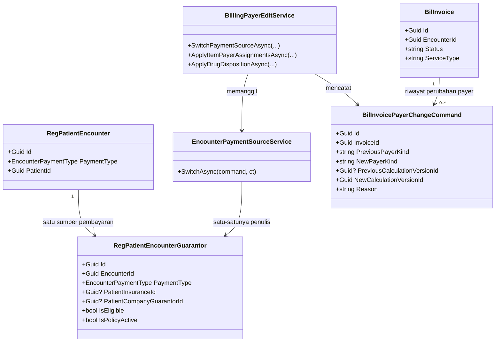

## Class diagram — penanggung per item dan penebusan obat

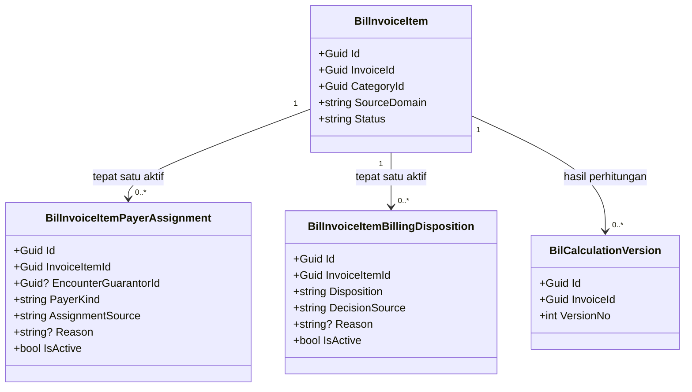

## Class diagram — master data penjamin perusahaan

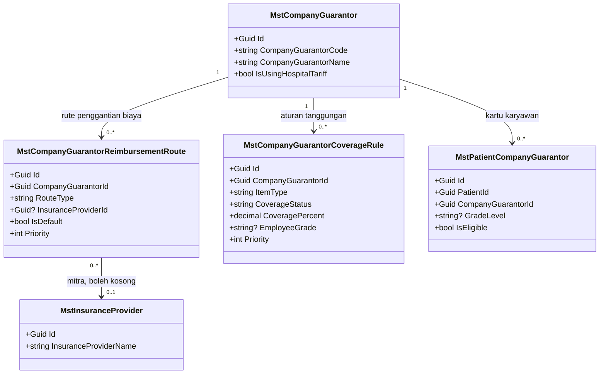

## Keputusan arsitektur amendment ini

| ID | Keputusan | Dasar dan alasan |
| --- | --- | --- |
| `MPY-DES-001` | **Satu endpoint generik** untuk ganti payer, bukan tiga endpoint per tipe target. Request membawa `PaymentType` beserta id target yang sesuai | Menutup `MPY-CQ-01`. Modelnya memang satu baris dengan satu `PaymentType` dan tiga himpunan FK yang saling eksklusif; `BuildPaymentSourceAsync` yang sudah ada pun satu method bercabang per tipe. Tiga endpoint akan menggandakan tiga kali orkestrasi validasi, snapshot, dan kalkulasi ulang yang isinya identik |
| `MPY-DES-002` | Ganti payer **memperbarui baris yang ada di tempat**, bukan menyisipkan baris baru lalu menonaktifkan yang lama | Unique index `EncounterId` **tidak difilter**, sehingga baris lama yang di-soft-delete pun tetap menabrak. Menyisipkan baris baru mustahil tanpa mengubah index itu — dan mengubahnya berarti menyentuh `RWI-ENC-PAYER-001` yang `MPY-DEC-001` larang |
| `MPY-DES-003` | Jejak perubahan payer disimpan pada tabel **milik Billing** (`BilInvoicePayerChangeCommand`), bukan sebagai kolom riwayat di tabel Registration | Konsekuensi langsung `MPY-DES-002`: baris diperbarui di tempat, sehingga nilai lama hilang tanpa tabel terpisah. Ditaruh di Billing karena perintahnya lahir dari konteks Billing beserta row version dan idempotency-nya, mencatat sekaligus akibat kalkulasinya, dan menjaga permukaan lintas modul tetap **satu service saja** |
| `MPY-DES-004` | Penulisan `RegPatientEncounterGuarantor` hanya lewat `EncounterPaymentSourceService` **milik `RegistrationManagement`** | `MPY-DEC-007`. `CAP-33` mengonfirmasi service ini belum ada sama sekali, sehingga ini kapabilitas baru di modul orang lain — **wajib approval Muhammad Hamzah (`MPY-DEC-010`) sebelum file pertamanya ditulis** |
| `MPY-DES-005` | Mesin coverage diberi **parameter konteks payer opsional**, bukan service baru yang menyalin logikanya | `CAP-34`. Menambah parameter opsional bersifat backward-compatible: seluruh pemanggil yang ada tidak berubah. Menyalin logika matching rule akan melahirkan dua mesin yang pasti menyimpang setelah revisi pertama — persis `Conflict` yang sudah tercatat di `CAP-05` |
| `MPY-DES-006` | `CompanyGuarantorCoverageService` baru, **sejajar dan setempat** dengan `InsuranceCoverageService` | Dua mesin coverage sebaiknya berada di satu folder supaya adapter punya satu tempat mencari, dan supaya pembaca berikutnya menemukan keduanya bersamaan |
| `MPY-DES-007` | `RegistrationBillingCoverageAdapter` menjadi **dispatcher per jenis payer**; anomali `INSURANCE_PROVIDER_MISSING` **tidak lagi** dikenakan pada encounter berpenjamin perusahaan | Menutup cacat as-is yang sudah aktif hari ini (lihat Bukti as-is baris keenam). Tanpa ini, dukungan Company Guarantor tidak akan pernah terlihat oleh kalkulasi |
| `MPY-DES-008` | `BilInvoiceItemPayerAssignment`: tepat satu baris aktif per item, dijaga **filtered unique index** (`WHERE IsActive AND NOT IsDelete`); perubahan menonaktifkan baris lama dan menyisipkan baris baru | Berbeda dari `MPY-DES-002` karena index ini milik kita sendiri, sehingga boleh difilter. Bentuk append-only membuat riwayat penanggung per item terbaca tanpa tabel audit tambahan |
| `MPY-DES-009` | Ganti payer **mereset** penanggung item yang jenisnya tidak lagi tersedia menjadi Pribadi, bertanda `AUTO`, beserta alasan otomatis; jumlahnya dikembalikan sebagai peringatan pada response | Jalur pengecualian yang paling mudah terlewat. Tanpa aturan ini, kunjungan yang payer-nya berubah dari Asuransi ke Penjamin akan menyisakan item bertanda "Asuransi" yang menunjuk payer yang sudah tidak ada — angka tagihan benar, tetapi keterangannya berbohong |
| `MPY-DES-010` | `BilInvoiceItemBillingDisposition` terpisah dari penanggung item, dengan filtered unique index yang sama bentuknya | `MPY-DEC-009` dan `DEC-06` dokumen sumber. "Siapa yang menanggung item ini" dan "apakah item ini masuk tagihan" adalah dua pertanyaan berbeda; menyatukannya membuat keadaan ambigu ketika obat sah secara klinis tetapi tidak ditebus |
| `MPY-DES-011` | Kelayakan Edit Billing memakai **`BilInvoice.ServiceType` yang sudah ada**, dan `IGD` diperlakukan sebagai nilai tersendiri — bukan digabung ke `RAJAL` | `MPY-DEC-009` mewajibkan pemisahan IGD. Sinyalnya sudah tersedia dan sudah terbukti dipakai (`AdministrationFeeServiceTypes.Rajal/Igd/Otc/Ranap`), sehingga tidak perlu sinyal baru |
| `MPY-DES-012` | Item obat dikenali lewat **flag kategori** pada master kategori item billing, bukan pencocokan teks deskripsi | Pencocokan teks akan salah pada nama obat yang mengandung kata lain, dan diam-diam berubah perilakunya setiap kali nama item diubah |
| `MPY-DES-013` | Dokumen penjamin perusahaan dibuat sebagai **DTO, service, dan endpoint tersendiri**, meniru pola Invoice Asuransi — bukan menambah cabang pada service yang sudah ada | `MPY-DEC-006`, `CAP-38`. Menambah cabang akan membuat satu service melayani dua dokumen dengan dua pemilik debitur berbeda, dan setiap perubahan salah satunya berisiko merusak yang lain |
| `MPY-DES-014` | Rute reimbursement hanya **metadata pada dokumen**; debitur rumah sakit tetap perusahaan penjamin, dan perutean AR tidak berubah sama sekali | Mitra reimbursement adalah urusan perusahaan dengan asuransinya, bukan piutang rumah sakit. Menjadikannya debitur akan memindahkan AR ke pihak yang tidak punya kontrak dengan rumah sakit |
| `MPY-DES-015` | Satu endpoint **read model gabungan** (`edit-context`) menyajikan invoice, kalkulasi, pilihan payer, penanggung item, disposisi, dan kapabilitas dalam satu panggilan | Tanpa ini layar edit membutuhkan enam panggilan terpisah dan berisiko menampilkan potongan data dari dua waktu berbeda |
| `MPY-DES-016` | Seluruh mutasi rumpun ini melewati **satu service orkestrator** (`BillingPayerEditService`) yang memegang batas transaksi; controller tetap tipis | Konvensi repository (`QBE-SVC-001`): controller **MUST NOT** mengakses `ApplicationDbContext` langsung |
| `MPY-DES-017` | **Tidak ada ember rupiah baru.** Porsi penjamin tetap satu ember; yang ditambahkan adalah **penanda jenis payer** pada breakdown sehingga antarmuka dapat melabelinya "Penjamin" atau "Asuransi" dengan benar | Dokumen sumber meminta Company Guarantor tidak disamarkan sebagai "Asuransi". Dengan satu payer aktif (`MPY-DEC-001`), dua ember terpisah akan selalu membuat salah satunya nol pada setiap kunjungan — itu kolom kosong yang menyesatkan, bukan informasi. Melabeli ember yang sudah ada menyelesaikan kebutuhan yang sama tanpa mengubah arity kontrak kalkulasi |

## Penjelasan setiap class yang baru atau berubah

### `MstCompanyGuarantorReimbursementRoute`

| Aspek | Penjelasan |
| --- | --- |
| **Status** | `Baru` |
| **Lokasi file** | `Areas/Administrator/MasterData/Models/MstCompanyGuarantorReimbursementRoute.cs` |
| Kategori | Master / Reference |
| Tanggung jawab utama | Mencatat bagaimana sebuah perusahaan penjamin mendapatkan penggantian biaya: menanggung sendiri, atau lewat perusahaan asuransi mitra. Keterangan ini muncul pada dokumen tagihan perusahaan, dan tidak mengubah siapa yang ditagih |
| Field penting | `CompanyGuarantorId`, `RouteType`, `InsuranceProviderId?`, `Priority`, `IsDefault`, `EffectiveStartDate?`, `EffectiveEndDate?` |
| Navigation dan relasi | Milik `MstCompanyGuarantor`; menunjuk `MstInsuranceProvider` secara opsional |
| Pemakaian dalam alur bisnis | Dibaca saat dokumen tagihan perusahaan dicetak; dikelola admin master data |
| Catatan desain | `RouteType = SELF` **MUST** berpasangan dengan `InsuranceProviderId` kosong, dan `INSURANCE_PROVIDER` **MUST** berpasangan dengan provider aktif. Maksimal satu rute bawaan aktif per perusahaan. **MUST NOT** dipakai sebagai dasar memindahkan piutang ke asuransi mitra (`MPY-DES-014`) |
| Ekuivalen model lama | — |

### `MstCompanyGuarantorCoverageRule`

| Aspek | Penjelasan |
| --- | --- |
| **Status** | `Baru` |
| **Lokasi file** | `Areas/HealthServices/MasterData/Models/MstCompanyGuarantorCoverageRule.cs` |
| Kategori | Master / Reference |
| Tanggung jawab utama | Menentukan berapa bagian biaya yang ditanggung perusahaan penjamin untuk satu jenis item, kelas perawatan, paket manfaat, atau golongan karyawan tertentu |
| Field penting | `CompanyGuarantorId`, `RuleCode`, `ItemType`, `TariffId?`, `DrugId?`, `DrugCategoryId?`, `ProcedureId?`, `TariffCategoryId?`, `PatientClassId?`, `BenefitPlanCode?`, `EmployeeGrade?`, `CoverageStatus`, `CoveragePercent`, `MaxCoverageAmount?`, `CoPaymentPercent?`, `MaxQuantityPerVisit?`, `MaxAmountPerVisit?`, `Priority`, `EffectiveStartDate?`, `EffectiveEndDate?` |
| Navigation dan relasi | Milik `MstCompanyGuarantor`; menunjuk master tarif/obat/tindakan/kategori/kelas secara opsional |
| Pemakaian dalam alur bisnis | Dibaca mesin tanggungan perusahaan setiap kali tagihan dihitung ulang |
| Catatan desain | Strukturnya **cetakan 1:1** dari `MstInsuranceCoverageRule` dengan kunci `CompanyGuarantorId` (`CAP-36`). `CoPaymentPercent` **MUST** diturunkan server dari `CoveragePercent` seperti pola aslinya — masukan klien untuk field itu diabaikan. `EmployeeGrade` adalah satu-satunya dimensi tambahan, karena master perusahaan memang mengenal tanggungan per golongan |
| Ekuivalen model lama | — |

### `BilInvoiceItemPayerAssignment`

| Aspek | Penjelasan |
| --- | --- |
| **Status** | `Baru` |
| **Lokasi file** | `Areas/HealthServices/BillingManagement/Billing/Models/BilInvoiceItemPayerAssignment.cs` |
| Kategori | Transaksi Billing |
| Tanggung jawab utama | Menyimpan siapa yang menanggung satu baris biaya: pasien sendiri, asuransi, atau penjamin perusahaan |
| Field penting | `InvoiceItemId`, `EncounterGuarantorId?`, `PayerKind`, `AssignmentSource`, `Reason?`, `IsActive` |
| Navigation dan relasi | Milik `BilInvoiceItem`; menunjuk baris sumber pembayaran kunjungan secara opsional |
| Pemakaian dalam alur bisnis | Dibuat otomatis saat item lahir, diubah kasir lewat Edit Status Tagihan, dibaca mesin kalkulasi |
| Catatan desain | Tepat satu baris aktif per item, dijaga filtered unique index. `EncounterGuarantorId` **MUST** kosong untuk `CASH`. Baris lama **MUST NOT** ditimpa — dinonaktifkan, lalu baris baru disisipkan, sehingga riwayatnya terbaca |
| Ekuivalen model lama | — |

### `BilInvoiceItemBillingDisposition`

| Aspek | Penjelasan |
| --- | --- |
| **Status** | `Baru` |
| **Lokasi file** | `Areas/HealthServices/BillingManagement/Billing/Models/BilInvoiceItemBillingDisposition.cs` |
| Kategori | Transaksi Billing |
| Tanggung jawab utama | Menyimpan keputusan apakah satu baris obat masuk tagihan atau tidak, tanpa menyentuh catatan penyerahan obat milik Farmasi |
| Field penting | `InvoiceItemId`, `Disposition`, `DecisionSource`, `Reason?`, `IsActive` |
| Navigation dan relasi | Milik `BilInvoiceItem` |
| Pemakaian dalam alur bisnis | Diubah kasir lewat Edit Billing; dibaca mesin kalkulasi untuk menentukan nominal yang layak dihitung |
| Catatan desain | Item ber-`Disposition = EXCLUDED` dikeluarkan dari nominal yang layak **sebelum** mesin tanggungan dipanggil, sehingga tidak pernah muncul sebagai porsi penjamin maupun porsi pasien. **MUST NOT** dipakai untuk item non-obat |
| Ekuivalen model lama | — |

### `BilInvoicePayerChangeCommand`

| Aspek | Penjelasan |
| --- | --- |
| **Status** | `Baru` |
| **Lokasi file** | `Areas/HealthServices/BillingManagement/Billing/Models/BilInvoicePayerChangeCommand.cs` |
| Kategori | Transaksi Billing / jejak perintah |
| Tanggung jawab utama | Mencatat setiap perubahan payer kunjungan yang dilakukan dari layar kasir beserta nilai sebelum dan sesudahnya |
| Field penting | `InvoiceId`, `EncounterId`, `PreviousPayerKind`, `NewPayerKind`, `PreviousPayerNameSnapshot`, `NewPayerNameSnapshot`, `PreviousCalculationVersionId?`, `NewCalculationVersionId`, `ResetAssignmentCount`, `Reason`, `IdempotencyKey`, `CorrelationId`, `CausationId` |
| Navigation dan relasi | Milik `BilInvoice` |
| Pemakaian dalam alur bisnis | Ditulis satu baris setiap perintah ganti payer berhasil; dibaca auditor dan layar riwayat |
| Catatan desain | Append-only. **MUST NOT** diperbarui maupun dihapus. Mengikuti pola `BilCashierShiftCommand` yang sudah ada di modul ini |
| Ekuivalen model lama | — |

### `EncounterPaymentSourceService`

| Aspek | Penjelasan |
| --- | --- |
| **Status** | `Baru` |
| **Lokasi file** | `Areas/HealthServices/RegistrationManagement/Services/EncounterPaymentSourceService.cs` |
| Kategori | Service — **milik `RegistrationManagement`, bukan `billing-kasir`** |
| Tanggung jawab utama | Satu-satunya penulis sumber pembayaran kunjungan sesudah kunjungan dibuat. Memvalidasi kandidat payer, membangun ulang seluruh kolom snapshot, dan menjaga invariant satu payer per kunjungan |
| Dipanggil oleh | `BillingPayerEditService` |
| Membuka transaksi database | **Tidak** — ikut transaksi pemanggil, supaya perubahan payer dan kalkulasi ulang menjadi satu kesatuan |
| Catatan desain | Memakai ulang logika snapshot yang sudah ada pada `BuildPaymentSourceAsync` alih-alih menyalinnya. **Pembuatan file ini menunggu approval pemilik `RegistrationManagement` (`MPY-DEC-010`)** |
| Ekuivalen model lama | — |

### `CompanyGuarantorCoverageService`

| Aspek | Penjelasan |
| --- | --- |
| **Status** | `Baru` |
| **Lokasi file** | `Areas/HealthServices/ClinicalManagement/Services/CompanyGuarantorCoverageService.cs` |
| Kategori | Service — mesin tanggungan |
| Tanggung jawab utama | Menghitung berapa bagian satu item yang ditanggung perusahaan penjamin, memakai aturan tanggungan perusahaan |
| Dipanggil oleh | `RegistrationBillingCoverageAdapter` |
| Membuka transaksi database | Tidak — hanya membaca |
| Catatan desain | Aturan otoritatifnya **MUST** berasal dari aturan tanggungan perusahaan. Rute reimbursement ke asuransi mitra **MUST NOT** dipakai sebagai alasan memakai aturan tanggungan milik asuransi itu (`MPY-DES-014`). Bila perusahaan tidak punya buku tarif sendiri, dipakai tarif rumah sakit |
| Ekuivalen model lama | — |

### `BillingPayerEditService`

| Aspek | Penjelasan |
| --- | --- |
| **Status** | `Baru` |
| **Lokasi file** | `Areas/HealthServices/BillingManagement/Billing/Services/BillingPayerEditService.cs` |
| Kategori | Service — orkestrator |
| Tanggung jawab utama | Menjalankan ketiga perintah edit sebagai satu kesatuan: gerbang kelayakan, perubahan data, reset penanggung yang tidak lagi sah, kalkulasi ulang, dan pencatatan jejak |
| Dipanggil oleh | `BillingInvoicesController` |
| Membuka transaksi database | **Ya** — satu transaksi untuk seluruh langkah |
| Catatan desain | Pemegang gerbang `MPY-DEC-005` (satu kasir, tanpa persetujuan kedua) dan gerbang keamanan edit (invoice `OPEN`, belum ada pembayaran berhasil). **MUST NOT** menulis `RegPatientEncounterGuarantor` langsung |
| Ekuivalen model lama | — |

### `BillingCompanyGuarantorInvoiceDocumentService`

| Aspek | Penjelasan |
| --- | --- |
| **Status** | `Baru` |
| **Lokasi file** | `Areas/HealthServices/BillingManagement/Billing/Services/BillingCompanyGuarantorInvoiceDocumentService.cs` |
| Kategori | Service — dokumen baca-saja |
| Tanggung jawab utama | Menyusun lembar tagihan yang ditujukan kepada perusahaan penjamin, beserta identitas karyawan dan keterangan rute reimbursement |
| Dipanggil oleh | `BillingInvoicesController` |
| Membuka transaksi database | Tidak |
| Catatan desain | Meniru pola dokumen Invoice Asuransi: baca-saja, mengambil dari versi kalkulasi terkunci bila invoice tidak lagi `OPEN`. **MUST NOT** menghitung ulang tanggungan sendiri |
| Ekuivalen model lama | — |

### `RegistrationBillingCoverageAdapter`

| Aspek | Penjelasan |
| --- | --- |
| **Status** | `Diperbarui` |
| **Lokasi file** | `Areas/HealthServices/BillingManagement/Billing/Services/BillingCoverageAdapter.cs` |
| Kategori | Service — adapter tanggungan |
| Yang berubah | Menjadi dispatcher per jenis payer; menghormati penanggung per item dan disposisi penebusan; membawa penanda jenis payer pada hasil; **berhenti** mengeluarkan anomali `INSURANCE_PROVIDER_MISSING` untuk kunjungan berpenjamin perusahaan |
| Catatan desain | Nilai `ContractVersion` **MUST** dinaikkan karena perilaku perhitungannya berubah. Kunjungan tunai dan kunjungan berasuransi **MUST** menghasilkan angka yang identik dengan sebelum amendment ini — diuji sebagai regresi |
| Ekuivalen model lama | — |

### `InsuranceCoverageService` dan `EncounterInsuranceService`

| Aspek | Penjelasan |
| --- | --- |
| **Status** | `Diperbarui` |
| **Lokasi file** | `Areas/HealthServices/ClinicalManagement/Services/InsuranceCoverageService.cs`, `.../EncounterInsuranceService.cs` |
| Yang berubah | Menerima konteks payer eksplisit sebagai parameter **opsional**; `EncounterInsuranceService` mendapat cara membangun konteks dari kartu asuransi kandidat tanpa menyentuh kunjungan |
| Catatan desain | Backward-compatible: seluruh pemanggil yang ada tidak berubah sama sekali. Membangun konteks kandidat **MUST NOT** menulis apa pun — ia melayani pratinjau perbandingan |
| Ekuivalen model lama | — |

### Controller

| Controller | Status | Lokasi file | Endpoint yang diurus | Service yang dipakai |
| --- | --- | --- | --- | --- |
| `BillingInvoicesController` | `Diperbarui` | `Areas/HealthServices/BillingManagement/Billing/Controllers/BillingInvoicesController.cs` | `edit-context`, pratinjau perbandingan, ganti payer, penanggung item, disposisi obat, dokumen penjamin perusahaan | `BillingPayerEditService`, `BillingCompanyGuarantorInvoiceDocumentService` |
| `CompanyGuarantorReimbursementRouteController` | `Baru` | `Areas/Administrator/MasterData/Controllers/CompanyGuarantorReimbursementRouteController.cs` | CRUD rute reimbursement | `CompanyGuarantorReimbursementRouteService` |
| `CompanyGuarantorCoverageRuleController` | `Baru` | `Areas/HealthServices/MasterData/Controllers/CompanyGuarantorCoverageRuleController.cs` | CRUD aturan tanggungan perusahaan | `CompanyGuarantorCoverageRuleService` |

> **Peringatan koordinasi.** `BillingInvoicesController.cs` beserta `BillingInvoiceDtos.cs` dan `BillingInvoiceService.cs` **sudah memiliki perubahan yang belum di-commit** dari pekerjaan lain (lihat `01-existing-capability-map.md` § 19.0). Implementer **MUST** menyelaraskan urutan commit dengan pemilik pekerjaan itu lebih dulu, dan **MUST NOT** membuang atau menimpa perubahan tersebut.

## Arsitektur folder target

```text
Areas/Administrator/MasterData/
├── Models/
│   └── MstCompanyGuarantorReimbursementRoute.cs          # baru
├── Controllers/
│   └── CompanyGuarantorReimbursementRouteController.cs   # baru
├── DTOs/
│   └── CompanyGuarantorReimbursementRouteDtos.cs         # baru
└── Services/
    └── CompanyGuarantorReimbursementRouteService.cs      # baru

Areas/HealthServices/MasterData/
├── Models/
│   └── MstCompanyGuarantorCoverageRule.cs                # baru
├── Controllers/
│   └── CompanyGuarantorCoverageRuleController.cs         # baru
├── DTOs/
│   └── CompanyGuarantorCoverageRuleDtos.cs               # baru
└── Services/
    └── CompanyGuarantorCoverageRuleService.cs            # baru

Areas/HealthServices/RegistrationManagement/Services/
└── EncounterPaymentSourceService.cs                      # baru — MILIK MODUL LAIN, tunggu approval

Areas/HealthServices/ClinicalManagement/Services/
├── CompanyGuarantorCoverageService.cs                    # baru
├── InsuranceCoverageService.cs                           # diperbarui
└── EncounterInsuranceService.cs                          # diperbarui

Areas/HealthServices/BillingManagement/Billing/
├── Models/
│   ├── BilInvoiceItemPayerAssignment.cs                  # baru
│   ├── BilInvoiceItemBillingDisposition.cs               # baru
│   └── BilInvoicePayerChangeCommand.cs                   # baru
├── Dtos/
│   ├── BillingPayerEditDtos.cs                           # baru
│   └── BillingCompanyGuarantorInvoiceDtos.cs             # baru
├── Services/
│   ├── BillingPayerEditService.cs                        # baru
│   ├── BillingCompanyGuarantorInvoiceDocumentService.cs  # baru
│   └── BillingCoverageAdapter.cs                         # diperbarui
└── Controllers/
    └── BillingInvoicesController.cs                      # diperbarui — ADA PERUBAHAN BELUM COMMIT

Repositories/Configurations/
├── Administrator/MasterData/
│   └── MstCompanyGuarantorReimbursementRouteConfiguration.cs   # baru
├── HealthServices/MasterData/
│   └── MstCompanyGuarantorCoverageRuleConfiguration.cs         # baru
└── HealthServices/BillingManagement/Billing/
    ├── BilInvoiceItemPayerAssignmentConfiguration.cs           # baru
    ├── BilInvoiceItemBillingDispositionConfiguration.cs        # baru
    └── BilInvoicePayerChangeCommandConfiguration.cs            # baru
```

File configuration **tidak** berada di dalam `Areas/`; ia terpisah di bawah `Repositories/Configurations/<Domain>/<SubDomain>/` sesuai aturan struktur backend.

## Status model dan dampak migration

| Model | Status | Kolom yang berubah | Dampak migration |
| --- | --- | --- | --- |
| `MstCompanyGuarantorReimbursementRoute` | `Baru` | seluruh kolom | Tabel baru |
| `MstCompanyGuarantorCoverageRule` | `Baru` | seluruh kolom | Tabel baru |
| `BilInvoiceItemPayerAssignment` | `Baru` | seluruh kolom | Tabel baru |
| `BilInvoiceItemBillingDisposition` | `Baru` | seluruh kolom | Tabel baru |
| `BilInvoicePayerChangeCommand` | `Baru` | seluruh kolom | Tabel baru |
| `RegPatientEncounterGuarantor` | `Sudah ada` | **nol kolom berubah** | **Nol** — hanya cara menulisnya yang berubah, bukan bentuknya |
| `BilInvoice`, `BilInvoiceItem` | `Sudah ada` | **nol kolom berubah** | **Nol** — penanggung dan disposisi tinggal di tabel terpisah |
| `BilCalculationVersion` | `Sudah ada` | **nol kolom berubah** | **Nol** — penanda jenis payer dibawa pada response dan snapshot, bukan kolom baru (`MPY-DES-017`) |

**Lima tabel baru, satu migration, nol perubahan pada tabel yang sudah ada.** Ini konsekuensi langsung `MPY-DEC-001`: karena skema satu-payer tidak diubah, tidak ada satu pun kolom existing yang perlu bergerak.

## Rencana migration, backfill, dan rollback

| Aspek | Rencana |
| --- | --- |
| Urutan | Satu migration tunggal berisi kelima tabel. Tidak ada ketergantungan urutan di dalamnya karena kelimanya hanya menunjuk tabel yang sudah ada |
| Tanpa mematikan layanan | **Ya.** Seluruhnya `CREATE TABLE` baru; nol `ALTER` pada tabel yang sedang dipakai |
| Pengisian data lama | **Tidak ada backfill saat migration.** Penanggung item dan disposisi diisi malas: item tanpa baris aktif diperlakukan mesin kalkulasi sebagai `AUTO` mengikuti payer kunjungan — persis perilaku hari ini. Ini membuat seluruh invoice lama tetap menghasilkan angka yang sama tanpa disentuh |
| Langkah mundur | `DROP TABLE` kelimanya. Karena tidak ada kolom existing yang berubah dan tidak ada backfill, mundur tidak menghilangkan data mana pun yang sudah ada sebelum amendment ini |
| Perilaku hapus relasi | Seluruh FK memakai `Restrict`, mengikuti konvensi repository untuk relasi finansial |

Pembuatan dan eksekusi migration tetap memerlukan otorisasi terpisah dan **tidak** diberikan oleh approval desain ini.

## Rencana data master awal

| Master | Isi minimum | Sumber nilai |
| --- | --- | --- |
| `MstCompanyGuarantorReimbursementRoute` | Satu rute bawaan per perusahaan penjamin yang sudah terdaftar. Perusahaan yang menanggung sendiri diisi `SELF` dengan mitra kosong | Kontrak kerja sama perusahaan, diisi admin master data |
| `MstCompanyGuarantorCoverageRule` | Sekurang-kurangnya satu aturan berlaku umum per perusahaan penjamin aktif — misalnya seluruh jenis item ditanggung 100% dengan batas per kunjungan sesuai kontrak | Kontrak kerja sama perusahaan |

**Tanpa isi minimum ini, kunjungan berpenjamin perusahaan akan dihitung nol tertanggung** — seluruh biaya jatuh ke pasien. Pengisian master **MUST** menjadi prasyarat aktivasi fitur, bukan pekerjaan menyusul.

## Yang sengaja tidak dibuat

| Yang ditolak | Alasan |
| --- | --- |
| Kolom `PayerKind` pada `BilInvoiceItem` | Penanggung item perlu riwayat, alasan, dan penanda sumber keputusan. Satu kolom tidak dapat menyimpan keempatnya, dan menambahkannya mengubah tabel inti yang dipakai banyak konsumen |
| Tabel riwayat payer di sisi `RegistrationManagement` | Menambah tabel ke modul yang bukan milik kita memperlebar permukaan lintas modul dari satu service menjadi satu service ditambah satu tabel. Jejaknya dicatat di Billing (`MPY-DES-003`) |
| Ember rupiah `CompanyGuarantorAmount` tersendiri | Dengan satu payer aktif, ember itu selalu nol pada kunjungan berasuransi dan sebaliknya (`MPY-DES-017`) |
| `MstCompanyTariff` (buku tarif perusahaan) | Belum ada requirement yang menuntutnya, dan `MstCompanyGuarantor` sudah punya `IsUsingHospitalTariff`. Membuat buku tarif baru tanpa kebutuhan berarti mengarang master |
| Endpoint ganti penjamin perusahaan pasien dari layar kasir | `MPY-DEC-003` dan dokumen sumber: perubahan kartu penjamin tetap di Data Pasien/Registrasi. Kasir hanya memilih dari yang sudah terdaftar |
| Persetujuan berjenjang untuk perubahan payer | `MPY-DEC-005` memutuskan satu kasir cukup. Menambahkannya berarti mengarang aturan bisnis |
| Nomor seri tersendiri untuk dokumen penjamin perusahaan | `CAP-41` — dokumen Invoice Asuransi pun memakai ulang nomor invoice, dan komentar source-nya menyatakan dokumen ini bukan surat klaim formal |

## Security, privacy, exception, dan concurrency

| Aspek | Rancangan |
| --- | --- |
| Hak akses baca dokumen | `BillingInvoice : Read` dipakai ulang untuk dokumen penjamin perusahaan (`MPY-DEC-006`), mengikuti preseden `BKC-DEC-092` |
| Hak akses mutasi | Ketiga perintah edit memakai butir hak akses tulis pada `BillingInvoice`; kedua master baru mendapat Resource sendiri. Pendaftaran Resource bersifat otomatis lewat pemindaian atribut (`CAP-39`) — tidak ada berkas seed yang perlu disunting |
| Kolom sensitif | Nomor polis, nomor kartu, nomor karyawan, dan nama karyawan bertanda sensitif. **MUST NOT** masuk payload logger, dan nama berkas dokumen memakai nomor tagihan, bukan nama pasien atau nama perusahaan |
| Gerbang kelayakan edit | Invoice berstatus `OPEN`, belum ada pembayaran berhasil, tidak sedang finalisasi. Di luar itu, perintah ditolak — bukan dikerjakan sebagian |
| Concurrency | `ExpectedRowVersion` wajib pada ketiga perintah. Versi basi menghasilkan penolakan konflik **tanpa satu pun perubahan tersimpan**, karena seluruh langkah berada dalam satu transaksi |
| Idempotency | `Idempotency-Key` wajib pada ketiga perintah, mengikuti pola perintah finansial yang sudah ada di modul ini |
| Jejak audit | Perubahan payer dicatat pada tabel jejak perintah beserta nilai sebelum/sesudah dan versi kalkulasi. Perubahan penanggung item dan disposisi terbaca dari baris nonaktif yang tidak pernah dihapus |
| Jalur pengecualian yang dirancang | Kandidat payer tidak terdaftar milik pasien; kartu penjamin kedaluwarsa pada tanggal layanan; perusahaan penjamin belum punya aturan tanggungan; penanggung item menunjuk jenis payer yang tidak lagi tersedia sesudah ganti payer; item obat pada kunjungan rawat inap |

## Strategi test

| Lapis | Yang diuji |
| --- | --- |
| Unit | Aturan pasangan `RouteType`/mitra asuransi; derivasi `CoPaymentPercent` server-side; pemilihan aturan tanggungan perusahaan menurut prioritas; reset penanggung item sesudah ganti payer (`MPY-DES-009`); kelayakan Edit Billing per `ServiceType` termasuk penolakan `RANAP` dan pemisahan `IGD` dari `RAJAL` |
| Integration | Ganti payer tunai→asuransi→penjamin→tunai berurutan pada satu kunjungan, masing-masing diikuti kalkulasi ulang; penolakan ganti payer pada invoice yang sudah dibayar; versi baris basi menghasilkan penolakan tanpa perubahan tersimpan; perintah berulang dengan kunci idempotensi sama hanya berpengaruh sekali |
| Kontrak | Bentuk response kesepuluh endpoint baru; label jenis payer pada breakdown (`MPY-DES-017`) |
| **Regresi** | **Kunjungan tunai dan kunjungan berasuransi menghasilkan angka yang identik dengan sebelum amendment ini**; kunjungan berpenjamin perusahaan **tidak lagi** menghasilkan anomali `INSURANCE_PROVIDER_MISSING`; nol baris `PhmDrugUsage`/`PhmDrugUsageItem` tersentuh oleh seluruh alur Edit Billing |

Rincian skenarionya di [`testing/acceptance-test-matrix.md`](./testing/acceptance-test-matrix.md), `BIL-AT-081`–`BIL-AT-100`.

## Trace dan approval

| Aspek | Nilai |
| --- | --- |
| Keputusan bisnis dasar | **`MPY-DEC-001`–`MPY-DEC-010`** — seluruhnya `approved` Product/Domain Owner, 11 September 2026 |
| Masukan audit kemampuan | `01-existing-capability-map.md` § 19, `CAP-33` (Missing), `CAP-34` (Reuse with adapter), `CAP-35` (Ready to reuse), `CAP-36` (Ready to reuse as template; entity-nya sendiri Missing), `CAP-37` (Missing), `CAP-38` (Reuse with adapter), `CAP-39` (Ready to reuse), `CAP-40` (Reuse with adapter), `CAP-41` (pola saja) |
| Keputusan arsitektur amendment ini | `MPY-DES-001`–`MPY-DES-017`, seluruhnya **draft** |
| Prefix keputusan desain | `MPY-DES-*`, mengikuti `MPY-DEC-002`. Sekuens `BKC-DES-*` tetap berhenti di `BKC-DES-027`; sekuens `PC-DES-*` tetap berhenti di `PC-DES-014` |
| Kontrak terdampak | `BIL-API-1.0`, `BIL-STATE-0.9`, `BIL-VALIDATION-0.9`, `BIL-INTEGRATION-0.8`, `BIL-PERMISSION-0.8`, `BIL-TEST-1.0`, **`BIL-CALCULATION-0.9`** — sumbu kalkulasi **bergerak** pada amendment ini, berbeda dari Petty Cash |
| Acceptance test | `BIL-AT-081`–`BIL-AT-100` |
| Dampak skema | **Lima tabel baru, satu migration.** Nol perubahan pada tabel yang sudah ada |
| Ketergantungan lintas modul | Satu service baru milik `RegistrationManagement` (`MPY-DES-004`) — **memblokir implementasi**, bukan desain. Penjawab: Muhammad Hamzah (`MPY-DEC-010`) |
| Kelengkapan requirement | `requirement-completeness-gate` **tidak dijalankan**; bukti kelengkapan diambil dari `MPY-DEC-001`–`010` dan `01-existing-capability-map.md` § 19. Deviasi tercatat, lihat blockquote pembuka amendment ini |
| Kesiapan arsitektur domain | `DOMAIN_ARCHITECTURE_NOT_RUN` untuk slice ini. Alasannya: seluruh batas lintas konteks yang relevan sudah diputus eksplisit oleh keputusan bisnis — kepemilikan payer kunjungan (`MPY-DEC-007`), penempatan master data (`MPY-DEC-008`), dan batas terhadap Farmasi (`MPY-DEC-009`) — sehingga tidak ada batas domain tersisa untuk diselesaikan `hospital-domain-architect` |
| Backend SHA diaudit | `d295c4d59b68d223edc597c8b165b7ef4282b49f` (branch `Yasmina`), beserta working tree yang belum di-commit — lihat `01-existing-capability-map.md` § 19.0 |
| Frontend SHA diaudit | `0eafa76bf397a47ceb9d44a6f69006ee25f8ba51` (branch `yasmina`) |
| Status | ~~draft~~ **approved** — `MPY-DES-001`–`017` disetujui Product/Domain Owner 11 September 2026 (`MPY-DEC-012`, wewenang ganda Finance/AR `BKC-DEC-085`). Persetujuan pemilik `RegistrationManagement` atas `MPY-DES-004` ditutup terpisah lewat `MPY-DEC-011` (Muhammad Hamzah). Approval ini **bukan** otorisasi membuat maupun menjalankan migration — itu tetap memerlukan konfirmasi terpisah saat implementasi |
