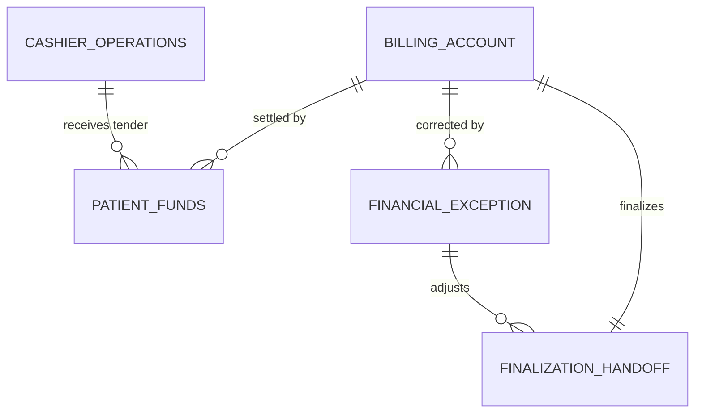
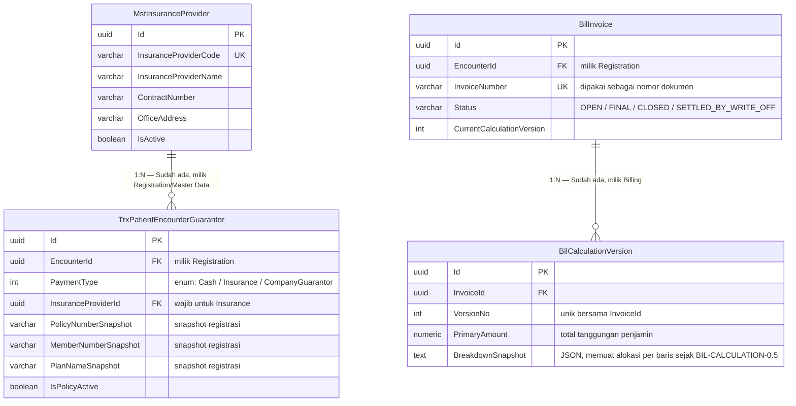

# Billing dan Kasir — Context ERD

Revision `0.4`, status **approved**. Garis menunjukkan referensi lintas context, bukan satu transaksi database raksasa.

| Context | ERD | Owner |
| --- | --- | --- |
| Billing Account & Charge | [01](./01-billing-account-charge.md) | Billing |
| Patient Funds & Settlement | [02](./02-patient-funds-settlement.md) | Treasury/Billing |
| Financial Exception & Adjustment | [03](./03-financial-exception-adjustment.md) | Finance |
| Cashier Operations | [04](./04-cashier-operations.md) | Cashier Operations |
| Finalization & Handoff | [05](./05-finalization-handoff.md) | Billing/Finance Integration |

## Amendment 3 September 2026 — Dokumen Invoice Asuransi

Tidak ada bounded context baru. Amendment ini menambah **dua arah bacaan** dari Billing ke konteks yang sudah ada, keduanya panggilan langsung dalam proses yang sama (satu assembly), tanpa penulisan dan tanpa pesan:

Arah ketergantungannya satu arah: **Billing membaca** Registration dan Administrator/Master Data. Tidak ada konteks lain yang membaca tabel `Bil*` karena amendment ini, dan tidak ada tabel `Bil*` yang menyalin kolom milik konteks lain (`BIL-INT-011`, `BIL-INT-012` pada [`../contracts/integration-contract.md`](../contracts/integration-contract.md)).

Kolom audit warisan `IdentityModel` tidak digambar pada diagram di atas.
