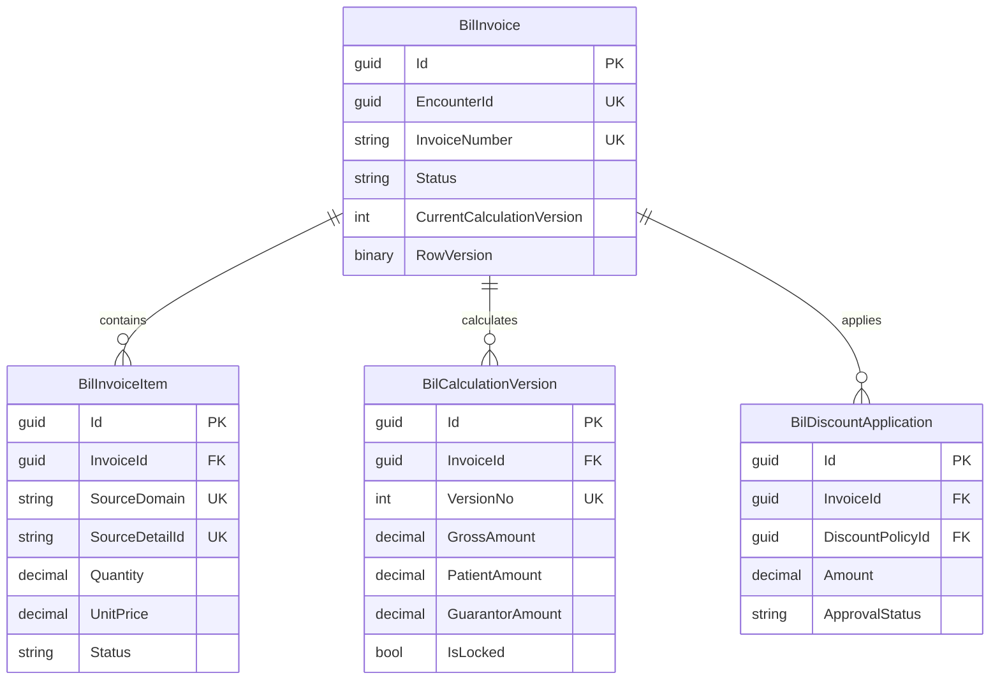

# ERD — Billing Account & Charge

UK item adalah komposit `(SourceDomain, SourceDetailId)` untuk representasi aktif. Snapshot kalkulasi menyimpan breakdown patient/primary/excess pada dokumen terstruktur atau child rows saat implementasi; pilihan fisik final harus mempertahankan query dan auditability.

