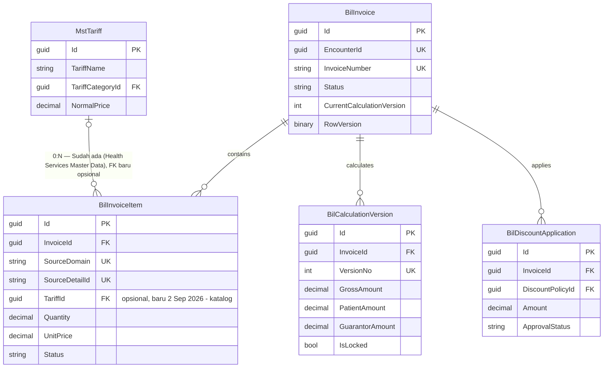

# ERD — Billing Account & Charge

UK item adalah komposit `(SourceDomain, SourceDetailId)` untuk representasi aktif. Snapshot kalkulasi menyimpan breakdown patient/primary/excess pada dokumen terstruktur atau child rows saat implementasi; pilihan fisik final harus mempertahankan query dan auditability.

**Amendment 2 September 2026** (`BKC-DEC-059`–`062`): `BilInvoiceItem.TariffId` — kolom baru, `Guid?`, `DeleteBehavior.Restrict`, index non-unique (bukan bagian UK). Diisi hanya untuk item yang berasal dari entri katalog tarif (`SourceDomain="ADHOC_CATALOG"`); tetap `null` untuk item free-form (`SourceDomain="ADHOC"`) dan item asal klinis lain. `MstTariff` sudah ada (Health Services Master Data, `Areas/HealthServices/MasterData/Models/MstTariff.cs`) — direferensikan, tidak dibuat ulang. Detail desain lengkap di [`02-backend-architecture.md`](../02-backend-architecture.md#amendment-2-september-2026--entri-manual-berbasis-katalog-tarif--coverage-per-item).

## Amendment 3 September 2026 — Dokumen Invoice Asuransi

**Tidak ada perubahan pada ERD ini.** Amendment "Dokumen Invoice Asuransi" (`BKC-DEC-065`–`069`) tidak menambah tabel, tidak menambah kolom, dan tidak mengubah satu pun relasi. Kemampuan baru yang dibutuhkannya — pecahan rupiah tanggungan penjamin per baris biaya — tersimpan sebagai bagian JSON di dalam kolom `BilCalculationVersion.BreakdownSnapshot` yang sudah ada, bukan sebagai tabel atau kolom relasional (`BKC-DES-003`, lihat `02-backend-architecture.md`).

Entity milik modul lain yang **dibaca** amendment ini, dan karena itu **MUST NOT** disalin ke dalam skema `Bil*`:

| Entity | Owner | Dipakai untuk | Status |
| --- | --- | --- | --- |
| `TrxPatientEncounterGuarantor` | Registration Management | Menentukan jenis penjamin kunjungan dan mengambil snapshot polis | `Sudah ada` — hanya dirujuk |
| `MstInsuranceProvider` | Administrator / Master Data | Blok perusahaan asuransi pada dokumen | `Sudah ada` — hanya dirujuk |
| `MstPatient`, `TrxPatientEncounter` | Patient/Registration Management | Blok identitas pasien pada dokumen | `Sudah ada` — hanya dirujuk |

Peta relasi antar konteks untuk bacaan di atas ada di [`00-context-erd.md`](00-context-erd.md).
