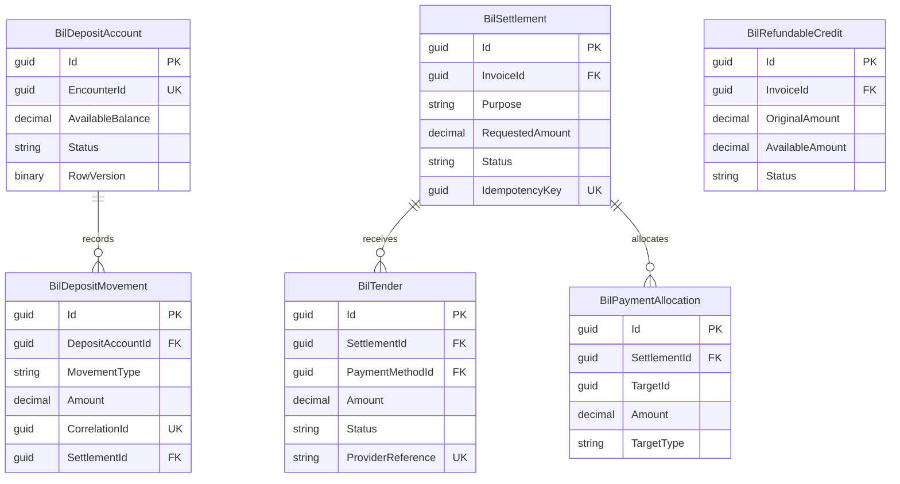

# ERD — Patient Funds & Settlement

```mermaid
erDiagram
  BilDepositAccount { guid Id PK guid EncounterId UK decimal AvailableBalance string Status binary RowVersion }
  BilDepositMovement { guid Id PK guid DepositAccountId FK string MovementType decimal Amount guid CorrelationId UK guid SettlementId FK }
  BilSettlement { guid Id PK guid InvoiceId FK string Purpose decimal RequestedAmount string Status guid IdempotencyKey UK }
  BilTender { guid Id PK guid SettlementId FK guid PaymentMethodId FK decimal Amount string Status string ProviderReference UK }
  BilPaymentAllocation { guid Id PK guid SettlementId FK guid TargetId decimal Amount string TargetType }
  BilRefundableCredit { guid Id PK guid InvoiceId FK decimal OriginalAmount decimal AvailableAmount string Status }
  BilDepositAccount ||--o{ BilDepositMovement : records
  BilSettlement ||--o{ BilTender : receives
  BilSettlement ||--o{ BilPaymentAllocation : allocates
```

Provider reference boleh null untuk tunai dan unik bila ada. Nilai token/provider payload sensitif tidak disimpan di tabel ini.

