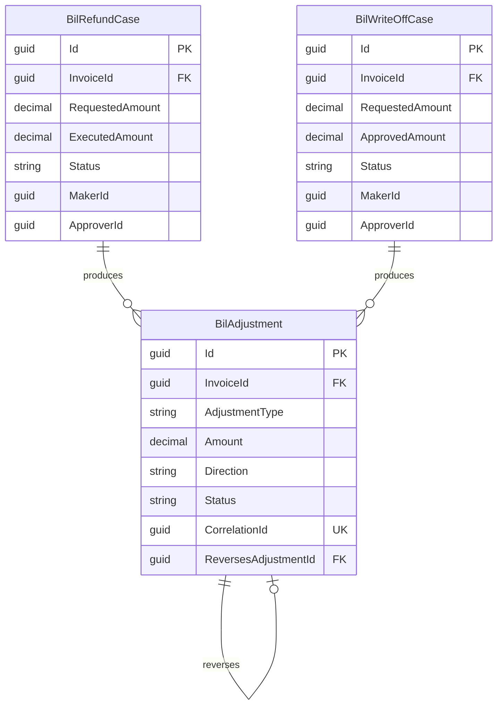

# ERD — Financial Exception & Adjustment

```mermaid
erDiagram
  BilAdjustment { guid Id PK guid InvoiceId FK string AdjustmentType decimal Amount string Direction string Status guid CorrelationId UK guid ReversesAdjustmentId FK }
  BilRefundCase { guid Id PK guid InvoiceId FK decimal RequestedAmount decimal ExecutedAmount string Status guid MakerId guid ApproverId }
  BilWriteOffCase { guid Id PK guid InvoiceId FK decimal RequestedAmount decimal ApprovedAmount string Status guid MakerId guid ApproverId }
  BilAdjustment ||--o| BilAdjustment : reverses
  BilRefundCase ||--o{ BilAdjustment : produces
  BilWriteOffCase ||--o{ BilAdjustment : produces
```

Maker dan approver tidak boleh sama. Full write-off menghasilkan outcome `SETTLED_BY_WRITE_OFF`, bukan `PAID`.

