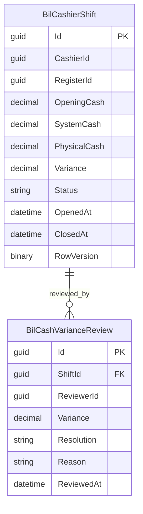

# ERD — Cashier Operations

Handover dicatat sebagai audit transition pada shift asal dan shift penerima; implementer boleh menambah child `BilCashierShiftHandover` hanya bila acceptance membutuhkan tanda tangan dua pihak yang tidak cukup direpresentasikan audit fact.

