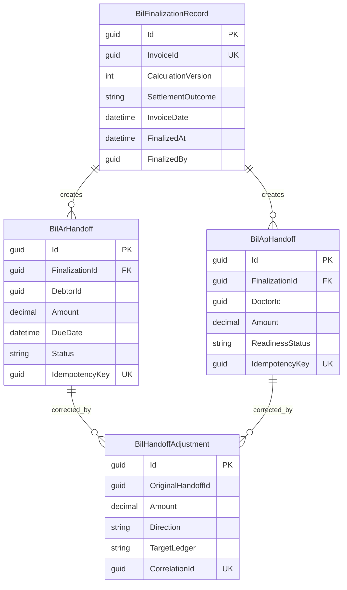

# ERD — Finalization & Handoff

```mermaid
erDiagram
  BilFinalizationRecord { guid Id PK guid InvoiceId UK int CalculationVersion string SettlementOutcome datetime InvoiceDate datetime FinalizedAt guid FinalizedBy }
  BilArHandoff { guid Id PK guid FinalizationId FK guid DebtorId decimal Amount datetime DueDate string Status guid IdempotencyKey UK }
  BilApHandoff { guid Id PK guid FinalizationId FK guid DoctorId decimal Amount string ReadinessStatus guid IdempotencyKey UK }
  BilHandoffAdjustment { guid Id PK guid OriginalHandoffId decimal Amount string Direction string TargetLedger guid CorrelationId UK }
  BilFinalizationRecord ||--o{ BilArHandoff : creates
  BilFinalizationRecord ||--o{ BilApHandoff : creates
  BilArHandoff ||--o{ BilHandoffAdjustment : corrected_by
  BilApHandoff ||--o{ BilHandoffAdjustment : corrected_by
```

AR dan AP lahir bersamaan saat final; AP baru `READY_TO_PAY` setelah policy settlement terpenuhi.

