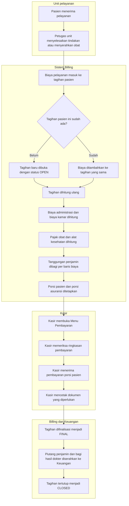

# Billing dan Kasir — Alur Utama

> Revision `0.7`, status **draft**. Berkas ini menggambarkan **alur pokok modul dari ujung ke ujung, jalur normal saja**. Seluruh percabangan dan jalur pengecualian ada pada berkas proses di sebelahnya:
>
> - [`pembagian-tanggungan-penjamin.md`](pembagian-tanggungan-penjamin.md)
> - [`ppn-obat-alkes.md`](ppn-obat-alkes.md)
> - [`dokumen-invoice-asuransi.md`](dokumen-invoice-asuransi.md)
>
> Nama status pada diagram sama persis dengan [`../contracts/state-transition-matrix.md`](../contracts/state-transition-matrix.md). Diagram sengaja tidak memuat nama tabel, kolom, endpoint, maupun nama kelas — untuk itu bacalah [`../02-backend-architecture.md`](../02-backend-architecture.md).

## Yang digambarkan alur ini

Perjalanan satu tagihan pasien, sejak biaya pertama masuk sampai tagihan tertutup. Alur ini berlaku sama untuk rawat jalan, IGD, dan rawat inap; perbedaannya muncul di dalam langkah perhitungan, bukan di urutan langkahnya.

## Tabel langkah

| No | Langkah | Pelaku | Masukan | Keluaran | Bila gagal, petugas melakukan |
| ---: | --- | --- | --- | --- | --- |
| 1 | Pasien menerima pelayanan | Unit pelayanan | Kunjungan yang sudah terdaftar | Tindakan atau obat yang selesai dikerjakan | Menyelesaikan pelayanannya lebih dulu; biaya tidak boleh ditagihkan sebelum pelayanan selesai |
| 2 | Biaya pelayanan masuk ke tagihan | Sistem | Tindakan atau obat yang selesai | Satu baris biaya pada tagihan pasien | Memeriksa apakah pelayanan sudah ditandai selesai di unitnya. Menambahkan biaya secara manual adalah jalan terakhir dan tercatat sebagai biaya lain-lain |
| 3 | Tagihan dibuka atau dipakai ulang | Sistem | Kunjungan pasien | Satu tagihan berstatus `OPEN` | Tidak ada tindakan petugas; satu kunjungan selalu memakai satu tagihan yang sama |
| 4 | Tagihan dihitung ulang | Sistem | Seluruh baris biaya yang masih berlaku | Rincian perhitungan versi terbaru | Memuat ulang layar. Bila perhitungan tetap gagal, menghubungi tim teknis dengan menyebut nomor tagihan |
| 5 | Biaya administrasi dan biaya kamar dihitung | Sistem | Kebijakan biaya yang berlaku dan riwayat menginap | Dua baris biaya tambahan | Memeriksa kelengkapan kebijakan biaya di data induk |
| 6 | Pajak obat dan alat kesehatan dihitung | Sistem | Jenis kunjungan dan daftar obat/alkes | Nilai pajak per baris obat, atau tanpa pajak untuk rawat inap | Lihat [`ppn-obat-alkes.md`](ppn-obat-alkes.md) |
| 7 | Tanggungan penjamin dibagi per baris | Sistem | Data penjamin kunjungan dan aturan tanggungan | Rupiah yang ditanggung penjamin untuk tiap baris | Lihat [`pembagian-tanggungan-penjamin.md`](pembagian-tanggungan-penjamin.md) |
| 8 | Porsi pasien dan porsi asuransi ditetapkan | Sistem | Hasil langkah 6 dan 7 | Subtotal Mandiri, Subtotal Asuransi, dan pajaknya masing-masing | Sama seperti langkah 7 |
| 9 | Kasir memeriksa ringkasan pembayaran | Kasir | Rincian perhitungan terbaru | Keputusan kasir untuk menagih atau menahan | Bila muncul peringatan data penjamin, menghubungi Pendaftaran sebelum menagih |
| 10 | Kasir menerima pembayaran | Kasir | Porsi pasien dan alat bayar yang dipilih | Bukti pembayaran yang tercatat | Bila alat bayar gagal, mencoba alat bayar lain; nominal yang sudah masuk tetap tercatat |
| 11 | Kasir mencetak dokumen | Kasir | Tagihan yang sudah dibayar | Kwitansi, Struk Pasien, atau Invoice Asuransi | Lihat [`dokumen-invoice-asuransi.md`](dokumen-invoice-asuransi.md) |
| 12 | Tagihan difinalisasi | Petugas Billing | Tagihan yang porsi pasiennya sudah selesai | Tagihan berstatus `FINAL` | Membaca daftar syarat yang belum terpenuhi pada layar, lalu melengkapinya |
| 13 | Penyerahan ke Keuangan | Sistem | Tagihan `FINAL` | Piutang penjamin dan bagi hasil dokter | Tagihan tetap `FINAL` dan penyerahan diulang otomatis; tidak ada tindakan petugas |
| 14 | Tagihan tertutup | Sistem | Penyerahan yang berhasil | Tagihan berstatus `CLOSED` | Tidak ada tindakan petugas |

## Yang tidak digambarkan di sini

Pembatalan item, koreksi, pengembalian uang, penghapusan piutang, pergantian shift kasir, dan deposit rawat inap adalah proses tersendiri yang sudah dikunci pada baseline blueprint. Ketiadaannya di sini bukan berarti tidak ada; ia berarti tidak termasuk jalur pokok yang dilalui setiap tagihan.

## Rumpun yang berdiri di luar alur tagihan — Petty Cash

Sejak revisi `1.0`, modul ini memiliki satu rumpun yang **sengaja tidak menyentuh alur di atas sama sekali**: Petty Cash, yaitu voucher kas kecil untuk keperluan operasional rumah sakit.

Rumpun itu tidak digambar sebagai bagian alur pokok karena ia bukan bagian dari perjalanan tagihan pasien. Ia tidak dimulai dari pelayanan, tidak menghasilkan baris biaya pada tagihan siapa pun, dan tidak berakhir pada penyerahan piutang ke Keuangan. Yang dikeluarkan bukan uang pasien, melainkan uang rumah sakit sendiri.

| Alurnya | Berkas |
| --- | --- |
| Perjalanan satu voucher, dari pengajuan sampai bukti nota | [`voucher-petty-cash.md`](voucher-petty-cash.md) |
| Pengisian, koreksi, dan pengurangan saldo kas kecil | [`anggaran-petty-cash.md`](anggaran-petty-cash.md) |

Satu hal yang **MUST** dipahami pembaca kedua alur itu: uang kas kecil dan uang kas shift kasir adalah dua kantong yang berbeda. Menyerahkan uang kas kecil tidak mengubah hitungan kas shift mana pun, dan tidak memunculkan selisih saat shift ditutup. Ini keputusan pemilik yang tercatat, bukan sambungan yang terlupa dirancang.

## Koreksi tagihan sebelum pembayaran — rumpun Edit Tagihan & Multi-Payer

Sejak revisi `1.1`, alur pokok di atas mendapat **tiga titik koreksi** yang seluruhnya berada di antara "tagihan terbentuk" dan "pasien membayar". Ketiganya bukan alur baru yang berdiri sendiri seperti Petty Cash, melainkan cabang perbaikan di tengah alur yang sudah ada: kasir menemukan sesuatu yang keliru, memperbaikinya, lalu alur pokok berlanjut seperti biasa dengan angka yang sudah dihitung ulang.

| Yang diperbaiki | Kapan dipakai | Berkas |
| --- | --- | --- |
| Penjamin kunjungan keliru atau belum tercatat | Pasien lupa membawa kartu saat mendaftar, kartunya baru ditunjukkan di kasir | [`ganti-payer-kunjungan.md`](ganti-payer-kunjungan.md) |
| Sebagian biaya ingin dibayar sendiri walaupun kunjungan berpenjamin | Pasien meminta satu tindakan atau obat tidak diklaimkan | [`penanggung-per-item-tagihan.md`](penanggung-per-item-tagihan.md) |
| Tidak seluruh resep ditebus pasien | Pasien meninggalkan sebagian obat di loket farmasi | [`penebusan-obat-rawat-jalan.md`](penebusan-obat-rawat-jalan.md) |

Tiga hal yang **MUST** dipahami pembaca ketiga alur itu:

1. **Seluruhnya hanya berlaku sebelum pembayaran.** Begitu ada pembayaran yang berhasil atau tagihan difinalisasi, ketiganya tertutup. Perbaikan sesudah itu adalah pekerjaan pembalikan, bukan pengeditan.
2. **Satu kunjungan tetap satu penjamin.** Mengganti penjamin berarti menggantikan yang lama, bukan menambah penjamin kedua. Tidak pernah ada keadaan di mana asuransi pribadi dan penjamin perusahaan berlaku bersamaan pada satu kunjungan.
3. **Keputusan menagih terpisah dari fakta pelayanan.** Menandai obat tidak ditebus tidak mengubah catatan penyerahan obat milik Farmasi, dan menandai satu biaya sebagai tanggungan pasien tidak menghapus fakta bahwa pelayanannya memang diberikan.
