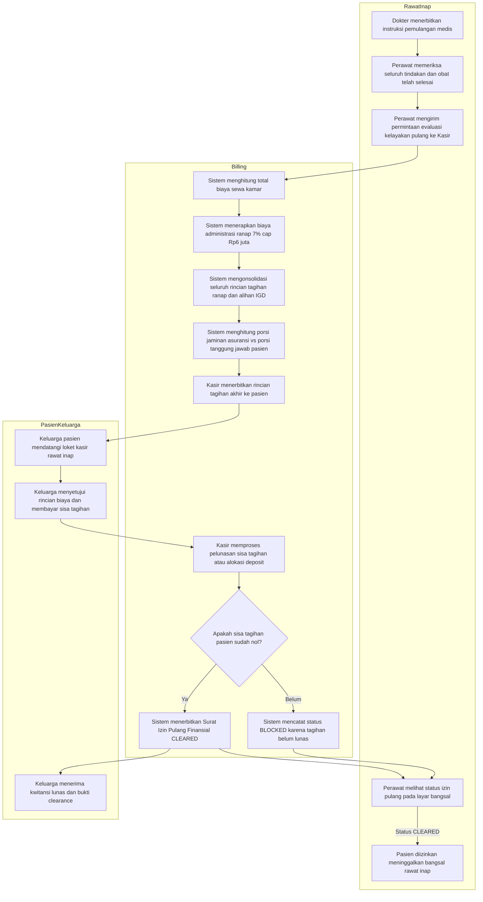
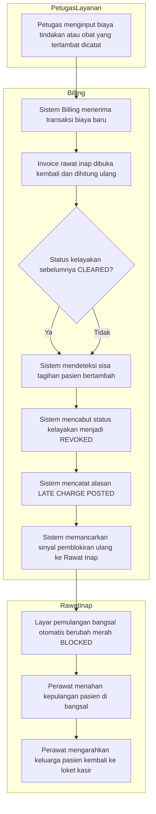
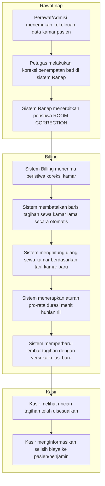
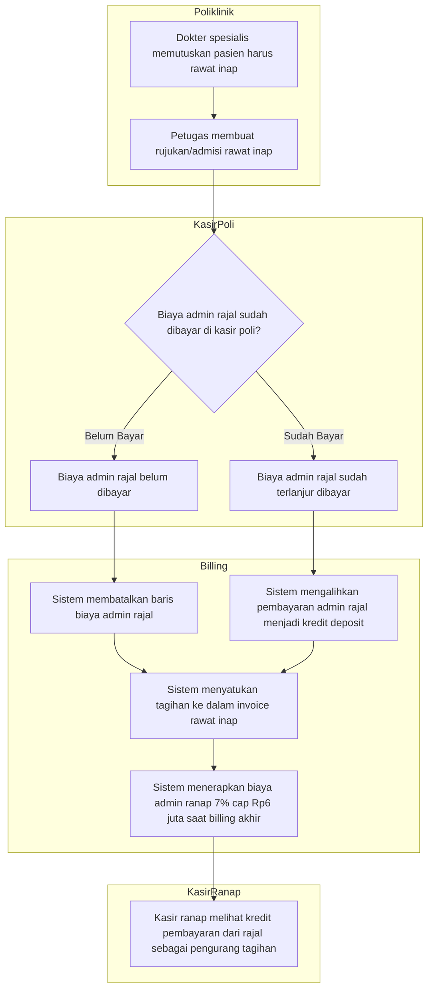

# Alur Integrasi Rawat Inap dengan Billing Management

Masukan `BKC-DEC-112`–`119` dan `BKC-AC-080`–`087`. Status **draft**, 24 September 2026.

Dokumen ini memetakan urutan proses bisnis antara Unit Rawat Inap, Kasir/Billing, dan Pasien, mencakup pembebanan sewa kamar otomatis, penyelesaian administrasi dan deposit, evaluasi kelayakan pemulangan finansial (*Financial Clearance*), serta penanganan kasus-kasus pengecualian seperti tagihan susulan (*late charges*) dan koreksi kamar.

## Mengapa Alur Ini Ada

Dalam operasional rumah sakit:
- Pasien rawat inap seringkali menempati kamar di jam-jam peralihan malam atau berpindah kamar beberapa kali dalam satu hari. Tanpa aturan pembebanan kamar yang terstandar, perhitungan sewa kamar rawan menimbulkan sengketa antara keluarga pasien dan bagian kasir.
- Pasien yang diizinkan pulang secara medis oleh dokter (*discharge order*) tidak boleh keluar sebelum menyelesaikan kewajiban finansialnya (*Financial Clearance*).
- Sering terjadi tindakan medis atau obat susulan dicatatkan oleh perawat setelah kasir mencetak kwitansi lunas. Sistem wajib secara otomatis mencabut status izin pulang (*Auto-Reblock*) agar rumah sakit tidak mengalami kebocoran pendapatan (*revenue leakage*).
- Pasien gawat darurat (IGD) atau rawat jalan (Rajal) yang dialihkan ke rawat inap memerlukan konsolidasi tagihan yang adil, di mana biaya admin rawat jalan digugurkan dan digantikan biaya admin rawat inap.

---

## 1. Alur Pokok — Jalur Normal Pemulangan Pasien Rawat Inap

Alur ini terjadi saat pasien selesai dirawat, dokter menerbitkan instruksi pulang, dan kasir menyelesaikan pembayaran akhir.

### Tabel Langkah Alur Normal

| Langkah | Pelaku | Masukan | Keluaran | Bila Gagal / Masalah |
| --- | --- | --- | --- | --- |
| 1. Terbit instruksi pulang | Dokter DPJP | Rekam medis pasien | Instruksi pulang medis (*discharge order*) | Pasien tetap berstatus rawat inap aktif |
| 2. Periksa tindakan & obat | Perawat bangsal | Catatan keperawatan | Konfirmasi penyelesaian layanan klinis | Perawat melengkapi inputan tindakan sebelum meminta clearance |
| 3. Permintaan evaluasi pulang | Perawat / Sistem | Identitas kunjungan (*encounter*) | Sinyal evaluasi ke Billing | Perawat menghubungi kasir bila status tidak bergerak |
| 4. Hitung sewa kamar & admin | Sistem Billing | Data penempatan bed, durasi jam, jam masuk | Rincian sewa kamar dan biaya administrasi 7% (maks Rp6 jt) | Kasir memeriksa jam masuk dan tarif bed di master data |
| 5. Terbitkan rincian akhir | Kasir | Seluruh item tagihan | Lembar rincian biaya (*billing statement*) | Kasir mengonfirmasi ke poliklinik/penjamin bila ada selisih tarif |
| 6. Pembayaran sisa tagihan | Pasien / Keluarga | Tunai, kartu debit/kredit, atau QRIS | Bukti transaksi pembayaran | Pembayaran diulang atau ganti metode pembayaran |
| 7. Terbitkan surat izin pulang | Sistem Billing | Transaksi pelunasan berhasil | Status kelayakan `CLEARED` | Status tetap `BLOCKED`, kasir memeriksa alokasi dana |
| 8. Izinkan pasien pulang | Perawat bangsal | Status kelayakan `CLEARED` | Pasien diserahterimakan untuk pulang | Pasien tidak boleh meninggalkan bangsal jika status masih `BLOCKED` |

---

## 2. Jalur Pengecualian 1 — Tagihan Susulan Setelah Izin Pulang (Auto-Reblock)

Alur ini terjadi apabila setelah pasien menyelesaikan pembayaran di kasir dan berstatus `CLEARED`, terdapat petugas (farmasi, lab, atau ruangan) yang baru memasukkan tagihan tindakan/obat yang terlewat.

### Tabel Langkah Tagihan Susulan

| Langkah | Pelaku | Masukan | Keluaran | Tindakan Bila Terjadi |
| --- | --- | --- | --- | --- |
| 1. Input biaya susulan | Petugas klinis / Farmasi | Layanan klinis yang terlewat | Transaksi biaya susulan | Petugas wajib memberikan catatan justifikasi keterlambatan input |
| 2. Deteksi status clearance | Sistem Billing | Status clearance aktif | Deteksi status `CLEARED` | Bila belum `CLEARED`, biaya langsung digabungkan ke tagihan terbuka |
| 3. Pencabutan izin pulang | Sistem Billing | Biaya susulan valid | Status berubah `REVOKED` / `BLOCKED` | Notifikasi darurat dikirim ke modul Rawat Inap |
| 4. Penahanan pasien | Perawat bangsal | Indikator `BLOCKED` pada sistem | Pasien tertahan di bangsal | Perawat menjelaskan secara santun kepada keluarga bahwa ada item susulan |
| 5. Pelunasan tagihan susulan | Kasir & Keluarga | Rincian selisih biaya | Pembayaran tambahan selesai, status kembali `CLEARED` | Setelah lunas, surat izin pulang baru diterbitkan dan pasien diizinkan keluar |

---

## 3. Jalur Pengecualian 2 — Koreksi Penempatan Kamar (Room Correction)

Alur ini terjadi ketika perawat atau admisi salah menginput kelas/bed pasien saat masuk, atau pasien dipindahkan tanpa sempat tercatat langsung di sistem sehingga memerlukan koreksi mundur (*backdated correction*).

### Tabel Langkah Koreksi Kamar

| Langkah | Pelaku | Masukan | Keluaran | Bila Gagal |
| --- | --- | --- | --- | --- |
| 1. Identifikasi salah kamar | Perawat / Kasir | Konfirmasi fisik bed vs sistem | Temuan ketidaksesuaian data bed | Verifikasi fisik nomor kamar dan kelas perawatan |
| 2. Eksekusi koreksi bed | Petugas Ranap | Data kamar/bed yang benar | Peristiwa koreksi kamar diterbitkan | Koreksi ditolak jika status pasien sudah ditutup permanen |
| 3. Pembatalan tagihan lama | Sistem Billing | Event koreksi kamar | Item tagihan lama dibatalkan (*voided*) | Tagihan lama tetap tercatat dalam log audit untuk akuntabilitas |
| 4. Hitung kamar baru | Sistem Billing | Tarif kamar baru & durasi jam | Item tagihan kamar baru yang akurat | Sistem memvalidasi tanggal mulai dan selesai placement |
| 5. Sinkronisasi kasir | Kasir | Rincian versi baru | Kwitansi/tagihan kasir mutakhir | Kasir melakukan cetak ulang rincian billing bila diperlukan |

---

## 4. Jalur Pengecualian 3 — Pasien Alihan Rawat Jalan ke Rawat Inap (Admin Fee Replacement)

Alur ini terjadi ketika pasien yang awalnya berobat di Poliklinik Rawat Jalan (Rajal) diputuskan oleh dokter spesialis untuk segera dirawat inap (Ranap).

### Tabel Langkah Alihan Rawat Jalan ke Rawat Inap

| Langkah | Pelaku | Masukan | Keluaran | Aturan Bisnis |
| --- | --- | --- | --- | --- |
| 1. Keputusan rawat inap | Dokter Poli | Hasil pemeriksaan poli | Rujukan admisi rawat inap | Pasien diarahkan ke admisi rawat inap |
| 2. Deteksi pembayaran rajal | Sistem Billing | Status invoice rawat jalan | Penentuan status pembayaran | Cek apakah kwitansi poli sudah terbit |
| 3. Pembatalan admin belum bayar | Sistem Billing | Tagihan admin poli belum bayar | Item admin poli dibatalkan (*voided*) | Pasien tidak ditagihkan admin poli; digantikan admin ranap |
| 4. Pengalihan dana admin terbayar | Sistem Billing | Kwitansi admin poli yang sudah lunas | Kredit dana (*progress payment*) pada invoice ranap | Uang pasien tidak hangus; diakui memotong tagihan rawat inap |
| 5. Penerapan admin ranap | Sistem Billing | Total tagihan eligible rawat inap | Biaya admin 7% (maksimum Rp6.000.000) | Dikenakan saat finalisasi pemulangan rawat inap |
