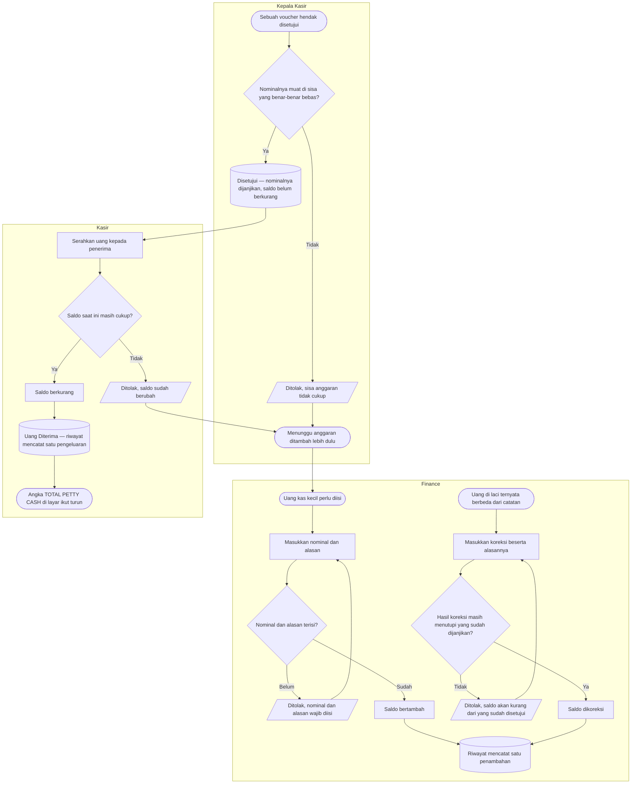
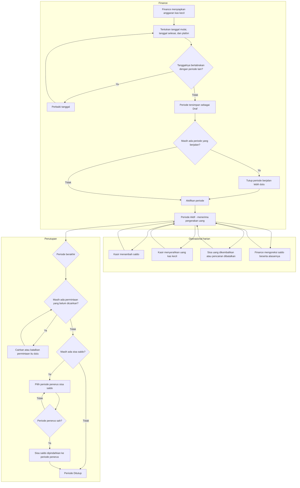

# Billing dan Kasir — Alur Anggaran Kas Kecil (Petty Cash)

> Revisi `1.0`, status **draft**. Berkas ini menggambarkan **satu proses beserta seluruh percabangan dan jalur pengecualiannya**: bagaimana anggaran kas kecil diisi, dikoreksi, dan berkurang.
>
> Nama status pada diagram sama persis dengan [`../contracts/state-transition-matrix.md`](../contracts/state-transition-matrix.md). Diagram sengaja **tidak** memuat nama tabel, kolom, endpoint, maupun nama kelas. Kalimat penolakan yang sebenarnya ada di [`../contracts/validation-matrix.md`](../contracts/validation-matrix.md).
>
> Perjalanan satu voucher ada di [`voucher-petty-cash.md`](voucher-petty-cash.md).

## Yang digambarkan alur ini

Angka besar bertuliskan **TOTAL PETTY CASH** di layar adalah saldo yang berjalan: uang yang dimasukkan Finance, dikurangi uang yang sudah benar-benar diserahkan kepada penerima. Alur ini menggambarkan dari mana angka itu datang dan kapan ia bergerak.

**Pemicu:** Finance mengisi kas kecil, mengoreksi saldo, atau kasir menyerahkan uang untuk sebuah voucher.

**Prasyarat:** kolam anggaran kas kecil sudah ada. Rumah sakit memakai **satu** kolam untuk seluruh unit pada rilis pertama.

**Hasil akhir:** saldo yang tampil di layar selalu dapat dijelaskan baris per baris dari riwayat pergerakannya.

## Tabel langkah

| No | Langkah | Pelaku | Masukan yang dibutuhkan | Keluaran | Bila gagal, petugas melakukan |
| ---: | --- | --- | --- | --- | --- |
| 1 | Isi anggaran kas kecil | Finance | Nominal yang dimasukkan ke laci dan alasannya | Saldo bertambah; satu baris riwayat penambahan tercatat | Melengkapi nominal atau alasan yang kosong. Alasan wajib karena baris inilah yang dibaca auditor |
| 2 | Koreksi saldo | Finance | Nominal koreksi, arah menambah atau mengurangi, dan alasannya | Saldo dikoreksi; satu baris riwayat koreksi tercatat | Bila koreksi ditolak karena akan membuat saldo kurang dari yang sudah dijanjikan, memeriksa voucher mana yang sudah disetujui tetapi belum dicairkan, lalu menyelesaikannya lebih dulu |
| 3 | Periksa sisa saat menyetujui | Kepala Kasir | Voucher yang menunggu, saldo, dan nominal yang sudah dijanjikan voucher lain | Keputusan menyetujui atau menolak | Bila sisa tidak cukup, meminta Finance mengisi anggaran lebih dulu. Voucher tetap menunggu dan tidak perlu dibuat ulang |
| 4 | Serahkan uang | Kasir | Voucher yang sudah disetujui, uang tunai di laci | Saldo berkurang; satu baris riwayat pengeluaran tercatat | Bila ditolak karena saldo sudah berubah, menghubungi Finance. Uang **tidak** boleh diserahkan lebih dulu lalu dicatat belakangan |
| 5 | Baca riwayat pergerakan | Finance | Rentang tanggal atau jenis pergerakan | Daftar penambahan, koreksi, dan pengeluaran beserta saldo sebelum dan sesudah tiap barisnya | Bila sebuah pergerakan tidak dapat dijelaskan, menelusuri voucher yang menyebabkannya lewat nomor voucher pada baris itu |

## Dua angka yang berbeda, dan bedanya penting

Layar menampilkan **saldo**, sedangkan yang dipakai memeriksa persetujuan adalah **sisa yang benar-benar bebas**. Keduanya berbeda ketika ada voucher yang sudah disetujui tetapi uangnya belum diserahkan.

| Angka | Artinya | Kapan berubah |
| --- | --- | --- |
| **Saldo** — angka besar TOTAL PETTY CASH | Uang yang secara catatan masih ada di laci | Bertambah saat Finance mengisi; berkurang saat kasir **menyerahkan** uang |
| **Sudah dijanjikan** | Jumlah nominal voucher yang sudah disetujui tetapi belum diserahkan | Bertambah saat Kepala Kasir menyetujui; berkurang saat uangnya diserahkan |
| **Sisa yang benar-benar bebas** | Saldo dikurangi yang sudah dijanjikan | Ikut berubah mengikuti keduanya |

> **Contoh berangka.** Saldo Rp 5.000.000. Satu voucher Rp 300.000 sudah disetujui pagi ini, tetapi penerimanya belum datang mengambil uangnya.
>
> | Angka | Nilai |
> | --- | ---: |
> | Saldo — yang tampil di kartu | Rp 5.000.000 |
> | Sudah dijanjikan | Rp 300.000 |
> | Sisa yang benar-benar bebas | Rp 4.700.000 |
>
> Uangnya memang masih Rp 5.000.000 di laci, jadi itulah yang ditampilkan. Tetapi Rp 300.000 di antaranya sudah punya pemilik, sehingga persetujuan berikutnya hanya boleh sampai Rp 4.700.000.
>
> **Kalau perbedaan ini tidak dijaga:** voucher kedua senilai Rp 4.800.000 akan lolos karena dibandingkan dengan Rp 5.000.000. Kedua penerima lalu datang, keduanya berhak, dan uang di laci kurang Rp 100.000.

## Jalur pengecualian yang paling sering ditemui

| Keadaan | Yang dilihat petugas | Yang dilakukan berikutnya |
| --- | --- | --- |
| Persetujuan ditolak karena sisa tidak cukup | Penolakan yang menyebut sisa yang benar-benar dapat dipakai | Finance mengisi anggaran, lalu Kepala Kasir menyetujui ulang voucher yang sama |
| Penyerahan uang ditolak karena saldo sudah berubah | Penolakan saat menekan Uang Diberikan | Menghubungi Finance untuk memeriksa koreksi yang baru terjadi. Voucher tetap menunggu diserahkan |
| Koreksi ditolak karena akan mengingkari janji | Penolakan yang menyebut nominal yang sudah dijanjikan | Menyelesaikan voucher yang sudah disetujui lebih dulu — diserahkan uangnya atau dibiarkan tidak dicairkan — baru mengoreksi saldo |
| Uang di laci lebih sedikit daripada catatan | Tidak ada peringatan otomatis; sistem tidak menghitung uang fisik | Finance memasukkan koreksi beralasan. Selisihnya tercatat sebagai baris riwayat, bukan dihapus |
| Permintaan pengisian anggaran terkirim dua kali | Layar menampilkan hasil yang sama seperti pengiriman pertama | Tidak ada tindakan. Saldo bertambah satu kali |
| Anggaran ingin dipisah per unit atau departemen | Tidak tersedia pada rilis pertama | Seluruh unit memakai satu kolam bersama. Pemisahan sudah dicatat sebagai kandidat rilis berikutnya |

## Yang tidak digambarkan di sini

Perjalanan satu voucher dari pengajuan sampai bukti nota ada di [`voucher-petty-cash.md`](voucher-petty-cash.md).

Alur ini **tidak** bersinggungan dengan penutupan shift kasir. Uang kas kecil dan uang kas shift adalah dua kantong yang berbeda: mengisi kas kecil tidak menambah kas shift, dan menyerahkan uang kas kecil tidak mengurangi kas shift maupun memunculkan selisih saat shift ditutup.

Sistem juga **tidak** menghitung uang fisik kas kecil seperti pada penutupan shift. Kecocokan antara saldo di layar dan uang di laci dijaga Finance secara manual, dan selisihnya diselesaikan lewat koreksi beralasan.

---

## Amendment 15 September 2026 — Alur baru: anggaran per periode dan pemindahan sisa saldo

Status **approved** (`PC-DEC-026`) · input: **`PC-DEC-017`**, `PC-DEC-018`; keputusan arsitektur `PC-DES-017`, `PC-DES-018`.

Diagram di bawah **menggantikan** diagram pada bagian sebelumnya. Yang berubah pokok: kolam anggaran tunggal yang berjalan tanpa batas waktu berganti menjadi rangkaian periode bergilir, dan muncul satu proses baru yang sebelumnya tidak ada sama sekali — penutupan periode beserta pemindahan sisa saldonya.

### Daur hidup satu periode anggaran

### Tabel langkah

| Langkah | Pelaku | Masukan | Keluaran | Bila gagal |
| --- | --- | --- | --- | --- |
| Membuat periode | Finance | Tanggal mulai, tanggal selesai (boleh dikosongkan), plafon anggaran | Periode berstatus `Draf` | Bila tanggalnya bertabrakan dengan periode yang sudah ada, perbaiki tanggalnya. Periode belum berlaku apa pun selama masih `Draf` |
| Mengaktifkan periode | Finance | Periode berstatus `Draf` | Periode `Aktif` dan mulai menerima pergerakan uang | Bila masih ada periode lain yang berjalan, tutup periode itu lebih dulu — hanya boleh ada satu periode berjalan pada satu waktu |
| Menambah saldo | Kasir | Nominal beserta alasannya | Saldo periode berjalan bertambah | Bila belum ada periode berjalan, mintakan Finance membukanya lebih dulu |
| Mengoreksi saldo | Finance | Nominal, arah koreksi, alasan | Saldo berubah beserta catatan alasannya | Koreksi yang membuat saldo menjadi minus ditolak |
| Menutup periode | Finance | Periode berjalan, periode penerus bila masih bersisa, alasan penutupan | Periode `Ditutup`; sisa saldo berpindah ke periode penerus | Bila masih ada permintaan yang belum dicairkan, selesaikan dulu. Bila sisa saldo ada tetapi penerusnya belum dipilih, penutupan ditolak — sisa uang tidak boleh menggantung tanpa tujuan |
| Memindahkan sisa saldo | Sistem, saat penutupan | Sisa saldo periode yang ditutup | Periode lama bersaldo nol; periode penerus bertambah sebesar sisa itu; keduanya tercatat sebagai dua pergerakan terpisah | Keduanya terjadi bersamaan atau tidak sama sekali. Tidak ada keadaan di mana uang itu terlihat di dua periode sekaligus atau hilang dari keduanya |

### Kenapa sisa saldo dipindahkan, bukan dihapus

Uang kas kecil adalah uang fisik yang benar-benar ada di laci. Pergantian periode adalah peristiwa administratif, dan uang fisik tidak berubah jumlahnya karena kalender berganti. Karena itu penutupan periode **MUST** memindahkan sisanya, dan pemindahan itu **MUST** terbaca pada kedua periode — satu pergerakan keluar pada periode lama, satu pergerakan masuk pada periode penerus.

Bila sisa itu hanya "muncul" pada periode baru tanpa pergerakan keluar pada periode lama, laporan periode lama akan selamanya memperlihatkan sisa yang sebenarnya sudah tidak ada di sana, dan penjumlahannya tidak akan pernah cocok dengan uang fisiknya.

### Contoh berangka

Periode September berplafon Rp 10.000.000. Sepanjang bulan: ditambah Rp 2.000.000, dicairkan Rp 5.300.000, dikembalikan Rp 550.000. Saldo akhirnya Rp 7.250.000 — semuanya masih uang fisik di laci.

Finance menutup September dan memilih Oktober sebagai penerusnya. Setelah penutupan: September bersaldo Rp 0 dengan catatan pergerakan keluar Rp 7.250.000, dan Oktober bersaldo Rp 7.250.000 dengan catatan pergerakan masuk sebesar itu, di atas plafonnya sendiri. Uang di laci tidak bergerak sedikit pun sepanjang proses ini — yang berpindah hanya catatan periodenya.
