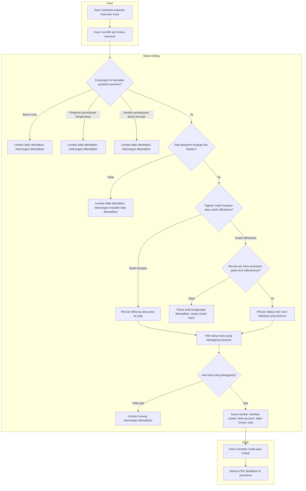

# Penerbitan Dokumen Invoice Asuransi

> Revision `0.7`, status **draft**. Input keputusan: `BKC-DEC-065`–`069` (approved 3 September 2026), disesuaikan dengan `BKC-DEC-070`–`075` dan keputusan arsitektur `BKC-DES-010`–`017`. Diagram memuat jalur normal **dan** jalur pengecualiannya.

## Yang digambarkan alur ini

Bagaimana kasir menghasilkan satu lembar rincian tagihan yang ditujukan kepada perusahaan asuransi, berisi identitas pasien, identitas perusahaan asuransi, dan **hanya** baris biaya yang benar-benar ditanggung asuransi beserta rupiahnya.

Dokumen ini bukan surat pengajuan klaim formal. Ia adalah rincian yang dapat dibaca tiga pihak sekaligus — pasien, rumah sakit, dan perusahaan asuransi.

## Tabel langkah

| No | Langkah | Pelaku | Masukan | Keluaran | Bila gagal, petugas melakukan |
| ---: | --- | --- | --- | --- | --- |
| 1 | Membuka halaman Dokumen Kasir | Kasir | Tagihan yang sedang dilayani | Halaman dokumen dengan beberapa tab | Memastikan tagihan sudah dipilih dari Menu Pembayaran |
| 2 | Memilih tab Invoice Asuransi | Kasir | — | Permintaan penyusunan lembar | Tab hanya memuat isinya saat dibuka; bila kosong, memuat ulang halaman |
| 3 | Memeriksa jenis penjamin kunjungan | Sistem | Sumber pembayaran kunjungan | Lolos, atau keterangan kenapa lembar tidak dapat diterbitkan | Untuk kunjungan tunai, tidak ada yang perlu dilakukan — memang tidak ada lembar asuransi. Untuk penjamin perusahaan tempat kerja, menunggu dukungan yang belum dibangun |
| 4 | Memeriksa kelengkapan data penjamin | Sistem | Status kelayakan dan status polis | Lolos, atau keterangan masalah data | Menghubungi Pendaftaran untuk membetulkan data penjamin, lalu membuka ulang tab ini |
| 5 | Mengambil rincian perhitungan | Sistem | Status tagihan | Rincian segar, atau rincian dari versi yang terkunci | Bila perhitungan gagal, kasir membaca pesan yang muncul dan tidak menganggap lembar kosong sebagai "tidak ada yang ditanggung" |
| 6 | Menyaring baris yang ditanggung asuransi | Sistem | Rupiah tanggungan per baris | Daftar baris untuk lembar | Penyaringan dikerjakan sistem, bukan peramban — kasir tidak dapat dan tidak perlu mengubahnya |
| 7 | Menyusun lembar | Sistem | Identitas pasien, blok perusahaan asuransi, daftar baris, total | Lembar siap cetak | Bila blok perusahaan asuransi kosong, admin data induk melengkapi data perusahaan asuransinya |
| 8 | Mencetak atau mengunduh | Kasir | Lembar yang sudah tersusun | Berkas PDF | Bila kolom tabel terpotong, mencetak ulang pada ukuran kertas yang benar |

## Jalur pengecualian

Seluruh keadaan di bawah menghasilkan halaman yang **berhasil dimuat** — bukan pesan galat merah. Yang membedakannya dari keberhasilan adalah tombol cetak yang tidak muncul, dan keterangan yang menjelaskan sebabnya.

| Keadaan | Yang dilihat kasir | Yang perlu dilakukan |
| --- | --- | --- |
| Kunjungan dibayar tunai | Keterangan bahwa kunjungan ini dibayar mandiri sehingga tidak ada lembar asuransi | Tidak ada. Ini keadaan normal |
| Penjamin adalah perusahaan tempat kerja pasien | Keterangan bahwa lembar ini belum mendukung penjamin perusahaan | Menunggu kemampuan itu dibangun; untuk sementara memakai Struk Pasien |
| Sumber pembayaran kunjungan belum tercatat sama sekali | Keterangan untuk melengkapi data penjamin di Pendaftaran | Menghubungi Pendaftaran |
| Data penjamin bermasalah — belum dinyatakan layak, atau polis tercatat tidak aktif | Keterangan bahwa rincian tanggungan belum dapat diterbitkan karena data penjamin bermasalah | Menghubungi Pendaftaran. Lembar **sengaja tidak** diterbitkan: lembar yang menyatakan tanggungan Rp 0 padahal sebabnya kolom kelayakan belum dicentang akan menyesatkan perusahaan asuransi |
| Pasien asuransi, tetapi tidak ada satu pun baris yang ditanggung | Lembar kosong beserta keterangan bahwa tidak ada item yang ditanggung asuransi | Memeriksa kelengkapan aturan tanggungan di data induk bila seharusnya ada yang ditanggung |
| Tagihan sudah difinalisasi sebelum kemampuan rincian per baris tersedia | Total tanggungan ditampilkan, rincian per baris tidak, beserta keterangan bahwa total tetap sah | Tidak ada. Rincian lama sengaja **tidak** ditulis ulang, karena itu akan mengubah bukti perhitungan yang sudah terkunci |
| Perusahaan asuransi tidak ditemukan di data induk | Blok asuransi berisi tanda hubung beserta keterangan | Menghubungi admin data induk |
| Perhitungan gagal, misalnya karena dua tarif pajak sama-sama berlaku | Pesan galat asli dari mesin perhitungan | Menghubungi pemilik data induk. Kegagalan hitung **MUST NOT** ditampilkan sebagai lembar kosong |

## Contoh isi lembar

Kunjungan rawat jalan pasien asuransi pada perusahaan samaran "Asuransi Sejahtera Nusantara". Empat baris biaya masuk tagihan, tiga di antaranya ditanggung.

| Baris yang tampil di lembar | Nilai | Ditanggung asuransi |
| --- | ---: | ---: |
| Konsultasi Dokter Umum | Rp 100.000 | Rp 100.000 |
| Fisioterapi | Rp 300.000 | Rp 240.000 |
| Biaya Administrasi | Rp 15.000 | Rp 15.000 |
| **Total tanggungan asuransi** | | **Rp 355.000** |

"Vitamin C tablet" Rp 25.000 **tidak muncul** di lembar ini karena tidak ditanggung asuransi (`BKC-DEC-068`), meskipun ia muncul di Struk Pasien pada tagihan yang sama. Sisa Rp 85.000 yang menjadi porsi pasien juga tidak muncul sebagai baris; ia tercantum sebagai keterangan di kaki lembar.

## Batas yang tetap berlaku

- Mencetak lembar ini **MUST NOT** memindahkan status tagihan, **MUST NOT** menandai klaim sebagai sudah diajukan, dan **MUST NOT** membuat piutang penjamin. Ketiganya tetap milik jalur finalisasi.
- Untuk tagihan yang masih berjalan, isi lembar dapat berbeda antara satu pembukaan dan pembukaan berikutnya — itu benar, karena tagihannya memang masih berubah. Lembar **SHOULD NOT** dipakai sebagai dasar penagihan formal sebelum tagihan difinalisasi.
- Lembar ini **bukan** pengganti surat klaim formal, yang tetap menjadi milik modul asuransi dan belum dibangun.
