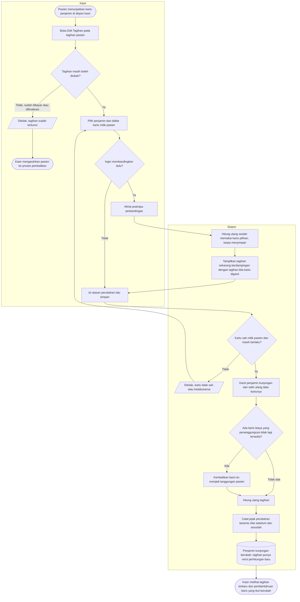

# Alur Proses — Mengganti Penjamin Kunjungan dari Layar Kasir

> Revisi blueprint `1.1`, status **draft**. Masukan: `MPY-DEC-001`, `MPY-DEC-003`, `MPY-DEC-005`, `MPY-DEC-007`, `MPY-DES-001`–`004`, `MPY-DES-009`.
>
> Nama keadaan pada diagram ini sama persis dengan [`contracts/state-transition-matrix.md`](../contracts/state-transition-matrix.md). Kalimat penolakan yang sebenarnya hanya ada di [`contracts/validation-matrix.md`](../contracts/validation-matrix.md); node penolakan di sini cukup menyebut sebabnya.

## Kapan alur ini dipakai

Pasien sudah dilayani dan tagihannya sudah terbentuk, tetapi penjamin yang tercatat saat pendaftaran ternyata keliru atau tidak lengkap. Contoh yang paling sering: pasien lupa membawa kartu asuransi sehingga didaftarkan tunai, lalu kartunya baru ditunjukkan di depan kasir sebelum membayar.

Sebelum kemampuan ini ada, satu-satunya jalan adalah membatalkan kunjungan dan mendaftar ulang dari awal.

## Diagram

## Tabel langkah

| Langkah | Pelaku | Masukan yang dibutuhkan | Keluaran | Bila gagal |
| --- | --- | --- | --- | --- |
| Buka Edit Tagihan | Kasir | Tagihan pasien yang belum dibayar | Layar edit beserta daftar kartu penjamin milik pasien | Tombol edit tidak aktif; kasir membaca keterangan sebabnya di layar |
| Pilih penjamin | Kasir | Kartu asuransi atau kartu penjamin perusahaan yang sudah terdaftar atas nama pasien | Kartu terpilih pada isian | Kartu yang dibutuhkan tidak ada di daftar; kasir mengarahkan pasien ke Registrasi untuk mendaftarkan kartunya lebih dulu |
| Minta pratinjau perbandingan | Kasir | Kartu kandidat | Dua kolom angka berdampingan: tagihan sekarang dan tagihan bila kartu diganti | Pratinjau gagal dimuat; kasir mencoba lagi. Tidak ada data yang berubah karena pratinjau tidak menyimpan apa pun |
| Isi alasan lalu simpan | Kasir | Alasan perubahan | Perintah terkirim | Alasan kosong ditolak; kasir mengisinya |
| Periksa keabsahan kartu | Sistem | Kartu pilihan, tanggal pelayanan | Lolos atau ditolak | Ditolak; kasir memilih kartu lain atau mengarahkan pasien ke Registrasi |
| Ganti penjamin kunjungan | Sistem | Kartu yang sudah lolos | Penjamin kunjungan berubah, data kartunya disalin ulang | Seluruh perubahan dibatalkan; tidak ada satu pun yang tersimpan sebagian |
| Kembalikan baris yang penanggungnya hilang | Sistem | Daftar penanggung baris biaya | Baris itu menjadi tanggungan pasien | Ikut dibatalkan bersama seluruh perintah |
| Hitung ulang tagihan | Sistem | Penjamin baru, penanggung baris biaya terkini | Versi perhitungan baru | Ikut dibatalkan bersama seluruh perintah |
| Catat jejak perubahan | Sistem | Nilai sebelum dan sesudah | Satu baris riwayat yang tidak dapat dihapus | Ikut dibatalkan bersama seluruh perintah |

## Jalur pengecualian yang wajib terlihat di layar

| Keadaan | Yang dilihat kasir | Yang dilakukan kasir berikutnya |
| --- | --- | --- |
| Tagihan sudah dibayar sebagian atau seluruhnya | Tombol Edit Tagihan tidak aktif beserta keterangan sebabnya | Mengarahkan ke proses pembalikan, bukan pengeditan |
| Pasien belum punya kartu penjamin terdaftar | Daftar pilihan kosong beserta keterangan | Mengarahkan pasien ke Registrasi untuk mendaftarkan kartunya |
| Kartu ada tetapi masa berlakunya sudah lewat | Kartu tampil tetapi tidak dapat dipilih, beserta alasannya | Memilih kartu lain, atau meminta Registrasi memperbarui masa berlaku |
| Perusahaan penjamin belum punya aturan tanggungan | Perubahan tetap berhasil, tetapi hasil perhitungan menunjukkan nol tertanggung | Meneruskan ke Admin Master Data agar aturan tanggungan perusahaan itu dilengkapi |
| Ada baris biaya yang penanggungnya ikut berubah | Pemberitahuan yang menyebut berapa baris yang dikembalikan menjadi tanggungan pasien | Memeriksa baris-baris itu, dan bila perlu mengubah penanggungnya lewat Edit Status Tagihan |
| Data tagihan berubah di layar lain saat kasir sedang mengedit | Pemberitahuan bahwa data sudah berubah | Memuat ulang layar lalu mengulangi perubahan |

## Catatan penting

Satu kunjungan tetap hanya punya **satu** penjamin yang berlaku. Alur ini **mengganti**, bukan **menambah** — tidak ada keadaan di mana sebuah kunjungan memiliki asuransi pribadi dan penjamin perusahaan yang aktif bersamaan (`MPY-DEC-001`).

Perubahan ini tidak memerlukan persetujuan orang kedua (`MPY-DEC-005`). Kendalinya bukan pada pencegahan di depan, melainkan pada jejak yang lengkap dan tidak dapat dihapus sesudahnya.

Trace `MPY-DEC-001`, `MPY-DEC-003`, `MPY-DEC-005`, `MPY-DEC-007`, `MPY-DES-001`–`004`, `MPY-DES-009`. Tests `BIL-AT-081`–`088`.
